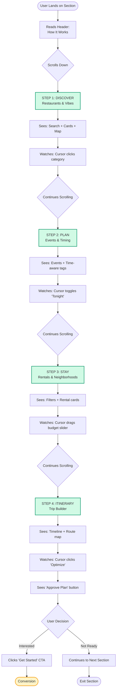
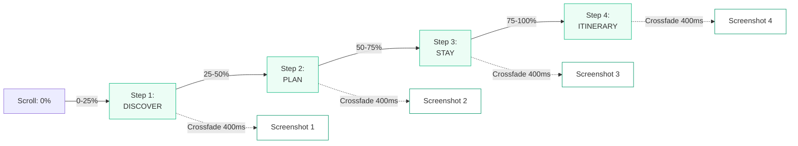
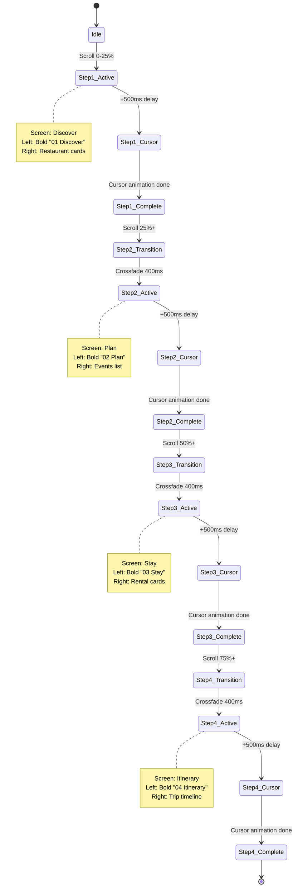
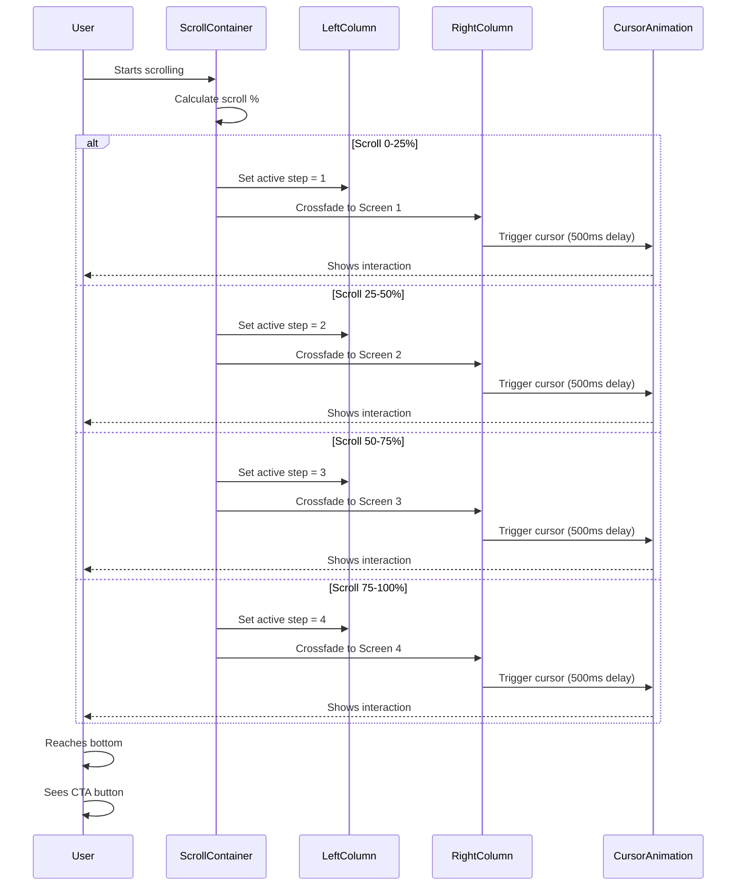
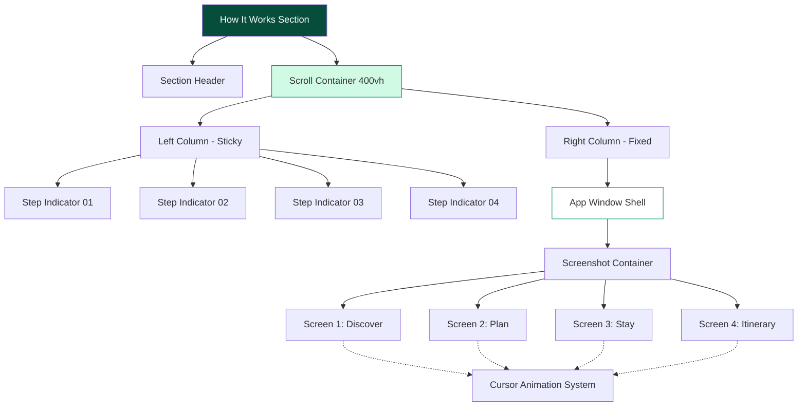

# HOW IT WORKS — SCROLL-DRIVEN PRODUCT DEMO
## I Love Medellín — AI Concierge
**Design Planning Document**

---

## 1. DESIGN ROLE & INTENT

### Designer Role
You are a **Senior Product Designer** creating a **luxury, premium, intelligent** homepage section.

### Design Goals
- **Build trust** through real dashboard UI (not marketing illustrations)
- **Demonstrate clarity** in how the AI concierge works
- **Exude calm sophistication** with refined interactions
- **Show real product value** through progressive disclosure

### Success Metrics
- Users understand it's **real product UI** in 5 seconds
- Each scroll step shows a **different module** clearly
- AI feels **helpful, not overwhelming**
- Design feels **premium and calm** (no neon, no clutter)

---

## 2. LAYOUT & STRUCTURE (DESKTOP FIRST)

### Grid System
```
┌─────────────────────────────────────────────────────────┐
│                    SECTION HEADER                        │
│                  (HOW IT WORKS)                          │
└─────────────────────────────────────────────────────────┘
┌──────────────────────┬──────────────────────────────────┐
│   LEFT COLUMN (40%)  │   RIGHT COLUMN (60%)             │
│   ─────────────────  │   ──────────────────────────     │
│   STICKY NARRATIVE   │   FIXED APP WINDOW               │
│                      │                                   │
│   ┌──────────────┐   │   ┌────────────────────────┐    │
│   │ Step 01      │   │   │  ┌──┐  Dashboard      │    │
│   │ DISCOVER     │   │   │  │••│  Chrome         │    │
│   │              │◄──┼───┼─►│  │  ──────────     │    │
│   │ Tell us your │   │   │  └──┘                 │    │
│   │ vibe...      │   │   │                        │    │
│   └──────────────┘   │   │  [CROSSFADING         │    │
│                      │   │   SCREENSHOTS]         │    │
│   ┌──────────────┐   │   │                        │    │
│   │ Step 02      │   │   │  • Cursor animations  │    │
│   │ PLAN         │   │   │  • Smooth transitions │    │
│   └──────────────┘   │   │  • Real UI elements   │    │
│                      │   │                        │    │
│   ┌──────────────┐   │   └────────────────────────┘    │
│   │ Step 03      │   │                                   │
│   │ STAY         │   │   Caption: "Real dashboard       │
│   └──────────────┘   │   screens — not mockups"         │
│                      │                                   │
│   ┌──────────────┐   │                                   │
│   │ Step 04      │   │                                   │
│   │ ITINERARY    │   │                                   │
│   └──────────────┘   │                                   │
└──────────────────────┴──────────────────────────────────┘
```

### Layout Specifications

| Element | Width | Behavior | Z-Index |
|---------|-------|----------|---------|
| Left Column | 40% | Sticky | 10 |
| Right Column | 60% | Fixed | 5 |
| App Window | 100% of column | Fixed position | 1 |
| Section Height | 400vh | Scroll container | - |
| Gap | 24-32px | Responsive | - |

### Scroll Logic
- **Total section height:** 400vh (4 viewport heights)
- **Step distribution:** 25% scroll per step
- **Trigger points:**
  - 0-25% → Step 1 (Discover)
  - 25-50% → Step 2 (Plan)
  - 50-75% → Step 3 (Stay)
  - 75-100% → Step 4 (Itinerary)

---

## 3. VISUAL STYLE SYSTEM

### Color Palette
```css
/* Primary Colors */
--emerald-950: #064e3b;  /* Active indicators, primary actions */
--emerald-600: #059669;  /* Highlights, badges */
--emerald-500: #10b981;  /* Accents */
--emerald-100: #d1fae5;  /* Soft backgrounds */
--emerald-50: #ecfdf5;   /* Subtle tints */

/* Accent Colors */
--amber-500: #f59e0b;    /* Sparingly for CTAs */
--amber-100: #fef3c7;    /* Highlight backgrounds */

/* Neutrals */
--slate-50: #f8fafc;     /* Section background */
--slate-100: #f1f5f9;    /* Borders */
--slate-600: #475569;    /* Body text */
--slate-900: #0f172a;    /* Headlines */
--white: #ffffff;        /* Cards, app window */
```

### Typography Scale
```css
/* Eyebrow */
font-size: 12-14px;
font-weight: 700;
text-transform: uppercase;
letter-spacing: 0.1em;
color: var(--amber-500);

/* Section Headline */
font-family: serif;
font-size: 48-64px;
font-weight: 700;
line-height: 1.1;
color: var(--slate-900);

/* Step Titles */
font-size: 28-36px;
font-weight: 700;
color: var(--slate-900);

/* Step Descriptions */
font-size: 16-18px;
font-weight: 400;
line-height: 1.6;
color: var(--slate-600);

/* UI Elements */
font-size: 14-16px;
font-weight: 500;
color: var(--slate-600);
```

### Spacing & Borders
```css
/* Rounded Corners */
--radius-sm: 8px;
--radius-md: 16px;
--radius-lg: 20px;
--radius-xl: 24px;

/* Shadows */
--shadow-sm: 0 1px 2px 0 rgb(0 0 0 / 0.05);
--shadow-md: 0 4px 6px -1px rgb(0 0 0 / 0.1);
--shadow-lg: 0 10px 15px -3px rgb(0 0 0 / 0.1);
--shadow-xl: 0 20px 25px -5px rgb(0 0 0 / 0.1);

/* Borders */
--border-hairline: 1px solid var(--slate-100);
```

### Design Principles
- ✅ Soft shadows only (no harsh edges)
- ✅ Rounded corners (16-24px)
- ✅ Minimal borders (hairline only)
- ❌ No neon colors
- ❌ No glassmorphism
- ❌ No heavy gradients
- ❌ No excessive animation

---

## 4. SECTION HEADER

### Header Content
```
┌───────────────────────────────────────────────────┐
│                                                   │
│         [HOW IT WORKS] ← Eyebrow (amber)         │
│                                                   │
│    Medellín, organized by one AI concierge.      │
│              ↑ Headline (serif, large)            │
│                                                   │
│   Restaurants, events, rentals, and itineraries  │
│        — suggested intelligently, approved by you │
│              ↑ Subtext (slate-600)                │
│                                                   │
│   ┌──────────┬──────────┬──────────┐            │
│   │ ✓ Preview│ ✓ Approve│ ✓ Undo   │            │
│   │   first  │  actions │  anytime │            │
│   └──────────┴──────────┴──────────┘            │
│      ↑ Trust indicators (micro-text)             │
└───────────────────────────────────────────────────┘
```

### Header Specifications
- **Alignment:** Center
- **Max width:** 800px
- **Padding:** 80px top, 60px bottom
- **Background:** White (#ffffff)

---

## 5. MULTI-STEP SCREENS (DETAILED SPECIFICATIONS)

### STEP 1 — DISCOVER (Restaurants + Vibes)
**Scroll Range:** 0-25%

#### Left Column Content
```
┌────────────────────────────────────┐
│ 01                                 │
│                                    │
│ Discover                           │
│ ────────                           │
│                                    │
│ Tell us your vibe. We surface      │
│ the best nearby picks.             │
│                                    │
│ [Active indicator: emerald bar]    │
└────────────────────────────────────┘
```

#### Right Panel Screenshot Elements
```
┌─────────────────────────────────────────────┐
│ ┌─┐ Live Dashboard Preview                 │
│ │•│ ─────────────────────────              │
│ └─┘                                         │
├─────────────────────────────────────────────┤
│ Sidebar | Main Content       | Map Panel   │
├─────────┼────────────────────┼─────────────┤
│         │ Exploring El Poblado              │
│ Home ✓  │ 📍 El Poblado                     │
│ Chats   │                                   │
│ Trips   │ Search places, vibes, cravings... │
│ Events  │                                   │
│ Rentals │ [All] Restaurants Coffee Nightlife│
│         │                                   │
│         │ ──────────────────────            │
│         │ ✨ Thursday Afternoon in El Poblado│
│         │ 24°C — perfect rooftop coffee     │
│         │ ──────────────────────            │
│         │                                   │
│         │ Restaurants           See more >  │
│         │ ┌──────────────────┐              │
│         │ │ [Photo]          │  ┌─────────┐ │
│         │ │ El Cielo         │  │  Map    │ │
│         │ │ ⭐ 4.8 · $$ · 0.5km │  │  with  │ │
│         │ │ 🎯 AI pick       │  │  pins   │ │
│         │ └──────────────────┘  │         │ │
│         │ ┌──────────────────┐  └─────────┘ │
│         │ │ [Photo] Carmen   │              │
│         │ │ ⭐ 4.9 · $$$ · 1.2km              │
│         │ │ 👥 Popular locals│              │
│         │ └──────────────────┘              │
└─────────────────────────────────────────────┘
```

#### Cursor Animation
1. **Cursor appears** at top right
2. **Moves to** "Restaurants" chip
3. **Clicks** chip (subtle scale effect)
4. **One card highlights** with emerald border
5. **Map pin glows** emerald (synchronized)
6. **Duration:** 2-3 seconds total

---

### STEP 2 — PLAN (Events + Time-Aware)
**Scroll Range:** 25-50%

#### Left Column Content
```
┌────────────────────────────────────┐
│ 02                                 │
│                                    │
│ Plan                               │
│ ────                               │
│                                    │
│ AI matches your time and location  │
│ with what's happening.             │
│                                    │
│ [Active indicator: emerald bar]    │
└────────────────────────────────────┘
```

#### Right Panel Screenshot Elements
```
┌─────────────────────────────────────────────┐
│ Tonight in Laureles                         │
│ 📍 Laureles                                 │
│                                             │
│ Search events, venues, vibes...             │
│                                             │
│ [Tonight ✓] This Weekend  Live Music        │
│                                             │
│ ──────────────────────────────────          │
│ ⏰ Tonight's Plan — Based on your vibe      │
│ Cool evening, low rain risk.                │
│ Best start time: 8:00 PM                    │
│ ──────────────────────────────────          │
│                                             │
│ Events Near You              See more >     │
│ ┌────────────────────────┐                  │
│ │ [Photo] Live Music     │  ┌────────────┐  │
│ │ Jazz Night @ Alambique │  │ Map with   │  │
│ │ ⏰ 8:00 PM · 1.5km     │  │ venue pins │  │
│ │ 🎯 Best match          │  └────────────┘  │
│ └────────────────────────┘                  │
│ ┌────────────────────────┐                  │
│ │ [Photo] Culture        │                  │
│ │ Art Gallery Opening    │                  │
│ │ ⏰ 7:30 PM · 2.1km     │                  │
│ └────────────────────────┘                  │
└─────────────────────────────────────────────┘
```

#### Cursor Animation
1. **Cursor hovers** "Tonight" toggle
2. **Tooltip appears:** "Best time: 8:00 PM — short Uber"
3. **Fades in** over 200ms
4. **Stays** for 1.5s
5. **Fades out** over 200ms

---

### STEP 3 — STAY (Rentals + Neighborhood)
**Scroll Range:** 50-75%

#### Left Column Content
```
┌────────────────────────────────────┐
│ 03                                 │
│                                    │
│ Stay                               │
│ ────                               │
│                                    │
│ Find the right neighborhood,       │
│ not just a listing.                │
│                                    │
│ [Active indicator: emerald bar]    │
└────────────────────────────────────┘
```

#### Right Panel Screenshot Elements
```
┌─────────────────────────────────────────────┐
│ Stays in Envigado                           │
│ 📍 Envigado                                 │
│                                             │
│ Search rentals, neighborhoods, needs...     │
│                                             │
│ [Short stay] Monthly ✓  Fast Wi-Fi          │
│                                             │
│ Budget: $500 ──●──── $2000                  │
│ Stay length: 2 months | Sort: Best match    │
│                                             │
│ ──────────────────────────────────          │
│ 🏘️ Best neighborhoods for your stay        │
│ Envigado is calmer, walkable, great         │
│ for longer stays.                           │
│ ──────────────────────────────────          │
│                                             │
│ Top Matches                   See more >    │
│ ┌────────────────────────┐                  │
│ │ [Photo]                │  ┌────────────┐  │
│ │ Modern Studio          │  │ Map with   │  │
│ │ $850/mo · ⭐ 4.9 (23)  │  │ rental pins│  │
│ │ Fast Wi-Fi · Quiet     │  │ Emerald =  │  │
│ │ 🎯 Matches your stay   │  │ suggested  │  │
│ └────────────────────────┘  └────────────┘  │
│ ┌────────────────────────┐                  │
│ │ [Photo] Cozy Loft      │                  │
│ │ $920/mo · ⭐ 4.8 (17)  │                  │
│ │ Near cafés + gym       │                  │
│ └────────────────────────┘                  │
└─────────────────────────────────────────────┘
```

#### Cursor Animation
1. **Cursor moves to** budget slider
2. **Drags handle** slightly right (+$100)
3. **Cards subtly highlight** (opacity pulse)
4. **Map pins update** (new pins fade in)
5. **Duration:** 2-3 seconds

---

### STEP 4 — ITINERARY (Trip Builder)
**Scroll Range:** 75-100%

#### Left Column Content
```
┌────────────────────────────────────┐
│ 04                                 │
│                                    │
│ Itinerary                          │
│ ─────────                          │
│                                    │
│ Turn picks into a day plan.        │
│ Approve, save, go.                 │
│                                    │
│ [Active indicator: emerald bar]    │
└────────────────────────────────────┘
```

#### Right Panel Screenshot Elements
```
┌─────────────────────────────────────────────┐
│ Saturday in Medellín                        │
│ El Poblado → Laureles                       │
│                                             │
│ [Optimize route] [Share]                    │
│                                             │
│ MORNING                                     │
│ ┌────────────────────────┐                  │
│ │ 🏠 [Photo] Café Velvet │  ┌────────────┐  │
│ │ El Poblado · 9:00 AM   │  │ Map with   │  │
│ │ 🎯 AI pick             │  │ route line │  │
│ └────────────────────────┘  │ ① ② ③ ④   │  │
│                             │            │  │
│ AFTERNOON                   │ Numbered   │  │
│ ┌────────────────────────┐  │ pins      │  │
│ │ 🌳 Parque Lleras       │  └────────────┘  │
│ │ El Poblado · 2:00 PM   │                  │
│ │ 💾 Saved               │                  │
│ └────────────────────────┘                  │
│                                             │
│ NIGHT                                       │
│ ┌────────────────────────┐                  │
│ │ 🎵 Jazz Night          │                  │
│ │ Laureles · 8:00 PM     │                  │
│ │ 🎯 Best match          │                  │
│ └────────────────────────┘                  │
│                                             │
│ ✨ AI Suggestions                           │
│ Swap dinner to reduce travel (-18 min)      │
│ [Apply]                                     │
│                                             │
│ ┌─────────────────────────────────────┐     │
│ │ Preview mode · Nothing booked yet   │     │
│ │                    [Approve plan]   │     │
│ └─────────────────────────────────────┘     │
└─────────────────────────────────────────────┘
```

#### Cursor Animation
1. **Cursor clicks** "Optimize route" button
2. **Button scales** slightly (0.98)
3. **Route line highlights** on map (emerald glow)
4. **Toast appears:** "Saved to Trip ✓"
5. **Toast fades out** after 2s

---

## 6. RESPONSIVE WIREFRAMES

### Desktop (≥1024px)
```
┌──────────────┬─────────────────────────┐
│   STICKY     │    FIXED APP WINDOW     │
│   LEFT       │                         │
│   NARRATIVE  │   [CROSSFADING          │
│              │    SCREENSHOTS]         │
│   Steps      │                         │
│   01-04      │   + Cursor animations   │
│              │                         │
└──────────────┴─────────────────────────┘
Behavior: Scroll-driven transitions
Height: 400vh
```

### Tablet (768px - 1023px)
```
┌──────────────────────────────────────┐
│         SCROLLING LAYOUT             │
│                                      │
│  ┌────────────────────────────────┐  │
│  │ Step 01: DISCOVER              │  │
│  │ (Text description)             │  │
│  └────────────────────────────────┘  │
│  ┌────────────────────────────────┐  │
│  │ [Screenshot - static]          │  │
│  └────────────────────────────────┘  │
│                                      │
│  ┌────────────────────────────────┐  │
│  │ Step 02: PLAN                  │  │
│  └────────────────────────────────┘  │
│  ┌────────────────────────────────┐  │
│  │ [Screenshot - static]          │  │
│  └────────────────────────────────┘  │
└──────────────────────────────────────┘
Behavior: Fade transitions only
No fixed panels
Reduced motion
```

### Mobile (≤767px)
```
┌──────────────────────┐
│   STACKED LAYOUT     │
│                      │
│  ──────────────────  │
│  01 DISCOVER         │
│  Tell us your vibe   │
│  ──────────────────  │
│                      │
│  ┌────────────────┐  │
│  │ [Screenshot]   │  │
│  │ (Final state)  │  │
│  └────────────────┘  │
│                      │
│  ──────────────────  │
│  02 PLAN             │
│  AI matches time     │
│  ──────────────────  │
│                      │
│  ┌────────────────┐  │
│  │ [Screenshot]   │  │
│  └────────────────┘  │
│                      │
│  (Continues...)      │
└──────────────────────┘
Behavior: Static screenshots
No cursor animations
Simple scroll
```

---

## 7. ANIMATION & SCROLL EFFECT PLANNING

### Animation Timing
```javascript
// Crossfade between screens
duration: 400ms
easing: ease-in-out
delay: 0ms

// Step indicator transition
duration: 300ms
easing: ease-out
delay: 0ms

// Cursor movement
duration: 800-1200ms (per action)
easing: cubic-bezier(0.4, 0.0, 0.2, 1)
delay: 500ms (after screen change)

// Tooltip fade
fade-in: 200ms
stay: 1500ms
fade-out: 200ms
```

### Motion Principles
1. **Calm & Intentional**
   - No bounce effects
   - No overshoot
   - Smooth, linear-ish easing

2. **Responsive to Scroll**
   - Crossfade opacity: 0 → 1
   - No slide animations
   - Instant screen swap on scroll threshold

3. **Cursor Choreography**
   - One interaction per step
   - Natural movement speed
   - Subtle UI feedback
   - Disappears between steps

4. **Accessibility**
   - Respect `prefers-reduced-motion`
   - Fallback: static swap (no crossfade)
   - No flashing or strobing
   - Cursor visible but not distracting

### Animation States
```
Screen Transition States:
┌─────────┐     ┌─────────┐     ┌─────────┐
│ Screen  │ ──► │ Crossf. │ ──► │ Screen  │
│   A     │     │ Blend   │     │   B     │
│ α=1.0   │     │ α=0.5   │     │ α=1.0   │
└─────────┘     └─────────┘     └─────────┘
   0-24%          24-26%          26-50%

Cursor States:
┌─────────┐     ┌─────────┐     ┌─────────┐     ┌─────────┐
│ Hidden  │ ──► │ Move to │ ──► │ Interact│ ──► │ Fade    │
│         │     │ Target  │     │ (Click) │     │ Out     │
└─────────┘     └─────────┘     └─────────┘     └─────────┘
  +500ms         +800ms          +200ms          +300ms
```

---

## 8. FLOW & TRANSITIONS (MERMAID DIAGRAMS)

### User Journey Flow


### Scroll Progress System


### Screen State Machine


### Component Interaction Flow


---

## 9. TECHNICAL IMPLEMENTATION NOTES

### Scroll Detection
```typescript
// Pseudo-code for scroll progress calculation
const calculateScrollProgress = () => {
  const container = containerRef.current;
  const rect = container.getBoundingClientRect();
  const scrollTop = -rect.top;
  const scrollableHeight = container.offsetHeight - window.innerHeight;
  const progress = Math.max(0, Math.min(1, scrollTop / scrollableHeight));
  
  // Determine active step (0-3)
  const step = Math.floor(progress * 4);
  setActiveStep(Math.min(3, step));
};
```

### Cursor Animation Pattern
```typescript
// Pseudo-code for cursor choreography
const cursorSequence = {
  step1: [
    { action: 'move', target: '.category-chip', duration: 800 },
    { action: 'click', duration: 200 },
    { action: 'highlight', target: '.card', duration: 300 },
    { action: 'glow', target: '.map-pin', duration: 300 }
  ],
  step2: [
    { action: 'move', target: '.toggle-tonight', duration: 800 },
    { action: 'hover', duration: 300 },
    { action: 'tooltip', content: 'Best time: 8:00 PM', duration: 1500 }
  ],
  // ... etc
};
```

### Accessibility Considerations
```typescript
// Respect user preferences
const prefersReducedMotion = window.matchMedia(
  '(prefers-reduced-motion: reduce)'
).matches;

if (prefersReducedMotion) {
  // Disable crossfades, use instant swap
  // Disable cursor animations
  // Show static final states only
}
```

---

## 10. DESIGN DELIVERABLES CHECKLIST

### Required Assets
- [ ] Section header (desktop, tablet, mobile)
- [ ] 4 step indicators (active + inactive states)
- [ ] 4 dashboard screenshots (high-fidelity)
- [ ] Cursor sprite/icon (custom or system)
- [ ] App window chrome (browser dots)
- [ ] Trust indicator icons (checkmarks)

### Design Files
- [ ] Desktop layout (1440px viewport)
- [ ] Tablet layout (768px viewport)
- [ ] Mobile layout (375px viewport)
- [ ] Component states (hover, active, disabled)
- [ ] Animation storyboards (all 4 cursor sequences)
- [ ] Color palette documentation
- [ ] Typography scale reference

### Developer Handoff
- [ ] Spacing/sizing specs (margins, padding, gaps)
- [ ] Breakpoint definitions
- [ ] Animation timing values
- [ ] Scroll thresholds (25%, 50%, 75%)
- [ ] Z-index hierarchy
- [ ] Accessibility requirements

---

## 11. SUCCESS METRICS & TESTING

### User Testing Goals
1. **Comprehension Test**
   - Can users explain how the system works after viewing?
   - Target: 90%+ comprehension

2. **Trust Signal**
   - Do users perceive it as a real product?
   - Target: 85%+ say "yes, this looks real"

3. **Engagement**
   - Do users scroll through all 4 steps?
   - Target: 70%+ complete scroll

4. **Call-to-Action**
   - Do users click "Get Started" after viewing?
   - Target: 15%+ click-through rate

### Performance Metrics
- [ ] Page load time < 2s
- [ ] Scroll FPS ≥ 60
- [ ] Animation jank score < 5%
- [ ] Lighthouse accessibility score ≥ 95

---

## 12. INSPIRATION & REFERENCE

### Design Patterns
- **Breef.com** — Scroll-driven narrative with fixed window
- **Linear.app** — Calm, sophisticated product UI
- **Stripe.com** — Elegant scroll-triggered animations
- **Apple.com** — Premium motion design

### Key Principles from Reference
1. **Sticky narrative** keeps context while content changes
2. **Fixed product window** focuses attention
3. **Minimal cursor choreography** guides without overwhelming
4. **Real UI screenshots** build credibility
5. **Calm transitions** feel expensive and intentional

---

## APPENDIX: MERMAID DIAGRAM SYNTAX REFERENCE

### System Architecture Diagram


---

**Document Version:** 1.0  
**Last Updated:** 2026-01-19  
**Status:** ✅ Ready for Design Implementation
