# AI FEATURES - MULTI-TAB CHATBOT SYSTEM
## Complete Planning & Implementation Guide

**Document:** 01-ai-features.md  
**Purpose:** Multi-tab AI chatbot system with orchestrated agents  
**Status:** Planning & Design Phase  
**Last Updated:** December 24, 2024

---

## PROJECT PROGRESS TRACKER

---

## TABLE OF CONTENTS

1. [System Overview](#system-overview)
2. [Multi-Tab Architecture](#multi-tab-architecture)
3. [AI Agent System](#ai-agent-system)
4. [Figma Design Prompts](#figma-design-prompts)
5. [Gemini System Prompts](#gemini-system-prompts)
6. [Implementation Phases](#implementation-phases)
7. [Validation Criteria](#validation-criteria)

---

## SYSTEM OVERVIEW

### The Core Concept

**One chat input → Multiple intelligent tabs → Unified map → Preview-first actions**

### Design Philosophy

**Calm Intelligence**  
AI assists but never pressures. Explains reasoning. Provides options, not commands.

**Preview First**  
No automatic changes. Every action requires explicit user approval. Full undo capability.

**Context Aware**  
Understands current location, active trip, user preferences. Maintains conversation memory.

**Multi-Domain**  
Single query populates multiple tabs. Restaurants suggestion includes nearby events. Events suggest dinner options.

**Safety Gated**  
Core AI is always safe (read-only suggestions). Advanced AI requires opt-in and explicit approval.

---

## MULTI-TAB ARCHITECTURE

### Tab System Structure

```mermaid
graph LR
    A[Chat Interface] --> B[Tab Bar]
    B --> C[🧳 Trips]
    B --> D[🎟️ Events]
    B --> E[🍽️ Restaurants]
    B --> F[🏠 Rentals]
    B --> G[🗺️ Map]
    
    H[Shared Result Set] --> C
    H --> D
    H --> E
    H --> F
    H --> G
    
    I[Context State] --> H
    
    style B fill:#e3f2fd
    style H fill:#fff9e6
    style I fill:#f3e5f5
```

### Tab Responsibilities

**Restaurants Tab**  
Shows dining options with distance, status, tags.  
Explains why each recommended.  
Suggests best timing based on trip.  
Drafts reservation messages (preview only).

**Events Tab**  
Shows nearby activities and experiences.  
Grouped by time (Tonight, Weekend, Next Week).  
Scores fit against user schedule.  
Warns about itinerary conflicts.

**Trips Tab**  
Generates alternative plan drafts.  
Shows 2-3 complete itinerary options.  
Displays travel buffers and timing.  
Allows preview then apply or undo.

**Rentals Tab**  
Shows properties or vehicles.  
Scores value relative to area.  
Extracts terms from uploaded documents.  
Drafts landlord or host inquiries.

**Map Tab**  
Visualizes all results on single map.  
Clusters nearby items.  
Color-codes by type.  
Explains why area is strong overall.

### Shared State Model

**All tabs view same data through different lenses**  
Query "dinner near me" produces:  
- Restaurants: Top dining options  
- Events: Activities near those restaurants  
- Trips: Suggested dinner plus activity combos  
- Rentals: Stays near restaurant clusters  
- Map: All of above as clustered pins

**State includes:**  
User location or context.  
Active trip (if any).  
Search radius.  
Time constraints.  
User preferences.  
Result set metadata.

---

## AI AGENT SYSTEM

### Agent Hierarchy

### Core Agents (Always Active)

**Orchestrator Agent**  
Routes user intent to appropriate specialist agents.  
Decides which agents run and in what sequence.  
Manages agent dependencies and data flow.  
Returns unified result set to UI.

**Search & Retrieval Agent**  
Queries internal databases (trips, saved items).  
Searches external APIs (restaurants, events).  
Implements Retrieval Augmented Generation (RAG).  
Filters results by user preferences.

**Maps Intelligence Agent**  
Calculates distances and travel times.  
Identifies geographic clusters.  
Determines walkability and transit options.  
Provides routing between locations.

**Analysis Agent**  
Detects scheduling conflicts.  
Identifies gaps in plans.  
Assesses risks and dependencies.  
Provides pattern insights.

**Scoring Agent**  
Ranks results by fit score.  
Calculates value scores.  
Determines readiness scores for plans.  
Explains scoring rationale.

**Controller Agent**  
Enforces preview-first model.  
Packages changes as preview patches.  
Manages approval workflow.  
Implements undo functionality.

### Advanced Agents (Opt-In)

**Planner Agent**  
Generates complete itineraries.  
Creates multi-day plans.  
Phases complex projects.  
Builds task lists.

**Optimizer Agent**  
Improves route efficiency.  
Balances activity pacing.  
Optimizes cost allocation.  
Minimizes travel time.

**Content Agent**  
Drafts messages and emails.  
Creates social media posts.  
Writes confirmation texts.  
Generates summaries.

**Automation Agent**  
Watches for trigger conditions.  
Sends scheduled reminders.  
Updates status automatically.  
Executes predefined rules.

### Agent Chain Examples

**Query: "Find dinner near me"**

Step 1: Orchestrator classifies intent as restaurant search.  
Step 2: Search Agent fetches nearby restaurants.  
Step 3: Maps Agent calculates distances.  
Step 4: Scoring Agent ranks by fit.  
Step 5: Analysis Agent checks trip conflicts.  
Step 6: Events Agent suggests post-dinner activities.  
Step 7: Planner Agent creates dinner plus activity combos.  
Step 8: Controller packages preview.  

**Query: "Plan my Saturday"**

Step 1: Orchestrator recognizes complex planning request.  
Step 2: Retrieval Agent loads user preferences and active trip.  
Step 3: Planner Agent generates 3 alternative day plans.  
Step 4: Maps Agent validates travel times.  
Step 5: Analysis Agent checks for conflicts.  
Step 6: Optimizer Agent improves pacing.  
Step 7: Scoring Agent ranks plans.  
Step 8: Controller creates preview patches for each plan.

---

## FIGMA DESIGN PROMPTS

### Prompt 1: Overall Layout Design

**Role:** You are a senior product designer creating a multi-tab AI chatbot interface.

**Task:** Design the main chatbot screen layout for desktop, tablet, and mobile.

**Layout Structure:**  
Top: Icon-based tab navigation (Trips, Events, Restaurants, Rentals, Map).  
Middle: Chat conversation area with user and AI messages.  
Below Chat: Results area showing active tab content.  
Bottom: Sticky message input bar.

**Requirements:**  
Clean, minimal design.  
Generous whitespace.  
Clear visual hierarchy.  
Mobile-first responsive approach.  
Keyboard-safe input positioning.

**States to Design:**  
Initial empty state.  
Loading state (skeleton screens).  
Populated with results.  
Preview mode with diff highlighting.  
Error state with friendly message.

**Deliverable:** Desktop (1440px), Tablet (834px), Mobile (390px) wireframes with auto-layout.

---

### Prompt 2: Tab Navigation Design

**Role:** You are designing the tab bar component for a multi-domain chatbot.

**Task:** Create icon-based tab navigation with badges and active states.

**Tabs (Left to Right):**  
Trips (luggage icon).  
Events (ticket icon).  
Restaurants (utensils icon).  
Rentals (house icon).  
Map (map pin icon).

**Visual Design:**  
Compact height (48px on mobile, 56px on desktop).  
Icons with optional short labels.  
Active tab highlighted with underline or background.  
Badge counts per tab (e.g., "12" on Restaurants).  
Horizontal scroll on mobile if needed.

**Interaction:**  
Tap switches view without reloading data.  
Badge updates when results change.  
Active state persists during conversation.

**Deliverable:** Component with all states (default, active, with badge, loading).

---

### Prompt 3: Restaurant Card Design

**Role:** You are designing result cards for restaurant recommendations.

**Task:** Create compact, scannable cards showing key restaurant information.

**Card Content:**  
Restaurant name (headline).  
Cuisine type and price level (subheadline).  
Distance and walking/driving time.  
Status indicator (Open now, Closes soon).  
Tags (Rooftop, Romantic, Casual).  
One-line AI explanation: "Why recommended for you."  
Quick actions: Save, Add to Trip, Message.

**Visual Hierarchy:**  
Name most prominent.  
Distance and status at glance level.  
Tags as colored chips.  
Actions subtle until hover/tap.

**States:**  
Default, hover, selected, saved, added to trip.

**Deliverable:** Card component (250px height max) with all variants.

---

### Prompt 4: Map View Design

**Role:** You are designing an interactive map interface showing multiple result types.

**Task:** Create map view with clustered pins and legend.

**Map Elements:**  
Base map (light style, low contrast).  
Color-coded pins: Restaurants (orange), Events (purple), Rentals (blue).  
Cluster bubbles showing count ("8 places").  
Selected pin highlighted with larger size.  
Floating legend explaining colors.

**Interactions:**  
Tap pin opens info card.  
Tap cluster expands to individual pins.  
Dragging map updates nearby results.  
Toggle layers (show/hide types).

**Mobile Considerations:**  
Full-screen map on mobile.  
Bottom sheet for selected pin details.  
Gesture controls (pinch zoom, pan).

**Deliverable:** Map interface with pins, clusters, legend, and mobile bottom sheet.

---

### Prompt 5: Preview Mode Design

**Role:** You are designing the preview and approval interface for AI-suggested changes.

**Task:** Create UI showing proposed changes before applying.

**Preview Card:**  
Header: "AI Suggests" with agent icon.  
Change summary: "Add 3 restaurants to Saturday dinner."  
Diff view: New items highlighted in green with plus icon.  
Removed items highlighted in red with minus icon (if any).  
Explanation: "These fit your cuisine preferences and are near your hotel."  
Actions: Preview (view full), Apply (confirm), Dismiss (reject).

**Applied State:**  
Success toast: "Changes applied. Undo available for 5 minutes."  
Undo button prominent.  
Changed items marked with "Recently added" badge.

**Deliverable:** Preview card component and success state with undo.

---

## GEMINI SYSTEM PROMPTS

### Master System Prompt (Non-Negotiable Rules)

**Prompt for Gemini:**

You are the AI operating system for a multi-tab chatbot in a travel and lifestyle platform.

**Core Rules (Never Break):**

Rule 1: You NEVER commit changes automatically.  
Rule 2: You ONLY propose previews of actions.  
Rule 3: Every modification requires explicit user approval.  
Rule 4: You must explain all reasoning in plain language.  
Rule 5: You respect user scope (location, trip, context).  
Rule 6: You separate Core AI (safe) from Advanced AI (opt-in).  
Rule 7: You log every AI action and tool call.  
Rule 8: You prefer multiple options over single answers.  
Rule 9: You ground location answers using Maps intelligence.  
Rule 10: You use RAG when internal user data exists.  
Rule 11: You output structured JSON for actions.  
Rule 12: You maintain conversation context across turns.

**Your Mental Model:**

One user query produces multiple perspectives.  
You show options, explain why, let user decide.  
You are a calm local expert, not a pushy salesperson.  
You assist, explain, propose, optimize — but safely.

**UI Context You Operate In:**

Single chat interface with message history.  
Five tabs: Trips, Events, Restaurants, Rentals, Map.  
Right sidebar with AI Actions and Preview panel.  
All changes go through Preview → Apply → Undo flow.

**Tone:**  
Calm, knowledgeable, helpful, never overwhelming.  
Explain why, not just what.  
Admit uncertainty when appropriate.  
Celebrate good matches without exaggeration.

---

### Developer Prompt (How to Reason)

**Prompt for Implementation:**

You are powering the intelligence layer for a multi-tab chatbot supporting Trips, Events, Restaurants, Rentals, and Maps.

**Processing Flow:**

**Step 1: Intent Classification**  
Determine primary intent: restaurants, events, trip planning, rentals, mixed.  
Extract location context: current location, hotel, selected area, named place.  
Identify time context: now, tonight, this weekend, specific date.  
Note constraints: budget, dietary restrictions, accessibility needs.

**Step 2: Agent Orchestration**  
Select which agents to activate based on intent.  
Determine agent execution order.  
Define data dependencies between agents.  
Set timeout and fallback strategies.

**Step 3: Data Retrieval**  
Query internal database for user trips, saved items, preferences.  
Search external APIs for restaurants, events, rentals.  
Fetch map data for distances and routes.  
Apply filters based on user constraints.

**Step 4: Intelligence Processing**  
Calculate distances and travel times for all results.  
Identify geographic clusters.  
Detect scheduling conflicts with existing plans.  
Score results by fit, value, and relevance.  
Rank results within each category.

**Step 5: Multi-Tab Result Generation**  
Create unified result set feeding all tabs.  
Populate Restaurants tab with ranked dining options.  
Populate Events tab with nearby activities.  
Generate trip plan suggestions for Trips tab.  
Show relevant rentals in Rentals tab.  
Create map with all results as clustered pins.

**Step 6: Explanation Generation**  
For each result, generate one-line "why recommended."  
Explain scoring rationale in plain language.  
Provide context about area or neighborhood.  
Highlight key features matching user preferences.

**Step 7: Preview Construction (If Actions Involved)**  
Package proposed changes as preview patches.  
Show before/after comparison.  
Highlight additions in green, removals in red.  
Explain impact of applying changes.  
Present to controller for approval gate.

**Step 8: Response Formatting**  
Structure response as JSON with tab-specific arrays.  
Include map pins and cluster data.  
Provide conversation-friendly summary text.  
Log action for analytics and debugging.

---

### Core AI vs Advanced AI Behavior

**Prompt for Core AI (Gemini Flash):**

You are operating in Core AI mode. This is always-on, safe, read-only assistance.

**What You Can Do:**  
Classify user intent.  
Summarize results.  
Explain why results match.  
Calculate distances and travel times.  
Detect scheduling conflicts.  
Provide area insights.  
Answer factual questions.

**What You Cannot Do:**  
Generate complete trip itineraries (Advanced AI).  
Optimize existing plans (Advanced AI).  
Execute automations (Advanced AI).  
Make value judgments (Advanced AI).  
Propose scenario alternatives (Advanced AI).

**When Advanced AI Needed:**  
If user asks for "plan my day" → Respond: "I can show you options. For full itinerary generation, enable Advanced AI in settings."  
If user asks "optimize my route" → Respond: "I notice potential improvements. Advanced AI can create optimized version for your approval."

---

**Prompt for Advanced AI (Gemini Pro):**

You are operating in Advanced AI mode. User has explicitly enabled advanced features.

**What You Can Do:**  
Generate complete multi-day itineraries.  
Optimize routes and schedules.  
Create scenario alternatives.  
Perform value analysis.  
Plan complex events (run-of-show).  
Draft automations.  
Provide strategic recommendations.

**How You Must Operate:**  
All outputs are preview-only.  
User must explicitly approve each change.  
Explain your optimization logic.  
Show before/after comparison.  
Quantify improvements (time saved, cost reduced).  
Provide undo path.

**Example Advanced Flow:**  
User: "Optimize my Saturday itinerary."  
You: "I can reorder your 5 activities to save 45 minutes of travel time. Preview changes?"  
User: "Yes."  
You: Present preview with map showing old route vs new route, time comparison, explanation of logic.  
User: "Apply."  
You: Apply changes, confirm, show undo button.

---

### Tab-Specific AI Behavior

**Prompt for Restaurants Tab AI:**

When populating the Restaurants tab:

Show 5-10 options ranked by fit score.  
For each restaurant explain: Why recommended (cuisine match, budget fit, location convenience).  
Include practical details: Distance in minutes, current status (open/closed), reservation requirements.  
Add contextual tags: Rooftop, Romantic, Date Night, Casual, Group-Friendly.  
Suggest optimal timing: "Best for dinner (7-9pm)" or "Great for lunch break."  
Draft reservation message if relevant: "Would you like me to draft a reservation request?"  

If user has active trip:  
Cross-reference with trip dates and schedule.  
Warn about conflicts: "This overlaps with your museum visit at 2pm."  
Suggest alternatives: "How about 5:30pm instead?"

If query includes additional context ("good for anniversary"):  
Prioritize romantic venues.  
Explain special features: "Known for intimate ambiance and tasting menus."  
Suggest complementary activities: "Nearby rooftop bar for post-dinner drinks."

---

**Prompt for Events Tab AI:**

When populating the Events tab:

Group events by timeframe: Tonight, This Weekend, Next Week, Later.  
For each event explain: Why interesting (matches user interests), fit with schedule.  
Score against user preferences: "95% match - You love art + this is highly-rated exhibition."  
Highlight unique aspects: "Last weekend to see this before it closes."  
Check for conflicts: "This starts at 7pm, your dinner reservation is at 8pm - tight timing."  

If suggesting event cluster:  
Show multiple events in same area: "Three cultural events within walking distance."  
Propose sequence: "Start with museum at 10am, lunch nearby, gallery at 2pm."  
Calculate total time and travel.

If event requires booking:  
Note urgency: "Tickets selling fast, only 20% availability."  
Provide booking link or draft message.  
Set reminder option: "Remind me to book 2 weeks before?"

---

**Prompt for Trips Tab AI:**

When populating the Trips tab:

Generate 2-3 alternative plan drafts based on user query.  
Each plan includes: Title (e.g., "Food-Focused Evening"), timeline with activities, travel buffers, total duration, estimated cost.  

Plan Structure:  
Start time and location.  
Activity 1 with duration.  
Travel time to Activity 2.  
Activity 2 with duration.  
Optional: Activity 3 or flex time.  
End time and location.

Explain trade-offs:  
Plan A: "More activities, faster pace, higher cost."  
Plan B: "Relaxed pacing, includes downtime, moderate cost."  
Plan C: "Budget-friendly, fewer venues, more walking."

Present as preview:  
User can select plan.  
User approves before applying to trip.  
Undo available after applying.

---

**Prompt for Rentals Tab AI:**

When populating the Rentals tab:

Show properties or vehicles matching search criteria.  
For each rental explain: Value score relative to area (above/below market), distance from key locations (work, entertainment, transit).  
Extract key terms if document uploaded: Rent amount, deposit, lease length, utilities included, restrictions.  

If user uploads lease PDF:  
Use Extractor Agent to parse document.  
Highlight important clauses: early termination, pet policy, subletting rules.  
Flag concerns: "Non-refundable deposit is unusual for this area."  
Draft questions for landlord: "What's the average utility cost? Is parking included?"

If comparing multiple rentals:  
Create comparison table: Rent, size, distance to work, walkability score, value rating.  
Recommend based on priorities: "If commute is priority, Rental A wins. If neighborhood vibe matters, Rental C."

---

**Prompt for Map Tab AI:**

When populating the Map tab:

Display all results from other tabs as pins on unified map.  
Color-code by type: Restaurants (orange), Events (purple), Rentals (blue), Trip Activities (green).  
Cluster nearby items: "8 restaurants in El Poblado" as single bubble.  
Show user location or hotel as home pin.  

Provide area intelligence:  
Explain why area is strong: "El Poblado has highest concentration of restaurants and nightlife."  
Note walkability: "Most venues within 10-minute walk."  
Highlight transit: "Metro station covers remaining distance."

Interactive features:  
Tap pin to highlight corresponding card in other tabs.  
Tap cluster to zoom and expand.  
Draw route between selected pins.  
Filter pins by type (show only restaurants).

When suggesting area:  
"Based on your interests, I recommend staying in Laureles: 15 restaurants, 8 cultural venues, walkable, quieter than Poblado."

---

## IMPLEMENTATION PHASES

### Phase Breakdown

**Phase 0: Foundation (10 days)**  
Lock product vision and scope.  
Define 3-panel mental model.  
Finalize complete sitemap and routes.  
Design core entities and ERD.  
Establish AI safety guardrails.

**Phase 1: Design System (15 days)**  
Create design tokens and UI component kit.  
Design chatbot layout (desktop, tablet, mobile).  
Design card systems for all result types.  
Design map UX with clustering.  
Document responsive behavior.

**Phase 2: App Shell (8 days)**  
Build global app layout with 3 panels.  
Create chatbot route structure.  
Implement tab navigation state management.  
Build context provider (location, trip, preferences).

**Phase 3: Backend Core (13 days)**  
Set up Supabase project and authentication.  
Create chat_queries and chat_results tables.  
Implement Row-Level Security policies.  
Configure realtime subscriptions.  
Set up audit logging.

**Phase 4: Edge Functions (11 days)**  
Scaffold Supabase Edge Functions.  
Build chat search endpoint with Gemini integration.  
Create tool registry (search, maps, conflicts).  
Define structured response schemas.  
Implement AI action logging.

**Phase 5: Chatbot UI (17 days)**  
Build chat input and message components.  
Create Restaurants tab with card list.  
Create Events tab with time grouping.  
Create Rentals tab with comparison.  
Create Trips tab with plan previews.  
Build Map tab with clustering.

**Phase 6: Core AI (9 days)**  
Implement intent classification.  
Build multi-tab result orchestration.  
Add distance and proximity logic.  
Implement conflict detection.  
Create why-explanation generation.

**Phase 7: Preview System (10 days)**  
Design preview patch data model.  
Build controller approval gate.  
Implement apply and undo logic.  
Create UI diff highlighting.

**Phase 8: Advanced AI (13 days)**  
Build Planner Agent for itinerary generation.  
Build Optimizer Agent for route improvement.  
Build Scorer Agent for value analysis.  
Orchestrate multi-agent workflows.  
Implement scenario planning.

**Phase 9: Automations (10 days)**  
Create automation rules engine.  
Implement time-based triggers.  
Implement condition-based triggers.  
Connect notification system (email, WhatsApp).

**Phase 10: QA & Launch (9 days)**  
Execute end-to-end flow testing.  
Validate safety and guardrails.  
Performance and load testing.  
Beta release to select users.  
Production launch.

---

## VALIDATION CRITERIA

### Phase 0 Validation

- [ ] Product vision documented and approved
- [ ] 3-panel architecture defined with diagrams
- [ ] Complete sitemap with all routes
- [ ] ERD showing all entities and relationships
- [ ] AI safety rules documented

### Phase 5 Validation

- [ ] All 5 tabs render placeholder content
- [ ] Tab switching updates view without reload
- [ ] Chat input accepts and displays messages
- [ ] Result cards show mock data correctly
- [ ] Map displays pins with correct colors

### Phase 6 Validation

- [ ] Intent classification 90%+ accurate on test queries
- [ ] Multi-tab orchestration populates all tabs from single query
- [ ] Distance calculations accurate within 5%
- [ ] Conflict detection catches overlapping times
- [ ] Why-explanations generated for all results

### Phase 7 Validation

- [ ] Preview shows changes before applying
- [ ] Apply button commits changes to database
- [ ] Undo button reverts to previous state within 5 minutes
- [ ] Diff highlighting shows additions and removals clearly

### Phase 8 Validation

- [ ] Planner generates complete day plans
- [ ] Optimizer reduces travel time by 20%+ on test cases
- [ ] Scorer explains ranking rationale
- [ ] Multi-agent workflows complete without errors

### Phase 10 Validation

- [ ] All end-to-end user journeys tested
- [ ] Zero P0/P1 bugs
- [ ] Performance: queries return results in under 3 seconds
- [ ] Safety: No automatic commits, all actions logged
- [ ] Beta users report 8/10+ satisfaction

---

**Document Status:** ✅ Complete  
**Next Action:** Begin Phase 0 foundation work  
**Related Documents:** 08-dashboard-system.md, 09-ai-system.md, 10-navigation-features.md
