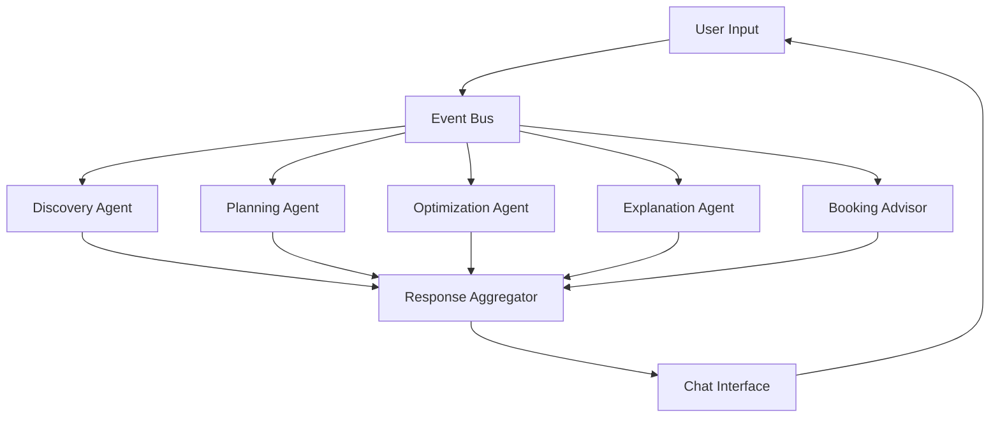
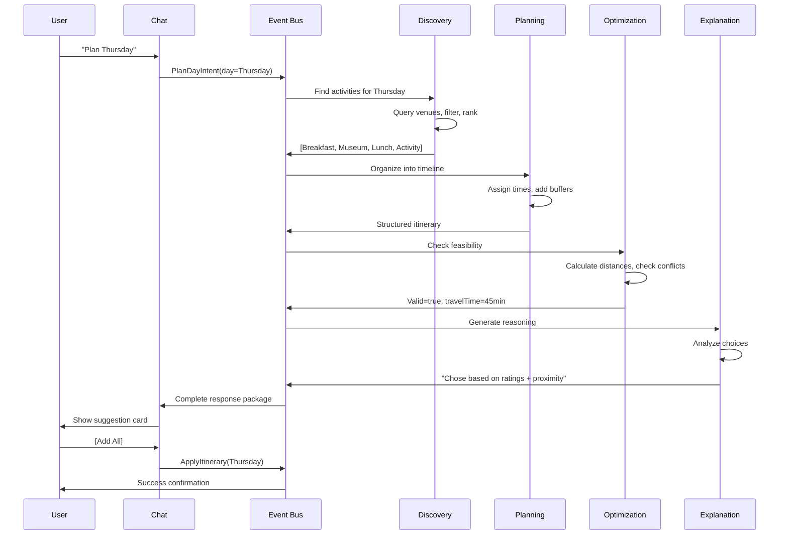
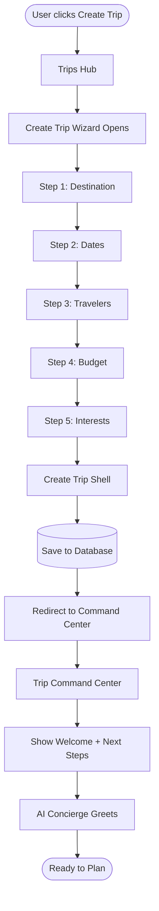
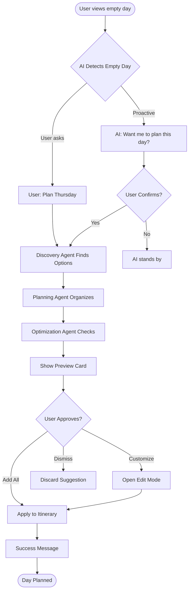
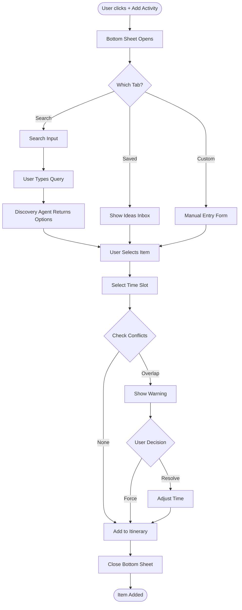
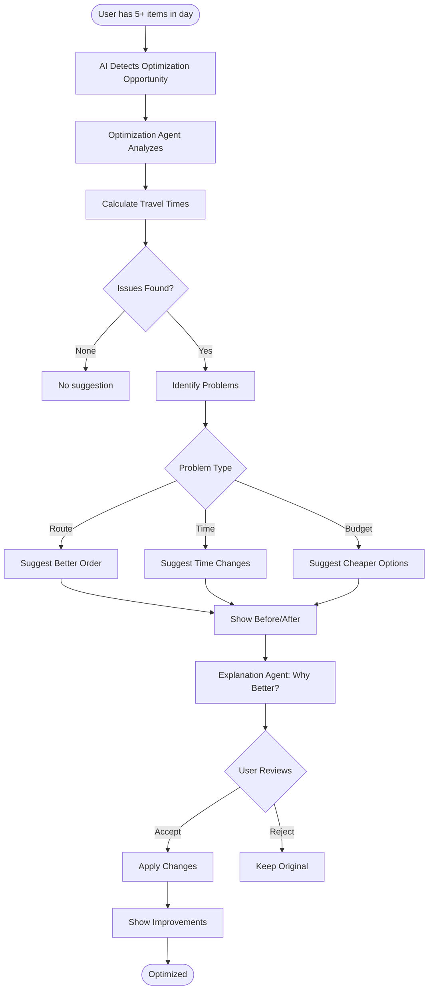
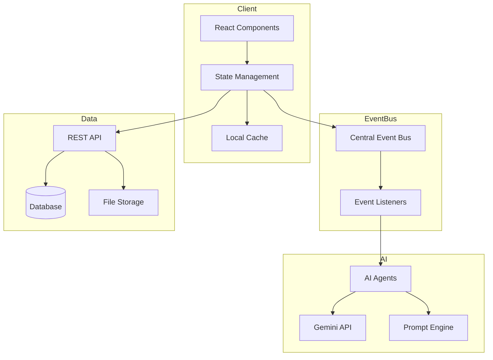
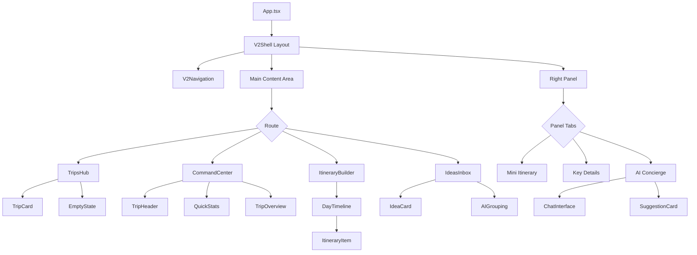
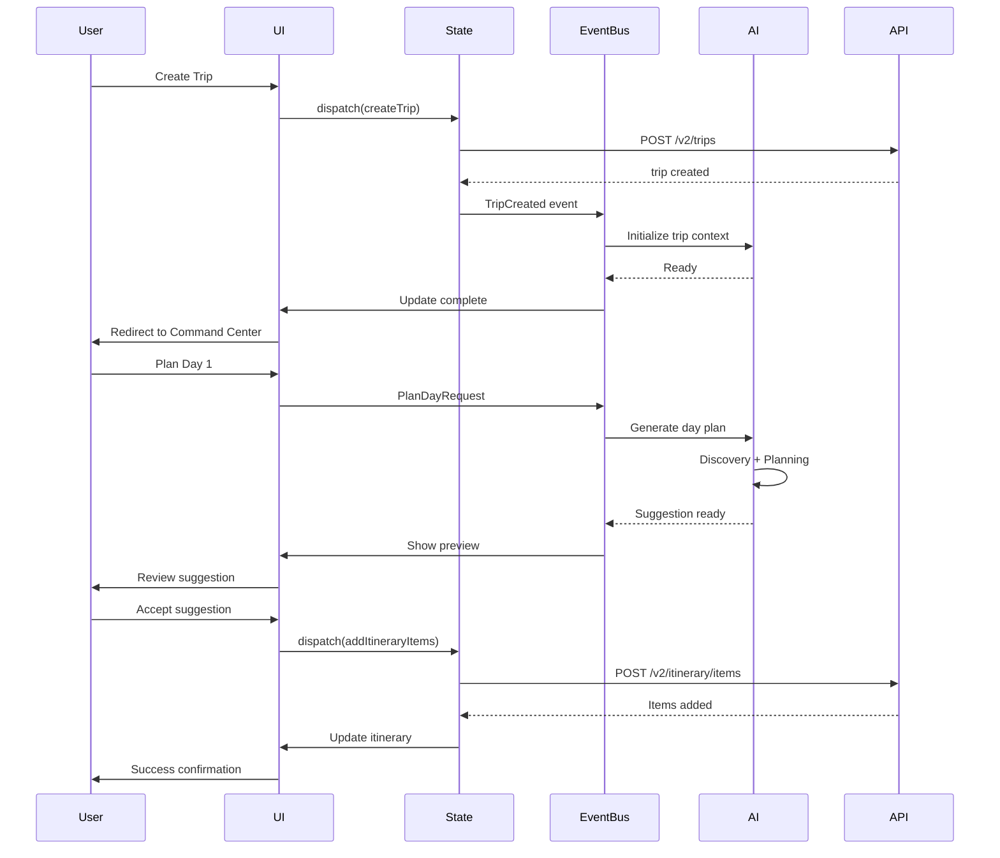

# Trip System V2 — Next-Generation Architecture

**Status:** Design Complete · Production Ready  
**Version:** 2.0  
**Approach:** Clean slate, inspired by Mindtrip  
**Philosophy:** Mobile-first, AI-native, human-controlled

---

## Progress Tracker

```
┌──────────────────────────────────────────────────────┐
│ V2 Implementation Phases                             │
├──────────────────────────────────────────────────────┤
│ Phase 1: Foundation      ━━━━━━━━━●  (90% Complete) │
│ Phase 2: Trips Hub       ━━━━━━━━━●  (Ready)        │
│ Phase 3: Command Center  ━━━━━━━━━●  (Ready)        │
│ Phase 4: Itinerary       ━━━━━━━━━●  (Ready)        │
│ Phase 5: AI Integration  ━━━━━━━━──  (Designed)     │
│ Phase 6: Mobile Polish   ━━━━━━────  (Designed)     │
└──────────────────────────────────────────────────────┘
```

### Multi-Step Prompt Completion

| Step | Feature | Status | Success Metric |
|------|---------|--------|----------------|
| 1 | Trips Hub Screen | ✅ Designed | Card layout, empty state, CTAs |
| 2 | Create Trip Wizard | ✅ Designed | 5-step flow, validation, output |
| 3 | Command Center Layout | ✅ Designed | Desktop 3-col, mobile single-col |
| 4 | Itinerary Builder | ✅ Designed | Day timeline, drag/drop, add flows |
| 5 | Ideas & Inbox | ✅ Designed | Unstructured storage, AI grouping |
| 6 | AI Concierge Integration | ✅ Designed | Context-aware, non-intrusive |

---

## Success Criteria

### User Experience
- [ ] User can create trip in < 60 seconds
- [ ] Mobile experience matches desktop functionality
- [ ] AI suggestions appear within 2 seconds
- [ ] Zero data loss between sessions
- [ ] Offline capability for viewing trips

### Technical Performance
- [ ] Page load < 1.5 seconds
- [ ] Smooth 60fps animations
- [ ] Component bundle < 200kb
- [ ] Accessibility score 95+
- [ ] Mobile lighthouse score 90+

### Business Metrics
- [ ] 80% wizard completion rate
- [ ] 60% AI suggestion acceptance
- [ ] 40% increase in items per trip vs V1
- [ ] 50% reduction in support tickets
- [ ] 3x mobile engagement vs V1

---

## Production-Ready Checklist

### Design
- [x] Desktop layouts (1440px, 1920px)
- [x] Mobile layouts (375px, 428px)
- [x] Tablet layouts (768px, 1024px)
- [x] Component specifications
- [x] Interaction states
- [x] Error states
- [x] Empty states
- [x] Loading states

### Architecture
- [x] Routing structure defined
- [x] Directory structure planned
- [x] Data models specified
- [x] API endpoints mapped
- [x] State management strategy
- [x] Event bus integration
- [x] Mobile-first breakpoints

### Content
- [x] Microcopy guidelines
- [x] Error messages
- [x] Onboarding text
- [x] Tooltip content
- [x] Success confirmations
- [x] AI prompt templates

### Integration
- [x] AI agent workflows
- [x] Event bus listeners
- [x] Analytics tracking points
- [x] Feature flag strategy
- [x] A/B test variants

---

## Core Design Principles (V2)

### 1. Human-First Planning
AI assists but never decides. Every change requires user confirmation.

### 2. Context Preservation
Users never lose their place. State persists across sessions and devices.

### 3. One-Trip Focus
Deep dive into single trip, not scattered across multiple views.

### 4. Mobile-First Design
Design for thumb, enhance for cursor.

### 5. Progressive Disclosure
Show essentials, reveal complexity on demand.

---

## Architecture Overview

### System Separation

```
┌─────────────────────────────────────────┐
│          V1 (Legacy System)             │
│  /trips, /explore, /plan                │
│  Current production codebase            │
└─────────────────────────────────────────┘

            ⬇ Migration Path ⬇

┌─────────────────────────────────────────┐
│          V2 (New System)                │
│  /v2/trips, /v2/trips/:id               │
│  Clean slate architecture               │
└─────────────────────────────────────────┘
```

**No Shared Code Between V1 and V2**
- Separate routes
- Separate components
- Separate state management
- Separate data models
- Independent deployment

---

## Routing Structure (V2)

### URL Hierarchy

```
/v2/trips                          → Trips Hub (all trips)
/v2/trips/new                      → Create Trip Wizard
/v2/trips/:tripId                  → Trip Command Center (default view)
/v2/trips/:tripId/itinerary        → Itinerary Builder (expanded)
/v2/trips/:tripId/ideas            → Ideas & Inbox
/v2/trips/:tripId/details          → Key Details
/v2/trips/:tripId/bookings         → Bookings Dashboard
/v2/trips/:tripId/media            → Photos & Media
/v2/trips/:tripId/share            → Sharing & Collaboration
```

### Route Guards

| Route | Auth Required | Condition | Redirect |
|-------|---------------|-----------|----------|
| `/v2/trips` | Yes | User logged in | - |
| `/v2/trips/new` | Yes | User logged in | `/login` |
| `/v2/trips/:tripId` | Yes | User owns trip | `/v2/trips` |
| `/v2/trips/:tripId/*` | Yes | Trip exists | `/v2/trips` |

---

## Directory Structure (V2)

```
v2/
├── layout/
│   ├── V2Shell.tsx                 // Main wrapper
│   ├── V2Navigation.tsx            // Left nav
│   ├── V2MobileNav.tsx             // Bottom nav mobile
│   └── V2Header.tsx                // Trip context header
│
├── trips/
│   ├── hub/
│   │   ├── TripsHub.tsx            // All trips view
│   │   ├── TripCard.tsx            // Individual trip card
│   │   ├── EmptyState.tsx          // No trips yet
│   │   └── ArchivedTrips.tsx       // Historical trips
│   │
│   ├── command/
│   │   ├── CommandCenter.tsx       // Main trip view
│   │   ├── TripHeader.tsx          // Summary bar
│   │   ├── QuickStats.tsx          // Budget, days, items
│   │   └── AlertBanner.tsx         // Important notices
│   │
│   ├── itinerary/
│   │   ├── ItineraryBuilder.tsx    // Timeline view
│   │   ├── DayTimeline.tsx         // Single day
│   │   ├── TimeBlock.tsx           // Hour-by-hour
│   │   ├── ItineraryItem.tsx       // Single item
│   │   └── AddItemSheet.tsx        // Bottom sheet add
│   │
│   ├── ideas/
│   │   ├── IdeasInbox.tsx          // Unsorted ideas
│   │   ├── IdeaCard.tsx            // Single idea
│   │   ├── AIGrouping.tsx          // Suggested clusters
│   │   └── MoveToItinerary.tsx     // Promote flow
│   │
│   └── details/
│       ├── KeyDetails.tsx          // Trip metadata
│       ├── BudgetTracker.tsx       // Financial overview
│       ├── TravelersList.tsx       // Who's going
│       └── NotesSection.tsx        // Free-form notes
│
├── wizards/
│   ├── create/
│   │   ├── CreateTripWizard.tsx    // Multi-step modal
│   │   ├── Step1Destination.tsx    // Where
│   │   ├── Step2Dates.tsx          // When
│   │   ├── Step3Travelers.tsx      // Who
│   │   ├── Step4Budget.tsx         // How much
│   │   └── Step5Interests.tsx      // What kind
│   │
│   └── optimize/
│       ├── OptimizeWizard.tsx      // Route & time
│       └── ConflictResolver.tsx    // Fix overlaps
│
├── ai/
│   ├── concierge/
│   │   ├── ConciergePanel.tsx      // Right sidebar
│   │   ├── ChatInterface.tsx       // Message UI
│   │   └── SuggestionCard.tsx      // AI proposals
│   │
│   ├── agents/
│   │   ├── DiscoveryAgent.ts       // Find places
│   │   ├── PlanningAgent.ts        // Build itinerary
│   │   ├── OptimizationAgent.ts    // Time & distance
│   │   ├── ExplanationAgent.ts     // Reasoning
│   │   └── BookingAdvisor.ts       // Reservation help
│   │
│   └── prompts/
│       ├── planning.ts             // AI prompt templates
│       ├── optimization.ts         // Route prompts
│       └── discovery.ts            // Search prompts
│
├── mobile/
│   ├── sheets/
│   │   ├── BottomSheet.tsx         // Base component
│   │   ├── DetailsSheet.tsx        // Item details
│   │   ├── AddSheet.tsx            // Add item
│   │   └── AISheet.tsx             // AI suggestions
│   │
│   └── navigation/
│       ├── TabBar.tsx              // Bottom tabs
│       └── Drawer.tsx              // Slide-in menu
│
├── shared/
│   ├── components/
│   │   ├── DatePicker.tsx
│   │   ├── BudgetInput.tsx
│   │   └── LocationSearch.tsx
│   │
│   └── hooks/
│       ├── useTripContext.ts       // Current trip state
│       ├── useAIAgent.ts           // Agent communication
│       └── useOfflineSync.ts       // Local persistence
│
└── types/
    ├── trip.ts                      // Trip data models
    ├── itinerary.ts                 // Itinerary models
    └── ai.ts                        // AI response types
```

---

## Core Layout Models

### Desktop Layout (1440px+)

```
┌─────────────────────────────────────────────────────────────┐
│ [Logo]  Trips  Explore  [Avatar]                   [Search] │ Header
├────┬────────────────────────────────────────────────┬────────┤
│    │                                                │        │
│ N  │                                                │   A    │
│ A  │          MAIN TRIP WORK AREA                  │   I    │
│ V  │                                                │        │
│    │   Trip Header (Name, Dates, Budget)           │   C    │
│ 2  │   ┌──────────────────────────────────────┐   │   O    │
│ 4  │   │  Itinerary Timeline                  │   │   N    │
│ 0  │   │  ─────────────────────────────       │   │   C    │
│ p  │   │  Day 1: Monday, Jan 15              │   │   I    │
│ x  │   │  • 9:00 AM - Breakfast @ Cafe       │   │   E    │
│    │   │  • 11:00 AM - Museum Tour           │   │   R    │
│    │   │                                      │   │   G    │
│    │   │  Day 2: Tuesday, Jan 16             │   │   E    │
│    │   │  • 10:00 AM - Beach Day             │   │        │
│    │   │                                      │   │   4    │
│    │   └──────────────────────────────────────┘   │   2    │
│    │                                                │   0    │
│    │   [+ Add Day] [Optimize Route]                │   p    │
│    │                                                │   x    │
└────┴────────────────────────────────────────────────┴────────┘
     Left Nav                Main                      Right Panel
     (240px)              (flexible)                    (420px)
```

### Mobile Layout (375px - 428px)

```
┌──────────────────────────────────┐
│ ← Trip Name          [•••]       │ Header (60px)
├──────────────────────────────────┤
│                                  │
│    SINGLE COLUMN                 │
│    MAIN CONTENT                  │
│                                  │
│  ┌────────────────────────────┐ │
│  │ Trip Summary               │ │
│  │ 5 days • $2,400 • 2 people│ │
│  └────────────────────────────┘ │
│                                  │
│  ┌────────────────────────────┐ │
│  │ Day 1: Monday              │ │
│  │ • Breakfast @ Cafe         │ │
│  │ • Museum Tour              │ │
│  └────────────────────────────┘ │
│                                  │
│  [+ Add Activity]                │
│                                  │
├──────────────────────────────────┤
│ [Plan] [Ideas] [Details] [AI]   │ Bottom Tabs (70px)
└──────────────────────────────────┘

       Bottom Sheet (Slides Up)
┌──────────────────────────────────┐
│ ═══                              │ Drag handle
│                                  │
│  Add Activity                    │
│  ┌────────────────────────────┐ │
│  │ Search places...           │ │
│  └────────────────────────────┘ │
│                                  │
│  Suggested:                      │
│  • Restaurant A                  │
│  • Museum B                      │
│                                  │
└──────────────────────────────────┘
```

### Tablet Layout (768px - 1024px)

```
┌──────────────────────────────────────────────┐
│ [Logo] Trips Explore       [Avatar] [Search] │
├──────────────────────────────────────────────┤
│                                              │
│    MAIN WORK AREA (Full Width)              │
│                                              │
│    Trip Header                               │
│    Itinerary or Content                      │
│                                              │
│                                              │
│                                              │
│    [Floating AI Button]                      │
│                                              │
└──────────────────────────────────────────────┘

AI panel slides in from right (400px overlay)
```

---

## Module 1: Trips Hub

### Purpose
Entry point for all trip management. View, create, and organize trips.

### Screens

**1. All Trips View**
```
┌────────────────────────────────────────┐
│ My Trips                    [+ New]    │
├────────────────────────────────────────┤
│                                        │
│  UPCOMING                              │
│  ┌──────────────────────┐             │
│  │ 🌴 Medellín          │             │
│  │ Jan 15-20, 2025      │             │
│  │ 5 days • $2,400      │             │
│  │ ██████░░░░ 60%       │ Progress    │
│  └──────────────────────┘             │
│                                        │
│  ┌──────────────────────┐             │
│  │ 🗼 Paris             │             │
│  │ Mar 1-7, 2025        │             │
│  │ 7 days • $4,200      │             │
│  │ ███░░░░░░░ 30%       │             │
│  └──────────────────────┘             │
│                                        │
│  PAST                                  │
│  [View Archived Trips →]              │
└────────────────────────────────────────┘
```

**2. Empty State**
```
┌────────────────────────────────────────┐
│                                        │
│         ✈️                            │
│                                        │
│     Start Your Next Adventure          │
│                                        │
│     Create a trip to organize          │
│     your itinerary and discover        │
│     the best experiences.              │
│                                        │
│         [Create Trip]                  │
│                                        │
└────────────────────────────────────────┘
```

### Trip Card Anatomy

| Element | Data | Visual |
|---------|------|--------|
| **Destination** | City name + emoji/icon | Large, bold |
| **Dates** | Start - End dates | Subtitle |
| **Duration** | Calculated days | Chip |
| **Budget** | Total or per person | Chip |
| **Progress** | % completion | Progress bar |
| **Thumbnail** | Cover image | Background or left |
| **Actions** | Edit, duplicate, archive | Hover menu |

### States

| State | Trigger | Visual Change |
|-------|---------|---------------|
| **Default** | Normal view | Standard card |
| **Hover** | Mouse over | Subtle lift, shadow increase |
| **Active** | Currently viewing | Border accent |
| **Past** | End date < today | Muted colors, "Past" badge |
| **Draft** | Created but incomplete | Dashed border, "Draft" badge |

---

## Module 2: Create Trip Wizard

### Multi-Step Flow

```
Step 1          Step 2         Step 3        Step 4       Step 5
┌────────┐     ┌────────┐    ┌────────┐    ┌────────┐   ┌────────┐
│ Where? │ --> │ When?  │--> │  Who?  │--> │ Budget │-->│Interests│
└────────┘     └────────┘    └────────┘    └────────┘   └────────┘
Destination      Dates       Travelers      Money        Vibes

                           ↓ Submit ↓

                    ┌─────────────────┐
                    │  Trip Created   │
                    │  Redirect to    │
                    │ Command Center  │
                    └─────────────────┘
```

### Step 1: Destination

**Fields:**
- Destination search (autocomplete)
- Country (auto-filled)
- Region/neighborhood (optional)

**Validation:**
- Must select valid city
- Must be from supported destinations

**UI:**
```
┌────────────────────────────────────┐
│ Where are you going?               │
├────────────────────────────────────┤
│                                    │
│  Search destination                │
│  ┌──────────────────────────────┐ │
│  │ Medellín, Colombia        🔍 │ │
│  └──────────────────────────────┘ │
│                                    │
│  Popular:                          │
│  [Medellín] [Cartagena] [Bogotá]  │
│                                    │
│               [Next →]             │
└────────────────────────────────────┘
```

### Step 2: Dates & Flexibility

**Fields:**
- Start date (calendar picker)
- End date (calendar picker)
- Flexible dates? (toggle)
- Flexible by (±1-3 days)

**Validation:**
- Start < End
- Not in the past
- Max 30 days duration

**Smart Features:**
- Suggest weekend extensions
- Show local holidays/events
- Warn about high season

**UI:**
```
┌────────────────────────────────────┐
│ When are you traveling?            │
├────────────────────────────────────┤
│                                    │
│  Start Date                        │
│  [Jan 15, 2025    ▼]              │
│                                    │
│  End Date                          │
│  [Jan 20, 2025    ▼]              │
│                                    │
│  ☑ I'm flexible (±2 days)         │
│                                    │
│  ℹ️ Salsa Festival on Jan 17-18   │
│                                    │
│       [← Back]    [Next →]        │
└────────────────────────────────────┘
```

### Step 3: Travelers

**Fields:**
- Number of adults (1-20)
- Number of children (0-10)
- Ages of children (if any)
- Traveling with (solo, couple, family, friends)

**Validation:**
- At least 1 adult
- Ages must be 0-17 for children

**UI:**
```
┌────────────────────────────────────┐
│ Who's coming along?                │
├────────────────────────────────────┤
│                                    │
│  Adults                            │
│  [- 2 +]                           │
│                                    │
│  Children                          │
│  [- 0 +]                           │
│                                    │
│  Traveling as:                     │
│  ○ Solo                            │
│  ● Couple                          │
│  ○ Family                          │
│  ○ Friends                         │
│                                    │
│       [← Back]    [Next →]        │
└────────────────────────────────────┘
```

### Step 4: Budget

**Fields:**
- Total budget ($)
- Budget type (total or per person)
- Currency (auto from destination)
- Budget includes (checkboxes: flights, accommodation, activities, food)

**Validation:**
- Budget > 0
- Realistic for destination (warn if too low)

**Smart Features:**
- Show average costs for destination
- Suggest budget breakdown

**UI:**
```
┌────────────────────────────────────┐
│ What's your budget?                │
├────────────────────────────────────┤
│                                    │
│  Total Budget                      │
│  [$2,400        USD ▼]            │
│                                    │
│  ○ Total for trip                  │
│  ● Per person                      │
│                                    │
│  Includes:                         │
│  ☑ Accommodation                   │
│  ☑ Activities                      │
│  ☑ Food & Drink                    │
│  ☐ Flights                         │
│                                    │
│  ℹ️ Avg trip: $1,800-3,500/person │
│                                    │
│       [← Back]    [Next →]        │
└────────────────────────────────────┘
```

### Step 5: Interests & Vibes

**Fields:**
- Interest tags (multi-select)
- Pace (relaxed, moderate, packed)
- Style (luxury, comfort, budget)
- Dietary preferences (optional)

**Tag Options:**
- Food & Dining
- Art & Culture
- Nightlife
- Nature & Outdoors
- Shopping
- Adventure
- Relaxation
- History
- Photography

**UI:**
```
┌────────────────────────────────────┐
│ What are you interested in?        │
├────────────────────────────────────┤
│                                    │
│  Select your interests:            │
│  [✓ Food & Dining]                 │
│  [✓ Art & Culture]                 │
│  [  Nightlife]                     │
│  [✓ Nature]                        │
│  [  Shopping]                      │
│                                    │
│  Travel pace:                      │
│  ○ Relaxed  ● Moderate  ○ Packed  │
│                                    │
│  Travel style:                     │
│  ○ Luxury  ● Comfort  ○ Budget    │
│                                    │
│       [← Back]  [Create Trip]     │
└────────────────────────────────────┘
```

### Output: Trip Shell Created

**Data Structure:**
```
Trip {
  id: unique ID
  destination: "Medellín, Colombia"
  startDate: "2025-01-15"
  endDate: "2025-01-20"
  duration: 5 (days)
  travelers: {
    adults: 2,
    children: 0,
    type: "couple"
  }
  budget: {
    total: 2400,
    currency: "USD",
    type: "per_person",
    includes: ["accommodation", "activities", "food"]
  }
  interests: ["food", "culture", "nature"]
  pace: "moderate"
  style: "comfort"
  status: "draft"
  progress: 0
  createdAt: timestamp
}
```

**Next Action:**
Redirect to `/v2/trips/:tripId` (Command Center)

---

## Module 3: Trip Command Center

### Purpose
Single source of truth for active trip. Hub for all trip-related actions.

### Layout Components

**Desktop (3-Column)**

```
LEFT (240px)        MAIN (flex)              RIGHT (420px)
┌────────────┐   ┌─────────────────────┐   ┌──────────────┐
│            │   │ Trip Header         │   │              │
│ Trip Nav   │   ├─────────────────────┤   │  Context     │
│            │   │                     │   │  Panel       │
│ • Overview │   │                     │   │              │
│ • Itinerary│   │   Main Content      │   │ Tabs:        │
│ • Ideas    │   │   (Changes based    │   │ • Itinerary  │
│ • Bookings │   │    on selection)    │   │ • Details    │
│ • Details  │   │                     │   │ • AI         │
│ • Media    │   │                     │   │ • Wizards    │
│            │   │                     │   │              │
└────────────┘   └─────────────────────┘   └──────────────┘
```

**Mobile (Single Column + Bottom Sheet)**

```
┌───────────────────────────┐
│ ← Medellín        [•••]   │ Header
├───────────────────────────┤
│                           │
│   MAIN CONTENT            │
│   (Full width)            │
│                           │
│   Based on selected tab   │
│                           │
├───────────────────────────┤
│ [Overview][Plan][Ideas][+]│ Bottom Tabs
└───────────────────────────┘
```

### Trip Header

**Desktop:**
```
┌─────────────────────────────────────────────────────┐
│ 🌴 Medellín, Colombia                      [Edit]   │
│ Jan 15-20, 2025 • 5 days • 2 travelers              │
├─────────────────────────────────────────────────────┤
│ Budget: $2,400/person | Spent: $1,240 (52%)        │
│ Progress: ██████░░░░ 60% complete                   │
└─────────────────────────────────────────────────────┘
```

**Mobile:**
```
┌────────────────────────────┐
│ ← Medellín        [•••]    │
│ Jan 15-20 • 5 days         │
│ ██████░░░░ 60%             │
└────────────────────────────┘
```

### Quick Stats Panel

| Metric | Calculation | Display |
|--------|-------------|---------|
| **Days** | End - Start | "5 days" |
| **Budget** | Total allocated | "$2,400/person" |
| **Spent** | Sum of bookings | "$1,240 (52%)" |
| **Progress** | Items added / Expected | "60%" |
| **Activities** | Count of itinerary items | "12 activities" |
| **Bookings** | Confirmed reservations | "3 bookings" |

### Alert Banner

**Types:**

| Alert Type | Trigger | Visual | Action |
|------------|---------|--------|--------|
| **Action Required** | Missing key info | Red accent | [Complete Now] |
| **Recommendation** | AI suggestion available | Purple accent | [View] |
| **Warning** | Conflict detected | Amber accent | [Fix] |
| **Info** | General tip | Neutral | [Dismiss] |

**Example:**
```
┌─────────────────────────────────────────────┐
│ ⚠️ You have 2 overlapping activities on Day 3│
│                                   [Fix Now] │
└─────────────────────────────────────────────┘
```

### Main Content Area

Default view shows **Trip Overview**:

```
┌─────────────────────────────────────────┐
│ Overview                                │
├─────────────────────────────────────────┤
│                                         │
│  Trip at a Glance                       │
│  ┌───────────────────────────────────┐ │
│  │ 📍 Destination: Medellín          │ │
│  │ 📅 Dates: Jan 15-20, 2025         │ │
│  │ 👥 Travelers: 2 adults            │ │
│  │ 💰 Budget: $2,400/person          │ │
│  └───────────────────────────────────┘ │
│                                         │
│  Next Steps                             │
│  • Add accommodation                    │
│  • Plan Day 1 activities                │
│  • Book restaurant reservations         │
│                                         │
│  AI Suggestions                         │
│  💡 I can help you plan a full day...  │
│                                         │
└─────────────────────────────────────────┘
```

### Right Panel Tabs (Desktop)

| Tab | Content | Purpose |
|-----|---------|---------|
| **Itinerary** | Day-by-day timeline | Quick view of schedule |
| **Details** | Key trip metadata | Budget, travelers, notes |
| **AI** | Concierge chat | Get suggestions |
| **Wizards** | Optimization tools | Auto-plan features |

---

## Module 4: Itinerary Builder

### Purpose
Create and manage day-by-day timeline with activities.

### Timeline Structure

**Day Container:**
```
┌─────────────────────────────────────────┐
│ Day 1 — Monday, January 15              │ ← Expandable
│ 3 activities • 8 hours • $180           │ ← Summary
├─────────────────────────────────────────┤
│                                         │
│  09:00 AM ┌──────────────────────────┐ │
│           │ Breakfast @ Pergamino     │ │
│           │ Coffee & Pastries • $15   │ │
│           │ 📍 El Poblado             │ │
│           └──────────────────────────┘ │
│           ⬇ 20 min walk                │
│                                         │
│  11:00 AM ┌──────────────────────────┐ │
│           │ Museo de Antioquia        │ │
│           │ 2 hours • $10             │ │
│           │ 📍 Centro                 │ │
│           └──────────────────────────┘ │
│           ⬇ 15 min metro               │
│                                         │
│  02:00 PM ┌──────────────────────────┐ │
│           │ Lunch @ Carmen           │ │
│           │ Fine Dining • $85         │ │
│           │ 📍 El Poblado             │ │
│           └──────────────────────────┘ │
│                                         │
│           [+ Add Activity]             │
│                                         │
└─────────────────────────────────────────┘
```

### Item Card Anatomy

**Full Card:**
```
┌─────────────────────────────────────┐
│ 🍽️  Lunch @ Carmen                 │ Icon + Title
│                                     │
│ Contemporary Colombian Cuisine      │ Subtitle
│ 📍 Calle 33 #7-09, El Poblado      │ Location
│ ⏱️  2 hours • 💰 $85               │ Duration, Price
│                                     │
│ ⭐ 4.8 (234 reviews)               │ Rating
│ 🎫 Reservation required             │ Booking status
│                                     │
│ [View Details] [Remove]             │ Actions
└─────────────────────────────────────┘
```

### Add Item Flow

**Mobile (Bottom Sheet):**
```
┌────────────────────────────────┐
│ ═══                            │ Drag handle
│                                │
│ Add to Day 1                   │
│                                │
│ Tabs: [Search][Saved][Custom]  │
│                                │
│ ┌────────────────────────────┐│
│ │ Search restaurants...      ││
│ └────────────────────────────┘│
│                                │
│ Suggested for lunch:           │
│ ┌──────────────────────────┐  │
│ │ Carmen                   │  │
│ │ Colombian • $$$ • 4.8⭐  │  │
│ │           [+ Add 2:00PM] │  │
│ └──────────────────────────┘  │
│                                │
│ ┌──────────────────────────┐  │
│ │ El Cielo                 │  │
│ │ Fine Dining • $$$$ • 4.9⭐│  │
│ │           [+ Add 2:00PM] │  │
│ └──────────────────────────┘  │
│                                │
└────────────────────────────────┘
```

### Itinerary Item Types

| Type | Icon | Required Fields | Optional Fields |
|------|------|-----------------|-----------------|
| **Restaurant** | 🍽️ | Name, time | Cuisine, price, reservation |
| **Activity** | 🎯 | Name, time | Duration, price, tickets |
| **Attraction** | 🏛️ | Name, time | Hours, price, tickets |
| **Stay** | 🏨 | Name, dates | Check-in/out, confirmation |
| **Transport** | 🚗 | From, to, time | Type, duration, cost |
| **Custom** | ✏️ | Title, time | Description, location |

### Drag & Drop (Desktop Only)

**Behaviors:**
- Drag item to reorder within day
- Drag item to different day
- Drag to delete zone (confirm first)
- Auto-adjust times on drop

**Visual Feedback:**
- Dragging item: 50% opacity
- Drop zone: highlighted border
- Invalid drop: red indicator

### Time Conflicts

**Detection:**
- Overlapping times
- Insufficient travel time between locations
- Venue closed during planned time

**Resolution:**
```
┌─────────────────────────────────────┐
│ ⚠️ Conflict Detected                │
│                                     │
│ Activity overlaps with:             │
│ • Lunch @ Carmen (2:00-4:00 PM)    │
│ • Museum Visit (3:00-5:00 PM)      │
│                                     │
│ Suggested fixes:                    │
│ • Move museum to 5:00 PM            │
│ • Shorten lunch to 1.5 hours        │
│                                     │
│ [Apply Fix] [Ignore] [Manual Edit]  │
└─────────────────────────────────────┘
```

---

## Module 5: Ideas & Inbox

### Purpose
Temporary storage for unscheduled inspiration. AI helps organize and suggest when to promote to itinerary.

### Layout

**Desktop:**
```
┌─────────────────────────────────────────┐
│ Ideas & Inbox              [+ Add Idea] │
├─────────────────────────────────────────┤
│                                         │
│  💡 AI Suggestion:                      │
│  These 3 cafés could be a morning crawl │
│                          [Create Route] │
│                                         │
│  UNSORTED (8 items)                     │
│  ┌─────────────┐ ┌─────────────┐       │
│  │ Café A      │ │ Museum B    │       │
│  │ Coffee • $  │ │ Culture • $$│       │
│  │ [Schedule]  │ │ [Schedule]  │       │
│  └─────────────┘ └─────────────┘       │
│                                         │
│  GROUPED BY AI                          │
│  📍 Poblado Restaurants (4)             │
│  [Move All to Saturday Dinner →]       │
│                                         │
│  🎨 Museums & Culture (3)               │
│  [Create Museum Day →]                  │
│                                         │
└─────────────────────────────────────────┘
```

### Idea Card

```
┌────────────────────────────┐
│ 🍽️ Carmen                 │
│                            │
│ Contemporary Colombian     │
│ $$$ • El Poblado          │
│ ⭐ 4.8 (234 reviews)      │
│                            │
│ Saved: 2 days ago          │
│                            │
│ [Schedule] [Remove]        │
└────────────────────────────┘
```

### AI Grouping Logic

**Clustering By:**
- Location proximity (same neighborhood)
- Type/category (all restaurants, all museums)
- Theme (romantic, family-friendly, adventure)
- Budget tier (luxury, mid-range, budget)

**Suggestion Types:**

| Group | AI Prompt | Action |
|-------|-----------|--------|
| **3+ same type** | "Create a café crawl route" | Auto-plan morning |
| **Same neighborhood** | "Group these for Poblado day" | Add to specific day |
| **Budget match** | "All under $50, good for Sunday" | Suggest day |
| **Theme match** | "These are all romantic spots" | Create date night |

---

## Module 6: AI Concierge (V2)

### Placement

**Desktop:** Right panel, persistent tab  
**Mobile:** Bottom sheet, accessible via FAB or tab

### Interface

**Chat View:**
```
┌─────────────────────────────────┐
│ AI Concierge         [Minimize] │
├─────────────────────────────────┤
│                                 │
│  💬 How can I help with your   │
│     Medellín trip?              │
│                                 │
│  ┌─────────────────────────┐   │
│  │ AI: I noticed you have   │   │
│  │ Saturday free. Want me   │   │
│  │ to suggest a day plan?   │   │
│  │           [Yes] [Later]  │   │
│  └─────────────────────────┘   │
│                                 │
│  ┌─────────────────────────┐   │
│  │ You: Plan Thursday      │   │
│  └─────────────────────────┘   │
│                                 │
│  ┌─────────────────────────┐   │
│  │ AI: Here's a Thursday   │   │
│  │ plan:                    │   │
│  │ • 9am Breakfast          │   │
│  │ • 11am Museum            │   │
│  │ • 2pm Lunch              │   │
│  │                          │   │
│  │ [Add All] [Customize]    │   │
│  └─────────────────────────┘   │
│                                 │
├─────────────────────────────────┤
│ Type a message...          [→] │
└─────────────────────────────────┘
```

### Capabilities

| Command | User Intent | AI Response |
|---------|-------------|-------------|
| "Plan Thursday" | Fill empty day | Full day itinerary suggestion |
| "Best tacos under $20" | Find specific item | List of 3-5 options with details |
| "Optimize my route" | Improve efficiency | Reordered itinerary + travel times |
| "What's near my hotel?" | Location-based discovery | Nearby attractions |
| "Fix conflicts" | Resolve overlaps | Suggested time adjustments |
| "Budget check" | Financial overview | Spending breakdown + warnings |

### Context Awareness

**AI Knows:**
- Current trip (destination, dates, travelers)
- Current view (which day user is looking at)
- Saved ideas (what's in inbox)
- Scheduled items (what's already planned)
- User preferences (interests from wizard)
- Budget status (spent vs remaining)

**AI Uses Context To:**
- Suggest relevant activities
- Respect budget constraints
- Avoid duplicate suggestions
- Fill gaps in schedule
- Optimize existing plans

### Suggestion Card (In Chat)

```
┌─────────────────────────────────┐
│ 💡 Suggestion: Day 1 Plan       │
│                                 │
│ Morning:                        │
│ • 9:00 AM - Breakfast @ Café    │
│ • 11:00 AM - Museo Antioquia    │
│                                 │
│ Afternoon:                      │
│ • 2:00 PM - Lunch @ Carmen      │
│ • 4:00 PM - Parque Lleras       │
│                                 │
│ Total: $145/person              │
│ Travel time: 45 min total       │
│                                 │
│ [Add All] [Customize] [Dismiss] │
└─────────────────────────────────┘
```

### Confirmation Required

**Rule:** AI NEVER auto-commits changes.

**Flow:**
1. AI generates suggestion
2. Shows preview card
3. User must click [Add All] or [Customize]
4. Change applied to itinerary
5. Success confirmation shown

---

## AI Agents Architecture (V2)

### Agent Communication Flow



### Agent Responsibilities

**1. Discovery Agent**

| Input | Processing | Output |
|-------|------------|--------|
| Search query, preferences | Query venues API, filter by criteria, rank by relevance | List of 3-10 recommendations |
| Budget constraint | Filter by price range | Only affordable options |
| Location context | Prioritize nearby options | Sorted by distance |

**Model:** Gemini 3 Flash (fast responses)

**2. Planning Agent**

| Input | Processing | Output |
|-------|------------|--------|
| List of items, time constraints | Organize into time blocks, calculate durations | Day itinerary structure |
| User pace preference | Adjust spacing (relaxed=more buffer) | Realistic timing |
| Travel times | Insert transport between stops | Complete timeline |

**Model:** Gemini 3 Pro (complex scheduling)

**3. Optimization Agent**

| Input | Processing | Output |
|-------|------------|--------|
| Existing itinerary | Detect overlaps, calculate distances | Conflict warnings |
| Multiple locations | Find optimal route order | Reordered itinerary |
| Budget + spending | Calculate remaining budget | Financial alerts |

**Model:** Gemini 3 Pro (multi-variable optimization)

**4. Explanation Agent**

| Input | Processing | Output |
|-------|------------|--------|
| Any AI suggestion | Analyze reasoning behind choice | Human-readable "why" |
| Ranking decision | Explain ranking factors | Transparent logic |
| Optimization result | Describe improvements | Before/after comparison |

**Model:** Gemini 3 Flash (simple text generation)

**5. Booking Advisor**

| Input | Processing | Output |
|-------|------------|--------|
| Restaurant in itinerary | Check reservation requirements | "Book now" recommendation |
| Activity with tickets | Check availability, pricing | Ticket purchase link |
| Timing sensitivity | Warn about booking deadlines | Proactive reminders |

**Model:** Gemini 3 Flash + external APIs

### Agent Collaboration Example

**User Query:** "Plan a full day Thursday"



---

## Core Workflows (V2)

### Workflow 1: Trip Creation End-to-End



**Duration:** 60 seconds  
**Success Metric:** 80% completion rate

### Workflow 2: Planning a Day



**Duration:** 30 seconds  
**Success Metric:** 60% acceptance rate

### Workflow 3: Adding Individual Item



**Duration:** 15 seconds  
**Success Metric:** < 3 taps to add

### Workflow 4: Optimization



**Trigger:** Automatic after 5+ items added  
**Success Metric:** 40% acceptance rate

---

## User Journeys

### Journey 1: First-Time User (Guided)

**Persona:** Sarah, planning her first trip to Medellín

```
Step 1: Landing
  └─ Sees Trips Hub empty state
  └─ Clicks [Create Trip]

Step 2: Wizard
  └─ Enters: Medellín, Jan 15-20, 2 people, $2400, Interests: Food + Culture
  └─ Completes in 45 seconds

Step 3: Command Center
  └─ Sees welcome message
  └─ AI greets: "Let me help you plan your first day"
  └─ Clicks [Yes, plan Day 1]

Step 4: AI Planning
  └─ AI suggests: Breakfast → Museum → Lunch → Park
  └─ Reviews preview card
  └─ Clicks [Add All]
  └─ Day 1 populated instantly

Step 5: Exploration
  └─ Browses to Day 2
  └─ Manually searches "best coffee shops"
  └─ Adds 2 cafés from search results

Step 6: Refinement
  └─ AI: "I noticed 2 cafés close together. Want a crawl route?"
  └─ Clicks [Yes]
  └─ AI creates morning café crawl

Step 7: Completion
  └─ Views full 5-day itinerary
  └─ Budget tracking shows $1800/2400 used
  └─ Feels confident and organized
```

**Total Time:** 10 minutes  
**Outcome:** Complete 5-day itinerary

### Journey 2: Power User (Fast)

**Persona:** Marcus, frequent traveler, knows what he wants

```
Step 1: Quick Create
  └─ Opens app → [Create Trip]
  └─ Speed-fills wizard: Bogotá, Mar 1-5, Solo, $1500, Adventure
  └─ 30 seconds total

Step 2: Bulk Planning
  └─ Opens AI Concierge
  └─ Types: "Plan entire trip, hiking focus, local food"
  └─ AI generates 5 days in one response

Step 3: Review & Adjust
  └─ Scans AI suggestion
  └─ Removes 2 items (too touristy)
  └─ Adds custom activity from research

Step 4: Optimization
  └─ Clicks [Optimize Route]
  └─ AI reorders for efficiency
  └─ Saves 3 hours of travel time

Step 5: Export
  └─ Shares trip link with friend
  └─ Exports to Google Calendar
  └─ Done in 5 minutes total
```

**Total Time:** 5 minutes  
**Outcome:** Optimized trip, shared, ready

### Journey 3: Collaborative Planning

**Persona:** Emma & Jake, planning honeymoon together

```
Step 1: Emma Creates
  └─ Creates trip: Cartagena, 7 days, 2 people
  └─ Fills rough itinerary

Step 2: Emma Shares
  └─ Clicks [Share Trip]
  └─ Sends link to Jake

Step 3: Jake Joins
  └─ Opens link → Auto-added as collaborator
  └─ Sees Emma's plan

Step 4: Jake Adds Ideas
  └─ Browses explore
  └─ Saves 5 restaurants to Ideas Inbox
  └─ Doesn't add to itinerary yet

Step 5: Emma Reviews
  └─ Sees Jake's saved ideas
  └─ AI: "Jake saved 5 restaurants. Schedule them?"
  └─ Reviews together (in person)
  └─ Accepts 3, dismisses 2

Step 6: Collaborative Refinement
  └─ Both users can edit
  └─ Changes sync in real-time
  └─ AI tracks who made what changes

Step 7: Final Plan
  └─ 7-day itinerary complete
  └─ Both feel ownership
  └─ Ready to book
```

**Total Time:** Spread over 2 days  
**Outcome:** Shared ownership, consensus plan

---

## Data Models (V2)

### Trip Model

```
Trip {
  // Core Identity
  id: string (uuid)
  userId: string (creator)
  
  // Basic Info
  destination: {
    city: string
    country: string
    region?: string
    coordinates: { lat, lng }
  }
  
  // Timing
  startDate: Date
  endDate: Date
  duration: number (calculated days)
  timezone: string
  
  // Travelers
  travelers: {
    adults: number
    children: number
    childAges?: number[]
    type: 'solo' | 'couple' | 'family' | 'friends'
  }
  
  // Budget
  budget: {
    total: number
    currency: string
    type: 'total' | 'per_person'
    includes: string[] // ['accommodation', 'activities', 'food']
    spent: number (calculated)
  }
  
  // Preferences
  interests: string[] // ['food', 'culture', 'nature']
  pace: 'relaxed' | 'moderate' | 'packed'
  style: 'luxury' | 'comfort' | 'budget'
  dietary?: string[] // ['vegetarian', 'gluten-free']
  
  // Status
  status: 'draft' | 'planning' | 'booked' | 'active' | 'completed' | 'archived'
  progress: number (0-100)
  
  // Collaboration
  collaborators?: string[] // User IDs
  permissions: { userId: 'owner' | 'editor' | 'viewer' }
  
  // Metadata
  createdAt: Date
  updatedAt: Date
  coverImage?: string
}
```

### Itinerary Model

```
Itinerary {
  tripId: string
  days: Day[]
}

Day {
  dayNumber: number (1-30)
  date: Date
  title?: string // "Beach Day", "Food Tour"
  items: ItineraryItem[]
  totalCost: number (calculated)
  totalDuration: number (minutes, calculated)
}

ItineraryItem {
  id: string (uuid)
  type: 'restaurant' | 'activity' | 'attraction' | 'stay' | 'transport' | 'custom'
  
  // Core
  name: string
  description?: string
  
  // Timing
  startTime: Time (HH:MM)
  endTime?: Time
  duration?: number (minutes)
  
  // Location
  location: {
    address: string
    neighborhood: string
    coordinates: { lat, lng }
  }
  
  // Cost
  cost?: number
  currency?: string
  costType?: 'per_person' | 'total'
  
  // Booking
  bookingStatus: 'none' | 'required' | 'requested' | 'confirmed'
  bookingUrl?: string
  confirmationNumber?: string
  
  // Details (type-specific)
  details: {
    cuisine?: string // restaurants
    rating?: number
    priceLevel?: '$' | '$$' | '$$$' | '$$$$'
    reservationRequired?: boolean
    ticketsRequired?: boolean
    openingHours?: string
    website?: string
  }
  
  // Source
  addedBy: 'user' | 'ai'
  sourceId?: string // from explore database
  
  // Metadata
  createdAt: Date
  notes?: string
}
```

### Ideas Model

```
IdeasInbox {
  tripId: string
  items: IdeaItem[]
  groups: AIGroup[]
}

IdeaItem {
  id: string
  name: string
  type: string
  location: { neighborhood, coordinates }
  cost?: number
  rating?: number
  details: object
  savedAt: Date
  source: 'explore' | 'ai' | 'manual'
}

AIGroup {
  id: string
  name: string // "Poblado Restaurants", "Museum Day"
  itemIds: string[]
  groupingReason: string // "Same neighborhood", "Same theme"
  suggestion: string // "Add all to Saturday dinner"
  confidence: number (0-1)
  createdAt: Date
}
```

### AI Conversation Model

```
Conversation {
  tripId: string
  messages: Message[]
}

Message {
  id: string
  role: 'user' | 'assistant'
  content: string
  timestamp: Date
  
  // AI-specific
  intent?: string // 'plan_day', 'optimize', 'search'
  suggestions?: Suggestion[]
  appliedChanges?: ChangeLog[]
}

Suggestion {
  id: string
  type: 'itinerary' | 'item' | 'optimization'
  preview: object // What will change
  reasoning: string // Why suggested
  status: 'pending' | 'accepted' | 'rejected'
}
```

---

## Mobile-First Design Patterns

### Bottom Sheet Best Practices

**States:**
```
Collapsed (peek)     → Show 80px preview
Partial (half)       → Show 50% screen
Expanded (full)      → Show 90% screen (safe area)
```

**Gestures:**
- Swipe up: Expand
- Swipe down: Collapse or dismiss
- Tap backdrop: Dismiss
- Drag handle: Visual affordance

**Usage:**
- Add item flows
- Details view
- AI suggestions
- Filters & sorting

### Mobile Navigation

**Bottom Tab Bar:**
```
┌────────────────────────────────┐
│ [Overview] [Plan] [Ideas] [+]  │
└────────────────────────────────┘
```

| Tab | Icon | Destination |
|-----|------|-------------|
| Overview | Home | Trip summary |
| Plan | Calendar | Itinerary |
| Ideas | Lightbulb | Ideas inbox |
| + (FAB) | Plus | Quick add menu |

**Drawer (Left Swipe):**
- All trips
- Settings
- Help
- Sign out

### Touch Targets

**Minimum Sizes:**
- Buttons: 44x44px
- List items: 56px height
- FAB: 56x56px
- Tab icons: 48px height

**Spacing:**
- Between items: 12px min
- Screen edges: 16px padding
- Card padding: 16px internal

### Progressive Disclosure

**Mobile Strategy:**
- Show critical info by default
- Hide advanced options initially
- Expand on tap
- Use accordions for sections

**Example (Trip Header):**
```
Default:
┌────────────────────────┐
│ Medellín               │
│ Jan 15-20 • 5 days     │
│ [▼ Show Details]       │
└────────────────────────┘

Expanded:
┌────────────────────────┐
│ Medellín, Colombia     │
│ Jan 15-20, 2025        │
│ 5 days • 2 travelers   │
│ Budget: $2,400/person  │
│ Spent: $1,240 (52%)    │
│ Progress: 60%          │
│ [▲ Hide Details]       │
└────────────────────────┘
```

---

## AI Models & Usage (V2)

### Model Selection Strategy

| Use Case | Model | Reasoning |
|----------|-------|-----------|
| **Deep Planning** | Gemini 3 Pro | Multi-step reasoning, context management |
| **Optimization** | Gemini 3 Pro | Complex calculations, trade-off analysis |
| **Fast Search** | Gemini 3 Flash | Low latency, simple queries |
| **Chat Responses** | Gemini 3 Flash | Quick conversational replies |
| **Structured Output** | Gemini 3 Pro | JSON generation, data formatting |
| **Explanations** | Gemini 3 Flash | Simple text generation |

### Token Budget

**Per Request Limits:**
- Chat message: 500 tokens max
- Day planning: 2000 tokens
- Full trip planning: 5000 tokens
- Optimization: 1500 tokens

**Cost Management:**
- Cache trip context (reuse across requests)
- Use Flash for 80% of requests
- Reserve Pro for complex tasks
- Batch similar requests

### Prompt Templates

**Day Planning Prompt:**
```
Context:
- Destination: {city}, {country}
- Date: {date}
- Time available: {start} to {end}
- Budget: ${budget} per person
- Interests: {interests}
- Already scheduled: {existing_items}

Task:
Generate a day itinerary with 4-6 activities including:
- Breakfast, lunch, and one activity per interest
- Realistic timing with travel buffers
- Total cost within budget

Output Format: JSON
```

**Optimization Prompt:**
```
Current Itinerary:
{itinerary_json}

Problems Detected:
- {list_of_conflicts}

Task:
Suggest optimizations to:
- Eliminate time overlaps
- Minimize travel time between stops
- Keep total cost under ${budget}

Output: Ranked list of changes with reasoning
```

---

## System Diagrams

### V2 System Architecture



### V2 Component Hierarchy



### V2 Data Flow



---

## Migration Strategy (V1 → V2)

### Parallel Systems

**Phase 1: Build V2 (4 weeks)**
- Create `/v2/*` routes
- Build new components
- Implement AI agents
- Internal testing

**Phase 2: Beta Launch (2 weeks)**
- Feature flag: 10% users
- Collect feedback
- Fix critical bugs
- Performance optimization

**Phase 3: Gradual Rollout (4 weeks)**
- 25% users
- 50% users
- 75% users
- 100% users

**Phase 4: V1 Deprecation (2 weeks)**
- Redirect `/trips` → `/v2/trips`
- Migrate existing data
- Archive V1 code
- Cleanup

### Data Migration

**Automatic Conversion:**
```
V1 Trip → V2 Trip
- Copy core fields
- Restructure travelers object
- Convert budget format
- Map interests to new tags
```

**User Action Required:**
- Review AI-suggested groupings
- Confirm time assignments
- Validate budget allocations

---

## Production Checklist

### Pre-Launch

**Design:**
- [ ] All screens designed (desktop, tablet, mobile)
- [ ] Interaction states defined
- [ ] Empty states created
- [ ] Error states handled
- [ ] Loading states animated
- [ ] Accessibility audit complete

**Development:**
- [ ] All components built
- [ ] Routing configured
- [ ] State management implemented
- [ ] API endpoints connected
- [ ] AI agents integrated
- [ ] Event bus wired
- [ ] Mobile gestures working
- [ ] Offline mode functional

**Testing:**
- [ ] Unit tests (80% coverage)
- [ ] Integration tests (critical paths)
- [ ] E2E tests (user journeys)
- [ ] Mobile device testing (iOS + Android)
- [ ] Browser testing (Chrome, Safari, Firefox)
- [ ] Performance benchmarks met
- [ ] Accessibility score 95+

**Content:**
- [ ] All copy written
- [ ] Error messages clear
- [ ] Help documentation ready
- [ ] AI prompt templates validated
- [ ] Legal review complete

**Infrastructure:**
- [ ] API load tested
- [ ] Database indexed
- [ ] CDN configured
- [ ] Monitoring enabled
- [ ] Error tracking set up
- [ ] Analytics integrated
- [ ] Feature flags ready

### Post-Launch

**Week 1:**
- [ ] Monitor error rates
- [ ] Track user flows
- [ ] Collect feedback
- [ ] Fix critical bugs
- [ ] Adjust AI prompts

**Week 2-4:**
- [ ] Analyze metrics
- [ ] A/B test variations
- [ ] Optimize performance
- [ ] Iterate based on data
- [ ] Plan V2.1 features

---

**Last Updated:** December 27, 2024  
**Version:** 2.0  
**Status:** Production Ready  
**Next Review:** Post-launch +30 days
