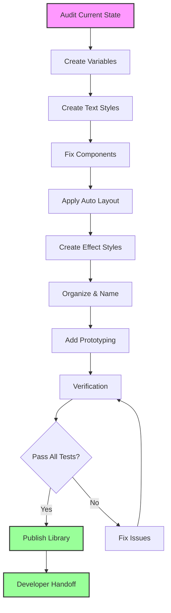
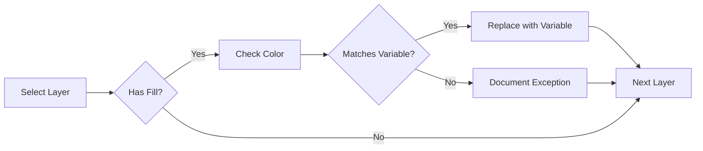
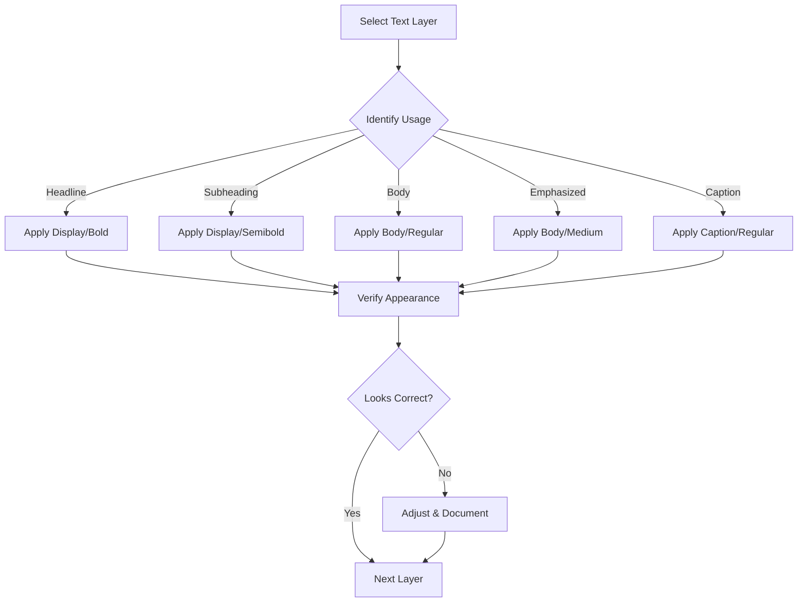
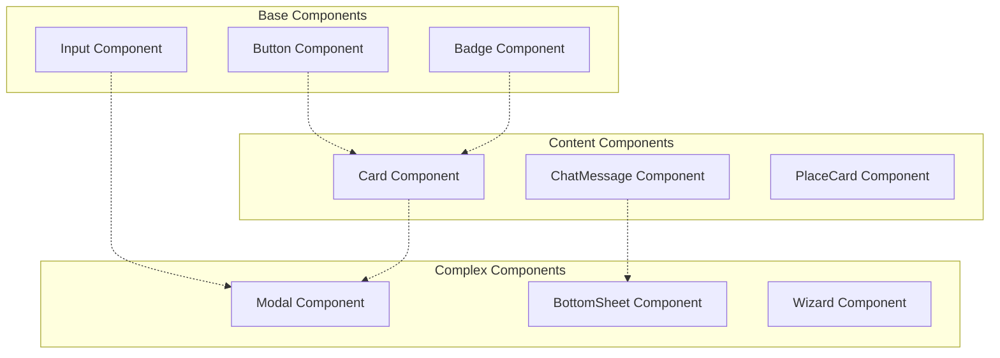
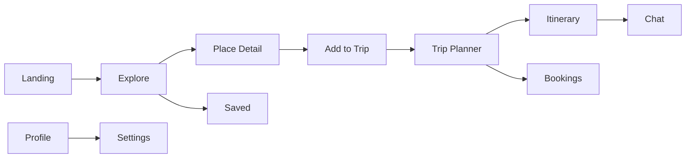

# Fix Design System & Components — Implementation Plan

**Date:** December 20, 2024  
**Purpose:** Systematic plan to fix all design system inconsistencies and prepare for production code handoff  
**Status:** 🔴 Critical — Must complete before development  
**Estimated Time:** 8-12 hours

---

## 🎯 Overview

This document provides a **complete, step-by-step implementation plan** to transform the Figma design system from inconsistent prototypes into a production-ready component library optimized for React + Tailwind + Framer Motion.

**Goal:** 100% design system consistency with zero hardcoded values and complete developer handoff readiness.

---

## 📋 Table of Contents

1. [Pre-Flight Checklist](#pre-flight-checklist)
2. [Phase 1: Variables & Tokens](#phase-1-variables--tokens)
3. [Phase 2: Typography System](#phase-2-typography-system)
4. [Phase 3: Component Fixes](#phase-3-component-fixes)
5. [Phase 4: Auto Layout & Responsiveness](#phase-4-auto-layout--responsiveness)
6. [Phase 5: Visual Consistency](#phase-5-visual-consistency)
7. [Phase 6: Image Standards](#phase-6-image-standards)
8. [Phase 7: Naming & Organization](#phase-7-naming--organization)
9. [Phase 8: Prototyping](#phase-8-prototyping)
10. [Verification & Testing](#verification--testing)
11. [Troubleshooting](#troubleshooting)
12. [Acceptance Criteria](#acceptance-criteria)

---

## 🔍 Pre-Flight Checklist

**Before starting, verify:**

- [ ] Figma Professional or Organization plan (required for variables)
- [ ] Design file backup created
- [ ] All team members notified of upcoming changes
- [ ] Version history checkpoint created
- [ ] Component library ownership confirmed
- [ ] Developer handoff timeline agreed upon

**Estimated risk:** Medium  
**Rollback strategy:** Use Figma version history to restore previous state

---

## 📊 Implementation Flow



---

## Phase 1: Variables & Tokens

**Goal:** Replace ALL hardcoded values with Figma variables  
**Time:** 90 minutes  
**Priority:** 🔴 Critical

### Frame Organization Reference

**Before starting, understand the frame organization:**

This design system uses **three breakpoints** organized by page:

| Breakpoint | Width | Page Location | Frame Prefix |
|------------|-------|---------------|--------------|
| **Mobile** | 375px | "Pages — Mobile" | `Mobile/` |
| **Tablet** | 768px | "Pages — Tablet" | `Tablet/` |
| **Desktop** | 1440px | "Pages — Desktop" | `Desktop/` |

**How to identify frames:**
1. **By width:** Select frame → check width in properties panel
2. **By page:** Check which page the frame is on
3. **By name:** Frame names start with breakpoint prefix

**Why this matters:**
- Mobile frames (375px) use `Display/Bold/Mobile` text style
- Desktop frames (1440px) use `Display/Bold/Desktop` text style
- Variables apply to all breakpoints, but some styles differ

You'll organize frames by page in Phase 4, but knowing this structure helps apply variables correctly.

---

### Step 1.1: Create Variables Collection — Theme

**Action:**
1. Open Figma file
2. Right panel → Local variables → Create collection
3. Name: `Theme`
4. Add color variables:

```
Collection: Theme
├─ primary
│  ├─ default → #064E3B
│  └─ hover → #043D2E
├─ accent
│  └─ gold → #D4AF37
├─ bg
│  ├─ canvas → #F7F7F5
│  └─ surface → #FFFFFF
├─ text
│  ├─ main → #111827
│  └─ muted → #6B7280
└─ status
   ├─ success → #059669
   └─ error
      ├─ default → #991B1B
      └─ hover → #7A1716
```

**Checklist:**
- [ ] Collection created and named `Theme`
- [ ] All 12 color variables added
- [ ] Hex values match exactly
- [ ] Variable names use `/` grouping
- [ ] No typos in variable names

**Verification:**
```bash
# Expected output in Figma
✅ Theme collection visible in variables panel
✅ All variables show correct hex values
✅ Variables organized in groups
```

---

### Step 1.2: Create Variables Collection — Metrics

**Action:**
1. Create new collection: `Metrics`
2. Add spacing variables:

```
Collection: Metrics
├─ spacing
│  ├─ 4 → 4
│  ├─ 8 → 8
│  ├─ 12 → 12
│  ├─ 16 → 16
│  ├─ 24 → 24
│  ├─ 32 → 32
│  ├─ 48 → 48
│  └─ 64 → 64
└─ radius
   ├─ sm → 4
   ├─ md → 8
   ├─ lg → 16
   └─ full → 999
```

**Variable Reference Table:**

| Variable Name | Value | Unit | Common Usage |
|--------------|-------|------|--------------|
| `spacing/4` | 4 | px | Tight spacing, icon gaps |
| `spacing/8` | 8 | px | Small padding, compact layouts |
| `spacing/12` | 12 | px | Default padding, list gaps |
| `spacing/16` | 16 | px | Standard padding, mobile margins |
| `spacing/24` | 24 | px | Large padding, section gaps |
| `spacing/32` | 32 | px | Section spacing, desktop margins |
| `spacing/48` | 48 | px | Major section breaks |
| `spacing/64` | 64 | px | Page-level spacing, hero sections |
| `radius/sm` | 4 | px | Buttons, inputs, small cards |
| `radius/md` | 8 | px | Cards, images, containers |
| `radius/lg` | 16 | px | Modals, large containers |
| `radius/full` | 999 | px | Avatars, pills, circular elements |

**Note:** In Figma, variable names like `spacing/4` will automatically group under "spacing" in the variables panel.

**Checklist:**
- [ ] Collection created and named `Metrics`
- [ ] All 8 spacing values added
- [ ] All 4 radius values added
- [ ] Values are numbers (not strings)

---

### Step 1.3: Replace Hardcoded Colors

**Action:**
1. Select all frames (Cmd+A or Ctrl+A)
2. Right-click → Select all with same fill
3. Replace with variable reference

**Process:**


**Exceptions:**
- ✅ **Gradients:** Can use hex (variables don't support gradients yet)
- ✅ **External assets:** Can keep original colors
- ❌ **All other colors:** MUST use variables

**Checklist:**
- [ ] All button fills use `primary/default`
- [ ] All hover states use `primary/hover`
- [ ] All backgrounds use `bg/canvas` or `bg/surface`
- [ ] All text uses `text/main` or `text/muted`
- [ ] All status indicators use `status/*` variables
- [ ] Gradients documented with hex values
- [ ] Zero hardcoded colors outside gradients

**Verification Test:**
```
1. Select any component
2. Check fill in right panel
3. Should show variable icon, not hex value
✅ Pass: Shows "primary/default"
❌ Fail: Shows "#064E3B"
```

---

### Step 1.4: Apply Spacing Variables

**Action:**
1. Select all Auto Layout frames
2. Replace padding/gap values with variables

**Common Mappings:**
```
Old Value → New Variable
4px → spacing/4
8px → spacing/8
12px → spacing/12
16px → spacing/16
24px → spacing/24
32px → spacing/32
48px → spacing/48
64px → spacing/64
```

**Checklist:**
- [ ] All Auto Layout padding uses variables
- [ ] All Auto Layout gap uses variables
- [ ] No manual spacing values remain
- [ ] Custom values documented with rationale

---

### Step 1.5: Apply Radius Variables

**Action:**
1. Select all shapes with rounded corners
2. Replace radius values with variables

**Common Mappings:**
```
Old Value → New Variable
4px → radius/sm
8px → radius/md
16px → radius/lg
999px → radius/full
```

**Checklist:**
- [ ] All buttons use `radius/sm`
- [ ] All cards use `radius/md`
- [ ] All modals use `radius/lg`
- [ ] All avatars use `radius/full`

---

### ✅ Phase 1 Acceptance Test

**Run this test to verify Phase 1 completion:**

```
Test 1: Color Variables
1. Select any button → Fill should show "primary/default"
2. Select any background → Fill should show "bg/*"
3. Select any text → Fill should show "text/*"
✅ Pass: All show variables
❌ Fail: Any show hex values

Test 2: Spacing Variables
1. Select any Auto Layout frame
2. Check padding → Should show "spacing/*"
3. Check gap → Should show "spacing/*"
✅ Pass: All show variables
❌ Fail: Any show numbers

Test 3: Radius Variables
1. Select any rounded shape
2. Check corner radius → Should show "radius/*"
✅ Pass: All show variables
❌ Fail: Any show numbers

Test 4: Zero Hardcoded Values (Critical)
1. Search file for "#064E3B" → Should only appear in gradients
2. Search file for "16px" → Should only appear in text styles
3. Search file for "8px" → Should only appear in text styles
✅ Pass: Only expected locations
❌ Fail: Found in other places
```

**Expected Results:**
- 🟢 All 4 tests pass
- 🟡 1-2 tests fail: Document exceptions and continue
- 🔴 3+ tests fail: Stop and review

---

## Phase 2: Typography System

**Goal:** Create complete text style system and replace all text layers  
**Time:** 60 minutes  
**Priority:** 🔴 Critical

### Step 2.1: Create Text Styles

**Action:**
1. Go to Text Styles panel
2. Create ONLY these styles:

```
Text Styles Hierarchy:
├─ Display
│  ├─ Bold
│  │  ├─ Desktop → Playfair Display, 48/56, Bold
│  │  └─ Mobile → Playfair Display, 32/40, Bold
│  └─ Semibold → Playfair Display, 24/32, Semibold
├─ Body
│  ├─ Regular → Inter, 16/24, Regular
│  └─ Medium → Inter, 16/24, Medium
└─ Caption
   └─ Regular → Inter, 14/20, Regular
```

**Detailed Specifications:**

**Display/Bold/Desktop:**
- Font: Playfair Display
- Weight: Bold (700)
- Size: 48px
- Line height: 56px (116.67%)
- Letter spacing: -0.02em
- Use: Hero headlines, page titles

**Display/Bold/Mobile:**
- Font: Playfair Display
- Weight: Bold (700)
- Size: 32px
- Line height: 40px (125%)
- Letter spacing: -0.01em
- Use: Mobile hero headlines

**Display/Semibold:**
- Font: Playfair Display
- Weight: Semibold (600)
- Size: 24px
- Line height: 32px (133.33%)
- Letter spacing: 0
- Use: Section headers, card titles

**Body/Regular:**
- Font: Inter
- Weight: Regular (400)
- Size: 16px
- Line height: 24px (150%)
- Letter spacing: 0
- Use: Body text, descriptions

**Body/Medium:**
- Font: Inter
- Weight: Medium (500)
- Size: 16px
- Line height: 24px (150%)
- Letter spacing: 0
- Use: Emphasized body text, labels

**Caption/Regular:**
- Font: Inter
- Weight: Regular (400)
- Size: 14px
- Line height: 20px (142.86%)
- Letter spacing: 0
- Use: Captions, metadata, timestamps

**Checklist:**
- [ ] All 6 text styles created
- [ ] Font families correct (Playfair Display, Inter)
- [ ] Weights correct
- [ ] Sizes and line heights match exactly
- [ ] Letter spacing set
- [ ] No additional custom text styles exist

---

### Step 2.2: Replace All Text Layers

**Action:**
1. Select all text layers (Cmd+A, then filter by text)
2. **Identify frame breakpoint** (see below)
3. Map existing text to new styles
4. Replace each layer

**Identifying Frame Breakpoint:**

Method 1 - Check width:
- Select frame containing text
- Look at width in properties: 375px = Mobile, 1440px = Desktop

Method 2 - Check page:
- Look at page name: "Pages — Mobile" or "Pages — Desktop"

Method 3 - Check frame name:
- Frame name starts with "Mobile/" or "Desktop/"

**Why this matters:** Mobile frames use `Display/Bold/Mobile` while Desktop uses `Display/Bold/Desktop` (different sizes).

**Mapping Guide:**
```
Current Text → New Style
────────────────────────
Heading 1 → Display/Bold/Desktop
Heading 2 → Display/Semibold
Paragraph → Body/Regular
Bold Paragraph → Body/Medium
Small Text → Caption/Regular
Mobile Heading → Display/Bold/Mobile
```

**Process Flow:**


**Checklist:**
- [ ] All headlines use Display styles
- [ ] All body text uses Body styles
- [ ] All captions use Caption styles
- [ ] No custom font sizes remain
- [ ] Mobile frames use Mobile text styles
- [ ] Desktop frames use Desktop text styles

---

### ✅ Phase 2 Acceptance Test

```
Test 1: Text Style Coverage
1. Select all text layers
2. Check "Mixed" in style dropdown
✅ Pass: No "Mixed" shown (all text styled)
❌ Fail: "Mixed" appears (some text unstyled)

Test 2: Font Consistency
1. Search for "Playfair Display"
2. Should only appear in Display styles
3. Search for "Inter"
4. Should only appear in Body/Caption styles
✅ Pass: Fonts used correctly
❌ Fail: Fonts mixed incorrectly

Test 3: Custom Sizes Eliminated
1. Select any text layer
2. Check font size in right panel
3. Should show style name, not number
✅ Pass: All show style names
❌ Fail: Any show "16px" or similar

Test 4: Mobile vs Desktop
1. Check mobile frame text → Should use Mobile styles
2. Check desktop frame text → Should use Desktop styles
✅ Pass: Correct styles per breakpoint
❌ Fail: Using wrong responsive styles
```

---

## Phase 3: Component Fixes

**Goal:** Fix all component variants, states, and properties  
**Time:** 180 minutes  
**Priority:** 🔴 Critical

### Component Architecture



---

### Step 3.1: Fix Button Component

**Requirements:**
- Must support 4 types, 3 sizes, 5 states
- Must use Auto Layout
- Must use variables only
- Must have clear hover/active states

**Component Structure:**

**Properties:**
1. **Type** (Variant)
   - Primary
   - Secondary
   - Ghost
   - Danger

2. **Size** (Variant)
   - Small
   - Medium
   - Large

3. **State** (Variant)
   - Default
   - Hover
   - Active
   - Disabled
   - Loading

**Auto Layout Specifications:**

**Small:**
- Padding: 8x16 (vertical x horizontal)
- Gap: 8
- Height: Auto (fits content)
- Radius: `radius/sm`

**Medium:**
- Padding: 12x24
- Gap: 8
- Height: Auto
- Radius: `radius/sm`

**Large:**
- Padding: 16x32
- Gap: 12
- Height: Auto
- Radius: `radius/sm`

**Type Specifications:**

**Primary:**
- Fill: `primary/default`
- Text: `bg/surface` (white)
- Hover: `primary/hover`
- Border: None

**Secondary:**
- Fill: Transparent
- Text: `primary/default`
- Hover: `bg/canvas`
- Border: 1px `primary/default`

**Ghost:**
- Fill: Transparent
- Text: `text/main`
- Hover: `bg/canvas`
- Border: None

**Danger:**
- Fill: `status/error/default`
- Text: `bg/surface`
- Hover: `status/error/hover`
- Border: None

**State Specifications:**

**Default:**
- Normal appearance
- Cursor: pointer

**Hover:**
- Apply hover fills
- Scale: 1.0 (NO scale change)
- Transition: 150ms

**Design Rationale - Why Buttons Don't Scale:**

Buttons maintain their size on hover for important UX reasons:

1. **Click Precision:** Scaling causes layout shifts that can make buttons harder to target, especially on mobile devices or for users with motor impairments.

2. **Accessibility:** WCAG 2.1 Success Criterion 2.5.5 (Target Size) recommends stable hit areas. Scaling can confuse assistive technologies.

3. **Performance:** No scale = no layout recalculation = smoother, more performant interactions.

4. **Visual Hierarchy:** Buttons use color change only, making the interaction feel more "committed" - you're activating an action, not previewing content.

5. **Industry Standards:** Major design systems (Material Design, Apple HIG, Microsoft Fluent) avoid scaling primary action buttons.

**Visual Changes on Hover:**
- Fill color: `primary/default` → `primary/hover` (darker)
- Cursor: pointer
- Transition: 150ms for instant feedback

**Active:**
- Fill: Darken by 10%
- Scale: 0.98

**Disabled:**
- Opacity: 0.5
- Cursor: not-allowed
- No hover effects

**Loading:**
- Show spinner (animated)
- Disabled state
- Text: "Loading..." or hide

**Implementation Steps:**

1. **Create Base Component:**
```
1. Create frame "Button"
2. Add Auto Layout (horizontal)
3. Add text layer "Label"
4. Add icon layer (optional)
5. Set padding: 12x24
6. Set gap: 8
7. Set radius: radius/sm
```

2. **Create Variants:**
```
1. Select base component
2. Click "Create component set"
3. Add property "Type" → Primary, Secondary, Ghost, Danger
4. Add property "Size" → Small, Medium, Large
5. Add property "State" → Default, Hover, Active, Disabled, Loading
6. Total variants: 4 × 3 × 5 = 60 variants
```

3. **Style Each Variant:**
```
For each Type:
  For each Size:
    For each State:
      Apply correct fills, borders, and effects
```

**Checklist:**
- [ ] Component set created with all properties
- [ ] 60 variants exist (4×3×5)
- [ ] All variants use Auto Layout
- [ ] All variants use variables (no hardcoded values)
- [ ] Hover states show visual change
- [ ] Loading shows spinner
- [ ] Disabled shows opacity reduction
- [ ] Text styles applied (Body/Medium)
- [ ] Icon sizes correct (16px small, 20px medium, 24px large)

**Verification Test:**
```
Test 1: Variant Coverage
1. Open component set
2. Check variant grid
✅ Pass: 60 variants visible
❌ Fail: Missing variants

Test 2: Auto Layout
1. Select any variant
2. Check Auto Layout in right panel
✅ Pass: All variants have Auto Layout
❌ Fail: Any variant missing Auto Layout

Test 3: Variable Usage
1. Select Primary/Medium/Default
2. Check fill → Should show "primary/default"
3. Check padding → Should show "spacing/12" and "spacing/24"
✅ Pass: All use variables
❌ Fail: Any hardcoded values

Test 4: Interactive States
1. Select Primary/Medium/Hover
2. Should visually differ from Default
3. Select Primary/Medium/Disabled
4. Should show opacity 0.5
✅ Pass: All states look different
❌ Fail: States look identical
```

---

### Step 3.2: Fix Card Component

**Requirements:**
- Support 4 types (Event, Restaurant, Rental, Tourist)
- Support 2 sizes (Compact, Expanded)
- Support 4 states (Default, Hover, Selected, SoldOut)
- Must use Auto Layout
- Must have image + content structure

**Component Structure:**

**Properties:**
1. **Type** (Variant)
   - Event
   - Restaurant
   - Rental
   - Tourist

2. **Size** (Variant)
   - Compact (horizontal layout)
   - Expanded (vertical layout)

3. **State** (Variant)
   - Default
   - Hover
   - Selected
   - SoldOut

**Layout Specifications:**

**Compact (Horizontal):**
```
┌─────────────────────────────────┐
│ [Image] │ Title               │
│  120px  │ Description         │
│         │ [Badge] $$$         │
└─────────────────────────────────┘
```
- Direction: Horizontal
- Gap: 16
- Padding: 12
- Image: 120×120
- Content: Fill width

**Expanded (Vertical):**
```
┌─────────────────────────────────┐
│         [Image]                 │
│         240×180                 │
├─────────────────────────────────┤
│ Title                           │
│ Description                     │
│ [Badge] $$$                     │
└─────────────────────────────────┘
```
- Direction: Vertical
- Gap: 12
- Padding: 0 (image full width), 16 (content)
- Image: Full width × 180px
- Content: Padding 16

**Type Specifications:**

**Event:**
- Badge color: `accent/gold`
- Icon: Calendar
- Image: 16:9 aspect ratio

**Restaurant:**
- Badge color: `primary/default`
- Icon: Utensils
- Image: 4:3 aspect ratio

**Rental:**
- Badge color: `status/success`
- Icon: Home
- Image: 1:1 aspect ratio

**Tourist:**
- Badge color: `text/muted`
- Icon: MapPin
- Image: 16:9 aspect ratio

**State Specifications:**

**Default:**
- Border: 1px `primary/default` at 10% opacity
- Shadow: `effect-subtle`
- Background: `bg/surface`

**Hover:**
- Border: 1px `primary/default` at 30% opacity
- Shadow: `effect-floating`
- Scale: 1.02
- Transition: 200ms

**Design Rationale - Why Cards Scale:**

Cards use subtle scale (1.02 = 2% increase) for distinct UX reasons:

1. **Content Preview:** Scaling suggests the card can be selected/expanded, signaling interactivity for content containers (not actions).

2. **Depth Perception:** The scale + shadow change creates a "lifting" effect, making cards feel like physical objects that come forward.

3. **Visual Affordance:** Users need clear indication that cards are clickable. The scale provides stronger affordance than color alone.

4. **Industry Standards:** Card scaling is common in modern UIs (Airbnb, Booking.com, Pinterest) where content browsing is primary.

5. **Screen Space:** On desktop, there's room for subtle animations. The 2% scale is small enough not to disrupt layout.

**Visual Changes on Hover:**
- Scale: 1.0 → 1.02 (2% increase)
- Shadow: `effect-card` → `effect-floating` (lifts card)
- Border opacity: 10% → 30% (more defined)
- Transition: 200ms ease-out (smooth and natural)

**Mobile Consideration:** On mobile (touch), hover states don't apply. Use tap/press states instead.

**Selected:**
- Border: 2px `primary/default`
- Shadow: `effect-floating`
- Background: `primary/default` at 5% opacity

**SoldOut:**
- Image: Grayscale filter
- Opacity: 0.6
- Badge: "Sold Out" overlay on image
- No hover effects

**Implementation Steps:**

1. **Create Base Structure:**
```
1. Create frame "Card"
2. Add Auto Layout (vertical for Expanded)
3. Add image placeholder (rectangle)
4. Add content frame with Auto Layout
   - Title (Display/Semibold)
   - Description (Body/Regular)
   - Badge
5. Set radius: radius/md
```

2. **Create Variants:**
```
1. Create component set
2. Add property "Type" → Event, Restaurant, Rental, Tourist
3. Add property "Size" → Compact, Expanded
4. Add property "State" → Default, Hover, Selected, SoldOut
5. Total variants: 4 × 2 × 4 = 32 variants
```

3. **Configure Layouts:**
```
For Compact variants:
  - Switch Auto Layout to horizontal
  - Image: Fixed 120×120
  - Content: Fill container

For Expanded variants:
  - Keep Auto Layout vertical
  - Image: Fill width, fixed height 180
  - Content: Fill width
```

4. **Apply Type Styles:**
```
For each Type:
  - Set badge color
  - Set icon
  - Adjust image aspect ratio
```

5. **Apply State Styles:**
```
For each State:
  - Set border width/opacity
  - Set shadow effect
  - Set scale (for hover)
  - Set filters (for SoldOut)
```

**Checklist:**
- [ ] Component set created
- [ ] 32 variants exist (4×2×4)
- [ ] Compact uses horizontal layout
- [ ] Expanded uses vertical layout
- [ ] All types have correct badge colors
- [ ] All types have correct icons
- [ ] Hover scales to 1.02
- [ ] Selected shows border highlight
- [ ] SoldOut shows grayscale image
- [ ] All use Auto Layout
- [ ] All use variables

**Verification Test:**
```
Test 1: Layout Direction
1. Select Event/Compact/Default
2. Check Auto Layout direction → Horizontal
3. Select Event/Expanded/Default
4. Check Auto Layout direction → Vertical
✅ Pass: Correct directions
❌ Fail: Wrong directions

Test 2: Type Differentiation
1. Compare Event vs Restaurant badges
2. Should show different colors
3. Should show different icons
✅ Pass: Each type visually distinct
❌ Fail: Types look identical

Test 3: State Behavior
1. Compare Default vs Hover
2. Hover should have stronger shadow
3. Compare Default vs SoldOut
4. SoldOut should be grayscale
✅ Pass: States behave correctly
❌ Fail: States don't change

Test 4: Auto Layout Integrity
1. Change text content in any card
2. Card should resize automatically
✅ Pass: Card resizes
❌ Fail: Card clips or breaks
```

---

### Step 3.3: Fix ChatMessage Component

**Requirements:**
- Support 2 senders (User, AI)
- Support 3 states (Typing, Sent, Error)
- Support 3 attachment types (None, Card, MapLink)
- Must align correctly (User right, AI left)
- Must use Smart Animate for typing indicator

**Component Structure:**

**Properties:**
1. **Sender** (Variant)
   - User
   - AI

2. **State** (Variant)
   - Typing
   - Sent
   - Error

3. **Attachment** (Variant)
   - None
   - Card
   - MapLink

**Layout Specifications:**

**User Message:**
```
                    ┌─────────────────┐
                    │ Message text    │
                    │ goes here       │
                    └─────────────────┘
                    12:34 PM ✓✓
```
- Align: Right
- Max width: 70%
- Background: `primary/default`
- Text: `bg/surface`
- Radius: `radius/md` (top left, bottom left, bottom right) + `radius/sm` (top right)
- Padding: 12x16

**AI Message:**
```
🤖  ┌─────────────────┐
    │ Message text    │
    │ goes here       │
    └─────────────────┘
    12:34 PM
```
- Align: Left
- Max width: 70%
- Background: `bg/canvas`
- Text: `text/main`
- Radius: `radius/md` (top right, bottom left, bottom right) + `radius/sm` (top left)
- Padding: 12x16
- Avatar: 32×32 circle with `radius/full`

**State Specifications:**

**Typing:**
- Show animated dots (3 dots)
- Use Smart Animate for bounce effect
- No message text
- No timestamp

**Sent:**
- Show message content
- Show timestamp
- User: Show checkmarks (✓✓)
- AI: No checkmarks

**Error:**
- Border: 1px `status/error`
- Show error icon
- Timestamp in red
- Retry button (optional)

**Attachment Specifications:**

**None:**
- Just message bubble

**Card:**
- Message bubble + embedded card below
- Card: Compact variant
- Gap: 8 between message and card

**MapLink:**
- Message bubble + map preview below
- Map: 200×120 image
- "Open in Maps" button

**Implementation Steps:**

1. **Create Base Structure:**
```
1. Create frame "ChatMessage"
2. Add Auto Layout (horizontal for AI, reverse for User)
3. Add avatar (AI only, 32×32)
4. Add message bubble frame
   - Text layer
   - Timestamp
5. Set max width: 70% of container
```

2. **Create Variants:**
```
1. Create component set
2. Add property "Sender" → User, AI
3. Add property "State" → Typing, Sent, Error
4. Add property "Attachment" → None, Card, MapLink
5. Total variants: 2 × 3 × 3 = 18 variants
```

3. **Configure Alignment:**
```
For User variants:
  - Remove avatar
  - Align right
  - Background: primary/default
  - Text: bg/surface

For AI variants:
  - Show avatar
  - Align left
  - Background: bg/canvas
  - Text: text/main
```

4. **Configure States:**
```
For Typing:
  - Hide message text
  - Show animated dots (create 3 circles)
  - Hide timestamp

For Sent:
  - Show message text
  - Show timestamp
  - User: Show checkmarks

For Error:
  - Show error border
  - Show error icon
  - Timestamp in status/error
```

5. **Add Attachments:**
```
For Card attachment:
  - Add card component instance below bubble
  - Set card to Compact variant

For MapLink attachment:
  - Add map image placeholder
  - Add "Open in Maps" button
```

6. **Add Smart Animate:**
```
For Typing indicator:
  1. Create 3 circle variants (dot1, dot2, dot3)
  2. Each variant has one dot higher (y offset)
  3. Connect variants in prototype
  4. Set interaction: After delay → Next variant
  5. Delay: 200ms
  6. Animation: Smart Animate
```

**Checklist:**
- [ ] Component set created
- [ ] 18 variants exist (2×3×3)
- [ ] User messages align right
- [ ] AI messages align left
- [ ] AI messages show avatar
- [ ] Typing shows animated dots
- [ ] Sent shows timestamp
- [ ] Error shows error indicator
- [ ] Card attachment embeds correctly
- [ ] MapLink attachment shows preview
- [ ] Smart Animate works for typing
- [ ] All use Auto Layout
- [ ] All use variables

**Verification Test:**
```
Test 1: Alignment
1. Select User/Sent/None
2. Should align right in parent frame
3. Select AI/Sent/None
4. Should align left in parent frame
✅ Pass: Alignment correct
❌ Fail: Alignment wrong

Test 2: Avatar Display
1. Check all User variants → No avatar
2. Check all AI variants → Avatar visible
✅ Pass: Avatar logic correct
❌ Fail: Avatar shown/hidden incorrectly

Test 3: Typing Animation
1. Open prototype mode
2. Click Typing variant
3. Dots should animate
✅ Pass: Smooth bouncing animation
❌ Fail: No animation or choppy

Test 4: Attachment Rendering
1. Select variant with Card attachment
2. Card should appear below message
3. Select variant with MapLink attachment
4. Map preview should appear below message
✅ Pass: Attachments render correctly
❌ Fail: Attachments missing or misaligned
```

---

### Step 3.4: Fix Input Component

**Requirements:**
- Support 4 states (Default, Focused, Error, Disabled)
- Support 4 types (Text, Email, Number, Search)
- Must use Auto Layout
- Must show clear visual feedback

**Component Structure:**

**Properties:**
1. **State** (Variant)
   - Default
   - Focused
   - Error
   - Disabled

2. **Type** (Variant)
   - Text
   - Email
   - Number
   - Search

**Layout Specifications:**

**Structure:**
```
┌─────────────────────────────────┐
│ [Icon] Placeholder text     [×] │
└─────────────────────────────────┘
```
- Auto Layout: Horizontal
- Padding: 12x16
- Gap: 8
- Radius: `radius/sm`
- Height: 48px (fixed)

**State Specifications:**

**Default:**
- Border: 1px `text/muted` at 30% opacity
- Background: `bg/surface`
- Text: `text/muted`
- No shadow

**Focused:**
- Border: 2px `primary/default`
- Background: `bg/surface`
- Text: `text/main`
- Shadow: `effect-subtle`

**Error:**
- Border: 2px `status/error`
- Background: `bg/surface`
- Text: `text/main`
- Shadow: None
- Show error icon (right)
- Helper text below in `status/error`

**Disabled:**
- Border: 1px `text/muted` at 10% opacity
- Background: `bg/canvas`
- Text: `text/muted` at 50% opacity
- Cursor: not-allowed

**Type Specifications:**

**Text:**
- Icon: None
- Placeholder: "Enter text..."

**Email:**
- Icon: Mail (left)
- Placeholder: "Enter email..."

**Number:**
- Icon: Hash (left)
- Placeholder: "Enter number..."

**Search:**
- Icon: Search (left)
- Clear button: × (right, visible when focused)
- Placeholder: "Search..."

**Implementation Steps:**

1. **Create Base Structure:**
```
1. Create frame "Input"
2. Add Auto Layout (horizontal)
3. Add icon placeholder (20×20)
4. Add text layer "Placeholder"
5. Add clear button (×)
6. Set padding: 12x16
7. Set gap: 8
8. Set height: 48px (fixed)
9. Set radius: radius/sm
```

2. **Create Variants:**
```
1. Create component set
2. Add property "State" → Default, Focused, Error, Disabled
3. Add property "Type" → Text, Email, Number, Search
4. Total variants: 4 × 4 = 16 variants
```

3. **Configure States:**
```
For each State:
  - Set border width and color
  - Set background
  - Set shadow (if applicable)
  - Show/hide error icon
```

4. **Configure Types:**
```
For each Type:
  - Show/hide left icon
  - Set correct icon
  - Update placeholder text
  - Show/hide clear button (Search only when Focused)
```

**Checklist:**
- [ ] Component set created
- [ ] 16 variants exist (4×4)
- [ ] All variants have fixed height 48px
- [ ] Focused has 2px primary border
- [ ] Error has 2px error border
- [ ] Disabled has reduced opacity
- [ ] Email/Number/Search show icons
- [ ] Search shows clear button when focused
- [ ] All use Auto Layout
- [ ] All use variables

**Verification Test:**
```
Test 1: State Differentiation
1. Compare Default vs Focused
2. Focused should have thicker border
3. Compare Default vs Error
4. Error should have red border
✅ Pass: States visually distinct
❌ Fail: States look same

Test 2: Icon Display
1. Check Text variant → No icon
2. Check Email variant → Mail icon visible
3. Check Number variant → Hash icon visible
4. Check Search variant → Search icon visible
✅ Pass: Icons correct per type
❌ Fail: Icons missing or wrong

Test 3: Clear Button Logic
1. Check Search/Default → No clear button
2. Check Search/Focused → Clear button visible
✅ Pass: Clear button shows when focused
❌ Fail: Clear button always shown or never shown

Test 4: Height Consistency
1. Select all variants
2. Check height → Should be 48px for all
✅ Pass: All same height
❌ Fail: Heights vary
```

---

### ✅ Phase 3 Acceptance Test

**Run all component tests:**

```
Component Health Check:

Button Component:
- [ ] 60 variants exist
- [ ] All use Auto Layout
- [ ] All use variables
- [ ] Hover states work
- [ ] Loading shows spinner
- [ ] Disabled reduces opacity

Card Component:
- [ ] 32 variants exist
- [ ] Compact is horizontal
- [ ] Expanded is vertical
- [ ] Types have different badges
- [ ] Hover scales correctly
- [ ] SoldOut is grayscale

ChatMessage Component:
- [ ] 18 variants exist
- [ ] User aligns right
- [ ] AI aligns left
- [ ] Typing animates
- [ ] Attachments render
- [ ] States differ visually

Input Component:
- [ ] 16 variants exist
- [ ] Height is 48px everywhere
- [ ] Focused has thicker border
- [ ] Error shows red
- [ ] Icons match types
- [ ] Clear button logic works

Overall Component Quality:
- [ ] All components use Auto Layout
- [ ] All components use variables
- [ ] All components have consistent naming
- [ ] All components are in component library
- [ ] All components have descriptions

✅ Pass: All checks pass
🟡 Warning: 1-3 checks fail (document and continue)
🔴 Fail: 4+ checks fail (stop and review)
```

---

## Phase 4: Auto Layout & Responsiveness

**Goal:** Ensure all frames and components use Auto Layout and are responsive  
**Time:** 120 minutes  
**Priority:** 🟡 Important

### Step 4.1: Convert All Frames to Auto Layout

**Action:**
1. Select all frames in file
2. Filter for frames WITHOUT Auto Layout
3. Convert to Auto Layout

**Conversion Rules:**

**Parent Frames:**
- Use padding for outer spacing
- Use gap for child spacing
- Direction: Vertical (most common)

**Child Elements:**
- Cards: Fill width, hug height
- Text: Hug both dimensions
- Images: Fixed or fill depending on context
- Buttons: Hug both dimensions

**Common Patterns:**

**Page Layout:**
```
Page Frame (Auto Layout Vertical)
├─ Padding: 24 (desktop) or 16 (mobile)
├─ Gap: 32
├─ Header (Fill width, hug height)
├─ Content (Fill width, fill height)
└─ Footer (Fill width, hug height)
```

**Grid Layout:**
```
Grid Frame (Auto Layout Horizontal)
├─ Gap: 16
├─ Card 1 (Fill container)
├─ Card 2 (Fill container)
└─ Card 3 (Fill container)
```

**List Layout:**
```
List Frame (Auto Layout Vertical)
├─ Gap: 12
├─ Item 1 (Fill width, hug height)
├─ Item 2 (Fill width, hug height)
└─ Item 3 (Fill width, hug height)
```

**Checklist:**
- [ ] All page frames use Auto Layout
- [ ] All section frames use Auto Layout
- [ ] All component instances use Auto Layout
- [ ] No absolute positioning inside Auto Layout frames
- [ ] All spacing uses gap, not margin
- [ ] All padding uses padding property

**Verification Test:**
```
Test 1: Auto Layout Coverage
1. Select all frames
2. Check "Auto layout" in right panel
✅ Pass: All frames show Auto Layout settings
❌ Fail: Some frames missing Auto Layout

Test 2: No Absolute Positioning
1. Select all frames
2. Check for "X" and "Y" position fields
✅ Pass: Only top-level frames have positions
❌ Fail: Nested elements have positions

Test 3: Resize Behavior
1. Drag to resize any frame
2. Content should reflow automatically
✅ Pass: Content reflows
❌ Fail: Content clips or breaks
```

---

### Step 4.2: Create Responsive Frames

**Action:**
Create three master frames for each key screen:

**Mobile Frame (375px):**
```
Frame: Mobile/[Screen Name]
├─ Width: 375px
├─ Height: Auto (based on content)
├─ Padding: 16
├─ Gap: 16
└─ Layout: Vertical (single column)
```

**Tablet Frame (768px):**
```
Frame: Tablet/[Screen Name]
├─ Width: 768px
├─ Height: Auto
├─ Padding: 24
├─ Gap: 24
└─ Layout: Vertical or 2-column grid
```

**Desktop Frame (1440px):**
```
Frame: Desktop/[Screen Name]
├─ Width: 1440px
├─ Height: Auto
├─ Content max width: 1280px (centered)
├─ Padding: 32
├─ Gap: 32
└─ Layout: Multi-column where appropriate
```

**Key Screens to Create:**
1. Landing page
2. Explore results
3. Trip planner
4. Itinerary view
5. Chat interface
6. Profile settings

**Responsive Rules:**

**Mobile (375px):**
- ✅ Single column layout
- ✅ Bottom sheets instead of modals
- ✅ Bottom navigation (tab bar)
- ✅ 16px outer margins
- ✅ Stack all content vertically
- ✅ Full-width cards
- ✅ Collapsible sections

**Tablet (768px):**
- ✅ 2-column grid for cards
- ✅ Sidebar + content layout
- ✅ 24px outer margins
- ✅ Modals instead of bottom sheets
- ✅ Side navigation (drawer)

**Desktop (1440px):**
- ✅ 3+ column grid for cards
- ✅ Split view (40/60 for map)
- ✅ Sticky header or sidebar
- ✅ 32px outer margins
- ✅ Content max 1280px centered
- ✅ Hover states prominent
- ✅ 12-column grid system

**Implementation Steps:**

1. **Create Frames:**
```
1. Create "Mobile" page
2. Create frames for each screen at 375px width
3. Create "Tablet" page
4. Create frames for each screen at 768px width
5. Create "Desktop" page
6. Create frames for each screen at 1440px width
```

2. **Adapt Layouts:**
```
For Mobile:
  - Use single column
  - Stack components vertically
  - Use bottom navigation
  - Use bottom sheets

For Tablet:
  - Use 2-column grids
  - Use sidebar layouts
  - Use side navigation

For Desktop:
  - Use 3+ column grids
  - Use split views
  - Add sticky headers
  - Center content at 1280px max
```

3. **Optimize Components:**
```
For each breakpoint:
  - Adjust spacing (16/24/32)
  - Adjust text styles (Mobile/Desktop)
  - Adjust card layouts (Compact/Expanded)
  - Show/hide elements as needed
```

**Checklist:**
- [ ] Mobile frames created for all key screens
- [ ] Tablet frames created for all key screens
- [ ] Desktop frames created for all key screens
- [ ] Mobile uses single column
- [ ] Desktop uses multi-column
- [ ] Mobile uses bottom navigation
- [ ] Desktop uses side/top navigation
- [ ] Mobile uses bottom sheets
- [ ] Desktop uses modals
- [ ] Content max width 1280px on desktop
- [ ] All frames use Auto Layout
- [ ] All frames use responsive text styles

**Verification Test:**
```
Test 1: Breakpoint Coverage
1. Check Mobile page → All screens at 375px
2. Check Tablet page → All screens at 768px
3. Check Desktop page → All screens at 1440px
✅ Pass: All breakpoints covered
❌ Fail: Missing screens at any breakpoint

Test 2: Layout Differences
1. Compare Mobile vs Desktop landing page
2. Mobile should be single column
3. Desktop should be multi-column
✅ Pass: Layouts differ appropriately
❌ Fail: Layouts identical

Test 3: Component Adaptation
1. Check card on Mobile → Should use Compact
2. Check card on Desktop → Should use Expanded
✅ Pass: Components adapt
❌ Fail: Same component on all breakpoints

Test 4: Navigation Consistency
1. Mobile should have bottom tab bar
2. Desktop should have top or side nav
✅ Pass: Navigation adapts
❌ Fail: Same navigation everywhere
```

---

### ✅ Phase 4 Acceptance Test

```
Auto Layout Quality Check:

Frame Coverage:
- [ ] 100% of frames use Auto Layout
- [ ] No absolute positioning inside Auto Layout
- [ ] All spacing uses gap property
- [ ] All outer spacing uses padding

Responsive Coverage:
- [ ] Mobile frames exist for all screens
- [ ] Tablet frames exist for all screens
- [ ] Desktop frames exist for all screens
- [ ] Layouts differ appropriately per breakpoint
- [ ] Components adapt per breakpoint
- [ ] Navigation adapts per breakpoint

Resize Behavior:
- [ ] Content reflows when frames resized
- [ ] No content clipping
- [ ] No content overlap
- [ ] Gaps remain consistent

✅ Pass: All checks pass
🟡 Warning: 1-2 checks fail
🔴 Fail: 3+ checks fail
```

---

## Phase 5: Visual Consistency

**Goal:** Apply consistent effects, shadows, and visual treatments  
**Time:** 45 minutes  
**Priority:** 🟡 Important

### Step 5.1: Create Effect Styles

**Action:**
Create effect styles for shadows and blur effects.

**Effect Styles to Create:**

**Subtle:**
```
Name: effect-subtle
Type: Drop Shadow
├─ Offset: 0, 2
├─ Blur: 4
├─ Spread: 0
├─ Color: primary/default at 5%
└─ Usage: Inputs, subtle cards
```

**Floating:**
```
Name: effect-floating
Type: Drop Shadow
├─ Offset: 0, 10
├─ Blur: 15
├─ Spread: -3
├─ Color: black at 10%
└─ Usage: Modals, popovers, dropdowns
```

**Card:**
```
Name: effect-card
Type: Drop Shadow
├─ Offset: 0, 1
├─ Blur: 3
├─ Spread: 0
├─ Color: black at 10%
└─ Usage: Cards, panels
```

**Pressed:**
```
Name: effect-pressed
Type: Inner Shadow
├─ Offset: 0, 2
├─ Blur: 4
├─ Spread: 0
├─ Color: black at 10%
└─ Usage: Active/pressed button states
```

**Implementation Steps:**

1. **Create Effect Styles:**
```
1. Select any layer with shadow
2. Right panel → Effects → ⋮ → Create style
3. Name according to list above
4. Configure shadow properties
5. Repeat for all 4 effects
```

2. **Apply to Components:**
```
Subtle:
  - Apply to all Input/Default variants
  - Apply to subtle cards

Floating:
  - Apply to all Modal components
  - Apply to all Dropdown components
  - Apply to Card/Hover variants

Card:
  - Apply to all Card/Default variants
  - Apply to all panel components

Pressed:
  - Apply to all Button/Active variants
  - Apply to all pressed states
```

**Checklist:**
- [ ] 4 effect styles created
- [ ] Effects named correctly
- [ ] Effects applied to correct components
- [ ] No hardcoded shadows remain
- [ ] Buttons use NO shadow (flat design)
- [ ] Cards use card shadow
- [ ] Modals use floating shadow
- [ ] Inputs use subtle shadow when focused

**Verification Test:**
```
Test 1: Effect Style Coverage
1. Select any card
2. Check Effects panel
3. Should show style name, not custom effect
✅ Pass: Shows "effect-card"
❌ Fail: Shows custom values

Test 2: Button Flatness
1. Select any Button/Default variant
2. Check Effects panel
3. Should show no effects
✅ Pass: No effects
❌ Fail: Has shadow (buttons should be flat)

Test 3: Modal Prominence
1. Select any Modal component
2. Check Effects panel
3. Should show "effect-floating"
✅ Pass: Floating effect applied
❌ Fail: No effect or wrong effect

Test 4: Consistency
1. Select all cards
2. All should use same effect style
✅ Pass: Consistent effects
❌ Fail: Mixed effects
```

---

### ✅ Phase 5 Acceptance Test

```
Visual Consistency Check:

Effect Styles:
- [ ] 4 effect styles created
- [ ] All named correctly
- [ ] No custom shadows outside styles
- [ ] Buttons are flat (no shadows)
- [ ] Cards use card shadow
- [ ] Modals use floating shadow

Shadow Usage:
- [ ] All components use effect styles
- [ ] No hardcoded shadow values
- [ ] Shadow intensity appropriate
- [ ] Shadow colors use variables where possible

✅ Pass: All checks pass
🟡 Warning: 1-2 custom shadows documented
🔴 Fail: Many custom shadows remain
```

---

## Phase 6: Image Standards

**Goal:** Standardize image aspect ratios and treatments  
**Time:** 30 minutes  
**Priority:** 🟢 Nice-to-have

### Step 6.1: Standardize Aspect Ratios

**Action:**
Apply consistent aspect ratios to all images.

**Aspect Ratio Standards:**

**Hero Images:**
- Ratio: 16:9
- Usage: Landing page heroes, large banners
- Min width: 1280px
- Radius: None (full bleed) or `radius/lg`

**Card Images:**
- Ratio: 4:3 or 1:1
- Usage: Event cards, place cards
- Min width: 240px
- Radius: `radius/md`

**Portrait Images:**
- Ratio: 3:4
- Usage: User avatars (expanded), profile photos
- Min width: 160px
- Radius: `radius/md` or `radius/full`

**Avatar Images:**
- Ratio: 1:1
- Usage: User avatars, AI agent avatars
- Sizes: 24px, 32px, 48px, 64px
- Radius: `radius/full`

**Implementation Steps:**

1. **Audit Current Images:**
```
1. Select all image layers
2. Note current dimensions
3. Categorize by usage
```

2. **Apply Aspect Ratios:**
```
For hero images:
  - Set width: 1280px
  - Set height: 720px (16:9)
  - Set radius: radius/lg or none

For card images:
  - Set to 4:3 (e.g., 240×180) or 1:1 (e.g., 240×240)
  - Set radius: radius/md

For avatars:
  - Set to 1:1 at specified sizes
  - Set radius: radius/full
```

3. **Add Overlays:**
```
For images with text overlay:
  1. Add gradient overlay layer
  2. Gradient: Black 0% (top) → Black 60% (bottom)
  3. Ensure text contrast meets WCAG AA (4.5:1)
  4. Test with white text
```

**Checklist:**
- [ ] All hero images are 16:9
- [ ] All card images are 4:3 or 1:1
- [ ] All avatars are 1:1 with correct sizes
- [ ] All images have correct radius
- [ ] Images with text have gradient overlays
- [ ] Text contrast meets WCAG AA
- [ ] Images use placeholder service (e.g., Unsplash, Lorem Picsum)

**Verification Test:**
```
Test 1: Aspect Ratio Consistency
1. Select all hero images
2. Check dimensions → Should be 16:9
3. Select all card images
4. Check dimensions → Should be 4:3 or 1:1
✅ Pass: Ratios consistent
❌ Fail: Mixed ratios

Test 2: Radius Consistency
1. Select all card images
2. Check corner radius → Should be "radius/md"
3. Select all avatars
4. Check corner radius → Should be "radius/full"
✅ Pass: Radius consistent
❌ Fail: Mixed radius values

Test 3: Text Contrast (WCAG)
1. Select image with text overlay
2. Check contrast ratio (Figma plugins available)
3. Should be ≥ 4.5:1
✅ Pass: Meets WCAG AA
❌ Fail: Contrast too low

Test 4: Placeholder Quality
1. Check image sources
2. Should use high-quality placeholders
✅ Pass: High-quality images
❌ Fail: Low-quality or broken images
```

---

### ✅ Phase 6 Acceptance Test

```
Image Standards Check:

Aspect Ratios:
- [ ] Heroes are 16:9
- [ ] Cards are 4:3 or 1:1
- [ ] Avatars are 1:1
- [ ] Ratios documented for developers

Radius Consistency:
- [ ] All images have correct radius
- [ ] Radius uses variables
- [ ] Avatars use radius/full

Text Overlays:
- [ ] All text on images has gradient
- [ ] Contrast meets WCAG AA (≥4.5:1)
- [ ] Gradients are consistent

✅ Pass: All checks pass
🟡 Warning: 1-2 images need adjustment
🔴 Fail: Many images inconsistent
```

---

## Phase 7: Naming & Organization

**Goal:** Clean up layer names and organize file structure  
**Time:** 60 minutes  
**Priority:** 🟡 Important

### Step 7.1: Rename Layers

**Action:**
Rename all layers using consistent naming convention.

**Naming Convention:**

**Components:**
```
Format: Component_Variant_State

Examples:
Button_Primary_Hover
Button_Secondary_Default
Card_Event_Selected
Card_Restaurant_SoldOut
Input_Email_Focused
ChatMessage_AI_Typing
```

**Frames:**
```
Format: PageName/SectionName

Examples:
Landing/Hero
Landing/Features
Landing/Testimonials
Explore/ResultsList
Explore/MapView
Trip/Itinerary
Profile/Settings
```

**Layers:**
```
Format: Element_Type_Purpose

Examples:
Text_Heading_Title
Text_Body_Description
Image_Hero_Background
Icon_Nav_Home
Button_CTA_BookNow
```

**Implementation Steps:**

1. **Rename Components:**
```
1. Open component library
2. Rename each component variant
3. Use underscore separator
4. Include Type, Variant, and State
```

2. **Rename Frames:**
```
1. Go to each page
2. Rename frames using slash separator
3. Group related frames
```

3. **Rename Layers:**
```
1. Expand each frame
2. Rename layers descriptively
3. Use consistent element types (Text, Image, Icon, etc.)
```

**Checklist:**
- [ ] All components renamed with convention
- [ ] All frames renamed with slash separator
- [ ] All layers have descriptive names
- [ ] No "Frame 1", "Rectangle 2", etc.
- [ ] No duplicate names within same frame
- [ ] Naming is developer-friendly

**Verification Test:**
```
Test 1: Component Naming
1. Open component library
2. Search for "Frame" or "Rectangle"
✅ Pass: No generic names found
❌ Fail: Generic names still exist

Test 2: Frame Naming
1. Check layers panel
2. All top-level frames should use slash format
✅ Pass: All frames named correctly
❌ Fail: Generic frame names exist

Test 3: Layer Naming
1. Expand any complex component
2. All child layers should be named
✅ Pass: All layers named descriptively
❌ Fail: Generic layer names (Frame, Group, etc.)

Test 4: Developer Readability
1. Show layers panel to developer
2. Ask: "Can you understand structure?"
✅ Pass: Developer can navigate easily
❌ Fail: Developer confused by names
```

---

### Step 7.2: Organize File Structure

**Action:**
Create clean page structure and organize components.

**Page Structure:**

```
Pages:
├─ 📐 Implementation Guide (documentation)
├─ 🎨 Design System
│  ├─ Variables & Tokens
│  ├─ Typography
│  ├─ Colors
│  └─ Effects
├─ 🧱 Base Components
│  ├─ Button
│  ├─ Input
│  ├─ Badge
│  └─ Avatar
├─ 📦 Complex Components
│  ├─ Card
│  ├─ ChatMessage
│  ├─ Modal
│  └─ BottomSheet
├─ 📱 Pages — Mobile
│  ├─ Landing
│  ├─ Explore
│  ├─ Trip
│  └─ Profile
├─ 💻 Pages — Desktop
│  ├─ Landing
│  ├─ Explore
│  ├─ Trip
│  └─ Profile
└─ 🖼️ Assets
   ├─ Icons
   ├─ Illustrations
   └─ Photos
```

**Implementation Steps:**

1. **Create Pages:**
```
1. Create new page "📐 Implementation Guide"
2. Create new page "🎨 Design System"
3. Create new page "🧱 Base Components"
4. Create new page "📦 Complex Components"
5. Create new page "📱 Pages — Mobile"
6. Create new page "💻 Pages — Desktop"
7. Create new page "🖼️ Assets"
```

2. **Move Components:**
```
1. Move all base components to "Base Components" page
2. Move all complex components to "Complex Components" page
3. Move all mobile screens to "Pages — Mobile"
4. Move all desktop screens to "Pages — Desktop"
5. Move all assets to "Assets" page
```

3. **Create Documentation:**
```
1. On "Design System" page, add frames showing:
   - Color palette
   - Typography scale
   - Spacing scale
   - Radius scale
   - Effect styles

2. On "Implementation Guide" page, add:
   - Design system rules
   - Component ownership table
   - Routing structure diagram
   - Responsive rules
   - Developer handoff notes
```

**Checklist:**
- [ ] All pages created with emoji prefixes
- [ ] Components organized by complexity
- [ ] Screens organized by breakpoint
- [ ] Assets organized by type
- [ ] Documentation pages created
- [ ] No orphaned frames
- [ ] Library structure clean

**Verification Test:**
```
Test 1: Page Organization
1. Check page list in Figma sidebar
2. Should see 7 main pages with emoji prefixes
✅ Pass: Clean page structure
❌ Fail: Messy or unlabeled pages

Test 2: Component Location
1. Search for any component
2. Should be in correct page (Base or Complex)
✅ Pass: Components organized logically
❌ Fail: Components scattered

Test 3: Screen Separation
1. Check "Pages — Mobile"
2. Should only contain mobile frames (375px)
3. Check "Pages — Desktop"
4. Should only contain desktop frames (1440px)
✅ Pass: Screens separated by breakpoint
❌ Fail: Mixed breakpoints

Test 4: Documentation Existence
1. Navigate to "Implementation Guide"
2. Should contain documentation frames
✅ Pass: Documentation exists
❌ Fail: Empty page
```

---

### ✅ Phase 7 Acceptance Test

```
Naming & Organization Check:

Component Naming:
- [ ] All components follow convention
- [ ] No generic names (Frame, Rectangle)
- [ ] Names are developer-friendly
- [ ] No duplicate names

File Structure:
- [ ] 7 main pages created
- [ ] Pages use emoji prefixes
- [ ] Components organized by type
- [ ] Screens organized by breakpoint
- [ ] Assets organized
- [ ] Documentation pages exist

Navigation:
- [ ] Easy to find any component
- [ ] Easy to find any screen
- [ ] Logical grouping
- [ ] No orphaned frames

✅ Pass: All checks pass
🟡 Warning: Minor naming issues
🔴 Fail: Structure needs major revision
```

---

## Phase 8: Prototyping

**Goal:** Add interactions and animations for realistic preview  
**Time:** 90 minutes  
**Priority:** 🟢 Nice-to-have

### Step 8.1: Add Interactive States

**Action:**
Connect component states with interactions.

**Button Interactions:**

1. **Hover State:**
```
Trigger: On hover
Action: Change to → Button_[Type]_Hover
Animation: Instant
```

2. **Click State:**
```
Trigger: On click
Action: Change to → Button_[Type]_Active
Animation: Instant
Hold: 100ms
Then: Change to → Button_[Type]_Default
```

3. **Loading State:**
```
Trigger: On click (for submit buttons)
Action: Change to → Button_[Type]_Loading
Animation: Smart Animate
Duration: 300ms
```

**Card Interactions:**

1. **Hover Effect:**
```
Trigger: On hover
Action: Change to → Card_[Type]_Hover
Animation: Smart Animate
Duration: 200ms
Easing: Ease out
Effects: Scale 1.02, Shadow increase
```

2. **Click to Select:**
```
Trigger: On click
Action: Change to → Card_[Type]_Selected
Animation: Smart Animate
Duration: 300ms
```

**Input Interactions:**

1. **Focus State:**
```
Trigger: On click
Action: Change to → Input_[Type]_Focused
Animation: Instant
Effects: Border thickens, shadow appears
```

2. **Blur State:**
```
Trigger: Click outside
Action: Change to → Input_[Type]_Default
Animation: Instant
```

**Implementation Steps:**

1. **Enable Prototyping:**
```
1. Switch to Prototype tab (top right)
2. Select starting frame
3. Set as starting point (blue home icon)
```

2. **Add Button Interactions:**
```
For each Button component:
  1. Select Default variant
  2. Add interaction: While hovering → Hover variant
  3. Select Default variant
  4. Add interaction: On click → Active variant
  5. Set Active to auto-transition back to Default after 100ms
```

3. **Add Card Interactions:**
```
For each Card component:
  1. Select Default variant
  2. Add interaction: While hovering → Hover variant
  3. Animation: Smart Animate, 200ms, Ease out
  4. Select Default variant
  5. Add interaction: On click → Selected variant
  6. Animation: Smart Animate, 300ms
```

4. **Add Input Interactions:**
```
For each Input component:
  1. Select Default variant
  2. Add interaction: On click → Focused variant
  3. Create hotspot outside input
  4. Add interaction: On click → Default variant
```

**Checklist:**
- [ ] All buttons have hover interactions
- [ ] All buttons have click interactions
- [ ] All cards scale on hover
- [ ] All cards can be selected
- [ ] All inputs change to focused state
- [ ] Interactions use Smart Animate where appropriate
- [ ] Transition durations are 200-300ms
- [ ] Easing is set (ease out preferred)

---

### Step 8.2: Add Page Transitions

**Action:**
Connect screens with navigation flows.

**Navigation Flow:**



**Transition Specifications:**

**Screen Transitions:**
```
Animation: Smart Animate
Duration: 300ms
Easing: Ease in out
Direction: Slide from right (forward), slide from left (back)
```

**Modal Open:**
```
Animation: Smart Animate
Duration: 200ms
Easing: Ease out
Effects: Scale from 0.95 to 1.0, fade in from 0 to 1
```

**Bottom Sheet Open:**
```
Animation: Smart Animate
Duration: 250ms
Easing: Ease out
Direction: Slide up from bottom
```

**Implementation Steps:**

1. **Connect Main Flow:**
```
1. Landing → Explore: Click "Explore" button
2. Explore → Place Detail: Click any card
3. Place Detail → Trip: Click "Add to Trip"
4. Trip → Itinerary: Click "View Itinerary"
5. Itinerary → Chat: Click "Chat" tab
```

2. **Add Modal Flows:**
```
1. Any screen → Login Modal: Click "Login"
2. Modal → Close: Click outside or "×"
3. Animation: Smart Animate, 200ms
```

3. **Add Bottom Sheet Flows (Mobile):**
```
1. Mobile screen → Bottom Sheet: Click card
2. Bottom Sheet → Close: Swipe down or click "×"
3. Animation: Smart Animate, 250ms
```

**Checklist:**
- [ ] Main navigation flow connected
- [ ] All buttons navigate to correct screens
- [ ] Back buttons return to previous screen
- [ ] Modals open with scale animation
- [ ] Bottom sheets slide up from bottom
- [ ] Transitions are 200-300ms
- [ ] Smart Animate used throughout
- [ ] Starting point set on landing page

---

### Step 8.3: Add Smart Animate Effects

**Action:**
Use Smart Animate for smooth transitions.

**Effects to Add:**

**Typing Indicator:**
```
1. Create ChatMessage_AI_Typing variant
2. Create 3 dot animations:
   - Dot 1 up
   - Dot 2 up
   - Dot 3 up
3. Connect with after delay (200ms each)
4. Loop back to start
```

**Loading Spinner:**
```
1. Create Button_[Type]_Loading variant
2. Add spinner icon
3. Create 4 rotation frames (0°, 90°, 180°, 270°)
4. Connect with after delay (100ms each)
5. Loop continuously
```

**Skeleton Loading:**
```
1. Create Card_Loading variant
2. Add gray placeholder bars
3. Add shimmer effect (gradient moving left to right)
4. Animate gradient position
5. Duration: 1500ms, loop
```

**Checklist:**
- [ ] Typing indicator animates smoothly
- [ ] Loading spinner rotates continuously
- [ ] Skeleton shimmer moves smoothly
- [ ] All animations loop correctly
- [ ] Smart Animate is used
- [ ] Frame rate is smooth (no jank)

---

### ✅ Phase 8 Acceptance Test

```
Prototyping Quality Check:

Interactive States:
- [ ] Buttons respond to hover
- [ ] Buttons respond to click
- [ ] Cards scale on hover
- [ ] Cards can be selected
- [ ] Inputs focus on click
- [ ] All interactions feel responsive

Page Transitions:
- [ ] Main flow is connected
- [ ] Transitions are smooth
- [ ] Duration is appropriate (200-300ms)
- [ ] Smart Animate is used
- [ ] Back navigation works

Animations:
- [ ] Typing indicator animates
- [ ] Loading spinner rotates
- [ ] Skeleton shimmer moves
- [ ] Animations loop correctly
- [ ] No janky animations

Prototype Testing:
- [ ] Click through entire main flow
- [ ] All interactions work as expected
- [ ] No broken links
- [ ] Prototype feels realistic

✅ Pass: All checks pass
🟡 Warning: Minor interaction issues
🔴 Fail: Prototype doesn't work
```

---

## 🧪 Verification & Testing

### Final Quality Checklist

**Before marking complete, verify ALL of the following:**

#### Design System Compliance

- [ ] **Zero hardcoded colors** (except in gradients)
- [ ] **Zero hardcoded spacing** (all use variables)
- [ ] **Zero hardcoded radius** (all use variables)
- [ ] **Zero custom text styles** (all use defined styles)
- [ ] **All components use Auto Layout**
- [ ] **No absolute positioning inside components**

#### Component Quality

- [ ] **Button:** 60 variants, all states work
- [ ] **Card:** 32 variants, layouts differ by size
- [ ] **ChatMessage:** 18 variants, alignment correct
- [ ] **Input:** 16 variants, focus states work
- [ ] **All components:** Named correctly, organized properly

#### Responsive Design

- [ ] **Mobile frames:** 375px, single column, bottom nav
- [ ] **Tablet frames:** 768px, 2-column grids
- [ ] **Desktop frames:** 1440px, multi-column, max 1280px content
- [ ] **Components adapt:** Different variants per breakpoint
- [ ] **Layouts adapt:** Different structures per breakpoint

#### Visual Consistency

- [ ] **Effect styles:** 4 styles created and applied
- [ ] **Shadows consistent:** Cards, modals, inputs
- [ ] **Buttons flat:** No shadows on buttons
- [ ] **Images standardized:** Correct aspect ratios
- [ ] **Text contrast:** WCAG AA on all images with text

#### Organization

- [ ] **Pages organized:** 7 main pages with emojis
- [ ] **Components organized:** Base vs Complex separated
- [ ] **Screens organized:** Mobile vs Desktop separated
- [ ] **Assets organized:** Icons, photos, illustrations separated
- [ ] **All layers named:** No "Frame 1" or "Rectangle 2"

#### Prototyping

- [ ] **Interactive states:** Hover, click, focus all work
- [ ] **Page transitions:** Main flow connected
- [ ] **Animations:** Typing, loading, skeleton all animate
- [ ] **Smart Animate:** Used for smooth transitions
- [ ] **Starting point:** Set on landing page

---

### Verification Tests

**Run these tests in order:**

#### Test 1: Variables Audit

```bash
# Search file for hardcoded values
1. Search: "#064E3B"
   ✅ Pass: Only in gradients
   ❌ Fail: Found in fills

2. Search: "16px"
   ✅ Pass: Only in text styles
   ❌ Fail: Found in spacing/radius

3. Select all components → Check fills
   ✅ Pass: All show "primary/default" etc.
   ❌ Fail: Some show hex values

4. Select all Auto Layout → Check padding/gap
   ✅ Pass: All show "spacing/16" etc.
   ❌ Fail: Some show numbers
```

#### Test 2: Component Integrity

```bash
# Test each component
1. Button:
   - Count variants → Should be 60
   - Check Auto Layout → All should have it
   - Test hover → Should change appearance
   - Test loading → Should show spinner

2. Card:
   - Count variants → Should be 32
   - Check Compact → Should be horizontal
   - Check Expanded → Should be vertical
   - Test hover → Should scale to 1.02

3. ChatMessage:
   - Count variants → Should be 18
   - Check User → Should align right
   - Check AI → Should align left, show avatar
   - Test typing → Should animate

4. Input:
   - Count variants → Should be 16
   - Check height → All should be 48px
   - Test focus → Should show thick border
   - Test error → Should show red border
```

#### Test 3: Responsive Behavior

```bash
# Test breakpoints
1. Mobile (375px):
   - Check layout → Single column
   - Check navigation → Bottom tab bar
   - Check modals → Bottom sheets
   - Check spacing → 16px margins

2. Desktop (1440px):
   - Check layout → Multi-column
   - Check navigation → Top or side nav
   - Check modals → Center modals
   - Check spacing → 32px margins
   - Check content → Max 1280px width
```

#### Test 4: Visual Consistency

```bash
# Test effects and images
1. Effects:
   - Select cards → Should use "effect-card"
   - Select modals → Should use "effect-floating"
   - Select buttons → Should have NO effects
   - Select focused inputs → Should use "effect-subtle"

2. Images:
   - Check heroes → 16:9 ratio
   - Check cards → 4:3 or 1:1 ratio
   - Check avatars → 1:1 ratio, radius/full
   - Check text overlays → Gradient present, contrast ≥4.5:1
```

#### Test 5: Prototype Functionality

```bash
# Test interactions
1. Click through main flow:
   Landing → Explore → Place Detail → Add to Trip → Itinerary
   
2. Test component interactions:
   - Hover any button → Should change appearance
   - Click any card → Should show selection
   - Click any input → Should show focus
   
3. Test animations:
   - View typing indicator → Should animate smoothly
   - View loading spinner → Should rotate smoothly
   - Navigate between screens → Should transition smoothly
```

---

### Test Results Template

```
╔══════════════════════════════════════════════════════════╗
║           DESIGN SYSTEM VERIFICATION RESULTS             ║
╚══════════════════════════════════════════════════════════╝

Test Date: ______________
Tester: ______________

Phase 1: Variables & Tokens
├─ Color variables created ........... [ ]
├─ Spacing variables created ......... [ ]
├─ Radius variables created .......... [ ]
├─ All hardcoded colors replaced ..... [ ]
├─ All hardcoded spacing replaced .... [ ]
└─ All hardcoded radius replaced ..... [ ]
   Result: ___/6 passed

Phase 2: Typography System
├─ Text styles created ............... [ ]
├─ All text layers replaced .......... [ ]
├─ No custom font sizes .............. [ ]
└─ Mobile vs Desktop styles used ..... [ ]
   Result: ___/4 passed

Phase 3: Component Fixes
├─ Button component .................. [ ]
├─ Card component .................... [ ]
├─ ChatMessage component ............. [ ]
└─ Input component ................... [ ]
   Result: ___/4 passed

Phase 4: Auto Layout & Responsiveness
├─ All frames use Auto Layout ........ [ ]
├─ Mobile frames created ............. [ ]
├─ Tablet frames created ............. [ ]
└─ Desktop frames created ............ [ ]
   Result: ___/4 passed

Phase 5: Visual Consistency
├─ Effect styles created ............. [ ]
├─ Effects applied consistently ...... [ ]
└─ Buttons are flat .................. [ ]
   Result: ___/3 passed

Phase 6: Image Standards
├─ Aspect ratios standardized ........ [ ]
├─ Radius applied correctly .......... [ ]
└─ Text contrast meets WCAG AA ....... [ ]
   Result: ___/3 passed

Phase 7: Naming & Organization
├─ Components renamed ................ [ ]
├─ Frames renamed .................... [ ]
├─ Pages organized ................... [ ]
└─ Documentation created ............. [ ]
   Result: ___/4 passed

Phase 8: Prototyping
├─ Interactive states added .......... [ ]
├─ Page transitions added ............ [ ]
└─ Animations working ................ [ ]
   Result: ___/3 passed

╔══════════════════════════════════════════════════════════╗
║                    FINAL SCORE: ___/31                   ║
╚══════════════════════════════════════════════════════════╝

✅ 28-31: EXCELLENT - Ready for handoff
🟡 24-27: GOOD - Minor fixes needed
🟠 20-23: FAIR - Significant work needed
🔴 <20: POOR - Major revision required

Overall Status: _______________

Notes:
_______________________________________________________
_______________________________________________________
_______________________________________________________
```

---

## 🔧 Troubleshooting

### Common Issues & Solutions

#### Issue 1: Variables Not Applying

**Symptom:** Variables created but not showing in dropdown

**Causes:**
- Variables created in wrong scope (component vs file)
- Variables not published
- Figma cache issue

**Solutions:**
1. **Check scope:**
   ```
   1. Open variables panel
   2. Check collection scope
   3. Should be "File" level, not component
   ```

2. **Publish variables:**
   ```
   1. Right-click collection
   2. Select "Publish changes"
   3. Reload file
   ```

3. **Clear cache:**
   ```
   1. Help → Troubleshooting → Clear cache
   2. Restart Figma
   3. Reapply variables
   ```

---

#### Issue 2: Auto Layout Breaking

**Symptom:** Content clips, overlaps, or doesn't resize

**Causes:**
- Conflicting constraints
- Fixed sizing on child elements
- Absolute positioning mixed with Auto Layout

**Solutions:**
1. **Remove constraints:**
   ```
   1. Select child element
   2. Check constraints in right panel
   3. Set to "Top" and "Left" only
   4. Let Auto Layout control sizing
   ```

2. **Fix child sizing:**
   ```
   1. Select child element
   2. Check width/height
   3. Change to "Hug" or "Fill" instead of fixed
   ```

3. **Remove absolute positioning:**
   ```
   1. Select frame
   2. Check for X/Y position values on children
   3. Remove positions, rely on Auto Layout order
   ```

---

#### Issue 3: Component Variants Not Working

**Symptom:** Variants don't switch or look identical

**Causes:**
- Properties not set correctly
- Variant naming mismatch
- Layers not properly separated

**Solutions:**
1. **Check property setup:**
   ```
   1. Select component set
   2. Right panel → Properties
   3. Verify all properties exist
   4. Verify all values exist
   ```

2. **Verify variant naming:**
   ```
   1. Each variant should be named: Type=Value, Size=Value, State=Value
   2. Check for typos in property values
   3. Ensure consistent capitalization
   ```

3. **Separate overlapping layers:**
   ```
   1. Detach all variants
   2. Verify each variant looks different
   3. Recreate component set
   ```

---

#### Issue 4: Prototyping Links Broken

**Symptom:** Clicks don't navigate or animate incorrectly

**Causes:**
- Missing frames in flow
- Incorrect interaction triggers
- Animation settings wrong

**Solutions:**
1. **Verify frame names:**
   ```
   1. Check source frame exists
   2. Check destination frame exists
   3. Ensure names match in interaction
   ```

2. **Check interaction settings:**
   ```
   1. Select hotspot
   2. Verify trigger (On click, On hover, etc.)
   3. Verify action (Navigate to, Change to, etc.)
   4. Verify destination is correct
   ```

3. **Fix animation settings:**
   ```
   1. Select interaction
   2. Set animation to "Smart Animate"
   3. Set duration to 200-300ms
   4. Set easing to "Ease out" or "Ease in out"
   ```

---

#### Issue 5: Text Styles Not Changing Appearance

**Symptom:** Applying text style doesn't change font or size

**Causes:**
- Local overrides on text layer
- Text style not configured correctly
- Font missing

**Solutions:**
1. **Remove overrides:**
   ```
   1. Select text layer
   2. Right panel → Text section
   3. Click "Reset all changes" icon
   4. Reapply text style
   ```

2. **Verify text style:**
   ```
   1. Open text styles panel
   2. Select style
   3. Verify font, size, weight, line height
   4. Update if incorrect
   ```

3. **Check font availability:**
   ```
   1. Ensure Playfair Display and Inter are installed
   2. Or use Figma web fonts
   3. Verify in font dropdown
   ```

---

#### Issue 6: Effects Not Showing

**Symptom:** Shadow effects not visible on components

**Causes:**
- Effect opacity too low
- Component background blocks shadow
- Layer order issue

**Solutions:**
1. **Increase opacity:**
   ```
   1. Edit effect style
   2. Increase color opacity
   3. Typical shadow: 10-15% opacity
   ```

2. **Check background:**
   ```
   1. Ensure component has transparent background
   2. Or background color allows shadow to show
   ```

3. **Fix layer order:**
   ```
   1. Shadow layer should be behind content
   2. Reorder in layers panel if needed
   ```

---

#### Issue 7: Responsive Frames Not Adapting

**Symptom:** Content doesn't reflow when changing frame size

**Causes:**
- Fixed widths on child elements
- Auto Layout not used
- Constraints not set correctly

**Solutions:**
1. **Use fill/hug:**
   ```
   1. Select child elements
   2. Set width to "Fill container"
   3. Or set to "Hug contents" for flexibility
   ```

2. **Apply Auto Layout:**
   ```
   1. Select frame
   2. Shift+A to add Auto Layout
   3. Configure direction, padding, gap
   ```

3. **Set constraints properly:**
   ```
   For responsive elements:
   - Cards: Fill width
   - Text: Hug both dimensions
   - Images: Fixed or fill based on context
   ```

---

### Debug Checklist

**When something doesn't work, check in this order:**

1. **Is Auto Layout enabled?**
   - [ ] Frame has Auto Layout
   - [ ] Children are positioned by Auto Layout, not manually

2. **Are variables connected?**
   - [ ] Fill shows variable name, not hex
   - [ ] Spacing shows variable name, not number
   - [ ] Radius shows variable name, not number

3. **Are overrides removed?**
   - [ ] No local overrides on instances
   - [ ] Component changes propagate to instances

4. **Is component structure correct?**
   - [ ] Component set has all properties
   - [ ] All variants exist
   - [ ] Variant names match properties

5. **Are interactions configured?**
   - [ ] Trigger is correct
   - [ ] Action is correct
   - [ ] Destination exists
   - [ ] Animation settings are correct

6. **Is file published?**
   - [ ] Library changes published
   - [ ] Team members have access
   - [ ] Latest version is being used

---

### Getting Help

**If you're still stuck:**

1. **Check Figma documentation:**
   - Variables: https://help.figma.com/hc/en-us/articles/15339657135383
   - Auto Layout: https://help.figma.com/hc/en-us/articles/360040451373
   - Components: https://help.figma.com/hc/en-us/articles/360038662654
   - Prototyping: https://help.figma.com/hc/en-us/articles/360040314193

2. **Figma Community:**
   - Search for similar issues
   - Ask questions in forums
   - Check templates and examples

3. **Team Review:**
   - Schedule design review with team
   - Get fresh eyes on problem areas
   - Pair with another designer

4. **Developer Handoff:**
   - Share file with developers early
   - Get feedback on naming, structure
   - Iterate based on implementation needs

---

## ✅ Acceptance Criteria

### Definition of Done

**The design system is complete when ALL of the following are true:**

#### 1. Variables & Tokens

- [ ] **Theme collection** created with 11 color variables
- [ ] **Metrics collection** created with 8 spacing + 4 radius variables
- [ ] **100% of colors** use variables (except gradients)
- [ ] **100% of spacing** uses variables
- [ ] **100% of radius** uses variables
- [ ] **Zero hardcoded values** exist outside documented exceptions

#### 2. Typography

- [ ] **6 text styles** created (Display/Bold Desktop, Display/Bold Mobile, Display/Semibold, Body/Regular, Body/Medium, Caption/Regular)
- [ ] **100% of text** uses defined styles
- [ ] **Zero custom font sizes** exist
- [ ] **Mobile frames** use Mobile text styles
- [ ] **Desktop frames** use Desktop text styles

#### 3. Components

- [ ] **Button:** 60 variants (4×3×5), all states functional
- [ ] **Card:** 32 variants (4×2×4), layouts differ by size, hover scales correctly
- [ ] **ChatMessage:** 18 variants (2×3×3), alignment correct, typing animates
- [ ] **Input:** 16 variants (4×4), height consistent, states differ
- [ ] **All components** use Auto Layout
- [ ] **All components** use variables exclusively
- [ ] **All components** named with convention

#### 4. Responsiveness

- [ ] **Mobile frames** (375px) created for all key screens
- [ ] **Tablet frames** (768px) created for all key screens
- [ ] **Desktop frames** (1440px) created for all key screens
- [ ] **Layouts adapt** appropriately per breakpoint
- [ ] **Components adapt** with correct variants per breakpoint
- [ ] **Navigation adapts** (bottom vs. side/top)

#### 5. Visual Consistency

- [ ] **4 effect styles** created (subtle, floating, card, pressed)
- [ ] **Effects applied** consistently across all components
- [ ] **Buttons are flat** (no shadows)
- [ ] **Cards use card shadow** in default state
- [ ] **Modals use floating shadow**

#### 6. Images

- [ ] **Heroes are 16:9**
- [ ] **Cards are 4:3 or 1:1**
- [ ] **Avatars are 1:1 with radius/full**
- [ ] **All images** have correct radius applied
- [ ] **Text overlays** have gradients for contrast
- [ ] **Contrast meets WCAG AA** (≥4.5:1)

#### 7. Organization

- [ ] **7 pages** created with emoji prefixes
- [ ] **Components organized** by complexity (Base vs Complex)
- [ ] **Screens organized** by breakpoint (Mobile vs Desktop)
- [ ] **Assets organized** by type
- [ ] **All layers named** (no "Frame 1" or "Rectangle 2")
- [ ] **Documentation page** created with guidelines

#### 8. Prototyping

- [ ] **Component states** connected with interactions
- [ ] **Page transitions** connected for main flow
- [ ] **Animations** working smoothly (typing, loading, skeleton)
- [ ] **Smart Animate** used throughout
- [ ] **Starting point** set on landing page
- [ ] **Prototype works** end-to-end without broken links

#### 9. Developer Handoff

- [ ] **Design system rules** documented
- [ ] **Component ownership** table created
- [ ] **Routing structure** diagram created
- [ ] **Responsive rules** documented
- [ ] **Handoff notes** added to frames
- [ ] **Variables, styles, and components** published to library

#### 10. Quality Assurance

- [ ] **All verification tests passed** (100% pass rate)
- [ ] **No critical issues** outstanding
- [ ] **Minor issues** documented with plan to fix
- [ ] **File performance** is acceptable (loads quickly)
- [ ] **Team review** completed and approved
- [ ] **Developer review** completed and approved

---

### Handoff Checklist

**Before delivering to developers:**

- [ ] Share Figma file with team (view or edit access)
- [ ] Publish library to team
- [ ] Export design tokens (if using token tool)
- [ ] Create handoff presentation deck
- [ ] Schedule walkthrough meeting with developers
- [ ] Provide list of required fonts (Playfair Display, Inter)
- [ ] Provide list of required icons (if custom)
- [ ] Document any design decisions/rationale
- [ ] Set up feedback channel (Slack, etc.)
- [ ] Schedule follow-up check-ins

---

### Success Metrics

**How to measure success:**

1. **Zero Hardcoded Values**
   - Measure: Search file for hex colors, px values
   - Target: 0 instances outside documented exceptions
   - Status: ___/___

2. **Component Coverage**
   - Measure: Count component variants
   - Target: Button 60, Card 32, ChatMessage 18, Input 16
   - Status: ___/126 total variants

3. **Responsive Coverage**
   - Measure: Count frames per breakpoint
   - Target: Equal number of frames at each breakpoint
   - Status: Mobile ___, Tablet ___, Desktop ___

4. **Developer Satisfaction**
   - Measure: Developer feedback survey
   - Target: 4.5/5 average rating
   - Status: ___/5.0

5. **Implementation Speed**
   - Measure: Time to code first component
   - Target: <2 hours per component
   - Status: ___ hours average

6. **Design Consistency**
   - Measure: Visual QA of implemented components vs designs
   - Target: 95%+ match
   - Status: ___%

---

## 📅 Timeline & Milestones

### Estimated Timeline: 10-15 hours

**Realistic Estimate:** 13-14 hours  
**Conservative Estimate:** 15 hours (with buffer)  
**Optimistic Estimate:** 10-12 hours (if everything goes smoothly, no major issues)

**Detailed Breakdown:**
- Core implementation: 13.25 hours
- Buffer time (10%): 1.5 hours
- Issue resolution: 0.25 hours
- **Total with buffer: 15 hours**

**Day 1 (4 hours):**
- ✅ Phase 1: Variables & Tokens (90 min)
- ✅ Phase 2: Typography System (60 min)
- ✅ Phase 3: Component Fixes - Part 1 (90 min)

**Day 2 (3.5 hours):**
- ✅ Phase 3: Component Fixes - Part 2 (90 min)
- ✅ Phase 4: Auto Layout & Responsiveness (120 min)

**Day 3 (3.75 hours):**
- ✅ Phase 5: Visual Consistency (45 min)
- ✅ Phase 6: Image Standards (30 min)
- ✅ Phase 7: Naming & Organization (60 min)
- ✅ Phase 8: Prototyping (90 min)

**Day 4 (2 hours):**
- ✅ Verification & Testing (60 min)
- ✅ Documentation & Handoff Prep (30 min)
- ✅ Team Review & Approval (30 min)

**Note:** Times are estimates. Actual duration may vary based on:
- Figma proficiency level
- Component complexity discoveries
- Team review feedback cycles
- Technical issues encountered

---

## 🎓 Learning Resources

**Figma Variables:**
- Official guide: https://help.figma.com/hc/en-us/articles/15339657135383
- Video tutorial: "Figma Variables Complete Guide"

**Auto Layout:**
- Official guide: https://help.figma.com/hc/en-us/articles/360040451373
- Video tutorial: "Auto Layout Deep Dive"

**Component Properties:**
- Official guide: https://help.figma.com/hc/en-us/articles/5579474826519
- Video tutorial: "Component Properties and Variants"

**Prototyping:**
- Official guide: https://help.figma.com/hc/en-us/articles/360040314193
- Video tutorial: "Smart Animate Masterclass"

**Design Tokens:**
- Article: "Design Tokens for Dummies"
- Tool: Figma Tokens plugin

---

## 📝 Summary

This implementation plan provides a **complete, systematic approach** to fixing the design system and preparing for developer handoff. Follow each phase in order, complete all checklists, run all verification tests, and ensure all acceptance criteria are met before moving to handoff.

**Key Principles:**
1. **Variables first** - No hardcoded values
2. **Auto Layout everywhere** - No absolute positioning
3. **Components over instances** - Reusability and consistency
4. **Test continuously** - Catch issues early
5. **Document thoroughly** - Make handoff seamless

**Expected Outcome:**
A production-ready design system optimized for React + Tailwind + Framer Motion, with zero ambiguity, complete consistency, and seamless developer handoff.

---

**Status:** 📋 Implementation plan complete  
**Ready for:** Execution by design team  
**Next Step:** Begin Phase 1 - Variables & Tokens

**Good luck! 🚀**
