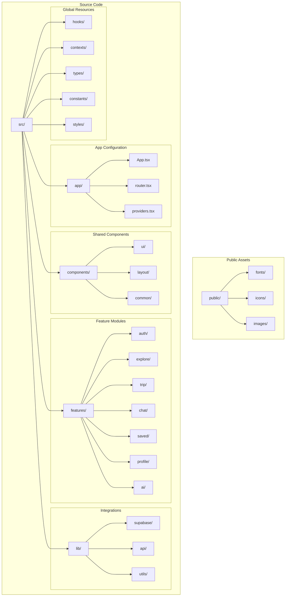
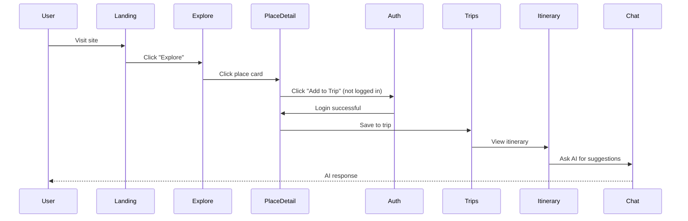
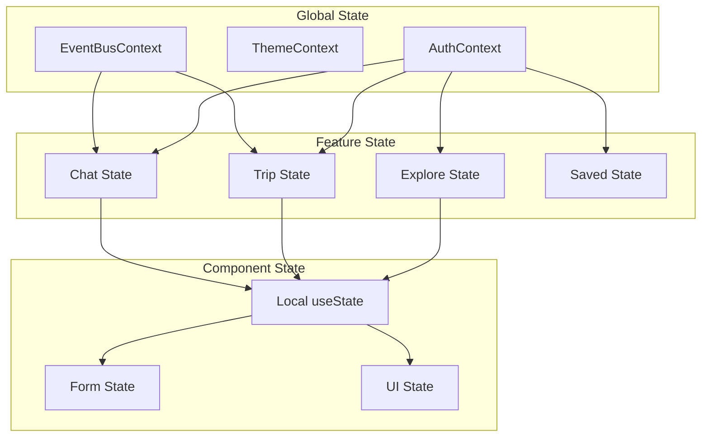

# Directory Structure & Routing — Implementation Guide

**Date:** December 20, 2024  
**Purpose:** Complete guide for organizing codebase and implementing routing architecture  
**Status:** 🔴 Critical — Foundation for all development  
**Estimated Time:** 6-8 hours

---

## 🎯 Overview

This document provides a **comprehensive implementation plan** for organizing the Trip Operating System codebase with optimal directory structure and implementing production-ready routing with React Router.

**Goal:** Clean, scalable architecture that supports rapid feature development and easy maintenance.

---

## 📋 Table of Contents

1. [Current State Analysis](#current-state-analysis)
2. [Proposed Directory Structure](#proposed-directory-structure)
3. [Routing Architecture](#routing-architecture)
4. [Implementation Plan](#implementation-plan)
5. [File Organization Rules](#file-organization-rules)
6. [Component Ownership](#component-ownership)
7. [Verification & Testing](#verification--testing)
8. [Troubleshooting](#troubleshooting)
9. [Acceptance Criteria](#acceptance-criteria)

---

## 🔍 Current State Analysis

### Existing Structure Audit

**Before making changes, document current state:**

```
Current Project Structure:
/
├── src/
│   ├── components/      ← Many files, unclear organization
│   ├── contexts/        ← State management
│   ├── hooks/           ← Custom hooks
│   ├── pages/           ← Some pages exist
│   ├── utils/           ← Utilities
│   ├── types/           ← TypeScript types
│   ├── App.tsx          ← Main app
│   └── main.tsx         ← Entry point
├── public/              ← Static assets
└── package.json
```

**Issues with Current Structure:**
- 🔴 Components not organized by feature/domain
- 🔴 Unclear which components are shared vs. page-specific
- 🔴 No clear routing structure
- 🔴 Types scattered across files
- 🔴 Utilities not categorized

---

## 📁 Proposed Directory Structure

### Complete Project Organization

```
trip-operating-system/
├── public/
│   ├── fonts/                    # Custom fonts
│   ├── icons/                    # Favicon, app icons
│   └── images/                   # Static images
│
├── src/
│   ├── app/                      # App-level configuration
│   │   ├── App.tsx              # Main App component
│   │   ├── router.tsx           # Route configuration
│   │   └── providers.tsx        # Global providers wrapper
│   │
│   ├── assets/                   # Dynamic assets
│   │   ├── icons/               # SVG icon components
│   │   ├── images/              # Images imported in code
│   │   └── styles/              # Global styles, Tailwind config
│   │
│   ├── components/               # Shared UI components
│   │   ├── ui/                  # Base components (shadcn/ui)
│   │   │   ├── button.tsx
│   │   │   ├── card.tsx
│   │   │   ├── input.tsx
│   │   │   ├── modal.tsx
│   │   │   ├── dropdown.tsx
│   │   │   └── ...
│   │   │
│   │   ├── layout/              # Layout components
│   │   │   ├── Header.tsx
│   │   │   ├── Footer.tsx
│   │   │   ├── Sidebar.tsx
│   │   │   ├── BottomNav.tsx
│   │   │   └── MobileNav.tsx
│   │   │
│   │   └── common/              # Shared business components
│   │       ├── PlaceCard.tsx
│   │       ├── TripCard.tsx
│   │       ├── EventCard.tsx
│   │       ├── ChatBubble.tsx
│   │       └── ...
│   │
│   ├── features/                 # Feature-based modules
│   │   ├── auth/
│   │   │   ├── components/      # Auth-specific components
│   │   │   │   ├── LoginForm.tsx
│   │   │   │   ├── SignupForm.tsx
│   │   │   │   └── AuthModal.tsx
│   │   │   ├── hooks/           # Auth hooks
│   │   │   │   ├── useAuth.ts
│   │   │   │   └── useSession.ts
│   │   │   ├── types/           # Auth types
│   │   │   │   └── auth.types.ts
│   │   │   └── utils/           # Auth utilities
│   │   │       └── validation.ts
│   │   │
│   │   ├── explore/
│   │   │   ├── components/
│   │   │   │   ├── SearchBar.tsx
│   │   │   │   ├── FilterPanel.tsx
│   │   │   │   ├── ResultsList.tsx
│   │   │   │   ├── MapView.tsx
│   │   │   │   └── PlaceDetail.tsx
│   │   │   ├── hooks/
│   │   │   │   ├── useSearch.ts
│   │   │   │   ├── useFilters.ts
│   │   │   │   └── useMapView.ts
│   │   │   ├── types/
│   │   │   │   └── explore.types.ts
│   │   │   └── pages/
│   │   │       ├── ExplorePage.tsx
│   │   │       └── PlaceDetailPage.tsx
│   │   │
│   │   ├── trip/
│   │   │   ├── components/
│   │   │   │   ├── TripList.tsx
│   │   │   │   ├── TripHeader.tsx
│   │   │   │   ├── ItineraryView.tsx
│   │   │   │   ├── DayCard.tsx
│   │   │   │   ├── PlaceItem.tsx
│   │   │   │   └── AddPlaceButton.tsx
│   │   │   ├── hooks/
│   │   │   │   ├── useTrip.ts
│   │   │   │   ├── useItinerary.ts
│   │   │   │   └── useDragDrop.ts
│   │   │   ├── types/
│   │   │   │   └── trip.types.ts
│   │   │   └── pages/
│   │   │       ├── TripsPage.tsx
│   │   │       ├── TripPlannerPage.tsx
│   │   │       ├── ItineraryPage.tsx
│   │   │       └── BookingsPage.tsx
│   │   │
│   │   ├── chat/
│   │   │   ├── components/
│   │   │   │   ├── ChatInterface.tsx
│   │   │   │   ├── MessageList.tsx
│   │   │   │   ├── MessageInput.tsx
│   │   │   │   ├── AITypingIndicator.tsx
│   │   │   │   └── SuggestedActions.tsx
│   │   │   ├── hooks/
│   │   │   │   ├── useChat.ts
│   │   │   │   ├── useAIAgent.ts
│   │   │   │   └── useEventBus.ts
│   │   │   ├── types/
│   │   │   │   └── chat.types.ts
│   │   │   └── pages/
│   │   │       └── ChatPage.tsx
│   │   │
│   │   ├── saved/
│   │   │   ├── components/
│   │   │   │   ├── SavedPlacesList.tsx
│   │   │   │   ├── CollectionCard.tsx
│   │   │   │   └── CreateCollectionModal.tsx
│   │   │   ├── hooks/
│   │   │   │   └── useSaved.ts
│   │   │   ├── types/
│   │   │   │   └── saved.types.ts
│   │   │   └── pages/
│   │   │       └── SavedPage.tsx
│   │   │
│   │   ├── profile/
│   │   │   ├── components/
│   │   │   │   ├── ProfileHeader.tsx
│   │   │   │   ├── SettingsForm.tsx
│   │   │   │   └── PreferencesPanel.tsx
│   │   │   ├── hooks/
│   │   │   │   └── useProfile.ts
│   │   │   ├── types/
│   │   │   │   └── profile.types.ts
│   │   │   └── pages/
│   │   │       ├── ProfilePage.tsx
│   │   │       └── SettingsPage.tsx
│   │   │
│   │   └── ai/
│   │       ├── agents/               # AI agent implementations
│   │       │   ├── ExploreAgent.ts
│   │       │   ├── ItineraryAgent.ts
│   │       │   ├── BudgetAgent.ts
│   │       │   ├── ResearchAgent.ts
│   │       │   ├── ProactiveAgent.ts
│   │       │   └── CollaborationAgent.ts
│   │       ├── eventBus/             # Event bus system
│   │       │   ├── EventBus.ts
│   │       │   └── events.types.ts
│   │       ├── hooks/
│   │       │   └── useAI.ts
│   │       └── types/
│   │           └── ai.types.ts
│   │
│   ├── lib/                          # Third-party integrations
│   │   ├── supabase/
│   │   │   ├── client.ts            # Supabase client
│   │   │   ├── auth.ts              # Auth helpers
│   │   │   ├── database.ts          # DB helpers
│   │   │   └── storage.ts           # Storage helpers
│   │   ├── api/
│   │   │   ├── openai.ts            # OpenAI integration
│   │   │   ├── google-maps.ts       # Google Maps API
│   │   │   └── stripe.ts            # Stripe integration
│   │   └── utils/
│   │       ├── cn.ts                # Class name utility
│   │       ├── format.ts            # Formatters
│   │       └── validation.ts        # Validators
│   │
│   ├── hooks/                        # Global shared hooks
│   │   ├── useMediaQuery.ts
│   │   ├── useLocalStorage.ts
│   │   ├── useDebounce.ts
│   │   ├── useClickOutside.ts
│   │   └── useKeyPress.ts
│   │
│   ├── contexts/                     # Global contexts
│   │   ├── AuthContext.tsx
│   │   ├── ThemeContext.tsx
│   │   ├── UserContext.tsx
│   │   └── EventBusContext.tsx
│   │
│   ├── types/                        # Global TypeScript types
│   │   ├── global.d.ts
│   │   ├── database.types.ts        # Supabase generated types
│   │   └── common.types.ts
│   │
│   ├── constants/                    # Global constants
│   │   ├── routes.ts                # Route paths
│   │   ├── config.ts                # App configuration
│   │   └── api.ts                   # API endpoints
│   │
│   ├── pages/                        # Top-level page components (DEPRECATED - use features/*/pages)
│   │   └── LandingPage.tsx          # Only landing page here
│   │
│   ├── styles/                       # Global styles
│   │   ├── globals.css              # Tailwind + global CSS
│   │   └── themes.css               # Theme variables
│   │
│   └── main.tsx                      # App entry point
│
├── tests/                            # Test files
│   ├── unit/
│   ├── integration/
│   └── e2e/
│
├── .env.local                        # Environment variables
├── .env.example                      # Example env file
├── tailwind.config.js
├── tsconfig.json
├── vite.config.ts
└── package.json
```

---

### Directory Structure Diagram



---

## 🗺️ Routing Architecture

### Route Structure

```
Route Hierarchy:
/
├── / (Landing)                      # Public
├── /explore                         # Public
│   └── /place/:id                   # Public
├── /auth                            # Public
│   ├── /login                       # Public
│   └── /signup                      # Public
├── /trips                           # Protected
│   ├── /new                         # Protected
│   ├── /:tripId                     # Protected
│   │   ├── /planner                 # Protected
│   │   ├── /itinerary               # Protected
│   │   ├── /bookings                # Protected
│   │   └── /chat                    # Protected
├── /saved                           # Protected
├── /profile                         # Protected
│   └── /settings                    # Protected
└── /404                             # Public (Not Found)
```

---

### Routing Diagram

```mermaid
flowchart TD
    Root[/ Landing] --> Explore[/explore]
    Root --> Auth[/auth]
    Root --> Trips[/trips Protected]
    Root --> Saved[/saved Protected]
    Root --> Profile[/profile Protected]
    
    Explore --> PlaceDetail[/explore/place/:id]
    
    Auth --> Login[/auth/login]
    Auth --> Signup[/auth/signup]
    
    Trips --> NewTrip[/trips/new]
    Trips --> TripDetail[/trips/:tripId]
    
    TripDetail --> Planner[/trips/:tripId/planner]
    TripDetail --> Itinerary[/trips/:tripId/itinerary]
    TripDetail --> Bookings[/trips/:tripId/bookings]
    TripDetail --> Chat[/trips/:tripId/chat]
    
    Profile --> Settings[/profile/settings]
    
    Root --> NotFound[/404]
    
    style Root fill:#064E3B,color:#fff
    style Trips fill:#D4AF37,color:#000
    style Saved fill:#D4AF37,color:#000
    style Profile fill:#D4AF37,color:#000
    style Explore fill:#059669,color:#fff
```

---

### Route Configuration

**File:** `src/app/router.tsx`

```typescript
import { createBrowserRouter, Navigate } from 'react-router-dom';
import { lazy, Suspense } from 'react';

// Layouts
import RootLayout from '@/components/layout/RootLayout';
import ProtectedLayout from '@/components/layout/ProtectedLayout';
import TripLayout from '@/features/trip/components/TripLayout';

// Loading fallback
import PageLoader from '@/components/common/PageLoader';

// Lazy load pages for code splitting
const LandingPage = lazy(() => import('@/pages/LandingPage'));
const ExplorePage = lazy(() => import('@/features/explore/pages/ExplorePage'));
const PlaceDetailPage = lazy(() => import('@/features/explore/pages/PlaceDetailPage'));
const LoginPage = lazy(() => import('@/features/auth/components/LoginForm'));
const SignupPage = lazy(() => import('@/features/auth/components/SignupForm'));
const TripsPage = lazy(() => import('@/features/trip/pages/TripsPage'));
const TripPlannerPage = lazy(() => import('@/features/trip/pages/TripPlannerPage'));
const ItineraryPage = lazy(() => import('@/features/trip/pages/ItineraryPage'));
const BookingsPage = lazy(() => import('@/features/trip/pages/BookingsPage'));
const ChatPage = lazy(() => import('@/features/chat/pages/ChatPage'));
const SavedPage = lazy(() => import('@/features/saved/pages/SavedPage'));
const ProfilePage = lazy(() => import('@/features/profile/pages/ProfilePage'));
const SettingsPage = lazy(() => import('@/features/profile/pages/SettingsPage'));
const NotFoundPage = lazy(() => import('@/pages/NotFoundPage'));

// Wrapper for lazy loaded components
const Lazy = ({ children }: { children: React.ReactNode }) => (
  <Suspense fallback={<PageLoader />}>
    {children}
  </Suspense>
);

export const router = createBrowserRouter([
  {
    path: '/',
    element: <RootLayout />,
    errorElement: <NotFoundPage />,
    children: [
      {
        index: true,
        element: <Lazy><LandingPage /></Lazy>,
      },
      {
        path: 'explore',
        element: <Lazy><ExplorePage /></Lazy>,
      },
      {
        path: 'explore/place/:id',
        element: <Lazy><PlaceDetailPage /></Lazy>,
      },
      {
        path: 'auth',
        children: [
          {
            path: 'login',
            element: <Lazy><LoginPage /></Lazy>,
          },
          {
            path: 'signup',
            element: <Lazy><SignupPage /></Lazy>,
          },
        ],
      },
      {
        path: 'trips',
        element: <ProtectedLayout />,
        children: [
          {
            index: true,
            element: <Lazy><TripsPage /></Lazy>,
          },
          {
            path: 'new',
            element: <Lazy><TripPlannerPage /></Lazy>,
          },
          {
            path: ':tripId',
            element: <TripLayout />,
            children: [
              {
                index: true,
                element: <Navigate to="planner" replace />,
              },
              {
                path: 'planner',
                element: <Lazy><TripPlannerPage /></Lazy>,
              },
              {
                path: 'itinerary',
                element: <Lazy><ItineraryPage /></Lazy>,
              },
              {
                path: 'bookings',
                element: <Lazy><BookingsPage /></Lazy>,
              },
              {
                path: 'chat',
                element: <Lazy><ChatPage /></Lazy>,
              },
            ],
          },
        ],
      },
      {
        path: 'saved',
        element: <ProtectedLayout />,
        children: [
          {
            index: true,
            element: <Lazy><SavedPage /></Lazy>,
          },
        ],
      },
      {
        path: 'profile',
        element: <ProtectedLayout />,
        children: [
          {
            index: true,
            element: <Lazy><ProfilePage /></Lazy>,
          },
          {
            path: 'settings',
            element: <Lazy><SettingsPage /></Lazy>,
          },
        ],
      },
      {
        path: '404',
        element: <Lazy><NotFoundPage /></Lazy>,
      },
      {
        path: '*',
        element: <Navigate to="/404" replace />,
      },
    ],
  },
]);
```

---

### Layout Components

#### RootLayout

**Purpose:** Main layout wrapper for all pages

**File:** `src/components/layout/RootLayout.tsx`

```typescript
import { Outlet } from 'react-router-dom';
import Header from './Header';
import Footer from './Footer';
import MobileNav from './MobileNav';
import { useMediaQuery } from '@/hooks/useMediaQuery';

export default function RootLayout() {
  const isMobile = useMediaQuery('(max-width: 768px)');

  return (
    <div className="min-h-screen flex flex-col">
      <Header />
      
      <main className="flex-1">
        <Outlet />
      </main>
      
      {isMobile ? <MobileNav /> : <Footer />}
    </div>
  );
}
```

---

#### ProtectedLayout

**Purpose:** Wrapper for authenticated routes

**File:** `src/components/layout/ProtectedLayout.tsx`

```typescript
import { Navigate, Outlet } from 'react-router-dom';
import { useAuth } from '@/features/auth/hooks/useAuth';
import PageLoader from '@/components/common/PageLoader';

export default function ProtectedLayout() {
  const { user, loading } = useAuth();

  if (loading) {
    return <PageLoader />;
  }

  if (!user) {
    return <Navigate to="/auth/login" replace />;
  }

  return <Outlet />;
}
```

---

#### TripLayout

**Purpose:** Layout for trip-specific pages with tabs

**File:** `src/features/trip/components/TripLayout.tsx`

```typescript
import { Outlet, useParams, NavLink } from 'react-router-dom';
import { useTrip } from '../hooks/useTrip';
import TripHeader from './TripHeader';
import PageLoader from '@/components/common/PageLoader';

export default function TripLayout() {
  const { tripId } = useParams<{ tripId: string }>();
  const { trip, loading } = useTrip(tripId!);

  if (loading) {
    return <PageLoader />;
  }

  if (!trip) {
    return <Navigate to="/trips" replace />;
  }

  const tabs = [
    { name: 'Planner', path: `/trips/${tripId}/planner` },
    { name: 'Itinerary', path: `/trips/${tripId}/itinerary` },
    { name: 'Bookings', path: `/trips/${tripId}/bookings` },
    { name: 'Chat', path: `/trips/${tripId}/chat` },
  ];

  return (
    <div className="container mx-auto px-4">
      <TripHeader trip={trip} />
      
      <nav className="flex gap-4 border-b border-emerald-200 mb-6">
        {tabs.map((tab) => (
          <NavLink
            key={tab.path}
            to={tab.path}
            className={({ isActive }) =>
              `px-4 py-2 border-b-2 transition-colors ${
                isActive
                  ? 'border-emerald-600 text-emerald-900'
                  : 'border-transparent text-gray-600 hover:text-emerald-700'
              }`
            }
          >
            {tab.name}
          </NavLink>
        ))}
      </nav>
      
      <Outlet />
    </div>
  );
}
```

---

### Navigation Flow



---

## 🛠️ Implementation Plan

### Phase 1: Create Directory Structure

**Time:** 60 minutes  
**Priority:** 🔴 Critical

#### Step 1.1: Create Base Directories

**Action:**
```bash
# Create main directories
mkdir -p src/app
mkdir -p src/assets/{icons,images,styles}
mkdir -p src/components/{ui,layout,common}
mkdir -p src/features
mkdir -p src/lib/{supabase,api,utils}
mkdir -p src/hooks
mkdir -p src/contexts
mkdir -p src/types
mkdir -p src/constants
mkdir -p src/styles
mkdir -p tests/{unit,integration,e2e}
```

**Checklist:**
- [ ] All base directories created
- [ ] Directory structure matches specification
- [ ] No typos in directory names
- [ ] Permissions correct (writable)

---

#### Step 1.2: Create Feature Directories

**Action:**
```bash
# Create feature module directories
for feature in auth explore trip chat saved profile ai; do
  mkdir -p src/features/$feature/{components,hooks,types,pages}
done

# Create AI subdirectories
mkdir -p src/features/ai/{agents,eventBus}

# Create lib subdirectories
mkdir -p src/lib/supabase
mkdir -p src/lib/api
mkdir -p src/lib/utils
```

**Checklist:**
- [ ] All feature directories created
- [ ] Each feature has components, hooks, types, pages subdirectories
- [ ] AI feature has agents and eventBus subdirectories
- [ ] Lib has supabase, api, utils subdirectories

---

### Phase 2: Create Route Configuration

**Time:** 90 minutes  
**Priority:** 🔴 Critical

#### Step 2.1: Install React Router

**Action:**
```bash
npm install react-router-dom
npm install -D @types/react-router-dom
```

**Verification:**
```bash
# Check installation
npm list react-router-dom
# Should show version 6.x.x
```

---

#### Step 2.2: Create Router Configuration

**Action:**

1. **Create `src/app/router.tsx`** (use code from [Route Configuration](#route-configuration) section above)

2. **Create `src/constants/routes.ts`:**

```typescript
// Route path constants
export const ROUTES = {
  HOME: '/',
  EXPLORE: '/explore',
  PLACE_DETAIL: '/explore/place/:id',
  
  AUTH: {
    LOGIN: '/auth/login',
    SIGNUP: '/auth/signup',
  },
  
  TRIPS: {
    LIST: '/trips',
    NEW: '/trips/new',
    DETAIL: '/trips/:tripId',
    PLANNER: '/trips/:tripId/planner',
    ITINERARY: '/trips/:tripId/itinerary',
    BOOKINGS: '/trips/:tripId/bookings',
    CHAT: '/trips/:tripId/chat',
  },
  
  SAVED: '/saved',
  
  PROFILE: {
    VIEW: '/profile',
    SETTINGS: '/profile/settings',
  },
  
  NOT_FOUND: '/404',
} as const;

// Helper to build route with params
export const buildRoute = (
  path: string,
  params: Record<string, string>
): string => {
  let result = path;
  Object.entries(params).forEach(([key, value]) => {
    result = result.replace(`:${key}`, value);
  });
  return result;
};

// Usage: buildRoute(ROUTES.TRIPS.DETAIL, { tripId: '123' })
// Returns: '/trips/123'
```

3. **Update `src/app/App.tsx`:**

```typescript
import { RouterProvider } from 'react-router-dom';
import { router } from './router';
import { AuthProvider } from '@/contexts/AuthContext';
import { ThemeProvider } from '@/contexts/ThemeContext';
import { EventBusProvider } from '@/contexts/EventBusContext';

export default function App() {
  return (
    <ThemeProvider>
      <AuthProvider>
        <EventBusProvider>
          <RouterProvider router={router} />
        </EventBusProvider>
      </AuthProvider>
    </ThemeProvider>
  );
}
```

4. **Update `src/main.tsx`:**

```typescript
import React from 'react';
import ReactDOM from 'react-dom/client';
import App from './app/App';
import './styles/globals.css';

ReactDOM.createRoot(document.getElementById('root')!).render(
  <React.StrictMode>
    <App />
  </React.StrictMode>
);
```

**Checklist:**
- [ ] React Router installed
- [ ] router.tsx created
- [ ] routes.ts constants created
- [ ] App.tsx updated
- [ ] main.tsx updated
- [ ] No TypeScript errors

---

#### Step 2.3: Create Layout Components

**Action:**

1. **Create `src/components/layout/RootLayout.tsx`** (use code from [RootLayout](#rootlayout) section)

2. **Create `src/components/layout/ProtectedLayout.tsx`** (use code from [ProtectedLayout](#protectedlayout) section)

3. **Create `src/features/trip/components/TripLayout.tsx`** (use code from [TripLayout](#triplayout) section)

4. **Create `src/components/layout/Header.tsx`:**

```typescript
import { Link } from 'react-router-dom';
import { useAuth } from '@/features/auth/hooks/useAuth';
import { ROUTES } from '@/constants/routes';
import { Button } from '@/components/ui/button';

export default function Header() {
  const { user, logout } = useAuth();

  return (
    <header className="sticky top-0 z-50 bg-white border-b border-emerald-100">
      <div className="container mx-auto px-4 py-4 flex items-center justify-between">
        <Link to={ROUTES.HOME} className="text-2xl font-bold text-emerald-900">
          Local Scout
        </Link>
        
        <nav className="hidden md:flex gap-6">
          <Link to={ROUTES.EXPLORE} className="hover:text-emerald-700">
            Explore
          </Link>
          {user && (
            <>
              <Link to={ROUTES.TRIPS.LIST} className="hover:text-emerald-700">
                Trips
              </Link>
              <Link to={ROUTES.SAVED} className="hover:text-emerald-700">
                Saved
              </Link>
            </>
          )}
        </nav>
        
        <div className="flex items-center gap-4">
          {user ? (
            <>
              <Link to={ROUTES.PROFILE.VIEW}>
                <Button variant="ghost">Profile</Button>
              </Link>
              <Button variant="secondary" onClick={logout}>
                Logout
              </Button>
            </>
          ) : (
            <>
              <Link to={ROUTES.AUTH.LOGIN}>
                <Button variant="ghost">Login</Button>
              </Link>
              <Link to={ROUTES.AUTH.SIGNUP}>
                <Button variant="primary">Sign Up</Button>
              </Link>
            </>
          )}
        </div>
      </div>
    </header>
  );
}
```

5. **Create `src/components/layout/MobileNav.tsx`:**

```typescript
import { NavLink } from 'react-router-dom';
import { useAuth } from '@/features/auth/hooks/useAuth';
import { ROUTES } from '@/constants/routes';
import { Home, Search, Calendar, Heart, User } from 'lucide-react';

export default function MobileNav() {
  const { user } = useAuth();

  if (!user) return null;

  const tabs = [
    { name: 'Home', path: ROUTES.HOME, icon: Home },
    { name: 'Explore', path: ROUTES.EXPLORE, icon: Search },
    { name: 'Trips', path: ROUTES.TRIPS.LIST, icon: Calendar },
    { name: 'Saved', path: ROUTES.SAVED, icon: Heart },
    { name: 'Profile', path: ROUTES.PROFILE.VIEW, icon: User },
  ];

  return (
    <nav className="fixed bottom-0 left-0 right-0 bg-white border-t border-emerald-100 md:hidden">
      <div className="flex justify-around">
        {tabs.map((tab) => (
          <NavLink
            key={tab.path}
            to={tab.path}
            className={({ isActive }) =>
              `flex flex-col items-center py-2 px-3 text-xs ${
                isActive ? 'text-emerald-700' : 'text-gray-600'
              }`
            }
          >
            <tab.icon className="h-6 w-6 mb-1" />
            <span>{tab.name}</span>
          </NavLink>
        ))}
      </div>
    </nav>
  );
}
```

**Checklist:**
- [ ] RootLayout created
- [ ] ProtectedLayout created
- [ ] TripLayout created
- [ ] Header created
- [ ] MobileNav created
- [ ] All imports working
- [ ] No TypeScript errors

---

### Phase 3: Migrate Components

**Time:** 120-180 minutes  
**Priority:** 🔴 Critical

#### Step 3.1: Identify Component Types

**Action:**

Create a spreadsheet or document to categorize existing components:

| Component | Current Location | New Location | Type | Notes |
|-----------|-----------------|--------------|------|-------|
| Button | components/ | components/ui/ | Base UI | shadcn/ui |
| Card | components/ | components/ui/ | Base UI | shadcn/ui |
| PlaceCard | components/ | components/common/ | Shared Business | Used across features |
| SearchBar | components/ | features/explore/components/ | Feature-specific | Only in explore |
| TripList | components/ | features/trip/components/ | Feature-specific | Only in trips |
| ChatBubble | components/ | features/chat/components/ | Feature-specific | Only in chat |
| ... | ... | ... | ... | ... |

**Checklist:**
- [ ] All components listed
- [ ] Type assigned (Base UI, Shared Business, Feature-specific)
- [ ] New location determined
- [ ] Dependencies documented

---

#### Step 3.2: Move Base UI Components

**Action:**

```bash
# Move shadcn/ui components to components/ui/
mv src/components/button.tsx src/components/ui/
mv src/components/card.tsx src/components/ui/
mv src/components/input.tsx src/components/ui/
mv src/components/modal.tsx src/components/ui/
# ... repeat for all base UI components
```

**Update Imports:**

```typescript
// Old import
import { Button } from '../components/button';

// New import
import { Button } from '@/components/ui/button';
```

**Checklist:**
- [ ] All base UI components moved to components/ui/
- [ ] All import paths updated
- [ ] No broken imports
- [ ] TypeScript compiles

---

#### Step 3.3: Move Layout Components

**Action:**

```bash
# Move layout components
mv src/components/Header.tsx src/components/layout/
mv src/components/Footer.tsx src/components/layout/
mv src/components/Sidebar.tsx src/components/layout/
```

**Checklist:**
- [ ] All layout components moved
- [ ] Imports updated
- [ ] No errors

---

#### Step 3.4: Move Shared Business Components

**Action:**

```bash
# Move shared business components
mv src/components/PlaceCard.tsx src/components/common/
mv src/components/TripCard.tsx src/components/common/
mv src/components/EventCard.tsx src/components/common/
```

**Checklist:**
- [ ] All shared business components moved
- [ ] Imports updated
- [ ] Components still work across features

---

#### Step 3.5: Move Feature-Specific Components

**Action:**

For each feature, move its specific components:

**Explore:**
```bash
mv src/components/SearchBar.tsx src/features/explore/components/
mv src/components/FilterPanel.tsx src/features/explore/components/
mv src/components/ResultsList.tsx src/features/explore/components/
mv src/components/MapView.tsx src/features/explore/components/
mv src/components/PlaceDetail.tsx src/features/explore/components/
```

**Trip:**
```bash
mv src/components/TripList.tsx src/features/trip/components/
mv src/components/ItineraryView.tsx src/features/trip/components/
mv src/components/DayCard.tsx src/features/trip/components/
mv src/components/PlaceItem.tsx src/features/trip/components/
```

**Chat:**
```bash
mv src/components/ChatInterface.tsx src/features/chat/components/
mv src/components/MessageList.tsx src/features/chat/components/
mv src/components/MessageInput.tsx src/features/chat/components/
```

**Repeat for all features.**

**Checklist:**
- [ ] All explore components moved
- [ ] All trip components moved
- [ ] All chat components moved
- [ ] All saved components moved
- [ ] All profile components moved
- [ ] All imports updated
- [ ] TypeScript compiles

---

### Phase 4: Create Page Components

**Time:** 60 minutes  
**Priority:** 🔴 Critical

#### Step 4.1: Create Feature Pages

**Action:**

For each feature, create a `pages/` directory and main page component.

**Example: Explore Feature**

**Create `src/features/explore/pages/ExplorePage.tsx`:**

```typescript
import { useState } from 'react';
import SearchBar from '../components/SearchBar';
import FilterPanel from '../components/FilterPanel';
import ResultsList from '../components/ResultsList';
import MapView from '../components/MapView';
import { useSearch } from '../hooks/useSearch';

export default function ExplorePage() {
  const [showMap, setShowMap] = useState(false);
  const { results, loading, search } = useSearch();

  return (
    <div className="container mx-auto px-4 py-6">
      <SearchBar onSearch={search} />
      
      <div className="flex gap-6 mt-6">
        <aside className="w-64 hidden lg:block">
          <FilterPanel />
        </aside>
        
        <main className="flex-1">
          {showMap ? (
            <MapView results={results} />
          ) : (
            <ResultsList results={results} loading={loading} />
          )}
        </main>
      </div>
    </div>
  );
}
```

**Create similar pages for all features:**

- `src/features/explore/pages/PlaceDetailPage.tsx`
- `src/features/trip/pages/TripsPage.tsx`
- `src/features/trip/pages/TripPlannerPage.tsx`
- `src/features/trip/pages/ItineraryPage.tsx`
- `src/features/trip/pages/BookingsPage.tsx`
- `src/features/chat/pages/ChatPage.tsx`
- `src/features/saved/pages/SavedPage.tsx`
- `src/features/profile/pages/ProfilePage.tsx`
- `src/features/profile/pages/SettingsPage.tsx`

**Checklist:**
- [ ] All feature pages created
- [ ] Pages import correct components
- [ ] Pages use correct hooks
- [ ] Pages export default
- [ ] No TypeScript errors

---

### Phase 5: Update Import Paths

**Time:** 90 minutes  
**Priority:** 🔴 Critical

#### Step 5.1: Configure Path Aliases

**Action:**

**Update `tsconfig.json`:**

```json
{
  "compilerOptions": {
    "baseUrl": ".",
    "paths": {
      "@/*": ["src/*"],
      "@/components/*": ["src/components/*"],
      "@/features/*": ["src/features/*"],
      "@/lib/*": ["src/lib/*"],
      "@/hooks/*": ["src/hooks/*"],
      "@/contexts/*": ["src/contexts/*"],
      "@/types/*": ["src/types/*"],
      "@/constants/*": ["src/constants/*"],
      "@/styles/*": ["src/styles/*"]
    }
  }
}
```

**Update `vite.config.ts`:**

```typescript
import { defineConfig } from 'vite';
import react from '@vitejs/plugin-react';
import path from 'path';

export default defineConfig({
  plugins: [react()],
  resolve: {
    alias: {
      '@': path.resolve(__dirname, './src'),
    },
  },
});
```

**Checklist:**
- [ ] tsconfig.json updated
- [ ] vite.config.ts updated
- [ ] TypeScript recognizes aliases
- [ ] Vite resolves aliases

---

#### Step 5.2: Update All Imports

**Action:**

Use Find & Replace to update imports across the codebase:

**Old:**
```typescript
import { Button } from '../../../components/button';
import { useAuth } from '../../hooks/useAuth';
```

**New:**
```typescript
import { Button } from '@/components/ui/button';
import { useAuth } from '@/features/auth/hooks/useAuth';
```

**Automated Script:**

Create `scripts/update-imports.js`:

```javascript
const fs = require('fs');
const path = require('path');
const glob = require('glob');

const files = glob.sync('src/**/*.{ts,tsx}');

files.forEach((file) => {
  let content = fs.readFileSync(file, 'utf8');
  
  // Replace relative imports with absolute
  content = content.replace(
    /from ['"](\.\.\/)+(components|hooks|contexts|lib|types|constants)['"]/g,
    "from '@/$2'"
  );
  
  fs.writeFileSync(file, content);
});

console.log(`Updated ${files.length} files`);
```

**Run:**
```bash
node scripts/update-imports.js
```

**Checklist:**
- [ ] Script created
- [ ] Script executed
- [ ] All imports updated
- [ ] TypeScript compiles
- [ ] No import errors

---

### Phase 6: Verify & Test

**Time:** 60 minutes  
**Priority:** 🔴 Critical

#### Step 6.1: Compile Check

**Action:**
```bash
# TypeScript check
npm run tsc --noEmit

# Build check
npm run build

# Dev server check
npm run dev
```

**Expected Results:**
- ✅ No TypeScript errors
- ✅ Build succeeds
- ✅ Dev server starts without errors

**Checklist:**
- [ ] TypeScript compiles
- [ ] Build succeeds
- [ ] Dev server starts
- [ ] No console errors

---

#### Step 6.2: Route Testing

**Action:**

Test each route manually:

1. Navigate to `/` → Landing page loads
2. Navigate to `/explore` → Explore page loads
3. Navigate to `/auth/login` → Login page loads
4. Navigate to `/trips` (not logged in) → Redirects to `/auth/login`
5. Login → Navigate to `/trips` → Trips page loads
6. Navigate to `/trips/:tripId/planner` → Planner loads
7. Navigate to `/saved` → Saved page loads
8. Navigate to `/profile` → Profile loads
9. Navigate to `/invalid-route` → Redirects to `/404`

**Checklist:**
- [ ] All routes accessible
- [ ] Protected routes redirect when not logged in
- [ ] Redirects work correctly
- [ ] 404 page shows for invalid routes
- [ ] No console errors

---

#### Step 6.3: Component Testing

**Action:**

For each moved component, verify:

1. Component renders without errors
2. Component maintains functionality
3. Props are passed correctly
4. Styles are applied correctly
5. Interactions work (clicks, hovers, etc.)

**Checklist:**
- [ ] All base UI components work
- [ ] All layout components work
- [ ] All shared business components work
- [ ] All feature-specific components work
- [ ] No regression in functionality

---

## 📐 File Organization Rules

### Naming Conventions

**Files:**
- Components: `PascalCase.tsx` (e.g., `TripCard.tsx`)
- Hooks: `camelCase.ts` starting with `use` (e.g., `useTrip.ts`)
- Types: `camelCase.types.ts` (e.g., `trip.types.ts`)
- Utils: `camelCase.ts` (e.g., `formatDate.ts`)
- Constants: `SCREAMING_SNAKE_CASE.ts` (e.g., `API_ENDPOINTS.ts`)

**Directories:**
- Features: `kebab-case` (e.g., `trip-planner/`)
- Others: `camelCase` (e.g., `components/`, `hooks/`)

---

### Component Organization

**Feature Component Structure:**

```
features/trip/components/
├── TripList.tsx             # Main component
├── TripCard.tsx             # Sub-component
├── TripHeader.tsx           # Sub-component
├── TripLayout.tsx           # Layout
└── index.ts                 # Barrel export
```

**Barrel Export (`index.ts`):**

```typescript
export { default as TripList } from './TripList';
export { default as TripCard } from './TripCard';
export { default as TripHeader } from './TripHeader';
export { default as TripLayout } from './TripLayout';
```

**Usage:**
```typescript
// Instead of multiple imports
import TripList from '@/features/trip/components/TripList';
import TripCard from '@/features/trip/components/TripCard';

// Use barrel import
import { TripList, TripCard } from '@/features/trip/components';
```

---

### Component File Structure

**Standard Component:**

```typescript
// 1. Imports
import { useState } from 'react';
import { Button } from '@/components/ui/button';
import { useSomeHook } from '../hooks/useSomeHook';
import type { SomeType } from '../types/some.types';

// 2. Types/Interfaces
interface ComponentProps {
  id: string;
  onAction: (id: string) => void;
  children?: React.ReactNode;
}

// 3. Component
export default function Component({ id, onAction, children }: ComponentProps) {
  // 3a. Hooks
  const [state, setState] = useState<string>('');
  const { data, loading } = useSomeHook(id);
  
  // 3b. Handlers
  const handleClick = () => {
    onAction(id);
  };
  
  // 3c. Early returns
  if (loading) return <div>Loading...</div>;
  if (!data) return <div>No data</div>;
  
  // 3d. Render
  return (
    <div>
      <Button onClick={handleClick}>Action</Button>
      {children}
    </div>
  );
}

// 4. Sub-components (if small and only used here)
function SubComponent() {
  return <div>Sub</div>;
}
```

---

### Hook Organization

**Standard Hook:**

```typescript
// features/trip/hooks/useTrip.ts
import { useState, useEffect } from 'react';
import { supabase } from '@/lib/supabase/client';
import type { Trip } from '../types/trip.types';

export function useTrip(tripId: string) {
  const [trip, setTrip] = useState<Trip | null>(null);
  const [loading, setLoading] = useState(true);
  const [error, setError] = useState<Error | null>(null);

  useEffect(() => {
    async function fetchTrip() {
      try {
        setLoading(true);
        const { data, error } = await supabase
          .from('trips')
          .select('*')
          .eq('id', tripId)
          .single();

        if (error) throw error;
        setTrip(data);
      } catch (err) {
        setError(err as Error);
      } finally {
        setLoading(false);
      }
    }

    if (tripId) {
      fetchTrip();
    }
  }, [tripId]);

  return { trip, loading, error };
}
```

---

### Type Organization

**Feature Types:**

```typescript
// features/trip/types/trip.types.ts

export interface Trip {
  id: string;
  user_id: string;
  name: string;
  destination: string;
  start_date: string;
  end_date: string;
  status: TripStatus;
  created_at: string;
  updated_at: string;
}

export type TripStatus = 'planning' | 'booked' | 'in_progress' | 'completed' | 'cancelled';

export interface TripWithItems extends Trip {
  items: TripItem[];
}

export interface TripItem {
  id: string;
  trip_id: string;
  name: string;
  category: TripItemCategory;
  day_number: number;
  order_index: number;
  created_at: string;
}

export type TripItemCategory = 'accommodation' | 'activity' | 'restaurant' | 'transport' | 'other';

// API request/response types
export interface CreateTripRequest {
  name: string;
  destination: string;
  start_date: string;
  end_date: string;
}

export interface UpdateTripRequest extends Partial<CreateTripRequest> {
  status?: TripStatus;
}
```

---

## 🏗️ Component Ownership

### Ownership Table

| Component | Location | Owner | State Source | Data Source | Notes |
|-----------|----------|-------|--------------|-------------|-------|
| **Base UI** |
| Button | `components/ui/` | UI Team | Props | N/A | shadcn/ui |
| Input | `components/ui/` | UI Team | Controlled (parent) | N/A | shadcn/ui |
| Card | `components/ui/` | UI Team | Props | N/A | shadcn/ui |
| Modal | `components/ui/` | UI Team | Props | N/A | shadcn/ui |
| **Layout** |
| Header | `components/layout/` | Layout Team | AuthContext | AuthContext | Global |
| Footer | `components/layout/` | Layout Team | N/A | N/A | Global |
| MobileNav | `components/layout/` | Layout Team | Router | Router | Global |
| **Shared Business** |
| PlaceCard | `components/common/` | Product Team | Props | Parent | Reusable |
| TripCard | `components/common/` | Product Team | Props | Parent | Reusable |
| EventCard | `components/common/` | Product Team | Props | Parent | Reusable |
| **Explore Feature** |
| SearchBar | `features/explore/` | Explore Team | Local + useSearch hook | API | Feature |
| FilterPanel | `features/explore/` | Explore Team | Local + useFilters hook | API | Feature |
| ResultsList | `features/explore/` | Explore Team | Props (from parent) | Props | Feature |
| MapView | `features/explore/` | Explore Team | Props + local | Google Maps API | Feature |
| PlaceDetail | `features/explore/` | Explore Team | usePlace hook | Supabase | Feature |
| **Trip Feature** |
| TripList | `features/trip/` | Trip Team | useTrips hook | Supabase | Feature |
| ItineraryView | `features/trip/` | Trip Team | useItinerary hook | Supabase | Feature |
| DayCard | `features/trip/` | Trip Team | Props | Parent | Feature |
| PlaceItem | `features/trip/` | Trip Team | Props + useDragDrop | Parent | Feature |
| TripHeader | `features/trip/` | Trip Team | Props | Parent | Feature |
| **Chat Feature** |
| ChatInterface | `features/chat/` | Chat Team | useChatContext | EventBus + Supabase | Feature |
| MessageList | `features/chat/` | Chat Team | Props | Parent (ChatContext) | Feature |
| MessageInput | `features/chat/` | Chat Team | Local + controlled | Parent callback | Feature |
| AITypingIndicator | `features/chat/` | Chat Team | Props | Parent | Feature |
| **Saved Feature** |
| SavedPlacesList | `features/saved/` | Saved Team | useSaved hook | Supabase | Feature |
| CollectionCard | `features/saved/` | Saved Team | Props | Parent | Feature |
| **Profile Feature** |
| ProfileHeader | `features/profile/` | Profile Team | useProfile hook | Supabase | Feature |
| SettingsForm | `features/profile/` | Profile Team | Local + useProfile | Supabase | Feature |

---

### State Management Strategy



**State Guidelines:**

1. **Global State (Contexts):**
   - Authentication (user, session)
   - Theme (dark mode, preferences)
   - Event bus (AI agent communication)
   - Use only for truly global data

2. **Feature State (Hooks + Context):**
   - Feature-specific data (trips, saved places)
   - API calls within feature
   - Can use local context for feature if complex

3. **Component State (useState):**
   - UI state (modals open/closed, selected items)
   - Form inputs
   - Temporary data
   - Keep close to component using it

---

## ✅ Verification & Testing

### Directory Structure Verification

**Run these checks:**

```bash
# 1. Check directory structure
tree src/ -L 3

# Expected output should match proposed structure

# 2. Check for orphaned files
find src/ -name "*.tsx" -o -name "*.ts" | grep -v node_modules

# All files should be in appropriate directories

# 3. Check import paths
grep -r "from '\.\.\/" src/

# Should be minimal, most imports should use '@/'

# 4. TypeScript compilation
npm run tsc --noEmit

# Should show 0 errors
```

---

### Route Verification

**Manual Testing Checklist:**

- [ ] **Landing Page (`/`):**
  - [ ] Page loads
  - [ ] Header shows
  - [ ] Footer/MobileNav shows
  - [ ] Links navigate correctly

- [ ] **Explore Page (`/explore`):**
  - [ ] Page loads
  - [ ] SearchBar works
  - [ ] Results display
  - [ ] Can navigate to place detail

- [ ] **Place Detail (`/explore/place/:id`):**
  - [ ] Page loads with ID
  - [ ] Place data fetches
  - [ ] Can add to trip

- [ ] **Auth Pages (`/auth/login`, `/auth/signup`):**
  - [ ] Pages load
  - [ ] Forms work
  - [ ] Redirects after login

- [ ] **Protected Routes:**
  - [ ] Redirect to login when not authenticated
  - [ ] Load correctly when authenticated

- [ ] **Trips Pages (`/trips/*`):**
  - [ ] List page shows trips
  - [ ] Can create new trip
  - [ ] Detail page loads
  - [ ] Tabs work (Planner, Itinerary, Bookings, Chat)

- [ ] **Saved Page (`/saved`):**
  - [ ] Page loads
  - [ ] Shows saved places

- [ ] **Profile Pages (`/profile`, `/profile/settings`):**
  - [ ] Pages load
  - [ ] Settings save

- [ ] **404 Page:**
  - [ ] Shows for invalid routes
  - [ ] Can navigate back

---

### Component Verification

**Automated Test:**

Create `tests/unit/components.test.tsx`:

```typescript
import { describe, it, expect } from 'vitest';
import { render } from '@testing-library/react';
import { Button } from '@/components/ui/button';
import { PlaceCard } from '@/components/common/PlaceCard';
import { SearchBar } from '@/features/explore/components/SearchBar';

describe('Component Imports', () => {
  it('should import base UI components', () => {
    const { container } = render(<Button>Test</Button>);
    expect(container).toBeTruthy();
  });

  it('should import shared business components', () => {
    const mockPlace = { id: '1', name: 'Test Place', category: 'restaurant' };
    const { container } = render(<PlaceCard place={mockPlace} />);
    expect(container).toBeTruthy();
  });

  it('should import feature components', () => {
    const { container } = render(<SearchBar onSearch={() => {}} />);
    expect(container).toBeTruthy();
  });
});
```

**Run:**
```bash
npm run test
```

**Expected:** All imports resolve, tests pass

---

### Performance Verification

**Check bundle size:**

```bash
npm run build

# Check output
ls -lh dist/assets/

# Expect:
# - index-[hash].js < 500KB (with code splitting)
# - Each route chunk < 100KB
# - Total < 1MB
```

**Lighthouse Audit:**

1. Run production build: `npm run build && npm run preview`
2. Open Chrome DevTools
3. Run Lighthouse audit
4. Check scores:
   - Performance: > 90
   - Accessibility: > 90
   - Best Practices: > 90
   - SEO: > 90

---

## 🔧 Troubleshooting

### Issue 1: Import Paths Not Resolving

**Symptom:** TypeScript error "Cannot find module '@/components/...'"

**Causes:**
- Path aliases not configured
- TypeScript/Vite config mismatch

**Solutions:**

1. **Verify tsconfig.json:**
```json
{
  "compilerOptions": {
    "baseUrl": ".",
    "paths": {
      "@/*": ["src/*"]
    }
  }
}
```

2. **Verify vite.config.ts:**
```typescript
import path from 'path';

export default defineConfig({
  resolve: {
    alias: {
      '@': path.resolve(__dirname, './src'),
    },
  },
});
```

3. **Restart dev server:**
```bash
# Stop server (Ctrl+C)
npm run dev
```

---

### Issue 2: Routes Not Loading

**Symptom:** Blank page or "Page not found" for valid routes

**Causes:**
- Route configuration error
- Lazy loading not set up correctly
- Missing Suspense wrapper

**Solutions:**

1. **Check route exists in router.tsx:**
```typescript
// Verify route is defined
{
  path: 'explore',
  element: <Lazy><ExplorePage /></Lazy>,
}
```

2. **Check component export:**
```typescript
// Component must have default export
export default function ExplorePage() { ... }
```

3. **Check Suspense wrapper:**
```typescript
// Ensure Lazy component wraps lazy-loaded pages
const Lazy = ({ children }) => (
  <Suspense fallback={<PageLoader />}>
    {children}
  </Suspense>
);
```

4. **Check browser console for errors**

---

### Issue 3: Protected Routes Not Redirecting

**Symptom:** Can access protected routes without authentication

**Causes:**
- ProtectedLayout not wrapping routes
- useAuth hook not working
- Auth context not providing user

**Solutions:**

1. **Verify ProtectedLayout wraps route:**
```typescript
{
  path: 'trips',
  element: <ProtectedLayout />,
  children: [ ... ]
}
```

2. **Verify useAuth returns user:**
```typescript
const { user, loading } = useAuth();
console.log('User:', user); // Should be null when not logged in
```

3. **Verify redirect logic:**
```typescript
if (!user) {
  return <Navigate to="/auth/login" replace />;
}
```

---

### Issue 4: Components Not Found After Move

**Symptom:** "Module not found" errors after moving components

**Causes:**
- Import paths not updated
- Component files not moved correctly
- Barrel exports missing

**Solutions:**

1. **Find all references:**
```bash
# Search for old import path
grep -r "from '../components/PlaceCard'" src/

# Update to new path
# from '../components/PlaceCard'
# to '@/components/common/PlaceCard'
```

2. **Verify file exists:**
```bash
ls src/components/common/PlaceCard.tsx
# Should show file
```

3. **Create barrel export:**
```typescript
// src/components/common/index.ts
export { default as PlaceCard } from './PlaceCard';
```

---

### Issue 5: Slow Build Times

**Symptom:** Build takes > 60 seconds

**Causes:**
- Too many imports
- Large dependencies
- No code splitting

**Solutions:**

1. **Enable code splitting (already done with lazy loading)**

2. **Analyze bundle:**
```bash
npm install -D rollup-plugin-visualizer

# Add to vite.config.ts
import { visualizer } from 'rollup-plugin-visualizer';

export default defineConfig({
  plugins: [
    react(),
    visualizer({ open: true })
  ],
});

# Build and analyze
npm run build
# Opens visualization in browser
```

3. **Remove unused dependencies:**
```bash
npm prune
```

4. **Use dynamic imports for heavy features:**
```typescript
// Instead of static import
import HeavyComponent from './HeavyComponent';

// Use dynamic import
const HeavyComponent = lazy(() => import('./HeavyComponent'));
```

---

## ✅ Acceptance Criteria

### Definition of Done

**The directory structure and routing are complete when ALL of the following are true:**

#### 1. Directory Structure

- [ ] All directories created matching specification
- [ ] All files organized into correct directories
- [ ] No orphaned files in src/ root (except main.tsx)
- [ ] Feature modules have components, hooks, types, pages subdirectories
- [ ] Base UI components in `components/ui/`
- [ ] Layout components in `components/layout/`
- [ ] Shared business components in `components/common/`

#### 2. Routing

- [ ] React Router installed and configured
- [ ] Route configuration in `app/router.tsx`
- [ ] Route constants in `constants/routes.ts`
- [ ] All pages created in feature `pages/` directories
- [ ] RootLayout wraps all routes
- [ ] ProtectedLayout wraps protected routes
- [ ] TripLayout wraps trip sub-routes
- [ ] Lazy loading implemented for all pages
- [ ] 404 page exists and catches invalid routes

#### 3. Import Paths

- [ ] Path aliases configured in tsconfig.json
- [ ] Path aliases configured in vite.config.ts
- [ ] All imports use `@/` alias (no relative imports `../`)
- [ ] TypeScript resolves all imports
- [ ] Vite resolves all imports
- [ ] No import errors in console

#### 4. Component Organization

- [ ] All components follow naming convention
- [ ] All components in correct location
- [ ] Barrel exports created where appropriate
- [ ] Component ownership documented
- [ ] State management strategy clear

#### 5. Testing

- [ ] TypeScript compiles without errors
- [ ] Build succeeds
- [ ] Dev server starts
- [ ] All routes load correctly
- [ ] Protected routes redirect when not authenticated
- [ ] All components render without errors
- [ ] No console errors

#### 6. Performance

- [ ] Code splitting implemented
- [ ] Bundle size < 1MB total
- [ ] Route chunks < 100KB each
- [ ] Lighthouse performance > 90
- [ ] First Contentful Paint < 2s

#### 7. Documentation

- [ ] Directory structure documented
- [ ] Routing architecture documented
- [ ] Component ownership table created
- [ ] Migration guide created
- [ ] Troubleshooting guide created

---

### Handoff Checklist

**Before marking complete:**

- [ ] All team members briefed on new structure
- [ ] Documentation reviewed and approved
- [ ] Sample components migrated and tested
- [ ] Import path update script tested
- [ ] Build and deploy pipeline updated
- [ ] CI/CD updated for new structure
- [ ] Code review completed
- [ ] Testing plan executed

---

## 📚 Additional Resources

**React Router:**
- Docs: https://reactrouter.com/
- Tutorial: https://reactrouter.com/start/tutorial

**Path Aliases:**
- TypeScript: https://www.typescriptlang.org/tsconfig#paths
- Vite: https://vitejs.dev/config/shared-options.html#resolve-alias

**Code Splitting:**
- React: https://react.dev/reference/react/lazy
- Vite: https://vitejs.dev/guide/features.html#dynamic-import

**Project Structure:**
- Feature-based: https://dev.to/alexsergey/react-project-structure-best-practices-3k9j
- Domain-driven: https://khalilstemmler.com/articles/software-design-architecture/organizing-app-logic/

---

## 📝 Summary

This implementation plan provides a **complete, systematic approach** to organizing the codebase and implementing routing. Follow each phase in order, complete all checklists, and verify at each step.

**Key Benefits:**
1. **Scalability** - Easy to add new features without cluttering
2. **Maintainability** - Clear ownership and organization
3. **Performance** - Code splitting and lazy loading
4. **Developer Experience** - Clear import paths and structure
5. **Team Collaboration** - Clear boundaries between features

**Expected Timeline:** 6-8 hours for full migration

**Expected Outcome:** A production-ready, well-organized codebase with optimal routing architecture.

---

**Status:** 📋 Implementation plan complete  
**Ready for:** Execution by development team  
**Next Step:** Begin Phase 1 - Create Directory Structure

**Good luck! 🚀**
