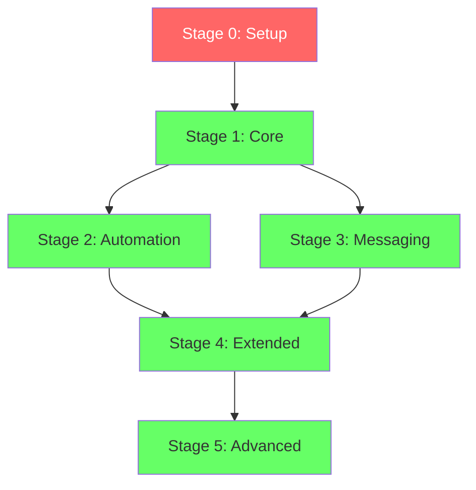

# Stage 0 — Setup (Extensions & Functions)

**Priority:** 🔴 CRITICAL  
**Run:** BEFORE all other stages  
**Status:** ✅ Ready

---

## Purpose

This stage sets up:
1. Required PostgreSQL extensions
2. Helper functions used by all tables
3. Base configuration

**Must run first** - other stages depend on these.

---

## SQL

```sql
-- ================================================
-- STAGE 0: EXTENSIONS & FUNCTIONS
-- ================================================
-- Run this BEFORE any table creation
-- Required for: UUID generation, text search, updated_at triggers
-- ================================================

-- Enable UUID generation
create extension if not exists pgcrypto;

comment on extension pgcrypto is 'Cryptographic functions including UUID generation';

-- Enable text search (for search_history and full-text search)
create extension if not exists pg_trgm;

comment on extension pg_trgm is 'Trigram-based text similarity and indexing';

-- ================================================
-- HELPER FUNCTIONS
-- ================================================

-- Automatically update updated_at timestamp
create or replace function update_updated_at()
returns trigger
language plpgsql
as $$
begin
  new.updated_at = now();
  return new;
end;
$$;

comment on function update_updated_at() is 'Trigger function to automatically set updated_at to current timestamp on row updates';

-- ================================================
-- VERIFICATION
-- ================================================

-- Verify extensions are installed
do $$
begin
  if not exists (select 1 from pg_extension where extname = 'pgcrypto') then
    raise exception 'pgcrypto extension not installed';
  end if;
  
  if not exists (select 1 from pg_extension where extname = 'pg_trgm') then
    raise exception 'pg_trgm extension not installed';
  end if;
  
  raise notice 'All required extensions installed successfully';
end;
$$;

-- Verify function exists
do $$
begin
  if not exists (
    select 1 from pg_proc 
    where proname = 'update_updated_at'
  ) then
    raise exception 'update_updated_at function not created';
  end if;
  
  raise notice 'All required functions created successfully';
end;
$$;
```

---

## What This Does

### 1. `pgcrypto` Extension

**Purpose:** UUID generation

**Used By:**
- All tables with `id uuid primary key default gen_random_uuid()`
- 28 tables total

**Function:**
- `gen_random_uuid()` - generates random UUIDs

**Note:** Usually pre-installed in Supabase, but we enable it explicitly for safety.

---

### 2. `pg_trgm` Extension

**Purpose:** Text search and similarity

**Used By:**
- `search_history` table (GIN index on query text)
- Future full-text search features
- Location name searching

**Functions:**
- `similarity()` - text similarity scoring
- `word_similarity()` - word-based matching
- GIN operator classes for indexing

---

### 3. `update_updated_at()` Function

**Purpose:** Auto-update `updated_at` column

**Used By:** 19 tables with `updated_at` column

**Tables:**
```
profiles
locations
trips
trip_items
collections
automation_rules
whatsapp_numbers
conversations
trip_expenses
notifications
user_preferences
location_reviews
ai_agents
```

**How It Works:**
```sql
-- Trigger creation (in each table)
create trigger table_name_updated_at
  before update on public.table_name
  for each row execute function update_updated_at();
```

**Behavior:**
- Fires on UPDATE only (not INSERT)
- Sets `new.updated_at = now()`
- Runs before row is written
- Automatic - no application code needed

---

## Migration Order



**Critical:** Stage 0 must complete successfully before any other stage.

---

## Verification Queries

### Check Extensions

```sql
select extname, extversion
from pg_extension
where extname in ('pgcrypto', 'pg_trgm');
```

**Expected Output:**
```
extname   | extversion
----------|------------
pgcrypto  | 1.3
pg_trgm   | 1.6
```

---

### Check Functions

```sql
select 
  proname,
  pg_get_functiondef(oid) as definition
from pg_proc
where proname = 'update_updated_at';
```

**Expected:** Function definition returned

---

### Test UUID Generation

```sql
select gen_random_uuid();
```

**Expected:** UUID like `a0eebc99-9c0b-4ef8-bb6d-6bb9bd380a11`

---

### Test Trigger Function

```sql
-- Create test table
create table test_updated_at (
  id uuid primary key default gen_random_uuid(),
  name text,
  updated_at timestamptz default now()
);

-- Add trigger
create trigger test_updated_at_trigger
  before update on test_updated_at
  for each row execute function update_updated_at();

-- Insert row
insert into test_updated_at (name) values ('test');

-- Wait 1 second
select pg_sleep(1);

-- Update row
update test_updated_at set name = 'updated';

-- Check updated_at changed
select name, updated_at from test_updated_at;

-- Cleanup
drop table test_updated_at;
```

**Expected:** `updated_at` is newer than insert time

---

## Troubleshooting

### Error: `function gen_random_uuid() does not exist`

**Cause:** `pgcrypto` extension not installed

**Fix:**
```sql
create extension pgcrypto;
```

---

### Error: `function update_updated_at() does not exist`

**Cause:** Function not created or wrong schema

**Fix:**
```sql
create or replace function update_updated_at()
returns trigger
language plpgsql
as $$
begin
  new.updated_at = now();
  return new;
end;
$$;
```

---

### Error: `permission denied to create extension`

**Cause:** Insufficient privileges (shouldn't happen in Supabase)

**Fix:** Contact Supabase support or use dashboard to enable extensions

---

## Declarative Schema File

**File Location:** `supabase/schemas/00_setup.sql`

**Content:** Copy the SQL block from this document

**Note:** This is the ONLY file that should be named with leading zeros to ensure it runs first in lexicographic order.

---

## Checklist

Before proceeding to Stage 1:

- [ ] Stage 0 SQL executed successfully
- [ ] `pgcrypto` extension verified
- [ ] `pg_trgm` extension verified
- [ ] `update_updated_at()` function verified
- [ ] Test UUID generation works
- [ ] Test trigger function works
- [ ] No errors in verification queries

---

**Status:** ✅ Ready for execution  
**Next:** Stage 1 (Core tables)  
**Dependencies:** None
