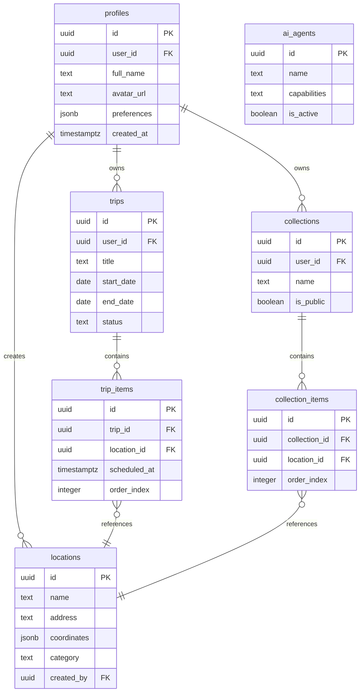

# Stage 1 — Core Tables

**Tables:** 7  
**Status:** ✅ Ready  
**Dependencies:** auth.users only

---

## 📊 Schema Overview



---

## 1. profiles

```sql
create table public.profiles (
  id uuid primary key default gen_random_uuid(),
  user_id uuid references auth.users(id) on delete cascade not null unique,
  full_name text,
  avatar_url text,
  preferences jsonb default '{}'::jsonb,
  created_at timestamptz default now() not null,
  updated_at timestamptz default now() not null
);

comment on table public.profiles is 'User profiles extending auth.users. Stores display name, avatar, preferences, and account settings.';

-- RLS
alter table public.profiles enable row level security;

create policy "Users can view their own profile"
  on public.profiles for select
  to authenticated
  using ( user_id = auth.uid() );

create policy "Users can insert their own profile"
  on public.profiles for insert
  to authenticated
  with check ( user_id = auth.uid() );

create policy "Users can update their own profile"
  on public.profiles for update
  to authenticated
  using ( user_id = auth.uid() )
  with check ( user_id = auth.uid() );

-- Indexes
create index profiles_user_id_idx on public.profiles(user_id);

-- Trigger
create trigger profiles_updated_at
  before update on public.profiles
  for each row execute function update_updated_at();
```

---

## 2. locations

```sql
create table public.locations (
  id uuid primary key default gen_random_uuid(),
  name text not null,
  address text,
  city text,
  country text,
  coordinates jsonb,
  google_place_id text unique,
  category text,
  rating numeric(2,1),
  description text,
  created_by uuid references public.profiles(id) on delete set null,
  created_at timestamptz default now() not null,
  updated_at timestamptz default now() not null
);

comment on table public.locations is 'Global location database. Stores venues, restaurants, attractions that can be shared across users and trips.';

-- RLS
alter table public.locations enable row level security;

create policy "Anyone can view locations"
  on public.locations for select
  to authenticated, anon
  using ( true );

create policy "Authenticated users can create locations"
  on public.locations for insert
  to authenticated
  with check ( created_by = auth.uid() );

create policy "Users can update their own locations"
  on public.locations for update
  to authenticated
  using ( created_by = auth.uid() )
  with check ( created_by = auth.uid() );

create policy "Users can delete their own locations"
  on public.locations for delete
  to authenticated
  using ( created_by = auth.uid() );

-- Indexes
create index locations_google_place_id_idx on public.locations(google_place_id);
create index locations_city_idx on public.locations(city);
create index locations_category_idx on public.locations(category);
create index locations_created_by_idx on public.locations(created_by);

-- Trigger
create trigger locations_updated_at
  before update on public.locations
  for each row execute function update_updated_at();
```

---

## 3. trips

```sql
create table public.trips (
  id uuid primary key default gen_random_uuid(),
  user_id uuid references public.profiles(id) on delete cascade not null,
  title text not null,
  description text,
  start_date date,
  end_date date,
  status text default 'draft' check (status in ('draft', 'active', 'completed', 'cancelled')),
  budget_total numeric(10,2),
  budget_spent numeric(10,2) default 0,
  created_at timestamptz default now() not null,
  updated_at timestamptz default now() not null
);

comment on table public.trips is 'User trip plans. Stores trip metadata, dates, budget, and status. Items stored in trip_items table.';

-- RLS
alter table public.trips enable row level security;

create policy "Users can view their own trips"
  on public.trips for select
  to authenticated
  using ( user_id = auth.uid() );

create policy "Users can create their own trips"
  on public.trips for insert
  to authenticated
  with check ( user_id = auth.uid() );

create policy "Users can update their own trips"
  on public.trips for update
  to authenticated
  using ( user_id = auth.uid() )
  with check ( user_id = auth.uid() );

create policy "Users can delete their own trips"
  on public.trips for delete
  to authenticated
  using ( user_id = auth.uid() );

-- Indexes
create index trips_user_id_idx on public.trips(user_id);
create index trips_status_idx on public.trips(status);
create index trips_start_date_idx on public.trips(start_date);

-- Trigger
create trigger trips_updated_at
  before update on public.trips
  for each row execute function update_updated_at();
```

---

## 4. trip_items

```sql
create table public.trip_items (
  id uuid primary key default gen_random_uuid(),
  trip_id uuid references public.trips(id) on delete cascade not null,
  location_id uuid references public.locations(id) on delete cascade,
  title text not null,
  description text,
  scheduled_at timestamptz,
  duration_minutes integer,
  order_index integer not null,
  status text default 'pending' check (status in ('pending', 'confirmed', 'completed', 'cancelled')),
  notes text,
  created_at timestamptz default now() not null,
  updated_at timestamptz default now() not null
);

comment on table public.trip_items is 'Individual items/activities within a trip. Links trips to locations with scheduling and ordering.';

-- RLS
alter table public.trip_items enable row level security;

create policy "Users can view items from their trips"
  on public.trip_items for select
  to authenticated
  using ( 
    exists (
      select 1 from public.trips 
      where trips.id = trip_items.trip_id 
      and trips.user_id = auth.uid()
    )
  );

create policy "Users can create items in their trips"
  on public.trip_items for insert
  to authenticated
  with check (
    exists (
      select 1 from public.trips 
      where trips.id = trip_items.trip_id 
      and trips.user_id = auth.uid()
    )
  );

create policy "Users can update items in their trips"
  on public.trip_items for update
  to authenticated
  using (
    exists (
      select 1 from public.trips 
      where trips.id = trip_items.trip_id 
      and trips.user_id = auth.uid()
    )
  )
  with check (
    exists (
      select 1 from public.trips 
      where trips.id = trip_items.trip_id 
      and trips.user_id = auth.uid()
    )
  );

create policy "Users can delete items from their trips"
  on public.trip_items for delete
  to authenticated
  using (
    exists (
      select 1 from public.trips 
      where trips.id = trip_items.trip_id 
      and trips.user_id = auth.uid()
    )
  );

-- Indexes
create index trip_items_trip_id_idx on public.trip_items(trip_id);
create index trip_items_location_id_idx on public.trip_items(location_id);
create index trip_items_order_idx on public.trip_items(trip_id, order_index);

-- Trigger
create trigger trip_items_updated_at
  before update on public.trip_items
  for each row execute function update_updated_at();
```

---

## 5. collections

```sql
create table public.collections (
  id uuid primary key default gen_random_uuid(),
  user_id uuid references public.profiles(id) on delete cascade not null,
  name text not null,
  description text,
  is_public boolean default false,
  created_at timestamptz default now() not null,
  updated_at timestamptz default now() not null
);

comment on table public.collections is 'User-created collections of saved locations. Can be private or publicly shared.';

-- RLS
alter table public.collections enable row level security;

create policy "Users can view their own collections"
  on public.collections for select
  to authenticated
  using ( user_id = auth.uid() );

create policy "Anyone can view public collections"
  on public.collections for select
  to authenticated, anon
  using ( is_public = true );

create policy "Users can create collections"
  on public.collections for insert
  to authenticated
  with check ( user_id = auth.uid() );

create policy "Users can update their own collections"
  on public.collections for update
  to authenticated
  using ( user_id = auth.uid() )
  with check ( user_id = auth.uid() );

create policy "Users can delete their own collections"
  on public.collections for delete
  to authenticated
  using ( user_id = auth.uid() );

-- Indexes
create index collections_user_id_idx on public.collections(user_id);
create index collections_is_public_idx on public.collections(is_public);

-- Trigger
create trigger collections_updated_at
  before update on public.collections
  for each row execute function update_updated_at();
```

---

## 6. collection_items

```sql
create table public.collection_items (
  id uuid primary key default gen_random_uuid(),
  collection_id uuid references public.collections(id) on delete cascade not null,
  location_id uuid references public.locations(id) on delete cascade not null,
  notes text,
  order_index integer not null,
  created_at timestamptz default now() not null
);

comment on table public.collection_items is 'Items within collections. Links collections to locations with ordering and notes.';

-- RLS
alter table public.collection_items enable row level security;

create policy "Users can view items in their collections"
  on public.collection_items for select
  to authenticated
  using (
    exists (
      select 1 from public.collections
      where collections.id = collection_items.collection_id
      and collections.user_id = auth.uid()
    )
  );

create policy "Anyone can view items in public collections"
  on public.collection_items for select
  to authenticated, anon
  using (
    exists (
      select 1 from public.collections
      where collections.id = collection_items.collection_id
      and collections.is_public = true
    )
  );

create policy "Users can add items to their collections"
  on public.collection_items for insert
  to authenticated
  with check (
    exists (
      select 1 from public.collections
      where collections.id = collection_items.collection_id
      and collections.user_id = auth.uid()
    )
  );

create policy "Users can update items in their collections"
  on public.collection_items for update
  to authenticated
  using (
    exists (
      select 1 from public.collections
      where collections.id = collection_items.collection_id
      and collections.user_id = auth.uid()
    )
  )
  with check (
    exists (
      select 1 from public.collections
      where collections.id = collection_items.collection_id
      and collections.user_id = auth.uid()
    )
  );

create policy "Users can delete items from their collections"
  on public.collection_items for delete
  to authenticated
  using (
    exists (
      select 1 from public.collections
      where collections.id = collection_items.collection_id
      and collections.user_id = auth.uid()
    )
  );

-- Indexes
create index collection_items_collection_id_idx on public.collection_items(collection_id);
create index collection_items_location_id_idx on public.collection_items(location_id);
create unique index collection_items_unique_idx on public.collection_items(collection_id, location_id);
```

---

## 7. ai_agents

```sql
create table public.ai_agents (
  id uuid primary key default gen_random_uuid(),
  name text not null unique,
  type text not null check (type in ('search', 'booking', 'itinerary', 'budget', 'collaboration', 'proactive')),
  description text,
  capabilities jsonb default '[]'::jsonb,
  config jsonb default '{}'::jsonb,
  is_active boolean default true,
  created_at timestamptz default now() not null,
  updated_at timestamptz default now() not null
);

comment on table public.ai_agents is 'Available AI agents in the system. Stores agent metadata, capabilities, and configuration.';

-- RLS
alter table public.ai_agents enable row level security;

create policy "Anyone can view active AI agents"
  on public.ai_agents for select
  to authenticated, anon
  using ( is_active = true );

-- Indexes
create index ai_agents_type_idx on public.ai_agents(type);
create index ai_agents_is_active_idx on public.ai_agents(is_active);

-- Trigger
create trigger ai_agents_updated_at
  before update on public.ai_agents
  for each row execute function update_updated_at();
```

---

## ✅ Checklist

- [x] All keywords lowercase
- [x] All tables have comments
- [x] `anon` policies for public resources
- [x] Granular policies (no `for all`)
- [x] Proper indexes
- [x] Updated_at triggers

**Status:** ✅ Ready for migration