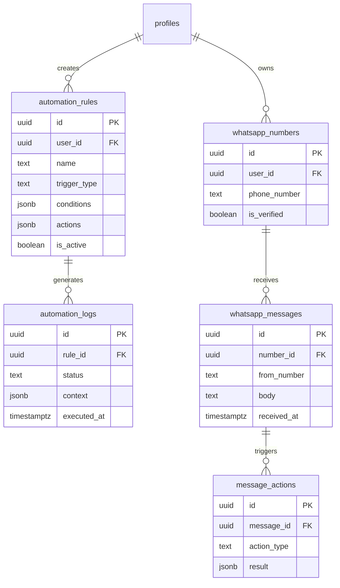

# Stage 2 — Automation Tables

**Tables:** 5  
**Status:** ✅ Ready  
**Dependencies:** Stage 1

---

## 📊 Schema Overview



---

## 1. automation_rules

```sql
create table public.automation_rules (
  id uuid primary key default gen_random_uuid(),
  user_id uuid references public.profiles(id) on delete cascade not null,
  name text not null,
  description text,
  trigger_type text not null check (trigger_type in ('whatsapp_message', 'trip_update', 'scheduled', 'manual')),
  conditions jsonb default '{}'::jsonb,
  actions jsonb default '[]'::jsonb,
  is_active boolean default true,
  priority integer default 0,
  created_at timestamptz default now() not null,
  updated_at timestamptz default now() not null
);

comment on table public.automation_rules is 'User-defined automation rules for WhatsApp and trip management. Executed by background workers.';

-- RLS
alter table public.automation_rules enable row level security;

create policy "Users can view their own automation rules"
  on public.automation_rules for select
  to authenticated
  using ( user_id = auth.uid() );

create policy "Users can create automation rules"
  on public.automation_rules for insert
  to authenticated
  with check ( user_id = auth.uid() );

create policy "Users can update their own automation rules"
  on public.automation_rules for update
  to authenticated
  using ( user_id = auth.uid() )
  with check ( user_id = auth.uid() );

create policy "Users can delete their own automation rules"
  on public.automation_rules for delete
  to authenticated
  using ( user_id = auth.uid() );

-- Indexes
create index automation_rules_user_id_idx on public.automation_rules(user_id);
create index automation_rules_trigger_type_idx on public.automation_rules(trigger_type);
create index automation_rules_is_active_idx on public.automation_rules(is_active);
create index automation_rules_priority_idx on public.automation_rules(priority desc);

-- Trigger
create trigger automation_rules_updated_at
  before update on public.automation_rules
  for each row execute function update_updated_at();
```

---

## 2. automation_logs

```sql
create table public.automation_logs (
  id uuid primary key default gen_random_uuid(),
  rule_id uuid references public.automation_rules(id) on delete cascade not null,
  status text not null check (status in ('success', 'failure', 'skipped')),
  trigger_context jsonb,
  result jsonb,
  error_message text,
  executed_at timestamptz default now() not null
);

comment on table public.automation_logs is 'Execution history of automation rules. Stores results, errors, and context for debugging.';

-- RLS
alter table public.automation_logs enable row level security;

create policy "Users can view logs for their rules"
  on public.automation_logs for select
  to authenticated
  using (
    exists (
      select 1 from public.automation_rules
      where automation_rules.id = automation_logs.rule_id
      and automation_rules.user_id = auth.uid()
    )
  );

create policy "System can insert logs"
  on public.automation_logs for insert
  to authenticated
  with check ( true );

-- Indexes
create index automation_logs_rule_id_idx on public.automation_logs(rule_id);
create index automation_logs_status_idx on public.automation_logs(status);
create index automation_logs_executed_at_idx on public.automation_logs(executed_at desc);
```

---

## 3. whatsapp_numbers

```sql
create table public.whatsapp_numbers (
  id uuid primary key default gen_random_uuid(),
  user_id uuid references public.profiles(id) on delete cascade not null,
  phone_number text not null unique,
  display_name text,
  is_verified boolean default false,
  verification_code text,
  verification_expires_at timestamptz,
  last_message_at timestamptz,
  created_at timestamptz default now() not null,
  updated_at timestamptz default now() not null
);

comment on table public.whatsapp_numbers is 'WhatsApp numbers linked to user accounts. Stores verification status and last activity.';

-- RLS
alter table public.whatsapp_numbers enable row level security;

create policy "Users can view their own WhatsApp numbers"
  on public.whatsapp_numbers for select
  to authenticated
  using ( user_id = auth.uid() );

create policy "Users can add WhatsApp numbers"
  on public.whatsapp_numbers for insert
  to authenticated
  with check ( user_id = auth.uid() );

create policy "Users can update their own WhatsApp numbers"
  on public.whatsapp_numbers for update
  to authenticated
  using ( user_id = auth.uid() )
  with check ( user_id = auth.uid() );

create policy "Users can delete their own WhatsApp numbers"
  on public.whatsapp_numbers for delete
  to authenticated
  using ( user_id = auth.uid() );

-- Indexes
create index whatsapp_numbers_user_id_idx on public.whatsapp_numbers(user_id);
create index whatsapp_numbers_phone_number_idx on public.whatsapp_numbers(phone_number);
create index whatsapp_numbers_is_verified_idx on public.whatsapp_numbers(is_verified);

-- Trigger
create trigger whatsapp_numbers_updated_at
  before update on public.whatsapp_numbers
  for each row execute function update_updated_at();
```

---

## 4. whatsapp_messages

```sql
create table public.whatsapp_messages (
  id uuid primary key default gen_random_uuid(),
  number_id uuid references public.whatsapp_numbers(id) on delete cascade not null,
  from_number text not null,
  to_number text not null,
  body text,
  media_url text,
  message_type text default 'text' check (message_type in ('text', 'image', 'video', 'document', 'location')),
  status text default 'received' check (status in ('received', 'processed', 'failed')),
  external_id text unique,
  metadata jsonb default '{}'::jsonb,
  received_at timestamptz default now() not null,
  processed_at timestamptz
);

comment on table public.whatsapp_messages is 'Incoming WhatsApp messages. Stores message content, media, and processing status.';

-- RLS
alter table public.whatsapp_messages enable row level security;

create policy "Users can view messages for their numbers"
  on public.whatsapp_messages for select
  to authenticated
  using (
    exists (
      select 1 from public.whatsapp_numbers
      where whatsapp_numbers.id = whatsapp_messages.number_id
      and whatsapp_numbers.user_id = auth.uid()
    )
  );

create policy "System can insert messages"
  on public.whatsapp_messages for insert
  to authenticated
  with check ( true );

create policy "System can update message status"
  on public.whatsapp_messages for update
  to authenticated
  using ( true );

-- Indexes
create index whatsapp_messages_number_id_idx on public.whatsapp_messages(number_id);
create index whatsapp_messages_status_idx on public.whatsapp_messages(status);
create index whatsapp_messages_received_at_idx on public.whatsapp_messages(received_at desc);
create index whatsapp_messages_external_id_idx on public.whatsapp_messages(external_id);
```

---

## 5. message_actions

```sql
create table public.message_actions (
  id uuid primary key default gen_random_uuid(),
  message_id uuid references public.whatsapp_messages(id) on delete cascade not null,
  action_type text not null check (action_type in ('create_trip', 'add_location', 'update_status', 'send_reply', 'other')),
  action_data jsonb,
  result jsonb,
  status text default 'pending' check (status in ('pending', 'success', 'failed')),
  error_message text,
  created_at timestamptz default now() not null,
  executed_at timestamptz
);

comment on table public.message_actions is 'Actions triggered by WhatsApp messages. Stores action type, data, and execution results.';

-- RLS
alter table public.message_actions enable row level security;

create policy "Users can view actions for their messages"
  on public.message_actions for select
  to authenticated
  using (
    exists (
      select 1 from public.whatsapp_messages
      join public.whatsapp_numbers on whatsapp_numbers.id = whatsapp_messages.number_id
      where whatsapp_messages.id = message_actions.message_id
      and whatsapp_numbers.user_id = auth.uid()
    )
  );

create policy "System can insert actions"
  on public.message_actions for insert
  to authenticated
  with check ( true );

create policy "System can update actions"
  on public.message_actions for update
  to authenticated
  using ( true );

-- Indexes
create index message_actions_message_id_idx on public.message_actions(message_id);
create index message_actions_action_type_idx on public.message_actions(action_type);
create index message_actions_status_idx on public.message_actions(status);
create index message_actions_created_at_idx on public.message_actions(created_at desc);
```

---

## ✅ Checklist

- [x] All keywords lowercase
- [x] All tables have comments
- [x] Granular policies (split from `for all`)
- [x] Proper indexes
- [x] Updated_at triggers where needed

**Status:** ✅ Ready for migration
