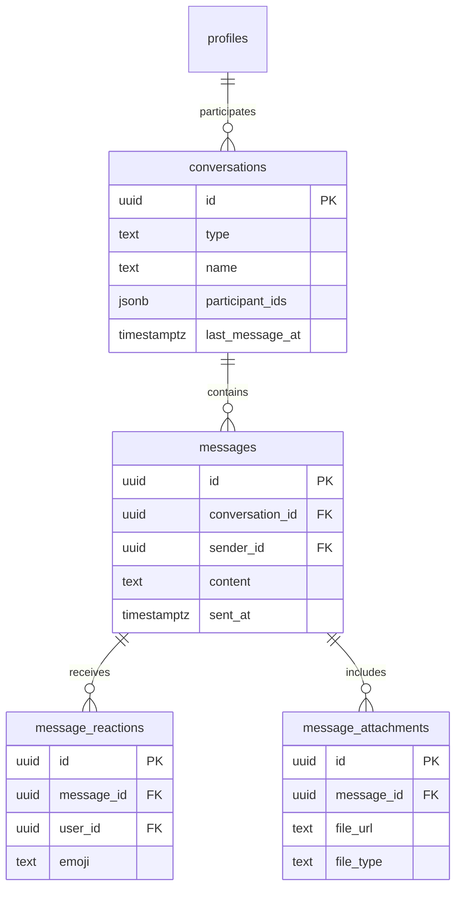

# Stage 3 — Messaging Tables

**Tables:** 4  
**Status:** ✅ Ready  
**Dependencies:** Stage 1

---

## 📊 Schema Overview



---

## 1. conversations

```sql
create table public.conversations (
  id uuid primary key default gen_random_uuid(),
  type text not null check (type in ('direct', 'group', 'ai_agent')),
  name text,
  participant_ids uuid[] not null,
  metadata jsonb default '{}'::jsonb,
  last_message_at timestamptz,
  created_at timestamptz default now() not null,
  updated_at timestamptz default now() not null
);

comment on table public.conversations is 'Chat conversations between users or with AI agents. Supports direct, group, and AI chats.';

-- RLS
alter table public.conversations enable row level security;

create policy "Users can view their conversations"
  on public.conversations for select
  to authenticated
  using ( auth.uid() = any(participant_ids) );

create policy "Users can create conversations"
  on public.conversations for insert
  to authenticated
  with check ( auth.uid() = any(participant_ids) );

create policy "Participants can update conversations"
  on public.conversations for update
  to authenticated
  using ( auth.uid() = any(participant_ids) )
  with check ( auth.uid() = any(participant_ids) );

-- Indexes
create index conversations_participant_ids_idx on public.conversations using gin(participant_ids);
create index conversations_last_message_at_idx on public.conversations(last_message_at desc);
create index conversations_type_idx on public.conversations(type);

-- Trigger
create trigger conversations_updated_at
  before update on public.conversations
  for each row execute function update_updated_at();
```

---

## 2. messages

```sql
create table public.messages (
  id uuid primary key default gen_random_uuid(),
  conversation_id uuid references public.conversations(id) on delete cascade not null,
  sender_id uuid references public.profiles(id) on delete set null,
  content text not null,
  metadata jsonb default '{}'::jsonb,
  is_ai_generated boolean default false,
  reply_to_id uuid references public.messages(id) on delete set null,
  sent_at timestamptz default now() not null,
  edited_at timestamptz,
  deleted_at timestamptz
);

comment on table public.messages is 'Individual messages within conversations. Supports replies, editing, and AI-generated content.';

-- RLS
alter table public.messages enable row level security;

create policy "Users can view messages in their conversations"
  on public.messages for select
  to authenticated
  using (
    exists (
      select 1 from public.conversations
      where conversations.id = messages.conversation_id
      and auth.uid() = any(conversations.participant_ids)
    )
  );

create policy "Users can send messages to their conversations"
  on public.messages for insert
  to authenticated
  with check (
    exists (
      select 1 from public.conversations
      where conversations.id = messages.conversation_id
      and auth.uid() = any(conversations.participant_ids)
    )
    and sender_id = auth.uid()
  );

create policy "Users can update their own messages"
  on public.messages for update
  to authenticated
  using ( sender_id = auth.uid() )
  with check ( sender_id = auth.uid() );

create policy "Users can delete their own messages"
  on public.messages for delete
  to authenticated
  using ( sender_id = auth.uid() );

-- Indexes
create index messages_conversation_id_idx on public.messages(conversation_id);
create index messages_sender_id_idx on public.messages(sender_id);
create index messages_sent_at_idx on public.messages(sent_at desc);
create index messages_reply_to_id_idx on public.messages(reply_to_id);
```

---

## 3. message_reactions

```sql
create table public.message_reactions (
  id uuid primary key default gen_random_uuid(),
  message_id uuid references public.messages(id) on delete cascade not null,
  user_id uuid references public.profiles(id) on delete cascade not null,
  emoji text not null,
  created_at timestamptz default now() not null,
  unique(message_id, user_id, emoji)
);

comment on table public.message_reactions is 'Emoji reactions to messages. One emoji per user per message.';

-- RLS
alter table public.message_reactions enable row level security;

create policy "Users can view reactions in their conversations"
  on public.message_reactions for select
  to authenticated
  using (
    exists (
      select 1 from public.messages
      join public.conversations on conversations.id = messages.conversation_id
      where messages.id = message_reactions.message_id
      and auth.uid() = any(conversations.participant_ids)
    )
  );

create policy "Users can add reactions to messages in their conversations"
  on public.message_reactions for insert
  to authenticated
  with check (
    exists (
      select 1 from public.messages
      join public.conversations on conversations.id = messages.conversation_id
      where messages.id = message_reactions.message_id
      and auth.uid() = any(conversations.participant_ids)
    )
    and user_id = auth.uid()
  );

create policy "Users can delete their own reactions"
  on public.message_reactions for delete
  to authenticated
  using ( user_id = auth.uid() );

-- Indexes
create index message_reactions_message_id_idx on public.message_reactions(message_id);
create index message_reactions_user_id_idx on public.message_reactions(user_id);
```

---

## 4. message_attachments

```sql
create table public.message_attachments (
  id uuid primary key default gen_random_uuid(),
  message_id uuid references public.messages(id) on delete cascade not null,
  file_url text not null,
  file_name text,
  file_type text,
  file_size bigint,
  metadata jsonb default '{}'::jsonb,
  created_at timestamptz default now() not null
);

comment on table public.message_attachments is 'File attachments for messages. Stores URLs and metadata for images, documents, etc.';

-- RLS
alter table public.message_attachments enable row level security;

create policy "Users can view attachments in their conversations"
  on public.message_attachments for select
  to authenticated
  using (
    exists (
      select 1 from public.messages
      join public.conversations on conversations.id = messages.conversation_id
      where messages.id = message_attachments.message_id
      and auth.uid() = any(conversations.participant_ids)
    )
  );

create policy "Users can add attachments to their messages"
  on public.message_attachments for insert
  to authenticated
  with check (
    exists (
      select 1 from public.messages
      where messages.id = message_attachments.message_id
      and messages.sender_id = auth.uid()
    )
  );

create policy "Users can delete attachments from their messages"
  on public.message_attachments for delete
  to authenticated
  using (
    exists (
      select 1 from public.messages
      where messages.id = message_attachments.message_id
      and messages.sender_id = auth.uid()
    )
  );

-- Indexes
create index message_attachments_message_id_idx on public.message_attachments(message_id);
create index message_attachments_file_type_idx on public.message_attachments(file_type);
```

---

## ✅ Checklist

- [x] All keywords lowercase
- [x] All tables have comments
- [x] Granular policies
- [x] Proper indexes
- [x] Updated_at triggers where needed

**Status:** ✅ Ready for migration
