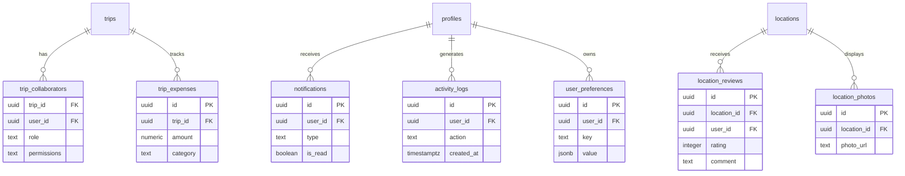

# Stage 4 — Extended Tables

**Tables:** 7  
**Status:** ✅ Ready  
**Dependencies:** Stages 1-3

---

## 📊 Schema Overview



---

## 1. trip_collaborators

```sql
create table public.trip_collaborators (
  trip_id uuid references public.trips(id) on delete cascade not null,
  user_id uuid references public.profiles(id) on delete cascade not null,
  role text default 'viewer' check (role in ('owner', 'editor', 'viewer')),
  permissions jsonb default '{"can_edit": false, "can_invite": false}'::jsonb,
  invited_by uuid references public.profiles(id) on delete set null,
  invited_at timestamptz default now() not null,
  accepted_at timestamptz,
  primary key (trip_id, user_id)
);

comment on table public.trip_collaborators is 'Collaboration on trips. Defines who can access/edit trips and their permission levels.';

-- RLS
alter table public.trip_collaborators enable row level security;

create policy "Users can view collaborators on their trips"
  on public.trip_collaborators for select
  to authenticated
  using (
    user_id = auth.uid()
    or exists (
      select 1 from public.trips
      where trips.id = trip_collaborators.trip_id
      and trips.user_id = auth.uid()
    )
  );

create policy "Trip owners can add collaborators"
  on public.trip_collaborators for insert
  to authenticated
  with check (
    exists (
      select 1 from public.trips
      where trips.id = trip_collaborators.trip_id
      and trips.user_id = auth.uid()
    )
  );

create policy "Trip owners can update collaborator permissions"
  on public.trip_collaborators for update
  to authenticated
  using (
    exists (
      select 1 from public.trips
      where trips.id = trip_collaborators.trip_id
      and trips.user_id = auth.uid()
    )
  )
  with check (
    exists (
      select 1 from public.trips
      where trips.id = trip_collaborators.trip_id
      and trips.user_id = auth.uid()
    )
  );

create policy "Trip owners can remove collaborators"
  on public.trip_collaborators for delete
  to authenticated
  using (
    exists (
      select 1 from public.trips
      where trips.id = trip_collaborators.trip_id
      and trips.user_id = auth.uid()
    )
  );

-- Indexes
create index trip_collaborators_trip_id_idx on public.trip_collaborators(trip_id);
create index trip_collaborators_user_id_idx on public.trip_collaborators(user_id);
create index trip_collaborators_role_idx on public.trip_collaborators(role);
```

---

## 2. trip_expenses

```sql
create table public.trip_expenses (
  id uuid primary key default gen_random_uuid(),
  trip_id uuid references public.trips(id) on delete cascade not null,
  user_id uuid references public.profiles(id) on delete set null,
  amount numeric(10,2) not null,
  currency text default 'USD',
  category text check (category in ('accommodation', 'transport', 'food', 'activity', 'shopping', 'other')),
  description text,
  date date not null,
  split_with uuid[],
  receipt_url text,
  created_at timestamptz default now() not null,
  updated_at timestamptz default now() not null
);

comment on table public.trip_expenses is 'Expense tracking for trips. Supports splitting costs and receipt storage.';

-- RLS
alter table public.trip_expenses enable row level security;

create policy "Users can view expenses for their trips"
  on public.trip_expenses for select
  to authenticated
  using (
    exists (
      select 1 from public.trips
      where trips.id = trip_expenses.trip_id
      and trips.user_id = auth.uid()
    )
    or exists (
      select 1 from public.trip_collaborators
      where trip_collaborators.trip_id = trip_expenses.trip_id
      and trip_collaborators.user_id = auth.uid()
    )
  );

create policy "Trip participants can add expenses"
  on public.trip_expenses for insert
  to authenticated
  with check (
    exists (
      select 1 from public.trips
      where trips.id = trip_expenses.trip_id
      and trips.user_id = auth.uid()
    )
    or exists (
      select 1 from public.trip_collaborators
      where trip_collaborators.trip_id = trip_expenses.trip_id
      and trip_collaborators.user_id = auth.uid()
    )
  );

create policy "Users can update their own expenses"
  on public.trip_expenses for update
  to authenticated
  using ( user_id = auth.uid() )
  with check ( user_id = auth.uid() );

create policy "Users can delete their own expenses"
  on public.trip_expenses for delete
  to authenticated
  using ( user_id = auth.uid() );

-- Indexes
create index trip_expenses_trip_id_idx on public.trip_expenses(trip_id);
create index trip_expenses_user_id_idx on public.trip_expenses(user_id);
create index trip_expenses_category_idx on public.trip_expenses(category);
create index trip_expenses_date_idx on public.trip_expenses(date);

-- Trigger
create trigger trip_expenses_updated_at
  before update on public.trip_expenses
  for each row execute function update_updated_at();
```

---

## 3. notifications

```sql
create table public.notifications (
  id uuid primary key default gen_random_uuid(),
  user_id uuid references public.profiles(id) on delete cascade not null,
  type text not null check (type in ('trip_invite', 'message', 'expense_added', 'system', 'ai_suggestion')),
  title text not null,
  message text,
  data jsonb default '{}'::jsonb,
  is_read boolean default false,
  read_at timestamptz,
  created_at timestamptz default now() not null
);

comment on table public.notifications is 'User notifications for events, invites, messages, and AI suggestions.';

-- RLS
alter table public.notifications enable row level security;

create policy "Users can view their own notifications"
  on public.notifications for select
  to authenticated
  using ( user_id = auth.uid() );

create policy "System can create notifications"
  on public.notifications for insert
  to authenticated
  with check ( true );

create policy "Users can update their own notifications"
  on public.notifications for update
  to authenticated
  using ( user_id = auth.uid() )
  with check ( user_id = auth.uid() );

create policy "Users can delete their own notifications"
  on public.notifications for delete
  to authenticated
  using ( user_id = auth.uid() );

-- Indexes
create index notifications_user_id_idx on public.notifications(user_id);
create index notifications_is_read_idx on public.notifications(is_read);
create index notifications_created_at_idx on public.notifications(created_at desc);
create index notifications_type_idx on public.notifications(type);
```

---

## 4. activity_logs

```sql
create table public.activity_logs (
  id uuid primary key default gen_random_uuid(),
  user_id uuid references public.profiles(id) on delete set null,
  action text not null,
  resource_type text,
  resource_id uuid,
  metadata jsonb default '{}'::jsonb,
  ip_address inet,
  user_agent text,
  created_at timestamptz default now() not null
);

comment on table public.activity_logs is 'Audit trail of user actions. Tracks what users do for security and analytics.';

-- RLS
alter table public.activity_logs enable row level security;

create policy "Users can view their own activity logs"
  on public.activity_logs for select
  to authenticated
  using ( user_id = auth.uid() );

create policy "System can insert activity logs"
  on public.activity_logs for insert
  to authenticated
  with check ( true );

-- Indexes
create index activity_logs_user_id_idx on public.activity_logs(user_id);
create index activity_logs_action_idx on public.activity_logs(action);
create index activity_logs_resource_idx on public.activity_logs(resource_type, resource_id);
create index activity_logs_created_at_idx on public.activity_logs(created_at desc);
```

---

## 5. user_preferences

```sql
create table public.user_preferences (
  id uuid primary key default gen_random_uuid(),
  user_id uuid references public.profiles(id) on delete cascade not null,
  key text not null,
  value jsonb not null,
  created_at timestamptz default now() not null,
  updated_at timestamptz default now() not null,
  unique(user_id, key)
);

comment on table public.user_preferences is 'Flexible key-value storage for user settings and preferences.';

-- RLS
alter table public.user_preferences enable row level security;

create policy "Users can view their own preferences"
  on public.user_preferences for select
  to authenticated
  using ( user_id = auth.uid() );

create policy "Users can insert their own preferences"
  on public.user_preferences for insert
  to authenticated
  with check ( user_id = auth.uid() );

create policy "Users can update their own preferences"
  on public.user_preferences for update
  to authenticated
  using ( user_id = auth.uid() )
  with check ( user_id = auth.uid() );

create policy "Users can delete their own preferences"
  on public.user_preferences for delete
  to authenticated
  using ( user_id = auth.uid() );

-- Indexes
create index user_preferences_user_id_idx on public.user_preferences(user_id);
create unique index user_preferences_user_key_idx on public.user_preferences(user_id, key);

-- Trigger
create trigger user_preferences_updated_at
  before update on public.user_preferences
  for each row execute function update_updated_at();
```

---

## 6. location_reviews

```sql
create table public.location_reviews (
  id uuid primary key default gen_random_uuid(),
  location_id uuid references public.locations(id) on delete cascade not null,
  user_id uuid references public.profiles(id) on delete set null,
  rating integer not null check (rating >= 1 and rating <= 5),
  comment text,
  visit_date date,
  created_at timestamptz default now() not null,
  updated_at timestamptz default now() not null,
  unique(location_id, user_id)
);

comment on table public.location_reviews is 'User reviews and ratings for locations. One review per user per location.';

-- RLS
alter table public.location_reviews enable row level security;

create policy "Anyone can view reviews"
  on public.location_reviews for select
  to authenticated, anon
  using ( true );

create policy "Users can create reviews"
  on public.location_reviews for insert
  to authenticated
  with check ( user_id = auth.uid() );

create policy "Users can update their own reviews"
  on public.location_reviews for update
  to authenticated
  using ( user_id = auth.uid() )
  with check ( user_id = auth.uid() );

create policy "Users can delete their own reviews"
  on public.location_reviews for delete
  to authenticated
  using ( user_id = auth.uid() );

-- Indexes
create index location_reviews_location_id_idx on public.location_reviews(location_id);
create index location_reviews_user_id_idx on public.location_reviews(user_id);
create index location_reviews_rating_idx on public.location_reviews(rating);

-- Trigger
create trigger location_reviews_updated_at
  before update on public.location_reviews
  for each row execute function update_updated_at();
```

---

## 7. location_photos

```sql
create table public.location_photos (
  id uuid primary key default gen_random_uuid(),
  location_id uuid references public.locations(id) on delete cascade not null,
  user_id uuid references public.profiles(id) on delete set null,
  photo_url text not null,
  caption text,
  is_primary boolean default false,
  created_at timestamptz default now() not null
);

comment on table public.location_photos is 'User-uploaded photos for locations. Supports primary photo designation.';

-- RLS
alter table public.location_photos enable row level security;

create policy "Anyone can view location photos"
  on public.location_photos for select
  to authenticated, anon
  using ( true );

create policy "Users can upload photos"
  on public.location_photos for insert
  to authenticated
  with check ( user_id = auth.uid() );

create policy "Users can update their own photos"
  on public.location_photos for update
  to authenticated
  using ( user_id = auth.uid() )
  with check ( user_id = auth.uid() );

create policy "Users can delete their own photos"
  on public.location_photos for delete
  to authenticated
  using ( user_id = auth.uid() );

-- Indexes
create index location_photos_location_id_idx on public.location_photos(location_id);
create index location_photos_user_id_idx on public.location_photos(user_id);
create index location_photos_is_primary_idx on public.location_photos(location_id, is_primary);
```

---

## ✅ Checklist

- [x] All keywords lowercase
- [x] All tables have comments
- [x] `anon` policies for public data (reviews, photos)
- [x] Granular policies
- [x] Proper indexes
- [x] Updated_at triggers where needed

**Status:** ✅ Ready for migration