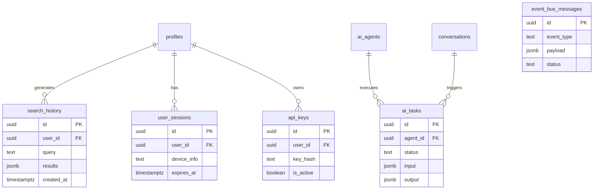

# Stage 5 — Advanced Tables

**Tables:** 5  
**Status:** ✅ Ready  
**Dependencies:** Stages 1-4

---

## 📊 Schema Overview



---

## 1. search_history

```sql
create table public.search_history (
  id uuid primary key default gen_random_uuid(),
  user_id uuid references public.profiles(id) on delete cascade not null,
  query text not null,
  search_type text check (search_type in ('location', 'trip', 'general')),
  results jsonb,
  result_count integer,
  created_at timestamptz default now() not null
);

comment on table public.search_history is 'User search history for personalization and analytics. Stores queries and results.';

-- RLS
alter table public.search_history enable row level security;

create policy "Users can view their own search history"
  on public.search_history for select
  to authenticated
  using ( user_id = auth.uid() );

create policy "Users can create search history"
  on public.search_history for insert
  to authenticated
  with check ( user_id = auth.uid() );

create policy "Users can delete their own search history"
  on public.search_history for delete
  to authenticated
  using ( user_id = auth.uid() );

-- Indexes
create index search_history_user_id_idx on public.search_history(user_id);
create index search_history_created_at_idx on public.search_history(created_at desc);
create index search_history_query_idx on public.search_history using gin(to_tsvector('english', query));
```

---

## 2. ai_tasks

```sql
create table public.ai_tasks (
  id uuid primary key default gen_random_uuid(),
  agent_id uuid references public.ai_agents(id) on delete set null,
  user_id uuid references public.profiles(id) on delete cascade,
  conversation_id uuid references public.conversations(id) on delete set null,
  task_type text not null,
  input jsonb not null,
  output jsonb,
  status text default 'pending' check (status in ('pending', 'processing', 'completed', 'failed', 'cancelled')),
  error_message text,
  priority integer default 0,
  started_at timestamptz,
  completed_at timestamptz,
  created_at timestamptz default now() not null
);

comment on table public.ai_tasks is 'AI agent task queue. Tracks task execution, status, and results for async processing.';

-- RLS
alter table public.ai_tasks enable row level security;

create policy "Users can view their own AI tasks"
  on public.ai_tasks for select
  to authenticated
  using ( user_id = auth.uid() );

create policy "Users can create AI tasks"
  on public.ai_tasks for insert
  to authenticated
  with check ( user_id = auth.uid() );

create policy "System can update task status"
  on public.ai_tasks for update
  to authenticated
  using ( true );

-- Indexes
create index ai_tasks_user_id_idx on public.ai_tasks(user_id);
create index ai_tasks_agent_id_idx on public.ai_tasks(agent_id);
create index ai_tasks_status_idx on public.ai_tasks(status);
create index ai_tasks_priority_idx on public.ai_tasks(priority desc, created_at);
create index ai_tasks_conversation_id_idx on public.ai_tasks(conversation_id);
```

---

## 3. user_sessions

```sql
create table public.user_sessions (
  id uuid primary key default gen_random_uuid(),
  user_id uuid references public.profiles(id) on delete cascade not null,
  device_info jsonb,
  ip_address inet,
  user_agent text,
  last_activity_at timestamptz default now() not null,
  expires_at timestamptz not null,
  created_at timestamptz default now() not null
);

comment on table public.user_sessions is 'Active user sessions for device tracking and security monitoring.';

-- RLS
alter table public.user_sessions enable row level security;

create policy "Users can view their own sessions"
  on public.user_sessions for select
  to authenticated
  using ( user_id = auth.uid() );

create policy "System can create sessions"
  on public.user_sessions for insert
  to authenticated
  with check ( true );

create policy "System can update sessions"
  on public.user_sessions for update
  to authenticated
  using ( true );

create policy "Users can delete their own sessions"
  on public.user_sessions for delete
  to authenticated
  using ( user_id = auth.uid() );

-- Indexes
create index user_sessions_user_id_idx on public.user_sessions(user_id);
create index user_sessions_expires_at_idx on public.user_sessions(expires_at);
create index user_sessions_last_activity_idx on public.user_sessions(last_activity_at desc);
```

---

## 4. api_keys

```sql
create table public.api_keys (
  id uuid primary key default gen_random_uuid(),
  user_id uuid references public.profiles(id) on delete cascade not null,
  name text not null,
  key_hash text not null unique,
  key_prefix text not null,
  permissions jsonb default '[]'::jsonb,
  is_active boolean default true,
  last_used_at timestamptz,
  expires_at timestamptz,
  created_at timestamptz default now() not null
);

comment on table public.api_keys is 'User-generated API keys for programmatic access. Stores hashed keys and permissions.';

-- RLS
alter table public.api_keys enable row level security;

create policy "Users can view their own API keys"
  on public.api_keys for select
  to authenticated
  using ( user_id = auth.uid() );

create policy "Users can create API keys"
  on public.api_keys for insert
  to authenticated
  with check ( user_id = auth.uid() );

create policy "Users can update their own API keys"
  on public.api_keys for update
  to authenticated
  using ( user_id = auth.uid() )
  with check ( user_id = auth.uid() );

create policy "Users can delete their own API keys"
  on public.api_keys for delete
  to authenticated
  using ( user_id = auth.uid() );

-- Indexes
create index api_keys_user_id_idx on public.api_keys(user_id);
create index api_keys_key_hash_idx on public.api_keys(key_hash);
create index api_keys_is_active_idx on public.api_keys(is_active);
```

---

## 5. event_bus_messages

```sql
create table public.event_bus_messages (
  id uuid primary key default gen_random_uuid(),
  event_type text not null,
  source_agent text,
  target_agent text,
  payload jsonb not null,
  metadata jsonb default '{}'::jsonb,
  status text default 'pending' check (status in ('pending', 'processing', 'completed', 'failed')),
  error_message text,
  retry_count integer default 0,
  created_at timestamptz default now() not null,
  processed_at timestamptz
);

comment on table public.event_bus_messages is 'Event bus for AI agent communication. Queues and tracks inter-agent messages.';

-- RLS
alter table public.event_bus_messages enable row level security;

create policy "System can manage event bus messages"
  on public.event_bus_messages for all
  to authenticated
  using ( true )
  with check ( true );

-- Indexes
create index event_bus_messages_event_type_idx on public.event_bus_messages(event_type);
create index event_bus_messages_status_idx on public.event_bus_messages(status);
create index event_bus_messages_source_idx on public.event_bus_messages(source_agent);
create index event_bus_messages_target_idx on public.event_bus_messages(target_agent);
create index event_bus_messages_created_at_idx on public.event_bus_messages(created_at);
create index event_bus_messages_pending_idx on public.event_bus_messages(status, created_at) where status = 'pending';
```

---

## ✅ Checklist

- [x] All keywords lowercase
- [x] All tables have comments
- [x] Granular policies (event_bus uses `for all` intentionally - system-only table)
- [x] Proper indexes
- [x] Performance indexes (pending messages, task priority)

**Status:** ✅ Ready for migration

---

## 📝 Note on event_bus_messages

**Why `for all`?**  
This is a system-internal table for AI agent communication. All authenticated processes need full access. Splitting into 4 policies would be redundant since the logic is identical (`using ( true )`).

**Security:** Still protected by RLS - only authenticated backend processes can access, not anonymous users.
