# AI ENHANCEMENTS VERIFICATION & IMPLEMENTATION PLAN
## Gemini AI Tool Advanced Features - Status & Roadmap

**Document:** 01-ai-enhancements-verification-plan.md  
**Created:** December 22, 2024  
**Status:** 🟡 Partially Implemented - Needs Production Integration  
**Priority:** P1 - Critical for MVP

---

## 🎯 EXECUTIVE SUMMARY

### Implementation Status: 60% Complete

| Feature | Status | Code | Integration | Production | Priority |
|---------|--------|------|-------------|------------|----------|
| Multi-agent Collaboration | 🟡 70% | ✅ Built | ⏳ Partial | ❌ Not Live | P0 |
| Context Persistence | 🟡 80% | ✅ Built | ⏳ Partial | ❌ Not Live | P0 |
| Proactive Suggestions | 🟡 75% | ✅ Built | ⏳ Partial | ❌ Not Live | P1 |
| Conflict Resolution | 🔴 30% | ⏳ Partial | ❌ None | ❌ Not Live | P1 |
| Smart Booking | 🔴 20% | ⏳ Partial | ❌ None | ❌ Not Live | P2 |
| Budget Optimization | 🟡 60% | ✅ Built | ⏳ Partial | ❌ Not Live | P1 |

**Overall Completion:** 🟡 **60% Complete** (Code exists, needs integration & testing)

---

## 📊 DETAILED FEATURE VERIFICATION

### 1. Multi-Agent Collaboration ✅ 70% IMPLEMENTED

**What's Built:**
- ✅ Collaboration Engine (`/lib/ai/collaboration-engine.ts` - 560 lines)
- ✅ Event Bus System (`/lib/ai/event-bus.ts`)
- ✅ 6 AI Agents (base + specialized)
- ✅ Task decomposition (AI + heuristic)
- ✅ Parallel execution
- ✅ Result aggregation

**What's Missing:**
- ❌ Real Gemini API integration (currently uses mock)
- ❌ Frontend integration (not connected to UI)
- ❌ End-to-end testing
- ❌ Error recovery mechanisms
- ⏳ Agent response parsing (partial)

**Code Locations:**
```
/lib/ai/
├── collaboration-engine.ts  ✅ 560 lines
├── event-bus.ts            ✅ 200 lines
├── orchestrator.ts         ✅ 400 lines
└── agents/
    ├── base-agent.ts       ✅
    ├── local-scout.ts      ✅
    ├── dining-orchestrator.ts ✅
    ├── itinerary-optimizer.ts ✅
    ├── budget-guardian.ts  ✅
    ├── booking-assistant.ts ✅
    └── event-curator.ts    ✅
```

**Verification:**
```typescript
// Test multi-agent collaboration
import { getCollaborationEngine } from './lib/ai/collaboration-engine';

const engine = getCollaborationEngine();
const result = await engine.processComplexQuery(
  "Find affordable restaurants in Paris with vegan options and optimize my route",
  { tripId: 'trip123', budget: 'medium' }
);

console.log('Agents used:', result.metadata.agentsUsed);
console.log('Tasks completed:', result.metadata.tasksCompleted);
console.log('Response:', result.synthesizedResponse);
```

---

### 2. Context Persistence ✅ 80% IMPLEMENTED

**What's Built:**
- ✅ Context Manager (`/lib/ai/context-manager.ts`)
- ✅ Session management
- ✅ Entity tracking
- ✅ Reference resolution
- ✅ LocalStorage persistence
- ✅ Message history (20 message limit)

**What's Missing:**
- ❌ Backend persistence (Supabase)
- ❌ Cross-device sync
- ⏳ Advanced entity extraction (basic only)
- ❌ Context restoration after page reload
- ❌ Context pruning optimization

**Code Locations:**
```
/lib/ai/context-manager.ts  ✅ 350+ lines

Features:
- createSession()
- addMessage()
- resolveReference()
- trackEntity()
- saveToStorage()
- loadFromStorage()
```

**Verification:**
```typescript
import { getContextManager } from './lib/ai/context-manager';

const manager = getContextManager();
const sessionId = manager.createSession({ 
  userId: 'user123',
  tripId: 'trip456' 
});

// Add messages
manager.addMessage(sessionId, {
  role: 'user',
  content: 'Find restaurants in Paris'
});

// Reference resolution
const resolved = manager.resolveReference(sessionId, 'show me cheaper options');
// Should understand context: restaurants in Paris
```

---

### 3. Proactive Suggestions ✅ 75% IMPLEMENTED

**What's Built:**
- ✅ Proactive Assistant (`/lib/ai/proactive-assistant.ts`)
- ✅ Pattern detection (travel time, budget, conflicts)
- ✅ Suggestion generation
- ✅ Event-driven triggers
- ✅ Priority levels (low/medium/high)
- ✅ Dismissible suggestions

**What's Missing:**
- ❌ Frontend UI for suggestions
- ❌ User preference learning
- ❌ Suggestion history tracking
- ⏳ Advanced pattern detection (basic only)
- ❌ Real-time monitoring

**Code Locations:**
```
/lib/ai/proactive-assistant.ts  ✅ 400+ lines

Features:
- detectPatternsInItinerary()
- generateSuggestionForPattern()
- onItineraryChanged()
- onBudgetUpdated()
```

**Verification:**
```typescript
import { getProactiveAssistant } from './lib/ai/proactive-assistant';

const assistant = getProactiveAssistant();
assistant.setActive(true);

// Will auto-detect patterns when itinerary changes
// Emits suggestions via event bus
assistant.bus.on('suggestion:created', (suggestion) => {
  console.log('New suggestion:', suggestion);
});
```

---

### 4. Conflict Resolution 🔴 30% IMPLEMENTED

**What's Built:**
- ⏳ Basic time overlap detection
- ⏳ Event bus for conflict notifications
- ⏳ Conflict types defined

**What's Missing:**
- ❌ Automatic conflict resolution
- ❌ Conflict resolution UI
- ❌ Multi-day conflict detection
- ❌ Travel time calculations
- ❌ Suggestion engine for fixes
- ❌ User preference for resolution

**Code Gaps:**
```typescript
// NEEDED: /lib/ai/conflict-resolver.ts
interface Conflict {
  type: 'time_overlap' | 'travel_impossible' | 'budget_exceeded' | 'availability';
  severity: 'warning' | 'error' | 'critical';
  items: TripItem[];
  suggestedResolutions: Resolution[];
}

interface Resolution {
  action: 'reorder' | 'reschedule' | 'remove' | 'replace';
  description: string;
  impact: string;
  autoApplicable: boolean;
}
```

**Implementation Needed:**


---

### 5. Smart Booking 🔴 20% IMPLEMENTED

**What's Built:**
- ⏳ Booking Assistant agent (skeleton)
- ⏳ Basic booking types defined
- ⏳ Agent personality configured

**What's Missing:**
- ❌ Multi-step workflow engine
- ❌ Booking API integrations
- ❌ Payment processing
- ❌ Confirmation tracking
- ❌ Booking state management
- ❌ Cancellation handling
- ❌ Email notifications

**Code Gaps:**
```typescript
// NEEDED: /lib/booking/workflow-engine.ts
interface BookingWorkflow {
  id: string;
  type: 'restaurant' | 'hotel' | 'activity' | 'transport';
  steps: BookingStep[];
  currentStep: number;
  status: 'pending' | 'in_progress' | 'confirmed' | 'failed';
  checkpoints: Record<string, any>;
}

interface BookingStep {
  id: string;
  name: string;
  type: 'data_collection' | 'verification' | 'api_call' | 'confirmation';
  required: boolean;
  completed: boolean;
  data?: any;
  error?: string;
}
```

**Implementation Needed:**


---

### 6. Budget Optimization ✅ 60% IMPLEMENTED

**What's Built:**
- ✅ Budget Guardian agent
- ✅ Budget tracking logic
- ✅ Cost calculation
- ⏳ Alert system (partial)
- ✅ Alternative suggestions framework

**What's Missing:**
- ❌ Real-time budget updates
- ❌ Category-based budget tracking
- ❌ Currency conversion
- ❌ Historical spending analysis
- ❌ Predictive budget warnings
- ❌ Cost optimization algorithms

**Code Locations:**
```
/lib/ai/agents/budget-guardian.ts  ✅ Built

Features:
- trackSpending()
- checkBudgetStatus()
- suggestAlternatives()
- generateBudgetAlert()
```

**Implementation Needed:**


---

## 🚀 IMPLEMENTATION ROADMAP

### Phase 1: Core Integration (Week 1) - P0

**Goal:** Connect existing code to Gemini API and frontend


**Tasks:**
1. **Gemini API Integration** (Day 1-2)
   ```typescript
   // /supabase/functions/server/ai-service.tsx
   // Replace mock with real Gemini calls
   
   const genAI = new GoogleGenerativeAI(Deno.env.get('GEMINI_API_KEY')!);
   const model = genAI.getGenerativeModel({ model: "gemini-1.5-flash" });
   
   // Test with real query
   const result = await model.generateContent("Test query");
   console.log(result.response.text());
   ```

2. **Frontend Hook** (Day 1-3)
   ```typescript
   // /hooks/useAdvancedAI.ts
   import { getCollaborationEngine } from '../lib/ai/collaboration-engine';
   
   export function useAdvancedAI() {
     const engine = getCollaborationEngine();
     
     const processQuery = async (query: string, context?: any) => {
       return await engine.processComplexQuery(query, context);
     };
     
     return { processQuery };
   }
   ```

3. **Integration Testing** (Day 4-5)
   - Test multi-agent coordination
   - Verify context persistence
   - Check error handling

---

### Phase 2: Conflict Resolution (Week 2) - P1

**Goal:** Build automatic conflict detection and resolution


**Implementation:**

```typescript
// /lib/ai/conflict-resolver.ts

export class ConflictResolver {
  // Detect time overlaps
  detectTimeConflicts(items: TripItem[]): Conflict[] {
    const conflicts: Conflict[] = [];
    
    for (let i = 0; i < items.length; i++) {
      for (let j = i + 1; j < items.length; j++) {
        if (this.hasTimeOverlap(items[i], items[j])) {
          conflicts.push({
            type: 'time_overlap',
            severity: 'error',
            items: [items[i], items[j]],
            suggestedResolutions: this.generateResolutions([items[i], items[j]])
          });
        }
      }
    }
    
    return conflicts;
  }
  
  // Detect impossible travel times
  detectTravelConflicts(items: TripItem[]): Conflict[] {
    const conflicts: Conflict[] = [];
    
    for (let i = 0; i < items.length - 1; i++) {
      const travelTime = this.calculateTravelTime(
        items[i].location,
        items[i + 1].location
      );
      
      const availableTime = this.getTimeBetween(items[i], items[i + 1]);
      
      if (travelTime > availableTime) {
        conflicts.push({
          type: 'travel_impossible',
          severity: 'critical',
          items: [items[i], items[i + 1]],
          suggestedResolutions: [
            {
              action: 'reschedule',
              description: `Add ${travelTime - availableTime} minutes buffer`,
              impact: 'Adjusts schedule for next activity',
              autoApplicable: true
            },
            {
              action: 'reorder',
              description: 'Swap activity order',
              impact: 'Changes day sequence',
              autoApplicable: false
            }
          ]
        });
      }
    }
    
    return conflicts;
  }
  
  // Auto-resolve simple conflicts
  async autoResolve(conflict: Conflict): Promise<Resolution | null> {
    if (conflict.severity === 'critical') {
      return null; // Don't auto-fix critical issues
    }
    
    const resolutions = conflict.suggestedResolutions.filter(r => r.autoApplicable);
    
    if (resolutions.length === 1) {
      return resolutions[0]; // Single safe option
    }
    
    // Use AI to pick best option
    return await this.aiSelectBestResolution(conflict, resolutions);
  }
}
```

---

### Phase 3: Smart Booking Workflows (Week 3-4) - P2

**Goal:** Implement multi-step booking with AI assistance

```mermaid
sequenceDiagram
    participant User
    participant AI
    participant Workflow
    participant API
    participant Database
    
    User->>AI: "Book a restaurant for 4 people tomorrow at 7pm"
    AI->>Workflow: Initialize booking workflow
    Workflow->>AI: Request clarification (cuisine, budget)
    AI->>User: "What type of cuisine? What's your budget?"
    User->>AI: "Italian, $50/person"
    AI->>Workflow: Update criteria
    Workflow->>API: Search available restaurants
    API-->>Workflow: 10 options found
    Workflow->>AI: Rank by user preferences
    AI->>User: "Top 3 options: A, B, C"
    User->>AI: "Book option A"
    Workflow->>API: Check availability
    API-->>Workflow: Available
    Workflow->>User: "Confirm: Restaurant A, 4 people, 7pm?"
    User->>Workflow: Confirm
    Workflow->>API: Make reservation
    API-->>Workflow: Confirmation #12345
    Workflow->>Database: Save booking
    Workflow->>User: "✅ Confirmed! Ref: #12345"
```



**Implementation:**

```typescript
// /lib/booking/workflow-engine.ts

export class BookingWorkflowEngine {
  private workflows: Map<string, BookingWorkflow> = new Map();
  
  async startBooking(type: BookingType, initialData: any): Promise<string> {
    const workflowId = `booking_${Date.now()}`;
    
    const workflow: BookingWorkflow = {
      id: workflowId,
      type,
      steps: this.getStepsForType(type),
      currentStep: 0,
      status: 'pending',
      checkpoints: { initialData }
    };
    
    this.workflows.set(workflowId, workflow);
    
    // Start first step
    await this.executeNextStep(workflowId);
    
    return workflowId;
  }
  
  private getStepsForType(type: BookingType): BookingStep[] {
    switch (type) {
      case 'restaurant':
        return [
          { id: 'collect_info', name: 'Collect Requirements', type: 'data_collection', required: true, completed: false },
          { id: 'search', name: 'Search Options', type: 'api_call', required: true, completed: false },
          { id: 'user_select', name: 'User Selection', type: 'verification', required: true, completed: false },
          { id: 'check_availability', name: 'Check Availability', type: 'api_call', required: true, completed: false },
          { id: 'confirm', name: 'Confirm Booking', type: 'verification', required: true, completed: false },
          { id: 'make_reservation', name: 'Make Reservation', type: 'api_call', required: true, completed: false },
          { id: 'send_confirmation', name: 'Send Confirmation', type: 'confirmation', required: true, completed: false }
        ];
      // Add other types...
      default:
        return [];
    }
  }
  
  async executeNextStep(workflowId: string): Promise<void> {
    const workflow = this.workflows.get(workflowId);
    if (!workflow) throw new Error('Workflow not found');
    
    const step = workflow.steps[workflow.currentStep];
    
    try {
      switch (step.type) {
        case 'data_collection':
          await this.collectData(workflow, step);
          break;
        case 'api_call':
          await this.makeAPICall(workflow, step);
          break;
        case 'verification':
          await this.verifyWithUser(workflow, step);
          break;
        case 'confirmation':
          await this.sendConfirmation(workflow, step);
          break;
      }
      
      step.completed = true;
      workflow.currentStep++;
      
      if (workflow.currentStep < workflow.steps.length) {
        await this.executeNextStep(workflowId);
      } else {
        workflow.status = 'confirmed';
      }
      
    } catch (error) {
      step.error = error.message;
      workflow.status = 'failed';
    }
  }
}
```

---

### Phase 4: Proactive Intelligence (Week 5) - P1

**Goal:** Enable real-time proactive suggestions


**Implementation:**

```typescript
// /lib/ai/proactive-monitor.ts

export class ProactiveMonitor {
  private patterns: Map<string, Pattern> = new Map();
  private learningModel: UserPreferenceModel;
  
  startMonitoring(tripId: string) {
    // Watch for patterns
    this.bus.on('itinerary:item_added', (event) => {
      this.analyzeAddition(event.data);
    });
    
    this.bus.on('itinerary:item_moved', (event) => {
      this.analyzeReorder(event.data);
    });
    
    // Check for patterns every 30 seconds
    setInterval(() => this.checkPatterns(tripId), 30000);
  }
  
  async analyzeAddition(item: TripItem) {
    // Detect budget pattern
    if (this.detectBudgetRisk(item)) {
      await this.createSuggestion({
        type: 'budget_alert',
        priority: 'high',
        title: 'Budget Alert',
        message: `Adding ${item.title} brings you to 85% of budget. See alternatives?`,
        actions: [
          { label: 'See Cheaper Options', action: 'view_details' },
          { label: 'Continue Anyway', action: 'dismiss' }
        ]
      });
    }
    
    // Detect optimization opportunity
    if (this.detectOptimizationChance(item)) {
      await this.createSuggestion({
        type: 'optimization',
        priority: 'medium',
        title: 'Route Optimization',
        message: `I noticed you added ${item.title}. Want me to reorder your day for better flow?`,
        actions: [
          { label: 'Optimize Route', action: 'apply' },
          { label: 'Not Now', action: 'dismiss' }
        ]
      });
    }
  }
}
```

---

## 📋 TESTING & VALIDATION PLAN

### Unit Tests

```typescript
// /lib/ai/__tests__/collaboration-engine.test.ts

describe('CollaborationEngine', () => {
  it('should decompose complex query into tasks', async () => {
    const engine = new CollaborationEngine();
    const plan = await engine.createExecutionPlan(
      'Find restaurants and optimize route',
      {}
    );
    
    expect(plan.tasks.length).toBeGreaterThan(1);
    expect(plan.tasks.some(t => t.requiredAgents.includes('dining_orchestrator'))).toBe(true);
    expect(plan.tasks.some(t => t.requiredAgents.includes('itinerary_optimizer'))).toBe(true);
  });
  
  it('should execute tasks in correct order', async () => {
    const engine = new CollaborationEngine();
    const results = await engine.processComplexQuery(
      'Check budget then find cheap restaurants',
      {}
    );
    
    const budgetTask = results.results.find(r => r.agentType === 'budget_guardian');
    const diningTask = results.results.find(r => r.agentType === 'dining_orchestrator');
    
    expect(budgetTask.duration).toBeLessThan(diningTask.duration);
  });
});
```

### Integration Tests

```typescript
// End-to-end AI flow test

it('should complete full AI conversation with context', async () => {
  const contextManager = getContextManager();
  const sessionId = contextManager.createSession({ userId: 'test' });
  
  // Message 1
  await contextManager.addMessage(sessionId, {
    role: 'user',
    content: 'Find restaurants in Paris'
  });
  
  // Message 2 with reference
  await contextManager.addMessage(sessionId, {
    role: 'user',
    content: 'Show me cheaper options'
  });
  
  const resolved = contextManager.resolveReference(sessionId, 'cheaper options');
  expect(resolved.context.location).toBe('Paris');
  expect(resolved.context.type).toBe('restaurants');
});
```

---

## 🎯 SUCCESS CRITERIA

### Definition of Done

Each feature is considered complete when:

1. **Code Complete**
   - [ ] Implementation matches specification
   - [ ] TypeScript types defined
   - [ ] Error handling implemented
   - [ ] Logging added

2. **Tested**
   - [ ] Unit tests pass (>80% coverage)
   - [ ] Integration tests pass
   - [ ] Manual testing complete
   - [ ] Edge cases handled

3. **Integrated**
   - [ ] Connected to Gemini API
   - [ ] Frontend UI implemented
   - [ ] Backend endpoints working
   - [ ] Event bus wired

4. **Documented**
   - [ ] Code comments added
   - [ ] API documentation updated
   - [ ] User guide created
   - [ ] Examples provided

5. **Production Ready**
   - [ ] Performance tested
   - [ ] Security reviewed
   - [ ] Monitoring added
   - [ ] Deployed to staging

---

## 📊 CURRENT STATUS SUMMARY

### ✅ What's Working
- Multi-agent framework built
- Context persistence working
- Proactive assistant detecting patterns
- Budget tracking functional

### ⏳ What's Partial
- Gemini API (not connected)
- Frontend integration (minimal)
- Conflict detection (basic only)
- Booking workflows (skeleton)

### ❌ What's Missing
- Production API integration
- End-to-end testing
- User preference learning
- Advanced conflict resolution
- Smart booking implementation

---

## 🚀 RECOMMENDED NEXT STEPS

### This Week (P0)
1. **Connect Gemini API** - Replace mocks with real calls
2. **Create AI Hook** - Frontend integration
3. **Test Multi-Agent** - Verify collaboration works

### Next Week (P1)
1. **Build Conflict Resolver** - Auto-detect and fix
2. **Enhance Proactive Assistant** - Real-time monitoring
3. **Improve Context** - Backend persistence

### Following Weeks (P2)
1. **Smart Booking** - Multi-step workflows
2. **Budget Optimization** - Advanced algorithms
3. **User Learning** - Preference tracking

---

**Document Status:** ✅ Complete  
**Next Review:** After Phase 1 completion  
**Owner:** AI Development Team
