# AI IMPLEMENTATION GUIDE - STEP-BY-STEP
## Multi-Step Prompts & Architecture Diagrams

**Document:** 02-ai-implementation-guide.md  
**Created:** December 22, 2024  
**Purpose:** Detailed implementation steps with prompts and diagrams  
**For:** Development team

---

## 🎯 OVERVIEW

This guide provides **step-by-step prompts** for implementing each AI enhancement feature, complete with architecture diagrams and code examples.

---

## 📐 SYSTEM ARCHITECTURE

### Overall AI System


---

## 🔧 STEP 1: GEMINI API INTEGRATION

### Step 1.1: Environment Setup

**Prompt for Developer:**
```
Set up Gemini API credentials and verify connection.

Tasks:
1. Add GEMINI_API_KEY to environment variables
2. Test API connection with simple query
3. Configure rate limiting
4. Set up error handling
5. Add monitoring/logging
```

**Implementation:**

```typescript
// /lib/ai/gemini-client.ts (Enhancement)

import { GoogleGenerativeAI } from '@google/generative-ai';

export class GeminiClient {
  private genAI: GoogleGenerativeAI;
  private model: any;
  private ready: boolean = false;
  
  constructor() {
    const apiKey = import.meta.env.VITE_GEMINI_API_KEY;
    
    if (!apiKey) {
      console.warn('[Gemini] API key not found - using fallback mode');
      this.ready = false;
      return;
    }
    
    try {
      this.genAI = new GoogleGenerativeAI(apiKey);
      this.model = this.genAI.getGenerativeModel({ 
        model: "gemini-1.5-flash",
        generationConfig: {
          temperature: 0.7,
          topP: 0.9,
          topK: 40,
          maxOutputTokens: 2048,
        }
      });
      this.ready = true;
      console.log('[Gemini] Client initialized successfully');
    } catch (error) {
      console.error('[Gemini] Initialization failed:', error);
      this.ready = false;
    }
  }
  
  async generate(prompt: string, options?: any): Promise<{ text: string }> {
    if (!this.ready) {
      throw new Error('Gemini client not ready');
    }
    
    try {
      const result = await this.model.generateContent(prompt);
      const response = await result.response;
      return { text: response.text() };
    } catch (error) {
      console.error('[Gemini] Generation failed:', error);
      throw error;
    }
  }
  
  async generateStream(prompt: string, onChunk: (text: string) => void) {
    if (!this.ready) {
      throw new Error('Gemini client not ready');
    }
    
    try {
      const result = await this.model.generateContentStream(prompt);
      
      for await (const chunk of result.stream) {
        const chunkText = chunk.text();
        onChunk(chunkText);
      }
    } catch (error) {
      console.error('[Gemini] Streaming failed:', error);
      throw error;
    }
  }
  
  isReady(): boolean {
    return this.ready;
  }
}
```

**Verification Prompt:**
```
Test Gemini API integration:

1. Create simple test query
2. Verify response is received
3. Test error handling (invalid API key)
4. Test rate limiting
5. Confirm logging works

Expected: Successful API call with logged response
```

---

### Step 1.2: Backend Integration

**Architecture:**


**Implementation:**

```typescript
// /supabase/functions/server/ai-service.tsx (Update)

import { GoogleGenerativeAI } from "npm:@google/generative-ai@0.21.0";

export async function handleAIChat(req: any): Promise<Response> {
  const { message, conversationId, tripId, userId } = await req.json();
  
  // 1. Load context
  const context = await loadUserContext(userId, tripId);
  
  // 2. Initialize Gemini
  const apiKey = Deno.env.get('GEMINI_API_KEY');
  if (!apiKey) {
    return new Response(
      JSON.stringify({ error: 'Gemini API not configured' }),
      { status: 500 }
    );
  }
  
  const genAI = new GoogleGenerativeAI(apiKey);
  const model = genAI.getGenerativeModel({ model: "gemini-1.5-flash" });
  
  // 3. Build prompt with context
  const prompt = buildContextualPrompt(message, context);
  
  // 4. Generate response
  try {
    const result = await model.generateContent(prompt);
    const response = await result.response;
    const text = response.text();
    
    // 5. Save to database
    await saveConversation(conversationId, { role: 'user', content: message });
    await saveConversation(conversationId, { role: 'assistant', content: text });
    
    return new Response(JSON.stringify({ message: text, agent: 'gemini' }), {
      headers: { 'Content-Type': 'application/json' }
    });
  } catch (error) {
    console.error('[AI Service] Error:', error);
    return new Response(
      JSON.stringify({ error: 'AI generation failed' }),
      { status: 500 }
    );
  }
}

function buildContextualPrompt(message: string, context: any): string {
  return `You are a helpful travel assistant.

User Context:
- Trip: ${context.trip?.destination || 'Unknown'}
- Dates: ${context.trip?.startDate || 'Not set'} to ${context.trip?.endDate || 'Not set'}
- Budget: ${context.preferences?.budget || 'Not specified'}
- Interests: ${context.preferences?.interests?.join(', ') || 'Not specified'}

Recent Conversation:
${context.recentMessages?.map((m: any) => `${m.role}: ${m.content}`).join('\n') || 'No recent messages'}

User Message: ${message}

Provide a helpful, specific response based on their trip and preferences.`;
}
```

---

## 🔧 STEP 2: MULTI-AGENT COLLABORATION

### Step 2.1: Agent Communication Flow


**Implementation Prompt:**
```
Implement multi-agent collaboration:

Phase 1: Query Analysis
- Detect if query needs multiple agents
- Extract intent and entities
- Determine required agents

Phase 2: Task Decomposition
- Break query into subtasks
- Assign agents to each task
- Define dependencies

Phase 3: Parallel Execution
- Execute independent tasks in parallel
- Wait for dependencies
- Collect all results

Phase 4: Result Synthesis
- Combine agent outputs
- Use AI to create coherent response
- Add actionable suggestions
```

**Code:**

```typescript
// /lib/ai/orchestrator.ts (Enhanced)

export class Orchestrator {
  async processQuery(query: string, context: any): Promise<AIResponse> {
    // 1. Analyze query complexity
    const analysis = await this.analyzeQuery(query);
    
    if (analysis.complexity === 'simple') {
      // Single agent can handle
      const agent = this.selectSingleAgent(analysis.intent);
      return await agent.process(query, context);
    }
    
    // 2. Use collaboration engine for complex queries
    const collabEngine = getCollaborationEngine();
    const result = await collabEngine.processComplexQuery(query, context);
    
    return {
      message: result.synthesizedResponse,
      agent: 'collaboration',
      suggestions: result.suggestions,
      confidence: this.calculateConfidence(result)
    };
  }
  
  private async analyzeQuery(query: string): Promise<QueryAnalysis> {
    const intents = this.detectIntents(query);
    
    return {
      complexity: intents.length > 1 ? 'complex' : 'simple',
      intents,
      entities: this.extractEntities(query),
      requiredAgents: this.mapIntentsToAgents(intents)
    };
  }
  
  private detectIntents(query: string): string[] {
    const intents: string[] = [];
    const lower = query.toLowerCase();
    
    if (/(restaurant|food|eat|dining)/i.test(lower)) intents.push('dining');
    if (/(event|activity|things to do)/i.test(lower)) intents.push('events');
    if (/(optimize|route|schedule)/i.test(lower)) intents.push('optimization');
    if (/(budget|cost|price)/i.test(lower)) intents.push('budget');
    if (/(book|reserve)/i.test(lower)) intents.push('booking');
    
    return intents.length > 0 ? intents : ['general'];
  }
}
```

---

### Step 2.2: Agent Coordination


---

## 🔧 STEP 3: CONTEXT PERSISTENCE

### Step 3.1: Context Architecture


**Implementation Prompt:**
```
Implement context persistence:

Step 1: Session Management
- Create session on chat start
- Generate unique session ID
- Initialize context structure

Step 2: Message Storage
- Save each message (user + assistant)
- Extract entities from messages
- Track references (it, that, tomorrow)

Step 3: Reference Resolution
- Detect pronouns in user input
- Look up recent entities
- Replace pronouns with actual values

Step 4: Context Pruning
- Keep last 20 messages max
- Prioritize important entities
- Remove old, irrelevant data

Step 5: Cross-Session Persistence
- Save to localStorage (client)
- Save to Supabase (server)
- Restore on page reload
```

**Code:**

```typescript
// /lib/ai/context-manager.ts (Enhanced)

export class ContextManager {
  async addMessage(
    sessionId: string, 
    message: ConversationMessage
  ): Promise<void> {
    const context = this.contexts.get(sessionId);
    if (!context) throw new Error('Session not found');
    
    // 1. Extract entities from message
    const entities = this.extractEntities(message.content);
    message.entities = entities;
    
    // 2. Track entities in memory
    for (const [key, value] of Object.entries(entities)) {
      this.trackEntity(sessionId, {
        type: key,
        value,
        lastMentioned: Date.now(),
        mentionCount: 1,
        salience: this.calculateSalience(key, value)
      });
    }
    
    // 3. Add message to history
    context.messages.push(message);
    
    // 4. Prune if needed
    if (context.messages.length > this.maxContextLength) {
      this.pruneContext(sessionId);
    }
    
    // 5. Save to storage
    await this.saveToStorage(sessionId);
    context.updatedAt = Date.now();
  }
  
  resolveReference(sessionId: string, input: string): ResolvedInput {
    const context = this.contexts.get(sessionId);
    if (!context) return { original: input, resolved: input, context: {} };
    
    let resolved = input;
    const resolvedContext: Record<string, any> = {};
    
    // Detect and resolve pronouns
    const pronouns = ['it', 'that', 'this', 'them', 'those'];
    
    for (const pronoun of pronouns) {
      const regex = new RegExp(`\\b${pronoun}\\b`, 'gi');
      
      if (regex.test(input)) {
        // Find most recent relevant entity
        const entity = this.findRecentEntity(context, pronoun);
        
        if (entity) {
          resolved = resolved.replace(regex, entity.value);
          resolvedContext[entity.type] = entity.value;
        }
      }
    }
    
    // Resolve temporal references
    resolved = this.resolveTemporalReferences(resolved, context);
    
    return {
      original: input,
      resolved,
      context: resolvedContext
    };
  }
  
  private resolveTemporalReferences(input: string, context: ConversationContext): string {
    let resolved = input;
    
    // "tomorrow" -> actual date
    if (/\btomorrow\b/i.test(input)) {
      const tomorrow = new Date();
      tomorrow.setDate(tomorrow.getDate() + 1);
      const dateStr = tomorrow.toISOString().split('T')[0];
      resolved = resolved.replace(/\btomorrow\b/gi, dateStr);
    }
    
    // "tonight" -> today's evening
    if (/\btonight\b/i.test(input)) {
      const today = new Date().toISOString().split('T')[0];
      resolved = resolved.replace(/\btonight\b/gi, `${today} evening`);
    }
    
    return resolved;
  }
}
```

---

## 🔧 STEP 4: CONFLICT RESOLUTION

### Step 4.1: Conflict Detection Flow

```mermaid
flowchart TD
    A[Item Added/Modified] --> B[Extract Timeline]
    B --> C[Build Time Map]
    C --> D{Check Types}
    
    D -->|Time Overlap| E[Detect Time Conflicts]
    D -->|Travel Time| F[Detect Travel Conflicts]
    D -->|Budget| G[Detect Budget Conflicts]
    D -->|Availability| H[Check Availability]
    
    E --> I{Conflicts Found?}
    F --> I
    G --> I
    H --> I
    
    I -->|No| J[✅ No Issues]
    I -->|Yes| K[Classify Severity]
    
    K --> L{Severity Level}
    L -->|Warning| M[Notify User]
    L -->|Error| N[Generate Solutions]
    L -->|Critical| O[Block & Require Fix]
    
    N --> P[Rank Solutions]
    P --> Q[Present to User]
    Q --> R{User Action}
    
    R -->|Accept| S[Apply Solution]
    R -->|Modify| T[Adjust & Recheck]
    R -->|Dismiss| U[Mark as Known Issue]
    
    S --> V[Verify Fixed]
    T --> B
    V --> J
```



**Implementation Prompt:**
```
Build conflict resolution system:

Phase 1: Detection
- Monitor itinerary changes
- Build timeline of all activities
- Calculate travel times between locations
- Check for time overlaps
- Verify budget constraints

Phase 2: Classification
- Severity: warning / error / critical
- Type: time / travel / budget / availability
- Impact: affects 1 item / multiple items / whole day

Phase 3: Solution Generation
- For time overlaps: suggest reschedule times
- For travel issues: add buffer time or reorder
- For budget: find cheaper alternatives
- Use AI to refine suggestions

Phase 4: User Interaction
- Present conflict clearly
- Show 2-3 solution options
- Allow user to accept/modify/dismiss
- Track user preferences for future

Phase 5: Verification
- Apply chosen solution
- Re-check for new conflicts
- Confirm resolution successful
```

**Code:**

```typescript
// /lib/ai/conflict-resolver.ts (New)

export class ConflictResolver {
  detectAll(items: TripItem[]): Conflict[] {
    const conflicts: Conflict[] = [];
    
    // Time overlaps
    conflicts.push(...this.detectTimeConflicts(items));
    
    // Impossible travel
    conflicts.push(...this.detectTravelConflicts(items));
    
    // Budget issues
    conflicts.push(...this.detectBudgetConflicts(items));
    
    return conflicts.sort((a, b) => 
      this.severityScore(b.severity) - this.severityScore(a.severity)
    );
  }
  
  detectTimeConflicts(items: TripItem[]): Conflict[] {
    const conflicts: Conflict[] = [];
    const timeline = this.buildTimeline(items);
    
    // Check each time slot for overlaps
    for (let i = 0; i < timeline.length; i++) {
      for (let j = i + 1; j < timeline.length; j++) {
        if (this.hasOverlap(timeline[i], timeline[j])) {
          conflicts.push({
            type: 'time_overlap',
            severity: 'error',
            items: [timeline[i].item, timeline[j].item],
            message: `${timeline[i].item.title} and ${timeline[j].item.title} overlap`,
            suggestedResolutions: this.generateTimeResolutions(
              timeline[i].item,
              timeline[j].item
            )
          });
        }
      }
    }
    
    return conflicts;
  }
  
  private generateTimeResolutions(item1: TripItem, item2: TripItem): Resolution[] {
    const resolutions: Resolution[] = [];
    
    // Option 1: Move item2 later
    const newTime = this.calculateNextAvailableTime(item1, item2);
    resolutions.push({
      action: 'reschedule',
      description: `Move "${item2.title}" to ${newTime}`,
      impact: 'Adjusts one activity time',
      autoApplicable: true,
      changes: {
        itemId: item2.id,
        newTime
      }
    });
    
    // Option 2: Swap order
    resolutions.push({
      action: 'reorder',
      description: `Do "${item2.title}" before "${item1.title}"`,
      impact: 'Changes activity sequence',
      autoApplicable: true,
      changes: {
        swapIds: [item1.id, item2.id]
      }
    });
    
    // Option 3: Shorten duration
    if (item1.duration > 60) {
      resolutions.push({
        action: 'modify',
        description: `Reduce "${item1.title}" duration by 30 minutes`,
        impact: 'Shortens activity time',
        autoApplicable: false,
        changes: {
          itemId: item1.id,
          newDuration: item1.duration - 30
        }
      });
    }
    
    return resolutions;
  }
  
  async applyResolution(conflict: Conflict, resolution: Resolution): Promise<boolean> {
    try {
      switch (resolution.action) {
        case 'reschedule':
          await this.rescheduleItem(
            resolution.changes.itemId,
            resolution.changes.newTime
          );
          break;
          
        case 'reorder':
          await this.swapItems(resolution.changes.swapIds);
          break;
          
        case 'modify':
          await this.modifyItem(
            resolution.changes.itemId,
            resolution.changes
          );
          break;
          
        default:
          throw new Error(`Unknown resolution action: ${resolution.action}`);
      }
      
      // Verify conflict is resolved
      const stillConflicting = await this.recheckConflict(conflict);
      
      return !stillConflicting;
    } catch (error) {
      console.error('[ConflictResolver] Failed to apply resolution:', error);
      return false;
    }
  }
}
```

---

## 🔧 STEP 5: PROACTIVE SUGGESTIONS

### Step 5.1: Proactive Monitoring Flow


**Implementation Prompt:**
```
Build proactive suggestion system:

Step 1: Pattern Detection
- Monitor all itinerary changes
- Track user behavior patterns
- Detect budget trends
- Identify optimization opportunities

Step 2: Suggestion Generation
- Use AI to create suggestions
- Make suggestions contextual
- Provide actionable next steps
- Rank by user benefit

Step 3: Timing & Delivery
- High priority: immediate notification
- Low priority: batch for later
- Don't spam: max 3 suggestions/hour
- Smart timing: during active use

Step 4: Learning Loop
- Track which suggestions accepted
- Learn user preferences
- Adjust suggestion frequency
- Improve relevance over time
```

---

## 📚 COMPLETE IMPLEMENTATION CHECKLIST

### Week 1: Foundation ✅
- [ ] Set up Gemini API credentials
- [ ] Test API connection
- [ ] Implement backend endpoints
- [ ] Create frontend AI hook
- [ ] Add error handling
- [ ] Set up logging

### Week 2: Collaboration ✅
- [ ] Wire collaboration engine
- [ ] Test multi-agent coordination
- [ ] Implement task decomposition
- [ ] Add result synthesis
- [ ] Test with complex queries
- [ ] Add performance monitoring

### Week 3: Context ✅
- [ ] Implement session management
- [ ] Add entity tracking
- [ ] Build reference resolution
- [ ] Add database persistence
- [ ] Test context restoration
- [ ] Optimize memory usage

### Week 4: Conflicts ✅
- [ ] Build conflict detector
- [ ] Implement resolution generator
- [ ] Create conflict UI
- [ ] Add auto-resolution
- [ ] Test edge cases
- [ ] Add user feedback loop

### Week 5: Proactive ✅
- [ ] Implement pattern detection
- [ ] Build suggestion engine
- [ ] Add notification system
- [ ] Create learning model
- [ ] Test suggestion quality
- [ ] Optimize timing

---

**Document Status:** ✅ Complete  
**Next Steps:** Begin Phase 1 implementation  
**Related Docs:** `/docs/03-implementation/01-ai-enhancements-verification-plan.md`
