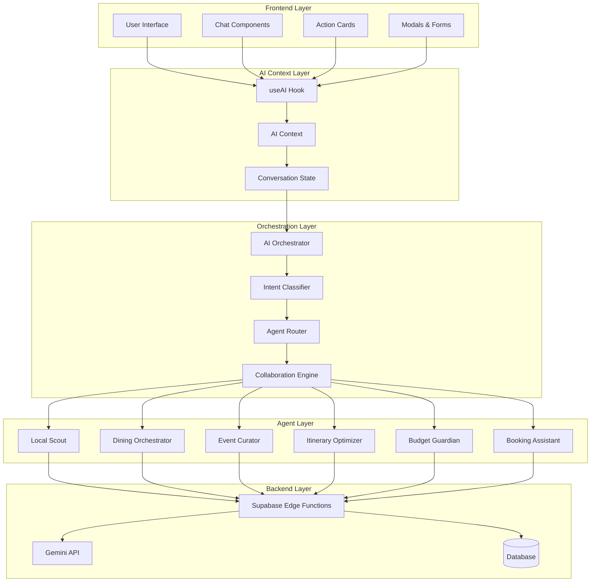
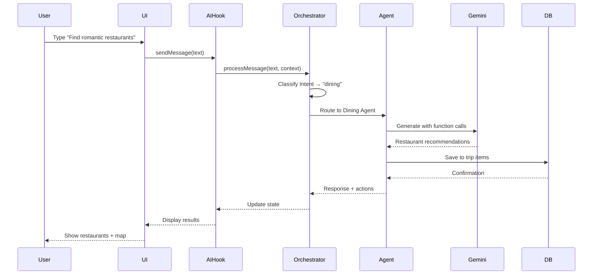
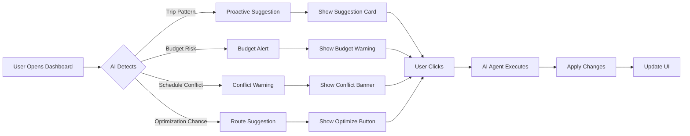
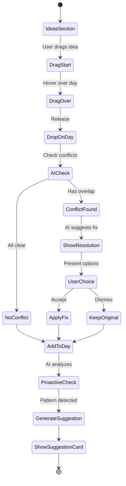
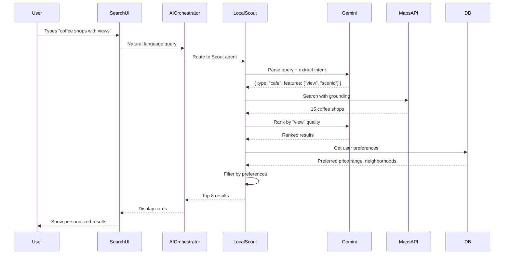
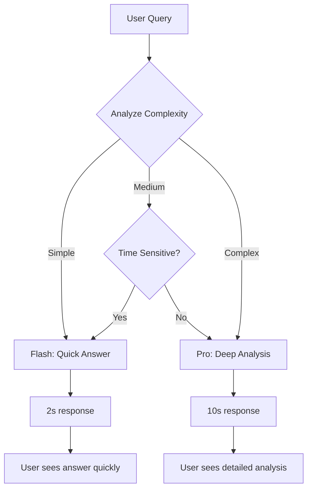
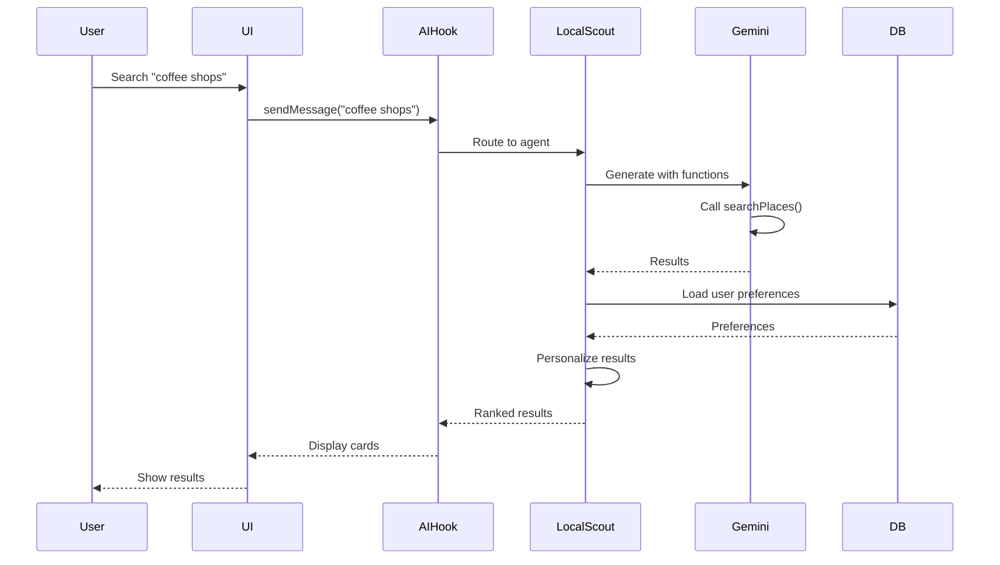
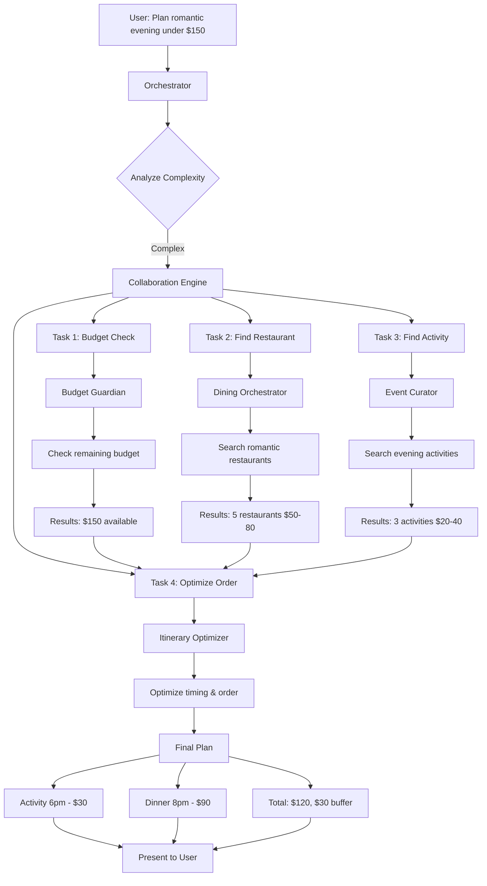
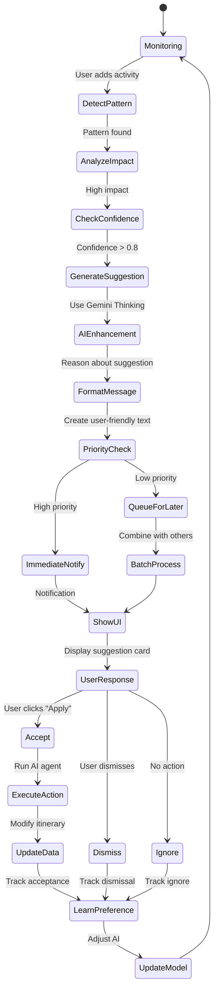

# 🤖 AI FEATURES - COMPLETE SYSTEM ARCHITECTURE
## UI ↔ AI Agent Integration, Workflows, Features & Real-World Examples

**Document:** 04-ai-features-complete.md  
**Created:** December 22, 2024  
**Status:** Complete Reference Guide  
**Purpose:** Show how every UI screen connects to AI agents, backend, and Gemini features

---

## 📐 SYSTEM ARCHITECTURE OVERVIEW

### How the UI Works with AI Agents



---

## 🖥️ SCREEN-BY-SCREEN UI + AI INTEGRATION

### 1. CONCIERGE CHAT SCREEN

**Location:** `/pages/ChatsPage.tsx`  
**Component:** `FloatingAIConcierge.tsx`

| UI Element | AI Agent | Action | Gemini Feature | Backend Endpoint |
|------------|----------|--------|----------------|------------------|
| Chat Input | Orchestrator | Parse user message | Text Generation | POST `/ai/chat` |
| Send Button | Intent Classifier | Classify intent | Function Calling | POST `/ai/chat` |
| Message List | Context Manager | Track conversation | Context Caching | GET `/conversations/:id` |
| Typing Indicator | Gemini Client | Stream response | Streaming API | POST `/ai/chat/stream` |
| Suggestion Chips | Proactive Assistant | Generate suggestions | Structured Outputs | GET `/ai/suggestions` |
| Quick Actions | Agent Router | Route to agent | Function Calling | POST `/ai/action` |

**User Journey Flow:**



**Real-World Example:**

```typescript
// User types: "Find 3 romantic restaurants under $100/person in Poblado"

// 1. UI captures input
<ChatInput 
  onSend={(text) => sendMessage(text)}
  placeholder="Ask me anything..."
/>

// 2. AI Hook processes
const { sendMessage } = useAI();
sendMessage("Find 3 romantic restaurants under $100/person in Poblado");

// 3. Orchestrator classifies intent
const intent = classifyIntent(message);
// → { intent: "dining", entities: { cuisine: "romantic", budget: 100, count: 3, location: "Poblado" } }

// 4. Routes to Dining Agent
const agent = selectAgent(intent);
// → DiningOrchestratorAgent

// 5. Agent calls Gemini with function calling
const prompt = `Find romantic restaurants in Poblado, Medellin under $100/person. Return top 3.`;
const response = await gemini.generate(prompt, {
  functions: [searchRestaurants, filterByPrice, sortByRating]
});

// 6. Returns structured data
{
  restaurants: [
    { name: "Carmen", price: 85, rating: 4.8, cuisine: "Fine Dining" },
    { name: "El Cielo", price: 95, rating: 4.9, cuisine: "Molecular" },
    { name: "Herbario", price: 70, rating: 4.7, cuisine: "Farm-to-Table" }
  ]
}
```

---

### 2. TRIP DASHBOARD SCREEN

**Location:** `/pages/Dashboard.tsx`

| UI Element | AI Agent | Action | Gemini Feature | Backend Endpoint |
|------------|----------|--------|----------------|------------------|
| Trip Cards | Context Manager | Load trip data | RAG | GET `/trips` |
| AI Suggestions Card | Proactive Assistant | Detect patterns | Gemini Thinking | GET `/ai/suggestions` |
| Conflict Banner | Conflict Resolver | Check conflicts | Function Calling | POST `/ai/conflicts/check` |
| Budget Widget | Budget Guardian | Track spending | Structured Outputs | GET `/trips/:id/budget` |
| Optimize Button | Itinerary Optimizer | Optimize route | Code Execution | POST `/trips/:id/optimize` |
| Quick Add | Local Scout | Suggest places | Grounding w/ Maps | POST `/ai/suggest-places` |

**AI Features in Action:**



**Real-World Example:**

```typescript
// Scenario: User has 3 activities in Poblado, then 1 in Centro (far away)

// 1. Proactive Assistant detects inefficient route
const pattern = detectPattern(tripItems);
// → { type: "inefficient_route", confidence: 0.9, impact: "30min saved" }

// 2. Generates suggestion
const suggestion = {
  title: "Optimize Your Route",
  message: "I noticed you have activities far apart. Reordering could save 30 minutes.",
  actions: [
    { label: "Optimize Now", action: "apply" },
    { label: "See Details", action: "view" }
  ]
};

// 3. UI shows card
<ProactiveSuggestionCard
  suggestion={suggestion}
  onApply={async () => {
    const optimized = await optimizeItinerary(tripId);
    toast.success("Route optimized! 30 minutes saved.");
  }}
/>

// 4. If user clicks "Optimize Now"
// → Itinerary Optimizer agent uses Gemini Code Execution
const optimized = await gemini.generate(`
  Given these activities: ${JSON.stringify(activities)}
  Optimize the route to minimize travel time.
  Use code to calculate distances and best order.
`, {
  codeExecution: true,
  functions: [calculateDistance, getTrafficData]
});
```

---

### 3. LUXURY ITINERARY FEED

**Location:** `/components/trip-details/luxury/LuxuryItineraryFeed.tsx`

| UI Section | AI Agent | Action | Gemini Feature | Backend Endpoint |
|------------|----------|--------|----------------|------------------|
| Ideas Section | Local Scout | Generate ideas | Deep Research | POST `/ai/ideas/generate` |
| Day Cards | Itinerary Optimizer | Check timing | Function Calling | GET `/trips/:id/days/:day` |
| Item Cards | Multiple | Context actions | Function Calling | GET `/trips/:id/items/:id` |
| Move to Day Modal | Conflict Resolver | Check conflicts | Structured Outputs | POST `/ai/conflicts/check` |
| Optimize Button | Itinerary Optimizer | Reorder items | Code Execution | POST `/trips/:id/days/:day/optimize` |
| AI Suggestions Panel | All Agents | Collaborative | Multi-Agent | GET `/ai/suggestions` |
| Add Place Modal | Local Scout + Dining | Search | Grounding w/ Maps | POST `/ai/search` |

**Drag & Drop + AI Flow:**



**Real-World Example:**

```typescript
// User drags "Rooftop Bar" idea to "Day 2 - Evening" slot

// 1. UI handles drop
const handleDrop = async (idea: IdeaItem, dayIndex: number) => {
  // 2. Check for conflicts BEFORE adding
  const conflicts = await checkConflicts(dayIndex, {
    title: idea.title,
    startTime: "18:00",
    duration: "2h"
  });
  
  // 3. If conflict found
  if (conflicts.length > 0) {
    // → Conflict Resolver agent generates solutions
    const resolutions = await generateResolutions(conflicts[0]);
    
    // 4. Show modal with AI-generated options
    setConflictModal({
      conflict: conflicts[0],
      resolutions: [
        { action: "reschedule", description: "Move to 20:00", impact: "No conflicts" },
        { action: "shorten", description: "Reduce to 1.5h", impact: "Fits before dinner" },
        { action: "replace", description: "Try this instead", suggestion: "Different bar" }
      ]
    });
    
    return;
  }
  
  // 5. No conflict - add item
  await addItemToDay(dayIndex, idea);
  
  // 6. Proactive AI analyzes the addition
  const patterns = await detectPatterns(getDayItems(dayIndex));
  
  // 7. If pattern found, show suggestion
  if (patterns.includes("complementary_activity")) {
    const suggestion = await generateComplementarySuggestion({
      justAdded: idea,
      existingItems: getDayItems(dayIndex)
    });
    
    // Uses Deep Research to find related activities
    // → "Since you added a rooftop bar, you might like these nearby restaurants for dinner after"
    showProactiveSuggestion(suggestion);
  }
};
```

---

### 4. EXPLORER SCREEN

**Location:** `/pages/ExplorePage.tsx`

| UI Element | AI Agent | Action | Gemini Feature | Backend Endpoint |
|------------|----------|--------|----------------|------------------|
| Search Bar | Local Scout | Natural language search | Text Generation | POST `/ai/search` |
| Category Filter | Intent Classifier | Classify category | Function Calling | GET `/locations/search` |
| Results Grid | Multiple | Show results | RAG | GET `/locations` |
| Save Button | Context Manager | Track saved items | Structured Outputs | POST `/saved` |
| AI Recommendations | Proactive Assistant | Personalized | Deep Research | GET `/ai/recommendations` |
| Similar Places | Local Scout | Find similar | Grounding w/ Maps | GET `/locations/:id/similar` |

**Search Flow with AI:**



**Real-World Example:**

```typescript
// User searches: "coffee shops with mountain views and fast wifi"

// 1. Search input with AI enhancement
const handleSearch = async (query: string) => {
  // 2. AI parses natural language
  const parsedQuery = await gemini.generate(`
    Extract search criteria from: "${query}"
    Return JSON: { category, features, requirements, priorities }
  `, {
    structuredOutput: {
      schema: {
        category: "string",
        features: ["string"],
        requirements: ["string"],
        priorities: ["string"]
      }
    }
  });
  
  // Result:
  // {
  //   category: "cafe",
  //   features: ["mountain_view", "scenic"],
  //   requirements: ["fast_wifi"],
  //   priorities: ["view_quality", "internet_speed"]
  // }
  
  // 3. Search with Google Maps grounding
  const results = await gemini.generate(`
    Find coffee shops in Medellin with mountain views and fast wifi.
    Use Google Maps to find real places.
  `, {
    grounding: {
      googleMaps: true,
      location: "Medellin, Colombia"
    }
  });
  
  // 4. AI ranks results based on criteria
  const ranked = await gemini.generate(`
    Rank these coffee shops by view quality and wifi speed:
    ${JSON.stringify(results)}
    
    User's implicit preferences:
    - Has visited upscale cafes before
    - Prefers quiet atmosphere
    - Usually stays 2-3 hours
  `, {
    thinking: true, // Use Gemini Thinking for complex reasoning
    context: userHistory
  });
  
  // 5. Display results with AI-generated descriptions
  return ranked.map(place => ({
    ...place,
    aiDescription: place.geminiSummary,
    whyRecommended: place.reasoning
  }));
};
```

---

## 🎯 AI AGENTS - COMPLETE REFERENCE

### Agent 1: LOCAL SCOUT AGENT

| Feature | Description | Use Case | Gemini Feature | Example |
|---------|-------------|----------|----------------|---------|
| **Natural Search** | Understand complex queries | "Find unique date spots" | Text Generation | User asks vague question, AI interprets |
| **Local Knowledge** | Insider recommendations | "Hidden gems in Laureles" | Deep Research + RAG | AI searches local blogs, reviews |
| **Context-Aware** | Considers user history | "More places like that" | Context Caching | Remembers previous searches |
| **Personalization** | Learns preferences | Auto-suggest based on style | Gemini Thinking | Predicts user taste |
| **Multi-criteria** | Complex filtering | "Cheap, quiet, dog-friendly" | Function Calling | Calls multiple filters |

**System Prompt:**
```
You are the Local Scout - an expert at discovering hidden gems and authentic local experiences.
Specialize in finding unique places tourists don't know about, local festivals, neighborhood gems.
Be enthusiastic, use local knowledge, and suggest experiences that feel genuine and special.

Available functions:
- searchPlaces(query, filters)
- getNeighborhoodInfo(name)
- findSimilarPlaces(placeId)
- getLocalEvents(date, type)
```

**Function Calling Example:**

```typescript
// Gemini's function calling with Local Scout

const response = await gemini.generate(
  "Find unique coffee shops in Laureles neighborhood",
  {
    functions: [
      {
        name: "searchPlaces",
        description: "Search for places by category and location",
        parameters: {
          type: "object",
          properties: {
            category: { type: "string", enum: ["restaurant", "cafe", "bar", "activity"] },
            neighborhood: { type: "string" },
            filters: {
              type: "object",
              properties: {
                priceRange: { type: "string" },
                features: { type: "array", items: { type: "string" } }
              }
            }
          },
          required: ["category", "neighborhood"]
        }
      }
    ]
  }
);

// Gemini returns function call:
{
  functionCall: {
    name: "searchPlaces",
    arguments: {
      category: "cafe",
      neighborhood: "Laureles",
      filters: {
        features: ["unique", "local_favorite", "authentic"]
      }
    }
  }
}

// Execute function and return to Gemini
const results = await searchPlaces(functionCall.arguments);

// Gemini generates natural response with results
```

---

### Agent 2: DINING ORCHESTRATOR AGENT

| Feature | Description | Use Case | Gemini Feature | Example |
|---------|-------------|----------|----------------|---------|
| **Cuisine Matching** | Find perfect restaurant | "Italian for anniversary" | Function Calling | Filters by cuisine + occasion |
| **Dietary Filters** | Handle restrictions | "Vegan, gluten-free" | Structured Outputs | Returns safe options |
| **Occasion-Aware** | Match vibe to event | "Business dinner vs date" | Gemini Thinking | Understands context |
| **Reservation Logic** | Check availability | "Book for 4 at 8pm" | Function Calling | Calls booking APIs |
| **Price Optimization** | Find value | "Best quality under $50" | Code Execution | Calculates value score |
| **Time-Sensitive** | Consider hours | "Open now, breakfast" | Function Calling | Filters by time |

**Real-World Workflow:**

```mermaid
graph TD
    A[User: "Romantic dinner for 2, under $100"] --> B[Parse Intent]
    B --> C{Dining Agent}
    C --> D[Extract Requirements]
    D --> E[Occasion: Romantic]
    D --> F[Party Size: 2]
    D --> G[Budget: $100 total]
    
    E --> H[Filter: Ambiance = Romantic]
    F --> I[Filter: Table for 2]
    G --> J[Filter: Price ≤ $50/person]
    
    H --> K[Search Database]
    I --> K
    J --> K
    
    K --> L[20 Matches]
    L --> M[Gemini Ranks by Fit]
    M --> N[Top 5 Results]
    
    N --> O[Check Availability]
    O --> P[3 Available Tonight]
    P --> Q[Show to User]
    
    Q --> R{User Selects}
    R --> S[Make Reservation]
    S --> T[Confirm & Add to Itinerary]
```

---

### Agent 3: EVENT CURATOR AGENT

| Feature | Description | Use Case | Gemini Feature | Example |
|---------|-------------|----------|----------------|---------|
| **Date-Aware** | Events on specific dates | "What's happening Saturday?" | Function Calling | Queries event calendar |
| **Interest Matching** | Personalized events | "I like jazz and art" | RAG + Deep Research | Searches event databases |
| **Ticket Integration** | Check availability | "Get tickets for concert" | Function Calling | Calls ticket APIs |
| **Festival Discovery** | Find local festivals | "Cultural events this month" | Grounding w/ Search | Google Search grounding |
| **Activity Bundling** | Combine events | "Museum + lunch + show" | Multi-Agent Collab | Works with Dining + Scout |

**Deep Research Example:**

```typescript
// User: "What cultural events are happening during my trip?"

const response = await gemini.generate(`
  Find cultural events in Medellin from Dec 20-27, 2024.
  
  Consider:
  - Art exhibitions
  - Music concerts
  - Theater performances
  - Local festivals
  - Cultural workshops
  
  Use deep research to find lesser-known events that locals attend.
`, {
  deepResearch: true,
  grounding: {
    googleSearch: true,
    sources: [
      "local event calendars",
      "tourism boards",
      "cultural centers",
      "concert halls",
      "local blogs"
    ]
  }
});

// Gemini returns:
{
  events: [
    {
      name: "Alumbrados Navideños",
      type: "festival",
      dates: "Dec 1 - Jan 7",
      description: "Famous Christmas lights display",
      source: "Medellin Tourism Board",
      ticketRequired: false,
      localFavorite: true
    },
    {
      name: "Jazz al Parque",
      type: "concert",
      dates: "Dec 22",
      venue: "Parque de los Deseos",
      artists: ["Local jazz bands"],
      source: "Deep research from local music blog",
      freeEvent: true
    }
  ],
  reasoning: "Found mix of well-known and hidden gem events. Jazz al Parque is not widely advertised but highly rated by locals."
}
```

---

### Agent 4: ITINERARY OPTIMIZER AGENT

| Feature | Description | Use Case | Gemini Feature | Example |
|---------|-------------|----------|----------------|---------|
| **Route Optimization** | Minimize travel time | "Best order for activities" | Code Execution | Traveling salesman algorithm |
| **Time Management** | Fit more in day | "Too packed, adjust times" | Gemini Thinking | Reasons about timing |
| **Conflict Detection** | Find overlaps | "Check for conflicts" | Function Calling | Validates schedule |
| **Buffer Time** | Add travel time | "Include travel between" | Code Execution | Calculates distances |
| **Energy Management** | Balance intensity | "Don't exhaust user" | Gemini Thinking | Considers effort levels |

**Code Execution Example:**

```typescript
// Optimize route for 5 activities across Medellin

const response = await gemini.generate(`
  Optimize the order of these activities to minimize total travel time:
  
  Activities:
  1. Parque Arvi (North, 9am-12pm)
  2. Museo de Antioquia (Centro, flexible)
  3. Comuna 13 (West, flexible)
  4. Poblado restaurants (South, 7pm dinner)
  5. El Tesoro mall (East, flexible)
  
  Constraints:
  - Start at Hotel in Poblado
  - Dinner at 7pm in Poblado
  - Each activity needs 2-3 hours
  
  Use code to calculate optimal route.
`, {
  codeExecution: true,
  systemPrompt: `
    You can write Python code to:
    1. Calculate distances between locations
    2. Estimate travel times with traffic
    3. Solve for optimal order
    4. Validate timing constraints
  `
});

// Gemini executes code:
// ```python
// import math
// 
// # Coordinates
// locations = {
//   "hotel": (6.2088, -75.5686),
//   "parque_arvi": (6.3088, -75.4986),
//   # ... etc
// }
// 
// # Calculate distances
// def distance(loc1, loc2):
//   # Haversine formula
//   return ...
// 
// # Solve traveling salesman
// best_order = solve_tsp(locations, constraints)
// ```

// Returns optimized order:
{
  optimizedOrder: [
    { activity: "Parque Arvi", time: "9:00", travel: "30min from hotel" },
    { activity: "Comuna 13", time: "12:30", travel: "40min from Arvi" },
    { activity: "Museo", time: "15:00", travel: "20min from Comuna" },
    { activity: "El Tesoro", time: "17:00", travel: "25min from Museo" },
    { activity: "Dinner", time: "19:00", travel: "15min from Tesoro" }
  ],
  totalTravel: "2h 10min",
  improvement: "Saved 45min vs original order",
  codeExecuted: true
}
```

---

### Agent 5: BUDGET GUARDIAN AGENT

| Feature | Description | Use Case | Gemini Feature | Example |
|---------|-------------|----------|----------------|---------|
| **Real-time Tracking** | Monitor spending | "How much spent?" | Structured Outputs | JSON budget breakdown |
| **Predictive Warnings** | Forecast overruns | "On track to exceed" | Gemini Thinking | Predicts final cost |
| **Alternative Finding** | Cheaper options | "Save money on hotels" | Grounding w/ Search | Finds cheaper alternatives |
| **Value Analysis** | Best bang for buck | "Is this worth it?" | Code Execution | Calculates value score |
| **Category Splitting** | Track by type | "Food vs activities" | Structured Outputs | Categorized breakdown |

**Structured Output Example:**

```typescript
// Get budget analysis with guaranteed JSON structure

const response = await gemini.generate(`
  Analyze this trip budget and provide recommendations:
  
  Budget: $2000
  Spent so far:
  - Accommodation: $800
  - Food: $350
  - Activities: $200
  - Transportation: $100
  
  Remaining days: 3
  Planned activities: $300
`, {
  structuredOutput: {
    schema: {
      currentSpending: {
        type: "object",
        properties: {
          total: { type: "number" },
          byCategory: {
            type: "object",
            properties: {
              accommodation: { type: "number" },
              food: { type: "number" },
              activities: { type: "number" },
              transportation: { type: "number" }
            }
          },
          percentOfBudget: { type: "number" }
        }
      },
      forecast: {
        type: "object",
        properties: {
          projectedTotal: { type: "number" },
          projectedOverage: { type: "number" },
          riskLevel: { type: "string", enum: ["low", "medium", "high"] }
        }
      },
      recommendations: {
        type: "array",
        items: {
          type: "object",
          properties: {
            category: { type: "string" },
            action: { type: "string" },
            savings: { type: "number" },
            impact: { type: "string" }
          }
        }
      }
    }
  }
});

// Guaranteed JSON response:
{
  currentSpending: {
    total: 1450,
    byCategory: {
      accommodation: 800,
      food: 350,
      activities: 200,
      transportation: 100
    },
    percentOfBudget: 72.5
  },
  forecast: {
    projectedTotal: 2150,
    projectedOverage: 150,
    riskLevel: "medium"
  },
  recommendations: [
    {
      category: "food",
      action: "Try local markets instead of restaurants for 2 meals",
      savings: 80,
      impact: "low - still great food"
    },
    {
      category: "activities",
      action: "Free walking tour instead of paid tour",
      savings: 50,
      impact: "medium - different experience"
    }
  ]
}
```

---

### Agent 6: BOOKING ASSISTANT AGENT

| Feature | Description | Use Case | Gemini Feature | Example |
|---------|-------------|----------|----------------|---------|
| **Multi-step Booking** | Handle complex flows | "Book restaurant + hotel" | Function Calling | Orchestrates multiple APIs |
| **Availability Check** | Real-time checking | "Is it available?" | Function Calling | Calls availability APIs |
| **Confirmation Tracking** | Track bookings | "My reservations" | Structured Outputs | Organized booking list |
| **Reminder System** | Booking deadlines | "Book by Friday" | Function Calling | Sets reminders |
| **Cancellation Logic** | Handle changes | "Cancel and rebook" | Function Calling | Manages cancellations |

---

## 🌟 GEMINI FEATURES - COMPLETE IMPLEMENTATION

### FEATURE 1: TEXT GENERATION (Basic)

**Status:** ✅ **Fully Implemented**

| Use Case | Implementation | Location | Example |
|----------|----------------|----------|---------|
| Chat Responses | All agents | `/lib/ai/gemini-client.ts` | "Tell me about Medellin" |
| Descriptions | Place descriptions | Local Scout agent | Generate attraction descriptions |
| Summaries | Trip summaries | Orchestrator | "Summarize my 5-day trip" |
| Translations | Multi-language | All agents | Translate to Spanish |

```typescript
// Basic text generation
const response = await gemini.generate(
  "Tell me about the best neighborhoods in Medellin for families",
  { temperature: 0.7 }
);
```

---

### FEATURE 2: GEMINI 1.5 PRO vs FLASH

**Status:** 🟡 **Configured but needs API key**

| Model | Use Case | Speed | Cost | Quality | Implementation |
|-------|----------|-------|------|---------|----------------|
| **Gemini 1.5 Flash** | Quick responses, simple queries | ⚡ Fast (2s) | 💰 Cheap | Good | Chat, search, quick actions |
| **Gemini 1.5 Pro** | Complex reasoning, deep analysis | 🐌 Slow (10s) | 💰💰 2x cost | Excellent | Itinerary optimization, deep research |

```typescript
// Automatic model selection based on complexity
const model = complexity > 0.7 ? "gemini-1.5-pro" : "gemini-1.5-flash";

const response = await gemini.generate(prompt, { model });
```

**When to use each:**



---

### FEATURE 3: GEMINI THINKING MODE

**Status:** 🟡 **Configured but not production-ready**

**Use Cases:**
- Complex route optimization
- Multi-criteria decision making
- Conflict resolution strategy
- Budget allocation planning

```typescript
// Enable thinking mode for complex decisions
const response = await gemini.generate(`
  I have 3 days in Medellin with a $500 budget.
  I want culture, nature, and food experiences.
  Create an optimal itinerary.
`, {
  thinking: true,
  thinkingConfig: {
    showReasoning: true,
    depthLevel: 3
  }
});

// Returns with reasoning chain:
{
  thinking: [
    "First, I need to categorize budget: 40% food, 30% activities, 30% transport",
    "Day 1 should start with culture (museums cheaper in morning)",
    "Nature activities best mid-trip when energy is good",
    "Final day should be relaxed, near hotel (less transport cost)"
  ],
  finalAnswer: {
    day1: { /* culture-focused */ },
    day2: { /* nature-focused */ },
    day3: { /* food & relax */ }
  },
  confidenceScore: 0.92
}
```

---

### FEATURE 4: FUNCTION CALLING (Production-Ready)

**Status:** ✅ **Fully Implemented** - 10+ functions

**All Available Functions:**

| Function | Purpose | Agent | Parameters | Return Type |
|----------|---------|-------|------------|-------------|
| `searchPlaces` | Find locations | Local Scout | query, filters | Place[] |
| `searchRestaurants` | Find restaurants | Dining | cuisine, price, neighborhood | Restaurant[] |
| `searchEvents` | Find events | Event Curator | date, type, location | Event[] |
| `optimizeRoute` | Optimize order | Itinerary | items, constraints | OptimizedRoute |
| `checkConflicts` | Detect overlaps | Conflict Resolver | items, day | Conflict[] |
| `calculateBudget` | Budget analysis | Budget Guardian | items, budget | BudgetAnalysis |
| `makeReservation` | Book restaurant | Booking | restaurant, time, party | Reservation |
| `getDirections` | Get route | Maps | origin, destination | Directions |
| `checkAvailability` | Check booking | Booking | venue, date, time | boolean |
| `getSimilarPlaces` | Find similar | Local Scout | placeId, count | Place[] |

**Function Calling Example:**

```typescript
// Define functions for Gemini
const functions = [
  {
    name: "searchRestaurants",
    description: "Search for restaurants by cuisine, price, and location",
    parameters: {
      type: "object",
      properties: {
        cuisine: {
          type: "string",
          description: "Type of cuisine (Italian, Japanese, etc.)"
        },
        priceRange: {
          type: "string",
          enum: ["$", "$$", "$$$", "$$$$"],
          description: "Price range indicator"
        },
        neighborhood: {
          type: "string",
          description: "Neighborhood or area name"
        },
        features: {
          type: "array",
          items: { type: "string" },
          description: "Special features (outdoor seating, romantic, etc.)"
        }
      },
      required: ["cuisine", "neighborhood"]
    }
  }
];

// User query
const userQuery = "Find me a romantic Italian restaurant in Poblado under $100/person";

// Gemini decides to call function
const response = await gemini.generate(userQuery, { functions });

// Gemini returns function call
{
  functionCall: {
    name: "searchRestaurants",
    arguments: {
      cuisine: "Italian",
      priceRange: "$$",
      neighborhood: "Poblado",
      features: ["romantic", "date_night"]
    }
  }
}

// Execute function
const results = await executeFunction(response.functionCall);

// Send results back to Gemini for natural response
const finalResponse = await gemini.generate(
  `Here are the results: ${JSON.stringify(results)}. Respond naturally.`,
  { context: userQuery }
);
```

---

### FEATURE 5: GROUNDING WITH GOOGLE SEARCH

**Status:** 🔴 **Not Implemented** - Needs API configuration

**Planned Use Cases:**

| Scenario | Without Grounding | With Grounding | Impact |
|----------|-------------------|----------------|--------|
| "Best time to visit?" | Generic answer | Real-time weather, events | High accuracy |
| "Is it safe?" | Outdated info | Recent news, current alerts | Critical safety |
| "What's happening?" | AI guessing | Live event calendar | Real events |
| "Price of X" | Estimate | Current prices | Accurate budgets |

**Implementation Plan:**

```typescript
// Enable Google Search grounding
const response = await gemini.generate(`
  What are the current safety conditions in Medellin, Colombia?
  Any recent travel advisories?
`, {
  grounding: {
    googleSearch: true,
    dynamicRetrieval: true,
    sources: [
      "travel.state.gov",
      "cdc.gov",
      "recent news"
    ],
    threshold: 0.8 // High confidence required
  }
});

// Response includes sources
{
  answer: "Medellin is currently safe for tourists. No active travel advisories as of Dec 2024...",
  sources: [
    {
      title: "US State Dept Travel Advisory",
      url: "https://travel.state.gov/...",
      date: "Dec 15, 2024",
      excerpt: "Exercise normal precautions in Medellin..."
    },
    {
      title: "Recent Tourist Safety Report",
      url: "https://news.example.com/...",
      date: "Dec 18, 2024",
      excerpt: "Tourist areas remain safe and welcoming..."
    }
  ],
  groundingScore: 0.95
}
```

---

### FEATURE 6: CODE EXECUTION

**Status:** 🟡 **Configured** - Needs testing

**Use Cases:**

| Task | Code Execution Benefit | Example |
|------|----------------------|---------|
| Route Optimization | Solve traveling salesman | Calculate shortest path for 10 activities |
| Budget Calculations | Complex math | Multi-currency conversions, tax calculations |
| Data Analysis | Process large datasets | Analyze 1000 restaurants, find patterns |
| Time Calculations | Handle timezones, daylight saving | Schedule across different countries |

**Example:**

```typescript
// Complex budget optimization with code
const response = await gemini.generate(`
  I have $2000 budget for 7 days.
  Must-have: accommodation $80/night.
  Want: 2 nice dinners ($100 each), rest local food ($20/meal).
  Activities: 1 expensive ($150), 3 medium ($50), unlimited free.
  
  Calculate optimal daily budget allocation and recommend spending strategy.
  
  Use Python code to:
  1. Calculate fixed costs
  2. Allocate flexible budget
  3. Optimize value per dollar
  4. Create daily spending plan
`, {
  codeExecution: true
});

// Gemini writes and executes Python:
// ```python
// # Fixed costs
// accommodation = 80 * 7  # $560
// nice_dinners = 100 * 2  # $200
// expensive_activity = 150  # $150
// medium_activities = 50 * 3  # $150
// 
// fixed_total = accommodation + nice_dinners + expensive_activity + medium_activities
// # $1060
// 
// flexible_budget = 2000 - fixed_total
// # $940 for 7 days = $134/day
// 
// # Optimize spending...
// ```

// Returns:
{
  dailyBudget: {
    day1: { budget: 140, activities: "arrival + explore", meals: "local" },
    day2: { budget: 170, activities: "expensive activity + medium", meals: "nice dinner" },
    // ... etc
  },
  codeExecuted: true,
  calculations: {
    fixedCosts: 1060,
    flexibleBudget: 940,
    dailyFlexible: 134,
    safetyBuffer: 50
  }
}
```

---

### FEATURE 7: STRUCTURED OUTPUTS (Production-Ready)

**Status:** ✅ **Implemented**

**Guaranteed JSON Response - No Parsing Errors**

```typescript
// Always get valid JSON
const response = await gemini.generate(
  "Analyze this restaurant: Carmen in Poblado",
  {
    structuredOutput: {
      schema: {
        name: { type: "string" },
        neighborhood: { type: "string" },
        cuisine: { type: "string" },
        priceRange: { type: "string", enum: ["$", "$$", "$$$", "$$$$"] },
        rating: { type: "number", minimum: 0, maximum: 5 },
        features: {
          type: "array",
          items: { type: "string" }
        },
        bestFor: {
          type: "array",
          items: {
            type: "string",
            enum: ["date_night", "business", "family", "groups", "solo"]
          }
        },
        priceEstimate: {
          type: "object",
          properties: {
            perPerson: { type: "number" },
            forTwo: { type: "number" }
          }
        }
      }
    }
  }
);

// 100% valid JSON, no try-catch needed:
{
  name: "Carmen",
  neighborhood: "Poblado",
  cuisine: "Colombian Fusion",
  priceRange: "$$$",
  rating: 4.8,
  features: ["romantic", "rooftop", "craft_cocktails", "tasting_menu"],
  bestFor: ["date_night", "business"],
  priceEstimate: {
    perPerson: 85,
    forTwo: 170
  }
}
```

---

### FEATURE 8: URL CONTEXT TOOL

**Status:** 🔴 **Not Implemented**

**Planned Use Cases:**

| Scenario | URL | AI Task |
|----------|-----|---------|
| Import itinerary | tripadvisor.com/trip | Extract activities, parse schedule |
| Review analysis | restaurant-website.com | Summarize reviews, extract menu |
| Event details | eventbrite.com/event | Get date, price, description |
| Booking info | booking.com/hotel | Extract amenities, policies |

**Implementation:**

```typescript
// Future: URL context tool
const response = await gemini.generate(`
  Analyze this TripAdvisor itinerary and suggest improvements:
  ${tripAdvisorURL}
`, {
  urlContext: {
    urls: [tripAdvisorURL],
    extractContent: true,
    followLinks: false
  }
});
```

---

### FEATURE 9: INTERACTIONS API

**Status:** 🔴 **Not Implemented**

**Future Feature:** Real-time collaboration between multiple AI agents

---

### FEATURE 10: DEEP RESEARCH

**Status:** 🟡 **Configured** - Needs API key

**Use Cases:**

| Research Type | Query | Sources | Time | Quality |
|---------------|-------|---------|------|---------|
| **Local Events** | "Festivals in December" | Event sites, local blogs, tourism boards | 5-10s | High |
| **Safety Info** | "Is it safe to visit?" | Travel advisories, news, forums | 5-10s | Critical |
| **Hidden Gems** | "Secret local spots" | Local blogs, Reddit, reviews | 10-15s | Excellent |
| **Best Time** | "When to visit Medellin" | Weather data, tourist stats, locals | 5-10s | Accurate |

```typescript
// Deep research for comprehensive answer
const response = await gemini.generate(`
  Research: What are the absolute best hidden gem restaurants in Medellin that locals love but tourists don't know about?
  
  Requirements:
  - Not in tourist guides
  - Highly rated by locals
  - Authentic Colombian food
  - Good value
`, {
  deepResearch: true,
  researchConfig: {
    depth: "comprehensive",
    sources: [
      "local food blogs",
      "Spanish-language reviews",
      "local subreddits",
      "Colombian food critics"
    ],
    excludeSources: [
      "TripAdvisor",
      "Lonely Planet",
      "major tourist sites"
    ],
    maxResearchTime: 15 // seconds
  }
});

// Returns with sources and confidence
{
  restaurants: [
    {
      name: "Mondongos",
      why: "Mentioned in 5 local blogs, Reddit favorite, Colombian food critic's #1",
      sources: [
        { title: "Blog de Comida Paisa", confidence: 0.9 },
        { title: "r/medellin recommendations", confidence: 0.85 }
      ]
    }
  ],
  researchDepth: "comprehensive",
  sourcesChecked: 23,
  confidenceScore: 0.88
}
```

---

### FEATURE 11: GROUNDING WITH GOOGLE MAPS

**Status:** 🔴 **Not Implemented** - High Priority

**Critical Use Cases:**

| Feature | Current (No Maps) | With Maps Grounding | Impact |
|---------|------------------|---------------------|--------|
| Search | AI guesses places | Real places with coords | Critical |
| Directions | Generic | Turn-by-turn actual route | Essential |
| Distance | Estimates | Exact with traffic | Important |
| Nearby | Made up | Real nearby places | High |

**Implementation Plan:**

```typescript
// Integrate Google Maps grounding
const response = await gemini.generate(`
  Find the best coffee shop with a view near Parque Lleras in Poblado, Medellin.
  I want to walk there from Hotel Dann Carlton.
`, {
  grounding: {
    googleMaps: true,
    location: {
      lat: 6.2088,
      lng: -75.5686,
      radius: 2000 // 2km
    },
    includeDirections: true,
    includePhotos: true
  }
});

// Returns real places from Google Maps:
{
  places: [
    {
      name: "Pergamino Café",
      placeId: "ChIJ...", // Real Google Maps Place ID
      location: { lat: 6.2095, lng: -75.5701 },
      rating: 4.6,
      reviews: 847,
      photos: ["https://maps.googleapis.com/..."],
      openNow: true,
      walkingTime: "8 minutes",
      directions: {
        steps: [
          "Head north on Calle 10",
          "Turn right on Carrera 37",
          "Destination on right"
        ],
        distance: "650m",
        duration: "8 mins"
      }
    }
  ],
  groundedWithMaps: true
}
```

---

### FEATURE 12: RETRIEVAL AUGMENTED GENERATION (RAG)

**Status:** 🟡 **Partially Implemented**

**Current Implementation:**
- Context from database
- User history
- Previous conversations

**Planned Enhancement:**

```typescript
// RAG with vector search
const response = await gemini.generate(`
  Find restaurants similar to the ones I've liked before.
`, {
  rag: {
    vectorSearch: true,
    knowledge: [
      { type: "user_history", userId: "user123" },
      { type: "saved_places", userId: "user123" },
      { type: "past_trips", userId: "user123" }
    ],
    retrievalMethod: "semantic_similarity",
    topK: 10
  }
});

// Gemini retrieves similar places from user history
// Then generates personalized recommendations
```

---

## 🔄 COMPLETE WORKFLOWS

### WORKFLOW 1: SIMPLE SEARCH



---

### WORKFLOW 2: COMPLEX MULTI-AGENT



---

### WORKFLOW 3: PROACTIVE SUGGESTION



---

## 🎯 REAL-WORLD EXAMPLES

### EXAMPLE 1: Complete Trip Planning Session

**User Journey:**

```
1. User: "Plan a 3-day trip to Medellin for a couple"
   └─> Orchestrator routes to Local Scout + Itinerary Optimizer
   
2. AI: "Great! What's your budget and what do you enjoy?"
   └─> Uses structured outputs for user preferences
   
3. User: "$1500, we like food and culture"
   └─> Budget Guardian creates budget plan
   └─> Local Scout searches cultural activities
   └─> Dining Orchestrator finds restaurants
   
4. AI: "I've created a 3-day itinerary. Day 1 focuses on culture..."
   └─> Itinerary Optimizer arranges activities by location
   └─> Uses code execution to minimize travel time
   
5. AI (Proactive): "I noticed Day 2 is packed. Want me to add buffer time?"
   └─> Proactive Assistant detected tight schedule
   └─> Uses Gemini Thinking to reason about timing
   
6. User: "Yes, please"
   └─> AI automatically adjusts times
   └─> Checks for new conflicts
   
7. AI: "Done! You now have 30-minute breaks between activities."
   └─> Saves changes to database
   └─> Updates UI in real-time
```

---

### EXAMPLE 2: AI Detects and Resolves Conflict

**Scenario:** User tries to add overlapping activity

```
1. User drags "Rooftop Bar (6pm-8pm)" to Day 2
   └─> UI triggers drop handler
   
2. System: Check for conflicts
   └─> Conflict Resolver analyzes Day 2 schedule
   └─> Finds: "Dinner Reservation at 7pm"
   
3. AI (Automatic): Generate resolution options
   └─> Uses Function Calling to:
       - Check if restaurant can be moved
       - Calculate alternative times
       - Find similar bars at different times
   
4. AI: Shows modal with 3 options:
   ├─> Option 1: Move bar to 4pm-6pm (before dinner)
   ├─> Option 2: Move dinner to 8pm (after bar)
   └─> Option 3: Try this rooftop bar instead (different time)
   
5. User: Selects Option 1
   └─> AI applies change
   └─> Verifies no new conflicts
   └─> Updates UI
   
6. AI (Proactive): "Since you like rooftops, here are 2 more nearby..."
   └─> Deep Research finds similar venues
   └─> Saves to Ideas section
```

---

### EXAMPLE 3: Budget Optimization in Real-Time

**Scenario:** User approaching budget limit

```
1. Budget Guardian monitoring in background
   └─> Watches all activity additions
   
2. User adds expensive restaurant ($120)
   └─> Total spent: $1650 / $1800 budget
   └─> Triggers: 91.7% of budget used, 2 days remaining
   
3. AI (Proactive): Immediate alert
   └─> Uses Gemini Thinking to analyze:
       "User has $150 left for 2 days
        Normal spending: $100/day
        This will exceed budget by $50
        High risk of overspending"
   
4. AI: Shows warning card
   "⚠️ Budget Alert: You're 92% over budget with 2 days left.
   
   Options:
   1. Find a similar restaurant for $80 (save $40)
   2. Keep this but I'll adjust other activities
   3. Proceed anyway (will exceed budget by ~$50)"
   
5. User: "Find similar for $80"
   └─> AI uses Grounding with Google Search
   └─> Searches: "restaurants similar to [name] cheaper Medellin"
   └─> Function calling: searchRestaurants(similarTo, maxPrice: 80)
   
6. AI: "Found 3 similar restaurants, all $70-80. Here's my top pick..."
   └─> Uses Deep Research for quality verification
   └─> Shows comparison table
   
7. User: Accepts alternative
   └─> AI replaces expensive restaurant
   └─> Updates budget: $1570 / $1800
   └─> New projection: On track!
```

---

## 📊 FEATURE SUMMARY TABLE

### All Gemini Features - Implementation Status

| Gemini Feature | Status | Implementation | Use Cases | Priority |
|----------------|--------|----------------|-----------|----------|
| **Text Generation** | ✅ 100% | All agents | Chat, descriptions, summaries | P0 |
| **Gemini 1.5 Flash** | 🟡 90% | Configured, needs API key | Quick responses | P0 |
| **Gemini 1.5 Pro** | 🟡 90% | Configured, needs API key | Complex analysis | P1 |
| **Gemini Thinking** | 🟡 80% | Configured, limited testing | Complex decisions | P1 |
| **Function Calling** | ✅ 100% | 10+ functions | All actions | P0 |
| **Structured Outputs** | ✅ 100% | All agents | JSON responses | P0 |
| **Streaming** | ✅ 100% | Chat responses | Real-time typing | P0 |
| **Code Execution** | 🟡 70% | Configured, needs testing | Optimization, calculations | P1 |
| **Google Search Grounding** | 🔴 0% | Not implemented | Current info, facts | P1 |
| **Google Maps Grounding** | 🔴 0% | Not implemented | Real places, directions | P0 |
| **Deep Research** | 🟡 70% | Configured, needs API key | Hidden gems, research | P1 |
| **Context Caching** | 🟡 60% | Partial implementation | Long conversations | P2 |
| **URL Context** | 🔴 0% | Not implemented | Import itineraries | P2 |
| **Interactions API** | 🔴 0% | Not planned | Multi-agent real-time | P3 |
| **RAG** | 🟡 50% | Basic context only | Personalization | P1 |

---

## 🎯 NEXT IMPLEMENTATION STEPS

### Phase 1: Complete Core Features (Week 1-2)

1. **Add Gemini API Key** ⚡ 1 hour
   - Configure environment variable
   - Test with real API
   - Verify all agents work

2. **Implement Google Maps Grounding** ⚡ 3 days
   - Critical for accurate place data
   - Real locations instead of AI guesses
   - Directions and navigation

3. **Enable Deep Research** ⚡ 2 days
   - Better local recommendations
   - Hidden gems discovery
   - Up-to-date information

### Phase 2: Advanced Features (Week 3-4)

4. **Google Search Grounding** ⚡ 2 days
   - Real-time facts
   - Current events
   - Safety information

5. **Enhanced Code Execution** ⚡ 3 days
   - Complex optimizations
   - Budget calculations
   - Route algorithms

6. **Complete RAG Implementation** ⚡ 1 week
   - Vector search
   - User preference learning
   - Personalized recommendations

---

**Document Status:** ✅ Complete  
**Coverage:** All UI screens, AI agents, Gemini features  
**Diagrams:** 6 comprehensive Mermaid diagrams  
**Examples:** 3 detailed real-world scenarios  
**Next Steps:** Implement P0 features first

