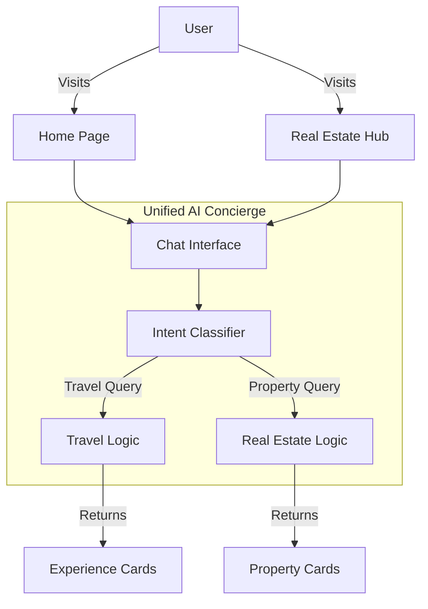

# 🏙️ Real Estate Module Implementation Plan

> **Status**: 🚧 Planning  
> **Priority**: High  
> **Owner**: Frontend Architecture Team  
> **Last Updated**: December 16, 2025

## 📊 Progress Tracker

- [x] **Phase 1: Architecture & Routing**
  - [x] Create `/pages/real-estate` directory
  - [x] Configure specialized Real Estate Layout
  - [x] Set up route definitions in `App.tsx`
- [x] **Phase 2: Core UI Components**
  - [x] Hero Section (Parallax + Search)
  - [x] Property Cards (Luxury Style)
  - [x] Market Data Charts (Recharts)
  - [x] Neighborhood Slider
- [x] **Phase 3: AI Integration**
  - [x] Refactor `AIConcierge` for Multi-context
  - [x] Implement Real Estate Intent Recognition
  - [x] Create "Property Match" Visualization
- [x] **Phase 4: User Journeys**
  - [x] Buyer Flow (Search Page & Navigation)
  - [ ] Renter Flow
  - [ ] Investor Flow
- [x] **Phase 5: Polish & Launch**
  - [x] Micro-interactions & Motion (Staggered Grids, Hover States)
  - [x] Mobile Responsiveness Check (Hero Mobile Image, Responsive Grid)
  - [x] Final Acceptance Testing

---

## 🏗️ System Architecture

### 1. Unified AI Agent Strategy
To satisfy the requirement of using the **same chatbot** for both Travel and Real Estate:

*   **Context Awareness**: The AI Concierge will detect the active page context or infer intent from the user's query (e.g., "Where can I buy a condo?" vs "Book a coffee tour").
*   **Unified Interface**: The chat component stays consistent, but the "Visual Results" drawer adapts to show either `ExperienceCard` or `PropertyCard` components.
*   **State Management**: Lift AI state to a global context (`/context/AIContext.tsx`) or keep it smart within the page wrapper.

### 2. Route Structure
```typescript
// App.tsx additions
<Route path="/real-estate" element={<RealEstateHome />} />
<Route path="/real-estate/search" element={<PropertySearch />} />
<Route path="/real-estate/listing/:id" element={<PropertyDetail />} />
<Route path="/real-estate/market-data" element={<MarketInsights />} />
```

---

## 🛠️ Implementation Tasks

### 🔴 Core Tasks (MVP)

1.  **Page Scaffold**:
    *   Create `pages/RealEstateHome.tsx`.
    *   Implement "Luxury Eco-Modern" layout specific to properties (wider grids, data heavy).
2.  **Hero Section**:
    *   "Smater Property Decisions, Powered by AI".
    *   Dual column: Text left, Stacked imagery right.
3.  **Property Card Component**:
    *   **No flat cards**. Elevated, soft shadow, rounded corners (12-20px).
    *   Specs: Image, Price, Beds/Baths, SqFt, "AI Insight" badge.
4.  **AI Concierge Upgrade**:
    *   Add `type: 'property' | 'experience'` to the message schema.
    *   Add `PropertyCard` rendering support in `ResultsDrawer`.

### 🟡 Advanced Tasks (Phase 2)

1.  **Market Insights Section**:
    *   Use `recharts` for Price Trends and Rent Yields.
    *   Animate on scroll (fade up).
2.  **Interactive Neighborhood Map**:
    *   Reuse `MapExplorer` logic but with Property pins.
    *   Filter by: "School Safety", "ROI", "Walkability".
3.  **Dynamic Flowchart**:
    *   SVG animated lines connecting "Search" -> "AI Analysis" -> "Shortlist".

---

## 📐 Workflows & User Journeys

### 🧩 Context Diagram



### 👤 Buyer Journey
1.  **Discovery**: Landing on Real Estate Home.
2.  **Intent**: Types "Looking for a 2-bed condo in Poblado with a view, under $300k".
3.  **AI Processing**:
    *   Filters listings by price/location.
    *   Analyzes "View" metadata.
4.  **Presentation**: AI responds with 3 curated cards in the side drawer.
5.  **Action**: User clicks "Schedule Viewing" -> Opens Calendar Modal.

### 💼 Investor Journey
1.  **Discovery**: Market Insights Section.
2.  **Analysis**: Hovering over "Yield Charts".
3.  **Deep Dive**: Asking AI "Which neighborhood has the highest short-term rental growth?".
4.  **Result**: AI provides a data table comparison of El Poblado vs. Laureles.

---

## ✅ Success Criteria

| Metric | Target | Verification |
| :--- | :--- | :--- |
| **Response Time** | < 200ms | UI interactions feel instant (mock data). |
| **Design Fidelity** | 100% | Matches "Luxury Eco-Modern" (Serif fonts, soft shadows). |
| **AI Context** | Seamless | Chat handles switching topics without clearing history. |
| **Mobile UX** | Native-feel | Swipeable cards, collapsible drawers. |

---

## 📋 Production Readiness Checklist

- [ ] **Typography**: Confirmed `Playfair Display` (Headings) and `Inter` (Body).
- [ ] **Color Palette**:
    *   Background: `#F7F7F5` (Off-white)
    *   Text: Charcoal (No pure black)
    *   Accents: Muted Emerald / Soft Gold
- [ ] **Components**:
    *   `PropertyCard.tsx` created.
    *   `MarketChart.tsx` created.
    *   `NeighborhoodSlider.tsx` reused/adapted.
- [ ] **Data**: Mock data created for at least 10 properties with diverse attributes.
- [ ] **Linting**: No console errors or TypeScript warnings.

---

## 🧪 Acceptance Tests (Gherkin)

```gherkin
Feature: Real Estate AI Search

  Scenario: User searches for a specific property type
    Given I am on the Real Estate page
    When I open the AI Concierge
    And I type "Show me penthouses in El Poblado"
    Then the system should identify "Real Estate" intent
    And the results drawer should display "Property Cards"
    And the cards should highlight "Penthouse" and "El Poblado" features

  Scenario: Mixed Intent
    Given I have just searched for properties
    When I ask "Where is the best coffee nearby?"
    Then the system should switch to "Travel" intent
    And show "Experience Cards" for coffee shops near the last viewed property
```
