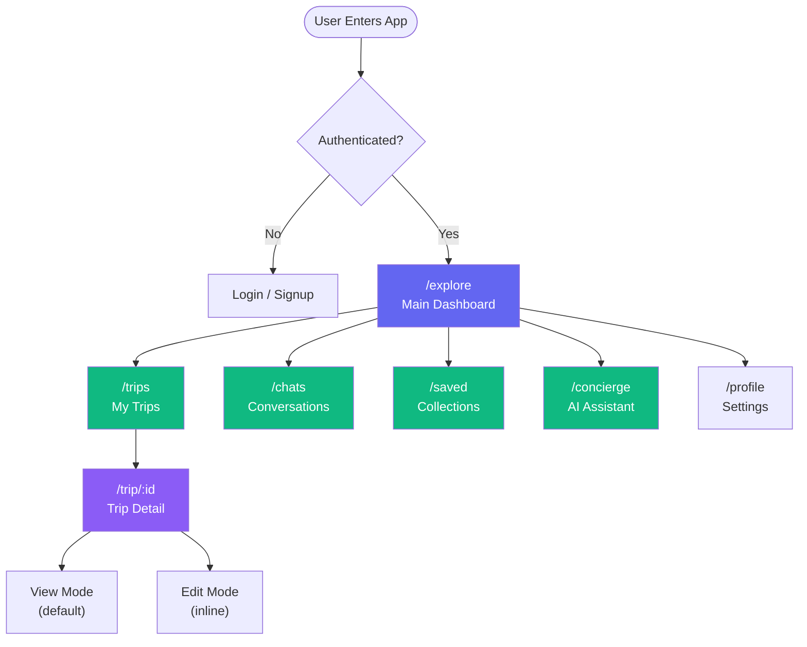
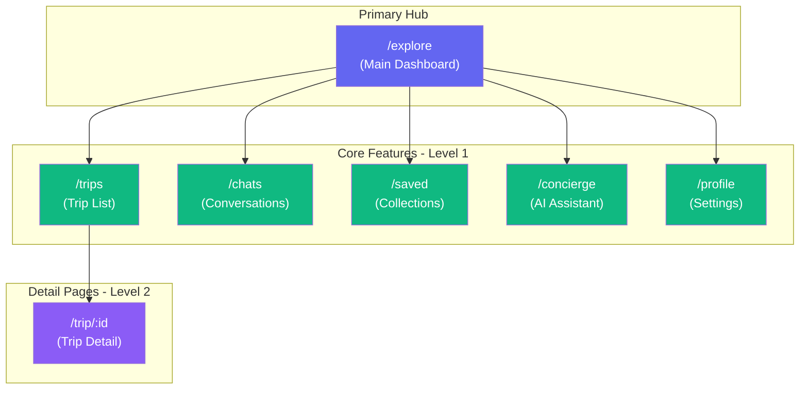

# Proposed Core Sitemap — Clean Structure

**Date:** December 20, 2024  
**Status:** Recommended production structure  
**Routes:** 7 core routes

---

## 🎯 Core Philosophy

**Principles:**
1. `/explore` is THE main dashboard (single entry point)
2. Flat navigation for speed
3. User-friendly labels
4. Consistent naming
5. Dynamic routing for all resources

---

## 🗺️ Proposed Core Routes

| Route | Label | Purpose | User Action |
|-------|-------|---------|-------------|
| `/explore` | Explore | Main dashboard | Discover destinations |
| `/trips` | My Trips | Trip list | View/create trips |
| `/trip/:id` | Trip Detail | Single trip | View/edit itinerary |
| `/chats` | Chats | Conversation list | View messages |
| `/saved` | Saved | Collections | View bookmarks |
| `/concierge` | Concierge | AI assistant | Get help |
| `/profile` | Profile | User settings | Manage account |

---

## 📊 Core Sitemap Diagram

---

## 📋 Route Specifications

### 1. `/explore` — Main Dashboard ⭐

**Label:** "Explore" or "Home"  
**Icon:** 🏠 Home / 🌍 Globe  
**Purpose:** Primary entry point and discovery hub

**Sections:**
- Hero search (destinations, dates)
- Personalized recommendations
- Quick actions (new trip, ask AI)
- Recent trips widget
- Trending destinations
- Upcoming trip summary

**User Actions:**
- Search destinations
- Browse recommendations
- Quick create trip
- View trip overview
- Navigate to core features

**AI Agents Active:**
- Discovery Agent (recommendations)
- Proactive Assistant (suggestions)

**Data Sources:**
- User preferences
- Recent searches
- Saved locations
- Active trips
- Popular destinations

**Navigation:** Always accessible (home button)

---

### 2. `/trips` — My Trips

**Label:** "My Trips" or "Trips"  
**Icon:** ✈️ Airplane / 📋 List  
**Purpose:** Trip management hub

**Sections:**
- Active trips
- Upcoming trips
- Past trips
- Drafts
- Shared trips (collaborations)

**User Actions:**
- View all trips
- Create new trip
- Filter by status
- Sort by date
- Search trips
- Archive/delete

**AI Agents Active:**
- Planning Agent (suggestions)
- Proactive Assistant (trip prep)

**Data Sources:**
- `trips` table
- `trip_items` table
- `trip_collaborators` table

**Navigation:** Main menu

---

### 3. `/trip/:id` — Trip Detail

**Label:** Dynamic (trip title)  
**Icon:** 📍 Location Pin  
**Purpose:** Single trip view/edit

**Sections:**
- Trip header (title, dates, destination)
- Itinerary timeline (day-by-day)
- Map view toggle
- Budget summary
- Collaborators
- Notes
- AI suggestions

**User Actions:**
- View itinerary
- Add/edit items
- Reorder items
- View on map
- Share trip
- Export itinerary
- Chat with AI about trip

**AI Agents Active:**
- Planning Agent (optimization)
- Location Scout (nearby places)
- Logistics Agent (bookings)
- Contextual Concierge

**Data Sources:**
- `trips` table (trip details)
- `trip_items` table (itinerary)
- `locations` table (places)
- `trip_collaborators` table

**Navigation:** Back to `/trips`, breadcrumb

---

### 4. `/chats` — Conversations

**Label:** "Chats" or "Messages"  
**Icon:** 💬 Chat Bubble  
**Purpose:** Message history

**Sections:**
- Conversation list
- Search/filter
- New conversation button
- Unread badge

**User Actions:**
- View all conversations
- Start new chat
- Search conversations
- Archive conversations

**AI Agents Active:**
- None (list view)

**Data Sources:**
- `conversations` table
- `messages` table (last message)

**Navigation:** Main menu

---

### 5. `/saved` — Collections

**Label:** "Saved" or "Collections"  
**Icon:** ⭐ Star / 🔖 Bookmark  
**Purpose:** Bookmarked places

**Sections:**
- All saved places
- Collections (grouped)
- Recent saves
- Shared collections

**User Actions:**
- View saved places
- Create collection
- Add to collection
- Remove from saved
- Share collection

**AI Agents Active:**
- Discovery Agent (similar places)

**Data Sources:**
- `collections` table
- `collection_items` table
- `locations` table

**Navigation:** Main menu

---

### 6. `/concierge` — AI Assistant

**Label:** "Concierge" or "AI Assistant"  
**Icon:** 🤖 Robot / ✨ Sparkles  
**Purpose:** General AI help

**Sections:**
- Chat interface
- Suggested prompts
- Recent conversations
- Quick actions

**User Actions:**
- Ask questions
- Get recommendations
- Plan trips
- Get travel tips

**AI Agents Active:**
- All 6 agents (coordinated via event bus)
- Discovery Agent
- Planning Agent
- Location Scout
- Logistics Agent
- Collaboration Engine
- Proactive Assistant

**Data Sources:**
- Full user context
- All tables (via agents)

**Navigation:** Main menu, always accessible

---

### 7. `/profile` — User Settings

**Label:** "Profile" or "Settings"  
**Icon:** 👤 User / ⚙️ Settings  
**Purpose:** Account management

**Sections:**
- User info
- Preferences
- Notification settings
- Privacy settings
- Connected accounts
- Subscription/billing

**User Actions:**
- Edit profile
- Update preferences
- Manage notifications
- View activity
- Logout

**AI Agents Active:**
- None

**Data Sources:**
- `profiles` table
- `user_preferences` table
- `user_sessions` table

**Navigation:** Main menu (bottom/dropdown)

---

## 🏗️ Information Architecture

---

## 🎯 Design Decisions Explained

### Decision 1: Single Dashboard

**Why `/explore` only?**
- ✅ Clear entry point
- ✅ No confusion
- ✅ Faster navigation
- ✅ Easier to maintain

**Alternative considered:** Keep both dashboards  
**Rejected because:** Creates confusion, duplicate code

---

### Decision 2: Rename to `/trips`

**Why not `/itineraries`?**
- ✅ "Trips" is more universal
- ✅ Shorter, friendlier
- ✅ Matches user mental model
- ✅ Better for SEO

**Alternative considered:** Keep "itineraries"  
**Rejected because:** Too formal, sounds complex

---

### Decision 3: Flat Navigation

**Why only 2 levels?**
- ✅ Fast navigation (max 2 clicks)
- ✅ Simple mental model
- ✅ Mobile-friendly
- ✅ Scalable (advanced routes separate)

**Alternative considered:** Deep hierarchy  
**Rejected because:** Slower, more complex

---

### Decision 4: Dynamic Routes

**Why `/trip/:id` not `/trip/mock1`?**
- ✅ Works with real data
- ✅ Standard pattern
- ✅ SEO-friendly
- ✅ Shareable URLs

**Alternative considered:** Hardcoded routes  
**Rejected because:** Prototype-only, not production

---

### Decision 5: Profile Route

**Why add `/profile`?**
- ✅ Standard pattern (users expect it)
- ✅ Settings need a home
- ✅ Account management
- ✅ Privacy/preferences

**Alternative considered:** Modal/dropdown only  
**Rejected because:** Limited space, poor UX for complex settings

---

## 📊 Route Metrics

| Metric | Current | Proposed | Change |
|--------|---------|----------|--------|
| Total routes | 7 | 7 | Same |
| Entry points | 2 | 1 | ✅ -1 |
| Detail pages | 1 | 1 | Same |
| Dynamic routes | 0 | 1 | ✅ +1 |
| User-friendly names | 5/7 | 7/7 | ✅ +2 |
| Dead ends | 3 | 0 | ✅ -3 |

---

## ✅ Benefits of Core Structure

### 1. Clarity ✅
- Single entry point (`/explore`)
- No duplicate features
- Clear hierarchy

### 2. Speed ✅
- Max 2 clicks to any feature
- Flat navigation
- Fast context switching

### 3. Scalability ✅
- Easy to add advanced routes
- Core stays simple
- Advanced features separate (see 03-proposed-advanced.md)

### 4. User-Friendly ✅
- Familiar labels ("Trips" not "Itineraries")
- Standard patterns (profile, settings)
- Intuitive structure

### 5. Mobile-Optimized ✅
- Flat navigation = fast tabs
- No deep nesting
- Easy gestures

---

## 🚀 Implementation Priority

### Phase 1: Critical (Week 1) 🔴

1. ✅ Remove `/dashboard` route
2. ✅ Redirect `/dashboard` → `/explore`
3. ✅ Rename `/itineraries` → `/trips`
4. ✅ Implement `/trip/:id` (dynamic)
5. ✅ Add `/profile` route

**Impact:** Fixes critical issues, production-ready core

---

### Phase 2: Polish (Week 2) 🟡

6. Enhance `/explore` widgets
7. Add quick actions
8. Implement search
9. Add filters/sorting to `/trips`
10. Polish UI consistency

**Impact:** Better UX, more polished

---

### Phase 3: Advanced (Week 3+) 🟢

11. Add advanced routes (see 03-proposed-advanced.md)
12. Contextual features
13. AI enhancements
14. Collaboration features

**Impact:** Power user features, differentiation

---

## 📋 Validation Checklist

**Core Principles:**
- [x] ✅ Single entry point (`/explore`)
- [x] ✅ Flat navigation (max 2 levels)
- [x] ✅ User-friendly labels
- [x] ✅ Dynamic routes
- [x] ✅ Mobile-optimized

**User Goals:**
- [x] ✅ Can discover destinations
- [x] ✅ Can manage trips
- [x] ✅ Can view trip details
- [x] ✅ Can access AI assistant
- [x] ✅ Can manage profile

**Technical:**
- [x] ✅ All routes production-ready
- [x] ✅ No hardcoded IDs
- [x] ✅ SEO-friendly URLs
- [x] ✅ Shareable links

---

**Status:** ✅ Core structure complete  
**Next:** See `03-proposed-advanced.md` for power features
