```mermaid
flowchart TD
    Core[Core Routes<br/>from 02-proposed-core.md]
    
    subgraph "Trip Context - 8 routes"
        Trip["/trip/:id"]
        TripPlan["/trip/:id/plan<br/>Planning Mode"]
        TripMap["/trip/:id/map<br/>Map View"]
        TripBudget["/trip/:id/budget<br/>Budget"]
        TripBookings["/trip/:id/bookings<br/>Bookings"]
        TripShare["/trip/:id/share<br/>Share"]
        TripExport["/trip/:id/export<br/>Export"]
        TripChat["/trip/:id/chat<br/>Trip Chat"]
        TripPhotos["/trip/:id/photos<br/>Photos"]
    end
    
    subgraph "Chat Context - 3 routes"
        Chats["/chats"]
        ChatDetail["/chats/:id<br/>Chat Detail"]
        ChatTrip["/chats/trip/:tripId<br/>Trip Chat"]
        ChatNew["/chats/new<br/>New Chat"]
    end
    
    subgraph "Collection Context - 3 routes"
        Saved["/saved"]
        CollectionDetail["/saved/collections/:id<br/>Collection Detail"]
        CollectionShare["/saved/collections/:id/share<br/>Share"]
        SavedMap["/saved/map<br/>Saved Map"]
    end
    
    subgraph "Concierge Context - 3 routes"
        Concierge["/concierge"]
        ConciergeContext["/concierge/contextual<br/>Contextual AI"]
        ConciergeTrip["/concierge/trip/:tripId<br/>Trip Assistant"]
        ConciergeHistory["/concierge/history<br/>History"]
    end
    
    subgraph "Location Context - 2 routes"
        Location["/location/:id<br/>Location Detail"]
        LocationReviews["/location/:id/reviews<br/>Reviews"]
    end
    
    Core --> Trip
    Core --> Chats
    Core --> Saved
    Core --> Concierge
    
    Trip --> TripPlan
    Trip --> TripMap
    Trip --> TripBudget
    Trip --> TripBookings
    Trip --> TripShare
    Trip --> TripExport
    Trip --> TripChat
    Trip --> TripPhotos
    
    Chats --> ChatDetail
    Chats --> ChatTrip
    Chats --> ChatNew
    
    Saved --> CollectionDetail
    CollectionDetail --> CollectionShare
    Saved --> SavedMap
    
    Concierge --> ConciergeContext
    Concierge --> ConciergeTrip
    Concierge --> ConciergeHistory
    
    Location --> LocationReviews
    
    style Trip fill:#8b5cf6,color:#fff
    style Chats fill:#8b5cf6,color:#fff
    style Saved fill:#8b5cf6,color:#fff
    style Concierge fill:#8b5cf6,color:#fff
```

# Proposed Advanced Sitemap — Power Features

**Date:** December 20, 2024  
**Status:** Future expansion routes  
**Routes:** 21 advanced routes

---

## 🎯 Advanced Philosophy

**Principles:**
1. Build on core structure (don't replace)
2. Add contextual routes (trip-specific, chat-specific)
3. Power user features (planning, maps, bookings)
4. AI-driven workflows
5. Progressive disclosure (advanced features don't clutter core)

---

## 🗺️ Advanced Routes Overview

### Trip Context Routes (8 routes)

| Route | Label | Purpose |
|-------|-------|---------|
| `/trip/:id/plan` | Plan Mode | AI-assisted planning |
| `/trip/:id/map` | Map View | Geographic visualization |
| `/trip/:id/budget` | Budget | Expense tracking |
| `/trip/:id/bookings` | Bookings | Reservation management |
| `/trip/:id/share` | Share | Collaboration setup |
| `/trip/:id/export` | Export | PDF/calendar export |
| `/trip/:id/chat` | Trip Chat | Contextual AI chat |
| `/trip/:id/photos` | Photos | Trip photo gallery |

### Chat Context Routes (3 routes)

| Route | Label | Purpose |
|-------|-------|---------|
| `/chats/:id` | Chat Detail | Single conversation |
| `/chats/trip/:tripId` | Trip Chat | Trip-specific chat |
| `/chats/new` | New Chat | Start conversation |

### Collection Context Routes (3 routes)

| Route | Label | Purpose |
|-------|-------|---------|
| `/saved/collections/:id` | Collection Detail | Single collection |
| `/saved/collections/:id/share` | Share Collection | Share with others |
| `/saved/map` | Saved Map | Map of all saved places |

### Concierge Context Routes (3 routes)

| Route | Label | Purpose |
|-------|-------|---------|
| `/concierge/contextual` | Contextual AI | Context-aware assistant |
| `/concierge/trip/:tripId` | Trip Assistant | Trip-specific help |
| `/concierge/history` | Chat History | Past conversations |

### Location Context Routes (2 routes)

| Route | Label | Purpose |
|-------|-------|---------|
| `/location/:id` | Location Detail | Place information |
| `/location/:id/reviews` | Reviews | User reviews |

### Settings Routes (2 routes)

| Route | Label | Purpose |
|-------|-------|---------|
| `/settings/preferences` | Preferences | Travel preferences |
| `/settings/automation` | Automation | Rule management |

---

## 📊 Advanced Sitemap Diagram

---

## 📋 Route Specifications

## Trip Context Routes

### `/trip/:id/plan` — Planning Mode

**Purpose:** AI-assisted trip planning interface

**Features:**
- Drag-and-drop itinerary builder
- AI suggestions panel
- Day-by-day timeline
- Travel time calculations
- Budget estimates
- Optimization suggestions

**AI Agents:**
- Planning Agent (primary)
- Location Scout (suggestions)
- Logistics Agent (timing)

**User Actions:**
- Add locations
- Reorder items
- Optimize route
- Get AI suggestions
- Set preferences

**Data:**
- `trips` table
- `trip_items` table
- `locations` table
- AI recommendations

**Navigation:**
- Tab within `/trip/:id`
- "Plan" button from trip detail

---

### `/trip/:id/map` — Map View

**Purpose:** Geographic visualization of trip

**Features:**
- Interactive map
- All trip locations pinned
- Travel routes
- Nearby suggestions
- Heatmap of saved places
- Distance/time calculations

**AI Agents:**
- Location Scout (nearby places)
- Planning Agent (route optimization)

**User Actions:**
- View all locations
- See travel routes
- Find nearby places
- Adjust locations
- Export map

**Data:**
- `trip_items` table
- `locations` table (coordinates)
- Mapping API

**Navigation:**
- Tab within `/trip/:id`
- "Map" button

---

### `/trip/:id/budget` — Budget Tracker

**Purpose:** Expense management for trip

**Features:**
- Expense list
- Budget breakdown (categories)
- Currency conversion
- Shared expenses
- Budget vs actual
- Export to CSV

**AI Agents:**
- Logistics Agent (cost estimates)
- Proactive Assistant (overspending alerts)

**User Actions:**
- Add expenses
- Categorize costs
- Split expenses
- Set budget limits
- View reports

**Data:**
- `trip_expenses` table
- `trip_collaborators` table
- Currency API

**Navigation:**
- Tab within `/trip/:id`
- "Budget" button

---

### `/trip/:id/bookings` — Reservation Management

**Purpose:** Track all trip bookings

**Features:**
- Booking list (flights, hotels, etc)
- Confirmation numbers
- Check-in reminders
- Calendar integration
- Booking status
- QR codes

**AI Agents:**
- Logistics Agent (reminders)
- Proactive Assistant (booking prep)

**User Actions:**
- Add bookings
- View confirmations
- Set reminders
- Export to calendar
- Share with group

**Data:**
- `trip_items` table (linked bookings)
- `ai_tasks` table (reminders)
- Calendar API

**Navigation:**
- Tab within `/trip/:id`
- "Bookings" button

---

### `/trip/:id/share` — Collaboration Setup

**Purpose:** Invite collaborators, set permissions

**Features:**
- Invite by email
- Permission levels (view/edit)
- Collaborator list
- Activity feed
- Share link generation
- Privacy settings

**AI Agents:**
- Collaboration Engine (coordination)

**User Actions:**
- Invite users
- Set permissions
- Remove collaborators
- Generate share link
- View activity

**Data:**
- `trip_collaborators` table
- `activity_logs` table
- `profiles` table

**Navigation:**
- Button from trip detail
- Share icon

---

### `/trip/:id/export` — Export Options

**Purpose:** Export trip data

**Features:**
- PDF itinerary
- Calendar file (.ics)
- Printable version
- Email itinerary
- Share to social media

**AI Agents:**
- None (utility feature)

**User Actions:**
- Choose format
- Customize layout
- Download/email
- Share

**Data:**
- All trip data
- PDF generation

**Navigation:**
- Button from trip detail
- Export icon

---

### `/trip/:id/chat` — Trip-Specific Chat

**Purpose:** AI chat with full trip context

**Features:**
- Chat interface
- Trip context loaded
- Contextual suggestions
- Quick actions (add place, adjust time)
- Voice input

**AI Agents:**
- All 6 agents (trip context)
- Planning Agent (primary)

**User Actions:**
- Ask questions
- Get suggestions
- Make changes
- Optimize trip

**Data:**
- Full trip data
- `conversations` table
- `messages` table

**Navigation:**
- Button from trip detail
- Chat icon

---

### `/trip/:id/photos` — Photo Gallery

**Purpose:** Trip photo management

**Features:**
- Photo grid
- Location-tagged photos
- Caption/tags
- Share album
- Download all

**AI Agents:**
- None (future: photo AI)

**User Actions:**
- Upload photos
- Tag locations
- Add captions
- Share album
- Download

**Data:**
- `location_photos` table
- Supabase Storage

**Navigation:**
- Tab within `/trip/:id`
- Photos button

---

## Chat Context Routes

### `/chats/:id` — Chat Detail

**Purpose:** Single conversation view

**Features:**
- Message thread
- Message reactions
- File attachments
- Search in chat
- Pin messages

**AI Agents:**
- Context-dependent

**User Actions:**
- Read messages
- Send messages
- React to messages
- Upload files
- Search

**Data:**
- `messages` table
- `message_reactions` table
- `message_attachments` table

**Navigation:**
- Click from `/chats` list

---

### `/chats/trip/:tripId` — Trip Chat Shortcut

**Purpose:** Direct link to trip-specific chat

**Features:**
- Same as `/trip/:id/chat`
- Shareable URL

**AI Agents:**
- All 6 agents (trip context)

**User Actions:**
- Chat about specific trip

**Data:**
- Trip-specific conversation

**Navigation:**
- Deep link from notifications
- Share link

---

### `/chats/new` — New Chat

**Purpose:** Start new conversation

**Features:**
- Recipient selector
- Template prompts
- Quick actions

**AI Agents:**
- Discovery Agent (if exploring)

**User Actions:**
- Select recipient
- Start chat

**Data:**
- Create in `conversations` table

**Navigation:**
- Button from `/chats`

---

## Collection Context Routes

### `/saved/collections/:id` — Collection Detail

**Purpose:** Single collection view

**Features:**
- All places in collection
- Grid/list view
- Map preview
- Share collection
- Export

**AI Agents:**
- Discovery Agent (similar places)

**User Actions:**
- View places
- Add/remove items
- Reorganize
- Share

**Data:**
- `collections` table
- `collection_items` table
- `locations` table

**Navigation:**
- Click from `/saved`

---

### `/saved/collections/:id/share` — Share Collection

**Purpose:** Share collection with others

**Features:**
- Share link
- Permission settings
- Collaborator list

**AI Agents:**
- None

**User Actions:**
- Generate link
- Set permissions
- Invite users

**Data:**
- `collections` table

**Navigation:**
- Button from collection detail

---

### `/saved/map` — Saved Map View

**Purpose:** All saved places on map

**Features:**
- Interactive map
- All saved locations
- Filter by collection
- Clustering

**AI Agents:**
- Location Scout (patterns)

**User Actions:**
- View all saved
- Filter
- Navigate to places

**Data:**
- All saved `locations`

**Navigation:**
- Button from `/saved`

---

## Concierge Context Routes

### `/concierge/contextual` — Contextual AI

**Purpose:** AI with auto-detected context

**Features:**
- Detects current page context
- Provides relevant suggestions
- Quick actions for current view

**AI Agents:**
- All 6 agents (contextual)

**User Actions:**
- Get contextual help
- Quick actions

**Data:**
- Current page context

**Navigation:**
- Floating button (all pages)

---

### `/concierge/trip/:tripId` — Trip Assistant

**Purpose:** Trip-specific AI assistant

**Features:**
- Full trip context
- Planning help
- Optimization
- Booking assistance

**AI Agents:**
- All 6 agents (trip-focused)

**User Actions:**
- Get trip help
- Make changes
- Optimize

**Data:**
- Full trip data

**Navigation:**
- Link from trip pages

---

### `/concierge/history` — Chat History

**Purpose:** Past AI conversations

**Features:**
- All past chats
- Search history
- Favorite conversations

**AI Agents:**
- None (history view)

**User Actions:**
- View past chats
- Search
- Continue conversation

**Data:**
- `conversations` table
- `messages` table

**Navigation:**
- Button from `/concierge`

---

## Location Context Routes

### `/location/:id` — Location Detail

**Purpose:** Detailed place information

**Features:**
- Place details
- Photos
- Reviews
- Map
- Nearby places
- Save to collection
- Add to trip

**AI Agents:**
- Location Scout (recommendations)

**User Actions:**
- View details
- Read reviews
- Save place
- Add to trip

**Data:**
- `locations` table
- `location_reviews` table
- `location_photos` table

**Navigation:**
- Click from anywhere

---

### `/location/:id/reviews` — Location Reviews

**Purpose:** All reviews for place

**Features:**
- Review list
- Rating breakdown
- Filter/sort reviews
- Write review

**AI Agents:**
- None

**User Actions:**
- Read reviews
- Write review
- Rate place

**Data:**
- `location_reviews` table

**Navigation:**
- Button from location detail

---

## 🎯 Route Priority Matrix

### Phase 1: Essential (Week 3) 🔴

1. `/trip/:id/plan` (core feature)
2. `/trip/:id/map` (visualization)
3. `/chats/:id` (basic chat)
4. `/location/:id` (place details)
5. `/saved/collections/:id` (collection detail)

**Impact:** Core power features, better UX

---

### Phase 2: High Value (Week 4-5) 🟡

6. `/trip/:id/budget` (expense tracking)
7. `/trip/:id/share` (collaboration)
8. `/trip/:id/chat` (contextual AI)
9. `/concierge/contextual` (contextual help)
10. `/saved/map` (map view)

**Impact:** Major features, differentiation

---

### Phase 3: Polish (Week 6+) 🟢

11. `/trip/:id/bookings` (booking management)
12. `/trip/:id/export` (export options)
13. `/trip/:id/photos` (photo gallery)
14. `/concierge/history` (chat history)
15. `/location/:id/reviews` (review system)

**Impact:** Complete feature set

---

## 📊 Advanced Route Metrics

| Metric | Count |
|--------|-------|
| Total advanced routes | 21 |
| Trip context routes | 8 |
| Chat context routes | 3 |
| Collection context routes | 3 |
| Concierge context routes | 3 |
| Location context routes | 2 |
| Settings routes | 2 |

---

## ✅ Benefits of Advanced Structure

### 1. Contextual ✅
- Features appear where needed
- No clutter in core navigation
- Smart progressive disclosure

### 2. Scalable ✅
- Easy to add more routes
- Organized by context
- Clear patterns

### 3. Power User Friendly ✅
- Advanced features accessible
- Don't overwhelm beginners
- Expert shortcuts available

### 4. AI-Native ✅
- Contextual AI everywhere
- Trip-specific intelligence
- Smart suggestions

---

**Status:** ✅ Advanced structure complete  
**Next:** See `04-navigation-specs.md` for menu design
