# Navigation Menu Specifications

**Date:** December 20, 2024  
**Status:** Production-ready specs  
**Platforms:** Desktop + Mobile

---

## 🎯 Navigation Principles

1. **Primary navigation** = Core routes only (7 routes)
2. **Secondary navigation** = Contextual (appears in context)
3. **Tertiary navigation** = Advanced routes (tabs/panels)
4. **Always accessible** = Home, Concierge, Profile
5. **Mobile-first** = Tab bar primary, drawer secondary

---

## 📱 Mobile Navigation (Primary)

### Bottom Tab Bar

**Position:** Fixed bottom  
**Items:** 5 core routes  
**Height:** 64px  
**Background:** White/blur  
**Border:** Top border (divider)

```mermaid
graph LR
    A["🌍<br/>Explore"] --- B["✈️<br/>Trips"] --- C["🤖<br/>Concierge"] --- D["⭐<br/>Saved"] --- E["💬<br/>Chats"]
    
    style A fill:#6366f1,color:#fff
    style C fill:#8b5cf6,color:#fff
```



---

### Mobile Tab Bar Specification

| Tab | Icon | Label | Route | Badge |
|-----|------|-------|-------|-------|
| 1 | 🌍 Globe | Explore | `/explore` | - |
| 2 | ✈️ Airplane | Trips | `/trips` | Count (upcoming) |
| 3 | 🤖 Robot | Concierge | `/concierge` | Notification dot |
| 4 | ⭐ Star | Saved | `/saved` | - |
| 5 | 💬 Chat | Chats | `/chats` | Unread count |

**Active State:**
- Icon: Primary color (#6366f1)
- Label: Primary color, bold
- Indicator: Top border (2px, primary)

**Inactive State:**
- Icon: Gray (#6b7280)
- Label: Gray, regular weight

---

### Mobile Secondary Navigation

**Position:** Top app bar  
**Height:** 56px

**Left:**
- Back button (contextual)
- Menu button (drawer)

**Center:**
- Page title (dynamic)

**Right:**
- Profile button
- Notifications
- Search (contextual)

---

### Mobile Drawer Menu

**Trigger:** Hamburger icon (top left)  
**Width:** 80% viewport  
**Overlay:** Semi-transparent

**Contents:**
1. Profile header
   - Avatar
   - Name
   - Email
2. Primary navigation (repeat tab bar)
3. Secondary items
   - Settings
   - Preferences
   - Help
   - Logout
4. App info (version)

---

## 💻 Desktop Navigation (Primary)

### Sidebar Navigation

**Position:** Fixed left  
**Width:** 240px (collapsed: 64px)  
**Height:** 100vh  
**Background:** White / Gray-50


---

### Desktop Sidebar Specification

**Header Section (96px):**
- Logo / brand
- App name
- Collapse button

**Search Section (56px):**
- Global search input
- Keyboard shortcut hint (⌘K)

**Primary Navigation:**

| Item | Icon | Label | Route | Badge |
|------|------|-------|-------|-------|
| Explore | 🌍 | Explore | `/explore` | - |
| Trips | ✈️ | My Trips | `/trips` | 3 upcoming |
| Chats | 💬 | Chats | `/chats` | 5 unread |
| Saved | ⭐ | Saved | `/saved` | - |
| Concierge | 🤖 | AI Concierge | `/concierge` | Active dot |

**Divider (1px)**

**Secondary Navigation:**

| Item | Icon | Label | Route |
|------|------|-------|-------|
| Settings | ⚙️ | Settings | `/profile` |
| Help | ❓ | Help Center | `/help` |

**Footer Section (80px):**
- Profile avatar + name
- Status indicator (online/away)
- Dropdown menu (logout, etc)

---

### Desktop Top Bar

**Position:** Fixed top (beside sidebar)  
**Height:** 64px  
**Left padding:** 240px (sidebar width)

**Contents:**
- Breadcrumbs (left)
- Quick actions (center)
- Notifications + Profile (right)

---

## 🎨 Navigation States

### Active State

**Visual:**
- Background: Primary/10 (light tint)
- Border-left: 3px primary (desktop)
- Icon: Primary color
- Label: Primary color, semi-bold
- Border-top: 2px primary (mobile)

**Code:**
```css
.nav-item.active {
  background: rgba(99, 102, 241, 0.1);
  border-left: 3px solid #6366f1; /* desktop */
  border-top: 2px solid #6366f1; /* mobile */
  color: #6366f1;
  font-weight: 600;
}
```

---

### Hover State (Desktop Only)

**Visual:**
- Background: Gray-100
- Icon: Primary color
- Label: Darker gray
- Transition: 150ms ease

**Code:**
```css
.nav-item:hover {
  background: #f3f4f6;
  color: #111827;
  transition: all 150ms ease;
}
```

---

### Disabled State

**Visual:**
- Opacity: 0.5
- Cursor: not-allowed
- No hover effect

---

## 📐 Spacing & Typography

### Mobile

**Tab Bar:**
- Item padding: 8px vertical
- Icon size: 24px
- Label: 12px, 500 weight
- Spacing: Auto-distributed

**Drawer:**
- Item padding: 16px
- Icon size: 20px
- Label: 16px, 400 weight
- Icon-label gap: 12px

---

### Desktop

**Sidebar:**
- Item padding: 12px 16px
- Icon size: 20px
- Label: 14px, 400 weight
- Icon-label gap: 12px
- Item height: 44px
- Item spacing: 4px

**Collapsed Sidebar:**
- Width: 64px
- Icon only (centered)
- Tooltip on hover

---

## 🎯 Contextual Navigation

### Trip Detail Pages

**Appears on:** `/trip/:id`

**Desktop:** Horizontal tab bar below top bar

**Mobile:** Horizontal scrolling tabs below title

**Tabs:**
1. Overview (default)
2. Plan
3. Map
4. Budget
5. Bookings
6. Share
7. More (dropdown)

**Example:**
```
[Overview] [Plan] [Map] [Budget] [Bookings] [Share] [•••]
```

---

### Chat Detail Pages

**Appears on:** `/chats/:id`

**Desktop:** Right sidebar (info panel)

**Mobile:** Bottom sheet (swipe up)

**Contents:**
- Conversation info
- Participants
- Shared media
- Search in chat

---

### Collection Detail Pages

**Appears on:** `/saved/collections/:id`

**Desktop:** Toolbar above content

**Mobile:** Action bar (top)

**Actions:**
- Add place
- Edit collection
- Share
- View on map
- More (•••)

---

## 🔍 Search Integration

### Global Search

**Desktop:**
- Always visible in sidebar
- Keyboard shortcut: ⌘K / Ctrl+K
- Dropdown results (inline)

**Mobile:**
- Icon in top bar
- Full-screen search view
- Recent searches
- Suggested categories

**Search Scopes:**
- Destinations
- Saved places
- Trips
- Chats
- All

---

## 🔔 Notifications

### Desktop

**Position:** Top bar (right side)  
**Icon:** Bell with badge (count)  
**Dropdown:** 360px wide, 480px max height

**Contents:**
- Tabs (All / Unread / AI)
- Notification list
- Mark all read
- Settings link

---

### Mobile

**Position:** Top bar (right side)  
**Icon:** Bell with badge (count)  
**View:** Full screen

**Contents:**
- Same as desktop
- Swipe to dismiss
- Pull to refresh

---

## 👤 Profile Menu

### Desktop

**Trigger:** Profile avatar (bottom of sidebar)  
**Dropdown:** 240px wide

**Contents:**
1. Profile info (avatar, name, email)
2. View profile (→ `/profile`)
3. Settings (→ `/settings/preferences`)
4. Help center
5. Divider
6. Logout

---

### Mobile

**Trigger:** Avatar (top bar) or drawer  
**View:** Bottom sheet

**Contents:**
- Same as desktop
- Larger touch targets (48px min)

---

## 🎨 Visual Specifications

### Colors

**Primary:**
- Brand: `#6366f1` (Indigo-500)
- Hover: `#4f46e5` (Indigo-600)
- Active: `#4338ca` (Indigo-700)

**Neutral:**
- Background: `#ffffff` (White)
- Surface: `#f9fafb` (Gray-50)
- Border: `#e5e7eb` (Gray-200)
- Text: `#111827` (Gray-900)
- Text-secondary: `#6b7280` (Gray-500)

**Semantic:**
- Success: `#10b981` (Green-500)
- Warning: `#f59e0b` (Amber-500)
- Error: `#ef4444` (Red-500)
- Info: `#3b82f6` (Blue-500)

---

### Icons

**Library:** Lucide React  
**Style:** Outline (stroke)  
**Stroke width:** 2px  
**Sizes:**
- Small: 16px
- Medium: 20px (default)
- Large: 24px

**Icon Mapping:**

| Route | Icon Name | Code |
|-------|-----------|------|
| Explore | `Globe` | `<Globe />` |
| Trips | `Plane` | `<Plane />` |
| Chats | `MessageCircle` | `<MessageCircle />` |
| Saved | `Star` | `<Star />` |
| Concierge | `Sparkles` | `<Sparkles />` |
| Profile | `User` | `<User />` |
| Settings | `Settings` | `<Settings />` |

---

### Typography

**Font Family:** Inter, system-ui, sans-serif

**Sizes:**
- Nav label (mobile): 12px / 500
- Nav label (desktop): 14px / 400
- Page title: 24px / 600
- Section title: 18px / 600

---

## 📱 Responsive Breakpoints

| Breakpoint | Width | Navigation |
|------------|-------|------------|
| Mobile | < 768px | Bottom tab bar |
| Tablet | 768px - 1024px | Collapsible sidebar |
| Desktop | > 1024px | Full sidebar |

**Behavior:**
- Mobile: Tab bar primary, drawer secondary
- Tablet: Collapsed sidebar + tab bar option
- Desktop: Full sidebar, no tab bar

---

## 🎭 Interaction Patterns

### Desktop

**Click:**
- Navigate to route
- Close any open modals
- Update active state

**Hover:**
- Show tooltip (if collapsed)
- Highlight item
- Show badge details

**Keyboard:**
- Tab: Focus next item
- Enter/Space: Activate
- Arrow keys: Navigate list
- Escape: Close dropdown

---

### Mobile

**Tap:**
- Navigate to route
- Haptic feedback (light)
- Close drawer (if open)

**Long press:**
- Show quick actions
- Preview route

**Swipe:**
- Swipe right: Open drawer
- Swipe down: Refresh

---

## ✅ Accessibility

### Semantic HTML

```html
<nav aria-label="Primary navigation">
  <ul role="list">
    <li>
      <a 
        href="/explore" 
        aria-current="page"
        aria-label="Explore destinations"
      >
        <Globe aria-hidden="true" />
        <span>Explore</span>
      </a>
    </li>
  </ul>
</nav>
```

### Keyboard Navigation

- Tab order: Logical (top to bottom)
- Focus visible: 2px outline
- Skip links: "Skip to content"

### Screen Readers

- All icons have aria-labels
- Active state announced
- Badge counts announced
- Navigation landmarks

---

## 🔧 Implementation Notes

### React Router

```tsx
import { NavLink } from 'react-router-dom';

<NavLink 
  to="/explore"
  className={({ isActive }) => 
    isActive ? 'nav-item active' : 'nav-item'
  }
>
  <Globe />
  <span>Explore</span>
</NavLink>
```

### Active Detection

```tsx
const location = useLocation();
const isActive = location.pathname === '/explore';
```

### Badge Component

```tsx
<NavItem icon={Plane} label="Trips" badge={3} />
```

---

**Status:** ✅ Navigation specs complete  
**Next:** See `05-route-mapping.md` for route → component mapping
