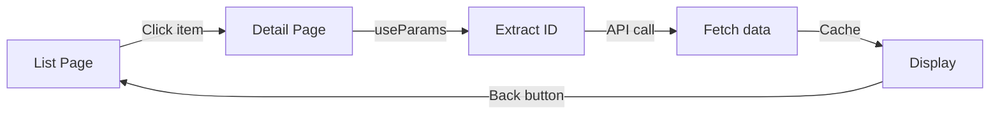
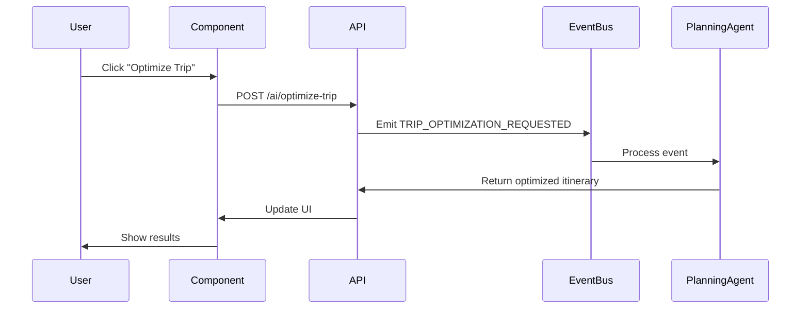

# Route → Component → Data Mapping

**Date:** December 20, 2024  
**Status:** Complete technical specification  
**Total Routes:** 28 (7 core + 21 advanced)

---

## 🎯 Mapping Structure

For each route, we specify:
1. **Route** - URL pattern
2. **Component** - React component name
3. **Page Type** - Layout/template
4. **Data Sources** - Supabase tables
5. **API Calls** - Server endpoints
6. **Auth Required** - Yes/No
7. **AI Agents** - Which agents are active

---

## 📊 Core Routes Mapping

### 1. `/explore` — Main Dashboard

```tsx
{
  route: '/explore',
  component: 'ExplorePage',
  pageType: 'dashboard',
  layout: 'MainLayout',
  auth: true,
  
  data: {
    tables: [
      'profiles',          // User info
      'trips',             // Recent trips
      'locations',         // Trending destinations
      'search_history',    // Recent searches
      'user_preferences'   // Personalization
    ],
    
    apis: [
      'GET /make-server/recommendations',
      'GET /make-server/trending-destinations',
      'GET /make-server/user-context'
    ]
  },
  
  aiAgents: [
    'DiscoveryAgent',
    'ProactiveAssistant'
  ],
  
  components: [
    'HeroSearch',
    'RecommendationsWidget',
    'RecentTripsWidget',
    'TrendingDestinationsGrid',
    'QuickActionsPanel'
  ]
}
```

**State Management:**
```tsx
const ExplorePage = () => {
  const { user } = useAuth();
  const { data: recommendations } = useRecommendations(user.id);
  const { data: trips } = useRecentTrips(user.id, 3);
  const { data: trending } = useTrending();
  
  return <ExploreLayout />;
};
```

---

### 2. `/trips` — Trip List

```tsx
{
  route: '/trips',
  component: 'TripsPage',
  pageType: 'list',
  layout: 'MainLayout',
  auth: true,
  
  data: {
    tables: [
      'trips',
      'trip_items',       // Item counts
      'trip_collaborators' // Shared trips
    ],
    
    apis: [
      'GET /make-server/trips?user_id={userId}',
      'POST /make-server/trips' // Create trip
    ],
    
    filters: [
      'status', // active, upcoming, past, draft
      'shared', // true/false
      'date_range'
    ],
    
    sorting: [
      'start_date',
      'created_at',
      'title'
    ]
  },
  
  aiAgents: [
    'PlanningAgent',
    'ProactiveAssistant'
  ],
  
  components: [
    'TripList',
    'TripCard',
    'FilterBar',
    'CreateTripButton',
    'EmptyState'
  ]
}
```

**State Management:**
```tsx
const TripsPage = () => {
  const { user } = useAuth();
  const [filters, setFilters] = useState({ status: 'active' });
  const { data: trips, isLoading } = useTrips(user.id, filters);
  
  return <TripsLayout trips={trips} />;
};
```

---

### 3. `/trip/:id` — Trip Detail

```tsx
{
  route: '/trip/:id',
  component: 'TripDetailPage',
  pageType: 'detail',
  layout: 'TripLayout',
  auth: true,
  
  params: {
    id: 'uuid'
  },
  
  data: {
    tables: [
      'trips',           // Trip metadata
      'trip_items',      // Itinerary
      'locations',       // Place details
      'trip_collaborators', // Team
      'trip_expenses'    // Budget summary
    ],
    
    apis: [
      'GET /make-server/trips/:id',
      'GET /make-server/trips/:id/items',
      'PUT /make-server/trips/:id',
      'DELETE /make-server/trips/:id'
    ]
  },
  
  aiAgents: [
    'PlanningAgent',
    'LocationScout',
    'LogisticsAgent',
    'ContextualConcierge'
  ],
  
  components: [
    'TripHeader',
    'ItineraryTimeline',
    'TripMap',
    'BudgetSummary',
    'CollaboratorList',
    'AISuggestionsPanel'
  ],
  
  tabs: [
    'overview', // default
    'plan',
    'map',
    'budget',
    'bookings',
    'share'
  ]
}
```

**State Management:**
```tsx
const TripDetailPage = () => {
  const { id } = useParams();
  const { data: trip } = useTrip(id);
  const { data: items } = useTripItems(id);
  const [activeTab, setActiveTab] = useState('overview');
  
  return <TripDetailLayout trip={trip} items={items} />;
};
```

---

### 4. `/chats` — Conversation List

```tsx
{
  route: '/chats',
  component: 'ChatsPage',
  pageType: 'list',
  layout: 'MainLayout',
  auth: true,
  
  data: {
    tables: [
      'conversations',
      'messages',        // Last message
      'profiles'         // Participant names
    ],
    
    apis: [
      'GET /make-server/conversations?user_id={userId}',
      'POST /make-server/conversations' // New chat
    ]
  },
  
  aiAgents: [],
  
  components: [
    'ConversationList',
    'ConversationItem',
    'SearchBar',
    'NewChatButton'
  ]
}
```

---

### 5. `/saved` — Collections

```tsx
{
  route: '/saved',
  component: 'SavedPage',
  pageType: 'grid',
  layout: 'MainLayout',
  auth: true,
  
  data: {
    tables: [
      'collections',
      'collection_items',
      'locations'
    ],
    
    apis: [
      'GET /make-server/collections?user_id={userId}',
      'GET /make-server/saved-locations?user_id={userId}'
    ]
  },
  
  aiAgents: [
    'DiscoveryAgent'
  ],
  
  components: [
    'CollectionGrid',
    'CollectionCard',
    'SavedLocationsList',
    'CreateCollectionButton'
  ],
  
  views: [
    'grid',  // default
    'list',
    'map'
  ]
}
```

---

### 6. `/concierge` — AI Assistant

```tsx
{
  route: '/concierge',
  component: 'ConciergePage',
  pageType: 'chat',
  layout: 'ChatLayout',
  auth: true,
  
  data: {
    tables: [
      'conversations',
      'messages',
      // Full user context loaded
    ],
    
    apis: [
      'POST /make-server/ai/chat',
      'GET /make-server/ai/context',
      'POST /make-server/ai/action'
    ]
  },
  
  aiAgents: [
    'DiscoveryAgent',
    'PlanningAgent',
    'LocationScout',
    'LogisticsAgent',
    'CollaborationEngine',
    'ProactiveAssistant'
  ],
  
  components: [
    'ChatInterface',
    'MessageList',
    'MessageInput',
    'SuggestedPrompts',
    'QuickActions',
    'ContextPanel'
  ]
}
```

**State Management:**
```tsx
const ConciergePage = () => {
  const { user } = useAuth();
  const [messages, setMessages] = useState([]);
  const { sendMessage, isLoading } = useAIChat();
  
  const handleSend = async (content) => {
    const response = await sendMessage({
      content,
      user_id: user.id,
      context: 'general'
    });
    setMessages([...messages, response]);
  };
  
  return <ChatInterface onSend={handleSend} />;
};
```

---

### 7. `/profile` — User Settings

```tsx
{
  route: '/profile',
  component: 'ProfilePage',
  pageType: 'form',
  layout: 'SettingsLayout',
  auth: true,
  
  data: {
    tables: [
      'profiles',
      'user_preferences',
      'user_sessions',
      'activity_logs'
    ],
    
    apis: [
      'GET /make-server/profile',
      'PUT /make-server/profile',
      'PUT /make-server/preferences'
    ]
  },
  
  aiAgents: [],
  
  components: [
    'ProfileForm',
    'PreferencesForm',
    'NotificationSettings',
    'PrivacySettings',
    'SessionList',
    'ActivityLog'
  ],
  
  sections: [
    'profile',       // Name, email, avatar
    'preferences',   // Travel preferences
    'notifications', // Email/push settings
    'privacy',       // Data & sharing
    'security',      // Password, 2FA
    'billing'        // Subscription
  ]
}
```

---

## 📊 Advanced Routes Mapping

### Trip Context Routes

#### `/trip/:id/plan` — Planning Mode

```tsx
{
  route: '/trip/:id/plan',
  component: 'TripPlanPage',
  pageType: 'planning',
  layout: 'TripLayout',
  auth: true,
  
  params: { id: 'uuid' },
  
  data: {
    tables: [
      'trips',
      'trip_items',
      'locations'
    ],
    
    apis: [
      'POST /make-server/ai/optimize-trip',
      'POST /make-server/ai/suggest-places',
      'POST /make-server/trips/:id/items'
    ]
  },
  
  aiAgents: [
    'PlanningAgent',     // Primary
    'LocationScout',
    'LogisticsAgent'
  ],
  
  components: [
    'DragDropItinerary',
    'AISuggestionsPanel',
    'TimelineView',
    'OptimizeButton'
  ]
}
```

---

#### `/trip/:id/map` — Map View

```tsx
{
  route: '/trip/:id/map',
  component: 'TripMapPage',
  pageType: 'map',
  layout: 'TripLayout',
  auth: true,
  
  params: { id: 'uuid' },
  
  data: {
    tables: [
      'trip_items',
      'locations'       // coordinates
    ],
    
    apis: [
      'GET /make-server/trips/:id/map-data',
      'POST /make-server/ai/nearby-places'
    ],
    
    external: [
      'Mapbox API',
      'Google Places API'
    ]
  },
  
  aiAgents: [
    'LocationScout',
    'PlanningAgent'
  ],
  
  components: [
    'InteractiveMap',
    'LocationPins',
    'RouteLines',
    'NearbyPlacesPanel'
  ]
}
```

---

#### `/trip/:id/budget` — Budget Tracker

```tsx
{
  route: '/trip/:id/budget',
  component: 'TripBudgetPage',
  pageType: 'budget',
  layout: 'TripLayout',
  auth: true,
  
  params: { id: 'uuid' },
  
  data: {
    tables: [
      'trip_expenses',
      'trip_collaborators' // split expenses
    ],
    
    apis: [
      'GET /make-server/trips/:id/expenses',
      'POST /make-server/trips/:id/expenses',
      'PUT /make-server/expenses/:id',
      'DELETE /make-server/expenses/:id'
    ]
  },
  
  aiAgents: [
    'LogisticsAgent',
    'ProactiveAssistant'
  ],
  
  components: [
    'ExpenseList',
    'ExpenseForm',
    'BudgetChart',
    'CategoryBreakdown',
    'SplitExpenseCalculator'
  ]
}
```

---

### Chat Context Routes

#### `/chats/:id` — Chat Detail

```tsx
{
  route: '/chats/:id',
  component: 'ChatDetailPage',
  pageType: 'chat',
  layout: 'ChatLayout',
  auth: true,
  
  params: { id: 'uuid' },
  
  data: {
    tables: [
      'conversations',
      'messages',
      'message_reactions',
      'message_attachments',
      'profiles'
    ],
    
    apis: [
      'GET /make-server/conversations/:id',
      'GET /make-server/conversations/:id/messages',
      'POST /make-server/messages',
      'PUT /make-server/messages/:id',
      'DELETE /make-server/messages/:id'
    ],
    
    realtime: {
      channel: 'conversation:{id}',
      events: ['new_message', 'message_edited', 'message_deleted', 'typing']
    }
  },
  
  aiAgents: [
    // Context-dependent (if AI participant)
  ],
  
  components: [
    'MessageThread',
    'MessageInput',
    'MessageReactions',
    'FileAttachments',
    'ConversationInfo'
  ]
}
```

---

### Collection Context Routes

#### `/saved/collections/:id` — Collection Detail

```tsx
{
  route: '/saved/collections/:id',
  component: 'CollectionDetailPage',
  pageType: 'collection',
  layout: 'MainLayout',
  auth: true,
  
  params: { id: 'uuid' },
  
  data: {
    tables: [
      'collections',
      'collection_items',
      'locations'
    ],
    
    apis: [
      'GET /make-server/collections/:id',
      'GET /make-server/collections/:id/items',
      'POST /make-server/collections/:id/items',
      'DELETE /make-server/collection-items/:id'
    ]
  },
  
  aiAgents: [
    'DiscoveryAgent'
  ],
  
  components: [
    'CollectionHeader',
    'LocationGrid',
    'LocationCard',
    'AddPlaceButton',
    'ShareButton',
    'MapPreview'
  ]
}
```

---

### Location Context Routes

#### `/location/:id` — Location Detail

```tsx
{
  route: '/location/:id',
  component: 'LocationDetailPage',
  pageType: 'location',
  layout: 'MainLayout',
  auth: false, // Public
  
  params: { id: 'uuid' },
  
  data: {
    tables: [
      'locations',
      'location_reviews',
      'location_photos',
      'profiles'        // reviewer info
    ],
    
    apis: [
      'GET /make-server/locations/:id',
      'GET /make-server/locations/:id/reviews',
      'POST /make-server/locations/:id/save',
      'POST /make-server/ai/similar-places'
    ]
  },
  
  aiAgents: [
    'LocationScout'
  ],
  
  components: [
    'LocationHeader',
    'PhotoGallery',
    'LocationInfo',
    'ReviewList',
    'SimilarPlaces',
    'SaveButton',
    'AddToTripButton'
  ]
}
```

---

## 📊 Data Flow Patterns

### Pattern 1: List → Detail



**Example:** `/trips` → `/trip/:id`

```tsx
// List page
<TripCard onClick={() => navigate(`/trip/${trip.id}`)} />

// Detail page
const { id } = useParams();
const { data: trip } = useTrip(id);
```

---

### Pattern 2: Contextual Navigation

```mermaid
graph TD
    A[Trip Detail] --> B{User Action}
    B -->|Plan| C[/trip/:id/plan]
    B -->|Map| D[/trip/:id/map]
    B -->|Budget| E[/trip/:id/budget]
    C --> A
    D --> A
    E --> A
```

**Example:** Trip tabs

```tsx
<TripDetailPage>
  <Tabs>
    <Tab to={`/trip/${id}`}>Overview</Tab>
    <Tab to={`/trip/${id}/plan`}>Plan</Tab>
    <Tab to={`/trip/${id}/map`}>Map</Tab>
  </Tabs>
  <Outlet />
</TripDetailPage>
```

---

### Pattern 3: AI-Assisted Actions



---

## 🗂️ Component Organization

### File Structure

```
src/
├── pages/
│   ├── ExplorePage.tsx
│   ├── TripsPage.tsx
│   ├── TripDetailPage.tsx
│   ├── ChatsPage.tsx
│   ├── SavedPage.tsx
│   ├── ConciergePage.tsx
│   └── ProfilePage.tsx
│
├── components/
│   ├── trips/
│   │   ├── TripCard.tsx
│   │   ├── TripList.tsx
│   │   ├── ItineraryTimeline.tsx
│   │   └── TripHeader.tsx
│   │
│   ├── chat/
│   │   ├── ChatInterface.tsx
│   │   ├── MessageList.tsx
│   │   └── MessageInput.tsx
│   │
│   ├── navigation/
│   │   ├── Sidebar.tsx
│   │   ├── TabBar.tsx
│   │   └── Breadcrumbs.tsx
│   │
│   └── shared/
│       ├── Button.tsx
│       ├── Card.tsx
│       └── Modal.tsx
│
├── layouts/
│   ├── MainLayout.tsx
│   ├── TripLayout.tsx
│   ├── ChatLayout.tsx
│   └── SettingsLayout.tsx
│
├── hooks/
│   ├── useTrips.ts
│   ├── useTrip.ts
│   ├── useAuth.ts
│   └── useAIChat.ts
│
└── api/
    ├── trips.ts
    ├── locations.ts
    ├── chats.ts
    └── ai.ts
```

---

## 🔗 Route → Component Summary Table

| Route | Component | Tables | AI Agents |
|-------|-----------|--------|-----------|
| `/explore` | ExplorePage | profiles, trips, locations | Discovery, Proactive |
| `/trips` | TripsPage | trips, trip_items | Planning, Proactive |
| `/trip/:id` | TripDetailPage | trips, trip_items, locations | Planning, Scout, Logistics |
| `/trip/:id/plan` | TripPlanPage | trips, trip_items | Planning, Scout |
| `/trip/:id/map` | TripMapPage | trip_items, locations | Scout, Planning |
| `/trip/:id/budget` | TripBudgetPage | trip_expenses | Logistics, Proactive |
| `/chats` | ChatsPage | conversations, messages | - |
| `/chats/:id` | ChatDetailPage | conversations, messages | Context-dependent |
| `/saved` | SavedPage | collections, locations | Discovery |
| `/saved/collections/:id` | CollectionDetailPage | collections, collection_items | Discovery |
| `/concierge` | ConciergePage | All tables | All 6 agents |
| `/location/:id` | LocationDetailPage | locations, reviews, photos | Scout |
| `/profile` | ProfilePage | profiles, preferences | - |

---

**Status:** ✅ Route mapping complete  
**Next:** See `06-ai-agent-placement.md` for AI integration
