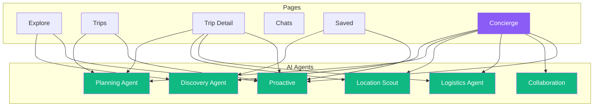

# AI Agent Placement Per Page

**Date:** December 20, 2024  
**Status:** Complete integration spec  
**Total Agents:** 6

---

## 🤖 AI Agent Overview

### The 6 AI Agents

| Agent | Primary Role | Trigger Events |
|-------|--------------|----------------|
| **Discovery Agent** | Destination recommendations | SEARCH, VIEW_LOCATION, BROWSE |
| **Planning Agent** | Trip optimization & planning | CREATE_TRIP, EDIT_ITINERARY, OPTIMIZE |
| **Location Scout** | Place discovery & details | VIEW_LOCATION, SEARCH_NEARBY |
| **Logistics Agent** | Bookings & timing | ADD_BOOKING, BUDGET_UPDATE |
| **Collaboration Engine** | Team coordination | INVITE_COLLABORATOR, SHARE |
| **Proactive Assistant** | Smart suggestions | ALL_EVENTS |

---

## 📊 Agent Placement Matrix



---

## 📋 Page-by-Page Agent Placement

### 1. `/explore` — Main Dashboard

**Active Agents:**
- 🌟 Discovery Agent (primary)
- 🔔 Proactive Assistant

**Agent Placement:**

```tsx
<ExplorePage>
  {/* Discovery Agent - Recommendations */}
  <RecommendationsWidget>
    <AIRecommendations agent="discovery" />
  </RecommendationsWidget>
  
  {/* Proactive Assistant - Floating */}
  <ProactiveAssistant 
    position="bottom-right"
    context="explore"
  />
</ExplorePage>
```

**Discovery Agent UI:**
- Location: Hero section (below search)
- Format: Card grid (4-6 destinations)
- Trigger: Page load, user preferences
- Update: Real-time based on interactions

**Proactive Assistant UI:**
- Location: Floating button (bottom-right)
- Format: Notification dot when active
- Trigger: User inactivity, context change
- Content: "Based on your searches..." suggestions

**Event Bus Messages:**

```typescript
// Discovery Agent listens for:
- USER_SEARCHED
- LOCATION_VIEWED
- PREFERENCE_UPDATED

// Sends:
- RECOMMENDATIONS_GENERATED
- DESTINATION_SUGGESTED
```

---

### 2. `/trips` — Trip List

**Active Agents:**
- 📅 Planning Agent
- 🔔 Proactive Assistant

**Agent Placement:**

```tsx
<TripsPage>
  {/* Planning Agent - Quick Actions */}
  <QuickActionsPanel>
    <AIButton onClick={createTripWithAI}>
      Create Trip with AI
    </AIButton>
  </QuickActionsPanel>
  
  {/* Proactive Assistant - Trip Prep */}
  <ProactiveSuggestions>
    {upcomingTrips.map(trip => (
      <TripPrepCard 
        key={trip.id}
        trip={trip}
        suggestions={getAISuggestions(trip)}
      />
    ))}
  </ProactiveSuggestions>
</TripsPage>
```

**Planning Agent UI:**
- Location: "Create Trip" button enhanced
- Format: Modal wizard with AI assistance
- Trigger: Click "Create with AI"
- Flow: Destination → Dates → Preferences → Generate

**Proactive Assistant UI:**
- Location: Above trip list (if upcoming trips)
- Format: Notification cards
- Trigger: 7 days before trip start
- Content: "Pack list ready", "Weather update", etc.

**Event Bus Messages:**

```typescript
// Planning Agent listens for:
- TRIP_CREATION_STARTED
- TRIP_UPDATED
- ITINERARY_CHANGED

// Sends:
- TRIP_GENERATED
- OPTIMIZATION_SUGGESTED
```

---

### 3. `/trip/:id` — Trip Detail

**Active Agents:**
- 📅 Planning Agent (primary)
- 📍 Location Scout
- 🎯 Logistics Agent
- 🔔 Proactive Assistant

**Agent Placement:**

```tsx
<TripDetailPage>
  {/* Right Sidebar - AI Suggestions Panel */}
  <AISuggestionsPanel>
    {/* Planning Agent */}
    <Section title="Optimize Itinerary">
      <OptimizationSuggestions />
    </Section>
    
    {/* Location Scout */}
    <Section title="Nearby Places">
      <NearbyPlaces agent="location-scout" />
    </Section>
    
    {/* Logistics Agent */}
    <Section title="Travel Tips">
      <LogisticsSuggestions />
    </Section>
  </AISuggestionsPanel>
  
  {/* Floating AI Chat Button */}
  <FloatingChatButton 
    onClick={() => navigate(`/trip/${id}/chat`)}
  >
    Ask AI about this trip
  </FloatingChatButton>
  
  {/* Proactive Alerts */}
  <ProactiveAlerts trip={trip} />
</TripDetailPage>
```

**Planning Agent UI:**
- Location: Right sidebar panel
- Format: Collapsible sections
- Trigger: Itinerary changes
- Actions: "Optimize route", "Suggest missing items"

**Location Scout UI:**
- Location: Right sidebar panel (below planning)
- Format: Mini cards with images
- Trigger: Location added, map viewed
- Actions: "Add to trip", "View details"

**Logistics Agent UI:**
- Location: Right sidebar panel (bottom)
- Format: Text list with icons
- Trigger: Dates set, locations added
- Content: Travel times, booking reminders, weather

**Proactive Assistant UI:**
- Location: Top banner (dismissible)
- Format: Alert notification
- Trigger: Important updates
- Content: "Flight price dropped", "Weather alert"

**Event Bus Messages:**

```typescript
// All agents listen for:
- TRIP_ITEM_ADDED
- TRIP_ITEM_REMOVED
- TRIP_ITEM_REORDERED
- TRIP_DATES_CHANGED

// Planning Agent sends:
- OPTIMIZATION_READY
- ROUTE_IMPROVED

// Location Scout sends:
- NEARBY_PLACES_FOUND
- PLACE_RECOMMENDED

// Logistics Agent sends:
- BOOKING_REMINDER
- TRAVEL_TIME_CALCULATED
```

---

### 4. `/trip/:id/plan` — Planning Mode

**Active Agents:**
- 📅 Planning Agent (primary)
- 📍 Location Scout

**Agent Placement:**

```tsx
<TripPlanPage>
  {/* Left Panel - Drag-Drop Itinerary */}
  <ItineraryEditor>
    <DragDropList items={tripItems} />
  </ItineraryEditor>
  
  {/* Right Panel - AI Assist */}
  <PlanningAssistPanel>
    {/* Planning Agent - Primary UI */}
    <AIControls>
      <Button onClick={optimizeRoute}>
        Optimize Route
      </Button>
      <Button onClick={suggestPlaces}>
        Suggest Places
      </Button>
      <Button onClick={fixTiming}>
        Fix Timing Issues
      </Button>
    </AIControls>
    
    {/* Location Scout - Search */}
    <PlaceSearch 
      agent="location-scout"
      onSelect={addToTrip}
    />
    
    {/* AI Chat Mini */}
    <MiniChat 
      placeholder="Ask about this itinerary..."
    />
  </PlanningAssistPanel>
</TripPlanPage>
```

**Planning Agent UI:**
- Location: Right panel (prominent)
- Format: Button controls + live suggestions
- Trigger: Every itinerary change
- Feedback: Real-time optimization scores

**Location Scout UI:**
- Location: Right panel search box
- Format: Autocomplete with AI suggestions
- Trigger: User typing
- Results: Ranked by relevance + AI confidence

---

### 5. `/trip/:id/map` — Map View

**Active Agents:**
- 📍 Location Scout (primary)
- 📅 Planning Agent

**Agent Placement:**

```tsx
<TripMapPage>
  {/* Main Map */}
  <InteractiveMap>
    <LocationPins items={tripItems} />
    <RouteLines />
  </InteractiveMap>
  
  {/* Bottom Panel - Nearby Places (Location Scout) */}
  <NearbyPlacesPanel>
    <AIRecommendations 
      agent="location-scout"
      context="map"
      center={mapCenter}
    />
  </NearbyPlacesPanel>
  
  {/* Floating Controls */}
  <MapControls>
    <Button onClick={findNearby}>
      Find nearby attractions
    </Button>
    <Button onClick={optimizeRoute}>
      Optimize route
    </Button>
  </MapControls>
</TripMapPage>
```

**Location Scout UI:**
- Location: Bottom drawer (slides up)
- Format: Horizontal scroll cards
- Trigger: Map pan, zoom, pin click
- Actions: "Add to trip", "View details"

**Planning Agent UI:**
- Location: Floating button
- Format: Optimize route overlay
- Trigger: Manual click
- Result: Animated route reordering

---

### 6. `/trip/:id/budget` — Budget Tracker

**Active Agents:**
- 🎯 Logistics Agent (primary)
- 🔔 Proactive Assistant

**Agent Placement:**

```tsx
<TripBudgetPage>
  {/* Main Content */}
  <ExpenseList expenses={expenses} />
  
  {/* Logistics Agent - Cost Predictions */}
  <BudgetInsights>
    <AIInsight agent="logistics">
      <p>Estimated total: ${predictedTotal}</p>
      <p>Based on similar trips</p>
    </AIInsight>
  </BudgetInsights>
  
  {/* Proactive Assistant - Alerts */}
  {isOverBudget && (
    <ProactiveAlert>
      You're ${overAmount} over budget.
      <Button>See suggestions to save</Button>
    </ProactiveAlert>
  )}
</TripBudgetPage>
```

**Logistics Agent UI:**
- Location: Top widget (above expense list)
- Format: Insight card with predictions
- Trigger: Budget changes
- Content: Cost estimates, currency conversion

**Proactive Assistant UI:**
- Location: Alert banner
- Format: Warning/info notification
- Trigger: Budget threshold exceeded
- Actions: "See cheaper alternatives"

---

### 7. `/chats` — Conversation List

**Active Agents:**
- None (list view)

**Agent Placement:**

```tsx
<ChatsPage>
  {/* Simple list, no AI */}
  <ConversationList conversations={conversations} />
  
  {/* New AI Chat Button */}
  <NewChatButton onClick={() => navigate('/concierge')}>
    Start AI Chat
  </NewChatButton>
</ChatsPage>
```

---

### 8. `/chats/:id` — Chat Detail

**Active Agents:**
- Context-dependent (if AI participant)

**Agent Placement:**

```tsx
<ChatDetailPage>
  <MessageThread messages={messages} />
  
  {isAIChat && (
    <AITypingIndicator>
      AI is thinking...
    </AITypingIndicator>
  )}
  
  <MessageInput 
    placeholder={
      isAIChat 
        ? "Ask anything..." 
        : "Type a message..."
    }
  />
</ChatDetailPage>
```

**AI Integration:**
- Location: Inline in chat thread
- Format: Standard messages with AI badge
- Trigger: User sends message
- Response: Streamed text

---

### 9. `/saved` — Collections

**Active Agents:**
- 🌟 Discovery Agent
- 🔔 Proactive Assistant

**Agent Placement:**

```tsx
<SavedPage>
  {/* Main Content */}
  <CollectionGrid collections={collections} />
  
  {/* Discovery Agent - Similar Places */}
  <SimilarPlacesWidget>
    <AIRecommendations 
      agent="discovery"
      based on={savedLocations}
    />
  </SimilarPlacesWidget>
  
  {/* Proactive - Trip Suggestions */}
  <ProactiveSuggestions>
    <AICard>
      You have 5 places saved in Paris.
      <Button>Create a Paris trip?</Button>
    </AICard>
  </ProactiveSuggestions>
</SavedPage>
```

**Discovery Agent UI:**
- Location: Bottom of page
- Format: "You might also like..." cards
- Trigger: View saved places
- Actions: "Save", "Add to collection"

**Proactive Assistant UI:**
- Location: Top banner
- Format: Suggestion card
- Trigger: Pattern detection (e.g., 5+ saves in one city)
- Action: Quick create trip from saved

---

### 10. `/concierge` — AI Assistant (All Agents)

**Active Agents:**
- 🌟 Discovery Agent
- 📅 Planning Agent
- 📍 Location Scout
- 🎯 Logistics Agent
- 🤝 Collaboration Engine
- 🔔 Proactive Assistant

**Agent Placement:**

```tsx
<ConciergePage>
  {/* Main Chat Interface */}
  <ChatInterface>
    <MessageList messages={messages} />
    
    {/* Agent Indicator */}
    <ActiveAgentIndicator agents={activeAgents} />
    
    <MessageInput 
      placeholder="Ask me anything about your trip..."
    />
  </ChatInterface>
  
  {/* Suggested Prompts */}
  <SuggestedPrompts>
    <PromptCard onClick={send}>
      Plan a 3-day trip to Tokyo
    </PromptCard>
    <PromptCard onClick={send}>
      Find restaurants near my hotel
    </PromptCard>
    <PromptCard onClick={send}>
      Optimize my Paris itinerary
    </PromptCard>
  </SuggestedPrompts>
  
  {/* Quick Actions */}
  <QuickActions>
    <ActionButton icon={Plane}>
      Create Trip
    </ActionButton>
    <ActionButton icon={MapPin}>
      Find Places
    </ActionButton>
    <ActionButton icon={DollarSign}>
      Track Budget
    </ActionButton>
  </QuickActions>
</ConciergePage>
```

**All Agents Coordination:**
- Location: Main chat area
- Format: Natural language conversation
- Trigger: User message
- Routing: Event bus determines which agent(s) respond
- Response: Coordinated via Collaboration Engine

**Agent Selection Logic:**

```typescript
const routeMessage = (content: string) => {
  const intent = detectIntent(content);
  
  switch (intent) {
    case 'SEARCH_DESTINATION':
      return ['DiscoveryAgent'];
    
    case 'PLAN_TRIP':
      return ['PlanningAgent', 'LocationScout'];
    
    case 'OPTIMIZE_ITINERARY':
      return ['PlanningAgent', 'LogisticsAgent'];
    
    case 'FIND_PLACES':
      return ['LocationScout', 'DiscoveryAgent'];
    
    case 'BOOKING_HELP':
      return ['LogisticsAgent'];
    
    case 'COLLABORATION':
      return ['CollaborationEngine'];
    
    default:
      return ['ProactiveAssistant']; // Fallback
  }
};
```

---

## 🎨 AI UI Components

### 1. AI Suggestions Panel

```tsx
<AISuggestionsPanel>
  <PanelHeader>
    <Sparkles /> AI Suggestions
  </PanelHeader>
  
  {suggestions.map(suggestion => (
    <SuggestionCard key={suggestion.id}>
      <Badge>{suggestion.agent}</Badge>
      <Title>{suggestion.title}</Title>
      <Description>{suggestion.description}</Description>
      <Actions>
        <Button>Apply</Button>
        <Button variant="ghost">Dismiss</Button>
      </Actions>
    </SuggestionCard>
  ))}
</AISuggestionsPanel>
```

---

### 2. Floating AI Button

```tsx
<FloatingAIButton 
  position="bottom-right"
  hasNotification={hasActivesuggestions}
>
  <Sparkles />
  {hasNotification && <NotificationDot />}
</FloatingAIButton>
```

---

### 3. Proactive Alert Banner

```tsx
<ProactiveAlert severity="info">
  <Icon component={AlertCircle} />
  <Content>
    <Title>Proactive Suggestion</Title>
    <Message>{suggestion.message}</Message>
  </Content>
  <Actions>
    <Button onClick={apply}>Apply</Button>
    <IconButton onClick={dismiss}>
      <X />
    </IconButton>
  </Actions>
</ProactiveAlert>
```

---

### 4. Agent Badge

```tsx
<AgentBadge agent="planning">
  <BotIcon />
  <span>Planning Agent</span>
</AgentBadge>
```

**Agent Colors:**
- Discovery: Green (#10b981)
- Planning: Blue (#3b82f6)
- Location Scout: Purple (#8b5cf6)
- Logistics: Orange (#f59e0b)
- Collaboration: Pink (#ec4899)
- Proactive: Indigo (#6366f1)

---

## 📊 Agent Activity Dashboard

### Real-Time Agent Status

```tsx
<AgentStatus>
  {agents.map(agent => (
    <AgentIndicator key={agent.id}>
      <AgentIcon agent={agent.type} />
      <AgentName>{agent.name}</AgentName>
      <Status active={agent.isActive}>
        {agent.isActive ? 'Active' : 'Idle'}
      </Status>
      <LastAction>{agent.lastAction}</LastAction>
    </AgentIndicator>
  ))}
</AgentStatus>
```

**Shows:**
- Which agents are currently processing
- Last action each agent performed
- Processing queue length

---

## 🎯 Agent Placement Summary

| Page | Primary Agent | Secondary Agents | UI Location |
|------|---------------|------------------|-------------|
| `/explore` | Discovery | Proactive | Hero + floating |
| `/trips` | Planning | Proactive | Quick actions |
| `/trip/:id` | Planning | Scout, Logistics, Proactive | Right sidebar |
| `/trip/:id/plan` | Planning | Scout | Right panel |
| `/trip/:id/map` | Scout | Planning | Bottom drawer |
| `/trip/:id/budget` | Logistics | Proactive | Top widget |
| `/saved` | Discovery | Proactive | Bottom section |
| `/concierge` | All 6 | - | Main interface |
| `/location/:id` | Scout | Discovery | Right sidebar |

---

**Status:** ✅ AI placement spec complete  
**Next:** See `07-user-journeys.md` for user flow diagrams
