# User Journeys — Flow Diagrams

**Date:** December 20, 2024  
**Status:** Complete user flow documentation  
**Total Journeys:** 8

---

## 🎯 Journey Overview

| Journey | Entry | Exit | AI Involvement |
|---------|-------|------|----------------|
| 1. Discovery | `/explore` | `/location/:id` | High |
| 2. Trip Planning | `/trips` | `/trip/:id` | High |
| 3. AI-Assisted Planning | `/concierge` | `/trip/:id/plan` | Very High |
| 4. Trip Optimization | `/trip/:id` | `/trip/:id/plan` | High |
| 5. Budget Management | `/trip/:id` | `/trip/:id/budget` | Medium |
| 6. Collaboration | `/trip/:id` | `/trip/:id/share` | Low |
| 7. Place Discovery | `/explore` | `/saved` | High |
| 8. Chat with AI | `/concierge` | Various | Very High |

---

## 📊 Journey 1: Discovery → Save Place

**Goal:** User discovers and saves a destination


**Steps:**
1. User lands on `/explore`
2. **Discovery Agent** shows personalized recommendations
3. User searches OR browses featured
4. Click destination → `/location/:id`
5. View details (photos, reviews, AI insights)
6. Save to collection OR add to trip
7. **Discovery Agent** suggests similar places
8. User continues exploring or views collection

**AI Touchpoints:**
- Personalized recommendations (Discovery Agent)
- AI-ranked search results (Discovery Agent)
- Similar places suggestions (Discovery Agent)

**Duration:** 2-5 minutes

---

## 📊 Journey 2: Manual Trip Planning

**Goal:** User creates and populates a trip manually

```mermaid
flowchart TD
    Start([User Opens App]) --> Trips["/trips<br/>My Trips"]
    
    Trips --> NewTrip["Click 'New Trip'"]
    NewTrip --> TripForm["Fill trip details<br/>(title, dates, destination)"]
    TripForm --> CreateTrip["Create trip<br/>(Planning Agent observes)"]
    
    CreateTrip --> TripDetail["/trip/:id<br/>Empty itinerary"]
    
    TripDetail --> AddItems{Add Items}
    
    AddItems -->|Search Places| SearchPlace["Search locations<br/>(Location Scout)"]
    AddItems -->|From Saved| SelectSaved["Select from /saved"]
    AddItems -->|Browse| BrowseNearby["Browse nearby<br/>(Location Scout)"]
    
    SearchPlace --> AddToTrip["Add to itinerary"]
    SelectSaved --> AddToTrip
    BrowseNearby --> AddToTrip
    
    AddToTrip --> Reorder["Drag to reorder<br/>(Planning Agent suggests optimization)"]
    
    Reorder --> Review{Review}
    
    Review -->|Looks Good| Done["✅ Trip ready"]
    Review -->|Need Help| AIPlan["/trip/:id/plan<br/>Switch to AI mode"]
    
    Done --> Share["/trip/:id/share<br/>Optional: Share with friends"]
    
    style Trips fill:#6366f1,color:#fff
    style TripDetail fill:#8b5cf6,color:#fff
    style Done fill:#10b981,color:#fff
```



**Steps:**
1. Navigate to `/trips`
2. Click "New Trip" button
3. Fill form (title, dates, destination)
4. Create trip → redirects to `/trip/:id`
5. Add locations (search, saved, or browse)
6. **Location Scout** suggests relevant places
7. Drag-drop to reorder items
8. **Planning Agent** suggests optimizations
9. Review and finalize
10. Optionally share with collaborators

**AI Touchpoints:**
- Place suggestions (Location Scout)
- Route optimization prompts (Planning Agent)
- Travel time calculations (Logistics Agent)

**Duration:** 10-20 minutes

---

## 📊 Journey 3: AI-Assisted Trip Planning

**Goal:** User creates trip with AI help end-to-end


**Steps:**
1. User goes to `/concierge`
2. Type prompt: "Plan a 3-day trip to Paris"
3. **Event Bus** routes to Planning + Discovery + Scout agents
4. AI generates complete itinerary (15-20 seconds)
5. User reviews AI suggestions
6. Accept, modify, or regenerate
7. Trip created → redirect to `/trip/:id`
8. Pre-populated with AI suggestions
9. User can manually adjust in `/trip/:id/plan`
10. **Planning Agent** further optimizes if requested

**AI Touchpoints:**
- Natural language understanding (all agents)
- Itinerary generation (Planning Agent)
- Place selection (Discovery Agent + Scout)
- Optimization (Planning Agent)

**Duration:** 5-10 minutes

---

## 📊 Journey 4: Trip Optimization

**Goal:** User optimizes existing trip for better routing


**Steps:**
1. User views trip at `/trip/:id`
2. Notices inefficient routing (highlighted by **Proactive Assistant**)
3. Chooses optimization path:
   - Quick: Click "Optimize" button
   - Manual: Switch to planning mode
   - AI Chat: Ask AI for help
4. **Planning Agent** calculates optimal route
5. Shows before/after comparison
6. User reviews and accepts/rejects
7. If accepted, itinerary reordered
8. User can view on map or continue editing

**AI Touchpoints:**
- Route analysis (Planning Agent)
- Travel time calculations (Logistics Agent)
- Geographic clustering (Planning Agent)
- Visual route display (Location Scout)

**Duration:** 2-5 minutes

---

## 📊 Journey 5: Budget Tracking

**Goal:** User tracks expenses during/after trip


**Steps:**
1. User navigates to `/trip/:id`
2. Clicks "Budget" tab → `/trip/:id/budget`
3. Adds expenses with details
4. **Logistics Agent** handles currency conversion
5. Real-time budget status updated
6. If over budget, **Proactive Assistant** alerts
7. AI suggests cost-saving alternatives
8. User views category breakdown
9. Export to CSV if needed

**AI Touchpoints:**
- Currency conversion (Logistics Agent)
- Budget predictions (Logistics Agent)
- Overspending alerts (Proactive Assistant)
- Cost comparisons (Logistics Agent)

**Duration:** Ongoing (throughout trip)

---

## 📊 Journey 6: Trip Collaboration

**Goal:** User invites friends to collaborate on trip

```mermaid
flowchart TD
    Start([User Planning Trip]) --> TripDetail["/trip/:id<br/>Trip detail"]
    
    TripDetail --> ShareButton["Click 'Share' button"]
    
    ShareButton --> SharePage["/trip/:id/share<br/>Collaboration setup"]
    
    SharePage --> InviteOptions{Invite Method}
    
    InviteOptions -->|Email| EmailForm["Enter email addresses"]
    InviteOptions -->|Link| GenerateLink["Generate share link"]
    
    EmailForm --> SetPermissions["Set permissions:<br/>- View only<br/>- Can edit<br/>- Full access"]
    GenerateLink --> SetPermissions
    
    SetPermissions --> SendInvites["Send invitations<br/>(Collaboration Engine)"]
    
    SendInvites --> CollabEngine["Collaboration Engine:<br/>- Creates notifications<br/>- Tracks invites<br/>- Manages permissions"]
    
    CollabEngine --> WaitResponse["Wait for responses"]
    
    WaitResponse --> AcceptDecline{Invitees Respond}
    
    AcceptDecline -->|Accepted| AddCollaborator["✅ Add to trip_collaborators"]
    AcceptDecline -->|Declined| NotifyOwner["Notify trip owner"]
    
    AddCollaborator --> ActivityFeed["Activity feed shows:<br/>'User joined the trip'"]
    
    ActivityFeed --> Collaboration["Collaborators can now:<br/>- View itinerary<br/>- Add suggestions<br/>- Edit items (if permitted)<br/>- Add expenses"]
    
    Collaboration --> SyncUpdates["Collaboration Engine:<br/>- Syncs changes<br/>- Notifies collaborators<br/>- Resolves conflicts"]
    
    SyncUpdates --> Done["✅ Collaborative trip active"]
    
    style SharePage fill:#6366f1,color:#fff
    style Collaboration fill:#ec4899,color:#fff
    style Done fill:#10b981,color:#fff
```



**Steps:**
1. User at `/trip/:id` clicks "Share"
2. Navigate to `/trip/:id/share`
3. Choose invite method (email or link)
4. Set permissions for collaborators
5. **Collaboration Engine** sends invites
6. Track responses (accepted/declined)
7. Add collaborators to `trip_collaborators` table
8. Activity feed shows updates
9. Collaborators can interact based on permissions
10. **Collaboration Engine** syncs all changes real-time

**AI Touchpoints:**
- Invitation management (Collaboration Engine)
- Activity tracking (Collaboration Engine)
- Conflict resolution (Collaboration Engine)
- Real-time sync (Collaboration Engine)

**Duration:** 5 minutes (initial setup), ongoing (collaboration)

---

## 📊 Journey 7: Place Discovery & Collection

**Goal:** User discovers and organizes places into collections


**Steps:**
1. User browses `/explore`
2. **Discovery Agent** shows personalized recommendations
3. User searches, filters, or follows AI suggestions
4. Click place → `/location/:id`
5. View details, photos, reviews
6. Click "Save" button
7. Choose collection (existing or new)
8. Place saved to `collection_items`
9. **Discovery Agent** suggests similar places
10. User can view collection, create trip, or continue browsing
11. From `/saved/collections/:id`, can view map or share
12. Can create trip from entire collection (**Planning Agent** assists)

**AI Touchpoints:**
- Personalized recommendations (Discovery Agent)
- Similar place suggestions (Discovery Agent)
- Trip generation from collection (Planning Agent)

**Duration:** 5-15 minutes (per session)

---

## 📊 Journey 8: Open-Ended AI Chat

**Goal:** User has general conversation with AI for travel help

```mermaid
flowchart TD
    Start([User Needs Help]) --> Concierge["/concierge<br/>AI Assistant"]
    
    Concierge --> Interface["Chat interface<br/>All 6 agents available"]
    
    Interface --> UserInput["User types question/request"]
    
    UserInput --> EventBus["Event Bus:<br/>Route to appropriate agent(s)"]
    
    EventBus --> IntentDetection["Intent detection:<br/>What does user want?"]
    
    IntentDetection --> AgentSelection{Select Agent(s)}
    
    AgentSelection -->|Discovery| Discovery["Discovery Agent:<br/>'Where should I go?'"]
    AgentSelection -->|Planning| Planning["Planning Agent:<br/>'Plan my trip'"]
    AgentSelection -->|Scout| Scout["Location Scout:<br/>'Find restaurants'"]
    AgentSelection -->|Logistics| Logistics["Logistics Agent:<br/>'Book flight'"]
    AgentSelection -->|Collab| Collab["Collaboration Engine:<br/>'Share with friends'"]
    AgentSelection -->|Proactive| Proactive["Proactive Assistant:<br/>'General help'"]
    
    Discovery --> Response["AI response"]
    Planning --> Response
    Scout --> Response
    Logistics --> Response
    Collab --> Response
    Proactive --> Response
    
    Response --> Actions{Response Type}
    
    Actions -->|Information| DisplayInfo["Display answer"]
    Actions -->|Action| QuickAction["Quick action buttons:<br/>- Create trip<br/>- Save place<br/>- View on map"]
    Actions -->|Navigation| Navigate["Navigate to page:<br/>- /trip/:id<br/>- /location/:id<br/>- etc."]
    
    DisplayInfo --> FollowUp["User follow-up question"]
    QuickAction --> Execute["Execute action"]
    Navigate --> PageTransition["Go to page<br/>(context preserved)"]
    
    Execute --> DisplayInfo
    PageTransition --> ContextualHelp["AI available on new page<br/>(contextual mode)"]
    
    FollowUp --> UserInput
    ContextualHelp --> Done["✅ Task complete"]
    
    style Concierge fill:#8b5cf6,color:#fff
    style Response fill:#6366f1,color:#fff
    style Done fill:#10b981,color:#fff
```

**Steps:**
1. User opens `/concierge`
2. All 6 AI agents available via **Event Bus**
3. User types question/request
4. **Event Bus** detects intent
5. Routes to appropriate agent(s):
   - "Where should I go?" → Discovery Agent
   - "Plan a trip" → Planning Agent
   - "Find restaurants" → Location Scout
   - "Book a flight" → Logistics Agent
   - "Share with friends" → Collaboration Engine
   - General help → Proactive Assistant
6. Agent(s) generate response
7. Response can be:
   - Information (display answer)
   - Action (quick action buttons)
   - Navigation (go to relevant page)
8. User can follow up with more questions
9. If navigating away, AI context preserved
10. Contextual AI available on destination page

**AI Touchpoints:**
- Natural language understanding (all agents)
- Intent detection (Event Bus)
- Multi-agent coordination (Collaboration Engine)
- Context preservation (Proactive Assistant)

**Duration:** Variable (5-30 minutes)

---

## 🎨 Journey Patterns Summary

### Pattern A: Browse → Action
- Explore → Location → Save/Add
- Used in: Journeys 1, 7

### Pattern B: Create → Populate → Optimize
- New trip → Add items → AI optimize
- Used in: Journeys 2, 4

### Pattern C: AI-First Generation
- Prompt → AI generates → User refines
- Used in: Journeys 3, 8

### Pattern D: Contextual Actions
- View detail → Take action → Navigate
- Used in: Journeys 5, 6

---

## 📊 Journey Metrics

| Journey | Avg Duration | AI Interactions | Success Rate |
|---------|--------------|-----------------|--------------|
| 1. Discovery | 3 min | 2-3 | High |
| 2. Manual Planning | 15 min | 3-5 | Medium |
| 3. AI Planning | 7 min | 5-10 | Very High |
| 4. Optimization | 3 min | 2-4 | High |
| 5. Budget | Ongoing | 2-3 | High |
| 6. Collaboration | 5 min | 1-2 | High |
| 7. Collection | 10 min | 3-6 | High |
| 8. AI Chat | 10 min | 5-15 | Very High |

---

**Status:** ✅ User journeys complete  
**Total Diagrams:** 8 Mermaid flowcharts  
**Total AI Touchpoints:** 47 across all journeys
