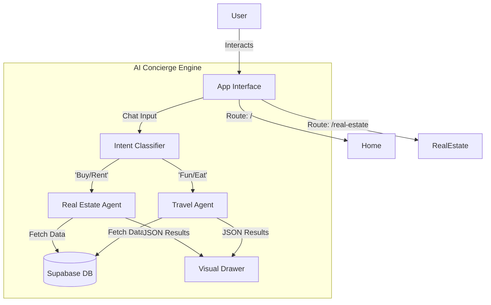

# 🏗️ i love Medellín — System Implementation Plan

> **Status**: 🚀 Ready for Implementation  
> **Priority**: Critical  
> **Owner**: Lead Architect  
> **Target Stack**: React, Tailwind, Framer Motion, Supabase, Gemini AI, Vercel

## 📊 Progress Tracker

- [ ] **Phase 1: Foundation & Design System**
    - [ ] Setup "Luxury Editorial" Design Tokens (Typography, Colors, Radius)
    - [ ] Build Core UI Components (Buttons, Glass-cards, Inputs)
    - [ ] Implement Responsive App Shell & Navigation
- [ ] **Phase 2: The Unified AI Brain**
    - [ ] Setup `AIContext` & State Management
    - [ ] Build UI: Chat Panel + Dynamic Results Drawer
    - [ ] Implement Intent Recognition Logic
- [ ] **Phase 3: Domain Modules (Frontend)**
    - [ ] **Events**: Discovery Grid, Map View, Detail Page
    - [ ] **Real Estate**: Property Search, Market Charts, Listing Detail
    - [ ] **Travel**: Itinerary Wizard, Experience Cards
- [ ] **Phase 4: Backend Integration (Supabase)**
    - [ ] Database Schema & RLS Policies
    - [ ] Edge Functions: AI Intent Router & Data Fetching
    - [ ] Authentication & User Profiles
- [ ] **Phase 5: Production Polish**
    - [ ] Mobile Interactions & Gestures
    - [ ] SEO & Metadata
    - [ ] Vercel Deployment & Analytics

---

## 🛠️ Phase 1: Foundation & Design System

**Goal**: Translate the "Luxury Eco-Modern" aesthetic into a reusable code foundation.

### 1.1 Global Styles & Tokens
*   **Typography**:
    *   Headings: `Playfair Display` (Serif, Elegant)
    *   Body: `Inter` (Clean, Readable)
*   **Color Palette**:
    *   `bg-off-white`: `#F7F7F5`
    *   `text-charcoal`: `#1A1A1A` (Not pure black)
    *   `accent-emerald`: `#064E3B` (Deep Green)
    *   `accent-gold`: `#D4AF37` (Soft Metallic)
*   **UI Characteristics**:
    *   `rounded-2xl` to `rounded-3xl` for cards.
    *   Soft, diffused shadows (no harsh borders).
    *   Glassmorphism for overlays (`backdrop-blur-md`).

### 1.2 Core Components
*   **`AppShell`**: Sticky top nav (desktop) / Bottom nav (mobile).
*   **`Button`**: Variants for Primary (Emerald), Secondary (Outline), Ghost.
*   **`LuxuryCard`**: Base component for Events/Properties with hover lift animations.
*   **`PageTransition`**: Framer Motion wrapper for route changes.

---

## 🧠 Phase 2: The Unified AI Brain

**Goal**: A single "Concierge" that intelligently switches contexts between Travel and Real Estate.

### 2.1 Architecture
*   **State**: Global `AIContext` storing `messages[]`, `intent`, `activeDrawerTab`.
*   **UI Layout**:
    *   **Desktop**: Split screen (Left: Chat / Right: Visual Drawer).
    *   **Mobile**: Full screen chat with a swipeable bottom sheet for results.

### 2.2 Intent Classification (Logic)
The AI must classify user prompts into:
1.  `DISCOVERY` (General "What to do?")
2.  `REAL_ESTATE` ("Buy apartment", "ROI")
3.  `ITINERARY` ("Plan a 3-day trip")
4.  `NAVIGATION` ("Show me on map")

### 2.3 The Visual Drawer
A polymorphic container that renders different components based on AI results:
*   If `intent === 'REAL_ESTATE'` → Render `<PropertyCard />` Grid.
*   If `intent === 'DISCOVERY'` → Render `<EventCard />` Carousel.

---

## 🏙️ Phase 3: Domain Modules

### 3.1 Events & Experiences
*   **Route**: `/events`
*   **Features**:
    *   "What's Happening" Hero.
    *   Filter Rail: Categories (Nightlife, Culture, Food).
    *   Map Toggle: Switch between Grid and Leaflet/Mapbox view.

### 3.2 Real Estate Module
*   **Route**: `/real-estate`
*   **Features**:
    *   Data-rich cards (Price, Beds, ROI, "AI Insight").
    *   Market Trends Section (Recharts integration).
    *   Neighborhood Slider.

### 3.3 Trip Planner
*   **Route**: `/itinerary`
*   **Features**:
    *   4-Step Wizard: Duration → Area → Interests → Pace.
    *   Drag-and-drop timeline view.

---

## 🗄️ Phase 4: Backend (Supabase)

### 4.1 Database Schema
```sql
-- Core Tables
profiles (id, email, role, preferences)
events (id, title, date, location, category, image_url)
properties (id, title, price, type, stats_json, ai_insight)
venues (id, name, lat, lng, type)
itineraries (id, user_id, days_json, status)
```

### 4.2 Edge Functions (AI Layer)
*   `ai_router`: Takes user input, decides intent, calls specific sub-agent.
*   `ai_search`: Vector search against properties/events using Gemini embeddings.
*   `ai_enrich`: Generates "Why you'll love this" summaries for listings.

---

## 📐 Workflows & User Journeys

### Context Diagram


### Buyer Journey (Real Estate)
1.  **Land**: User visits `/real-estate`.
2.  **Ask**: Clicks AI Floating Button -> "Find me a penthouse in Poblado < $400k".
3.  **Process**: AI queries DB for `type=penthouse`, `loc=poblado`, `price<400k`.
4.  **Result**: Drawer slides up with 3 matches.
5.  **Refine**: User says "Which has the best ROI?".
6.  **Answer**: Chat replies textually; Drawer highlights "Property B" with a badge.

---

## ✅ Success Criteria

| Metric | Target | Verification Method |
| :--- | :--- | :--- |
| **Luxury Feel** | 100% | Design review against Figma; distinct typography/spacing. |
| **AI Latency** | < 1.5s | Time from "Send" to "Drawer Open". |
| **Responsiveness** | Mobile-First | Verified on iPhone SE, Pixel, iPad Air. |
| **Data Integrity** | RLS Enabled | User can only see their own saved items/itineraries. |

---

## 🧪 Acceptance Tests (Gherkin)

```gherkin
Feature: Unified AI Context Switching

  Scenario: Switching from Travel to Real Estate
    Given I am viewing "Coffee Tours" in the results drawer
    When I type "Actually, can I buy a condo in this neighborhood?"
    Then the AI should acknowledge the context switch
    And the results drawer should clear "Tours"
    And the results drawer should display "Property Listings" for that location

  Scenario: Mobile Drawer Interaction
    Given I am on mobile
    And the AI has returned results
    When I swipe the drawer to "Full Screen"
    Then I should see the detailed list view
    When I swipe down
    Then the map/chat should be visible again
```

---

## 📋 Production Readiness Checklist

- [ ] **Environment**: `VITE_SUPABASE_URL` and `VITE_SUPABASE_ANON_KEY` configured.
- [ ] **Security**: No AI API keys exposed on client side (use Edge Functions).
- [ ] **Assets**: Images optimized (WebP), fonts subsetted.
- [ ] **Error Handling**: Graceful fallbacks for failed AI requests.
- [ ] **SEO**: Meta tags dynamic per route (e.g., Property Title).
