# Design Prompt: "Your Smart City" Section

**Date:** December 20, 2024  
**Component:** Smart City Discovery Section  
**Design System:** Premium AI Travel Platform  
**Tone:** Luxury · Calm · Editorial · Local Intelligence

---

## 🎯 Design Brief

Create a premium "Your Smart City" hero section that showcases local urban experiences through AI-powered discovery. The section introduces users to intelligent city exploration with a personal concierge feel.

---

## 📐 Layout Specification

### Grid Structure
- **Desktop (1440px):** Two-column layout (40% text / 60% visual)
- **Tablet (1024px):** Two-column balanced (50% / 50%)
- **Mobile (375px):** Single column, visual-first stack

### Visual Hierarchy
```
┌─────────────────────────────────────────────────────────┐
│                    Section Title                        │
│                  "Your Smart City"                      │
├──────────────────────┬──────────────────────────────────┤
│                      │                                  │
│  Left Column         │       Right Column               │
│  ────────────        │       ──────────────             │
│                      │                                  │
│  Headline:           │   ┌──────┐      ┌──────┐        │
│  "Discover your      │   │ Card │  👤  │ Card │        │
│   city differently"  │   │  1   │ Woman │  2   │        │
│                      │   └──────┘      └──────┘        │
│  Body Copy:          │        ┌──────┐                 │
│  Short paragraph     │        │ Card │                 │
│  about AI-powered    │        │  3   │                 │
│  local discovery     │        └──────┘                 │
│                      │   ┌──────┐      ┌──────┐        │
│  CTA:                │   │ Card │      │ Card │        │
│  "Explore now"       │   │  4   │      │  5   │        │
│                      │   └──────┘      └──────┘        │
│                      │        ┌──────┐                 │
│                      │        │ Card │                 │
│                      │        │  6   │                 │
│                      │        └──────┘                 │
│                      │                                  │
│                      │   ┌─────────────────────┐       │
│                      │   │ Chat Input Bar      │       │
│                      │   │ "Explore your city" │       │
│                      │   └─────────────────────┘       │
└──────────────────────┴──────────────────────────────────┘
```

---

## 🎨 Visual Elements

### 1. Central Avatar
- **Size:** 120px × 120px circular
- **Border:** 2px white with soft shadow
- **Glow:** Subtle gradient backdrop (amber to rose)
- **Image:** Professional woman (local guide/concierge persona)
- **Animation:** Gentle pulse effect (3s loop)

### 2. Six Image Cards

#### Card Dimensions:
- **Large cards:** 180px × 180px
- **Medium cards:** 160px × 160px  
- **Small cards:** 140px × 140px

#### Card Categories & Positions:

| Card | Category | Position | Size | Image Theme |
|------|----------|----------|------|-------------|
| 1 | Cafés & Coffee | Top-Left | Medium | Artisan coffee shop |
| 2 | Nightlife | Top-Right | Medium | Rooftop bar/skyline |
| 3 | Parks & Nature | Center-Left | Small | Urban park/garden |
| 4 | Local Markets | Bottom-Left | Large | Street market/vendors |
| 5 | Art & Culture | Center-Right | Medium | Gallery/mural |
| 6 | Hidden Gems | Bottom-Center | Small | Secret spot/alley |

#### Card Styling:
```css
Border-radius: 24px (rounded-3xl)
Shadow (default): 0 8px 24px rgba(0,0,0,0.08)
Shadow (hover): 0 20px 40px rgba(0,0,0,0.15)
Border: 1px solid rgba(255,255,255,0.8)
Backdrop: Subtle white overlay on dark images
```

### 3. Category Labels (Pill Tags)

#### Label Specifications:
- **Background:** White with 80% opacity + backdrop blur
- **Border:** 1px solid rgba(amber, 0.2)
- **Padding:** 12px 16px
- **Border-radius:** 9999px (full rounded)
- **Typography:** 14px medium weight, slate-800
- **Shadow:** 0 4px 12px rgba(0,0,0,0.06)

#### Label Categories with Icons:

| Label | Icon | Emoji Alternative | Position |
|-------|------|-------------------|----------|
| Cafés & Coffee | Coffee Cup | ☕ | Top-Left outer |
| Nightlife | Music Note | 🎵 | Top-Right outer |
| Parks & Nature | Leaf | 🌿 | Left middle |
| Local Markets | Shopping Bag | 🛍️ | Bottom-Left outer |
| Art & Culture | Palette | 🎨 | Right middle |
| Hidden Gems | Sparkles | ✨ | Bottom-Right |

### 4. Chat Input Bar

**Dimensions:**
- Width: 90% of collage area, max 500px
- Height: 64px
- Position: Absolute bottom, centered

**Design:**
```css
Background: White
Border: 2px solid slate-200
Border-radius: 32px (full pill)
Shadow: 0 12px 32px rgba(0,0,0,0.12)
Padding: 16px 20px
```

**Input Contents:**
- Placeholder: "Explore your city tonight..."
- Left icons: 📎 😊 🎤 (attachment, emoji, voice)
- Right button: ➜ (send arrow) in gradient circle
- Button: 44px × 44px, gradient amber to orange

---

## 🎭 Mermaid Diagrams

### Component Architecture


### Card Positioning Layout

```mermaid
graph LR
    subgraph Collage Space
        A[Card 1: Cafés<br/>Top-Left<br/>160px]
        B[Card 2: Nightlife<br/>Top-Right<br/>160px]
        C[Card 3: Parks<br/>Left<br/>140px]
        D[Card 4: Markets<br/>Bottom-Left<br/>180px]
        E[Card 5: Art<br/>Right<br/>160px]
        F[Card 6: Hidden<br/>Bottom<br/>140px]
        G((Central<br/>Avatar<br/>120px))
        
        G -.orbit.-> A
        G -.orbit.-> B
        G -.orbit.-> C
        G -.orbit.-> D
        G -.orbit.-> E
        G -.orbit.-> F
    end
```



### User Interaction Flow


### Animation Timeline


### Responsive Breakpoints

```mermaid
graph TD
    A[Smart City Section] --> B{Screen Width?}
    
    B -->|≥ 1024px Desktop| C[Two Column Layout]
    C --> C1[Text: 40% width]
    C --> C2[Collage: 60% width]
    C --> C3[Orbit animation: Active]
    C --> C4[Parallax: Enabled]
    
    B -->|768-1023px Tablet| D[Two Column Balanced]
    D --> D1[Text: 50% width]
    D --> D2[Collage: 50% width]
    D --> D3[Reduced card sizes]
    D --> D4[Simplified orbits]
    
    B -->|< 768px Mobile| E[Single Column Stack]
    E --> E1[Collage first]
    E --> E2[Static card grid 2x3]
    E --> E3[Text content below]
    E --> E4[No orbit animation]
```



---

## 🎬 Animation Specifications

### 1. Entrance Animations (Scroll Trigger)

#### Avatar Animation
```javascript
// Entrance
initial: { opacity: 0, scale: 0, rotate: -180 }
animate: { opacity: 1, scale: 1, rotate: 0 }
transition: { 
  duration: 0.6, 
  delay: 0.3,
  ease: [0.22, 1, 0.36, 1] // Custom cubic bezier
}

// Continuous pulse
animate: {
  scale: [1, 1.05, 1],
  boxShadow: [
    "0 0 0 0 rgba(251, 191, 36, 0)",
    "0 0 0 20px rgba(251, 191, 36, 0.1)",
    "0 0 0 0 rgba(251, 191, 36, 0)"
  ]
}
transition: { duration: 3, repeat: Infinity }
```

#### Card Stagger Reveal
```javascript
cards.map((card, index) => ({
  initial: { opacity: 0, scale: 0.8, y: 20 }
  animate: { opacity: 1, scale: 1, y: 0 }
  transition: {
    duration: 0.6,
    delay: 0.4 + (index * 0.08), // 80ms stagger
    ease: [0.22, 1, 0.36, 1]
  }
}))
```

#### Label Fade-In
```javascript
initial: { opacity: 0, scale: 0.9, y: 10 }
animate: { opacity: 1, scale: 1, y: 0 }
transition: {
  duration: 0.5,
  delay: 0.9 + (index * 0.06),
  ease: "easeOut"
}
```

### 2. Orbital Animation (Continuous)

```javascript
// For each card
useEffect(() => {
  const radius = 10; // pixels
  const speed = 5000; // 5 seconds per rotation
  
  const animate = () => {
    const time = Date.now() / speed;
    const angle = time + (cardIndex * Math.PI / 3); // Offset each card by 60°
    
    orbitX.set(Math.cos(angle) * radius);
    orbitY.set(Math.sin(angle) * radius);
  };
  
  const interval = setInterval(animate, 50);
  return () => clearInterval(interval);
}, [cardIndex]);
```

**Visual Effect:**
- Cards gently rotate around center avatar
- Each card offset by 60° (6 cards = 360° / 6)
- Very subtle movement (10px radius)
- Slow speed (5s per full rotation)
- Creates "floating constellation" effect

### 3. Mouse Parallax (Desktop Only)

```javascript
// Track mouse position relative to collage center
handleMouseMove = (e) => {
  const rect = collageRef.current.getBoundingClientRect();
  const centerX = rect.left + rect.width / 2;
  const centerY = rect.top + rect.height / 2;
  
  const deltaX = (e.clientX - centerX) / 100;
  const deltaY = (e.clientY - centerY) / 100;
  
  // Apply varying intensity based on card depth
  cards.forEach((card, index) => {
    const intensity = 2 + (index % 3); // 2-4x movement
    card.style.transform = `
      translate(${deltaX * intensity}px, ${deltaY * intensity}px)
    `;
  });
};
```

**Effect:**
- Cards move in response to cursor
- Layered depth (closer cards move more)
- Smooth spring animation
- Combines with orbital motion

### 4. Hover States

#### Card Hover
```javascript
hover: {
  scale: 1.05,
  y: -8,
  boxShadow: "0 20px 40px rgba(0,0,0,0.15)",
  zIndex: 100
}
transition: { duration: 0.3, ease: "easeOut" }
```

#### Label Hover
```javascript
hover: {
  y: -2,
  scale: 1.02,
  boxShadow: "0 8px 20px rgba(0,0,0,0.1)"
}
transition: { duration: 0.2 }
```

#### Connected Elements
```javascript
// When hovering card, highlight its label
onCardHover(cardId) {
  const label = findLabelByCardId(cardId);
  label.animate({ 
    backgroundColor: "rgba(251, 191, 36, 0.1)",
    borderColor: "rgba(251, 191, 36, 0.3)"
  });
}
```

### 5. Chat Input Animation

```javascript
// Focus state
onFocus: {
  scale: 1.02,
  boxShadow: "0 16px 48px rgba(0,0,0,0.16)",
  borderColor: "rgb(251, 191, 36)"
}

// Blinking cursor simulation
cursorBlink: {
  opacity: [1, 0, 1],
  transition: { duration: 1, repeat: Infinity }
}

// Send button pulse on text input
onInput: {
  scale: [1, 1.1, 1],
  backgroundColor: ["#fbbf24", "#f59e0b", "#fbbf24"]
}
```

---

## 📜 Scroll Effects

### 1. Scroll-Triggered Entrance

```javascript
// Use Intersection Observer
const sectionRef = useRef(null);
const isInView = useInView(sectionRef, { 
  once: true,           // Trigger only once
  margin: "-100px"      // Trigger 100px before section
});

// Apply animations when in view
<motion.div
  ref={sectionRef}
  initial="hidden"
  animate={isInView ? "visible" : "hidden"}
  variants={containerVariants}
/>
```

### 2. Scroll Parallax (Section Level)

```javascript
// Parallax background
const { scrollYProgress } = useScroll({
  target: sectionRef,
  offset: ["start end", "end start"]
});

const backgroundY = useTransform(scrollYProgress, [0, 1], [50, -50]);
const collageY = useTransform(scrollYProgress, [0, 1], [30, -30]);

<motion.div style={{ y: backgroundY }}>
  {/* Background decorative elements */}
</motion.div>

<motion.div style={{ y: collageY }}>
  {/* Card collage */}
</motion.div>
```

### 3. Scroll Progress Glow

```javascript
// Avatar glow intensity based on scroll
const glowIntensity = useTransform(
  scrollYProgress, 
  [0, 0.5, 1], 
  [0, 1, 0]
);

<motion.div 
  style={{ 
    opacity: glowIntensity,
    filter: useTransform(glowIntensity, v => `blur(${v * 40}px)`)
  }}
  className="absolute inset-0 bg-gradient-radial from-amber-200"
/>
```

### 4. Staggered Text Reveal

```javascript
const textVariants = {
  hidden: { opacity: 0, y: 20 },
  visible: (i) => ({
    opacity: 1,
    y: 0,
    transition: {
      delay: i * 0.1,
      duration: 0.6,
      ease: "easeOut"
    }
  })
};

<motion.h2 custom={0} variants={textVariants}>
  Discover your
</motion.h2>
<motion.h2 custom={1} variants={textVariants}>
  city differently
</motion.h2>
```

### 5. Scroll Velocity Effects

```javascript
// Cards rotate slightly based on scroll velocity
const { scrollYProgress } = useScroll();
const scrollVelocity = useVelocity(scrollYProgress);

const cardRotate = useTransform(
  scrollVelocity,
  [-0.5, 0, 0.5],
  [-2, 0, 2] // Degrees
);

<motion.div style={{ rotate: cardRotate }}>
  {/* Card content */}
</motion.div>
```

---

## 📝 Content Specifications

### Left Column Text

**Section Title (Overline):**
```
"Intelligent Discovery"
```
- Typography: 12px uppercase, tracking-widest
- Color: Amber-600
- Margin-bottom: 16px

**Headline:**
```
"Discover your city 
differently"
```
- Typography: font-serif, 48px (lg: 56px), bold
- Color: Slate-900
- Line-height: 1.2
- Margin-bottom: 24px

**Body Copy:**
```
"Your personal AI guide to hidden cafés, 
rooftop bars, and local secrets. Get 
real-time recommendations based on time 
of day, weather, and your mood."
```
- Typography: 18px (lg: 20px), regular
- Color: Slate-600
- Line-height: 1.6
- Max-width: 480px
- Margin-bottom: 32px

**CTA Button:**
```
"Explore your city now"
```
- Style: Primary gradient (amber to orange)
- Size: Large (px-8 py-4)
- Icon: Arrow right →
- Border-radius: 16px

### Right Column Visual

**Avatar Alt Text:**
```
"Your local AI concierge"
```

**Card Images:**
Use Unsplash categories:
1. Cafés: "artisan coffee shop interior"
2. Nightlife: "rooftop bar city lights"
3. Parks: "urban park green space"
4. Markets: "local street market vendors"
5. Art: "street art mural colorful"
6. Hidden: "hidden alleyway cafe"

**Chat Input Placeholder:**
```
"Explore your city tonight..."
```

---

## 🎨 Design Tokens

### Colors
```css
--color-primary: #fbbf24 (amber-400)
--color-primary-dark: #f59e0b (amber-500)
--color-secondary: #ec4899 (pink-500)
--color-background: #fafaf9 (stone-50)
--color-card-bg: #ffffff
--color-text-primary: #0f172a (slate-900)
--color-text-secondary: #64748b (slate-600)
--color-border: #e2e8f0 (slate-200)
```

### Shadows
```css
--shadow-card: 0 8px 24px rgba(0,0,0,0.08)
--shadow-card-hover: 0 20px 40px rgba(0,0,0,0.15)
--shadow-label: 0 4px 12px rgba(0,0,0,0.06)
--shadow-input: 0 12px 32px rgba(0,0,0,0.12)
--shadow-glow: 0 0 40px rgba(251, 191, 36, 0.3)
```

### Spacing
```css
--space-section-y: 8rem (py-32)
--space-card-gap: 1.5rem (gap-6)
--space-text-block: 2rem (space-y-8)
```

### Border Radius
```css
--radius-card: 1.5rem (rounded-3xl)
--radius-label: 9999px (rounded-full)
--radius-input: 2rem (rounded-[32px])
--radius-avatar: 9999px (rounded-full)
```

### Typography
```css
--font-display: 'Playfair Display', serif
--font-body: 'Inter', sans-serif

--text-title: 48px / 56px
--text-headline: 32px / 40px
--text-body: 18px / 28px
--text-label: 14px / 20px
--text-caption: 12px / 16px
```

---

## 🚀 Implementation Phases

### Phase 1: Structure (2 hours)
- [ ] Create section container with grid
- [ ] Build left column text component
- [ ] Set up right column collage container
- [ ] Add responsive breakpoints

### Phase 2: Visual Elements (3 hours)
- [ ] Create card component with image
- [ ] Build label/pill component
- [ ] Add central avatar with glow
- [ ] Create chat input bar
- [ ] Apply shadows and borders

### Phase 3: Entrance Animations (2 hours)
- [ ] Implement scroll trigger detection
- [ ] Add stagger reveal for cards
- [ ] Fade in labels with delay
- [ ] Slide up text content
- [ ] Avatar scale entrance

### Phase 4: Interactive Animations (3 hours)
- [ ] Orbital rotation system
- [ ] Mouse parallax effect
- [ ] Card hover states
- [ ] Label hover states
- [ ] Connected element highlighting
- [ ] Chat input focus animation

### Phase 5: Scroll Effects (2 hours)
- [ ] Background parallax
- [ ] Collage parallax
- [ ] Scroll velocity effects
- [ ] Progress-based glow

### Phase 6: Polish (2 hours)
- [ ] Mobile responsive adjustments
- [ ] Accessibility (reduced motion)
- [ ] Performance optimization
- [ ] Cross-browser testing

**Total Estimate:** 14 hours

---

## ✅ Acceptance Criteria

### Visual Quality
- [ ] Matches luxury premium aesthetic
- [ ] Soft shadows create depth
- [ ] Cards feel "floating" not flat
- [ ] Avatar is clear focal point
- [ ] Labels are readable and elegant

### Animation Quality
- [ ] Entrance feels smooth and delightful
- [ ] Orbital motion is subtle, not distracting
- [ ] Hover states provide clear feedback
- [ ] No janky or stuttering motion
- [ ] Animations respect `prefers-reduced-motion`

### Interaction Quality
- [ ] Cards respond to hover instantly
- [ ] Labels highlight connected cards
- [ ] Chat input has clear focus state
- [ ] Mouse parallax feels natural
- [ ] All interactions accessible via keyboard

### Performance
- [ ] 60fps animations on desktop
- [ ] No layout shift on load
- [ ] Images lazy load
- [ ] Smooth on mid-range devices
- [ ] Mobile version simplified appropriately

### Responsiveness
- [ ] Desktop: Full orbital + parallax
- [ ] Tablet: Simplified orbit
- [ ] Mobile: Static grid, no orbit
- [ ] Breakpoints are smooth
- [ ] Content readable at all sizes

---

## 🎯 Design Goals

### Primary Goal
Introduce users to intelligent city discovery in a way that feels:
- Personal (central avatar = your guide)
- Comprehensive (6 categories = full coverage)
- Delightful (orbital motion = magical)
- Trustworthy (premium design = quality)

### Secondary Goals
1. **Inspire exploration** - Beautiful imagery creates desire
2. **Show variety** - 6 categories demonstrate breadth
3. **Invite interaction** - Chat input encourages engagement
4. **Build trust** - Premium design signals quality

### Success Metrics
- Users scroll to view full section (engagement)
- Users hover/interact with cards (curiosity)
- Users click chat input (conversion intent)
- Time on section > 8 seconds (attention)

---

## 📚 References

### Design Inspiration
- Airbnb Experiences (category grid)
- Stripe Marketing (parallax effects)
- Linear (smooth scroll animations)
- Framer (orbit animations)
- Apple (premium simplicity)

### Technical References
- Framer Motion: Scroll animations
- Intersection Observer API
- CSS Grid: Card positioning
- React Spring: Physics-based motion

---

## 🎬 Next Steps

1. **Review with stakeholders** - Get approval on concept
2. **Create Figma mockups** - High-fidelity visual design
3. **Build component library** - Reusable card, label, avatar
4. **Implement in phases** - Structure → Visuals → Animations
5. **User testing** - Validate interactions feel intuitive
6. **Performance audit** - Ensure smooth 60fps
7. **Ship to production** - Deploy with feature flag

---

**Status:** 📝 Design Prompt Complete  
**Ready for:** Figma mockup + development

**Last Updated:** December 20, 2024
