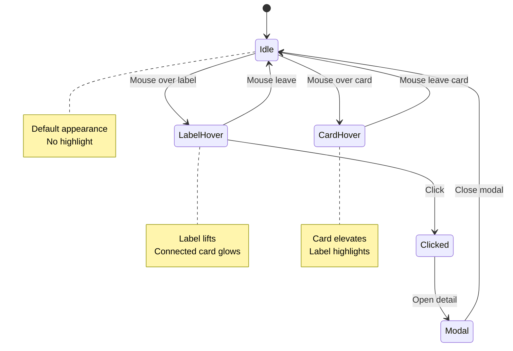
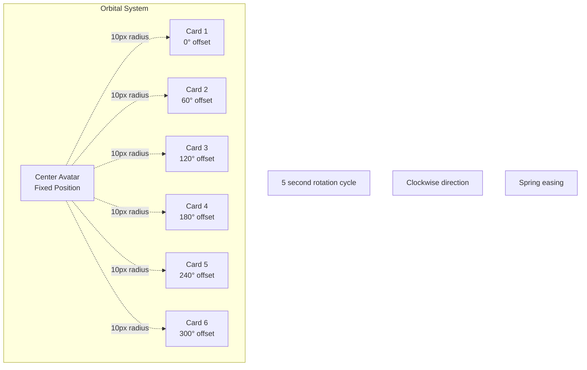
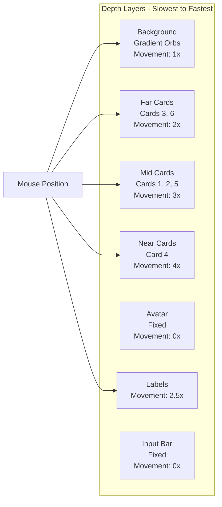
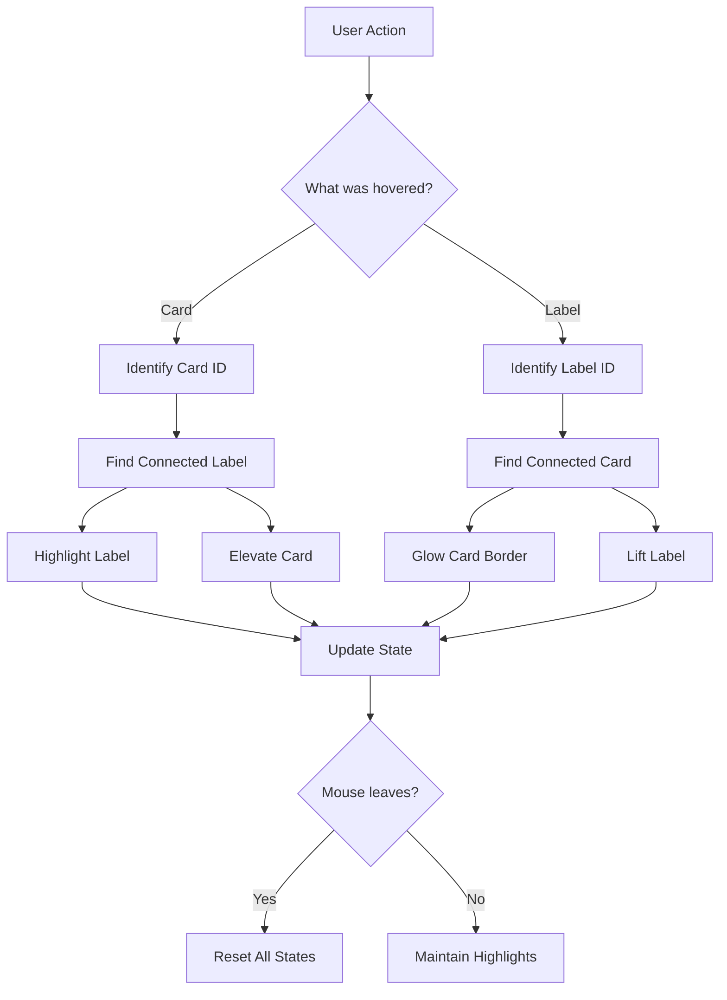
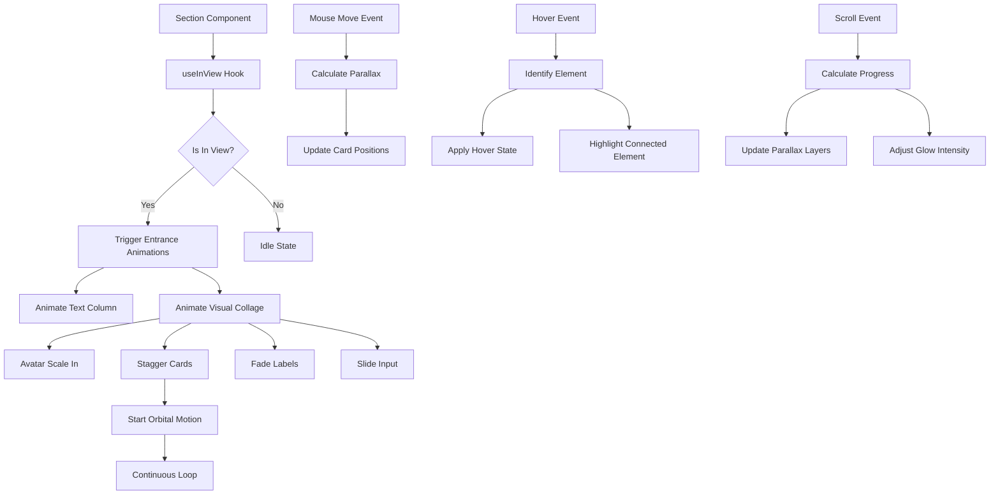

# Wireframes: "Your Smart City" Section

**Date:** December 20, 2024  
**Component:** Smart City Discovery Section  
**View:** Desktop / Tablet / Mobile Breakpoints

---

## 📐 Desktop Layout (1440px+)

```
┌────────────────────────────────────────────────────────────────────────────┐
│                                                                            │
│                         INTELLIGENT DISCOVERY                              │
│                                                                            │
│  ┌─────────────────────────────┬──────────────────────────────────────┐   │
│  │                             │                                      │   │
│  │  LEFT COLUMN                │        RIGHT COLUMN                  │   │
│  │  (40% width)                │        (60% width)                   │   │
│  │                             │                                      │   │
│  │  ┌───────────────────────┐  │   ☕ Cafés                          │   │
│  │  │ Discover your         │  │      ┌─────────┐    🎵              │   │
│  │  │ city differently      │  │      │ Card 1  │      ┌─────────┐   │   │
│  │  └───────────────────────┘  │      │ Cafés   │      │ Card 2  │   │   │
│  │                             │      │ 160×160 │      │Nightlife│   │   │
│  │  Your personal AI guide     │      └─────────┘      │ 160×160 │   │   │
│  │  to hidden cafés, rooftop   │                       └─────────┘   │   │
│  │  bars, and local secrets.   │                                      │   │
│  │  Get real-time              │  🌿 Parks                            │   │
│  │  recommendations based      │   ┌─────────┐                        │   │
│  │  on time of day, weather,   │   │ Card 3  │      ┌──────────┐     │   │
│  │  and your mood.             │   │  Parks  │      │          │     │   │
│  │                             │   │ 140×140 │      │  AVATAR  │     │   │
│  │  ┌─────────────────────┐    │   └─────────┘      │  Woman   │     │   │
│  │  │ Explore your city   │    │                    │  Circle  │     │   │
│  │  │ now →               │    │  🛍️ Markets         │  120×120 │     │   │
│  │  └─────────────────────┘    │   ┌─────────┐      │          │     │   │
│  │                             │   │ Card 4  │      └──────────┘     │   │
│  │                             │   │ Markets │                        │   │
│  │                             │   │ 180×180 │   🎨 Art & Culture     │   │
│  │                             │   └─────────┘      ┌─────────┐      │   │
│  │                             │                    │ Card 5  │      │   │
│  │                             │   🚴 Cycling        │   Art   │      │   │
│  │                             │    ┌─────────┐     │ 160×160 │      │   │
│  │                             │    │ Card 6  │     └─────────┘      │   │
│  │                             │    │ Hidden  │                       │   │
│  │                             │    │ 140×140 │  ✨ Hidden Gems       │   │
│  │                             │    └─────────┘                       │   │
│  │                             │                                      │   │
│  │                             │  ┌───────────────────────────────┐   │   │
│  │                             │  │ 📎 😊 🎤  Explore your city   ➜│   │   │
│  │                             │  │         tonight...             │   │   │
│  │                             │  └───────────────────────────────┘   │   │
│  │                             │                                      │   │
│  └─────────────────────────────┴──────────────────────────────────────┘   │
│                                                                            │
└────────────────────────────────────────────────────────────────────────────┘

SPACING:
- Section padding: 128px vertical, 48px horizontal
- Column gap: 96px
- Card gaps: 24px
- Collage height: 700px
```

---

## 📱 Tablet Layout (768px - 1023px)

```
┌──────────────────────────────────────────────────────────────┐
│                                                              │
│                   INTELLIGENT DISCOVERY                      │
│                                                              │
│  ┌──────────────────────┬───────────────────────────────┐   │
│  │                      │                               │   │
│  │  LEFT (50%)          │      RIGHT (50%)              │   │
│  │                      │                               │   │
│  │  ┌────────────────┐  │  ☕ Cafés   🎵 Nightlife      │   │
│  │  │ Discover your  │  │   ┌──────┐    ┌──────┐       │   │
│  │  │ city           │  │   │Card 1│    │Card 2│       │   │
│  │  │ differently    │  │   │140px │    │140px │       │   │
│  │  └────────────────┘  │   └──────┘    └──────┘       │   │
│  │                      │                               │   │
│  │  Your personal AI    │  🌿 Parks                      │   │
│  │  guide to hidden     │   ┌──────┐                    │   │
│  │  cafés, rooftop      │   │Card 3│   ┌────────┐      │   │
│  │  bars, and local     │   │120px │   │ AVATAR │      │   │
│  │  secrets.            │   └──────┘   │ 100px  │      │   │
│  │                      │              └────────┘      │   │
│  │  ┌──────────────┐    │                               │   │
│  │  │ Explore now  │    │  🛍️ Markets   🎨 Art          │   │
│  │  └──────────────┘    │   ┌──────┐    ┌──────┐       │   │
│  │                      │   │Card 4│    │Card 5│       │   │
│  │                      │   │140px │    │140px │       │   │
│  │                      │   └──────┘    └──────┘       │   │
│  │                      │                               │   │
│  │                      │  ✨ Hidden Gems                │   │
│  │                      │   ┌──────┐                    │   │
│  │                      │   │Card 6│                    │   │
│  │                      │   │120px │                    │   │
│  │                      │   └──────┘                    │   │
│  │                      │                               │   │
│  │                      │  ┌─────────────────────────┐  │   │
│  │                      │  │ Explore your city...  ➜ │  │   │
│  │                      │  └─────────────────────────┘  │   │
│  └──────────────────────┴───────────────────────────────┘   │
│                                                              │
└──────────────────────────────────────────────────────────────┘

SPACING:
- Section padding: 96px vertical, 32px horizontal
- Column gap: 48px
- Card gaps: 16px
- Collage height: 600px
```

---

## 📱 Mobile Layout (375px - 767px)

```
┌────────────────────────────────────────┐
│                                        │
│       INTELLIGENT DISCOVERY            │
│                                        │
│  ┌──────────────────────────────────┐  │
│  │                                  │  │
│  │  VISUAL COLLAGE (FULL WIDTH)     │  │
│  │                                  │  │
│  │    ☕ Cafés       🎵 Nightlife    │  │
│  │    ┌────────┐    ┌────────┐     │  │
│  │    │ Card 1 │    │ Card 2 │     │  │
│  │    │ 140px  │    │ 140px  │     │  │
│  │    └────────┘    └────────┘     │  │
│  │                                  │  │
│  │    🌿 Parks                       │  │
│  │    ┌────────┐                    │  │
│  │    │ Card 3 │   ┌──────────┐    │  │
│  │    │ 120px  │   │  AVATAR  │    │  │
│  │    └────────┘   │  100×100 │    │  │
│  │                 └──────────┘    │  │
│  │                                  │  │
│  │    🛍️ Markets     🎨 Art          │  │
│  │    ┌────────┐    ┌────────┐     │  │
│  │    │ Card 4 │    │ Card 5 │     │  │
│  │    │ 140px  │    │ 140px  │     │  │
│  │    └────────┘    └────────┘     │  │
│  │                                  │  │
│  │    ✨ Hidden Gems                 │  │
│  │    ┌────────┐                    │  │
│  │    │ Card 6 │                    │  │
│  │    │ 120px  │                    │  │
│  │    └────────┘                    │  │
│  │                                  │  │
│  │  ┌────────────────────────────┐  │  │
│  │  │ Explore your city...     ➜ │  │  │
│  │  └────────────────────────────┘  │  │
│  │                                  │  │
│  └──────────────────────────────────┘  │
│                                        │
│  ┌──────────────────────────────────┐  │
│  │                                  │  │
│  │  TEXT CONTENT                    │  │
│  │                                  │  │
│  │  Discover your                   │  │
│  │  city differently                │  │
│  │                                  │  │
│  │  Your personal AI guide to       │  │
│  │  hidden cafés, rooftop bars,     │  │
│  │  and local secrets.              │  │
│  │                                  │  │
│  │  ┌────────────────────────────┐  │  │
│  │  │  Explore your city now     │  │  │
│  │  └────────────────────────────┘  │  │
│  │                                  │  │
│  └──────────────────────────────────┘  │
│                                        │
└────────────────────────────────────────┘

SPACING:
- Section padding: 64px vertical, 24px horizontal
- Visual first, then text
- Cards in 2×3 static grid
- No orbital animation
- Card gaps: 12px
```

---

## 🎨 Detailed Component Wireframes

### Card Component (Individual)

```
┌─────────────────────────────────────┐
│                                     │
│  ┌───────────────────────────────┐  │
│  │                               │  │
│  │         IMAGE                 │  │
│  │       (Cover fit)             │  │
│  │                               │  │
│  │    [Hover: Gradient Overlay]  │  │
│  │                               │  │
│  └───────────────────────────────┘  │
│                                     │
│  Styles:                            │
│  - Border-radius: 24px              │
│  - Shadow: 0 8px 24px rgba(0,0,0,08)│
│  - Border: 1px white               │
│  - Hover: scale(1.05), y(-8px)     │
│                                     │
└─────────────────────────────────────┘

States:
┌──────────┬──────────┬──────────┐
│ Default  │  Hover   │  Active  │
├──────────┼──────────┼──────────┤
│ scale: 1 │scale:1.05│scale:1.02│
│ y: 0     │ y: -8px  │ y: -4px  │
│ z: auto  │ z: 100   │ z: 50    │
└──────────┴──────────┴──────────┘
```

### Label/Pill Component

```
┌───────────────────────────┐
│  ☕  Cafés & Coffee       │
└───────────────────────────┘
     ↑         ↑
   Icon     Text

Structure:
┌────┬──────────────────────┐
│    │                      │
│ 🔲 │  Label Text          │
│Icon│  14px medium         │
│16px│  Slate-800           │
│    │                      │
└────┴──────────────────────┘

Styles:
- Background: rgba(255,255,255,0.8)
- Backdrop-blur: 8px
- Border: 1px rgba(amber, 0.2)
- Padding: 12px 16px
- Border-radius: 9999px (full)
- Shadow: 0 4px 12px rgba(0,0,0,0.06)

Hover:
- Transform: translateY(-2px) scale(1.02)
- Connected card glows
```

### Central Avatar

```
      ┌─────────────────┐
      │   ╔═══════════╗ │
      │   ║           ║ │
      │   ║   Woman   ║ │
      │   ║   Photo   ║ │
      │   ║  120×120  ║ │
      │   ║           ║ │
      │   ╚═══════════╝ │
      └─────────────────┘
           ↑       ↑
        Border   Glow

Layers (bottom to top):
1. Glow backdrop (blur: 40px)
2. White border ring (2px)
3. Avatar image (circular crop)
4. Pulse ring (animated)

Animation:
┌──────────────────────────────────┐
│ Continuous Pulse (3s loop):      │
│ scale: [1, 1.05, 1]              │
│ opacity: [0.5, 0, 0.5]           │
│ ring-width: [0, 20px, 0]         │
└──────────────────────────────────┘
```

### Chat Input Bar

```
┌────────────────────────────────────────────────────────┐
│                                                        │
│  📎  😊  🎤      Explore your city tonight...       ➜  │
│  ↑   ↑   ↑                                         ↑  │
│ Attach Emoji Voice      Placeholder             Send  │
│                                                        │
└────────────────────────────────────────────────────────┘

Structure:
┌──────┬───────────────────────────────────────┬────────┐
│Icons │        Input Field                    │ Button │
│ 60px │        Flex-grow                      │  60px  │
└──────┴───────────────────────────────────────┴────────┘

Styles:
- Height: 64px
- Width: 90% max 500px
- Background: White
- Border: 2px slate-200
- Border-radius: 32px
- Shadow: 0 12px 32px rgba(0,0,0,0.12)
- Padding: 16px 20px

Send Button:
┌──────────┐
│    ➜    │  44×44px circle
│          │  Gradient amber→orange
└──────────┘  Shadow + hover scale
```

---

## 🔄 Interaction State Diagrams

### Card Interaction Flow

```mermaid
stateDiagram-v2
    [*] --> Default
    
    Default --> Hovered : Mouse enter
    Default --> Focused : Keyboard focus
    
    Hovered --> Default : Mouse leave
    Hovered --> Clicked : Click
    
    Focused --> Default : Blur
    Focused --> Clicked : Enter key
    
    Clicked --> Default : Animation complete
    
    note right of Default
        scale: 1
        y: 0
        shadow: default
    end note
    
    note right of Hovered
        scale: 1.05
        y: -8px
        shadow: elevated
        Label highlights
    end note
    
    note right of Clicked
        scale: 1.02
        Navigate or expand
    end note
```

### Label Interaction Flow



### Scroll Animation Timeline

```mermaid
gantt
    title Smart City Section - Scroll Animation Timeline
    dateFormat X
    axisFormat %L ms
    
    section Trigger
    Scroll into view (threshold -100px) :milestone, 0, 0
    
    section Background
    Gradient fade in :bg1, 0, 600
    
    section Left Text
    Title fade up :text1, 200, 400
    Headline slide up :text2, 400, 600
    Body copy fade in :text3, 600, 500
    CTA button reveal :text4, 800, 400
    
    section Avatar
    Avatar scale in :avatar1, 300, 600
    Pulse effect start :avatar2, 900, 100
    Continuous pulse loop :avatar3, 1000, 10000
    
    section Cards
    Card 1 reveal :card1, 400, 600
    Card 2 reveal :card2, 480, 600
    Card 3 reveal :card3, 560, 600
    Card 4 reveal :card4, 640, 600
    Card 5 reveal :card5, 720, 600
    Card 6 reveal :card6, 800, 600
    
    section Labels
    Labels fade in :labels, 900, 500
    
    section Input
    Chat input slide up :input, 1000, 600
    
    section Continuous
    Orbit animation start :orbit, 1400, 100
    Orbit loop (5000ms cycle) :orbit2, 1500, 10000
```



---

## 🎬 Animation Specification Diagrams

### Orbital Motion Pattern



### Parallax Depth Layers



### Hover Connection Logic



---

## 📊 Responsive Behavior Matrix

```mermaid
graph TD
    subgraph Desktop - 1440px+
        D1[Two Column Layout 40/60]
        D2[Full Orbital Animation]
        D3[Mouse Parallax Active]
        D4[All 6 Cards Visible]
        D5[Scroll Parallax Active]
        D6[Hover States Enabled]
    end
    
    subgraph Tablet - 768-1023px
        T1[Two Column Layout 50/50]
        T2[Simplified Orbit - Smaller Radius]
        T3[No Mouse Parallax]
        T4[All 6 Cards - Smaller Sizes]
        T5[Reduced Scroll Effects]
        T6[Touch Tap States]
    end
    
    subgraph Mobile - 375-767px
        M1[Single Column Stack]
        M2[No Orbital Animation]
        M3[No Parallax]
        M4[Static 2x3 Grid]
        M5[Minimal Scroll Effects]
        M6[Touch Optimized]
        M7[Visual First - Text Below]
    end
    
    BP1{Breakpoint?} --> Desktop
    BP1 --> Tablet
    BP1 --> Mobile
    
    Desktop --> D1 & D2 & D3 & D4 & D5 & D6
    Tablet --> T1 & T2 & T3 & T4 & T5 & T6
    Mobile --> M1 & M2 & M3 & M4 & M5 & M6 & M7
```



---

## 🎨 Visual Hierarchy Map

```
IMPORTANCE LEVEL (1 = Highest)

┌─────────────────────────────────────────┐
│ Level 1: Primary Focus                  │
├─────────────────────────────────────────┤
│ • Central Avatar (focal point)          │
│ • Headline text                         │
└─────────────────────────────────────────┘

┌─────────────────────────────────────────┐
│ Level 2: Supporting Elements            │
├─────────────────────────────────────────┤
│ • Image Cards (content showcase)        │
│ • Chat Input Bar (action prompt)        │
│ • CTA Button                            │
└─────────────────────────────────────────┘

┌─────────────────────────────────────────┐
│ Level 3: Context & Labels               │
├─────────────────────────────────────────┤
│ • Category Pill Labels                  │
│ • Body Copy Text                        │
│ • Section Title                         │
└─────────────────────────────────────────┘

┌─────────────────────────────────────────┐
│ Level 4: Decorative                     │
├─────────────────────────────────────────┤
│ • Background gradients                  │
│ • Shadows and glows                     │
│ • Input bar icons                       │
└─────────────────────────────────────────┘
```

---

## 📐 Spacing System

```
SECTION SPACING (Desktop)

┌────────────────────────────────────────┐
│  ↕ 128px (py-32)                       │
│  ┌──────────────────────────────────┐  │
│  │                                  │  │
│  │  ← 48px →  CONTENT  ← 48px →    │  │
│  │                                  │  │
│  │  Column Gap: 96px                │  │
│  │                                  │  │
│  └──────────────────────────────────┘  │
│  ↕ 128px (py-32)                       │
└────────────────────────────────────────┘

CARD GRID SPACING

Cards positioned absolutely within collage:
- Card spacing: 24px (gap-6)
- Label offset from card: 8px
- Avatar padding from edge: 32px minimum
- Input bar margin top: 32px from last card
```

---

## 🎯 Touch Target Sizes (Mobile)

```
Minimum Touch Targets (iOS/Android Guidelines)

┌──────────────────────┬─────────┬─────────┐
│ Element              │ Desktop │ Mobile  │
├──────────────────────┼─────────┼─────────┤
│ Card                 │ 140-180 │ 120-140 │
│ Label/Pill           │ 40px h  │ 48px h  │
│ CTA Button           │ 48px h  │ 56px h  │
│ Chat Input           │ 64px h  │ 64px h  │
│ Send Button          │ 44×44   │ 48×48   │
│ Icon Buttons         │ 40×40   │ 44×44   │
└──────────────────────┴─────────┴─────────┘

Spacing between tap targets: 8px minimum
```

---

## 🔄 Data Flow Architecture



---

## ✅ Wireframe Checklist

### Desktop (1440px+)
- [ ] Two-column layout (40/60 split)
- [ ] Cards in organic orbit pattern
- [ ] All 6 category labels visible
- [ ] Central avatar prominent (120px)
- [ ] Chat input anchored at bottom
- [ ] Generous spacing (128px vertical)
- [ ] Hover states fully functional
- [ ] Orbital animation smooth
- [ ] Parallax depth working

### Tablet (768-1023px)
- [ ] Two-column balanced (50/50)
- [ ] Reduced card sizes proportionally
- [ ] Avatar scaled down (100px)
- [ ] Simplified orbital motion
- [ ] Touch-optimized interactions
- [ ] Adequate spacing (96px vertical)
- [ ] Labels still readable
- [ ] Input bar responsive

### Mobile (375-767px)
- [ ] Single column stack
- [ ] Visual collage shown first
- [ ] Static 2×3 card grid
- [ ] No orbital animation
- [ ] Avatar scaled appropriately (80-100px)
- [ ] Labels clear and tappable
- [ ] Text content below visual
- [ ] CTA button full-width option
- [ ] Input bar touch-friendly (64px height)

---

## 🎨 Color & Style Legend

```
WIREFRAME SYMBOLS:

┌─────┐  Component boundary
│     │  
└─────┘  

╔═════╗  Emphasized element
║     ║  (Avatar, primary focus)
╚═════╝  

┌─ ─ ─┐  Optional/conditional
│     │  element
└─ ─ ─┘  

───────  Connection line

↑  ↓     Vertical spacing
←  →     Horizontal spacing

☕ 🎵    Icons/Emojis
🌿 🛍️    (Category identifiers)
🎨 ✨

[Text]   Interactive text
──────   (Links, buttons)

{State}  Dynamic content
         (Placeholders)
```

---

## 📚 References & Resources

### Figma File Structure
```
Smart City Section
├── 🎨 Desktop (1440px)
│   ├── Default State
│   ├── Hover State
│   └── Animation Keyframes
├── 💻 Tablet (1024px)
│   ├── Default State
│   └── Touch States
├── 📱 Mobile (375px)
│   ├── Visual First
│   └── Text Content
├── 🧩 Components
│   ├── Card Component
│   ├── Label/Pill Component
│   ├── Avatar Component
│   └── Input Bar Component
└── 🎬 Animation Specs
    ├── Entrance Timeline
    ├── Orbital Motion
    ├── Parallax Layers
    └── Hover Interactions
```

### Developer Handoff Notes
1. All spacing uses 8px grid system
2. Animations use Framer Motion library
3. Images lazy load with blur placeholder
4. Intersection Observer for scroll trigger
5. Reduced motion media query support
6. Touch events for mobile tap states

---

**Status:** 📐 Wireframes Complete  
**Ready for:** High-fidelity mockups in Figma

**Last Updated:** December 20, 2024
