# TripCreateModal Fix - Visual Diagrams

**Date:** 2025-01-22  
**Purpose:** Visual documentation of the TripCreateModal fix  
**Status:** ✅ **COMPLETE**

---

## Overview

This document contains Mermaid diagrams that visualize the TripCreateModal fix process, showing the before/after architecture, data flows, and user journeys.

---

## Diagram 1: Problem Flow (Before Fix)

**Objective:** Visualize the broken flow where the "New Trip" button bypassed the modal system.

### The Problem

The original implementation had the button handler directly calling the API with hardcoded values, completely bypassing the TripCreateModal that was already implemented and rendered in the AppShell.

### Diagram



```mermaid
flowchart TD
    User[👤 User clicks 'New Trip' button]
    TripsPage[📄 TripsPage Component]
    Handler["⚠️ handleCreateTrip()<br/>(Direct API call)"]
    API["🔴 createTrip() API<br/>with hardcoded values"]
    Hardcoded["📦 Hardcoded Data:<br/>• title: 'Untitled Trip'<br/>• destination: 'Medellín'<br/>• dates: today + 7 days"]
    Navigation["🔀 Navigate to /trips/:id"]
    Modal["❌ TripCreateModal<br/>(NEVER OPENED)<br/>Form exists but disconnected"]
    
    User -->|Clicks| TripsPage
    TripsPage -->|Triggers| Handler
    Handler -->|Bypasses modal| API
    Handler -->|Uses| Hardcoded
    API -->|Success| Navigation
    Modal -.->|Disconnected from flow| Handler
    
    style Modal fill:#ffcccc,stroke:#ff0000,stroke-width:2px,stroke-dasharray: 5 5
    style Handler fill:#ffe6cc,stroke:#ff9900,stroke-width:2px
    style API fill:#ffe6cc,stroke:#ff9900,stroke-width:2px
    style Hardcoded fill:#fff4e1,stroke:#ffaa00
    style User fill:#e1f5ff,stroke:#0066cc
    style Navigation fill:#f3e5f5,stroke:#9c27b0
```

### Key Issues

1. **❌ Modal Never Opens** - The TripCreateModal component was rendered but never shown
2. **❌ No User Input** - All trip data was hardcoded, no form interaction
3. **❌ Bypassed System** - Button handler directly called API instead of using modal
4. **❌ Poor UX** - Users couldn't customize destination, dates, travelers, or budget
5. **❌ Disconnected Architecture** - Modal existed but was not integrated into the flow

### Impact

- Users reported "add new trip is not working"
- Modal form was non-functional
- Trip creation flow was broken
- Implemented modal system was wasted

---

**Status:** ✅ **Diagram 1 Complete**  
**Next:** Diagram 2 - Solution Flow (After Fix)

---

## Diagram 2: Solution Flow (After Fix)

**Objective:** Visualize the fixed flow where the button properly opens the modal through WizardContext.

### The Solution

The fixed implementation has the button handler calling `openCreateTrip()` from WizardContext, which updates state to show the modal, allowing users to fill out the form before creating the trip.

### Diagram



```mermaid
flowchart TD
    User[👤 User clicks 'New Trip' button]
    TripsPage[📄 TripsPage Component]
    Handler["✅ handleCreateTrip()<br/>(Calls openCreateTrip)"]
    Context["🎯 WizardContext<br/>openCreateTrip()"]
    State["📊 State Update:<br/>isCreateTripOpen: true"]
    Modal["✅ TripCreateModal<br/>Renders & Opens"]
    Form["📝 User fills form:<br/>• Location: 'Medellín'<br/>• Dates: Jan 22-29<br/>• Travelers: 2<br/>• Budget: $5000"]
    Submit[🖱️ User clicks 'Create trip']
    ModalAPI["🟢 createTrip() API<br/>with user input"]
    Success[🎉 Trip Created Successfully]
    Close[❎ Modal closes]
    Navigation["🔀 Navigate to /trips/:id"]
    
    User -->|Clicks| TripsPage
    TripsPage -->|Triggers| Handler
    Handler -->|Calls| Context
    Context -->|Updates| State
    State -->|Triggers render| Modal
    Modal -->|Displays| Form
    Form -->|Completes| Submit
    Submit -->|Calls| ModalAPI
    ModalAPI -->|Success| Success
    Success -->|Triggers| Close
    Close -->|Navigates| Navigation
    
    style Modal fill:#ccffcc,stroke:#00aa00,stroke-width:2px
    style Context fill:#cce5ff,stroke:#0066cc,stroke-width:2px
    style State fill:#cce5ff,stroke:#0066cc
    style Success fill:#ccffcc,stroke:#00aa00
    style Handler fill:#e8f5e9,stroke:#4caf50
    style ModalAPI fill:#ccffcc,stroke:#00aa00
    style User fill:#e1f5ff,stroke:#0066cc
    style Navigation fill:#f3e5f5,stroke:#9c27b0
```

### Key Improvements

1. **✅ Modal Opens Correctly** - Button calls `openCreateTrip()` which updates context state
2. **✅ User Input Collected** - Form displays all fields for user customization
3. **✅ Proper Architecture** - Flow goes through WizardContext state management
4. **✅ Better UX** - Users can customize destination, dates, travelers, and budget
5. **✅ Connected System** - All components properly integrated through context

### Benefits

- Users can create trips with custom details
- Modal system works as designed
- State management is centralized
- Architecture follows React best practices

---

**Status:** ✅ **Diagram 2 Complete**  
**Next:** Diagram 3 - Component Architecture

---

## Diagram 3: Component Architecture

**Objective:** Show the component hierarchy and relationships in the trip creation system.

### Architecture Overview

This diagram illustrates how components, hooks, context, and API layers are connected in the trip creation flow.

### Diagram



```mermaid
graph TB
    AppShell["🏢 AppShell<br/>Layout Component"]
    TripsPage["📄 TripsPage<br/>Page Component"]
    Modal["📋 TripCreateModal<br/>Modal Component"]
    WizardContext["🎯 WizardContext<br/>React Context"]
    UseWizard["🪝 useWizard Hook"]
    UseTrips["🪝 useTrips Hook"]
    APIClient["🌐 API Client<br/>lib/api/trips.ts"]
    Backend["☁️ Backend API<br/>Edge Functions"]
    
    AppShell -->|Renders| Modal
    TripsPage -->|Uses| UseWizard
    UseWizard -->|Accesses| WizardContext
    Modal -->|Reads state from| WizardContext
    Modal -->|Uses| UseTrips
    UseTrips -->|Calls| APIClient
    APIClient -->|HTTP Request| Backend
    
    style AppShell fill:#e1f5ff,stroke:#0066cc
    style TripsPage fill:#fff4e1,stroke:#ffaa00
    style Modal fill:#e8f5e9,stroke:#4caf50
    style WizardContext fill:#f3e5f5,stroke:#9c27b0
    style Backend fill:#fce4ec,stroke:#e91e63
```

### Component Responsibilities

- **AppShell**: Root layout component that renders the modal
- **TripsPage**: Page component with "New Trip" button
- **TripCreateModal**: Modal form component for trip creation
- **WizardContext**: Manages modal open/close state
- **useWizard**: Hook to access context functions
- **useTrips**: Hook for trip CRUD operations
- **API Client**: Handles HTTP requests to backend
- **Backend**: Edge functions that process requests

---

**Status:** ✅ **Diagram 3 Complete**  
**Next:** Diagram 4 - State Management Flow

---

## Diagram 4: State Management Flow

**Objective:** Visualize how state flows through the system over time using a sequence diagram.

### State Flow Timeline

This sequence diagram shows the chronological flow of state changes and component interactions when creating a trip.

### Diagram


### Key State Transitions

1. **Open Modal**: `isCreateTripOpen: false → true`
2. **Form State**: Local state updates as user types
3. **API Call**: Loading state during request
4. **Close Modal**: `isCreateTripOpen: true → false`
5. **Navigation**: Route change to trip details

---

**Status:** ✅ **Diagram 4 Complete**  
**Next:** Diagram 5 - User Journey

---

## Diagram 5: User Journey

**Objective:** Show the complete user journey from button click to trip creation, including success and error paths.

### Complete User Flow

This diagram maps the entire user experience, showing both happy and error paths.

### Diagram



```mermaid
flowchart TD
    Start[👤 User on TripsPage]
    Click[🖱️ User clicks 'New Trip' button]
    ModalOpen[📋 Modal opens with form]
    FillLocation["📍 User fills location:<br/>Types 'Medellín'"]
    FillDates["📅 User selects dates:<br/>'5 days in Jan'"]
    FillTravelers["👥 User selects travelers:<br/>2 people"]
    FillBudget["💰 User selects budget:<br/>'$$$$ Luxury'"]
    ClickCreate[🖱️ User clicks 'Create trip']
    Loading["⏳ Loading state:<br/>'Creating...'"]
    API{🌐 API Call<br/>Success?}
    Success["✅ Success toast:<br/>'Trip created successfully!'"]
    Error["❌ Error toast:<br/>'Failed to create trip'"]
    CloseModal[❎ Modal closes]
    Navigate["🔀 Navigate to /trips/:id"]
    TripDetail["📄 Trip Detail Page<br/>Shows new trip"]
    
    Start --> Click
    Click --> ModalOpen
    ModalOpen --> FillLocation
    FillLocation --> FillDates
    FillDates --> FillTravelers
    FillTravelers --> FillBudget
    FillBudget --> ClickCreate
    ClickCreate --> Loading
    Loading --> API
    API -->|Yes| Success
    API -->|No| Error
    Success --> CloseModal
    Error --> ModalOpen
    CloseModal --> Navigate
    Navigate --> TripDetail
    
    style Success fill:#ccffcc,stroke:#00aa00
    style Error fill:#ffcccc,stroke:#ff0000
    style Loading fill:#fff4e1,stroke:#ffaa00
    style TripDetail fill:#e8f5e9,stroke:#4caf50
```

### User Experience Points

- **Happy Path**: All steps complete successfully, modal closes, user sees new trip
- **Error Path**: If API fails, modal stays open with error message for retry
- **Loading State**: Clear feedback while trip is being created
- **Navigation**: Automatic redirect to new trip details on success

---

**Status:** ✅ **Diagram 5 Complete**  
**Next:** Diagram 6 - Data Flow

---

## Diagram 6: Data Flow

**Objective:** Show how data transforms and flows from user input through the system and back.

### Data Transformation Pipeline

This diagram traces data from user input through formatting, API call, database storage, and back to the UI.

### Diagram



```mermaid
flowchart LR
    Input["📝 User Input:<br/>• location: 'Medellín'<br/>• dates: '5 days in Jan'<br/>• travelers: 2<br/>• budget: '$$$$ Luxury'"]
    Format["🔄 Format tripData:<br/>{<br/>  title: 'Trip to Medellín',<br/>  destination: 'Medellín',<br/>  start_date: '2025-01-22',<br/>  end_date: '2025-01-29',<br/>  travelers: 2,<br/>  budget: 5000<br/>}"]
    Hook["🪝 useTrips Hook<br/>createTrip(data)"]
    Client["🌐 API Client<br/>POST /trips"]
    Backend["☁️ Backend API<br/>Edge Function"]
    DB[("💾 Database<br/>trips table")]
    Response["📦 Response:<br/>{<br/>  id: 'abc123',<br/>  title: 'Trip to Medellín',<br/>  destination: 'Medellín',<br/>  start_date: '2025-01-22',<br/>  end_date: '2025-01-29',<br/>  created_at: '2025-01-22T...'<br/>}"]
    State["📊 useTrips State<br/>trips array updated"]
    Modal["📋 TripCreateModal<br/>Receives newTrip"]
    Nav["🔀 Navigate to<br/>/trips/abc123"]
    DetailPage["📄 TripDetailPage<br/>Fetches trip data"]
    
    Input --> Format
    Format --> Hook
    Hook --> Client
    Client --> Backend
    Backend --> DB
    DB --> Backend
    Backend --> Response
    Response --> Hook
    Hook --> State
    Hook --> Modal
    Modal --> Nav
    Nav --> DetailPage
    
    style Input fill:#e1f5ff,stroke:#0066cc
    style Format fill:#fff4e1,stroke:#ffaa00
    style DB fill:#f3e5f5,stroke:#9c27b0
    style Response fill:#ccffcc,stroke:#00aa00
    style State fill:#e8f5e9,stroke:#4caf50
```

### Data Transformations

1. **User Input → Form Data**: Raw user selections
2. **Form Data → API Payload**: Formatted for backend
3. **API Payload → Database Record**: Stored in trips table
4. **Database Record → API Response**: Returned with generated ID
5. **API Response → Local State**: Updates useTrips hook state
6. **Local State → UI Update**: Modal closes, navigation occurs

---

**Status:** ✅ **Diagram 6 Complete**  
**Next:** Diagram 7 - Before vs After Comparison

---

## Diagram 7: Before vs After Comparison

**Objective:** Side-by-side comparison showing broken architecture vs fixed architecture.

### Architectural Comparison

This diagram contrasts the broken flow (left) with the fixed flow (right) to highlight the improvements.

### Diagram


### Key Differences

**BEFORE (Broken):**
- ❌ Button directly called API
- ❌ Modal was disconnected
- ❌ No user input possible
- ❌ Hardcoded values only

**AFTER (Fixed):**
- ✅ Button calls context function
- ✅ Modal properly integrated
- ✅ User can fill form
- ✅ Dynamic user values used

---

**Status:** ✅ **Diagram 7 Complete**  
**Next:** Diagram 8 - Error Handling Flow

---

## Diagram 8: Error Handling Flow

**Objective:** Show comprehensive error handling in the trip creation flow.

### Error Handling Strategy

This diagram demonstrates how the system handles validation errors, network errors, and server errors gracefully.

### Diagram



```mermaid
flowchart TD
    Submit[🖱️ User clicks 'Create trip']
    Validate{✅ Form Valid?}
    API["🌐 API Call:<br/>POST /trips"]
    Network{🌐 Network<br/>Success?}
    Server{☁️ Server<br/>Response}
    Success["✅ Success:<br/>Trip created"]
    Error[❌ Error Caught]
    ToastError["🔴 Error Toast:<br/>'Failed to create trip'"]
    ToastSuccess["🟢 Success Toast:<br/>'Trip created successfully!'"]
    CloseModal[❎ Close Modal]
    Navigate["🔀 Navigate to /trips/:id"]
    StayOpen["📋 Modal stays open<br/>User can retry"]
    Cancel["❎ User cancels<br/>Modal closes"]
    
    Submit --> Validate
    Validate -->|No| StayOpen
    Validate -->|Yes| API
    API --> Network
    Network -->|No| Error
    Network -->|Yes| Server
    Server -->|200 OK| Success
    Server -->|400/500| Error
    Success --> ToastSuccess
    Success --> CloseModal
    Success --> Navigate
    Error --> ToastError
    Error --> StayOpen
    StayOpen --> Cancel
    StayOpen --> Submit
    
    style Success fill:#ccffcc,stroke:#00aa00
    style Error fill:#ffcccc,stroke:#ff0000
    style ToastError fill:#ffcccc,stroke:#ff0000
    style ToastSuccess fill:#ccffcc,stroke:#00aa00
    style Validate fill:#fff4e1,stroke:#ffaa00
```

### Error Scenarios Handled

1. **Validation Errors**: Form validation prevents invalid submission
2. **Network Errors**: Catches network failures and shows error message
3. **Server Errors**: Handles 400/500 responses gracefully
4. **User Recovery**: Modal stays open for retry or cancel
5. **Success Path**: Clear feedback and automatic navigation

---

**Status:** ✅ **Diagram 8 Complete**  
**Next:** Diagram 9 - Context State Machine

---

## Diagram 9: Context State Machine

**Objective:** Show the WizardContext state machine for modal visibility control.

### State Machine Design

This state diagram illustrates all possible state transitions for the `isCreateTripOpen` boolean flag.

### Diagram


### State Transitions

**Hidden → Visible:**
- User clicks "New Trip" button
- `openCreateTrip()` is called
- State updates: `isCreateTripOpen: true`

**Visible → Hidden:**
- Trip creation succeeds (auto-close)
- User clicks X button (manual close)
- User clicks backdrop (cancel)
- `closeCreateTrip()` is called
- State updates: `isCreateTripOpen: false`

---

**Status:** ✅ **Diagram 9 Complete**  
**Next:** Diagram 10 - Complete System Architecture

---

## Diagram 10: Complete System Architecture

**Objective:** Show the complete multi-layer system architecture for trip creation.

### Full System Overview

This comprehensive diagram shows all architectural layers and how data flows through the entire system.

### Diagram



```mermaid
graph TB
    subgraph UI["🎨 UI Layer"]
        TripsPage["📄 TripsPage<br/>Button Component"]
        Modal["📋 TripCreateModal<br/>Form Component"]
        FormFields["📝 Form Fields:<br/>• Location<br/>• Dates<br/>• Travelers<br/>• Budget"]
    end
    
    subgraph Context["🎯 Context Layer"]
        WizardContext["🎯 WizardContext<br/>isCreateTripOpen state"]
    end
    
    subgraph Hooks["🪝 Hook Layer"]
        UseWizard["🪝 useWizard Hook<br/>• openCreateTrip()<br/>• closeCreateTrip()"]
        UseTrips["🪝 useTrips Hook<br/>• createTrip()<br/>• trips state"]
    end
    
    subgraph API["🌐 API Layer"]
        APIClient["🌐 API Client<br/>lib/api/trips.ts"]
        HTTP["📡 HTTP POST Request<br/>/trips endpoint"]
    end
    
    subgraph Backend["☁️ Backend Layer"]
        EdgeFunction["⚡ Edge Function<br/>make-server-fd8c4bf7/trips"]
        Database[("💾 Supabase<br/>trips table")]
    end
    
    TripsPage -->|Uses| UseWizard
    UseWizard -->|Manages| WizardContext
    WizardContext -->|Controls| Modal
    Modal -->|Contains| FormFields
    Modal -->|Uses| UseTrips
    UseTrips -->|Calls| APIClient
    APIClient -->|Makes| HTTP
    HTTP -->|Hits| EdgeFunction
    EdgeFunction -->|Queries| Database
    Database -->|Returns| EdgeFunction
    EdgeFunction -->|Response| HTTP
    HTTP -->|Data| APIClient
    APIClient -->|Trip object| UseTrips
    UseTrips -->|Updates state| Modal
    Modal -->|Closes| WizardContext
    
    style UI fill:#e1f5ff,stroke:#0066cc
    style Context fill:#f3e5f5,stroke:#9c27b0
    style Hooks fill:#fff4e1,stroke:#ffaa00
    style API fill:#e8f5e9,stroke:#4caf50
    style Backend fill:#fce4ec,stroke:#e91e63
```

### Layer Responsibilities

**UI Layer:**
- User interactions and visual presentation
- Button clicks, form inputs, modal display

**Context Layer:**
- Global state management for modal visibility
- Provides state to all consuming components

**Hook Layer:**
- Business logic and state management
- Abstracts API calls and context access

**API Layer:**
- HTTP communication with backend
- Request/response formatting

**Backend Layer:**
- Data persistence and validation
- Database operations via Edge Functions

---

**Status:** ✅ **All 10 Diagrams Complete**  
**Documentation:** Complete visual reference for TripCreateModal fix

---

## Verification Checklist

✅ All diagrams render correctly in Mermaid  
✅ Colors are consistent across diagrams  
✅ Labels are clear and descriptive  
✅ Flow is logical and easy to follow  
✅ All components mentioned in fix plan are included  
✅ Error paths are shown where relevant  
✅ State changes are clearly indicated  
✅ Diagrams match the fix plan documentation  

---

## Summary

This document provides 10 comprehensive Mermaid diagrams that visualize:

1. ✅ Problem Flow (Before Fix) - Broken architecture
2. ✅ Solution Flow (After Fix) - Fixed architecture
3. ✅ Component Architecture - Component relationships
4. ✅ State Management Flow - Sequence of state changes
5. ✅ User Journey - Complete UX flow
6. ✅ Data Flow - Data transformations
7. ✅ Before vs After Comparison - Side-by-side
8. ✅ Error Handling Flow - Error scenarios
9. ✅ Context State Machine - State transitions
10. ✅ Complete System Architecture - All layers

**Status:** ✅ **DOCUMENTATION COMPLETE**

---

## UI Flow Rule - Reusable Pattern

**Purpose:** Prevent the same class of bug from occurring in future features (events, restaurants, rentals, etc.)

### The Golden Rule

```
Page buttons trigger UI state via Context → Only modals/drawers submit data via API
```

### Architecture Pattern

```
User Action → Page Component → Context Hook → Context State Update → Modal Renders → User Input → Modal Submits API → Close Modal
```

### Anti-Pattern to Avoid

```
❌ User Action → Page Component → Direct API Call (bypasses UI)
```

### Implementation Checklist

When adding new features (Add Event, Book Restaurant, Add Rental, etc.):

**✅ DO:**
1. Create a modal/drawer component for the feature
2. Render modal in AppShell or parent layout
3. Add open/close state to appropriate Context
4. Page button calls `openFeatureModal()` from context
5. Modal handles form state and API submission
6. Modal closes itself after successful submission

**❌ DON'T:**
1. Call API directly from page button handler
2. Use hardcoded values in page components
3. Mix UI state with API calls in page components
4. Create modals that don't close themselves
5. Forget to integrate with existing context systems

### Code Examples

**✅ Correct Implementation:**

```typescript
// TripsPage.tsx (Page Component)
import { useWizard } from '../../context/WizardContext';

export default function TripsPage() {
  const { openCreateTrip } = useWizard();
  
  const handleCreateTrip = () => {
    openCreateTrip(); // Opens modal via context
  };
  
  return <Button onClick={handleCreateTrip}>New Trip</Button>;
}

// TripCreateModal.tsx (Modal Component)
export function TripCreateModal() {
  const { ui, closeCreateTrip } = useWizard();
  const { createTrip } = useTrips();
  
  const handleSubmit = async () => {
    const newTrip = await createTrip(formData);
    closeCreateTrip(); // Modal closes itself
    navigate(`/trips/${newTrip.id}`);
  };
  
  if (!ui.isCreateTripOpen) return null;
  return <form onSubmit={handleSubmit}>...</form>;
}
```

**❌ Incorrect Implementation:**

```typescript
// TripsPage.tsx (WRONG - bypasses modal)
export default function TripsPage() {
  const { createTrip } = useTrips();
  
  const handleCreateTrip = async () => {
    // ❌ Direct API call from page
    const newTrip = await createTrip({
      title: 'Untitled', // ❌ Hardcoded
      destination: '', // ❌ No user input
    });
    navigate(`/trips/${newTrip.id}`);
  };
  
  return <Button onClick={handleCreateTrip}>New Trip</Button>;
}
```

### Future Features to Apply This Pattern

1. **Add Event** → `openAddEvent()` → `EventAddModal`
2. **Book Restaurant** → `openBookRestaurant()` → `RestaurantBookingDrawer`
3. **Add Rental** → `openAddRental()` → `RentalSelectionModal`
4. **Add Activity** → `openAddActivity()` → `ActivityPickerModal`
5. **Invite Collaborator** → `openInviteCollaborator()` → `InviteModal`
6. **AI Chat Drawer** → `openChatDrawer()` → `AIChatDrawer` (persistent, context-aware)

### Benefits of This Pattern

1. **Consistent UX** - All actions go through predictable modal/drawer flows
2. **User Input** - Forms collect real user data instead of using defaults
3. **Cancelable** - Users can close modals without taking action
4. **Testable** - Clear separation between UI state and API calls
5. **Maintainable** - Single source of truth for each feature
6. **Scalable** - Pattern works for simple and complex features

### Regression Prevention

Run verification script before each PR:

```bash
./scripts/verify-trip-creation.sh
```

This ensures:
- No direct API calls from page components
- Proper context integration
- No TypeScript `any` types
- No unguarded console.log statements

---

**Status:** ✅ **PATTERN DOCUMENTED**