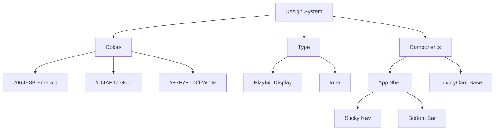
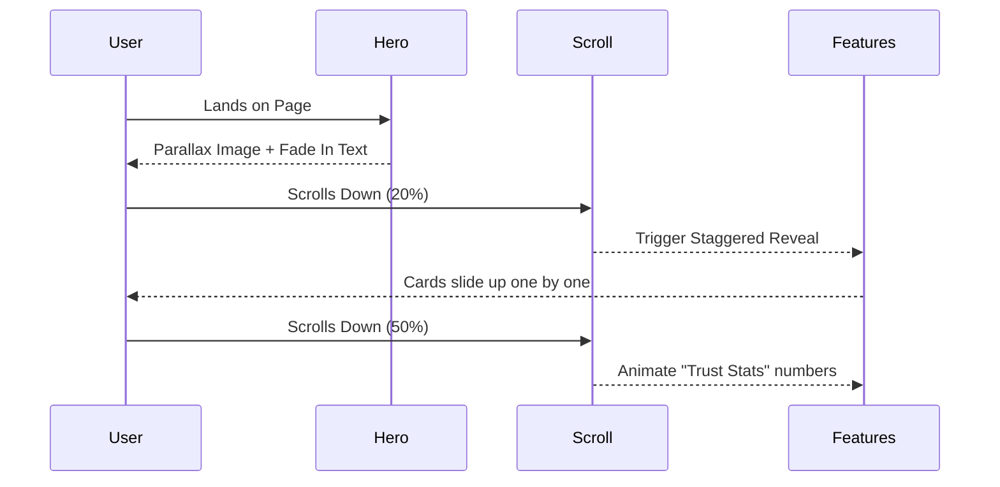
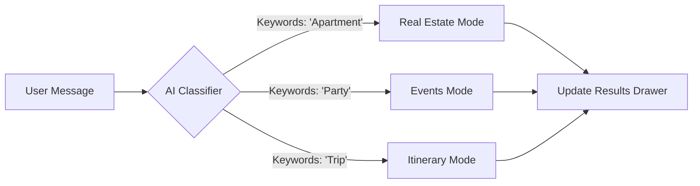
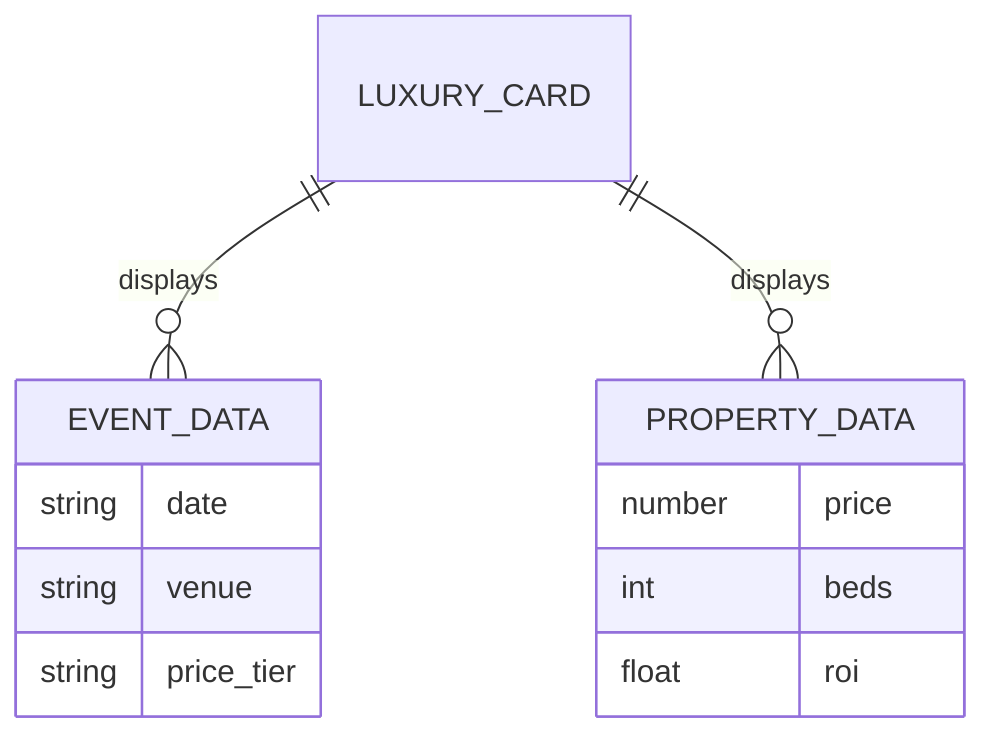
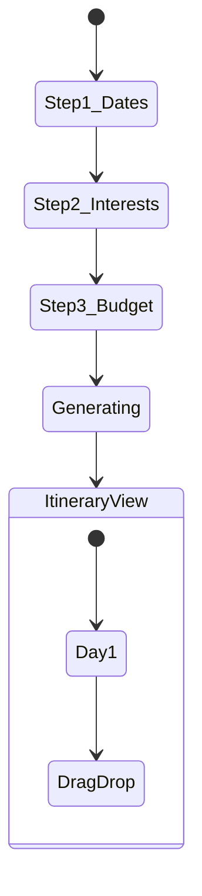

# 🚀 Mega-Implementation Plan: "i love Medellín" Luxury AI Platform

> **Status**: ⚪ Pending Start  
> **Aesthetic**: Luxury Eco-Modern (Playfair Display, Deep Emerald, Gold, Glassmorphism)  
> **Tech Stack**: React, Tailwind, Framer Motion, Supabase  

## 📊 Progress Tracker

- [x] **Phase 1**: Design System & Foundation (Tokens, Typography, Shell)
- [x] **Phase 2**: Immersive Homepage (Parallax, Scroll Storytelling)
- [x] **Phase 3**: Unified AI Concierge (Chat Logic, Results Drawer)
- [x] **Phase 4**: Discovery Modules (Events & Real Estate "Slots")
- [x] **Phase 5**: Trip Planner Wizard (Multi-step Logic)
- [x] **Phase 6**: Mobile Polish & Interactions
- [x] **Phase 7**: Final QA & Production Launch
- [x] **Phase 8**: Design Refinement & Production Safety (See `/docs/08-system-prompts-plan-next.md`)

## ⏭️ Next Phase: Content Population & Backend Integration
The design system is now production-ready. The next logical step is to replace mock data with real content or integrate Supabase for persistence.

---

## 🟢 Prompt 1: The "Luxury Eco-Modern" Foundation

**Objective**: Establish the global design tokens, typography, and responsive application shell.

### 🧩 Workflow Diagram: Design Tokens

### 📝 Natural Language Prompt
> "Create the fundamental design system for a luxury travel application.
> 
> 1.  **Global Styles**:
>     -   Implement a 'Luxury Eco-Modern' theme.
>     -   **Background**: Soft off-white (#F7F7F5).
>     -   **Typography**: Use `Playfair Display` for all Headings (Serif) and `Inter` for Body text.
>     -   **Shadows**: Create a custom 'diffused' shadow utility (`shadow-luxury`) that feels expensive.
> 
> 2.  **App Shell (Layout)**:
>     -   Create a responsive wrapper component `/components/layout/AppShell.tsx`.
>     -   **Desktop**: A glassmorphism sticky header with navigation links (Home, Events, Real Estate, Itinerary).
>     -   **Mobile**: A bottom navigation bar with elegant feather icons (Lucide React).
>     -   **Transitions**: Ensure the shell handles route transitions smoothly.
> 
> 3.  **Base Component**:
>     -   Create a `LuxuryCard` component. This is a generic visual container with 'Slots' for content (Image, Badge, Title, Meta Row). Do NOT add specific logic for Events or Real Estate yet.
>     -   Add a hover effect that slightly lifts the card and scales the image (zoom-in) using `framer-motion`."

### ✅ Success Criteria
- [ ] App renders with the correct off-white background and serif fonts.
- [ ] Navigation automatically switches between Top (Desktop) and Bottom (Mobile).
- [ ] `LuxuryCard` hover animations are smooth (no jank).

---

## 🟢 Prompt 2: The Immersive Homepage (Scroll Storytelling)

**Objective**: Create a high-impact landing page that feels like a magazine editorial.

### 🌊 User Journey: Scroll Flow

### 📝 Natural Language Prompt
> "Build the high-fidelity **Home Page** at `/pages/Home.tsx`.
> 
> 1.  **Hero Section**:
>     -   Full-screen height (`h-screen`) or 90vh.
>     -   **Visual**: A stunning background image of Medellín mountains (use `unsplash_tool`).
>     -   **Motion**: Apply a Parallax effect where the background moves slower than the foreground text.
>     -   **Copy**: 'Smarter Discovery for Medellín'.
> 
> 2.  **Animated Sections**:
>     -   **'Curated Categories'**: A grid of 3 cards (Nightlife, Nature, Investment) that stagger-fade in as the user scrolls into view.
>     -   **'How it Works'**: A horizontal step flow connected by an animated SVG line that draws itself as you scroll.
> 
> 3.  **Visual Polish**:
>     -   Use `framer-motion` for all scroll-triggered reveals (`whileInView`).
>     -   Ensure typography uses the global `Playfair Display` class for section headings."

### ✅ Success Criteria
- [ ] Hero text remains readable over the image (use overlay gradient).
- [ ] Scroll animations trigger *only* when the element enters the viewport.
- [ ] The "Connect Line" animation works or degrades gracefully.

---

## 🟢 Prompt 3: Unified AI Concierge (Chat & Drawer)

**Objective**: The core intelligent interface that persists across the app.

### 🧠 Logic Flow: Intent Switching

### 📝 Natural Language Prompt
> "Implement the **Unified AI Concierge** component.
> 
> 1.  **UI Layout**:
>     -   **Floating Action Button (FAB)**: A floating 'Sparkle' icon in the bottom-right.
>     -   **Interaction**: Clicking the FAB opens the Concierge Overlay.
>     -   **Desktop**: Split view (Chat on Left, Results Drawer on Right).
>     -   **Mobile**: Bottom Sheet (Swipeable).
> 
> 2.  **State Management**:
>     -   Create `AIContext` to manage `isOpen`, `intent` ('GENERAL', 'REAL_ESTATE', 'EVENTS'), and `messages`.
>     -   **Mock Intelligence**: If I type 'Show me condos', switch the interface tab to 'Real Estate' and show dummy property cards in the drawer.
> 
> 3.  **Visuals**:
>     -   Chat bubbles should differentiate clearly between User (Emerald) and AI (Gray).
>     -   The Results Drawer should use a Masonry Grid layout for cards."

### ✅ Success Criteria
- [ ] Chat interface opens/closes without layout shift.
- [ ] Typing keywords triggers a visible tab switch in the UI.
- [ ] Mobile bottom sheet can be dragged down to close.

---

## 🟢 Prompt 4: Discovery Modules (Slots Implementation)

**Objective**: Populate the Events and Real Estate pages using the generic `LuxuryCard`.

### 🗃️ Entity Relationship Diagram (Data)

### 📝 Natural Language Prompt
> "Build the **Events** (`/events`) and **Real Estate** (`/real-estate`) pages.
> 
> 1.  **Events Page**:
>     -   **Header**: 'Curated Experiences' with a pill-shaped category filter row.
>     -   **Grid**: Render `LuxuryCard` components. Map event data (Date, Time) to the card's `Meta-Secondary` slot.
>     -   **Map Toggle**: A floating button to switch between 'Grid View' and 'Map View'.
> 
> 2.  **Real Estate Page**:
>     -   **Header**: 'Investment Opportunities'.
>     -   **Grid**: Render `LuxuryCard` components. Map property data (Price, ROI) to the card's `Meta-Primary` slot.
>     -   **Badges**: Add 'High Yield' or 'Verified' badges to the card's `Badge-Slot`.
> 
> 3.  **Responsiveness**:
>     -   Mobile: 1 column.
>     -   Tablet: 2 columns.
>     -   Desktop: 3 columns."

### ✅ Success Criteria
- [ ] Both pages use the SAME `LuxuryCard` component but look contextually correct due to slot mapping.
- [ ] Filters are sticky or easily accessible.
- [ ] Layout breaks down correctly on mobile.

---

## 🟢 Prompt 5: Trip Planner Wizard (Complex State)

**Objective**: A multi-step form with drag-and-drop capabilities.

### ⚡ Action Workflow

### 📝 Natural Language Prompt
> "Create the **Trip Planner Wizard** at `/itinerary/new`.
> 
> 1.  **Wizard Steps**:
>     -   Create a multi-step form container with a progress bar.
>     -   **Step 1**: Date Range Picker (Calendar).
>     -   **Step 2**: Interest Selection (Selectable Chips: Culture, Nature, Food).
>     -   **Step 3**: Budget Slider.
> 
> 2.  **Itinerary Result**:
>     -   Show a vertical timeline of activities.
>     -   **Interaction**: Allow users to drag and drop activities to reorder them (use `dnd-kit` or similar logic).
>     -   **Summary Card**: A sticky card showing 'Total Estimated Cost'."

### ✅ Success Criteria
- [ ] Progress bar updates accurately.
- [ ] Users cannot proceed without filling required fields.
- [ ] Drag and drop reorders the list visually.

---

## 🛠️ Troubleshooting & QA

### Common Issues
1.  **Framer Motion Jitters**:
    *   *Fix*: Ensure `layout` prop is only used on parents, not every child. Use `AnimatePresence` for unmounting components.
2.  **Mobile Navigation Overlap**:
    *   *Fix*: Add `padding-bottom` to the main content area equal to the height of the Bottom Bar.
3.  **Z-Index Wars**:
    *   *Fix*: Define a z-index scale in `globals.css` (e.g., `--z-nav: 50`, `--z-modal: 100`).

### Acceptance Tests (Pre-Launch)
- [ ] **Visual**: Does the font hierarchy hold up on mobile? (No massive H1s).
- [ ] **Functional**: Does the "Ask Concierge" button work from *every* page?
- [ ] **Data**: Do empty states appear when no events/properties are found?
- [ ] **Performance**: Do images lazy load using the `ImageWithFallback` component?
