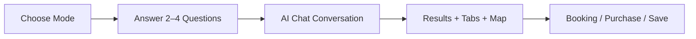

# 09-figma-design-prompts Luxury AI Concierge · Restaurants · Events · Rentals · Tourist

## 🔹 Short Summary (Plain English)

You are designing a premium, AI-powered city concierge.

**Users:**
1.  Choose what they want (Restaurants, Events, Rentals, Tourist)
2.  Answer a few simple questions
3.  Chat with an AI concierge
4.  See results with tabs + map
5.  Book, reserve, or purchase

**Your job in Figma is to design:**
*   The experience
*   The flow
*   The visual rules

👉 **No backend logic. No AI logic. No data fetching.**
Only what it looks like, how it feels, and how users move.

---

## 📊 Progress Tracker (Design Only)

| Phase | Status |
| :--- | :--- |
| Design system & style guide | ⬜ |
| Entry mode selection | ⬜ |
| Mini multi-step forms | ⬜ |
| AI chatbot UI | ⬜ |
| Results + tabs + map | ⬜ |
| Booking & CTA screens | ⬜ |
| Empty / loading / trust states | ⬜ |
| Mobile & tablet optimization | ⬜ |
| Final handoff to Cursor | ⬜ |

---

## 🌍 Features, Use Cases & Real-World Examples

| Feature | Real User Example | Outcome |
| :--- | :--- | :--- |
| **Mode Selection** | "I want events in Laureles" | User enters Events flow |
| **AI Chat** | "Describe the vibe you want" | AI refines results |
| **Tabs** | Events → Restaurants nearby | Cross-discovery |
| **Map View** | Tourist wants walkable spots | Visual exploration |
| **Booking CTA** | Football tickets | External ticket purchase |
| **Rentals** | Stay near event | Booking or inquiry |

---

## 🧭 Core User Journey (Simple)



---

## 🧱 DESIGN SYSTEM (FOUNDATION)

### 🟢 Figma Prompt 1 — Style Guide & Tokens
Create a luxury eco-modern design system.

**Typography:**
- Headings: Playfair Display (serif, editorial)
- Body: Inter (clean, readable)

**Colors:**
- Background: Off-white (#F7F7F5)
- Primary: Deep Emerald
- Accent: Soft Gold
- Text: Charcoal (not pure black)

**UI Style:**
- Large rounded corners
- Soft diffused shadows
- Calm spacing (no clutter)
- Glassmorphism panels

**Create:**
- Color tokens
- Type scale (H1–H5, body, captions)
- Spacing scale
- Shadow styles

---

## 🟢 ENTRY EXPERIENCE

### 🟢 Figma Prompt 2 — Mode Selection Screen
Design a full-screen mode selection page.

**Options:**
- Restaurants
- Events
- Rentals
- Tourist

**Each option:**
- Illustrated card (not flat)
- Icon + short description
- Hover lift & glow
- Tap animation for mobile

**Include:**
- Location selector (Poblado, Laureles, Envigado, Guatapé)
- Primary CTA: "Continue"

**Wireframe Intent:**
```text
[ Restaurant ]   [ Events ]
[ Rentals    ]   [ Tourist ]
```

---

## 🟢 MINI MULTI-STEP FORMS (PRE-AI)

### 🟢 Figma Prompt 3 — Mode-Specific Questions
Design a short, elegant multi-step form.

**Rules:**
- One question per screen
- Max 3–4 steps
- Large typography
- Calm transitions

**Examples:**
*Events:*
- Date range
- Event type
- Budget

*Restaurants:*
- Cuisine
- Vibe
- Budget

**Include:**
- Step indicator
- Back / Next buttons
- "Ask the Concierge instead" link

---

## 🧠 AI CHATBOT EXPERIENCE

### 🟢 Figma Prompt 4 — Unified AI Concierge
Design a luxury AI chat interface.

**Layout:**
*   **Desktop:** Left: Chat | Right: Results drawer
*   **Mobile:** Full screen chat | Swipe-up results panel

**Chat bubbles:**
- User: Emerald
- AI: Light gray glass

**Include:**
- Typing indicator
- AI confidence note (soft, editorial)
- Input with mic + send icon

---

## 🧩 RESULTS + TABS + MAP

### 🟢 Figma Prompt 5 — Results Layout
Design a results screen with tabs and map.

**Tabs (icon-based):**
- Events
- Restaurants
- Rentals
- Upcoming

**Rules:**
- Tabs auto-update by location
- Smooth underline animation
- Active tab highlighted

**Map:**
- Desktop: side panel
- Mobile: toggle button

**Cards:**
- Image
- Title
- Distance
- Badge (Popular / Near You)
- CTA

---

## 🗺️ MAP EXPERIENCE

### 🟢 Figma Prompt 6 — Map Interaction
Design map-first exploration.

**Features:**
- Pins synced with cards
- Card hover highlights pin
- Map optimized for mobile gestures

**Include:**
- Map/List toggle
- "Search this area" button

---

## 💳 BOOKING & CONVERSION

### 🟢 Figma Prompt 7 — Booking Surfaces
Design booking & purchase screens.

**Types:**
- External booking confirmation
- Internal booking form
- Lead capture for rentals / real estate

**Design:**
- Minimal form fields
- Trust microcopy
- Clear CTA

---

## ⚠️ TRUST, EMPTY & LOADING STATES

### 🟢 Figma Prompt 8 — Real-World Safety States
Design non-alarming system states.

**Include:**
- Loading skeletons
- Empty results with suggestions
- AI uncertainty note
- Unavailable booking state

**Tone:**
- Calm
- Honest
- Premium

---

## 📱 RESPONSIVE DESIGN RULES

### 🟢 Figma Prompt 9 — Responsive Frames
Create responsive layouts for:
- Mobile (iPhone)
- Tablet
- Desktop (1440px)

**Rules:**
- Touch targets ≥ 44px
- Bottom sheets on mobile
- No horizontal scroll

---

## 🎞️ MOTION & POLISH

### 🟢 Figma Prompt 10 — Motion Reference
Define animation guidelines.

**Include:**
- Card hover lift
- Button press scale
- Tab underline animation
- Drawer slide motion

**Transitions:**
- Slow
- Elegant
- No bounce

---

## 🚫 DO NOT DESIGN (IMPORTANT)

**Figma should NOT include:**
*   API logic
*   AI prompts
*   Database structure
*   Business rules

👉 **That belongs to Cursor**

---

## ✅ Final Output for Cursor Handoff

**Your Figma file should include:**
*   All screens
*   All states
*   Clear component naming
*   Content limits
*   Responsive behavior

After this → Cursor can build without guessing.

---

## 🧠 Final Takeaway

You are not designing pages.
You are designing a **conversation-powered experience**.

**This Figma system ensures:**
1.  Luxury feel
2.  Clarity
3.  AI trust
4.  Mobile excellence
5.  Zero implementation ambiguity
