# 10-figma-page-structure.md — Luxury AI Concierge Platform

## 🔹 Short Summary (Big Picture)

Your Figma file should represent **one connected system** with:
1.  A **public user experience** (discovery → chat → map → booking)
2.  A **guided AI flow** (mode → mini-wizard → results)
3.  A **backend admin/ops experience** (content, AI health, bookings)

**Everything is connected by one chatbot and shared map + tabs UI.**

---

## 🔄 Core User Flow (High Level)

---

## 📁 Figma File Top-Level Pages Structure

### 01 – Design System (Foundation)
*Purpose: Single source of truth for visuals.*

*   **Color Tokens**: Emerald (`#064E3B`), Gold (`#D4AF37`), Off-white (`#F7F7F5`).
*   **Typography**: `Playfair Display` (Headings), `Inter` (Body).
*   **Components**: Buttons, Cards (Event, Restaurant, Rental, Hotel), Badges.
*   **Icons**: Tab navigation, Map pins.
*   **Micro-interactions**: Hover states, loading skeletons.

### 02 – Marketing Pages (Entry Points)
*   **Screens**:
    *   Home Page (Hero + "Ask Concierge").
    *   Vertical Landings: Events, Restaurants, Rentals, Tours.
*   **Sections**: "How it Works", Trust Stats, Footer.
*   **CTA Flow**: Home → Mode Selection → Mini-Wizard.

### 03 – Mode Selection & Mini-Wizards (CRITICAL)
*Purpose: Capturing user intent before AI processing.*

#### Screen: Mode Selection
*   Cards: 🍽 Restaurants, 🎟 Events, 🏠 Rentals/Hotels, 🧭 Tourist.

#### Screens: Mini-Wizards (Per Mode)
*   **Events**: Location (Laureles, Poblado) → Time → Vibe.
*   **Restaurants**: Cuisine → Vibe → Budget.
*   **Rentals**: Dates → Guests.
*   **Tourist**: Interests.

```mermaid
sequenceDiagram
    participant User
    participant Wizard
    participant AI
    
    User->>Wizard: Selects "Events"
    Wizard->>User: Asks "Where in Medellín?"
    User->>Wizard: Selects "Poblado"
    Wizard->>User: Asks "When?"
    User->>Wizard: Selects "This Weekend"
    Wizard->>AI: Passes context (Events + Poblado + Weekend)
    AI-->>User: Opens Chat with tailored results
```

### 04 – AI Concierge (Chat + Tabs)
*The core interface combining chat and navigation.*

*   **Layout**:
    *   **Chat Panel**: Context-aware conversation.
    *   **Tabs**: 🎟 Events, 🍽 Restaurants, 🏨 Rentals, 🧭 Tourist, 🗺 Map.
*   **States**:
    *   Asking questions.
    *   AI Thinking / Processing.
    *   Confident Answer.
    *   Unverified / Suggestion Answer.

### 05 – Results & Map Screens
*   **Desktop**: Split View (Left: List, Right: Map).
*   **Mobile**: Tabbed View (List / Map toggle).
*   **Card Variants**:
    *   Event Card (Date, Ticket Badge).
    *   Restaurant Card (Rating, Distance).
    *   Rental Card (Price/night, Availability).

### 06 – Booking & Purchase Flows
*   **Entry Points**: "Buy Tickets", "Reserve Table", "Book Stay".
*   **Screens**:
    *   Booking Options (Direct vs External).
    *   Simple Form.
    *   Confirmation / Success.
    *   *Edge Case*: Unavailable / Sold Out.

### 07 – Saved & Itinerary
*   **Screens**:
    *   Saved Items List.
    *   Trip Timeline.
*   **Actions**: Remove, Replace, Share.

### 08 – Admin / Ops (Internal)
*These screens manage the platform's data health.*

*   **Content Manager**: Events, Restaurants, Rentals editors.
*   **AI Health**: Intent usage stats, Confidence logs, Failed searches.
*   **Bookings**: Ticket clicks, Form submissions, Property inquiries.
*   **Map Data**: Pin coverage heatmaps.

### 09 – Edge States & Trust
*   **Critical Screens**:
    *   No Results Found (with "Nearby" suggestions).
    *   Event Cancelled.
    *   Data Unavailable / API Down.
    *   AI Uncertainty Note ("I'm 70% sure about this...").

---

## 🎯 Example User Journey: "Tourist in Laureles"

---

## 🧠 What This Structure Enables
1.  **Unified Chatbot**: One brain for multiple verticals.
2.  **Location-Awareness**: Tabs update based on the user's selected area.
3.  **Booking-Ready UX**: Seamless transition from chat to transaction.
4.  **Admin Visibility**: Clear separation of user vs. ops experiences.

**✅ What NOT to Add in Figma:**
*   API logic
*   AI prompts
*   Database schemas
*   Error logs

*Those belong to Cursor code implementation.*
