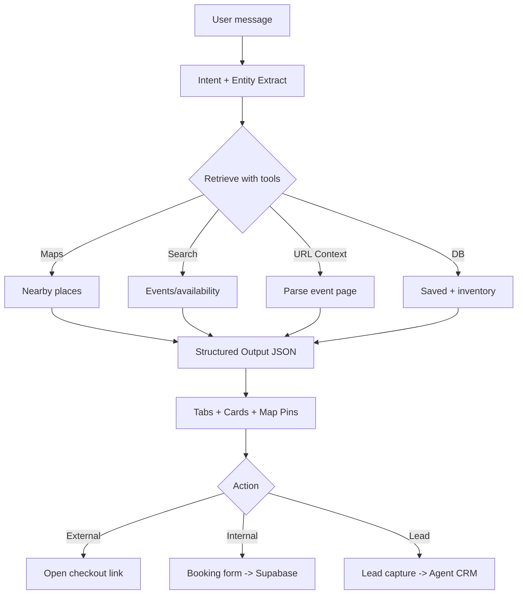

# 11-ai-features.md — AI Logic, Workflows & Automations

## 🔹 Executive Summary
This document defines the **Intelligence Layer** of the application.
It separates **Design Tasks (Figma)** from **Implementation Logic (Cursor/Code)** to ensure a clean handoff.

**The AI Goal:**
1.  **Ask** the right questions.
2.  **Fetch** grounded results (Search/Maps/URL).
3.  **Output** strict JSON for UI (Tabs + Map Pins).
4.  **Trigger** actions (Book, Reserve, Save, Contact).

---

## 🤖 Core AI Features (MVP)

1.  **Mode-Aware Concierge**: Context switching (Restaurants vs Events vs Rentals).
2.  **Location Memory**: "Laureles" persists across all tabs.
3.  **Smart Follow-Up**: 2-4 max questions to refine intent.
4.  **Grounded Results**: Real-time data with confidence levels (Verified/Partial/Unverified).
5.  **Tabbed Cross-Discovery**: "Events" trigger "Restaurants nearby" automatically.
6.  **Map-First Results**: Syncs pins with list cards + "Search this area" logic.
7.  **Booking Decision Engine**: Routes users to External Link, Internal Form, or Lead Capture.

---

## 🧠 AI Logic Model (The "Brain")

### One Message → 4 Steps
1.  **Understand**: Extract Intent & Entities.
2.  **Retrieve**: Call Tools (Maps, Search, DB).
3.  **Shape**: Format into strict JSON.
4.  **Act**: Trigger specific UI state or database write.



---

## 🎨 Figma Design Tasks (Visuals Only)
*These tasks belong in the Figma Design System files.*

### 1. Intelligence UI Components
*   **Follow-Up Cards**: Chat bubbles with "Quick Chips" (e.g., "$$", "$$$", "Tonight", "Weekend").
*   **Confidence Indicators**:
    *   ✅ Verified (Green check)
    *   ⚠️ Partial Info (Yellow warning)
    *   ❓ Unverified (Gray question)
*   **"Thinking" State**: Subtle pulse/shimmer animation while retrieval happens.

### 2. Cross-Discovery UI
*   **"Near this Event" Highlight**: Visual connection between an Event card and a Restaurant suggestion.
*   **Map Triggers**: "Search this Area" floating button (appears on map drag).

### 3. Action Sheets
*   **External Link Modal**: "Leaving App to book on Ticketmaster..."
*   **Internal Booking Form**: Native inputs for simple reservations.
*   **Lead Capture Form**: "Contact Agent" for high-ticket items (Rentals).
*   **Watchlist Toggle**: Bell icon state ("Notify me if available").

---

## 💻 Cursor Implementation Tasks (Code Logic)
*These tasks belong in the codebase (Supabase Edge Functions / Next.js API).*

### 🧩 Agents (Workflows)

#### 1) Intent Router (The Gatekeeper)
*   **Input**: `user_text`, `current_mode`, `location_context`.
*   **Output**: `primary_intent`, `secondary_tabs`, `entities`.
*   **Tool**: Gemini Thinking + Structured Output.

#### 2) Retrieval Agents (Per Tab)
*   **Events**: Google Search Grounding (Find tickets/dates).
*   **Restaurants**: Google Maps Grounding (Find reviews/hours/loc).
*   **Rentals**: Search + Internal DB (Inventory check).

#### 3) Ranking Agent
*   **Logic**: Takes raw results -> Assigns `match_score` + generates `why_it_matches` blurb.

#### 4) Booking Agent
*   **Logic**: Determines `action_type`:
    *   `EXTERNAL_LINK`
    *   `INTERNAL_FORM`
    *   `LEAD_CAPTURE`

### 🔁 Automations (Background Jobs)

#### A. Cross-Tab Enrichment
*   **Trigger**: User selects a specific Venue/Event.
*   **Action**: Fetch Restaurants (1km radius) & Rentals (3km radius).
*   **Result**: Populates "Restaurants" and "Stay" tabs silently.

#### B. Search This Area
*   **Trigger**: Map bounds change (drag/zoom).
*   **Action**: Re-run Retrieval Agent with new lat/long box.

#### C. Ops Monitoring (Cron)
*   **Trigger**: Daily midnight.
*   **Action**: Aggregate `ai_runs` table -> Report failed searches & low confidence queries.

---

## 🗂️ Data Requirements (Supabase)

| Table Name | Purpose |
| :--- | :--- |
| `saved_items` | User favorites / itinerary |
| `bookings` | Confirmed internal reservations |
| `leads` | High-value inquiries (Real Estate) |
| `ai_runs` | Logs for debugging & health checks |
| `watchlist` | Items to re-check availability for |

---

## ✅ Acceptance Criteria (Gherkin)

```gherkin
Scenario: Events mode triggers cross-tabs
  Given user selects "Bad Bunny Concert"
  And venue is "Atanasio Girardot Stadium"
  When the event details load
  Then the "Restaurants" tab should auto-populate
  And the results should be within 1.5km of the stadium

Scenario: Honest Availability
  Given user asks for "Tomorrowland Tickets"
  When AI cannot verify official stock
  Then UI shows "Unverified / Resale Only" warning
  And offers "Official Site" link (External Action)
```
