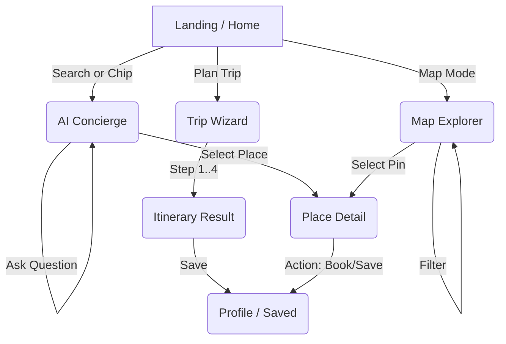
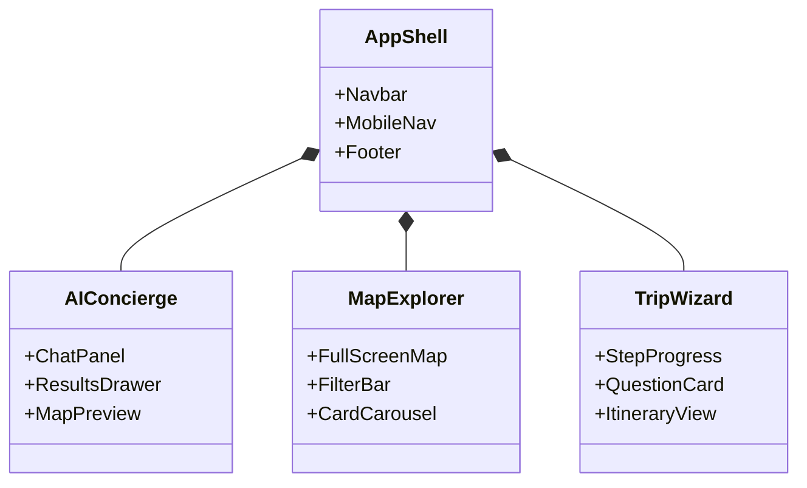

# 🏗️ i love Medellín — Implementation Plan

**Version:** 1.0
**Status:** In Progress
**Vision:** A location-aware AI concierge for Medellín that combines luxury editorial design with intelligent, actionable discovery.

---

## 📊 Progress Tracker

- [ ] **Phase 1: Foundation & Brand** (App Shell, Theme, Typography)
- [ ] **Phase 2: Marketing & Discovery** (Home, Map Explorer)
- [ ] **Phase 3: AI Concierge** (Chat UI, Split Views, Interaction Logic)
- [ ] **Phase 4: Trip Planner** (Wizard Flow, Itinerary Generation)
- [ ] **Phase 5: Detail & Action** (Place Details, Event Details)
- [ ] **Phase 6: Persistence & Profile** (Supabase Integration, Saved Lists)

---

## 🧩 Architecture & Flow

### User Journey Map

### Component Hierarchy

---

## 📝 Implementation Tasks

### Phase 1: Foundation & Visual Direction (Figma 01, 03, 10)
*Focus: Luxury feel, responsiveness, and layout shell.*

- [x] **Project Setup**: React, Tailwind, Framer Motion, Lucide Icons.
- [x] **Typography**: Configure `Playfair Display` (Headings) and `Inter` (Body).
- [x] **Theme Config**: Define "Medellín Accent" colors and luxury neutral palette in Tailwind.
- [x] **App Shell (Desktop)**: Create `MainLayout` with sticky header and content area.
- [x] **App Shell (Mobile)**: Implement bottom navigation or mobile drawer interactions.
- [x] **Motion System**: Create shared motion variants (fade-up, slow-scale) for consistent "luxury" feel.

### Phase 2: Marketing & Discovery (Figma 02, 05)
*Focus: Entry point and visual browsing.*

- [ ] **Hero Section**: Implement "Hero Search" with floating chips (Coffee, Events, etc.).
- [ ] **How It Works**: 3-step animated flow showing AI capabilities.
- [ ] **Feature Cards**: Glass-morphism cards for key features.
- [ ] **Map Explorer Page**:
    - Full-screen map container (Mapbox or Google Maps wrapper).
    - Floating filter bar (Distance, Rating, Open Now).
    - Bottom card carousel (Swipeable on mobile).

### Phase 3: AI Concierge (Figma 04)
*Focus: The core intelligent interface.*

- [ ] **Chat Interface**:
    - Left panel (desktop) / Full screen (mobile) for conversation.
    - Message bubbles with "Glass" aesthetic.
    - "Thinking" state animations.
- [ ] **Results Panel**:
    - Right panel (desktop) / Bottom Drawer (mobile).
    - Dynamic card rendering based on AI context.
- [ ] **Interaction Logic**:
    - Clicking a chat citation highlights a map pin.
    - Hovering a result card highlights a map pin.

### Phase 4: Trip Planner Wizard (Figma 06)
*Focus: Guided, high-value user flow.*

- [ ] **Wizard Container**: Multi-step form with progress bar.
- [ ] **Step 1: Duration**: UI for selecting days.
- [ ] **Step 2: Area**: Visual neighborhood selection.
- [ ] **Step 3: Interests**: Chip selection grid.
- [ ] **Step 4: Pace**: Slider or card selection (Relaxed vs Packed).
- [ ] **Itinerary View**: Day-by-day vertical timeline with map integration.

### Phase 5: Detail Pages (Figma 07)
*Focus: Conversion and depth.*

- [x] **Experience Detail Template**: (Implemented `ExperienceDetail.tsx` - needs refining for generic use).
- [ ] **Place Detail**: Adapt template for static places (Restaurants, Hotels).
- [ ] **Event Detail**: Variation for time-based events.
- [ ] **Sticky Actions**: Mobile-specific sticky bottom bar for "Save" / "Directions".

### Phase 6: Data & Persistence (Figma 08)
*Focus: User retention (Requires Supabase).*

- [ ] **Supabase Setup**: Connect project and define schema (`profiles`, `saved_places`, `itineraries`).
- [ ] **Auth UI**: Minimal login/signup modal.
- [ ] **Profile Page**: Tabbed view for Saved Places and Planned Trips.
- [ ] **Save Logic**: Toggle save state on cards.

---

## ✅ Success Criteria

### Core Experience
- [ ] **Speed**: Initial load under 1.5s.
- [ ] **Responsiveness**: Flawless layout on iPhone SE, iPad Air, and Desktop (1440p).
- [ ] **Motion**: No jarring layout shifts; all transitions use `ease-in-out` curves.
- [ ] **AI Feel**: The interface implies intelligence even with mock data (skeleton loaders, typing indicators).

### Mobile Specifics
- [ ] Search bar focuses smoothly.
- [ ] Bottom sheets snap correctly (peek, half, full).
- [ ] Touch targets are at least 44px.
- [ ] Map interactions (pan/zoom) do not conflict with page scroll.

---

## 🛠️ Production Checklist

- [ ] **Linting**: No console errors or unused imports.
- [ ] **Assets**: All images optimized and served via efficient CDN (Unsplash).
- [ ] **Accessibility**: proper `aria-labels` on icon buttons; keyboard navigation support.
- [ ] **Meta**: Dynamic titles and descriptions for SEO.
- [ ] **Error Handling**: Graceful fallbacks for missing images or failed API calls.
