# 🔌 PRODUCTION WIRING SYSTEM v1.0
## Frontend ↔ Backend ↔ AI - Production-Safe Architecture

**Date:** December 21, 2024  
**Status:** ✅ PRODUCTION-READY WITH FIXES  
**Purpose:** Complete wiring reference for designers & engineers

---

## 📊 SYSTEM ARCHITECTURE OVERVIEW

```mermaid
graph TB
    subgraph "🎨 FRONTEND LAYER"
        User[👤 User]
        UI[React UI<br/>• Forms<br/>• Loading States<br/>• Errors<br/>• Optimistic Updates]
        TempStore[Local State<br/>• Temp IDs<br/>• Optimistic Data<br/>• Pending Actions]
    end
    
    subgraph "🔐 EDGE FUNCTIONS LAYER"
        Auth[Auth Middleware<br/>✓ Validate JWT<br/>✓ Extract user_id<br/>✓ Check permissions]
        Router[API Router<br/>• /trips<br/>• /ai/chat<br/>• /jobs]
        Validator[Input Validator<br/>✓ Required fields<br/>✓ Business rules<br/>✓ Rate limits]
        JobQueue[Job Queue<br/>• Async tasks<br/>• Progress tracking<br/>• Checkpoints]
    end
    
    subgraph "🤖 AI LAYER"
        AIService[AI Service<br/>• Gemini Pro/Flash<br/>• Function calling<br/>• Structured output]
        AILogger[AI Audit Log<br/>⚠️ PII redacted<br/>• Request/Response<br/>• Token usage]
    end
    
    subgraph "💾 DATA LAYER"
        DB[(Database<br/>• Trips<br/>• Activities<br/>• Jobs<br/>• Idempotency)]
        Storage[(Storage<br/>• Photos<br/>• Documents)]
    end
    
    subgraph "💳 EXTERNAL SERVICES"
        Stripe[Stripe API<br/>• Payments<br/>• Webhooks]
        Maps[Google Maps<br/>• Geocoding<br/>• Directions]
    end
    
    User -->|1. Click Action| UI
    UI -->|2. Optimistic Update| TempStore
    UI -->|3. POST /api/trips| Auth
    Auth -->|4. Validate Token| Validator
    Validator -->|5a. Sync Action| DB
    Validator -->|5b. Long Action| JobQueue
    
    JobQueue -->|6. Process| AIService
    AIService -->|7. Log| AILogger
    AILogger --> DB
    
    Validator -->|8. Payment| Stripe
    Stripe -->|Webhook| Auth
    
    DB -->|9. Response| Auth
    Auth -->|10. Return Data| UI
    UI -->|11. Swap Temp→Real IDs| TempStore
    UI -->|12. Update Display| User
    
    AIService -.->|Proposal Only| Validator
    Validator -->|User Confirms| DB
    
    style Auth fill:#4ade80,stroke:#22c55e
    style Validator fill:#fb923c,stroke:#f97316
    style AIService fill:#60a5fa,stroke:#3b82f6
    style DB fill:#a78bfa,stroke:#8b5cf6
    style JobQueue fill:#fbbf24,stroke:#f59e0b
```



---

## 🔧 CORE WIRING PRINCIPLES (FIXED)

### **1. Frontend Responsibilities**

```
✅ DO:
- Validate UX (required fields, format, length)
- Show loading/error/success states
- Optimistic updates with temp IDs
- Local state management
- Retry failed requests
- Queue offline actions

❌ DON'T:
- Write directly to database
- Generate canonical IDs (use temp IDs only)
- Execute AI without backend
- Store sensitive data in localStorage
- Trust client-side validation alone
```

### **2. Backend (Edge Functions) Responsibilities**

```
✅ DO:
- Validate ALL inputs
- Check authentication on EVERY write
- Enforce business rules
- Generate canonical IDs
- Log all actions
- Handle idempotency
- Rate limit requests
- Sanitize logs (no PII)

❌ DON'T:
- Trust client data
- Run >30s operations synchronously
- Log raw user input (PII risk)
- Skip auth checks
- Expose internal errors to client
```

### **3. AI Layer Responsibilities**

```
✅ DO:
- Generate proposals/recommendations
- Return structured output
- Log with PII redaction
- Timeout gracefully
- Validate output schema

❌ DON'T:
- Write to database directly
- Execute side effects
- Run without user confirmation
- Return unvalidated data
- Store raw conversations (PII)
```

---

## ⚡ CRITICAL FIXES FROM AUDIT

### **FIX #1: Temp Client IDs** ✅

**Problem:** "Frontend never generates IDs" is too absolute  
**Solution:** Allow temp IDs, server IDs are canonical

```typescript
// ✅ CORRECT: Frontend uses temp IDs
const tempId = `temp_${crypto.randomUUID()}`;

const activity = {
  id: tempId,              // Temp ID for UI
  title: 'Eiffel Tower',
  status: 'pending'
};

// Add to UI immediately (optimistic)
setActivities([...activities, activity]);

// Send to backend
const response = await api.post('/activities', {
  client_temp_id: tempId,  // ✅ Include for mapping
  title: 'Eiffel Tower'
});

// Backend returns canonical ID
const canonicalId = response.data.id;

// Swap temp ID → canonical ID
setActivities(activities.map(a => 
  a.id === tempId ? { ...a, id: canonicalId } : a
));
```

**Backend Pattern:**
```typescript
app.post("/api/activities", async (c) => {
  const { client_temp_id, ...data } = await c.req.json();
  
  // Generate canonical ID
  const canonicalId = crypto.randomUUID();
  
  const activity = await db.insert({
    id: canonicalId,         // ✅ Server-generated
    client_temp_id,          // ✅ Store for deduplication
    ...data
  });
  
  return c.json({ 
    success: true, 
    data: { ...activity, client_temp_id } 
  });
});
```

---

### **FIX #2: Async Job Pattern for Long Operations** ✅

**Problem:** Edge Functions timeout at 30-60s, but "Deep Research" needs 5-10 min  
**Solution:** Use job queue for anything >30s


**Implementation:**

```typescript
// ✅ Edge Function - Start job
app.post("/api/research/start", async (c) => {
  const userId = await getUserId(c);
  const { query } = await c.req.json();
  
  // Create job
  const jobId = crypto.randomUUID();
  await db.insert('jobs', {
    id: jobId,
    user_id: userId,
    type: 'deep_research',
    status: 'queued',
    progress: 0,
    input: { query },
    created_at: new Date(),
  });
  
  // Queue for background worker
  await jobQueue.enqueue(jobId);
  
  // Return immediately
  return c.json({ 
    jobId, 
    status: 'queued',
    pollUrl: `/api/jobs/${jobId}`
  }, 202);
});

// ✅ Edge Function - Check job status
app.get("/api/jobs/:id", async (c) => {
  const userId = await getUserId(c);
  const jobId = c.req.param('id');
  
  const job = await db.get('jobs', jobId);
  
  // Verify ownership
  if (job.user_id !== userId) {
    return c.json({ error: 'Unauthorized' }, 403);
  }
  
  return c.json({
    jobId: job.id,
    status: job.status,
    progress: job.progress,
    result: job.result,
    error: job.error,
    checkpoints: job.checkpoints,
  });
});

// ✅ Background Worker
async function processResearchJob(jobId: string) {
  try {
    await updateJob(jobId, { status: 'processing', progress: 0 });
    
    // Step 1: Search
    const searchResults = await ai.search(query);
    await updateJob(jobId, { progress: 25, checkpoints: { search: searchResults } });
    
    // Step 2: Analyze
    const analysis = await ai.analyze(searchResults);
    await updateJob(jobId, { progress: 50, checkpoints: { analysis } });
    
    // Step 3: Rank
    const rankings = await ai.rank(analysis);
    await updateJob(jobId, { progress: 75, checkpoints: { rankings } });
    
    // Complete
    await updateJob(jobId, { 
      status: 'completed', 
      progress: 100,
      result: rankings 
    });
    
  } catch (error) {
    await updateJob(jobId, { 
      status: 'failed', 
      error: error.message,
      progress: -1
    });
  }
}
```

**UI Implementation:**

```typescript
// ✅ React Hook for Job Polling
function useJobStatus(jobId: string | null) {
  const [job, setJob] = useState(null);
  const [polling, setPolling] = useState(false);
  
  useEffect(() => {
    if (!jobId) return;
    
    let interval: NodeJS.Timeout;
    let pollDelay = 2000; // Start at 2s
    
    const poll = async () => {
      try {
        const response = await api.get(`/jobs/${jobId}`);
        setJob(response.data);
        
        // Stop polling if completed or failed
        if (response.data.status === 'completed' || 
            response.data.status === 'failed') {
          setPolling(false);
          clearInterval(interval);
          return;
        }
        
        // Backoff: increase delay if stable
        if (response.data.progress > 0) {
          pollDelay = Math.min(pollDelay * 1.5, 10000); // Max 10s
        }
        
      } catch (error) {
        console.error('Poll error:', error);
      }
    };
    
    // Start polling
    setPolling(true);
    interval = setInterval(poll, pollDelay);
    poll(); // Initial poll
    
    return () => clearInterval(interval);
  }, [jobId]);
  
  return { job, polling };
}

// ✅ Progress Screen Component
function ResearchProgressScreen({ jobId }: { jobId: string }) {
  const { job, polling } = useJobStatus(jobId);
  
  if (!job) return <Loading />;
  
  if (job.status === 'failed') {
    return (
      <ErrorScreen 
        message={job.error}
        onRetry={() => retryJob(jobId)}
      />
    );
  }
  
  if (job.status === 'completed') {
    return <ResearchResults data={job.result} />;
  }
  
  return (
    <div className="progress-screen">
      <h2>Deep Research in Progress</h2>
      <ProgressBar value={job.progress} />
      <p className="status-text">
        {getStatusMessage(job.progress)}
      </p>
      
      {/* Show partial results */}
      {job.checkpoints && (
        <PartialResults checkpoints={job.checkpoints} />
      )}
      
      <Button onClick={() => cancelJob(jobId)}>
        Cancel
      </Button>
    </div>
  );
}
```

---

### **FIX #3: PII-Safe AI Logging** ✅

**Problem:** Logging "input, prompt, response" stores PII (emails, phones, passports)  
**Solution:** Redact PII + retention policies

```typescript
// ✅ PII Redaction Utility
function redactPII(text: string): string {
  return text
    // Email
    .replace(/[\w.-]+@[\w.-]+\.\w+/g, '[EMAIL]')
    // Phone
    .replace(/\b\d{3}[-.]?\d{3}[-.]?\d{4}\b/g, '[PHONE]')
    // Credit card
    .replace(/\b\d{4}[\s-]?\d{4}[\s-]?\d{4}[\s-]?\d{4}\b/g, '[CARD]')
    // SSN
    .replace(/\b\d{3}-\d{2}-\d{4}\b/g, '[SSN]')
    // Passport
    .replace(/\b[A-Z]{1,2}\d{6,9}\b/g, '[PASSPORT]');
}

// ✅ AI Call Logging
async function callAI(prompt: string, userId: string) {
  const startTime = Date.now();
  
  try {
    // Call AI
    const response = await gemini.generateContent(prompt);
    const duration = Date.now() - startTime;
    
    // ✅ Log with PII redaction
    await db.insert('ai_logs', {
      id: crypto.randomUUID(),
      user_id: userId,
      model: 'gemini-pro',
      prompt_redacted: redactPII(prompt),        // ✅ Redacted
      response_redacted: redactPII(response),    // ✅ Redacted
      structured_output: parseStructuredOutput(response), // ✅ Typed data
      token_usage: response.usageMetadata,
      duration_ms: duration,
      created_at: new Date(),
      expires_at: new Date(Date.now() + 30 * 24 * 60 * 60 * 1000), // ✅ 30 day retention
      consent_level: 'usage_only', // ✅ Data classification
    });
    
    return response;
    
  } catch (error) {
    // Log error (no PII)
    await db.insert('ai_logs', {
      id: crypto.randomUUID(),
      user_id: userId,
      model: 'gemini-pro',
      error: error.message,
      created_at: new Date(),
    });
    throw error;
  }
}

// ✅ Auto-cleanup old logs
async function cleanupAILogs() {
  await db.execute(`
    DELETE FROM ai_logs 
    WHERE expires_at < NOW()
  `);
}
```

**Database Schema:**

```sql
CREATE TABLE ai_logs (
  id UUID PRIMARY KEY,
  user_id UUID NOT NULL,
  model VARCHAR(50) NOT NULL,
  
  -- Redacted versions (safe to store)
  prompt_redacted TEXT,
  response_redacted TEXT,
  
  -- Structured data (typed, no PII)
  structured_output JSONB,
  
  -- Metadata
  token_usage JSONB,
  duration_ms INTEGER,
  error TEXT,
  
  -- Data governance
  consent_level VARCHAR(50) DEFAULT 'usage_only',
  data_classification VARCHAR(50) DEFAULT 'internal',
  
  -- Retention
  created_at TIMESTAMP DEFAULT NOW(),
  expires_at TIMESTAMP, -- Auto-delete after N days
  
  INDEX idx_user_created (user_id, created_at),
  INDEX idx_expires (expires_at)
);

-- Auto-delete expired logs
CREATE OR REPLACE FUNCTION cleanup_expired_logs()
RETURNS void AS $$
BEGIN
  DELETE FROM ai_logs WHERE expires_at < NOW();
END;
$$ LANGUAGE plpgsql;

-- Run daily
SELECT cron.schedule('cleanup-ai-logs', '0 2 * * *', 'SELECT cleanup_expired_logs()');
```

---

### **FIX #4: Payment Webhook Pattern** ✅

**Problem:** If you treat payments like normal POSTs, you'll get duplicates/fraud  
**Solution:** Webhook is source of truth


**Implementation:**

```typescript
// ✅ Create Payment Intent
app.post("/api/bookings/create", async (c) => {
  const userId = await getUserId(c);
  const { hotelId, dates } = await c.req.json();
  
  // Create booking in DB
  const bookingId = crypto.randomUUID();
  await db.insert('bookings', {
    id: bookingId,
    user_id: userId,
    hotel_id: hotelId,
    dates,
    status: 'payment_pending',
    amount: 18000, // $180
    currency: 'usd',
  });
  
  // Create Stripe PaymentIntent
  const paymentIntent = await stripe.paymentIntents.create({
    amount: 18000,
    currency: 'usd',
    metadata: {
      booking_id: bookingId,
      user_id: userId,
    },
  });
  
  // Store payment intent ID
  await db.update('bookings', bookingId, {
    payment_intent_id: paymentIntent.id,
  });
  
  return c.json({
    bookingId,
    clientSecret: paymentIntent.client_secret,
  });
});

// ✅ Webhook Handler (source of truth)
app.post("/api/webhooks/stripe", async (c) => {
  const sig = c.req.header('stripe-signature');
  const body = await c.req.text();
  
  let event;
  try {
    // ✅ CRITICAL: Verify webhook signature
    event = stripe.webhooks.constructEvent(
      body,
      sig,
      process.env.STRIPE_WEBHOOK_SECRET
    );
  } catch (err) {
    console.error('Webhook signature verification failed:', err);
    return c.json({ error: 'Invalid signature' }, 400);
  }
  
  // Handle events
  if (event.type === 'payment_intent.succeeded') {
    const paymentIntent = event.data.object;
    const bookingId = paymentIntent.metadata.booking_id;
    
    // ✅ Update booking status
    await db.update('bookings', bookingId, {
      status: 'paid',
      paid_at: new Date(),
    });
    
    // ✅ Trigger confirmation email
    await sendConfirmationEmail(bookingId);
  }
  
  if (event.type === 'payment_intent.payment_failed') {
    const paymentIntent = event.data.object;
    const bookingId = paymentIntent.metadata.booking_id;
    
    await db.update('bookings', bookingId, {
      status: 'payment_failed',
      error: paymentIntent.last_payment_error?.message,
    });
  }
  
  return c.json({ received: true });
});

// ✅ Check Booking Status
app.get("/api/bookings/:id", async (c) => {
  const userId = await getUserId(c);
  const bookingId = c.req.param('id');
  
  const booking = await db.get('bookings', bookingId);
  
  // Verify ownership
  if (booking.user_id !== userId) {
    return c.json({ error: 'Unauthorized' }, 403);
  }
  
  return c.json(booking);
});
```

**Database Schema:**

```sql
CREATE TABLE bookings (
  id UUID PRIMARY KEY,
  user_id UUID NOT NULL REFERENCES users(id),
  hotel_id UUID NOT NULL,
  
  -- Status state machine
  status VARCHAR(50) NOT NULL DEFAULT 'payment_pending',
  -- payment_pending → processing → paid → confirmed
  -- payment_pending → payment_failed
  
  -- Payment
  amount INTEGER NOT NULL,
  currency VARCHAR(3) NOT NULL,
  payment_intent_id VARCHAR(255),
  payment_method VARCHAR(50),
  
  -- Timestamps
  created_at TIMESTAMP DEFAULT NOW(),
  paid_at TIMESTAMP,
  confirmed_at TIMESTAMP,
  
  -- Metadata
  metadata JSONB,
  error TEXT,
  
  INDEX idx_user_status (user_id, status),
  INDEX idx_payment_intent (payment_intent_id)
);

-- ✅ Prevent duplicate payments
CREATE UNIQUE INDEX idx_unique_payment 
ON bookings(payment_intent_id) 
WHERE payment_intent_id IS NOT NULL;
```

---

### **FIX #5: Idempotency with Database Enforcement** ✅

**Problem:** Current idempotency uses memory cache, doesn't survive restarts  
**Solution:** Store in database with unique constraint

```typescript
// ✅ Database Schema
CREATE TABLE idempotency_keys (
  user_id UUID NOT NULL,
  key VARCHAR(255) NOT NULL,
  action VARCHAR(100) NOT NULL,
  
  -- Store response
  response_status INTEGER NOT NULL,
  response_body JSONB NOT NULL,
  result_id UUID, -- ID of created resource
  
  created_at TIMESTAMP DEFAULT NOW(),
  expires_at TIMESTAMP DEFAULT (NOW() + INTERVAL '24 hours'),
  
  PRIMARY KEY (user_id, key, action),
  INDEX idx_expires (expires_at)
);

// ✅ Idempotent POST Handler
app.post("/api/trips/:id/items", async (c) => {
  const userId = await getUserId(c);
  const tripId = c.req.param('id');
  const idempotencyKey = c.req.header('Idempotency-Key');
  const body = await c.req.json();
  
  // ✅ Check if already processed
  if (idempotencyKey) {
    const existing = await db.query(`
      SELECT response_status, response_body, result_id
      FROM idempotency_keys
      WHERE user_id = $1 AND key = $2 AND action = 'create_item'
      AND expires_at > NOW()
    `, [userId, idempotencyKey]);
    
    if (existing) {
      // ✅ Return cached response
      return c.json(existing.response_body, existing.response_status);
    }
  }
  
  // Process request
  const item = await db.addTripItem(tripId, body);
  
  const response = {
    success: true,
    data: item,
  };
  
  // ✅ Store for idempotency
  if (idempotencyKey) {
    await db.insert('idempotency_keys', {
      user_id: userId,
      key: idempotencyKey,
      action: 'create_item',
      response_status: 201,
      response_body: response,
      result_id: item.id,
    });
  }
  
  return c.json(response, 201);
});

// ✅ Cleanup expired keys (daily job)
async function cleanupIdempotencyKeys() {
  await db.execute(`
    DELETE FROM idempotency_keys 
    WHERE expires_at < NOW()
  `);
}
```

**Frontend Usage:**

```typescript
// ✅ React Hook with Idempotency
function useIdempotentMutation() {
  const idempotencyKeyRef = useRef(crypto.randomUUID());
  
  const mutate = async (endpoint: string, data: any) => {
    const response = await fetch(endpoint, {
      method: 'POST',
      headers: {
        'Content-Type': 'application/json',
        'Authorization': `Bearer ${token}`,
        'Idempotency-Key': idempotencyKeyRef.current, // ✅ Same key on retry
      },
      body: JSON.stringify(data),
    });
    
    if (!response.ok) {
      throw new Error('Request failed');
    }
    
    return response.json();
  };
  
  // Reset key after success
  const reset = () => {
    idempotencyKeyRef.current = crypto.randomUUID();
  };
  
  return { mutate, reset };
}

// ✅ Usage in Component
function AddActivityModal() {
  const { mutate, reset } = useIdempotentMutation();
  
  const handleSubmit = async () => {
    try {
      const result = await mutate('/api/trips/123/items', formData);
      toast.success('Activity added!');
      reset(); // ✅ Generate new key for next action
      onClose();
    } catch (error) {
      // ✅ Same key will be used on retry
      toast.error('Failed. Click to retry.');
    }
  };
  
  return (
    <form onSubmit={handleSubmit}>
      {/* ... */}
    </form>
  );
}
```

---

## 📐 COMPLETE SYSTEM FLOW DIAGRAM

```mermaid
flowchart TB
    Start([👤 User Action]) --> Validate{Frontend<br/>Validation}
    
    Validate -->|❌ Invalid| ShowError[Show Error<br/>Toast]
    ShowError --> End1([❌ End])
    
    Validate -->|✅ Valid| Optimistic[Optimistic Update<br/>+ Temp ID]
    Optimistic --> APICall[API Request<br/>+ Idempotency Key]
    
    APICall --> Auth{Auth<br/>Middleware}
    Auth -->|❌ Invalid| Revert[Revert Optimistic<br/>Update]
    Revert --> ShowError
    
    Auth -->|✅ Valid| ExtractUser[Extract user_id<br/>from JWT]
    
    ExtractUser --> CheckIdem{Check<br/>Idempotency}
    CheckIdem -->|Found| ReturnCached[Return Cached<br/>Response]
    ReturnCached --> SwapIDs
    
    CheckIdem -->|Not Found| ValidateBiz{Business<br/>Rules}
    ValidateBiz -->|❌ Fail| Return400[Return 400<br/>Error]
    Return400 --> Revert
    
    ValidateBiz -->|✅ Pass| CheckDuration{Duration<br/>>30s?}
    
    CheckDuration -->|No| SyncWrite[Write to DB<br/>Generate ID]
    SyncWrite --> StoreIdem[Store Idempotency<br/>Key]
    StoreIdem --> Return200[Return 200<br/>Success]
    
    CheckDuration -->|Yes| CreateJob[Create Job<br/>Return 202]
    CreateJob --> JobQueue[(Job Queue)]
    JobQueue --> Worker[Background<br/>Worker]
    Worker --> AICall{Need AI?}
    
    AICall -->|Yes| CallAI[Call AI Service<br/>+ PII Redaction]
    CallAI --> LogAI[Log AI Call<br/>with Retention]
    LogAI --> SaveJob
    
    AICall -->|No| SaveJob[Save Job Result<br/>+ Checkpoints]
    
    SaveJob --> JobComplete{Job<br/>Complete?}
    JobComplete -->|No| Worker
    JobComplete -->|Yes| NotifyUser[Update Job<br/>Status]
    
    Return200 --> SwapIDs[Swap Temp ID<br/>→ Canonical ID]
    NotifyUser --> UIUpdate
    SwapIDs --> UIUpdate[Update UI<br/>State]
    
    UIUpdate --> End2([✅ End])
    
    style Auth fill:#4ade80
    style ValidateBiz fill:#fb923c
    style CallAI fill:#60a5fa
    style SyncWrite fill:#a78bfa
    style CreateJob fill:#fbbf24
    style Optimistic fill:#c084fc
```



---

## 🔄 SEQUENCE DIAGRAMS

### **Diagram 1: Sync Action (Generate → Review → Save)**


---

### **Diagram 2: Async Job (Deep Research with Progress)**


---

### **Diagram 3: Payment Flow (Webhook-Driven)**

```mermaid
sequenceDiagram
    autonumber
    participant User
    participant UI
    participant EdgeFunction
    participant DB
    participant Stripe
    
    User->>UI: Click "Book Hotel ($180)"
    
    UI->>EdgeFunction: POST /api/bookings/create<br/>{ hotelId, dates }
    
    EdgeFunction->>DB: INSERT booking<br/>status: "payment_pending"
    DB-->>EdgeFunction: bookingId: "book_123"
    
    EdgeFunction->>Stripe: Create PaymentIntent<br/>amount: 18000 (cents)
    Stripe-->>EdgeFunction: { id: "pi_456", client_secret: "..." }
    
    EdgeFunction->>DB: UPDATE booking<br/>payment_intent_id: "pi_456"
    
    EdgeFunction-->>UI: { bookingId: "book_123",<br/>clientSecret: "pi_456_secret_..." }
    
    UI->>UI: Show Stripe payment form
    User->>UI: Enter card details
    
    UI->>Stripe: Confirm payment with client secret
    Stripe-->>UI: { status: "processing" }
    
    UI->>UI: Show "Processing payment..."<br/>⚠️ DO NOT trust this status
    
    rect rgb(255, 200, 200)
        Note over UI,Stripe: ⚠️ CRITICAL: Don't trust client<br/>Wait for webhook confirmation
    end
    
    loop Poll every 2s
        UI->>EdgeFunction: GET /api/bookings/book_123
        EdgeFunction->>DB: SELECT booking
        DB-->>EdgeFunction: { status: "payment_pending" }
        EdgeFunction-->>UI: Still pending...
    end
    
    rect rgb(200, 255, 200)
        Note over Stripe,DB: ✅ SOURCE OF TRUTH: Webhook
        Stripe->>EdgeFunction: POST /webhooks/stripe<br/>payment_intent.succeeded
        
        EdgeFunction->>EdgeFunction: ✅ Verify webhook signature
        
        EdgeFunction->>DB: UPDATE booking<br/>status: "paid", paid_at: NOW()
        
        EdgeFunction->>EdgeFunction: Send confirmation email
        
        EdgeFunction-->>Stripe: 200 OK (acknowledge webhook)
    end
    
    UI->>EdgeFunction: GET /api/bookings/book_123
    EdgeFunction->>DB: SELECT booking
    DB-->>EdgeFunction: { status: "paid", paid_at: "..." }
    EdgeFunction-->>UI: Payment confirmed!
    
    UI->>UI: Show success screen
    UI-->>User: "Booking confirmed! ✅"
```



---

## 🎨 UI STATE COMPONENTS

### **Component 1: Loading States**

```typescript
// ✅ Loading State Component
export function LoadingState({ message, progress }: {
  message?: string;
  progress?: number;
}) {
  return (
    <div className="loading-state">
      {/* Skeleton or Spinner */}
      {progress !== undefined ? (
        <>
          <ProgressBar value={progress} className="w-full" />
          <p className="text-sm text-gray-600 mt-2">
            {message || `${progress}% complete`}
          </p>
        </>
      ) : (
        <>
          <Spinner size="lg" />
          <p className="text-sm text-gray-600 mt-2">
            {message || 'Loading...'}
          </p>
        </>
      )}
    </div>
  );
}

// ✅ Usage Examples
<LoadingState message="Saving activity..." />
<LoadingState message="Generating itinerary..." progress={45} />
<LoadingState message="Processing payment..." />
```

### **Component 2: Error States**

```typescript
// ✅ Error State Component
export function ErrorState({ 
  error, 
  onRetry, 
  onCancel 
}: {
  error: string | Error;
  onRetry?: () => void;
  onCancel?: () => void;
}) {
  const errorMessage = typeof error === 'string' ? error : error.message;
  
  return (
    <div className="error-state">
      <div className="error-icon">
        <AlertCircle className="w-12 h-12 text-red-500" />
      </div>
      
      <h3 className="text-lg font-semibold text-gray-900 mt-4">
        Something went wrong
      </h3>
      
      <p className="text-sm text-gray-600 mt-2 max-w-md">
        {errorMessage}
      </p>
      
      <div className="flex gap-3 mt-6">
        {onRetry && (
          <Button onClick={onRetry} variant="default">
            <RefreshCw className="w-4 h-4 mr-2" />
            Try Again
          </Button>
        )}
        {onCancel && (
          <Button onClick={onCancel} variant="outline">
            Cancel
          </Button>
        )}
      </div>
    </div>
  );
}

// ✅ Usage
<ErrorState 
  error="Failed to save activity. Please check your connection."
  onRetry={handleRetry}
  onCancel={handleCancel}
/>
```

### **Component 3: AI Confirmation Modal**

```typescript
// ✅ AI Action Confirmation Modal
export function AIConfirmationModal({
  open,
  onClose,
  onConfirm,
  action,
  aiProposal,
  loading,
}: {
  open: boolean;
  onClose: () => void;
  onConfirm: () => void;
  action: string;
  aiProposal: {
    title: string;
    description: string;
    changes: string[];
    reasoning?: string;
  };
  loading?: boolean;
}) {
  return (
    <Dialog open={open} onOpenChange={onClose}>
      <DialogContent className="max-w-2xl">
        <DialogHeader>
          <DialogTitle>AI Suggestion: {action}</DialogTitle>
          <DialogDescription>
            Review the AI's proposal before applying changes
          </DialogDescription>
        </DialogHeader>
        
        <div className="space-y-4">
          {/* Proposal Details */}
          <div className="bg-blue-50 border border-blue-200 rounded-lg p-4">
            <h4 className="font-semibold text-blue-900">
              {aiProposal.title}
            </h4>
            <p className="text-sm text-blue-800 mt-1">
              {aiProposal.description}
            </p>
          </div>
          
          {/* Changes List */}
          <div>
            <h5 className="text-sm font-medium text-gray-700 mb-2">
              Changes:
            </h5>
            <ul className="space-y-2">
              {aiProposal.changes.map((change, i) => (
                <li key={i} className="flex items-start gap-2 text-sm">
                  <Check className="w-4 h-4 text-green-500 mt-0.5" />
                  <span>{change}</span>
                </li>
              ))}
            </ul>
          </div>
          
          {/* AI Reasoning (Optional) */}
          {aiProposal.reasoning && (
            <details className="text-sm">
              <summary className="cursor-pointer text-gray-600 hover:text-gray-900">
                Why did the AI suggest this?
              </summary>
              <p className="text-gray-600 mt-2 pl-4 border-l-2 border-gray-200">
                {aiProposal.reasoning}
              </p>
            </details>
          )}
        </div>
        
        <DialogFooter>
          <Button
            variant="outline"
            onClick={onClose}
            disabled={loading}
          >
            Cancel
          </Button>
          <Button
            onClick={onConfirm}
            disabled={loading}
          >
            {loading ? (
              <>
                <Spinner className="w-4 h-4 mr-2" />
                Applying...
              </>
            ) : (
              <>
                <Check className="w-4 h-4 mr-2" />
                Apply Changes
              </>
            )}
          </Button>
        </DialogFooter>
      </DialogContent>
    </Dialog>
  );
}

// ✅ Usage
const [aiProposal, setAIProposal] = useState(null);
const [confirmOpen, setConfirmOpen] = useState(false);

// AI generates proposal
const handleOptimize = async () => {
  const proposal = await api.post('/ai/optimize-itinerary', { tripId });
  setAIProposal(proposal.data);
  setConfirmOpen(true); // ✅ User must confirm
};

// User confirms
const handleConfirm = async () => {
  await api.post('/trips/123/apply-optimization', aiProposal);
  toast.success('Itinerary optimized!');
  setConfirmOpen(false);
};

<AIConfirmationModal
  open={confirmOpen}
  onClose={() => setConfirmOpen(false)}
  onConfirm={handleConfirm}
  action="Optimize Itinerary"
  aiProposal={aiProposal}
/>
```

### **Component 4: Progress Tracker (Jobs)**

```typescript
// ✅ Progress Tracker Component
export function ProgressTracker({
  jobId,
  onComplete,
  onError,
}: {
  jobId: string;
  onComplete: (result: any) => void;
  onError: (error: string) => void;
}) {
  const { job, polling } = useJobStatus(jobId);
  
  if (!job) return <LoadingState />;
  
  if (job.status === 'failed') {
    return (
      <ErrorState 
        error={job.error || 'Job failed'}
        onRetry={() => window.location.reload()}
      />
    );
  }
  
  if (job.status === 'completed') {
    useEffect(() => {
      onComplete(job.result);
    }, []);
    return null;
  }
  
  return (
    <div className="progress-tracker">
      <div className="text-center mb-6">
        <h3 className="text-lg font-semibold">
          {getJobTitle(job.type)}
        </h3>
        <p className="text-sm text-gray-600 mt-1">
          {getJobStatusMessage(job.progress)}
        </p>
      </div>
      
      {/* Progress Bar */}
      <div className="mb-6">
        <div className="flex justify-between text-sm text-gray-600 mb-2">
          <span>Progress</span>
          <span>{job.progress}%</span>
        </div>
        <ProgressBar value={job.progress} className="h-2" />
      </div>
      
      {/* Checkpoints (Partial Results) */}
      {job.checkpoints && (
        <div className="space-y-3 mb-6">
          <h4 className="text-sm font-medium text-gray-700">
            Progress:
          </h4>
          {Object.entries(job.checkpoints).map(([key, value]) => (
            <div key={key} className="flex items-center gap-2">
              <CheckCircle className="w-4 h-4 text-green-500" />
              <span className="text-sm text-gray-600">
                {formatCheckpoint(key, value)}
              </span>
            </div>
          ))}
        </div>
      )}
      
      {/* Cancel Button */}
      <Button
        variant="outline"
        onClick={() => cancelJob(jobId)}
        className="w-full"
      >
        Cancel
      </Button>
    </div>
  );
}

// ✅ Helper Functions
function getJobStatusMessage(progress: number): string {
  if (progress < 25) return 'Starting research...';
  if (progress < 50) return 'Analyzing options...';
  if (progress < 75) return 'Ranking results...';
  return 'Finalizing report...';
}

function formatCheckpoint(key: string, value: any): string {
  switch (key) {
    case 'search':
      return `Found ${value.count} results`;
    case 'analysis':
      return `Analyzed ${value.count} options`;
    case 'rankings':
      return `Ranked top ${value.top} choices`;
    default:
      return `Completed ${key}`;
  }
}
```

### **Component 5: Success Screen**

```typescript
// ✅ Success State Component
export function SuccessScreen({
  title,
  message,
  actions,
}: {
  title: string;
  message: string;
  actions?: Array<{
    label: string;
    onClick: () => void;
    variant?: 'default' | 'outline';
  }>;
}) {
  return (
    <div className="success-screen">
      <div className="success-icon">
        <CheckCircle className="w-16 h-16 text-green-500" />
      </div>
      
      <h3 className="text-xl font-semibold text-gray-900 mt-4">
        {title}
      </h3>
      
      <p className="text-gray-600 mt-2 max-w-md text-center">
        {message}
      </p>
      
      {actions && (
        <div className="flex gap-3 mt-6">
          {actions.map((action, i) => (
            <Button
              key={i}
              onClick={action.onClick}
              variant={action.variant || 'default'}
            >
              {action.label}
            </Button>
          ))}
        </div>
      )}
    </div>
  );
}

// ✅ Usage
<SuccessScreen
  title="Activity Added!"
  message="Your activity has been saved to the itinerary."
  actions={[
    { label: 'View Trip', onClick: () => navigate('/trip/123') },
    { label: 'Add Another', onClick: resetForm, variant: 'outline' },
  ]}
/>
```

---

## 📋 PRODUCTION CHECKLIST

Now I'll create the comprehensive roadmap checklist document...
