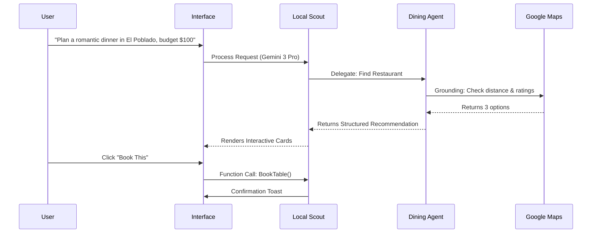

# Local Scout AI: Implementation Master Plan & Design System

## 📊 Progress Tracker

| Phase | Status | Completion | Focus Area |
|-------|--------|------------|------------|
| **Phase 1: UI & Architecture** | 🔲 Pending | 0% | Design System, App Shell, Routing, Mobile Layouts |
| **Phase 2: Core AI Engine** | 🔲 Pending | 0% | Agent Registry, Event Bus, Gemini 3 Pro Integration |
| **Phase 3: Intelligent Features** | 🔲 Pending | 0% | Function Calling, RAG, Maps Grounding (Top 5 Features) |
| **Phase 4: Production Polish** | 🔲 Pending | 0% | Error Handling, Rate Limiting, Acceptance Testing |

---

## 🔗 Context & References
This implementation plan builds directly upon the analysis in **[`/docs/ai-features/chatai.md`](./chatai.md)**.
**Key Focus:** Implementing the "Top 10 Core Advanced AI Features" specifically for the **Trip Operating System**.

---

## 1. System Architecture & Workflows

### High-Level Architecture (Mermaid)

```mermaid
graph TD
    User[User Interface] -->|Natural Language| API[Next.js API Routes]
    API -->|Orchestration| MainAgent[Local Scout "Conductor"]
    
    subgraph "Agent Hive (Event Bus)"
        MainAgent -->|Delegates| Dining[Dining Orchestrator]
        MainAgent -->|Delegates| Budget[Budget Guardian]
        MainAgent -->|Delegates| Logistics[Logistics Manager]
        MainAgent -->|Delegates| Researcher[Deep Researcher]
    end
    
    subgraph "AI Capabilities (Gemini)"
        Dining -->|Function Call| Res[Reservation API]
        Budget -->|Code Exec| Calc[Cost Calculator]
        Logistics -->|Maps Grounding| Maps[Google Maps API]
        Researcher -->|RAG| VectorDB[User Preferences DB]
    end
    
    Dining -->|Structured JSON| UI_Update[UI Card Update]
    Budget -->|Alert| UI_Notif[Toast Notification]
```

### User Journey: "The Perfect Date Night"



---

## 2. UI/UX Design & Visual Hierarchy

### Design Philosophy
*   **Mobile-First but Desktop-Rich**: Drag-and-drop works on touch, but expands for mouse precision.
*   **Card-Based Intelligence**: Every AI response is a structured card (Restaurant, Flight, Activity) not just text.
*   **Glassmorphism & Neobrutalism**: Clean, modern aesthetic with high contrast for readability.

### Page Structure & Routes

| Route | Page Name | Core Components | AI Agent Interaction |
|-------|-----------|-----------------|----------------------|
| `/` | **Command Center** | `ChatInterface`, `ItineraryCanvas`, `AgentStatusHub` | **Local Scout**: Triage & General Chat |
| `/trip/[id]` | **Trip Detail** | `TimelineView`, `BudgetDashboard`, `MapOverlay` | **Logistics Manager**: Route optimization |
| `/explore` | **Discovery** | `GeminiGallery`, `VisualSearch`, `FilterChips` | **Deep Researcher**: RAG-based suggestions |
| `/settings` | **Agent Config** | `PreferenceToggles`, `APIKeyManager`, `VectorStoreStatus` | **System**: Memory management |

### Component Visuals (Wireframe Descriptions)

#### A. The "Command Bar" (Floating Bottom)
*   **Visual**: Floating glass pill at bottom center (mobile) or centered input (desktop).
*   **Action**: Multi-modal input (Text, Voice, Image Upload).
*   **Feedback**: Pulsing ring animation when Agents are "Thinking".

#### B. The "Itinerary Canvas" (Main Stage)
*   **Visual**: Kanban-style board divided by Days (columns) or Time (rows).
*   **Interaction**: Drag-and-drop cards. Cards snap to grid.
*   **AI Overlay**: "Ghost" cards appear where AI suggests activities.

#### C. The "Agent Sidebar" (Context)
*   **Visual**: Collapsible right panel showing active agents.
*   **Status**: "Budget Guardian is calculating..." (Yellow status dot).
*   **Debug**: Click to see the raw JSON thought process (Thinking Mode).

---

## 3. Implementation Tasks

### 🔴 Core Tasks (Phase 1 & 2)

#### 1. Setup & Design System
- [ ] **Install Dependencies**: `framer-motion`, `lucide-react`, `clsx`, `tailwind-merge`.
- [ ] **Typography**: Configure `Inter` (UI) and `JetBrains Mono` (Code/Data).
- [ ] **Global State**: Setup `useTripStore` (Zustand) for itinerary state.

#### 2. The Agent Engine
- [ ] **Interface**: Create `Agent` class with `processRequest()`, `schema`, and `tools`.
- [ ] **Registry**: Build `AgentRegistry` to manage instances (Dining, Budget, etc.).
- [ ] **Event Bus**: Implement simple Pub/Sub for inter-agent communication.

#### 3. Core AI Integration (Top 5 Features)
- [ ] **Function Calling**: Implement `execute_action` for DB writes.
- [ ] **Structured Outputs**: Force JSON schema for all agent responses.
- [ ] **Gemini 3 Pro**: Connect client to high-reasoning model for complex queries.

### 🔵 Advanced Tasks (Phase 3)

#### 4. Intelligence Layer
- [ ] **RAG Pipeline**: Vectorize user history -> store in local vector mock -> retrieve on query.
- [ ] **Maps Grounding**: Create helper util to validate locations against real coords.
- [ ] **Code Execution**: Add sandbox for Budget Agent to run math safely.

---

## 4. Production Readiness Checklist

### ✅ Reliability
- [ ] **Fallback Mechanism**: If Gemini 3 Pro fails, fall back to Gemini Flash.
- [ ] **Rate Limiting**: Debounce user inputs (500ms).
- [ ] **Error Boundaries**: Wrap AI components; if generation fails, show "Retry" button.

### ✅ User Experience
- [ ] **Skeleton Loaders**: Show shimmering cards while AI "thinks".
- [ ] **Optimistic UI**: Update Itinerary *immediately* on drop, revert if API fails.
- [ ] **Streaming Text**: Stream AI responses for perceived speed.

### ✅ Security
- [ ] **Input Sanitization**: Strip HTML/SQL from user prompts.
- [ ] **Environment Variables**: Verify `NEXT_PUBLIC_GEMINI_KEY` is not exposed if proxying.

---

## 5. Mega-Prompts for AI Implementation

*Copy and paste these prompts into your AI coding assistant to generate the system module by module.*

### Prompt 1: The UI Foundation & Shell
```markdown
**Role**: Senior Frontend Architect
**Task**: Create the core App Shell and Design System for "Local Scout".
**Context**: Next.js, Tailwind CSS, ShadCN UI, Lucide Icons.

**Requirements**:
1.  **Layout**: Create a `DashboardLayout` with a collapsible Sidebar (Agents) and a Main Canvas (Itinerary).
2.  **Theme**: Dark mode default. Colors: Slate (900) background, Indigo (500) accents.
3.  **Components**:
    *   `ChatInput`: Floating bottom bar with attachment icon.
    *   `ItineraryCard`: A drag-and-drop card component with `title`, `time`, `cost`, `tags`.
    *   `AgentBadge`: Circular avatar with status indicator (green/yellow/red).
4.  **Responsive**: Sidebar becomes a bottom sheet on Mobile.

**Output**: All necessary `.tsx` files and `globals.css` updates.
```

### Prompt 2: The Agent Brain (Core Logic)
```markdown
**Role**: AI Systems Engineer
**Task**: Implement the Multi-Agent Orchestrator.
**Context**: TypeScript, Design Patterns (Observer, Strategy).

**Requirements**:
1.  **Base Class**: Create `BaseAgent` with standard methods: `think()`, `act()`, `communicate()`.
2.  **Specialists**: Extend `BaseAgent` for:
    *   `DiningAgent`: Focus on food/reservations.
    *   `BudgetAgent`: Focus on math/currency.
3.  **Event Bus**: Create `AgentBus` singleton. Agents subscribe to topics like `TRIP_UPDATE`, `NEW_MESSAGE`.
4.  **Gemini Integration**: Mock the API call in `think()` to return Structured JSON: `{ action: "add_item", params: {...}, reason: "..." }`.

**Output**: `/lib/agents/` directory structure and class files.
```

### Prompt 3: The Intelligence Features (RAG + Maps)
```markdown
**Role**: Data Scientist / Engineer
**Task**: Implement RAG and Grounding utilities.
**Context**: Local storage (simulated DB), Geolib (for distance).

**Requirements**:
1.  **Vector Mock**: Create a simple Cosine Similarity function to match user query against a JSON file of "Past Trips".
2.  **Maps Tool**: Create `validateLocation(query)` that returns mock lat/long and rating.
3.  **Context Injection**: Modify the `BaseAgent.think()` prompt to include:
    *   *Retrieved Context* (from RAG).
    *   *Real-time Data* (from Maps Tool).
    
**Output**: `/lib/intelligence/rag.ts` and `/lib/intelligence/maps.ts`.
```

---

## 6. Troubleshooting & Testing

### Common Issues
| Symptom | Probable Cause | Fix |
|---------|----------------|-----|
| **AI hallucinates places** | Grounding disabled | Enable `Google Maps Grounding` in Agent config. |
| **JSON Parse Error** | Weak model / No Schema | Switch to `Gemini 1.5 Pro` + Enforce `response_format: json_object`. |
| **Agents ignoring each other** | Event Bus broken | Check subscription logic in `AgentRegistry.init()`. |

### Acceptance Tests (Manual)
1.  **The "Complex Plan" Test**: Ask "Plan a 3-day trip to Tokyo for $500".
    *   *Pass Criteria*: Itinerary populated with ~9 items, total cost calculated within 10% of $500.
2.  **The "Conflict" Test**: Add a dinner at 7 PM when a show is at 7 PM.
    *   *Pass Criteria*: Logistics Manager pops up a warning toast/modal.
3.  **The "Context" Test**: "Find a place like the one I liked in Paris".
    *   *Pass Criteria*: RAG retrieves "Paris" preference and suggests similar style.
