# Entity Relationship Diagram — Data Model

**Date:** December 20, 2024  
**Status:** Current + Proposed Schema  
**Purpose:** Complete data model documentation

---

## 2️⃣ ENTITY RELATIONSHIP DIAGRAM

### Current + Proposed Schema

```mermaid
erDiagram
    USER ||--o{ TRIP : creates
    USER ||--o{ SAVED_PLACE : saves
    USER ||--o{ CONVERSATION : has
    USER ||--o{ PREFERENCE : has
    USER {
        string id PK "➕ Proposed"
        string email "➕ Proposed"
        string name "➕ Proposed"
        timestamp created_at "➕ Proposed"
        timestamp last_active "➕ Proposed"
    }

    TRIP ||--o{ DAY : contains
    TRIP ||--o{ TRIP_ITEM : has
    TRIP ||--o{ BUDGET_ENTRY : tracks
    TRIP {
        string id PK "✅ Existing"
        string user_id FK "➕ Proposed"
        string name "✅ Existing"
        string destination "✅ Existing"
        date start_date "✅ Existing"
        date end_date "✅ Existing"
        number budget "✅ Existing"
        number travelers "✅ Existing"
        string image "✅ Existing"
        string description "✅ Existing"
        timestamp created_at "➕ Proposed"
        timestamp updated_at "➕ Proposed"
    }

    DAY ||--o{ TRIP_ITEM : contains
    DAY {
        string id PK "✅ Existing"
        string trip_id FK "✅ Existing"
        number day_number "✅ Existing"
        date date "✅ Existing"
        string title "✅ Existing"
    }

    TRIP_ITEM }o--|| PLACE : references
    TRIP_ITEM {
        string id PK "✅ Existing"
        string trip_id FK "✅ Existing"
        string day_id FK "✅ Existing"
        string place_id FK "➕ Proposed link"
        string title "✅ Existing"
        string type "✅ Existing: logistics|food|activity|stay"
        string time "✅ Existing"
        string duration "✅ Existing"
        number cost "✅ Existing"
        string notes "✅ Existing"
        string image "✅ Existing"
        string status "✅ Existing: planned|booked|confirmed"
        number location_lat "✅ Existing"
        number location_lng "✅ Existing"
        number order_index "➕ Proposed"
        timestamp created_at "➕ Proposed"
    }

    SAVED_PLACE }o--|| PLACE : references
    SAVED_PLACE {
        string id PK "➕ Proposed"
        string user_id FK "➕ Proposed"
        string place_id FK "➕ Proposed"
        string collection_id FK "➕ Proposed nullable"
        string notes "➕ Proposed"
        timestamp saved_at "➕ Proposed"
    }

    PLACE ||--o{ REVIEW : has
    PLACE ||--o{ PHOTO : has
    PLACE {
        string id PK "➕ Proposed"
        string title "✅ Existing (in mock)"
        string category "✅ Existing (in mock)"
        string description "➕ Proposed"
        number rating "✅ Existing (in mock)"
        number reviews_count "✅ Existing (in mock)"
        string price_level "✅ Existing (in mock)"
        string address "➕ Proposed"
        number lat "✅ Existing (in mock)"
        number lng "✅ Existing (in mock)"
        string[] tags "✅ Existing (in mock)"
        string image "✅ Existing (in mock)"
        json opening_hours "➕ Proposed"
        string phone "➕ Proposed"
        string website "➕ Proposed"
        boolean is_open "✅ Existing (in mock)"
        string source "➕ Proposed: google|mock|manual"
        timestamp created_at "➕ Proposed"
        timestamp updated_at "➕ Proposed"
    }

    CONVERSATION ||--o{ MESSAGE : contains
    CONVERSATION {
        string id PK "➕ Proposed"
        string user_id FK "➕ Proposed"
        string title "➕ Proposed"
        string intent "✅ Existing (in AIContext)"
        timestamp created_at "➕ Proposed"
        timestamp updated_at "➕ Proposed"
    }

    MESSAGE ||--o{ AI_RUN : may_trigger
    MESSAGE {
        string id PK "✅ Existing (in AIContext)"
        string conversation_id FK "➕ Proposed"
        string role "✅ Existing: user|ai|system"
        string content "✅ Existing"
        boolean is_thinking "✅ Existing"
        json metadata "➕ Proposed"
        timestamp created_at "➕ Proposed"
    }

    AI_RUN ||--o{ AGENT_RESPONSE : produces
    AI_RUN {
        string id PK "➕ Proposed"
        string message_id FK "➕ Proposed"
        string intent "➕ Proposed"
        string[] agents_invoked "➕ Proposed"
        string status "➕ Proposed: pending|processing|complete|error"
        number duration_ms "➕ Proposed"
        timestamp created_at "➕ Proposed"
    }

    AGENT_RESPONSE {
        string id PK "➕ Proposed"
        string ai_run_id FK "➕ Proposed"
        string agent_type "➕ Proposed"
        string status "➕ Proposed"
        json data "➕ Proposed"
        json suggestions "➕ Proposed"
        number confidence "➕ Proposed"
        string error "➕ Proposed nullable"
        timestamp created_at "➕ Proposed"
    }

    BUDGET_ENTRY {
        string id PK "➕ Proposed"
        string trip_id FK "➕ Proposed"
        string trip_item_id FK "➕ Proposed nullable"
        string category "➕ Proposed"
        number amount "➕ Proposed"
        string currency "➕ Proposed"
        string description "➕ Proposed"
        timestamp created_at "➕ Proposed"
    }

    COLLECTION ||--o{ SAVED_PLACE : contains
    COLLECTION {
        string id PK "➕ Proposed"
        string user_id FK "➕ Proposed"
        string title "✅ Existing (in mock)"
        string description "➕ Proposed"
        string cover_image "➕ Proposed"
        timestamp created_at "➕ Proposed"
    }

    PREFERENCE {
        string id PK "➕ Proposed"
        string user_id FK "➕ Proposed"
        string key "➕ Proposed"
        json value "➕ Proposed"
        timestamp updated_at "➕ Proposed"
    }

    REVIEW {
        string id PK "➕ Proposed"
        string place_id FK "➕ Proposed"
        string user_id FK "➕ Proposed"
        number rating "➕ Proposed"
        string content "➕ Proposed"
        timestamp created_at "➕ Proposed"
    }

    PHOTO {
        string id PK "➕ Proposed"
        string place_id FK "➕ Proposed"
        string url "➕ Proposed"
        string caption "➕ Proposed"
        number order_index "➕ Proposed"
    }
```



---

## ENTITY DETAILS

### ✅ EXISTING ENTITIES (In Code)

#### 1. Trip (TripDetailsContext)
**Currently Stored:** localStorage per `tripId`

```typescript
// ✅ Exists in code
interface Trip {
  id: string;
  name: string;
  destination: string;
  startDate: string;
  endDate: string;
  budget: number;
  travelers: number;
  image?: string;
  description?: string;
}
```

**Gaps:**
- ❌ No `user_id` (can't associate with user)
- ❌ No `created_at`, `updated_at` (can't track changes)
- ❌ No sharing/collaboration fields

---

#### 2. TripItem (TripDetailsContext)
**Currently Stored:** localStorage in `days[]` structure

```typescript
// ✅ Exists in code
interface TripItem {
  id: string;
  time?: string;
  title: string;
  type: 'logistics' | 'food' | 'activity' | 'stay';
  duration?: string;
  notes?: string;
  image?: string;
  status?: 'planned' | 'booked' | 'confirmed';
  cost?: number;
  location_lat?: number;
  location_lng?: number;
}
```

**Gaps:**
- ❌ No `place_id` (can't link to saved places)
- ❌ No `day_id` explicitly (implicit in array structure)
- ❌ No `order_index` (relies on array order)
- ❌ No `created_at` (can't track when added)

---

#### 3. Day (TripDetailsContext)
**Currently Stored:** Derived from date range

```typescript
// ✅ Exists in code
interface Day {
  dayNumber: number;
  date: string;
  title: string;
  items: TripItem[];
}
```

**Gaps:**
- ❌ No explicit `id` (uses index)
- ❌ No `trip_id` foreign key

---

#### 4. Message (AIContext)
**Currently Stored:** localStorage `medellin_ai_context_v2`

```typescript
// ✅ Exists in code
interface Message {
  id: string;
  role: 'user' | 'ai' | 'system';
  content: string;
  isThinking?: boolean;
}
```

**Gaps:**
- ❌ No `conversation_id` (all in one array)
- ❌ No `created_at` (can't sort chronologically)
- ❌ No metadata (can't track AI run details)

---

#### 5. SavedItem (AIContext)
**Currently Stored:** localStorage `medellin_ai_context_v2`

```typescript
// ✅ Exists in code
interface SavedItem {
  id: string;
  type: 'property' | 'event' | 'experience' | 'itinerary';
  title: string;
  image?: string;
  date?: string;
  price?: string;
  location?: string;
  lat?: number;
  lng?: number;
  notes?: string;
  data?: any;
}
```

**Gaps:**
- ❌ No `user_id` (anonymous)
- ❌ No `place_id` reference (duplicates data)
- ❌ No `collection_id` (can't organize)
- ❌ No `saved_at` timestamp

---

### ➕ PROPOSED NEW ENTITIES

#### 1. USER (Critical)
**Purpose:** User identity and authentication

```typescript
interface User {
  id: string;
  email: string;
  name: string;
  avatar_url?: string;
  created_at: timestamp;
  last_active: timestamp;
}
```

**Why Needed:**
- Can't save data without user identity
- Required for Supabase auth
- Needed for multi-device sync

---

#### 2. PLACE (Critical)
**Purpose:** Canonical place data (deduplicated)

```typescript
interface Place {
  id: string;
  title: string;
  category: string;
  description?: string;
  rating?: number;
  reviews_count?: number;
  price_level?: string;
  address: string;
  lat: number;
  lng: number;
  tags: string[];
  image?: string;
  opening_hours?: json;
  phone?: string;
  website?: string;
  is_open?: boolean;
  source: 'google' | 'mock' | 'manual';
  created_at: timestamp;
  updated_at: timestamp;
}
```

**Why Needed:**
- Avoid data duplication (currently duplicated in SavedItem, TripItem, etc.)
- Single source of truth for place data
- Can update place info globally

---

#### 3. CONVERSATION (Important)
**Purpose:** Organize messages into threads

```typescript
interface Conversation {
  id: string;
  user_id: string;
  title: string;
  intent: string;
  created_at: timestamp;
  updated_at: timestamp;
}
```

**Why Needed:**
- Currently all messages in one array
- Need to organize by topic/trip
- Better chat history management

---

#### 4. AI_RUN (Important)
**Purpose:** Track AI agent executions

```typescript
interface AI_Run {
  id: string;
  message_id: string;
  intent: string;
  agents_invoked: string[];
  status: 'pending' | 'processing' | 'complete' | 'error';
  duration_ms: number;
  created_at: timestamp;
}
```

**Why Needed:**
- Debug AI performance
- Track which agents are used
- Analytics on AI effectiveness

---

#### 5. AGENT_RESPONSE (Important)
**Purpose:** Store individual agent outputs

```typescript
interface AgentResponse {
  id: string;
  ai_run_id: string;
  agent_type: string;
  status: string;
  data: json;
  suggestions: json;
  confidence: number;
  error?: string;
  created_at: timestamp;
}
```

**Why Needed:**
- Track agent performance
- Cache agent results
- Debug agent issues

---

#### 6. COLLECTION (Nice-to-have)
**Purpose:** Organize saved places

```typescript
interface Collection {
  id: string;
  user_id: string;
  title: string;
  description?: string;
  cover_image?: string;
  created_at: timestamp;
}
```

**Why Needed:**
- Currently collections exist in UI but no data model
- Users want to organize saves (e.g., "Romantic Getaway", "Coffee Tour")

---

## RELATIONSHIP ANALYSIS

### Current State

```
Currently: Flat localStorage blobs with no relationships

AIContext.savedItems = SavedItem[]  (disconnected)
TripContext.events = Event[]        (mock, no persistence)
TripDetailsContext.days = Day[]     (per trip, no user link)
```

**Problems:**
1. No referential integrity
2. Data duplication (same place saved multiple times)
3. Can't query relationships (e.g., "all trips to Medellín")
4. Can't link trip items back to saved places

---

### Proposed State

```
USER (1) ──── (M) TRIP
USER (1) ──── (M) SAVED_PLACE ──── (1) PLACE
USER (1) ──── (M) CONVERSATION ──── (M) MESSAGE
TRIP (1) ──── (M) DAY ──── (M) TRIP_ITEM ──── (1) PLACE
TRIP (1) ──── (M) BUDGET_ENTRY
MESSAGE (1) ──── (1) AI_RUN ──── (M) AGENT_RESPONSE
```

**Benefits:**
1. ✅ Referential integrity via foreign keys
2. ✅ No data duplication (place data canonical)
3. ✅ Can query relationships
4. ✅ Can trace trip items to saved places
5. ✅ Can track AI performance

---

## MIGRATION STRATEGY

### Phase 1: Add Missing Fields (No Breaking Changes)

```typescript
// Step 1: Extend existing interfaces
interface Trip {
  // ✅ Keep existing fields
  id: string;
  name: string;
  // ...
  
  // ➕ Add new fields (optional for backward compat)
  user_id?: string;
  created_at?: timestamp;
  updated_at?: timestamp;
}
```

---

### Phase 2: Normalize Data (Breaking Change)

```typescript
// Step 2: Create Place entity
interface SavedPlace {
  id: string;
  user_id: string;
  place_id: string;  // ➕ Reference to Place
  notes?: string;
  saved_at: timestamp;
}

// Step 3: Link TripItem to Place
interface TripItem {
  // ✅ Keep existing fields
  id: string;
  title: string;
  // ...
  
  // ➕ Add place reference
  place_id?: string;  // Optional: only if created from saved place
}
```

---

### Phase 3: Supabase Schema

```sql
-- Users (managed by Supabase Auth)
CREATE TABLE users (
  id UUID PRIMARY KEY DEFAULT uuid_generate_v4(),
  email TEXT UNIQUE NOT NULL,
  name TEXT,
  created_at TIMESTAMPTZ DEFAULT NOW(),
  last_active TIMESTAMPTZ DEFAULT NOW()
);

-- Places (canonical data)
CREATE TABLE places (
  id UUID PRIMARY KEY DEFAULT uuid_generate_v4(),
  title TEXT NOT NULL,
  category TEXT NOT NULL,
  description TEXT,
  rating DECIMAL(2,1),
  reviews_count INTEGER,
  price_level TEXT,
  address TEXT,
  lat DECIMAL(10,8),
  lng DECIMAL(11,8),
  tags TEXT[],
  image TEXT,
  opening_hours JSONB,
  phone TEXT,
  website TEXT,
  is_open BOOLEAN,
  source TEXT NOT NULL,
  created_at TIMESTAMPTZ DEFAULT NOW(),
  updated_at TIMESTAMPTZ DEFAULT NOW()
);

-- Trips
CREATE TABLE trips (
  id UUID PRIMARY KEY DEFAULT uuid_generate_v4(),
  user_id UUID REFERENCES users(id) ON DELETE CASCADE,
  name TEXT NOT NULL,
  destination TEXT NOT NULL,
  start_date DATE NOT NULL,
  end_date DATE NOT NULL,
  budget DECIMAL(10,2),
  travelers INTEGER DEFAULT 1,
  image TEXT,
  description TEXT,
  created_at TIMESTAMPTZ DEFAULT NOW(),
  updated_at TIMESTAMPTZ DEFAULT NOW()
);

-- Days
CREATE TABLE days (
  id UUID PRIMARY KEY DEFAULT uuid_generate_v4(),
  trip_id UUID REFERENCES trips(id) ON DELETE CASCADE,
  day_number INTEGER NOT NULL,
  date DATE NOT NULL,
  title TEXT
);

-- Trip Items
CREATE TABLE trip_items (
  id UUID PRIMARY KEY DEFAULT uuid_generate_v4(),
  trip_id UUID REFERENCES trips(id) ON DELETE CASCADE,
  day_id UUID REFERENCES days(id) ON DELETE CASCADE,
  place_id UUID REFERENCES places(id) ON DELETE SET NULL,
  title TEXT NOT NULL,
  type TEXT NOT NULL CHECK (type IN ('logistics', 'food', 'activity', 'stay')),
  time TEXT,
  duration TEXT,
  cost DECIMAL(10,2),
  notes TEXT,
  image TEXT,
  status TEXT CHECK (status IN ('planned', 'booked', 'confirmed')),
  location_lat DECIMAL(10,8),
  location_lng DECIMAL(11,8),
  order_index INTEGER,
  created_at TIMESTAMPTZ DEFAULT NOW()
);

-- Saved Places
CREATE TABLE saved_places (
  id UUID PRIMARY KEY DEFAULT uuid_generate_v4(),
  user_id UUID REFERENCES users(id) ON DELETE CASCADE,
  place_id UUID REFERENCES places(id) ON DELETE CASCADE,
  collection_id UUID REFERENCES collections(id) ON DELETE SET NULL,
  notes TEXT,
  saved_at TIMESTAMPTZ DEFAULT NOW(),
  UNIQUE(user_id, place_id)
);

-- Collections
CREATE TABLE collections (
  id UUID PRIMARY KEY DEFAULT uuid_generate_v4(),
  user_id UUID REFERENCES users(id) ON DELETE CASCADE,
  title TEXT NOT NULL,
  description TEXT,
  cover_image TEXT,
  created_at TIMESTAMPTZ DEFAULT NOW()
);

-- Conversations
CREATE TABLE conversations (
  id UUID PRIMARY KEY DEFAULT uuid_generate_v4(),
  user_id UUID REFERENCES users(id) ON DELETE CASCADE,
  title TEXT,
  intent TEXT,
  created_at TIMESTAMPTZ DEFAULT NOW(),
  updated_at TIMESTAMPTZ DEFAULT NOW()
);

-- Messages
CREATE TABLE messages (
  id UUID PRIMARY KEY DEFAULT uuid_generate_v4(),
  conversation_id UUID REFERENCES conversations(id) ON DELETE CASCADE,
  role TEXT NOT NULL CHECK (role IN ('user', 'ai', 'system')),
  content TEXT NOT NULL,
  is_thinking BOOLEAN DEFAULT FALSE,
  metadata JSONB,
  created_at TIMESTAMPTZ DEFAULT NOW()
);

-- AI Runs
CREATE TABLE ai_runs (
  id UUID PRIMARY KEY DEFAULT uuid_generate_v4(),
  message_id UUID REFERENCES messages(id) ON DELETE CASCADE,
  intent TEXT,
  agents_invoked TEXT[],
  status TEXT NOT NULL CHECK (status IN ('pending', 'processing', 'complete', 'error')),
  duration_ms INTEGER,
  created_at TIMESTAMPTZ DEFAULT NOW()
);

-- Agent Responses
CREATE TABLE agent_responses (
  id UUID PRIMARY KEY DEFAULT uuid_generate_v4(),
  ai_run_id UUID REFERENCES ai_runs(id) ON DELETE CASCADE,
  agent_type TEXT NOT NULL,
  status TEXT NOT NULL,
  data JSONB,
  suggestions JSONB,
  confidence DECIMAL(3,2),
  error TEXT,
  created_at TIMESTAMPTZ DEFAULT NOW()
);

-- Budget Entries
CREATE TABLE budget_entries (
  id UUID PRIMARY KEY DEFAULT uuid_generate_v4(),
  trip_id UUID REFERENCES trips(id) ON DELETE CASCADE,
  trip_item_id UUID REFERENCES trip_items(id) ON DELETE SET NULL,
  category TEXT NOT NULL,
  amount DECIMAL(10,2) NOT NULL,
  currency TEXT DEFAULT 'USD',
  description TEXT,
  created_at TIMESTAMPTZ DEFAULT NOW()
);

-- Indexes for performance
CREATE INDEX idx_trips_user_id ON trips(user_id);
CREATE INDEX idx_days_trip_id ON days(trip_id);
CREATE INDEX idx_trip_items_trip_id ON trip_items(trip_id);
CREATE INDEX idx_trip_items_day_id ON trip_items(day_id);
CREATE INDEX idx_saved_places_user_id ON saved_places(user_id);
CREATE INDEX idx_messages_conversation_id ON messages(conversation_id);
CREATE INDEX idx_ai_runs_message_id ON ai_runs(message_id);
CREATE INDEX idx_agent_responses_ai_run_id ON agent_responses(ai_run_id);
```

---

## 🔴 CRITICAL DATA GAPS

1. **No User Entity**
   - Can't associate data with users
   - All data is anonymous
   - **Required for:** Production launch

2. **No Place Normalization**
   - Duplicate data everywhere
   - Waste of storage
   - Can't update place info globally
   - **Required for:** Data consistency

3. **No Conversation Tracking**
   - All messages in one blob
   - Can't organize by topic
   - **Required for:** Better UX

4. **No AI Run Tracking**
   - Can't debug AI issues
   - No performance metrics
   - **Required for:** Production monitoring

---

## 🟢 RECOMMENDED IMPLEMENTATION

### Priority 1: Add User + Place (Week 1)
1. Create Supabase tables for `users` and `places`
2. Update contexts to include `user_id` and `place_id`
3. Migrate localStorage data to Supabase

### Priority 2: Normalize Saves + Trips (Week 2)
1. Create `saved_places` table (many-to-many)
2. Update `trip_items` to reference `places`
3. Remove duplicate data

### Priority 3: Add AI Tracking (Week 3)
1. Create `conversations`, `messages`, `ai_runs`, `agent_responses`
2. Track all AI interactions
3. Build analytics dashboard

---

**Status:** ERD complete with migration strategy  
**Next Document:** `03-data-flow-diagram.md`
