# Data Flow Diagram — Information Flow

**Date:** December 20, 2024  
**Status:** Current Flows + Proposed Improvements  
**Purpose:** Document how data moves through the system

---

## 3️⃣ DATA FLOW DIAGRAMS

### Flow 1: Explore → Save → Trip (✅ Existing, ⚠️ Gaps)

```mermaid
flowchart TB
    Start([User on Explore Page])
    
    subgraph "1. Discovery ✅"
        BrowsePlaces[Browse Places<br/>PlaceCard components]
        FilterPlaces[Apply Filters<br/>ExploreFilters]
        ViewMap[View on Map<br/>ExploreMap]
    end
    
    subgraph "2. Details ✅"
        OpenDetail[Click Place<br/>Opens PlaceDetailDrawer]
        ViewImages[View Gallery<br/>Image carousel]
        ReadInfo[Read Details<br/>Rating, reviews, tags]
    end
    
    subgraph "3. Save Action ✅"
        ClickSave[Click Save Icon]
        UpdateUI[UI updates immediately<br/>Heart icon fills]
        SaveToContext{Where is it saved?}
    end
    
    subgraph "4. Context Update ⚠️ SPLIT"
        AIContextSave[AIContext.savedItems<br/>localStorage<br/>Key: medellin_ai_context_v2]
        TripContextSave[TripContext.savedIds<br/>Memory only<br/>⚠️ NOT PERSISTED]
    end
    
    subgraph "5. Navigate to Saved ✅"
        GoToSaved[Navigate to /saved]
        LoadSaved[Load from context]
        DisplaySaved[Show in SavedPlacesPage]
    end
    
    subgraph "6. Add to Trip ✅"
        ClickAddTrip[Click Add to Trip]
        CallAddToTrip[TripContext.addToTrip]
        TripCtxUpdate[Update TripContext<br/>⚠️ NOT PERSISTED]
        ShowToast[Show Toast notification]
    end
    
    subgraph "7. View in Dashboard ⚠️"
        NavToDash[Navigate to /dashboard]
        LoadTrips[Load Trips<br/>❌ From where?<br/>No persistence!]
        DisplayTrips[Show Dashboard]
    end
    
    Start --> BrowsePlaces
    BrowsePlaces --> FilterPlaces
    FilterPlaces --> ViewMap
    ViewMap --> OpenDetail
    OpenDetail --> ViewImages
    ViewImages --> ReadInfo
    ReadInfo --> ClickSave
    
    ClickSave --> UpdateUI
    UpdateUI --> SaveToContext
    SaveToContext -->|AIContext| AIContextSave
    SaveToContext -->|TripContext| TripContextSave
    
    AIContextSave --> GoToSaved
    TripContextSave --> GoToSaved
    GoToSaved --> LoadSaved
    LoadSaved --> DisplaySaved
    
    DisplaySaved --> ClickAddTrip
    ClickAddTrip --> CallAddToTrip
    CallAddToTrip --> TripCtxUpdate
    TripCtxUpdate --> ShowToast
    
    ShowToast --> NavToDash
    NavToDash --> LoadTrips
    LoadTrips --> DisplayTrips

    classDef existing fill:#4ade80,stroke:#22c55e,stroke-width:2px,color:#000
    classDef warning fill:#fb923c,stroke:#f97316,stroke-width:2px,color:#000
    classDef error fill:#ef4444,stroke:#dc2626,stroke-width:2px,color:#fff
    
    class BrowsePlaces,FilterPlaces,ViewMap,OpenDetail,ViewImages,ReadInfo,ClickSave,UpdateUI,GoToSaved,LoadSaved,DisplaySaved,ClickAddTrip,CallAddToTrip,ShowToast existing
    class SaveToContext,AIContextSave,TripContextSave,TripCtxUpdate,NavToDash warning
    class LoadTrips error
```



**🔴 Critical Gaps in Flow 1:**

1. **Duplicate Save State**
   - Saved to both `AIContext.savedItems` AND `TripContext.savedIds`
   - Which is source of truth?
   - Can cause desyncs

2. **TripContext Not Persisted**
   - `events`, `stays`, `experiences` live in memory only
   - Lost on page refresh
   - **Fix:** Persist to localStorage or Supabase

3. **No Trip Persistence**
   - Dashboard trips not stored anywhere
   - **Fix:** Create Trip persistence layer

---

### Flow 2: AI Chat → Recommendation → Action (✅ Existing, ⚠️ Validation Gaps)


**🔴 Critical Gaps in Flow 2:**

1. **No Response Validation**
   - Agent responses not validated against schema
   - Malformed data can crash UI
   - **Fix:** Add Zod schema validation

2. **No Confirmation for Destructive Actions**
   - AI can modify trip data without asking
   - Poor UX, unexpected changes
   - **Fix:** Add confirmation dialogs

3. **No Error Handling**
   - API failures not caught gracefully
   - User sees generic error or app crashes
   - **Fix:** Add try/catch + error boundaries

---

### Flow 3: Trip Creation → Itinerary Building (✅ Existing, ⚠️ Persistence Gap)

```mermaid
flowchart TB
    Start3([User on Dashboard])
    
    subgraph "1. Create Trip ✅"
        ClickCreate[Click Create New Trip]
        OpenModal[Open CreateTripModal]
        FillForm[Fill trip details<br/>Name, destination, dates, budget]
        Submit[Submit form]
    end
    
    subgraph "2. Trip Creation ✅"
        CreateTrip[Create Trip object]
        SaveTrip{Where to save?}
        SaveLocal[localStorage<br/>Key: trip_{tripId}]
        CreateDays[Generate days array<br/>Based on date range]
    end
    
    subgraph "3. Navigation ✅"
        NavToTrip[Navigate to /trip/{id}]
        LoadTrip[Load from localStorage]
        InitContext[Initialize TripDetailsContext]
    end
    
    subgraph "4. Add Items ✅"
        ClickAddItem[Click Add Item]
        OpenAddModal[Open AddPlaceModal]
        EnterDetails[Enter item details]
        SelectDay[Select day]
        SaveItem[Save to TripDetailsContext]
    end
    
    subgraph "5. Context Update ✅"
        UpdateDays[Update days array]
        RecalcBudget[Recalculate budget]
        CheckConflicts[Check for conflicts]
        UpdateLocalStorage[Save to localStorage]
    end
    
    subgraph "6. AI Actions ✅"
        ClickOptimize[Click Optimize Route]
        CallOptimizer[Call Itinerary Optimizer agent]
        GetOptimized[Get optimized order]
        ApplyChanges{Apply changes?}
        UpdateOrder[Update item order]
    end
    
    subgraph "7. Persistence ⚠️"
        OnUnload[User closes browser]
        DataLost{Data in Supabase?}
        Lost[❌ Data lost if localStorage cleared]
        NoCrossDevice[❌ Can't access on other devices]
    end
    
    Start3 --> ClickCreate
    ClickCreate --> OpenModal
    OpenModal --> FillForm
    FillForm --> Submit
    
    Submit --> CreateTrip
    CreateTrip --> SaveTrip
    SaveTrip -->|Yes| SaveLocal
    SaveTrip -->|No Supabase| Lost
    SaveLocal --> CreateDays
    
    CreateDays --> NavToTrip
    NavToTrip --> LoadTrip
    LoadTrip --> InitContext
    
    InitContext --> ClickAddItem
    ClickAddItem --> OpenAddModal
    OpenAddModal --> EnterDetails
    EnterDetails --> SelectDay
    SelectDay --> SaveItem
    
    SaveItem --> UpdateDays
    UpdateDays --> RecalcBudget
    RecalcBudget --> CheckConflicts
    CheckConflicts --> UpdateLocalStorage
    
    UpdateLocalStorage --> ClickOptimize
    ClickOptimize --> CallOptimizer
    CallOptimizer --> GetOptimized
    GetOptimized --> ApplyChanges
    ApplyChanges -->|Yes| UpdateOrder
    UpdateOrder --> UpdateLocalStorage
    
    UpdateLocalStorage --> OnUnload
    OnUnload --> DataLost
    DataLost -->|No| Lost
    DataLost -->|No| NoCrossDevice

    classDef existing fill:#4ade80,stroke:#22c55e,stroke-width:2px,color:#000
    classDef warning fill:#fb923c,stroke:#f97316,stroke-width:2px,color:#000
    classDef error fill:#ef4444,stroke:#dc2626,stroke-width:2px,color:#fff
    
    class ClickCreate,OpenModal,FillForm,Submit,CreateTrip,SaveLocal,CreateDays,NavToTrip,LoadTrip,InitContext,ClickAddItem,OpenAddModal,EnterDetails,SelectDay,SaveItem,UpdateDays,RecalcBudget,CheckConflicts,UpdateLocalStorage,ClickOptimize,CallOptimizer,GetOptimized,ApplyChanges,UpdateOrder existing
    class SaveTrip,OnUnload,DataLost warning
    class Lost,NoCrossDevice error
```

**🔴 Critical Gaps in Flow 3:**

1. **localStorage Only**
   - All trip data in browser storage
   - Lost if user clears data
   - **Fix:** Sync to Supabase

2. **No Cross-Device Sync**
   - Can't access trip on phone after creating on desktop
   - **Fix:** Cloud persistence

3. **No Conflict Resolution**
   - Detects conflicts but doesn't resolve automatically
   - **Fix:** Implement auto-fix suggestions

---

### Flow 4: Proactive AI Suggestions (✅ Existing)


**✅ This flow is complete and working!**

---

### Flow 5: Multi-Device Sync (➕ PROPOSED)


**➕ This entire flow needs to be implemented!**

---

## DATA PERSISTENCE COMPARISON

### Current State

```mermaid
flowchart LR
    UI[UI Components]
    
    subgraph "Client-Side Only"
        AICtx[AIContext<br/>✅ localStorage]
        TripCtx[TripContext<br/>❌ Memory only]
        WizardCtx[WizardContext<br/>❌ Session only]
        TripDetailsCtx[TripDetailsContext<br/>✅ localStorage]
    end
    
    subgraph "Storage"
        LS[(localStorage<br/>5-10MB limit)]
    end
    
    UI --> AICtx
    UI --> TripCtx
    UI --> WizardCtx
    UI --> TripDetailsCtx
    
    AICtx --> LS
    TripCtx -.->|Not saved| LS
    WizardCtx -.->|Not saved| LS
    TripDetailsCtx --> LS

    classDef existing fill:#4ade80,stroke:#22c55e,stroke-width:2px,color:#000
    classDef warning fill:#fb923c,stroke:#f97316,stroke-width:2px,color:#000
    
    class AICtx,TripDetailsCtx,LS existing
    class TripCtx,WizardCtx warning
```



### Proposed State

```mermaid
flowchart LR
    UI2[UI Components]
    
    subgraph "Client Layer"
        Contexts[React Contexts]
    end
    
    subgraph "Service Layer ➕"
        DataService[Data Service<br/>➕ Abstraction]
        CacheService[Cache Service<br/>➕ Smart caching]
        SyncService[Sync Service<br/>➕ Offline queue]
    end
    
    subgraph "Storage Layer"
        IndexedDB[(IndexedDB<br/>➕ Larger capacity)]
        Supabase[(Supabase<br/>➕ Cloud)]
    end
    
    UI2 --> Contexts
    Contexts --> DataService
    DataService --> CacheService
    DataService --> SyncService
    
    CacheService --> IndexedDB
    SyncService --> IndexedDB
    SyncService --> Supabase
    CacheService -.->|Cache-first| Supabase

    classDef proposed fill:#fbbf24,stroke:#f59e0b,stroke-width:2px,color:#000
    class DataService,CacheService,SyncService,IndexedDB,Supabase proposed
```



---

## 🔴 CRITICAL FLOW GAPS

### 1. No Data Validation Pipeline

**Current:**
```
User Input → Context Update → localStorage
```

**Proposed:**
```
User Input → Validate → Sanitize → Context Update → Service Layer → Storage
```

### 2. No Error Recovery

**Current:**
```
API Error → App crashes or shows generic error
```

**Proposed:**
```
API Error → Catch → Retry (3x) → Fallback → User notification → Log
```

### 3. No Undo/Redo

**Current:**
```
User makes change → Immediately persisted → Can't undo
```

**Proposed:**
```
User makes change → Add to undo stack → Persist → Show undo toast
```

---

## 🟢 PROPOSED IMPROVEMENTS

### Add Data Service Layer

```typescript
// ➕ NEW: lib/services/data-service.ts
class DataService {
  async savePlace(place: Place): Promise<Place> {
    // 1. Validate schema
    const validated = PlaceSchema.parse(place);
    
    // 2. Check cache
    const cached = await cache.get(`place:${place.id}`);
    if (cached) return cached;
    
    // 3. Save to Supabase
    const { data, error } = await supabase
      .from('places')
      .upsert(validated)
      .single();
    
    if (error) throw error;
    
    // 4. Update cache
    await cache.set(`place:${place.id}`, data);
    
    // 5. Return
    return data;
  }
  
  async saveTrip(trip: Trip): Promise<Trip> {
    // Similar pattern...
  }
}
```

### Add Validation Layer

```typescript
// ➕ NEW: lib/validation/schemas.ts
import { z } from 'zod';

export const PlaceSchema = z.object({
  id: z.string().uuid(),
  title: z.string().min(1).max(200),
  category: z.enum(['Restaurants', 'Stays', 'Things to Do', ...]),
  rating: z.number().min(0).max(5).optional(),
  price_level: z.number().min(1).max(4).optional(),
  lat: z.number().min(-90).max(90),
  lng: z.number().min(-180).max(180),
  // ...
});

export const TripSchema = z.object({
  // ...
});
```

### Add Sync Service

```typescript
// ➕ NEW: lib/services/sync-service.ts
class SyncService {
  private queue: SyncAction[] = [];
  
  async queueAction(action: SyncAction) {
    // Add to queue
    this.queue.push(action);
    
    // Save queue to IndexedDB
    await this.persistQueue();
    
    // Try to sync if online
    if (navigator.onLine) {
      await this.syncQueue();
    }
  }
  
  async syncQueue() {
    while (this.queue.length > 0) {
      const action = this.queue[0];
      
      try {
        await this.executeAction(action);
        this.queue.shift();
      } catch (error) {
        // Retry logic...
      }
    }
  }
}
```

---

## 📊 FLOW METRICS

| Flow | Current State | Gaps | Priority |
|------|---------------|------|----------|
| **Explore → Save → Trip** | 90% working | Duplicate state, no persistence | HIGH |
| **AI Chat → Action** | 95% working | No validation, no confirmation | HIGH |
| **Trip Creation** | 90% working | localStorage only | HIGH |
| **Proactive AI** | 100% working | None | ✅ |
| **Multi-Device Sync** | 0% implemented | Everything | MEDIUM |

---

**Status:** Data flows documented with gaps identified  
**Next Document:** `04-user-journeys.md`
