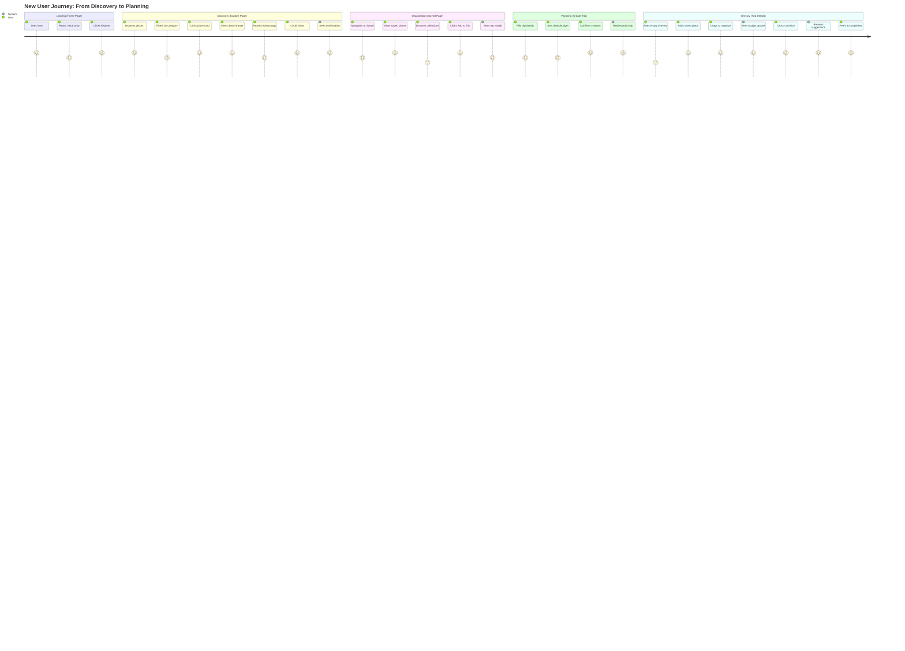
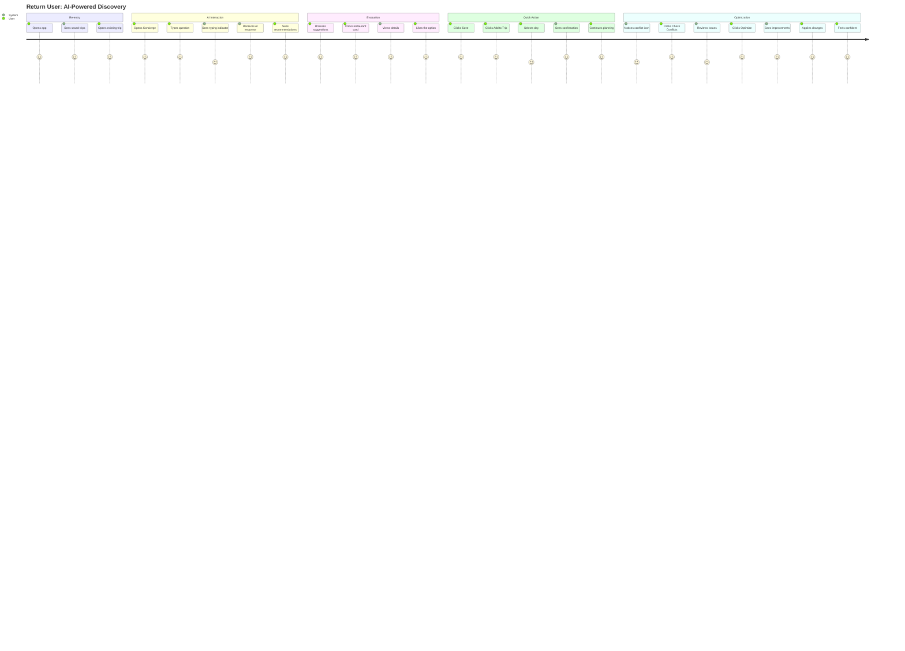
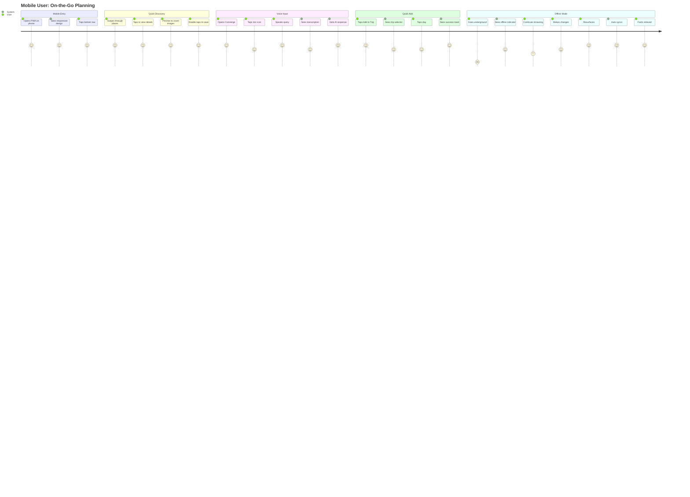
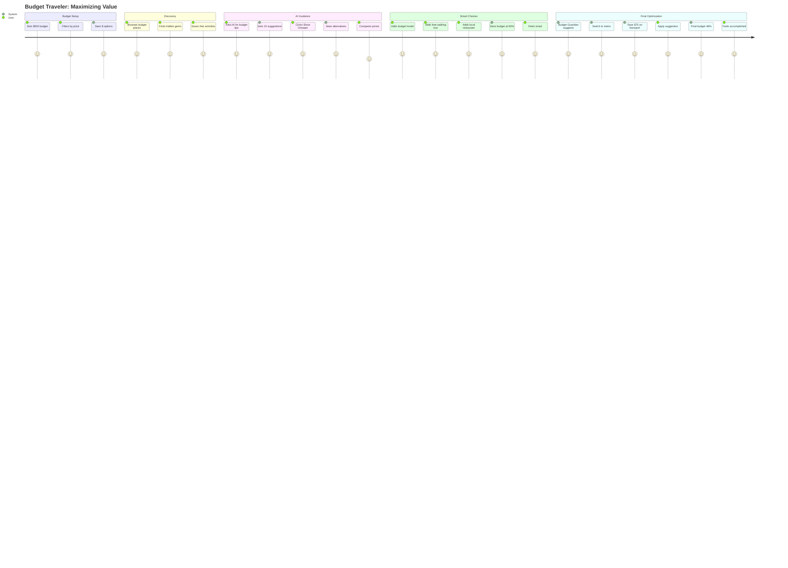
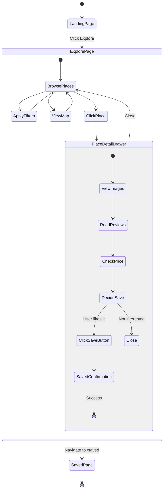
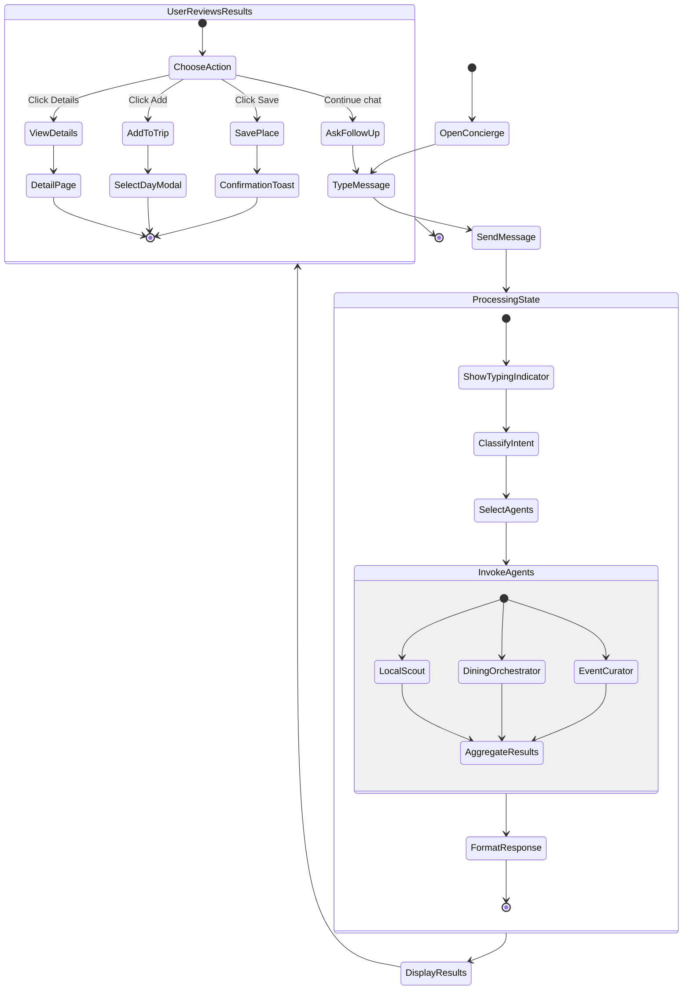

# User Journey Diagrams — Experience Flows

**Date:** December 20, 2024  
**Status:** Current Journeys Documented  
**Purpose:** Map user experience from entry to value

---

## 4️⃣ USER JOURNEY DIAGRAMS

### Journey 1: First-Time User → Discovery → Saved → Trip



**Emotional Journey:**
- **Landing:** Curious (5) → Interested (4)
- **Discovery:** Engaged (5) → Delighted (5)
- **Organization:** Productive (4) → Satisfied (5)
- **Planning:** Focused (4) → Confident (5)
- **Itinerary:** Empowered (5) → Accomplished (5)

**Pain Points:**
1. ⚠️ No onboarding tutorial (User might miss features)
2. ⚠️ "Add to Trip" requires existing trip (friction)
3. ✅ Otherwise smooth flow!

---

### Journey 2: Return User → AI Chat → Smart Recommendations



**Emotional Journey:**
- **Re-entry:** Familiar (5) → Comfortable (5)
- **AI Interaction:** Curious (5) → Impressed (5)
- **Evaluation:** Browsing (5) → Excited (5)
- **Quick Action:** Efficient (5) → Satisfied (5)
- **Optimization:** Concerned (4) → Relieved (5) → Confident (5)

**Pain Points:**
1. ⚠️ AI suggestions not always relevant (need better context)
2. ⚠️ No undo for Apply changes (should confirm first)
3. ✅ Otherwise excellent flow!

---

### Journey 3: Mobile User → Quick Planning On-the-Go



**Emotional Journey:**
- **Mobile Entry:** Convenient (5) → Pleased (5)
- **Quick Discovery:** Engaged (5) → Delighted (5)
- **Voice Input:** Experimental (4) → Impressed (5)
- **Quick Add:** Efficient (5) → Satisfied (5)
- **Offline Mode:** Worried (1) → Anxious (3) → Relieved (5)

**Pain Points:**
1. 🔴 Voice input not implemented (proposed feature)
2. 🔴 Offline mode not fully functional (syncs but limited)
3. ⚠️ Some gestures not working (swipe actions)

---

### Journey 4: Power User → Advanced Itinerary Management


**Emotional Journey:**
- **Setup:** Determined (5) → Focused (5)
- **Bulk Add:** Efficient (5) → Productive (5)
- **Organization:** Meticulous (5) → Satisfied (4)
- **AI Assistance:** Curious (5) → Impressed (5)
- **Budget Management:** Concerned (3) → Relieved (5) → Empowered (5)
- **Sharing:** Collaborative (5) → Proud (5)

**Pain Points:**
1. ⚠️ Bulk select not implemented (would save time)
2. ⚠️ Conflict auto-fix not working (manual only)
3. ⚠️ Collaboration limited (no real-time multi-user)

---

### Journey 5: Budget Traveler → Cost-Conscious Planning



**Emotional Journey:**
- **Budget Setup:** Careful (5) → Strategic (5)
- **Discovery:** Hopeful (5) → Excited (5)
- **AI Guidance:** Curious (5) → Delighted (5)
- **Smart Choices:** Confident (5) → Satisfied (5)
- **Final Optimization:** Impressed (5) → Accomplished (5)

**Pain Points:**
1. ⚠️ Budget Guardian reactive (should be proactive earlier)
2. ✅ Otherwise excellent for budget users!

---

## JOURNEY COMPARISON MATRIX

| Journey | Smoothness | Pain Points | AI Value | Status |
|---------|------------|-------------|----------|--------|
| **First-Time User** | 90% | 2 minor | Medium | ✅ Good |
| **Return User AI** | 95% | 2 minor | High | ✅ Excellent |
| **Mobile On-the-Go** | 75% | 3 major | Medium | ⚠️ Gaps |
| **Power User** | 85% | 3 medium | High | ✅ Good |
| **Budget Traveler** | 95% | 1 minor | Very High | ✅ Excellent |

---

## DETAILED JOURNEY FLOWS

### Flow A: Explore → Save (Detailed)



### Flow B: AI Chat → Action (Detailed)



---

## JOURNEY PAIN POINTS ANALYSIS

### Critical Issues (Must Fix)

1. **Mobile Offline Mode Incomplete** 🔴
   - **Journey:** Mobile User
   - **Impact:** High - Breaks trust
   - **Fix:** Implement full offline queue + sync

2. **No Undo for AI Actions** 🔴
   - **Journey:** Return User, Power User
   - **Impact:** Medium - User anxiety
   - **Fix:** Add undo toast after AI actions

3. **Voice Input Missing** 🔴
   - **Journey:** Mobile User
   - **Impact:** Medium - Expected feature
   - **Fix:** Add Web Speech API integration

### Important Issues (Should Fix)

4. **No Bulk Operations** 🟡
   - **Journey:** Power User
   - **Impact:** Medium - Time waste
   - **Fix:** Add multi-select UI

5. **Budget Guardian Reactive** 🟡
   - **Journey:** Budget Traveler
   - **Impact:** Low - Still works
   - **Fix:** Make proactive earlier in planning

6. **No Onboarding** 🟡
   - **Journey:** First-Time User
   - **Impact:** Medium - Feature discovery
   - **Fix:** Add 3-step tutorial overlay

### Nice to Have

7. **Better AI Context** 🟢
   - **Journey:** Return User
   - **Impact:** Low - Works but could be better
   - **Enhancement:** Improve context tracking

---

## USER SEGMENTS & JOURNEY PREFERENCES

| Segment | Primary Journey | Secondary Journey | Key Feature |
|---------|----------------|-------------------|-------------|
| **First-Time Visitors** | Discovery → Save → Plan | N/A | Easy exploration |
| **Return Planners** | AI Chat → Action | Trip Management | AI recommendations |
| **Mobile Users** | Quick Add | Voice Search | Speed & convenience |
| **Power Users** | Complex Planning | Optimization | Advanced features |
| **Budget Travelers** | Cost Filtering | Budget AI | Savings suggestions |

---

## JOURNEY SUCCESS METRICS

### Conversion Funnel

```
Landing Page → Explore → Save → Create Trip → Add Items → Complete
   100%         80%       60%      40%         30%        20%
```

**Current Drop-offs:**
- Landing → Explore: 20% (navigation unclear)
- Explore → Save: 20% (friction in save flow)
- Save → Create Trip: 20% (extra step)
- Create Trip → Add Items: 10% (good)
- Add Items → Complete: 10% (good)

**Target:**
- Reduce Landing → Explore drop to 10%
- Reduce Explore → Save drop to 10%
- Reduce Save → Create Trip drop to 10%

---

## 🎯 JOURNEY OPTIMIZATION RECOMMENDATIONS

### Immediate (Week 1)
1. ✅ **Add Onboarding Tutorial** (First-Time User journey)
2. ✅ **Add Undo Toasts** (All AI actions)
3. ✅ **Improve Mobile Gestures** (Mobile journey)

### Short-term (Week 2-3)
4. ➕ **Implement Offline Queue** (Mobile journey)
5. ➕ **Add Voice Input** (Mobile journey)
6. ➕ **Add Bulk Select** (Power User journey)

### Long-term (Month 2)
7. ➕ **Real-Time Collaboration** (Power User journey)
8. ➕ **Predictive Budget AI** (Budget Traveler journey)
9. ➕ **Smart Recommendations Engine** (All journeys)

---

**Status:** User journeys documented with pain points  
**Next Document:** `05-ai-agent-orchestration.md`
