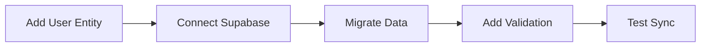
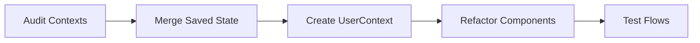
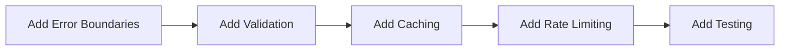

# Architecture Documentation

**Complete system architecture analysis and diagrams for the Trip Operating System.**

---

## 📚 Overview

This folder contains comprehensive architectural documentation including:
- System architecture diagrams
- Data models and ERDs
- Data flow analysis
- User journey mapping
- AI agent orchestration

All diagrams are created using **Mermaid** for version control and easy updates.

---

## 📂 Documents (in order)

### 01-system-architecture.md
**Complete system architecture** with current state + proposed improvements.

**Contains:**
- High-level architecture diagram
- Component hierarchy
- Routing architecture
- State management flow
- Critical gaps & failure points
- Risk assessment
- Proposed improvements
- Production readiness score: **72/100**

**Key Findings:**
- ✅ Frontend: 95% complete
- 🔴 Backend: 20% complete (localStorage only)
- ✅ AI Layer: 95% complete
- 🟡 Data: 50% complete

---

### 02-entity-relationship-diagram.md
**Complete data model** with entity relationships and migration strategy.

**Contains:**
- ERD with all entities
- Current vs proposed schema
- Entity details with gaps
- Supabase schema (SQL)
- Migration strategy
- Critical data gaps

**Key Findings:**
- ✅ 5 entities exist in code (Trip, TripItem, Day, Message, SavedItem)
- ➕ 8 entities proposed (User, Place, Conversation, AI_Run, etc.)
- 🔴 No user entity (blocking production)
- 🔴 No place normalization (data duplication)

---

### 03-data-flow-diagram.md
**Data flow analysis** showing how information moves through the system.

**Contains:**
- 5 complete data flow diagrams
- Flow gaps and failure points
- Persistence comparison (current vs proposed)
- Data validation pipeline
- Error recovery strategy
- Proposed improvements

**Key Findings:**
- ✅ Explore → Save → Trip flow works (90%)
- ⚠️ Duplicate save state (AIContext + TripContext)
- 🔴 No backend persistence (localStorage only)
- 🔴 No data validation
- 🔴 No error recovery

---

### 04-user-journeys.md
**User journey mapping** with emotional analysis and pain points.

**Contains:**
- 5 complete user journeys:
  1. First-Time User → Discovery → Saved → Trip
  2. Return User → AI Chat → Smart Recommendations
  3. Mobile User → Quick Planning On-the-Go
  4. Power User → Advanced Itinerary Management
  5. Budget Traveler → Cost-Conscious Planning
- Journey comparison matrix
- Detailed flow diagrams
- Pain point analysis
- Success metrics
- Optimization recommendations

**Key Findings:**
- ✅ First-time user journey: 90% smooth
- ✅ AI chat journey: 95% smooth
- ⚠️ Mobile journey: 75% smooth (gaps in offline, gestures)
- 🔴 No onboarding tutorial
- 🔴 No undo for AI actions

---

### 05-ai-agent-orchestration.md
**AI system architecture** with complete agent workflows.

**Contains:**
- High-level AI architecture
- Agent capabilities matrix
- Detailed agent workflows (3 examples)
- Multi-agent collaboration sequence
- Proactive AI system
- Context management
- Performance metrics
- AI system gaps & strengths

**Key Findings:**
- ✅ All 6 agents implemented and working
- ✅ Event-driven architecture
- ✅ Proactive suggestions
- ✅ Context-aware conversations
- ⚠️ No result validation
- ⚠️ No caching strategy
- ⚠️ No rate limiting

---

## 🎯 Key Architectural Decisions

### ✅ What's Working Well

1. **Event-Driven AI Architecture**
   - Event bus for loose coupling
   - Pub/sub pattern for agent coordination
   - Scalable and maintainable

2. **Context-Based State Management**
   - React Context API for global state
   - localStorage for persistence
   - Clear separation of concerns

3. **Component Modularity**
   - shadcn/ui for consistency
   - Feature-based organization
   - Reusable patterns

4. **AI Agent Specialization**
   - 6 focused agents
   - Clear responsibilities
   - Composable workflows

### 🔴 Critical Gaps

1. **No Backend Persistence**
   - All data in localStorage
   - No multi-device sync
   - Data loss risk
   - **Priority: HIGH**

2. **No Data Validation**
   - No schema validation
   - No type guards
   - Malformed data risk
   - **Priority: HIGH**

3. **No User Management**
   - No authentication
   - No user entity
   - Anonymous data only
   - **Priority: HIGH**

4. **Duplicate State**
   - savedItems in AIContext
   - savedIds in TripContext
   - Source of truth unclear
   - **Priority: MEDIUM**

---

## 📊 Architecture Metrics Summary

### Overall Scores

| Category | Score | Status |
|----------|-------|--------|
| **Frontend Architecture** | 95/100 | ✅ Excellent |
| **State Management** | 85/100 | ✅ Good |
| **AI System** | 95/100 | ✅ Excellent |
| **Backend Integration** | 20/100 | 🔴 Critical |
| **Data Model** | 60/100 | 🟡 Needs Work |
| **Error Handling** | 70/100 | 🟡 Partial |
| **Testing** | 0/100 | 🔴 None |
| **Documentation** | 95/100 | ✅ Excellent |

**Overall Production Readiness: 72/100**

---

## 🔧 Recommended Implementation Priority

### Phase 1: Data Layer (Weeks 1-2) 🔴 CRITICAL

**Tasks:**
1. Create Supabase schema
2. Add User entity and auth
3. Create data service layer
4. Add Zod schema validation
5. Migrate localStorage → Supabase
6. Test multi-device sync

**Impact:** Enables production launch

---

### Phase 2: State Consolidation (Week 3) 🟡 IMPORTANT

**Tasks:**
1. Create unified UserContext
2. Merge AIContext.savedItems + TripContext.savedIds
3. Refactor components to use new context
4. Remove duplicate code
5. Test all flows

**Impact:** Eliminates state confusion

---

### Phase 3: Polish (Week 4) 🟢 NICE-TO-HAVE

**Tasks:**
1. Add error boundaries everywhere
2. Add result validation
3. Implement caching strategy
4. Add rate limiting
5. Write unit tests
6. Write integration tests

**Impact:** Production stability

---

## 🎨 Diagram Types Used

This architecture documentation uses the following Mermaid diagram types:

1. **Graph Diagrams** (TB, LR) - System architecture, component hierarchy
2. **Flowchart** (TB, LR) - Data flows, process flows
3. **Sequence Diagrams** - Multi-agent collaboration, API calls
4. **State Diagrams** - User journey flows
5. **Journey Diagrams** - User experience mapping
6. **ER Diagrams** - Database schema, entity relationships

All diagrams are:
- ✅ Version controlled (Mermaid text)
- ✅ Editable (plain text)
- ✅ Renderable (GitHub, IDEs, docs sites)
- ✅ Printable (export to PNG/SVG)

---

## 📖 How to Use This Documentation

### For Developers
1. **Start with:** `01-system-architecture.md` - Understand overall structure
2. **Then read:** `02-entity-relationship-diagram.md` - Understand data model
3. **Then read:** `03-data-flow-diagram.md` - Understand data flows
4. **Reference:** `05-ai-agent-orchestration.md` - When working on AI features

### For Product Managers
1. **Start with:** `04-user-journeys.md` - Understand user experience
2. **Then read:** `01-system-architecture.md` (Summary sections) - Production readiness
3. **Review:** Gap analyses in each document

### For Architects
1. **Read all documents in order**
2. **Focus on:** "Proposed Improvements" sections
3. **Review:** Migration strategies

---

## 🔄 Keeping Documentation Updated

When making architectural changes:

1. **Update diagrams** in relevant documents
2. **Update status** (✅ Existing, ➕ Proposed, 🔴 Gap)
3. **Add notes** explaining changes
4. **Update metrics** if applicable
5. **Commit with clear message**

---

## 🚀 Next Steps

Based on this architecture analysis:

1. ✅ **Architecture Documented** (Complete)
2. ➕ **Implement Phase 1** (Data Layer) - HIGH PRIORITY
3. ➕ **Implement Phase 2** (State Consolidation) - MEDIUM PRIORITY
4. ➕ **Implement Phase 3** (Polish) - LOW PRIORITY

---

## 📞 Questions?

For architecture questions:
- Review the specific document for your area
- Check the gap analyses for known issues
- Review proposed improvements for solutions

For implementation help:
- See migration strategies in each document
- Review code examples provided
- Check existing implementations in `/lib` and `/components`

---

**Last Updated:** December 20, 2024  
**Maintained by:** Architecture Team  
**Status:** Complete system analysis with actionable recommendations
