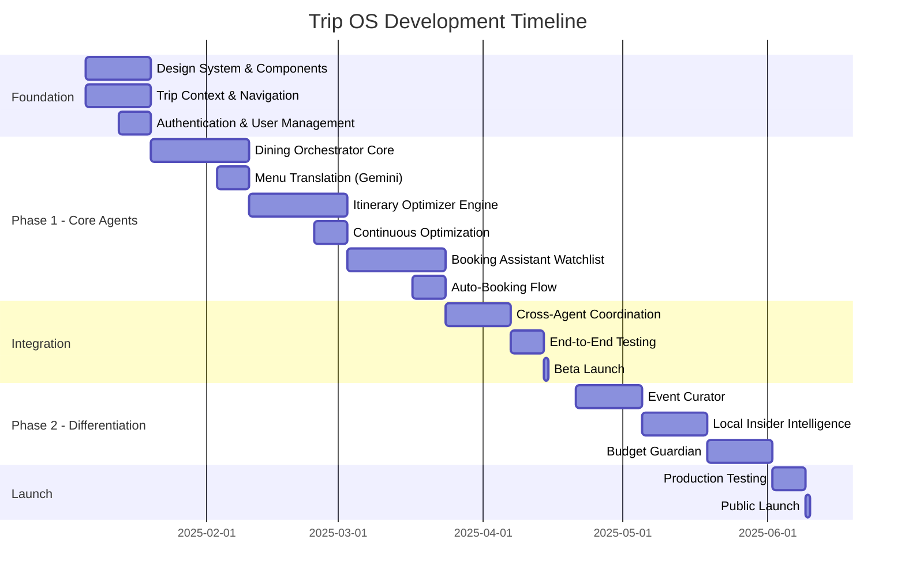
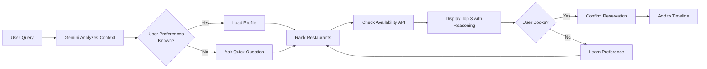
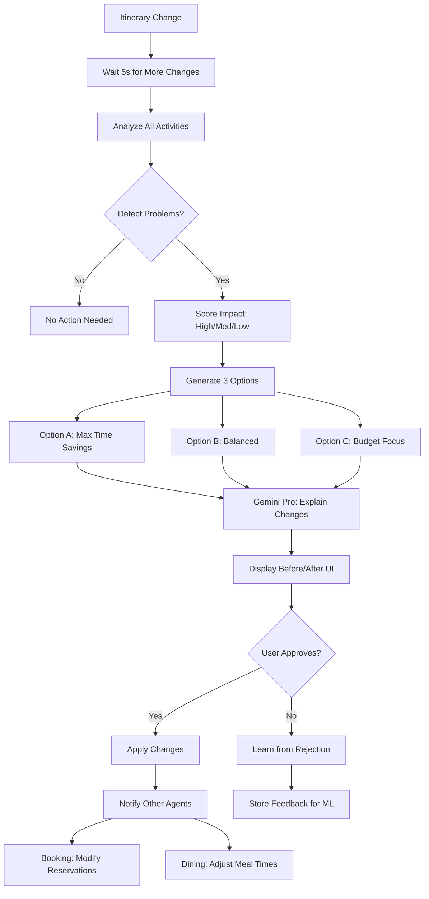
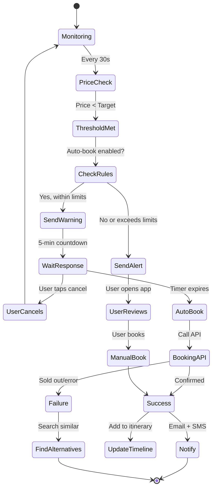

# Progress Tracker: Trip Operating System
## AI Agents, Features & Production Readiness

**Last Updated:** December 18, 2025  
**Overall Progress:** 0% (Planning Complete, Implementation Pending)

---

## 🎯 **Project Timeline Overview**

---

## 📊 **Phase 1: Core AI Agents (Months 1-3)**

### **Foundation Layer (Weeks 1-2)**

| Task Name | Short Description | Status | % Complete | ✅ Confirmed | ⚠️ Missing / Failing | 💡 Next Action |
|-----------|-------------------|--------|------------|--------------|---------------------|----------------|
| **F1.1 Design System** | Tokens, colors, typography, spacing | 🔴 Not Started | 0% | — | Design system not created | Review `/docs/features/02-phase-1.md` Task 1.1.1, run Figma Make AI prompt |
| **F1.2 Component Library** | Buttons, cards, inputs, modals, sheets | 🔴 Not Started | 0% | — | No reusable components | Build components per design system, create Storybook |
| **F1.3 Layout Templates** | Mobile, tablet, desktop responsive grids | 🔴 Not Started | 0% | — | No layout structure | Implement 12-column grid, test breakpoints (375px, 768px, 1024px) |
| **F1.4 Navigation** | Top nav, bottom nav, sidebar, routes | 🔴 Not Started | 0% | — | Routing not configured | Set up React Router, create all routes per `02-phase-1.md` |
| **F1.5 Trip Context** | Global state for current trip data | 🔴 Not Started | 0% | — | No state management | Create TripContext provider, test data flow |
| **F1.6 Auth Flow** | Sign up, login, OAuth, session management | 🔴 Not Started | 0% | — | Authentication not implemented | Integrate Supabase Auth, test Google/email login |

**Real-World Validation:** User should navigate `/trip/:tripId` → see trip data → change trip → UI updates globally.

---

### **Agent 1: Dining Orchestrator 🍽️ (Weeks 3-5)**

| Task Name | Short Description | Status | % Complete | ✅ Confirmed | ⚠️ Missing / Failing | 💡 Next Action |
|-----------|-------------------|--------|------------|--------------|---------------------|----------------|
| **D1.1 Dining Hub UI** | Search, filters, AI top 3 picks, results feed | 🔴 Not Started | 0% | — | Screen doesn't exist | Use prompt from `/docs/features/04-dining-orchestrator.md` STEP 1 |
| **D1.2 Restaurant Data** | 500+ Medellin restaurants with photos, ratings | 🔴 Not Started | 0% | — | Database empty | Scrape Google Places API, seed database, verify data quality |
| **D1.3 AI Ranking** | Gemini Flash generates top 3 picks with reasoning | 🔴 Not Started | 0% | — | Gemini not integrated | Connect Gemini API, test ranking with sample user profile |
| **D1.4 Availability Check** | Real-time table availability from OpenTable/Resy | 🔴 Not Started | 0% | — | No API connection | Integrate OpenTable API, test with 3 test restaurants |
| **D1.5 Detail Screen** | Restaurant info, menu, reviews, booking section | 🔴 Not Started | 0% | — | Detail page not built | Use STEP 2 prompt, implement all 13 sections |
| **D1.6 Reservation Flow** | Review → Payment → Confirmation | 🔴 Not Started | 0% | — | Booking doesn't work | Integrate Stripe, test end-to-end booking with test mode |
| **D1.7 Menu Translation** | Photo → Spanish OCR → English translation | 🔴 Not Started | 0% | — | Gemini Vision not integrated | Use STEP 3 prompt, test with 5 real menu photos |
| **D1.8 Timeline Integration** | Booking adds to itinerary with travel buffers | 🔴 Not Started | 0% | — | Not connected to timeline | Trigger timeline update on booking success, verify display |

**Real-World Example Test:**  
User searches "romantic dinner Poblado" → sees Carmen in top 3 with explanation "You loved ceviche in Peru" → books 7:30 PM table → receives confirmation → sees in timeline with 15-min buffer.

**AI Agent Logic:**

**Production Checklist:**
- [ ] Search returns results <2s
- [ ] AI picks: 80%+ users select from top 3
- [ ] Booking confirmation rate >95%
- [ ] Menu translation: 95%+ OCR accuracy
- [ ] Mobile responsive (tested on iPhone, Android)
- [ ] Accessibility: WCAG AA compliance

---

### **Agent 2: Itinerary Optimizer 🎯 (Weeks 6-8)**

| Task Name | Short Description | Status | % Complete | ✅ Confirmed | ⚠️ Missing / Failing | 💡 Next Action |
|-----------|-------------------|--------|------------|--------------|---------------------|----------------|
| **O2.1 Conflict Detection** | Find timing conflicts, impossible transitions | 🔴 Not Started | 0% | — | Algorithm doesn't exist | Build conflict detector, test with 20-item itinerary |
| **O2.2 Route Optimization** | Minimize travel time using clustering algorithm | 🔴 Not Started | 0% | — | No routing logic | Implement geographic clustering, test with Google Maps API |
| **O2.3 Optimizer UI** | Before/after comparison, problem cards, suggestions | 🔴 Not Started | 0% | — | Screen not built | Use `/docs/features/05-itinerary-optimizer.md` STEP 1 prompt |
| **O2.4 Multi-Objective Scoring** | Balance time, budget, preferences, energy | 🔴 Not Started | 0% | — | Scoring function missing | Implement weighted scoring, train on sample data |
| **O2.5 Option Generation** | Create 3 optimization scenarios (Max Time, Balanced, Budget) | 🔴 Not Started | 0% | — | Only generates 1 plan | Build scenario generator, test with constraints |
| **O2.6 Gemini Integration** | Use Gemini Pro for deep reasoning, explanations | 🔴 Not Started | 0% | — | Not connected to Gemini | Call Gemini Pro API with optimization context |
| **O2.7 Constraints Panel** | User sets time bounds, locked items, priorities | 🔴 Not Started | 0% | — | UI doesn't exist | Build constraints form, wire to optimizer engine |
| **O2.8 Continuous Monitoring** | Auto-detect changes, suggest re-optimization | 🔴 Not Started | 0% | — | No background monitoring | Set up event listener, debounce triggers (5s) |

**Real-World Example Test:**  
User has Comuna 13 tour 2-5 PM, dinner Poblado 6 PM → Optimizer detects conflict (traffic = 60-90 min) → Suggests moving tour to 9:30 AM → User approves → Timeline updates → Dining agent suggests lunch in Comuna 13.

**AI Agent Workflow:**

**Production Checklist:**
- [ ] Analysis time <5s for 20-item itinerary
- [ ] Conflict detection: 100% accuracy
- [ ] Time savings: 40%+ average reduction
- [ ] User approval rate: 70%+
- [ ] Learning loop: Acceptance rate improves monthly

---

### **Agent 3: Booking Assistant 💳 (Weeks 9-11)**

| Task Name | Short Description | Status | % Complete | ✅ Confirmed | ⚠️ Missing / Failing | 💡 Next Action |
|-----------|-------------------|--------|------------|--------------|---------------------|----------------|
| **B3.1 Watchlist UI** | Items user wants to book, with status tracking | 🔴 Not Started | 0% | — | Screen doesn't exist | Use `/docs/features/06-booking-assistant.md` STEP 1 prompt |
| **B3.2 Price Monitoring** | Track prices across 50+ platforms every 30s | 🔴 Not Started | 0% | — | No price scraping | Build scraper, store historical data, test with 10 items |
| **B3.3 ML Prediction Model** | Predict sellout timing, optimal booking window | 🔴 Not Started | 0% | — | Model not trained | Collect training data (6+ months), train LSTM/regression model |
| **B3.4 Alert System** | Push notifications when price drops or low availability | 🔴 Not Started | 0% | — | Notifications not implemented | Integrate Twilio (SMS) + push service, test alerts |
| **B3.5 Auto-Book Settings** | User permission, spending limits, approval rules | 🔴 Not Started | 0% | — | Settings UI missing | Use STEP 2 prompt, implement all safety guardrails |
| **B3.6 Payment Integration** | Stripe tokenization, PCI compliance | 🔴 Not Started | 0% | — | No payment method stored | Integrate Stripe Elements, test card saving |
| **B3.7 Auto-Book Flow** | 5-min warning → Book → Confirmation | 🔴 Not Started | 0% | — | Auto-booking doesn't work | Use STEP 3 prompt, test end-to-end with test mode |
| **B3.8 Audit Log** | Transparent record of all AI actions | 🔴 Not Started | 0% | — | No logging | Create audit table, display in UI, test with 10 actions |

**Real-World Example Test:**  
User adds Hotel Poblado Plaza to watchlist, sets target $130/night (current $145) → Price drops to $128 at 2 AM → Agent sends 5-min warning → User asleep, timer expires → Auto-books → User wakes to confirmation email → Saved $51.

**AI Agent State Machine:**

**Production Checklist:**
- [ ] Price updates: <30s staleness
- [ ] Auto-book success rate: 95%+
- [ ] Prediction accuracy: 85%+ for sellouts
- [ ] Payment processing: PCI-DSS compliant
- [ ] Audit log: 100% of actions logged

---

### **Integration & Testing (Week 12)**

| Task Name | Short Description | Status | % Complete | ✅ Confirmed | ⚠️ Missing / Failing | 💡 Next Action |
|-----------|-------------------|--------|------------|--------------|---------------------|----------------|
| **I4.1 Event Bus** | Cross-agent communication system | 🔴 Not Started | 0% | — | No message queue | Implement pub-sub pattern, test with sample events |
| **I4.2 Agent Coordination** | Dining ↔ Optimizer ↔ Booking interactions | 🔴 Not Started | 0% | — | Agents work in isolation | Wire event handlers, test 10 coordination scenarios |
| **I4.3 End-to-End Tests** | Complete user journeys (Playwright) | 🔴 Not Started | 0% | — | No E2E tests written | Write 5 critical flows, run in CI/CD |
| **I4.4 Performance Tests** | Load testing with 1000+ concurrent users | 🔴 Not Started | 0% | — | Not tested at scale | Use k6, test search/booking/optimization under load |
| **I4.5 Security Audit** | Penetration test, OWASP Top 10 | 🔴 Not Started | 0% | — | Security not verified | Hire external auditor or run automated scans |
| **I4.6 Beta Launch** | Deploy to 100 test users | 🔴 Not Started | 0% | — | Not in production | Deploy to staging, recruit beta testers, collect feedback |

**Cross-Agent Example:**  
User books restaurant (Dining Agent) → Booking Agent adds to confirmed list → Optimizer detects new timeline item → Checks for conflicts → Finds 15-min gap too short → Suggests moving previous activity 30 min earlier → User approves → All agents update in sync.

**Production Checklist:**
- [ ] No circular event loops (prevent infinite triggers)
- [ ] Event processing: <500ms latency
- [ ] 100% of cross-agent scenarios tested
- [ ] Rollback mechanism works
- [ ] Beta NPS score: >40

---

## 📊 **Phase 2: Differentiation Features (Months 4-6)**

### **Agent 4: Event Curator 🎭 (Month 4)**

| Task Name | Short Description | Status | % Complete | ✅ Confirmed | ⚠️ Missing / Failing | 💡 Next Action |
|-----------|-------------------|--------|------------|--------------|---------------------|----------------|
| **E5.1 Event Aggregation** | Scrape 200+ sources (Eventbrite, Facebook, venues) | 🔴 Not Started | 0% | — | No event data | Build aggregation pipeline, de-duplicate events |
| **E5.2 Events Hub UI** | Discovery feed, AI picks, serendipity section | 🔴 Not Started | 0% | — | Screen not built | Use `/docs/features/07-event-curator.md` STEP 1 prompt |
| **E5.3 Seat Selection** | Visual stadium/venue maps, price tiers | 🔴 Not Started | 0% | — | Seat picker doesn't exist | Use STEP 2 prompt, integrate with ticket APIs |
| **E5.4 ML Interest Matching** | Rank events by user preferences (40% weight) | 🔴 Not Started | 0% | — | Ranking model missing | Train collaborative filtering model, test accuracy |
| **E5.5 Urgency Signals** | "Selling fast" predictions based on ticket velocity | 🔴 Not Started | 0% | — | No urgency detection | Build velocity tracker, test with live events |
| **E5.6 Event Autopilot** | Auto-add events to itinerary based on preferences | 🔴 Not Started | 0% | — | Autopilot not built | Use STEP 3 prompt, implement settings + rules |
| **E5.7 Booking Integration** | Purchase tickets, add to timeline, send confirmations | 🔴 Not Started | 0% | — | Booking flow incomplete | Connect to Eventbrite/Ticketmaster APIs |

**Real-World Example:**  
User profile shows football interest → Agent finds Nacional vs Millonarios match → Predicts sellout in 6 hours → Alerts user → User books Tribuna Norte seats ($45) → Event added to timeline → Pre-match dinner suggested nearby.

**Production Checklist:**
- [ ] Event database: 1000+ events per city
- [ ] De-duplication accuracy: 95%+
- [ ] Interest matching: 80%+ select from top 3
- [ ] Sellout predictions: 85%+ accurate
- [ ] Hub visits: 2.8x per trip average

---

### **Agent 5: Local Insider 🗺️ (Month 5)**

| Task Name | Short Description | Status | % Complete | ✅ Confirmed | ⚠️ Missing / Failing | 💡 Next Action |
|-----------|-------------------|--------|------------|--------------|---------------------|----------------|
| **L6.1 Data Aggregation** | Instagram geotags, Google Maps, police data, weather | 🔴 Not Started | 0% | — | No data sources connected | Integrate APIs, set up hourly sync jobs |
| **L6.2 Insider Feed UI** | Live city pulse, smart alerts, hidden gems | 🔴 Not Started | 0% | — | Screen not built | Use `/docs/features/08-local-insider.md` STEP 1 prompt |
| **L6.3 Hidden Gem Ranking** | Find <500 reviews, 4.8+ rating, 80%+ local clientele | 🔴 Not Started | 0% | — | Algorithm missing | Build ranking function, test with Medellin data |
| **L6.4 Real-Time Alerts** | Crowd warnings, safety notices, opportunities | 🔴 Not Started | 0% | — | Alert system doesn't exist | Create alert generator, test with live data |
| **L6.5 Cultural Context** | AI-generated explanations for dishes, customs, tips | 🔴 Not Started | 0% | — | Content not generated | Use Gemini Pro to create context, review for accuracy |
| **L6.6 Place Detail Screen** | "Why locals choose this" deep dive | 🔴 Not Started | 0% | — | Detail page missing | Use STEP 2 prompt, implement all sections |
| **L6.7 Hyper-Local Signals** | Transparent data panel showing all sources | 🔴 Not Started | 0% | — | Signals panel not built | Use STEP 3 prompt, display confidence scores |

**Real-World Example:**  
10 PM Friday, user in Poblado → Agent detects Parque Lleras is at 300% capacity (45-min queues) → Alerts user → Suggests Los Patios (12-min taxi, similar vibe, no wait) → User goes to Los Patios → Has great night, no frustration.

**Production Checklist:**
- [ ] Data freshness: <10 min staleness
- [ ] Hidden gem discovery: 50+ per city
- [ ] Alert relevance: <5% dismiss rate
- [ ] Safety alerts: 100% accuracy
- [ ] User check-ins: 2.3x daily average

---

### **Agent 6: Budget Guardian 💰 (Month 5-6)**

| Task Name | Short Description | Status | % Complete | ✅ Confirmed | ⚠️ Missing / Failing | 💡 Next Action |
|-----------|-------------------|--------|------------|--------------|---------------------|----------------|
| **BG7.1 Expense Tracking** | Manual entry, receipt scan, credit card auto-import | 🔴 Not Started | 0% | — | Tracking doesn't work | Build entry form, integrate Plaid API |
| **BG7.2 Receipt Scanning** | Gemini Vision OCR → extract merchant, amount, category | 🔴 Not Started | 0% | — | OCR not integrated | Connect Gemini Vision, test with 20 receipts |
| **BG7.3 Auto-Categorization** | AI assigns expenses to categories (95%+ accuracy) | 🔴 Not Started | 0% | — | Categories always wrong | Train classification model, test with real data |
| **BG7.4 Budget Dashboard** | Overview, category breakdown, forecast, suggestions | 🔴 Not Started | 0% | — | Screen not built | Use `/docs/features/09-budget-guardian.md` STEP 1 prompt |
| **BG7.5 Forecast Model** | Predict total trip cost (92% accuracy target) | 🔴 Not Started | 0% | — | Model doesn't exist | Train regression model on historical trips |
| **BG7.6 Alert System** | Notify at 80% threshold, suggest interventions | 🔴 Not Started | 0% | — | Alerts not firing | Use STEP 2 prompt, implement intervention flow |
| **BG7.7 Reallocation Simulator** | Interactive budget sliders with real-time unlocks | 🔴 Not Started | 0% | — | Simulator not built | Use STEP 3 prompt, wire to recommendation engine |

**Real-World Example:**  
User spends $240/$300 dining budget by Day 3 → Agent alerts "You're running hot" → Suggests switching 2 lunches to markets (save $40) → User accepts → Agent finds 3 great market options → User saves money, stays on budget.

**Production Checklist:**
- [ ] OCR accuracy: 98%+ for receipts
- [ ] Categorization: 95%+ correct
- [ ] Forecast accuracy: 92%+ for total cost
- [ ] Budget adherence: 91%+ stay within budget
- [ ] Intervention acceptance: 60%+ rate

---

## 🎯 **Production Launch Checklist**

### **Performance**

| Requirement | Target | Status | Test Command | ✅ Confirmed | ⚠️ Failing |
|-------------|--------|--------|--------------|--------------|------------|
| Lighthouse Score (Mobile) | >90 | 🔴 Not Tested | `npm run lighthouse` | — | Not run |
| Lighthouse Score (Desktop) | >95 | 🔴 Not Tested | `npm run lighthouse` | — | Not run |
| LCP (Largest Contentful Paint) | <2.5s | 🔴 Not Tested | Chrome DevTools | — | Not measured |
| FID (First Input Delay) | <100ms | 🔴 Not Tested | Chrome DevTools | — | Not measured |
| API Response Time (P95) | <500ms | 🔴 Not Tested | Load test with k6 | — | Not tested |
| Bundle Size (Initial JS) | <200 KB gzipped | 🔴 Not Tested | `npm run build --stats` | — | Not analyzed |

---

### **Security**

| Requirement | Target | Status | Test Method | ✅ Confirmed | ⚠️ Failing |
|-------------|--------|--------|-------------|--------------|------------|
| HTTPS Everywhere | TLS 1.3 | 🔴 Not Configured | SSL Labs scan | — | HTTP only |
| OWASP Top 10 | No critical vulns | 🔴 Not Tested | ZAP scan or external audit | — | Not scanned |
| PCI-DSS Compliance | Level 1 | 🔴 Not Verified | Stripe audit | — | Not using Stripe yet |
| GDPR Compliance | Cookie consent, data export | 🔴 Not Implemented | Legal review | — | No privacy controls |
| Rate Limiting | 100 req/min per user | 🔴 Not Configured | Test with curl loop | — | Unlimited |

---

### **Testing**

| Test Type | Coverage Target | Status | Test Command | ✅ Confirmed | ⚠️ Failing |
|-----------|----------------|--------|--------------|--------------|------------|
| Unit Tests | 80%+ for critical paths | 🔴 Not Written | `npm test -- --coverage` | — | 0% coverage |
| Integration Tests | All API endpoints | 🔴 Not Written | `npm run test:integration` | — | No tests exist |
| E2E Tests (Critical Flows) | 5+ user journeys | 🔴 Not Written | `npm run test:e2e` | — | No Playwright setup |
| Load Testing | 1000 concurrent users | 🔴 Not Tested | `k6 run load-test.js` | — | No script |
| Accessibility (WCAG AA) | 100% compliance | 🔴 Not Tested | axe DevTools + manual | — | Not audited |

---

### **AI Agent Validation**

| Agent | Key Metric | Target | Status | Test Scenario | ✅ Confirmed | ⚠️ Failing |
|-------|-----------|--------|--------|---------------|--------------|------------|
| **Dining** | AI pick selection rate | 80%+ | 🔴 Not Tested | User search → top 3 shown → user picks #1 or #2 | — | No users |
| **Optimizer** | Approval rate | 70%+ | 🔴 Not Tested | Add 20 activities → optimizer runs → user approves changes | — | No optimizer |
| **Booking** | Auto-book success | 95%+ | 🔴 Not Tested | Set target price → price drops → auto-book triggers → confirmed | — | No auto-book |
| **Events** | Interest match accuracy | 80%+ | 🔴 Not Tested | User likes football → sees football events in top 3 | — | No events |
| **Insider** | Hidden gem acceptance | 75%+ | 🔴 Not Tested | User shown local spot → visits it → rates experience | — | No data |
| **Budget** | Forecast accuracy | 92%+ | 🔴 Not Tested | Track spending → compare final cost to forecast | — | No model |

---

## 🚀 **Next Actions by Role**

### **Product Manager**
1. ✅ Review all feature docs (`/docs/features/04-09`)
2. ⚠️ Prioritize Phase 1 vs Phase 2 features (recommend focus on P1 first)
3. 💡 **Next:** Create user stories in project management tool, assign to sprints

### **Design Lead**
1. ✅ Design system prompt ready (`02-phase-1.md` Task 1.1.1)
2. ⚠️ No Figma workspace created
3. 💡 **Next:** Run design system prompt in Figma Make AI, create component library

### **Engineering Manager**
1. ✅ Technical architecture documented (`00-overview.md`)
2. ⚠️ No infrastructure deployed
3. 💡 **Next:** Set up Supabase project, configure CI/CD pipeline, create repo structure

### **AI/ML Engineer**
1. ✅ Gemini integration points defined in all agent docs
2. ⚠️ No Gemini API access
3. 💡 **Next:** Request Gemini API key, test Flash + Pro, build first ranking model (Dining)

### **Front-End Developers**
1. ✅ Multi-step prompts ready for all screens
2. ⚠️ No codebase exists
3. 💡 **Next:** Set up React + TypeScript + Tailwind, build design system components

### **Back-End Developers**
1. ✅ API requirements documented
2. ⚠️ No database schema
3. 💡 **Next:** Design database schema (trips, users, bookings, events, expenses), set up Supabase

### **QA Engineer**
1. ✅ Production checklists defined
2. ⚠️ No test plans
3. 💡 **Next:** Write test cases for Phase 1 agents, set up Playwright, create test data

---

## 📈 **Success Metrics Dashboard**

| Metric | Target | Current | Status | How to Measure |
|--------|--------|---------|--------|----------------|
| **Planning Time Reduction** | 75% (8 hrs → 2 hrs) | — | 🔴 Not Launched | Time user from trip creation to first booking |
| **Booking Conversion** | 25% | — | 🔴 Not Launched | (Users who book / Users who create trip) × 100 |
| **Optimizer Approval Rate** | 70% | — | 🔴 Not Launched | (Optimizations accepted / Optimizations shown) × 100 |
| **Revenue Per User** | $87/trip (Phase 1) | — | 🔴 Not Launched | Commission + subscription revenue ÷ active users |
| **NPS Score** | 60+ | — | 🔴 Not Launched | Survey: "How likely to recommend?" (0-10 scale) |
| **User Retention (30-day)** | 45% | — | 🔴 Not Launched | (Users active Day 30 / Users active Day 1) × 100 |

---

## 🛠️ **Development Environment Setup**

### **Required Before Starting**

| Tool | Version | Status | Install Command | ✅ Confirmed | ⚠️ Missing |
|------|---------|--------|-----------------|--------------|------------|
| Node.js | 18.x+ | 🔴 Check | `node --version` | — | Not verified |
| npm | 9.x+ | 🔴 Check | `npm --version` | — | Not verified |
| Git | Latest | 🔴 Check | `git --version` | — | Not verified |
| Supabase CLI | Latest | 🔴 Not Installed | `npm install -g supabase` | — | Not installed |
| Gemini API Key | Active | 🔴 Not Obtained | Apply at ai.google.dev | — | No key |
| Stripe Account | Test mode | 🔴 Not Created | Sign up at stripe.com | — | No account |

---

## 📝 **Weekly Sprint Template**

Use this for each 2-week sprint:

### **Sprint Goals**
- [ ] Goal 1: e.g., "Complete Dining Hub UI"
- [ ] Goal 2: e.g., "Integrate Gemini for AI picks"
- [ ] Goal 3: e.g., "Test booking flow end-to-end"

### **Daily Standup Questions**
1. What did I complete yesterday?
2. What am I working on today?
3. Any blockers?

### **Sprint Retrospective**
- What went well?
- What could improve?
- Action items for next sprint

---

## 🎯 **Definition of Done**

For any task to be marked 🟢 **Completed** (100%), it must have:

1. ✅ **Code:** Fully implemented, merged to main branch
2. ✅ **Tests:** Unit + integration tests passing (80%+ coverage)
3. ✅ **UI:** Responsive (mobile, tablet, desktop tested)
4. ✅ **Accessibility:** WCAG AA compliant (axe scan passed)
5. ✅ **Documentation:** Code comments, README updated
6. ✅ **Performance:** Meets targets (Lighthouse, response time)
7. ✅ **Security:** No vulnerabilities (automated scan passed)
8. ✅ **User Testing:** 3+ users tested feature successfully
9. ✅ **Deployed:** Live on staging, smoke tests passed
10. ✅ **Approved:** Product owner accepts feature

---

## 🔄 **Update Instructions**

**How to Update This Tracker:**

1. Change **Status** column:
   - 🔴 Not Started → 🟡 In Progress (when work begins)
   - 🟡 In Progress → 🟢 Completed (when all 10 "Definition of Done" items met)
   - Any status → 🟥 Blocked (when dependency missing)

2. Update **% Complete**:
   - Estimate based on work completed (be honest!)
   - 0% = Not started
   - 50% = Half done (e.g., UI built but no API connection)
   - 100% = Fully done per "Definition of Done"

3. Fill **✅ Confirmed**:
   - What works? (e.g., "Design system tokens in Figma", "API returns 200 OK")
   - Include proof: file path, screenshot, test output

4. Fill **⚠️ Missing / Failing**:
   - What's broken? (e.g., "Gemini API key not configured", "Mobile layout broken on iPhone")
   - Include error message or specific issue

5. Write **💡 Next Action**:
   - Exact next step (e.g., "Add GEMINI_API_KEY to .env.local and restart server")
   - Should be clear enough for anyone to execute

6. Update **Last Updated** date at top of file

---

**End of Progress Tracker**  
Review weekly, update daily, ship monthly. 🚀
