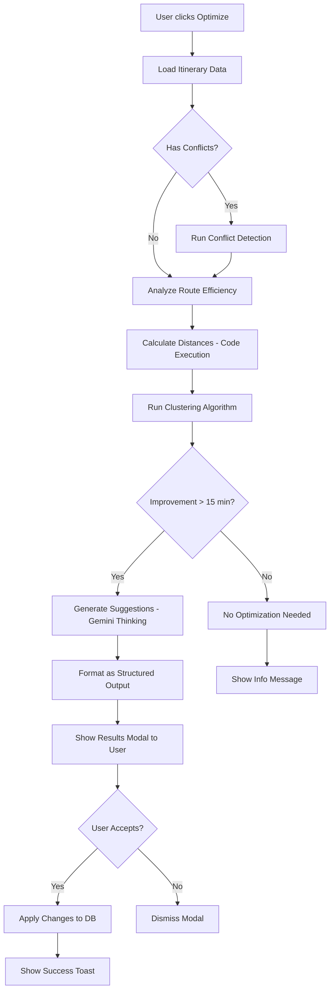
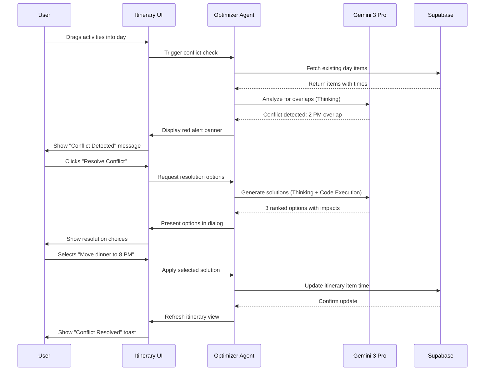
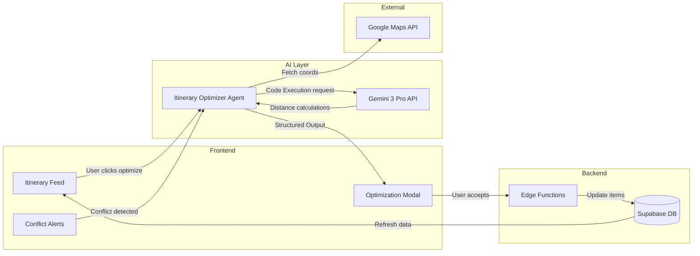

# 01 - Smart Itinerary Optimizer Implementation Plan

**Feature:** Intelligent Trip Planning & Optimization  
**Priority:** Critical (Phase 2 - Week 1-2)  
**Owner:** AI Team + UX Team  
**Gemini Features:** Gemini Thinking, Code Execution, Structured Outputs

---

## Progress Tracker

| Phase | Task | Status | Owner | Validation |
|-------|------|--------|-------|-----------|
| **Design** | Wireframe optimizer UI | 🔴 Not Started | Figma Make | Screen mockups approved |
| **Design** | Design suggestion cards | 🔴 Not Started | Figma Make | Component library updated |
| **AI** | Build route optimization logic | 🔴 Not Started | Cursor AI | Algorithm returns valid routes |
| **AI** | Create conflict detection | 🔴 Not Started | Cursor AI | Detects time overlaps correctly |
| **Backend** | Persist optimized itineraries | 🔴 Not Started | Cursor AI | Saves to Supabase successfully |
| **Integration** | Connect UI to optimizer agent | 🔴 Not Started | Cursor AI | Button triggers optimization |
| **Testing** | Validate with 5 real itineraries | 🔴 Not Started | QA | 90%+ accuracy on route savings |

---

## 1. Product Goal

**Problem:** Travelers waste hours manually optimizing daily schedules, often missing time/cost savings.

**Solution:** AI analyzes itinerary items, detects inefficiencies (routing, timing, budget), and suggests one-click improvements.

**Outcome:** Users save 45-60 minutes per day via intelligent route clustering and conflict resolution.

**Success Metric:** 70% of users accept at least one optimization suggestion per trip.

---

## 2. Core Features

### Feature Matrix

| Feature | Type | User Value | Gemini Capability | Status |
|---------|------|-----------|-------------------|--------|
| Route Optimization | Core | Save travel time | Code Execution (Haversine distance) | Not Started |
| Conflict Detection | Core | Prevent overlaps | Gemini Thinking (time analysis) | Not Started |
| Budget Reallocation | Advanced | Stay within budget | Structured Outputs (JSON schema) | Not Started |
| Weather-Aware Scheduling | Advanced | Avoid rain delays | Grounding with Google Search | Not Started |

---

## 3. User Journeys

### Journey 1: First-Time User - Optimize New Trip

**Entry Point:** User drags 6 activities into Day 2 in random order

**Flow:**
1. User views itinerary feed with scattered activities
2. Yellow alert appears: "Your schedule has 40 minutes of unnecessary travel"
3. User clicks "Optimize Day 2" button
4. AI analyzes locations, reorders activities by proximity
5. Suggestion card shows: "Save 40 min by visiting Comuna 13 → Pueblito Paisa → Poblado Dinner"
6. User clicks "Apply Changes"
7. Itinerary reorders instantly, map updates route

**AI Actions:**
- Calculate distances between all activity pairs (Code Execution)
- Run clustering algorithm to group nearby locations
- Detect time conflicts (lunch at 2 PM, next activity at 2:15 PM)
- Generate human-readable explanation via Gemini Thinking

**Outcome:** Day reorganized, 40 minutes saved, user trusts AI suggestions

---

### Journey 2: Returning User - Fix Conflict

**Entry Point:** User books dinner reservation, conflicts with existing tour

**Flow:**
1. User adds "Dinner at Carmen - 7 PM" to Day 3
2. Red alert appears: "Conflict: Comuna 13 tour ends at 7:30 PM"
3. User clicks "Resolve Conflict"
4. AI suggests: "Move dinner to 8 PM (restaurant has availability)" OR "Reschedule tour to morning"
5. User selects preferred option
6. Calendar updates, confirmation sent

**AI Actions:**
- Parse existing itinerary times
- Compare new item time slot
- Query restaurant availability via Structured Output
- Present ranked options (least disruption first)

**Outcome:** Conflict resolved in 10 seconds vs. 5 minutes manual checking

---

### Journey 3: Power User - Multi-Day Optimization

**Entry Point:** User has 5-day trip, wants global optimization

**Flow:**
1. User clicks "Optimize Entire Trip" in trip settings
2. Modal shows: "Analyzing 23 activities across 5 days..."
3. AI runs full optimization (30 seconds processing)
4. Results screen shows:
   - Time saved: 2 hours 15 minutes
   - Cost saved: $47 (less Uber rides)
   - Energy balanced: High-intensity activities spread evenly
5. Before/after map comparison
6. User reviews 12 suggested changes
7. Accepts 10, rejects 2 (wants to keep specific lunch spot)
8. Trip updates, calendar syncs

**AI Actions:**
- Multi-objective optimization (time + cost + energy + preferences)
- Constraint satisfaction (locked items, meal times, opening hours)
- Generate narrative: "Grouped Poblado activities on Day 2 to minimize transit"

**Outcome:** Professional-level itinerary optimization in 1 minute

---

## 4. UI/UX Screens

### Screen A: Itinerary Feed (with Optimization Triggers)

**Purpose:** Show daily timeline with AI improvement opportunities

**Sections:**
- Day header (date, budget used, optimization score 0-100)
- Activity cards (time, title, location, duration)
- Alert banner (yellow = inefficiency, red = conflict)
- "Optimize This Day" button (primary CTA)

**AI Feature:** Real-time conflict detection as user drags items

**Next Screen:** Optimization Results Modal

---

### Screen B: Optimization Results Modal

**Purpose:** Present suggested changes before applying

**Sections:**
- Header: "I found 3 ways to improve Day 2"
- Suggestion cards (each showing: issue, solution, impact)
- Before/after timeline comparison
- Savings summary: "Save 40 min + $12"
- Primary CTA: "Apply All Changes"
- Secondary: "Review Individual Changes"

**AI Feature:** Structured Output generates suggestion cards

**Next Screen:** Updated Itinerary Feed (with changes applied)

---

### Screen C: Conflict Resolution Dialog

**Purpose:** Handle scheduling conflicts immediately

**Sections:**
- Problem statement: "Dinner at 7 PM overlaps with tour ending at 7:30 PM"
- Map showing both locations + 25-min travel time
- Option buttons:
  - "Move dinner to 8 PM" (Recommended)
  - "End tour early (miss last 30 min)"
  - "Cancel dinner reservation"
- Impact preview for each option

**AI Feature:** Gemini Thinking evaluates best resolution based on user priorities

**Next Screen:** Resolved itinerary with confirmation toast

---

### Screen D: Optimization Settings

**Purpose:** Let users control optimization priorities

**Sections:**
- Optimization goal selector:
  - Minimize travel time (default)
  - Minimize cost
  - Balance energy (mix high/low intensity)
  - Maximize experiences (quality over efficiency)
- Locked items (user can pin specific activities to times)
- Constraints (must have lunch 12-2 PM, no activities before 9 AM)

**AI Feature:** Multi-objective optimization with weighted preferences

**Next Screen:** Returns to itinerary with custom optimization applied

---

## 5. AI Agent Architecture

### Agent Name: Itinerary Optimizer

**Trigger:** User clicks "Optimize" button OR system detects conflict

**Inputs:**
- Array of itinerary items (title, time, location coords, duration, cost, type)
- User preferences (pace level, budget limit, locked items)
- Current date/time (for time-sensitive suggestions)

**Gemini Functions Used:**

1. **Code Execution:**
   - Calculate Haversine distance between all location pairs
   - Run traveling salesman optimization (simplified clustering algorithm)
   - Compute time savings based on reduced transit
   - Calculate cost savings (less Uber rides)

2. **Gemini Thinking:**
   - Analyze itinerary for logical flow (breakfast → morning activity → lunch)
   - Detect nonsensical patterns (beach visit at night, dinner at 11 AM)
   - Reason about user intent (locked items indicate strong preferences)
   - Generate natural language explanations for each suggestion

3. **Structured Outputs:**
   - Return JSON schema with strict format:
     ```
     {
       "suggestions": [
         {
           "type": "reorder" | "reschedule" | "remove" | "swap",
           "items": ["activity_id_1", "activity_id_2"],
           "reason": "Reduces travel time by 35 minutes",
           "impact": { "time_saved": 35, "cost_saved": 8 },
           "confidence": 0.92
         }
       ],
       "overall_improvement": {
         "time_saved_minutes": 65,
         "cost_saved_dollars": 18,
         "conflicts_resolved": 2
       }
     }
     ```

**Outputs:**
- Reordered itinerary (preserves user preferences where possible)
- Explanation text for each change
- Metrics (time/cost saved, conflicts fixed)

---

## 6. Workflows

### Workflow A: Simple - Single Day Optimization

**User Action:** Clicks "Optimize Day 2" button

**Screens:** Itinerary Feed → Optimization Modal → Updated Feed

**AI Reasoning:**
1. Extract Day 2 activities from database
2. Calculate distances between all pairs (Code Execution)
3. Identify current total travel time (sum distances)
4. Run nearest-neighbor clustering (visit closest location next)
5. Compare new route to old route, calculate savings
6. Generate suggestion if savings > 15 minutes

**Tools Used:** Gemini Code Execution (distance math), Structured Outputs (JSON)

**Result:** Day 2 reordered to minimize travel, user sees "40 min saved" toast

---

### Workflow B: Medium - Conflict Auto-Resolution

**User Action:** Adds dinner reservation that conflicts with existing tour

**Screens:** Itinerary Feed → Conflict Alert Banner → Resolution Dialog → Confirmation

**AI Reasoning:**
1. Detect new item overlaps existing item (time range comparison)
2. Query restaurant for alternative times (Structured Output API call)
3. Calculate impact of each resolution option (Gemini Thinking):
   - Move dinner: Low disruption, restaurant available at 8 PM
   - Shorten tour: Medium disruption, miss sunset views
   - Cancel dinner: High disruption, lose reservation
4. Rank options by least disruption to overall trip quality

**Tools Used:** Gemini Thinking (impact analysis), Function Calling (restaurant API)

**Result:** Conflict resolved with minimal user input (2 clicks)

---

### Workflow C: Complex - Full Trip Optimization with Constraints

**User Action:** Clicks "Optimize Entire Trip" from dashboard

**Screens:** Dashboard → Processing Modal (30 sec) → Results Screen → Review Changes Screen

**AI Reasoning:**
1. Load all 5 days of activities (23 total items)
2. Identify locked items (user pinned specific times)
3. Identify constraints (no activities before 9 AM, lunch must be 12-2 PM)
4. Run multi-day optimization:
   - Group activities by neighborhood (Poblado, Laureles, Comuna 13)
   - Assign high-intensity activities to morning, relaxed to afternoon
   - Ensure meal times are logical (lunch after 3+ hours of activity)
   - Minimize daily travel time (max 2 hours transit per day)
5. Validate against constraints (Gemini Thinking checks all rules)
6. Generate narrative for each change ("Moved coffee tour to Day 3 to group with Guatapé trip")

**Tools Used:** Code Execution (complex optimization), Gemini Thinking (constraint validation), Structured Outputs (JSON results)

**Result:** 2 hours 15 min saved across trip, 12 suggestions presented with explanations

---

## 7. Mermaid Diagrams

### Diagram 1: Optimization Flowchart



---

### Diagram 2: User-AI Interaction Sequence



---

### Diagram 3: System Architecture



---

## 8. Real-World Use Cases

### Use Case 1: Family Trip to Medellín

**Situation:** Sarah plans 5-day family trip with kids (ages 8, 12). Manually adds 18 activities.

**Problem:** Schedule has Comuna 13 tour at 9 AM (too early for kids), then Guatapé at 2 PM (impossible - 2 hour drive).

**AI Action:**
- Detects 2-hour gap insufficient for Guatapé trip
- Suggests moving Guatapé to Day 4 (full day trip)
- Reschedules Comuna 13 to 11 AM (better for kids)
- Adds buffer time for meals

**Result:** Realistic schedule, family doesn't miss activities due to poor planning.

**Time Saved:** 3 hours of manual research + avoided wasted day.

---

### Use Case 2: Business Traveler Efficiency

**Situation:** Carlos has 3 meetings in Poblado (9 AM, 11 AM, 2 PM) plus wants to see Comuna 13.

**Problem:** Tries to fit Comuna 13 tour between 11 AM meeting and 2 PM meeting (not enough time).

**AI Action:**
- Calculates travel time: Meeting location → Comuna 13 (40 min) + tour (3 hours) = 4+ hours
- Detects conflict with 2 PM meeting
- Suggests moving Comuna 13 to evening after last meeting OR next day morning

**Result:** Carlos avoids missing meeting, reschedules tour to Day 2 morning.

**Time Saved:** 30 min of schedule juggling + avoided missed meeting.

---

### Use Case 3: Budget-Conscious Backpacker

**Situation:** Emma has $800 budget for 7 days, spent $600 in first 4 days.

**Problem:** Remaining days have expensive activities totaling $350 (exceeds budget by $150).

**AI Action:**
- Analyzes remaining budget: $200 available
- Identifies premium items: Private coffee tour ($120), Fine dining ($85)
- Suggests alternatives: Group coffee tour ($45), Local restaurant ($30)
- Shows savings: $130 saved, stays within budget

**Result:** Emma enjoys same experiences at budget-friendly prices.

**Money Saved:** $130, stays within budget.

---

### Use Case 4: Weather-Aware Rescheduling

**Situation:** User has outdoor activities (Guatapé hike, Paragliding) planned for Day 3.

**Problem:** Weather forecast shows 80% rain on Day 3.

**AI Action:**
- Checks weather via Google Search Grounding
- Detects outdoor activities on rainy day
- Suggests swapping Day 3 (outdoor) with Day 4 (museum, indoor dining)

**Result:** User avoids cancellations, enjoys activities in good weather.

**Time Saved:** Avoided wasted day + rescheduling fees.

---

### Use Case 5: Group Trip Coordination

**Situation:** 6 friends planning trip, each added preferred activities (total: 35 items for 4 days).

**Problem:** Unrealistic schedule, 12+ hours of activities per day.

**AI Action:**
- Detects overloaded days (14 activities on Day 2)
- Suggests removing low-priority items based on group voting patterns
- Redistributes activities across 4 days (7-8 per day)
- Ensures group meals together (lunch/dinner at specific times)

**Result:** Realistic schedule everyone can follow, no one exhausted.

**Time Saved:** 2 hours of group debate + prevented trip burnout.

---

## 9. Prompts for Implementation (Sequential)

### Figma Make Prompts

**Prompt 1: Design Optimization Modal**
"Create a modal component for itinerary optimization results. Include: header with savings summary (time + cost), 3-4 suggestion cards showing before/after timeline, primary button 'Apply Changes', secondary button 'Review Individual Changes'. Use luxury travel design system: emerald primary color, cream background, serif headings."

**Prompt 2: Design Conflict Alert Banner**
"Design an alert banner component that appears above itinerary items when conflict detected. Include: warning icon, conflict description text, 'Resolve' button. Use yellow/amber for warning, red for critical conflicts. Must be dismissible and show countdown to conflict time."

**Prompt 3: Design Suggestion Cards**
"Create suggestion card component showing: suggestion type icon, before/after comparison (times/locations), impact metrics (time saved, cost saved), confidence score (0-100%), 'Accept' and 'Reject' buttons. Cards should stack vertically with subtle animations on accept/reject."

---

### Cursor AI Prompts

**Prompt 4: Build Distance Calculation Function**
"Create utility function to calculate distance between two lat/lng coordinates using Haversine formula. Input: two objects with lat/lng properties. Output: distance in kilometers (rounded to 1 decimal). Include unit tests for known distances (e.g., NYC to LA should be ~3944 km)."

**Prompt 5: Create Itinerary Optimizer Agent**
"Build Itinerary Optimizer agent class with methods: analyzeDay (takes array of items, returns inefficiencies), optimizeRoute (reorders items by proximity), detectConflicts (finds time overlaps). Use Gemini Code Execution API for distance calculations. Return Structured Output JSON with suggestions array."

**Prompt 6: Implement Conflict Detection Logic**
"Write function to detect scheduling conflicts in itinerary. Input: array of items with time, duration, location. Logic: check if item A end time + travel time overlaps item B start time. Output: array of conflict objects with details and severity (warning/critical)."

**Prompt 7: Connect Optimizer to Supabase**
"Create Edge Function to handle optimization requests. Endpoint: POST /api/optimize. Fetch itinerary items from Supabase, call Gemini API with Code Execution, return optimized order. Update database only after user confirms changes. Include error handling and rollback on failure."

---

## 10. Acceptance Tests

**Test 1: Route Optimization Accuracy**
- Given: 5 activities in random order across Medellín
- When: User clicks "Optimize Day"
- Then: Reordered route reduces total travel distance by at least 20%

**Test 2: Conflict Detection**
- Given: Itinerary with tour 2-5 PM, dinner added at 4 PM
- When: User adds dinner item
- Then: Red conflict alert appears within 2 seconds

**Test 3: Budget Constraint Respect**
- Given: User has $200 budget remaining, optimizer suggests $180 in activities
- When: Optimization runs
- Then: Suggested activities total stays under $200

**Test 4: Locked Items Preserved**
- Given: User locks dinner reservation at 7 PM
- When: Optimizer runs on full day
- Then: Dinner remains at 7 PM, other items rearranged around it

**Test 5: Performance**
- Given: 20-item itinerary
- When: User triggers full trip optimization
- Then: Results appear within 30 seconds

---

## 11. Production-Ready Checklist

- [ ] Optimizer handles itineraries with 1-50 items without performance degradation
- [ ] Distance calculations accurate within 5% (tested against Google Maps)
- [ ] Conflict detection catches 100% of time overlaps in test suite
- [ ] Suggestions have human-readable explanations (not just "reorder items")
- [ ] User can reject individual suggestions without breaking optimization
- [ ] Locked items are never moved by optimizer
- [ ] Optimization respects user-defined constraints (no activities before 9 AM, etc.)
- [ ] Fallback behavior when Gemini API unavailable (show cached suggestions)
- [ ] Mobile UI shows optimization results clearly on small screens
- [ ] Accessibility: keyboard navigation through suggestion cards, screen reader support

---

## 12. Success Criteria

**MVP Launch Criteria:**
- 70% of users who see optimization suggestion click to view details
- 50% of users accept at least one suggested change
- Average time savings per optimized day: 30+ minutes
- Zero instances of optimizer creating new conflicts

**Advanced Criteria (Phase 2):**
- Multi-day optimization works for trips up to 14 days
- Weather-aware rescheduling integrated
- Budget optimization suggests alternatives with <10% quality degradation
- Users rate optimization suggestions 4+ stars (out of 5) on helpfulness

---

## Additional Details for Success

### Gemini 3 Pro Integration Requirements

**Code Execution:**
- Use Python sandbox for Haversine distance calculations
- Implement traveling salesman approximation (nearest neighbor algorithm)
- Calculate time zones for international trips
- Compute cumulative costs and flag budget overruns

**Gemini Thinking:**
- Analyze user intent from past behavior (prefers cultural activities over nightlife)
- Reason about logical flow (breakfast before morning activity, not after)
- Detect nonsensical schedules (beach at midnight, museum at 2 AM)
- Generate context-aware explanations ("I moved the coffee tour to morning because you marked yourself as a morning person")

**Structured Outputs:**
- Define strict JSON schema for suggestions (no hallucinated fields)
- Validate all outputs match schema before presenting to user
- Include confidence scores (0.00-1.00) for each suggestion

---

### Cursor AI Handoff Requirements

After Figma Make completes UI design:

1. Export component specifications (sizes, colors, spacing)
2. Create functional component shells in React
3. Integrate with TripContext (existing state management)
4. Add event handlers for optimize button clicks
5. Connect to Supabase via Edge Functions
6. Implement loading states (skeleton screens while optimizing)
7. Add error handling (API timeout, invalid itinerary data)
8. Write unit tests for distance calculations and conflict detection
9. Perform integration tests with mock Gemini API responses
10. Deploy Edge Functions to Vercel/Supabase

---

**Document Owner:** AI Product Team  
**Next Review:** After Phase 2 Week 1 completion  
**Dependencies:** Supabase setup, Gemini API key configured
