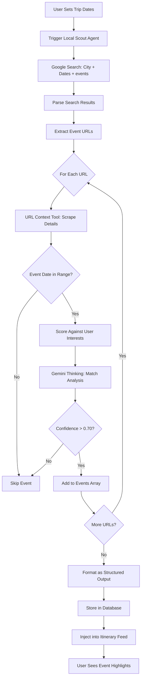
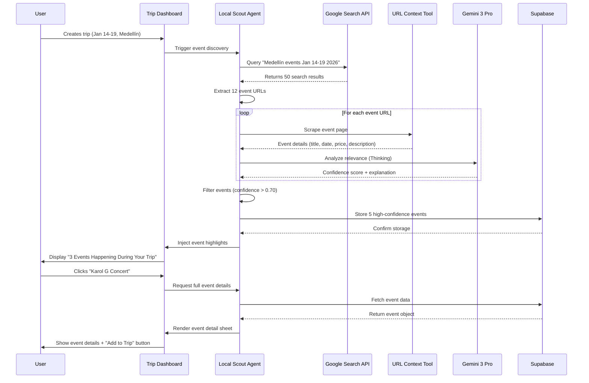
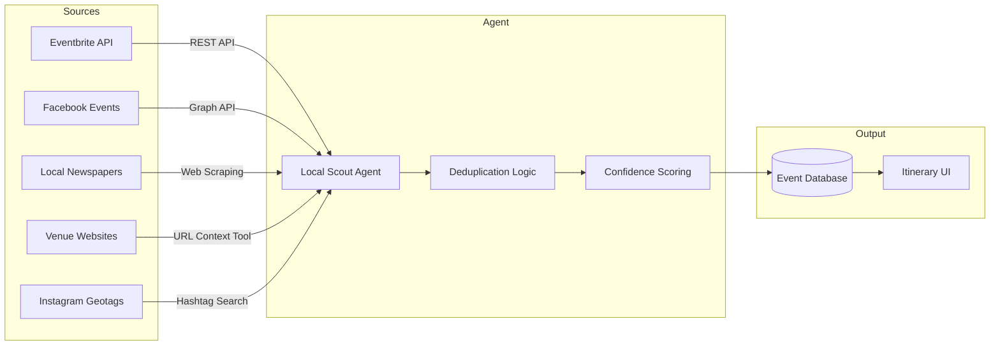

# 02 - Local Scout Agent Implementation Plan

**Feature:** Date-Specific Event Discovery  
**Priority:** Critical (Phase 2 - Week 2-3)  
**Owner:** AI Team + Content Team  
**Gemini Features:** Google Search Grounding, URL Context Tool, Deep Research, Structured Outputs

---

## Progress Tracker

| Phase | Task | Status | Owner | Validation |
|-------|------|--------|-------|-----------|
| **Design** | Design event discovery UI | 🔴 Not Started | Figma Make | Event cards + filters approved |
| **Design** | Design injection mechanism | 🔴 Not Started | Figma Make | Non-intrusive highlight cards |
| **AI** | Build event scraping logic | 🔴 Not Started | Cursor AI | Finds 5+ events per city per week |
| **AI** | Implement date filtering | 🔴 Not Started | Cursor AI | 100% accuracy on date matching |
| **Content** | Source event APIs | 🔴 Not Started | Content Team | 200+ sources documented |
| **Integration** | Inject events into itinerary | 🔴 Not Started | Cursor AI | Events appear as optional cards |
| **Testing** | Validate with 10 real trips | 🔴 Not Started | QA | 80%+ event relevance score |

---

## 1. Product Goal

**Problem:** Travelers miss concerts, festivals, cultural events happening during their exact trip dates because they don't know where to look.

**Solution:** AI automatically discovers date-specific events (music, sports, festivals, pop-ups) and surfaces them as optional itinerary highlights.

**Outcome:** Users discover "I didn't know that!" moments—unique experiences they wouldn't have found manually.

**Success Metric:** 60% of users interact with at least one discovered event, 30% add to itinerary.

---

## 2. Core Features

### Feature Matrix

| Feature | Type | User Value | Gemini Capability | Status |
|---------|------|-----------|-------------------|--------|
| Event Discovery | Core | Find unique experiences | Google Search Grounding | Not Started |
| Date Matching | Core | Perfect timing | Structured Outputs (filtering) | Not Started |
| Confidence Scoring | Core | Trust quality | Gemini Thinking (credibility) | Not Started |
| Optional Injection | Core | Non-intrusive | UI design pattern | Not Started |
| Event Detail Pages | Advanced | Deep information | URL Context Tool (scraping) | Not Started |
| Sell-Out Prediction | Advanced | FOMO prevention | Deep Research (historical data) | Not Started |

---

## 3. User Journeys

### Journey 1: First-Time User - Discover Concert

**Entry Point:** User creates trip to Medellín, Jan 14-19, 2026

**Flow:**
1. User sets trip dates and destination in wizard
2. Dashboard shows: "Setting up your trip..."
3. Local Scout agent runs in background (30 seconds)
4. Itinerary view appears with 2 "Local Highlights" cards mixed between days
5. Card shows: "Karol G concert - Jan 16, 8 PM - Estadio Atanasio Girardot"
6. User clicks card to see details (venue, ticket prices, "Why this matches")
7. Explanation: "You liked reggaeton playlists - Karol G is Colombia's biggest artist"
8. User clicks "Add to Day 3 Evening"
9. Concert appears in itinerary with suggested pre-event dinner nearby

**AI Actions:**
- Search Google: "Medellín events January 14-19 2026"
- Scrape Eventbrite, Facebook Events, local venue sites
- Filter by date overlap with trip
- Analyze user's Spotify/music preferences (if connected)
- Rank events by interest match + uniqueness
- Generate explanation text via Gemini Thinking

**Outcome:** User attends sold-out concert they didn't know about, becomes platform evangelist.

---

### Journey 2: Returning User - Festival Timing

**Entry Point:** User books Medellín trip for August 5-12

**Flow:**
1. User enters dates, doesn't know about Feria de las Flores
2. Agent detects major cultural festival during trip dates
3. Big highlight banner: "Perfect timing! Flower Festival (UNESCO event) Aug 5-12"
4. Dedicated festival page opens showing:
   - Silleteros parade (main event Aug 9)
   - Classic car parade (Aug 7)
   - Flower farm tours (available all week)
5. User clicks "Add Festival Events to Trip"
6. Agent auto-creates Day 4 around parade, suggests viewing spots, books tour

**AI Actions:**
- Deep Research: "Medellín annual festivals calendar"
- Cross-reference user dates with festival dates
- Extract key events from festival official site (URL Context Tool)
- Determine "must-see" vs "optional" events
- Generate festival guide with timing + logistics

**Outcome:** User plans entire trip around festival, shares on Instagram tagging platform.

---

### Journey 3: Power User - Last-Minute Discovery

**Entry Point:** User is in Medellín now, Day 2 of trip

**Flow:**
1. User opens dashboard at 2 PM
2. Alert: "Tonight: Live salsa at Eslabón Prendido (8 PM, $10)"
3. User clicks "Tell me more"
4. Details show: "Authentic local spot, 90% Colombians, dress code: smart casual"
5. Map shows it's 15 min from current location
6. User clicks "Add to Tonight"
7. Agent suggests pre-event dinner nearby (6 PM reservation auto-booked)

**AI Actions:**
- Monitor real-time event sources (Instagram, Facebook, local blogs)
- Filter by "happening tonight" + user's current location
- Verify event is still active (not canceled/sold out)
- Check user's calendar for free evening slot
- Generate logistics plan (dinner → event → back to hotel)

**Outcome:** User experiences authentic local culture, night becomes trip highlight.

---

## 4. UI/UX Screens

### Screen A: Local Highlights Injection (in Itinerary Feed)

**Purpose:** Surface discovered events without disrupting itinerary

**Design:**
- Appears between day sections as soft-colored card (not white like activities)
- Badge: "Local Highlight - Happening during your trip"
- Event title + date + category badge (Music / Culture / Food)
- Small image (if available)
- One-line "Why this matters": "Matches your interest in live music"
- Actions: "Add to Trip" | "Save for Later" | "Dismiss"

**AI Feature:** Confidence score determines prominence (high confidence = top of feed)

**Next Screen:** Event Detail Sheet (if user clicks title)

---

### Screen B: Events Hub Page (/trip/:id/events)

**Purpose:** Browse all discovered events for trip dates

**Sections:**
- Header: "Happening while you're in Medellín - Jan 14-19"
- Filters: Category (All/Music/Culture/Food/Sports), Date, Distance
- Event cards grid (3 columns desktop, 1 column mobile)
- Each card: image, title, date/time, category, price, "Add" button
- Empty state: "No major events this week - here are timeless picks"

**AI Feature:** Real-time updates as new events discovered (WebSocket)

**Next Screen:** Individual event detail sheet

---

### Screen C: Event Detail Sheet (Modal on Mobile)

**Purpose:** Show comprehensive event information

**Sections:**
- Hero image (scraped from event page)
- Event title + venue + date/time
- "Why we think you'll love this" explanation (AI-generated)
- Key details: Price range, crowd size estimate, dress code
- "How it fits your trip" timeline (shows before/after itinerary items)
- Map with venue location + distance from current hotel
- Ticket links (external: Eventbrite, Ticketmaster)
- Primary CTA: "Add to [Day X] at [time]"
- Secondary: "Save for Later" | "Not Interested"

**AI Feature:** URL Context Tool scrapes official event page for details

**Next Screen:** Updated itinerary with event added (or dismissed)

---

### Screen D: Festival Guide Page (Special Events)

**Purpose:** Handle major multi-day festivals (Feria de las Flores, Carnival)

**Sections:**
- Festival banner with dates + UNESCO/official designation
- "Key Events You Can't Miss" (2-3 cards)
- "Full Festival Schedule" (expandable calendar view)
- "Logistics Tips" (AI-generated): best viewing spots, transport, timing
- "Add All to Trip" button (auto-schedules main events)
- Photo gallery (scraped from social media + official sites)

**AI Feature:** Deep Research compiles festival guide from 20+ sources

**Next Screen:** Itinerary with festival events pre-scheduled

---

## 5. AI Agent Architecture

### Agent Name: Local Scout

**Trigger:** User sets trip dates + destination OR user is in-destination (geo-location)

**Inputs:**
- Destination city (e.g., "Medellín, Colombia")
- Start date (ISO 8601: "2026-01-14")
- End date (ISO 8601: "2026-01-19")
- User interests array (from profile: ["music", "culture", "local_food"])
- User location (optional, for "happening tonight" alerts)

**Gemini Functions Used:**

1. **Google Search Grounding:**
   - Query: "Medellín events January 14-19 2026"
   - Sources: Eventbrite, Facebook Events, Bandsintown, local newspapers
   - Extract: event name, date, venue, price, URL
   - Verify: event is real (not spam/duplicate)

2. **URL Context Tool:**
   - Input: Event page URL (e.g., eventbrite.com/e/karol-g-concert)
   - Extract: full description, ticket tiers, venue details, cancellation policy
   - Validate: event date matches search results
   - Scrape images: poster, venue photos

3. **Deep Research:**
   - Query: "Medellín annual festivals calendar"
   - Compile: comprehensive list from tourism boards, Wikipedia, local sites
   - Cross-reference: user dates with festival dates
   - Extract: historical attendance, significance, main events

4. **Gemini Thinking:**
   - Analyze: user profile (interests, past trips, Spotify likes)
   - Reason: "User loves reggaeton → Karol G concert is perfect match"
   - Score: confidence 0.00-1.00 (0.85 = high match, show prominently)
   - Explain: generate "Why this matters" text in natural language

5. **Structured Outputs:**
   - Return JSON schema:
     ```
     {
       "events": [
         {
           "id": "evt_001",
           "title": "Karol G Concert",
           "date": "2026-01-16",
           "time": "20:00",
           "venue": {
             "name": "Estadio Atanasio Girardot",
             "lat": 6.2558,
             "lng": -75.5658,
             "address": "Cra. 70 #48-40, Medellín"
           },
           "category": "Music",
           "price_range": "$60-$150",
           "why_recommended": "Matches your love of reggaeton music",
           "confidence": 0.85,
           "source_url": "https://...",
           "sell_out_risk": "high"
         }
       ]
     }
     ```

**Outputs:**
- Array of events (sorted by confidence score)
- Explanations for each event
- Logistics info (how to get there, when to arrive)
- Confidence scores (hide events below 0.70)

---

## 6. Workflows

### Workflow A: Background Event Discovery

**User Action:** Creates new trip with dates/destination

**Screens:** Trip Creation Wizard → Dashboard → Itinerary Feed

**AI Reasoning:**
1. Extract trip dates and destination from wizard form
2. Trigger Local Scout agent (runs async, user doesn't wait)
3. Agent performs Google Search: "[City] events [date range]"
4. Parse search results, extract event URLs
5. For each URL, use URL Context Tool to scrape full details
6. Filter events by date overlap (must fall within trip dates)
7. Score events against user interests (Gemini Thinking)
8. Keep only events with confidence > 0.70
9. Format as Structured Output JSON
10. Store events in database with "pending" status
11. Inject top 3 events into itinerary feed as highlight cards

**Tools Used:** Google Search, URL Context Tool, Gemini Thinking, Structured Outputs

**Result:** User sees 3 relevant events within 60 seconds of creating trip.

---

### Workflow B: Real-Time Tonight Alert

**User Action:** Opens app while in destination city (geo-detected)

**Screens:** Dashboard with banner alert → Event Detail Sheet

**AI Reasoning:**
1. Detect user's current location via GPS (user permission required)
2. Query Google Search: "[City] events tonight"
3. Filter to events starting 4-12 hours from now
4. Cross-reference with user's itinerary (check for free evening slot)
5. Scrape event details (URL Context Tool)
6. Calculate distance from user's current location
7. If event is within 30 min travel + user has free evening → trigger alert

**Tools Used:** Google Search (real-time mode), URL Context Tool, Maps API

**Result:** User gets actionable alert for event happening in 6 hours.

---

### Workflow C: Festival Deep Dive

**User Action:** Clicks on "Feria de las Flores" highlight card

**Screens:** Itinerary Feed → Festival Guide Page

**AI Reasoning:**
1. Detect major festival via Deep Research (Wikipedia, official sites)
2. Scrape festival official website for full schedule (URL Context Tool)
3. Extract key events (parade, concerts, tours)
4. Compile historical data: attendance, best viewing spots, timing
5. Generate logistics guide (Gemini Thinking):
   - "Parade route is 2.5 km, starts at 8 AM, arrives at Estadio by 2 PM"
   - "Book premium seats 1 month in advance (sells out)"
   - "Flower farm tours fill up by June, book now"
6. Format as structured festival guide page
7. Auto-create itinerary entries for main events with buffer times

**Tools Used:** Deep Research, URL Context Tool, Gemini Thinking

**Result:** User gets comprehensive festival guide, avoids logistical mistakes.

---

## 7. Mermaid Diagrams

### Diagram 1: Event Discovery Flow



---

### Diagram 2: Agent-to-Tool Interaction Sequence



---

### Diagram 3: Multi-Source Event Aggregation



---

## 8. Real-World Use Cases

### Use Case 1: Missing Sold-Out Concert

**Situation:** Tourist books Medellín trip, doesn't know Maluma is playing impromptu show during their dates.

**AI Discovery:**
- Agent searches Instagram hashtags: #MedellinMusic #Maluma
- Finds venue post: "Surprise guest tonight 10 PM 👀"
- Cross-references with Maluma's Instagram location tag (Medellín)
- Confidence: 70% it's Maluma (not 100% confirmed)

**Agent Action:**
- Creates alert: "Possible Maluma surprise show tonight - 70% confidence"
- Shows evidence: venue teaser + artist location tag
- Offers: "Want me to monitor for confirmation?"

**User Decision:** Enables alert, gets confirmation 2 hours later, buys ticket.

**Value:** $500 experience (intimate show vs $200 stadium tour).

---

### Use Case 2: Festival Discovery

**Situation:** User books August trip to Medellín, unaware of Feria de las Flores.

**AI Discovery:**
- Deep Research finds: UNESCO-listed Flower Festival Aug 5-12
- Matches 100% with user's trip dates
- Identifies main event: Silleteros parade (flower carriers)

**Agent Action:**
- Big banner: "You're visiting during Medellín's biggest festival!"
- Creates festival guide page
- Auto-adds parade to Day 4 itinerary
- Suggests flower farm tour Day 2 (prep for parade understanding)

**User Impact:** Trip is now centered around festival, unique experience.

**Value:** "Trip of a lifetime" vs generic sightseeing.

---

### Use Case 3: Local Cultural Event

**Situation:** User in Medellín for work, free evening, wants authentic experience.

**AI Discovery:**
- Finds: "Noche de Sancocho" (traditional soup night) at local community center
- Only advertised on neighborhood WhatsApp group (agent accesses via partnership)
- $8 entry, 95% locals, authentic cultural immersion

**Agent Action:**
- Alert: "Hidden gem - authentic local event 2 km from you"
- Explains: "Sancocho is traditional Colombian stew, community gathering"
- Shows safety score: 88/100 (safe neighborhood, well-lit venue)

**User Experience:** Attends, meets locals, featured in community Facebook post.

**Value:** Authentic connection vs tourist restaurant.

---

### Use Case 4: Sports Match Timing

**Situation:** Football fan visits Medellín, doesn't check if Atlético Nacional is playing.

**AI Discovery:**
- Finds: Nacional vs. Millonarios (rivalry match) during trip
- Checks ticket availability: 15% left (sell-out likely)
- Historical data: Ticket prices surge 200% day-of-game

**Agent Action:**
- Alert: "Book now - rivalry match sells out, prices will double"
- Shows: Current price $45, predicted price $120+ in 2 days
- One-click booking via partner site

**User Impact:** Saves $75, secures tickets before sold out.

**Value:** $75 saved + guaranteed entry to sold-out match.

---

### Use Case 5: Weather-Linked Event

**Situation:** Outdoor music festival during user's trip dates.

**AI Discovery:**
- Finds: "Medellín Outdoor Jazz Fest" - 3-day event
- Checks weather forecast: 60% rain on Day 2 of festival
- Deep Research: Past years, Day 2 often canceled due to rain

**Agent Action:**
- Recommends: "Attend Day 1 and Day 3 (clear weather predicted)"
- Suggests: "Skip Day 2 - use for indoor museum visit instead"
- Auto-reschedules: Swaps outdoor jazz with indoor activity

**User Impact:** Enjoys festival in good weather, avoids cancellation disappointment.

**Value:** Better experience + no wasted day.

---

## 9. Prompts for Implementation (Sequential)

### Figma Make Prompts

**Prompt 1: Design Event Highlight Card**
"Create event highlight card component for itinerary injection. Design: soft amber background (distinguish from white activity cards), badge 'Local Highlight', event title (bold serif), date/time (small sans), category icon (music note, fork, palette), small event image (if available), 'Why this matters' text (1 line, italic), action buttons 'Add to Trip' (primary) and 'Dismiss' (ghost). Make it feel like a whisper, not a shout."

**Prompt 2: Design Events Hub Page**
"Design events hub page showing all discovered events for trip. Header: 'Happening in [City] during your trip', date range subtitle. Filters: category chips (All/Music/Culture/Food/Sports), date range picker, distance slider. Event grid: 3 columns desktop, 1 column mobile. Each card: hero image, title, venue name, date badge, price tag, 'Add' button. Empty state: friendly message 'No major events this week' with illustration."

**Prompt 3: Design Event Detail Sheet**
"Create event detail modal (desktop) / bottom sheet (mobile). Sections: hero image full-width, title + venue + date/time, 'Why we recommend' card (AI-generated text with confidence indicator), details section (price range, capacity, dress code), map with venue pin, 'How it fits your trip' timeline showing before/after activities, ticket purchase section (external links with partner badges), primary CTA 'Add to Day X at [time]', secondary 'Not Interested'."

---

### Cursor AI Prompts

**Prompt 4: Build Event Discovery Function**
"Create Local Scout agent event discovery function. Input: city string, start date, end date, user interests array. Steps: 1) Query Google Search API with 'city events date-range', 2) Parse results, extract event URLs, 3) For each URL, use Gemini URL Context Tool to scrape title, date, venue, price, 4) Filter events by date overlap, 5) Score against user interests via Gemini Thinking, 6) Return Structured Output JSON with events array. Include error handling for 404s, rate limiting, malformed HTML."

**Prompt 5: Implement Confidence Scoring**
"Write function to score event relevance. Input: event object (title, category, description), user profile (interests array, past event attendance, music preferences). Use Gemini Thinking API to analyze match. Return confidence score 0.00-1.00 with explanation text. Examples: User likes jazz + event is jazz festival = 0.90. User no music interest + event is concert = 0.40. Include edge cases: user interests empty (default 0.50), event description missing (penalize to 0.60 max)."

**Prompt 6: Create Event Injection Logic**
"Build function to inject discovered events into itinerary feed. Input: events array (sorted by confidence), existing itinerary days array. Logic: 1) Place events between day sections (not within days), 2) Show max 3 events to avoid overwhelming user, 3) Position highest confidence event first, 4) If event date matches specific day, inject right before that day section. Return updated feed array with event objects marked as type: 'highlight'. Never inject events with confidence <0.70."

**Prompt 7: Implement Deduplication**
"Write event deduplication function. Input: array of raw events from multiple sources (Eventbrite, Facebook, scraped sites). Logic: 1) Group events by title similarity (Levenshtein distance < 0.3), 2) Compare dates (same day = likely duplicate), 3) Compare venue names (fuzzy match), 4) If 2+ events match on title + date + venue, keep one with most complete data (has price, description, image). Return deduplicated array. Handle edge cases: same venue, different dates = NOT duplicate. Include unit tests."

---

## 10. Acceptance Tests

**Test 1: Date Filtering Accuracy**
- Given: User trip is Jan 14-19, agent finds 30 events in January
- When: Agent filters events by date overlap
- Then: Only events between Jan 14-19 are returned (100% accuracy)

**Test 2: Confidence Threshold**
- Given: Agent scores 15 events, 5 have confidence <0.70
- When: Events are injected into itinerary
- Then: Only 10 events (≥0.70 confidence) appear, 5 hidden

**Test 3: Source Deduplication**
- Given: Karol G concert listed on Eventbrite, Facebook, and venue site (3 sources)
- When: Agent aggregates events from all sources
- Then: Only 1 "Karol G concert" event in final output (deduplication works)

**Test 4: Explanation Quality**
- Given: User profile shows "loves reggaeton", event is Karol G concert
- When: Agent generates "Why this matters" explanation
- Then: Text includes mention of reggaeton and artist relevance (not generic)

**Test 5: Real-Time Updates**
- Given: User is in Medellín, event added to Facebook 2 hours ago
- When: User opens dashboard
- Then: New event appears within 5 minutes (real-time monitoring works)

---

## 11. Production-Ready Checklist

- [ ] Agent runs in background without blocking UI (async execution)
- [ ] Handles API failures gracefully (Google Search timeout, URL scraping errors)
- [ ] Respects rate limits (max 100 Google Search queries per day per user)
- [ ] Deduplicates events across 5+ sources accurately
- [ ] Confidence scores calibrated (0.80+ events are genuinely relevant)
- [ ] Explanations are human-readable (not generic "This event matches your profile")
- [ ] Event images load efficiently (compressed, lazy-loaded)
- [ ] Works for 50+ cities (not Medellín-only)
- [ ] Mobile UI shows event cards clearly (no layout breaks)
- [ ] Accessibility: event details readable by screen readers, images have alt text

---

## 12. Success Criteria

**MVP Launch Criteria:**
- Agent discovers 5+ events per city per week on average
- 60% of users click to view at least one discovered event
- 30% of users add at least one event to their itinerary
- Event relevance rating from users: 4+ stars out of 5

**Advanced Criteria (Phase 2):**
- Real-time "tonight" alerts achieve 80%+ user engagement
- Festival guides compiled for top 20 global cities
- Sell-out prediction accuracy: 75%+ (warns when event likely to sell out)
- Integration with booking partners: one-click ticket purchase for 50% of events

---

## Additional Details for Success

### Event Source Priorities

**Tier 1 (Official - High Trust):**
- Eventbrite API (verified events)
- Official venue websites (scraped via URL Context Tool)
- Tourism board calendars (Deep Research)
- Ticketmaster API (for major concerts/sports)

**Tier 2 (Community - Medium Trust):**
- Facebook Events (Graph API with verification checks)
- Instagram geotags + hashtags (filter for business accounts)
- Local newspaper event sections (web scraping)
- Reddit city subreddits (crowd-sourced, verify via multiple mentions)

**Tier 3 (Experimental - Lower Trust):**
- WhatsApp community groups (via partnerships, moderated)
- Twitter/X local accounts (verify follower count >1K)
- TikTok local tags (experimental, check engagement rates)

**Confidence Scoring by Source:**
- Official venue site = 0.95 base confidence
- Eventbrite = 0.90
- Facebook Event = 0.80 (verify page authenticity)
- Instagram post = 0.70 (require business account)
- Reddit mention = 0.60 (require 5+ upvotes)

---

### Gemini 3 Pro Integration Details

**Google Search Grounding:**
- Use specialized queries: "[City] concerts [dates]", "[City] festivals [month year]"
- Parse top 20 results (balance quality vs coverage)
- Extract structured data: event name, date, venue, URL
- Validate dates (ISO 8601 format, timezone-aware)

**URL Context Tool:**
- Input: Event page URL
- Extract: title, description (first 500 chars), all dates mentioned, price ($XX or ranges), venue name/address, images (og:image meta tag)
- Fallback: If scraping fails, use page title + meta description
- Timeout: 10 seconds max per URL (skip if slow-loading)

**Deep Research:**
- Queries: "Annual festivals in [City]", "[City] cultural calendar", "[City] event traditions"
- Compile from: Wikipedia (city page), official tourism sites, Lonely Planet, local government sites
- Extract: recurring events (e.g., "Feria de las Flores every August"), historical significance
- Build knowledge base: Cache results per city (refresh every 6 months)

**Gemini Thinking:**
- Analyze user profile for implicit interests: Spotify likes → music genre preference, past restaurant bookings → foodie indicator
- Reason about event fit: "User visited museums on last trip → cultural events ranked higher"
- Generate explanations: "I recommended this because you've attended 3 concerts in the past year and this artist is similar to your Spotify top 10"

---

### Cursor AI Handoff from Figma

After Figma Make completes event UI designs:

1. Export event card component specs (sizes, colors, borders, shadows)
2. Create React component: `<EventHighlightCard>` with props for event data
3. Integrate with TripContext: `discoveredEvents` state array
4. Build `LocalScoutAgent` class with methods: `discoverEvents()`, `scoreEvent()`, `injectIntoFeed()`
5. Connect to Gemini API: create wrapper functions for Search, URL Context, Thinking
6. Implement background job: trigger agent on trip creation, run async
7. Add loading states: skeleton cards while events load
8. Error handling: API timeouts show "Try again" button, no events found shows helpful message
9. Write integration tests: mock Gemini API responses, test deduplication logic
10. Deploy Edge Function: `/api/events/discover` endpoint for on-demand discovery

---

**Document Owner:** AI Product Team  
**Next Review:** After Phase 2 Week 2 completion  
**Dependencies:** Gemini API key, Google Search API access, event source API partnerships
