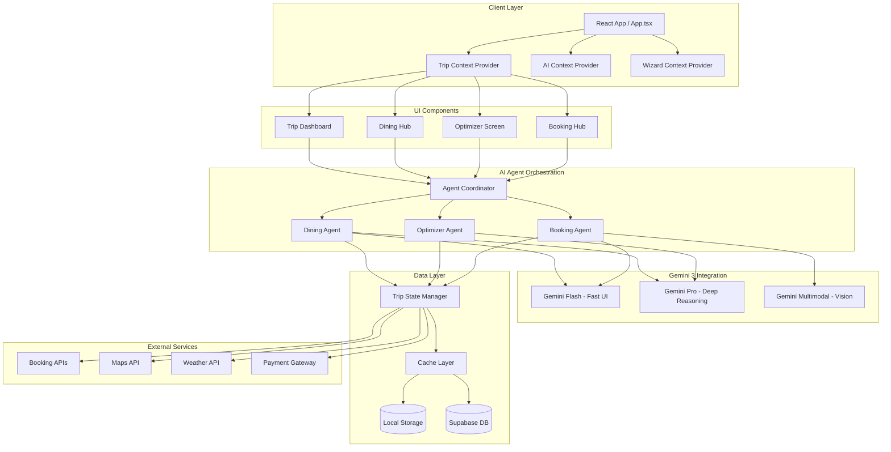
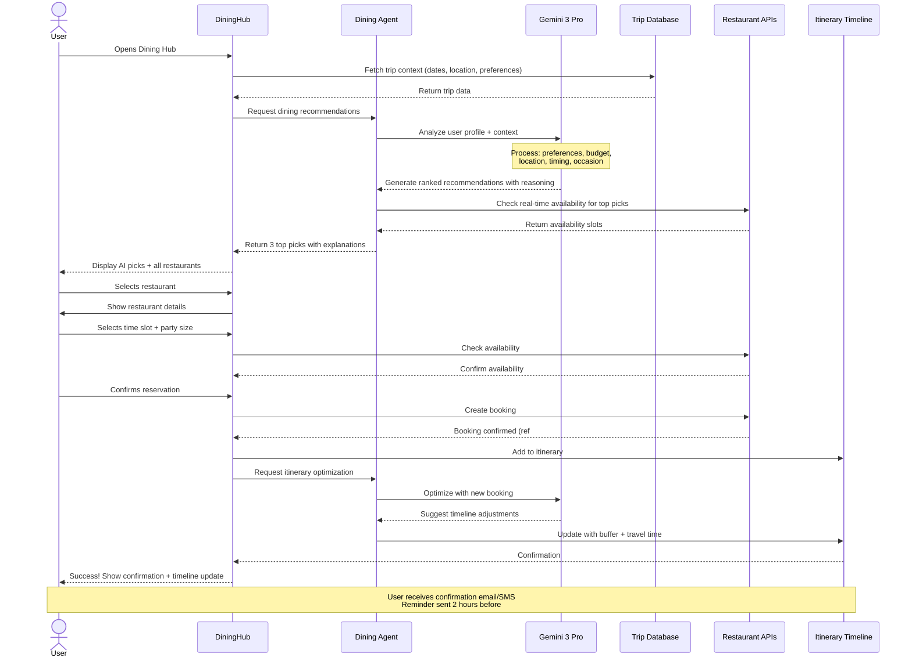
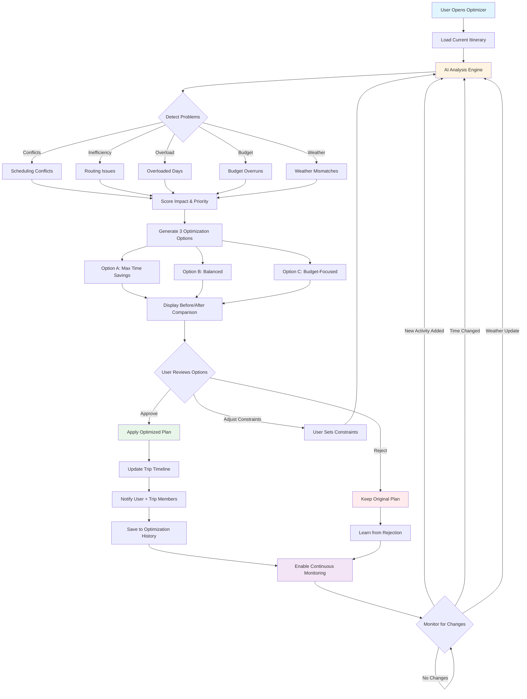
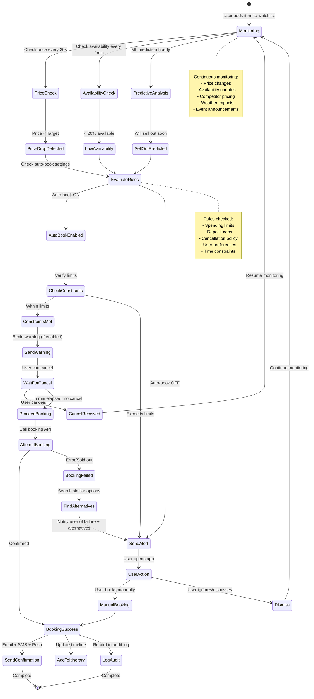
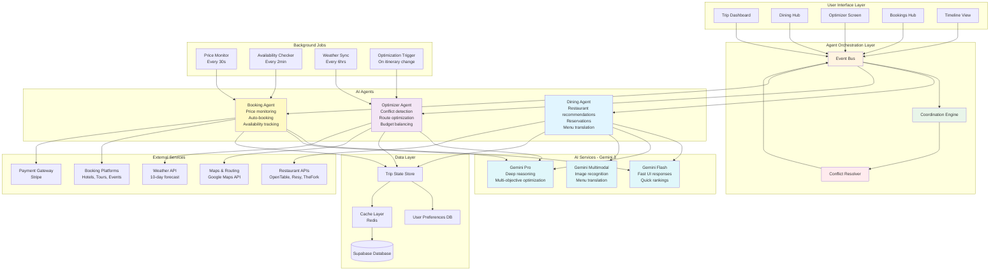

# Phase 1 Implementation Plan: Top 3 AI Agents
## Trip Operating System - Dining, Optimizer, Booking Assistant

**Status:** Planning  
**Timeline:** Months 1-3  
**Priority:** CRITICAL PATH  
**Last Updated:** December 18, 2025

---

## Progress Tracker

### Overall Progress: 0% Complete

```
[░░░░░░░░░░░░░░░░░░░░] 0/100

Phase 1.1: Foundation & Design System     [░░░░░░░░░░] 0/10 tasks
Phase 1.2: Dining Orchestrator           [░░░░░░░░░░] 0/15 tasks
Phase 1.3: Itinerary Optimizer           [░░░░░░░░░░] 0/12 tasks
Phase 1.4: Booking Assistant             [░░░░░░░░░░] 0/11 tasks
Phase 1.5: Integration & Testing         [░░░░░░░░░░] 0/8 tasks
Phase 1.6: Production Launch             [░░░░░░░░░░] 0/6 tasks
```

### Milestones

- [ ] **M1.1** - Design system complete (Week 2)
- [ ] **M1.2** - Dining agent MVP (Week 5)
- [ ] **M1.3** - Optimizer agent MVP (Week 8)
- [ ] **M1.4** - Booking agent MVP (Week 10)
- [ ] **M1.5** - Integration complete (Week 11)
- [ ] **M1.6** - Production launch (Week 12)

---

## Short Summary

Below are **copy-paste Figma Make AI prompts** to design and build a **Trip OS** around your top 3 agents (Dining, Optimizer, Booking). You'll get: **responsive screens (mobile/tablet/desktop), wireframes → polished UI, components, correct routes + links, user journeys, workflows, and Mermaid diagrams**, plus **Gemini 3 agent/tool logic**.

---

# Phase 1.1: Global Foundation & Design System

## Task 1.1.1: Design System Setup (Priority: CRITICAL)

### Prompt for Figma Make AI

```markdown
You are a Senior Product Designer + UX Architect.

Project: Local Scout — Trip Operating System
Style: Calm luxury, modern travel OS, image-forward, high trust.
Goal: Reduce planning time 75% + increase bookings 35%.

Create a comprehensive design system with:

1) TOKENS & VARIABLES
- Color palette: Primary (trust blue), Secondary (energy coral), Success, Warning, Error, Neutrals (8 shades)
- Typography scale: Display/H1/H2/H3/Body/Caption with line heights
- Spacing: 4px base unit (4, 8, 12, 16, 24, 32, 48, 64, 96px)
- Radius: none, sm (4px), md (8px), lg (12px), xl (16px), full
- Shadows: sm, md, lg, xl with proper elevation
- Breakpoints: mobile (375px), tablet (768px), desktop (1024px), wide (1440px)

2) COMPONENT LIBRARY
Core components:
- Button (primary, secondary, ghost, danger) with loading + disabled states
- Input (text, search, date, select) with error + focus states
- Card (default, elevated, outlined, interactive)
- Badge (status, category, trust signal)
- Chip (filter, tag, removable)
- Avatar (user, venue, city)
- Rating display (stars, numeric, with count)
- Price display (with currency, range, discount)
- Timeline block (time, icon, duration, buffer indicator)
- Empty state (illustration, headline, action)
- Loading skeleton (card, list, detail)
- Error state (retry, contact support, go back)
- Toast/Alert (success, error, warning, info)
- Modal/Dialog (small, medium, large, fullscreen)
- Bottom sheet (mobile)
- Drawer (side panel)

3) LAYOUT TEMPLATES
- Mobile-first responsive grid (12 columns)
- Max content width: 1280px
- Gutters: 16px mobile, 24px tablet, 32px desktop
- Sticky header height: 56px mobile, 64px desktop
- Bottom nav height: 60px (mobile only)
- Safe areas for notches/home indicators

4) NAVIGATION STRUCTURE
Top Navigation (Desktop):
- Logo (left) → clickable to /
- Home | Discover | My Trips | Saved (center)
- Search icon | Notifications | Account avatar (right)

Bottom Navigation (Mobile):
- Trip (home icon) → /trip/:tripId
- Explore (compass icon) → /discover
- Saved (bookmark icon) → /saved
- Bookings (calendar icon) → /trip/:tripId/bookings
- More (menu icon) → account options

Sidebar Navigation (Trip Context):
- Trip header (city, dates, travelers)
- Today's Plan
- Timeline
- Dining
- Bookings
- Optimizer
- Saved Places
- Trip Settings

Footer (All Screens):
About • Partnerships • Terms • Privacy • Support • Blog • Careers • Become a Partner

5) ROUTES & DEEP LINKING
Create these routes with proper navigation:
/ → Home/Landing
/discover → Explore destinations
/trip/new → Create new trip wizard
/trip/:tripId → Trip dashboard (hub)
/trip/:tripId/timeline → Full itinerary timeline
/trip/:tripId/dining → Dining orchestrator hub
/trip/:tripId/dining/:placeId → Restaurant detail + reservation
/trip/:tripId/optimizer → Itinerary optimizer
/trip/:tripId/bookings → Booking assistant hub
/trip/:tripId/bookings/:bookingId → Booking detail
/trip/:tripId/saved → Saved places for this trip
/trip/:tripId/settings → Trip settings
/account → User account settings
/account/payment → Payment methods
/account/preferences → AI preferences
/help → Help center
/terms → Terms of service
/privacy → Privacy policy

6) ACCESSIBILITY REQUIREMENTS (WCAG AA)
- Minimum contrast ratio: 4.5:1 for text, 3:1 for UI
- Tap targets: minimum 44x44px
- Focus indicators: 2px solid outline with offset
- Skip navigation links
- Proper heading hierarchy (h1 → h6)
- Alt text for all images
- ARIA labels for icons-only buttons
- Keyboard navigation support
- Screen reader friendly copy

7) VISUAL RULES (STRICT)
- Mobile-first: design mobile, then adapt up
- Strong hierarchy: headline → summary → action → detail
- One primary CTA per screen (max 1-2 secondary)
- Cards are image-driven with trust signals visible
- Sticky bottom action bar on mobile for primary actions
- Loading states for all async actions (min 300ms visible)
- Optimistic UI updates with rollback on error
- Animations: 200ms fast, 300ms standard, 500ms emphasis
- Images: lazy load, WebP with fallback, proper aspect ratios

8) TYPOGRAPHY RULES
- Headline/Display: SemiBold or Bold only
- Body text: Regular weight, 16px minimum
- Captions: Regular weight, 14px minimum
- Line height: 1.5 for body, 1.2 for headlines
- Letter spacing: -0.02em for large text
- Tabular numerals for prices, times, ratings
- Never use ALL CAPS for body text
- Use sentence case for CTAs

9) MICROCOPY PRINCIPLES
- Be conversational: "You'll save 52 minutes" not "Travel time reduced"
- Show confidence: "I'm 92% confident this fits your budget"
- Explain why: "Based on your love of seafood + your 7pm location"
- Be honest: "I couldn't find a perfect match, here are close alternatives"
- Reduce anxiety: "Free cancellation until 2 hours before"
- Create urgency (when true): "2 tables left at your preferred time"

10) TRUST & SAFETY PATTERNS
- Always show data sources: "Based on 847 reviews from locals"
- Permission-first: "Can I automatically book when prices drop?"
- Reversible actions: "Cancel anytime" + clear refund policy
- Audit trail: "Here's why I made this change"
- Human override: "Lock this item" or "I'll handle this manually"
- Contact escape hatch: "Talk to a human" on every error/confusing state

DELIVERABLES:
- Design system documentation page
- Component library (Figma/Storybook-style)
- Layout templates for all screen sizes
- Navigation flow diagram
- Route structure document

Generate all of the above as a comprehensive design system foundation.
```

**Acceptance Criteria:**
- [ ] All 10 sections complete and documented
- [ ] Components have light/dark mode variants
- [ ] Mobile, tablet, desktop templates created
- [ ] Navigation structure matches route list
- [ ] Accessibility audit passed (contrast, tap targets, focus)
- [ ] Microcopy examples for all component states

**Dependencies:** None  
**Estimated Time:** 3-4 days  
**Assigned To:** Design Lead + Front-End Architect

---

## System Architecture Diagram



---

# Phase 1.2: Agent 1 - Restaurant & Dining Orchestrator 🍽️

## Task 1.2.1: Dining Hub Core Screen (Priority: HIGH)

### Prompt for Figma Make AI

```markdown
Create the Dining Hub screen - the command center for all dining decisions.

Route: /trip/:tripId/dining

CONTEXT:
User is planning a 5-day trip to Medellin. They have a partial itinerary with a museum visit at 3pm today in El Poblado. System knows they love seafood, prefer mid-range pricing ($20-40/person), and have mentioned "anniversary" in trip notes.

SCREEN STRUCTURE:

1) SMART SEARCH HEADER (Top, sticky on scroll)
Components:
- Search input: "Where do you want to eat?"
  - Placeholder rotates: "Dinner in Provenza tonight" → "Coffee near my hotel" → "Rooftop with sunset views"
  - Voice search icon (right side)
  - Search triggers instant AI filtering
- Context chip (dismissible): 
  - "Based on: Museum visit ends 5pm + You're in El Poblado"
  - Icon: lightbulb
  - Tap to see full reasoning
- Filter row (horizontal scroll chips):
  - Time: "Now" | "Lunch" | "Dinner" | "Late Night"
  - Distance: "Walking" | "< 15 min drive" | "Anywhere"
  - Price: "$" | "$$" | "$$$" | "$$$$"
  - Vibe: "Romantic" | "Casual" | "Local classic" | "Trendy"
  - Diet: "Vegan options" | "Gluten-free" | "Halal"
  - More filters button → opens drawer with 20+ options

2) AI TOP PICKS (Hero section)
Title: "I picked these 3 for your anniversary dinner tonight"
Subtitle: "Based on: seafood preference + El Poblado location + 7-9pm availability"

Card Layout (Large cards, swipeable on mobile):
Each card shows:
- **Hero image** (3:2 aspect ratio, 600x400px min)
  - Badge overlay top-right: "Best Match" | "Locals Love" | "Selling Fast"
  - Heart icon (top-left) to save
- **Restaurant name** (H3, semibold)
- **Trust row:**
  - Star rating: 4.8 ⭐ (247 reviews)
  - Price: $$ (visual price icons)
  - Verified badge: "92% local clientele"
- **Key details row:**
  - Distance: 🚶 8 min walk from museum
  - Available: ✅ 7:00 PM, 7:30 PM, 8:00 PM
  - Wait estimate: Low wait
- **Why this?** (1 sentence in conversational tone)
  - "Known for ceviche + romantic ambiance + fits your $80 dinner budget"
- **Primary CTA:** "Reserve 7:30 PM" (button, primary color)
- **Secondary CTA:** "See menu & details" (text link)

Show 3 cards. After viewing, prompt: "Want 3 more options?" → generates additional set.

3) CATEGORY QUICK FILTERS (Scrollable chips row)
- 🍕 Quick Bite (< $15)
- ☕ Coffee & Pastry
- 🌆 Rooftop Views
- 🇨🇴 Local Classic
- 🍷 Fine Dining
- 🌱 Vegan Friendly
- 🐟 Seafood
- 🎉 Group Dining
- 🌮 Street Food
- 🍜 Asian Fusion
Each tappable → instantly filters main results list

4) ALL RESULTS (Scrolling list, infinite scroll)
Title: "127 restaurants match your filters"
Sort dropdown: "Best Match" | "Highest Rated" | "Closest" | "Budget Friendly" | "Opening Soon"

Compact Card Layout:
- **Left:** Square image (120x120px)
- **Right:** Info column
  - Name (H4)
  - Rating + reviews + price
  - Distance + travel time
  - Open status: "Open now" (green) | "Opens at 5 PM" (amber) | "Closed" (gray)
  - Wait estimate: "15-min wait" or "No wait"
  - Quick action row:
    - "Reserve" button (if has online booking)
    - "Call" button (if phone only)
    - "Add note" icon (to save for later with custom note)
    - Heart icon (save/unsave)

5) FLOATING ACTION BUTTON (Mobile, Bottom-right)
- Primary: "Ask AI" (opens chat overlay)
  - User can say: "Find me somewhere with outdoor seating for 4 people at 6pm"
  - AI responds in chat, then filters results in real-time

6) STICKY BOTTOM BAR (Mobile only, appears when user scrolls past hero)
- Shows current filter count: "15 filters applied"
- Primary CTA: "Reserve best match" (books top AI pick instantly)
- Secondary: "Clear filters"

STATES TO DESIGN:

**Empty State:**
- Illustration: empty plate with question mark
- Headline: "No restaurants match your filters"
- Subtext: "Try removing some filters or search a different neighborhood"
- CTA: "Reset filters" + "Ask AI for help"

**Loading State:**
- Skeleton cards (shimmer animation)
- Show 3 hero skeletons + 6 list skeletons
- Top search remains interactive

**Error State:**
- Icon: warning triangle
- Headline: "Couldn't load restaurants"
- Subtext: "Check your connection or try again"
- CTA: "Retry" + "Contact support"

**No Availability State:**
- Card shows: "No tables available at your preferred time"
- Suggest: "I found tables at 6:00 PM and 9:30 PM instead"
- Show alternative time slots as chips
- CTA: "See all availability"

INTERACTIONS:

1. User taps search → keyboard opens, suggestions appear below
2. User selects filter chip → results update instantly (no reload)
3. User taps "Reserve" → opens reservation sheet (next task)
4. User taps "See menu & details" → navigates to /trip/:tripId/dining/:placeId
5. User scrolls to bottom → loads next 20 results
6. User taps "Ask AI" → chat overlay slides up from bottom
7. User hearts a restaurant → adds to trip saved list + shows toast "Saved to your trip"

RESPONSIVE BEHAVIOR:

**Mobile (< 768px):**
- Stack everything vertically
- Hero cards: 1 per row, horizontal scroll/swipe
- Results list: 1 per row, full width
- Sticky bottom bar appears on scroll
- FAB "Ask AI" always visible

**Tablet (768-1024px):**
- Hero cards: 2 per row
- Results list: 2 per row
- Side margins increase
- Filters expand to show more without scroll

**Desktop (> 1024px):**
- Max width 1280px, centered
- Hero cards: 3 per row (grid)
- Results list: 2-column layout
- Right sidebar: Map view (shows pins for all results)
- Filters: full row, no scroll
- No bottom bar (actions in cards)

ACCESSIBILITY:

- All images have alt text: "Carmen restaurant - rooftop dining with city views"
- Buttons have aria-labels: "Reserve table at Carmen for 7:30 PM"
- Focus order: Search → Filters → Hero cards → Results → FAB
- Keyboard navigation: Tab through cards, Enter to open details
- Screen reader announces filter changes: "15 restaurants found"
- Color contrast: 4.5:1 minimum for all text

MICROCOPY EXAMPLES:

Search placeholders:
- "Romantic dinner spot in Poblado"
- "Quick lunch near my next activity"
- "Best bandeja paisa in Laureles"
- "Vegan-friendly brunch café"

AI explanations:
- "I chose these because you loved ceviche in Lima last year + this chef trained there"
- "This spot is perfect: 8-min walk from your hotel, great for couples, within budget"
- "Locals eat here (not a tourist trap) + it's famous for seafood"
- "This opened last month but already 4.9 stars from verified diners"

Trust signals:
- "Verified by 847 local reviews"
- "92% of diners were locals, not tourists"
- "Featured in Condé Nast Traveler 2024"
- "Free cancellation until 2 hours before"
- "Responds to reservations within 15 minutes"

No-availability fallback:
- "Fully booked, but I found something even better nearby"
- "This time is popular! Reserve now or try 1 hour earlier"
- "Want me to notify you if a table opens up?"

PERFORMANCE TARGETS:

- Initial load: < 2s
- Filter interaction: < 200ms
- Infinite scroll trigger: 2 screens before end
- Image lazy load: 1 screen ahead
- API debounce on search: 300ms

DATA REQUIREMENTS:

For each restaurant, need:
- name, cuisine, neighborhood
- rating (avg), review_count, price_range
- photos (min 1, prefer 5+)
- lat/lng coordinates
- distance_from_user, travel_time (walk/drive)
- open_hours, currently_open
- wait_estimate (realtime or ML predicted)
- availability_slots (for today + next 7 days)
- dietary_tags (vegan, gluten_free, halal, etc)
- local_clientele_percentage (trust metric)
- booking_method (online, phone, walk-in)
- special_features (outdoor, rooftop, live_music, view)
- why_recommended (AI generated explanation)

Create the full Dining Hub with all states, interactions, and responsive layouts.
```

**Acceptance Criteria:**
- [ ] All 6 sections implemented (search, hero, categories, results, FAB, bottom bar)
- [ ] 4 states designed (empty, loading, error, no-availability)
- [ ] Mobile, tablet, desktop layouts responsive
- [ ] All interactions have smooth transitions (<300ms)
- [ ] Accessibility audit passed
- [ ] Microcopy reviewed and approved
- [ ] Performance targets met in testing

**Dependencies:** Task 1.1.1 (Design System)  
**Estimated Time:** 5-6 days  
**Assigned To:** Front-End Dev + Designer

---

## Task 1.2.2: Restaurant Detail & Reservation Flow (Priority: HIGH)

### Prompt for Figma Make AI

```markdown
Create the Restaurant Detail screen and Reservation booking flow.

Route: /trip/:tripId/dining/:placeId

CONTEXT:
User tapped "See menu & details" on Carmen restaurant from Dining Hub. They're planning anniversary dinner for 2 people at 7:30 PM tonight.

SCREEN STRUCTURE:

1) HERO SECTION
- Full-width image gallery (swipeable)
  - Show 5-8 photos: exterior, interior, food, ambiance, view
  - Indicators: 1/8 dots at bottom
  - Tap to expand fullscreen gallery
  - Close button (X) top-right to go back
- Floating elements over hero:
  - Back button (top-left): ← to /trip/:tripId/dining
  - Share button (top-right): share restaurant link
  - Heart button (top-right): save/unsave
  - Badge (bottom-left): "Best Match for Anniversary"

2) HEADER INFO
- Restaurant name (H1): "Carmen"
- Subtitle: "Contemporary Colombian • El Poblado"
- Trust row (horizontal layout):
  - ⭐ 4.8 (847 reviews) - tap to see reviews
  - Price: $$$ (visual icons)
  - Verified badge: "93% local diners"
  - Distance: 🚶 8 min walk from Museum
  - Open status: "Open until 11 PM" (green)

3) QUICK ACTIONS ROW (Horizontal buttons)
- Primary: "Reserve Table" (large, primary color) - jumps to booking section
- Secondary: "View Menu" (opens menu modal)
- Secondary: "Get Directions" (opens maps)
- Icon: Call restaurant

4) WHY AI PICKED THIS (Expandable card)
- Headline: "Why I chose this for you"
- Content (conversational bullets):
  - ✓ "You mentioned 'anniversary' in your trip notes"
  - ✓ "You loved ceviche at La Mar in Lima (trip from March 2024)"
  - ✓ "This chef trained at Central (your favorite from Peru)"
  - ✓ "Perfect timing: 8-min walk from your 5 PM museum visit"
  - ✓ "Within your $80 dinner budget ($75 average for 2)"
  - ✓ "Romantic ambiance: rooftop seating, sunset views"
- Confidence meter: "92% match confidence" (visual bar)
- Expand/collapse toggle

5) KEY DETAILS (Grid layout, 2 columns on desktop)
- **Ambiance tags:** Romantic • Upscale • Rooftop • Sunset Views
- **Best for:** Couples, Special Occasions
- **Dress code:** Smart Casual
- **Noise level:** Moderate (conversation-friendly)
- **Good for:** Seafood, Wine Selection, Desserts
- **Popular dishes:** Ceviche Cartagenero, Grilled Octopus, Tres Leches
- **Average meal duration:** 1.5-2 hours

6) AVAILABILITY SELECTOR (Reservation section, sticky on scroll)
Title: "Reserve your table"

**Date picker:**
- Default: Today (current trip day)
- Shows next 7 days as horizontal chips
- If date outside restaurant hours → show "Closed on Mondays"

**Party size:**
- Dropdown: 1, 2, 3, 4, 5, 6, 7, 8, 9, 10+ people
- Default: 2 (from trip context)

**Time slot grid:**
- Available times: 6:00, 6:30, 7:00, 7:30, 8:00, 8:30, 9:00, 9:30 PM
- Visual states:
  - Available: blue button, tap to select
  - Limited (< 3 tables): yellow button, "2 left" badge
  - Unavailable: gray, disabled
  - Selected: dark blue, checkmark
- Show wait estimate for each slot: "Low wait" | "15-min wait" | "30-min wait"
- If no availability: "Fully booked. Show alternative times?" → expands to show +/- 2 hours

**Seating preference (optional):**
- Chips: Indoor | Outdoor | Rooftop | Window | Bar
- Default: based on AI preference (Outdoor for anniversary)

**Special requests section:**
- Text area: "Any dietary restrictions or special requests?"
- Pre-filled suggestions (based on user profile):
  - "Celebrating anniversary - could you arrange something special?"
  - "Window table preferred"
  - "One diner is gluten-free"
- Character limit: 200

**Dietary tags (from user profile):**
- Auto-filled chips: "Gluten-free options needed" (if user has restriction)
- Editable/removable

7) SMART SUGGESTIONS (AI assistant card)
- Appears if user selects 7:30 PM slot
- Message: "💡 Pro tip: Your museum visit ends at 5 PM. Want me to add a 30-min buffer for travel + rest before dinner?"
- Actions:
  - "Yes, add buffer" → adjusts itinerary automatically
  - "No thanks" → dismisses

8) PRICING ESTIMATE
- "Estimated total: $75 for 2 people"
- Breakdown (expandable):
  - Food: ~$60
  - Drinks: ~$15 (2 glasses wine)
  - Tip (15%): ~$11
  - Total: ~$86
- Budget status: "Within your $80 dinner budget ✓" (green) or "Exceeds budget by $6" (yellow)
- If over budget: "Want cheaper alternatives?" → link to similar restaurants

9) MENU PREVIEW (Collapsible section)
- Title: "Menu highlights"
- Show 6-8 popular dishes with:
  - Photo (square, 200x200px)
  - Dish name
  - Description (1 sentence)
  - Price
- Dietary icons: 🌱 Vegan | 🌾 Gluten-free | 🌶️ Spicy
- CTA: "View full menu" → opens menu modal
- Translate button: "🌐 Translate to English" (Gemini multimodal)

10) REVIEWS PREVIEW (Collapsible section)
- Title: "What diners are saying"
- Show 3 recent reviews:
  - Reviewer name + avatar
  - Star rating
  - Date: "3 days ago"
  - Review text (2-3 sentences max)
  - Helpful votes: "47 found helpful"
  - Verified badge: "Verified diner"
- Filter chips: "All" | "Locals" | "Tourists" | "Couples" | "Groups"
- CTA: "Read all 847 reviews" → opens reviews modal

11) LOCATION & HOURS
- Mini map (static, tappable to open full map)
- Address: "Carrera 40 #10-23, El Poblado, Medellín"
- Distance from current location: "8-min walk from Museum"
- Walking time: "Fits perfectly after your 5 PM museum visit"
- Hours:
  - Mon-Thu: 12 PM - 10 PM
  - Fri-Sat: 12 PM - 11 PM
  - Sun: Closed
- CTA: "Get directions" → opens maps app

12) SIMILAR RESTAURANTS (If user scrolls to bottom)
- Title: "Similar romantic spots nearby"
- Show 3 cards (compact version of Dining Hub cards)
- CTA: "See more restaurants" → back to Dining Hub

13) STICKY BOTTOM BAR (Mobile only)
- Shows selected time: "7:30 PM for 2 people"
- Primary CTA: "Confirm Reservation"
- If nothing selected: "Select a time to continue"

RESERVATION CONFIRMATION FLOW:

When user taps "Confirm Reservation":

**Step 1: Review modal (slides up from bottom)**
- Header: "Review your reservation"
- Summary card:
  - Restaurant name + image
  - Date: "Tonight, Dec 18, 2025"
  - Time: "7:30 PM"
  - Party size: "2 people"
  - Seating: "Outdoor/Rooftop preferred"
  - Special requests: [their text]
- Contact info:
  - Phone number (from user profile, editable)
  - Email (from user profile, editable)
  - "Send confirmation to this number and email"
- Cancellation policy:
  - "Free cancellation until 5:30 PM (2 hours before)"
  - "No-show or late cancel: $20 fee per person"
- Checkbox: "I agree to the cancellation policy"
- Actions:
  - Primary: "Confirm & Book"
  - Secondary: "Go back"

**Step 2: Booking processing (loading state)**
- Show spinner
- Message: "Securing your table at Carmen..."
- Submessages rotate every 2s:
  - "Checking availability..."
  - "Confirming with restaurant..."
  - "Sending confirmation..."

**Step 3: Success state**
- Animation: checkmark appears
- Headline: "You're all set! 🎉"
- Confirmation card:
  - Booking reference: #CM-2512-8472
  - Restaurant: Carmen
  - Date/time: Tonight at 7:30 PM
  - Party size: 2 people
  - Address + map
- What happens next:
  - ✓ "Added to your trip timeline"
  - ✓ "Confirmation sent to [phone] and [email]"
  - ✓ "I'll send a reminder 2 hours before"
  - ✓ "Added 30-min travel buffer after museum"
- Actions:
  - Primary: "View in timeline" → /trip/:tripId/timeline
  - Secondary: "Done" → back to Dining Hub
  - Tertiary: "Add to calendar" → exports .ics file

**Error handling:**
- If booking fails:
  - Icon: ⚠️
  - Headline: "Couldn't complete reservation"
  - Reason: "Table no longer available" or "Restaurant didn't respond"
  - Suggested action:
    - "Try booking 8:00 PM instead?" (if available)
    - "I found 3 similar restaurants with availability" (show alternatives)
  - CTA: "Try again" + "Contact support"

ADVANCED FEATURES:

**Pre-Order Menu Items (Premium feature)**
- If user has premium subscription:
  - Section appears: "Pre-order your meal"
  - Benefits: "Skip menu decisions, food arrives 10 min faster, kitchen prepares fresh"
  - Browse menu, add items to cart
  - Submit preferences with reservation
  - Can change until 1 hour before
  - Upsell: "Upgrade to Premium for $9.99/month to unlock pre-ordering"

**Automatic Itinerary Integration:**
- After confirmation, show:
  - "I updated your timeline:"
  - Before: Museum 3-5 PM → [gap] → Dinner 7:30 PM
  - After: Museum 3-5 PM → Rest/freshen up 5-6:30 PM → Walk to Carmen 6:45 PM → Dinner 7:30-9:30 PM → After-dinner walk 9:30 PM
  - "This gives you a relaxed pace with no rushing"

**Group Coordination:**
- If trip has multiple travelers:
  - "Send reservation details to all trip members?"
  - Shows list of travelers with checkboxes
  - "They'll receive confirmation and can add to their calendars"

STATES TO DESIGN:

1. **Loading state:** Skeleton of all sections
2. **Error state:** "Couldn't load restaurant details" + retry
3. **Closed state:** "Carmen is closed tonight" + suggest other dates or alternatives
4. **Fully booked state:** "No availability tonight" + show next available date or similar restaurants
5. **Premium upsell modal:** If user tries pre-ordering without subscription

RESPONSIVE BEHAVIOR:

**Mobile:**
- Single column
- Sticky bottom bar with "Confirm Reservation"
- Time slots: 3 per row
- Menu items: 2 per row

**Tablet:**
- Single column, wider margins
- Time slots: 4 per row
- Menu items: 3 per row

**Desktop:**
- Two-column layout:
  - Left (60%): Details, menu, reviews
  - Right (40%): Sticky reservation card (stays fixed on scroll)
- Time slots: 5 per row
- Menu items: 4 per row

ACCESSIBILITY:

- All interactive elements: min 44px tap target
- Reservation form: proper labels, error states, aria-describedby
- Time slots: keyboard navigable (arrow keys)
- Screen reader announces: "Table available for 7:30 PM, 2 tables remaining"
- Focus trap in modal
- Escape key closes modals

PERFORMANCE:

- Hero images: lazy load, WebP format
- Menu images: load on section expand
- Map: static image, loads full interactive on tap
- Reviews: paginated, load 3 initially
- Form validation: real-time, debounced 300ms

Create the full Restaurant Detail screen and reservation flow with all states and responsive layouts.
```

**Acceptance Criteria:**
- [ ] 13 sections implemented and responsive
- [ ] Reservation flow: 3 steps (review, processing, success)
- [ ] Error handling for all failure scenarios
- [ ] Automatic itinerary integration works
- [ ] Premium pre-order feature with upsell modal
- [ ] Accessibility audit passed
- [ ] Performance targets met (<2s load, <200ms interactions)

**Dependencies:** Task 1.2.1 (Dining Hub)  
**Estimated Time:** 6-7 days  
**Assigned To:** Front-End Dev + Designer

---

## Dining Agent Workflow Diagram



---

## Task 1.2.3: Menu Translation Feature (Gemini Multimodal)

### Prompt for Figma Make AI

```markdown
Create menu translation feature using Gemini 3's multimodal capabilities.

FEATURE: User can photograph restaurant menu (Spanish) → get instant English translation + dish recommendations.

INTEGRATION POINTS:
1. In Restaurant Detail screen: "Translate Menu" button
2. In dining reservation confirmation: "View translated menu"
3. Standalone: Camera icon in Dining Hub search bar

USER FLOW:

**Step 1: Trigger**
- User taps "🌐 Translate Menu" button
- Permission check: camera access
- Opens camera overlay (fullscreen)

**Step 2: Capture**
- Live camera view
- Overlay guide: "Frame the menu in the box"
- Helpful box outline (guides composition)
- Capture button (large, bottom center)
- Flash toggle (if low light)
- Gallery icon (upload existing photo)

**Step 3: Processing**
- Show captured image
- Overlay: "Analyzing menu..."
- Progress indicator
- Submessages rotate:
  - "Reading text..."
  - "Translating..."
  - "Identifying dishes..."

**Step 4: Results screen**
Layout:
- Original menu image (left/top, zoomable)
- Translated text (right/bottom)
- Smart overlay: tap any dish on photo → highlights translation

For each dish:
- Name (translated)
- Description (translated)
- Ingredients (key items highlighted)
- Dietary tags (auto-detected): 🌱 Vegan | 🌾 GF | 🌶️ Spicy | 🥜 Contains nuts
- Price (converted to USD if needed)
- AI suggestion badge: "You'll love this" (if matches user preferences)

**Additional features:**
- "Explain this dish" → AI provides cultural context
  - Example: "Bandeja Paisa is a traditional Antioquia platter with beans, rice, pork, chorizo, fried egg, plantain, and arepa. Very filling!"
- "Pronunciation guide" → phonetic spelling + audio button
- "Similar to..." → maps to familiar dishes
  - Example: "Ajiaco is similar to chicken soup but with potatoes, corn, and capers"
- "Safe for my diet?" → checks against user restrictions
  - If user is gluten-free: highlights "Contains wheat" in red

**Step 5: Actions**
- "Save translation" → adds to trip notes
- "Share with group" → sends to other trip members
- "Pre-order these items" → adds to reservation (premium)
- "Back to restaurant details"
- "Translate another menu"

ERROR STATES:
- Poor lighting: "Try using flash or move to better light"
- No text detected: "Make sure the menu is clearly visible"
- API failure: "Translation unavailable. Try again or contact support"

TECHNICAL REQUIREMENTS:
- Use Gemini 3 Vision API
- OCR accuracy: > 95% for Spanish text
- Translation quality: Native-level fluency
- Processing time: < 5 seconds for standard menu (20-30 items)
- Offline fallback: "Translation requires internet connection"

DESIGN SPECS:
- Camera overlay: full screen, dark background
- Guide box: dashed outline, white, 80% viewport width
- Results: split view (desktop), tabs (mobile)
- Dish cards: expandable for full description
- Pronunciation: IPA notation + audio player

Create the menu translation feature with all screens and states.
```

**Acceptance Criteria:**
- [ ] Camera capture interface implemented
- [ ] Gemini 3 Vision API integrated
- [ ] Translation accuracy >95% in testing
- [ ] Dietary detection works for 10+ common restrictions
- [ ] Processing time <5s for typical menus
- [ ] Offline state handled gracefully
- [ ] Results screen responsive and accessible

**Dependencies:** Task 1.2.2 (Restaurant Detail), Gemini 3 API access  
**Estimated Time:** 4-5 days  
**Assigned To:** AI Integration Engineer + Front-End Dev

---

## Task 1.2.4-1.2.15: Additional Dining Features

### Quick Task List

**Task 1.2.4:** Dietary Preferences Management (2 days)  
**Task 1.2.5:** Dining Autopilot Settings (Premium, 3 days)  
**Task 1.2.6:** Group Dining Coordinator (3 days)  
**Task 1.2.7:** Wait Time Prediction Engine (4 days)  
**Task 1.2.8:** Restaurant Comparison Tool (2 days)  
**Task 1.2.9:** Dining Budget Tracker (2 days)  
**Task 1.2.10:** Post-Meal Review Facilitation (2 days)  
**Task 1.2.11:** Restaurant Chat Integration (3 days)  
**Task 1.2.12:** Alternative Suggestions (Sold Out) (2 days)  
**Task 1.2.13:** Walking Route to Restaurant (2 days)  
**Task 1.2.14:** Restaurant Booking Reminders (2 days)  
**Task 1.2.15:** Dining Agent Testing & QA (5 days)

**Total Estimated Time for Phase 1.2: 35-40 days**

---

# Phase 1.3: Agent 2 - Smart Itinerary Optimizer 🎯

## Task 1.3.1: Optimizer Dashboard (Priority: HIGH)

### Prompt for Figma Make AI

```markdown
Create the Smart Itinerary Optimizer screen - the AI that saves time and reduces stress.

Route: /trip/:tripId/optimizer

CONTEXT:
User has a 4-day Medellin trip with 18 activities planned. Current itinerary has problems:
- Day 2: Comuna 13 tour ends 4 PM, dinner reservation in Poblado at 6 PM (impossible given traffic)
- Day 3: Too many activities (7 items, would take 14 hours)
- Day 4: Museum opens at 10 AM, user booked it for 8 AM
- Overall: 3.5 hours of daily travel time (could be reduced to 1.2 hours)
- Budget: Exceeding by $145 due to expensive activities

SCREEN STRUCTURE:

1) HERO SUMMARY (Top banner, attention-grabbing)
Visual:
- Large number callout (primary color): "Save 52 minutes per day"
- Secondary metrics:
  - "Reduce travel time by 47%"
  - "Fix 4 scheduling conflicts"
  - "Stay within budget"
- Confidence meter: "I'm 94% confident this will improve your trip"
- Primary CTA: "See Optimized Plan" (large button)
- Secondary CTA: "Tell me what's wrong" (shows problems without optimization)

Tone: Encouraging, not critical. Example:
- "Your itinerary is good! I found some ways to make it even better."
- Not: "Your itinerary has problems."

2) PROBLEMS IDENTIFIED (Expandable cards, show 3-4 most important)
Each problem card:
- Icon (visual indicator of problem type)
- Title: "Tight schedule on Day 2"
- Impact level: High (red) | Medium (yellow) | Low (gray)
- Description: "You have 45 min to get from Comuna 13 to Poblado, but with traffic it takes 60-90 min. You'll likely miss your dinner reservation."
- Consequence: "Risk: 70% chance of being late or rushing"
- Suggested fix preview: "Move dinner to 7:30 PM or swap Comuna 13 to morning"
- CTA: "Fix this" (jumps to solution)

Problem categories:
1. **Scheduling Conflicts**
   - Impossible transitions (not enough travel time)
   - Double-booked time slots
   - Venue closed during planned visit
   - Activity duration underestimated
2. **Overloaded Days**
   - Too many activities (fatigue risk)
   - No rest breaks
   - Back-to-back high-energy activities
3. **Inefficient Routing**
   - Excessive backtracking
   - Unnecessary long travel times
   - Could cluster activities by location
4. **Budget Overruns**
   - Exceeding daily or total budget
   - Expensive items that have cheaper alternatives
   - Missing group discounts or combos
5. **Weather Mismatches**
   - Outdoor activities scheduled during rain forecast
   - Indoor activities during perfect weather
6. **Missed Opportunities**
   - Free time gaps that could fit something
   - Nearby attractions being missed
   - Better experiences available at same time/price

3) OPTIMIZED PLAN - BEFORE/AFTER COMPARISON
View toggle: "Before vs After" (side-by-side on desktop, toggle on mobile)

**Before (Original) Timeline:**
- Shows user's current itinerary
- Highlight problems in red:
  - Conflicts: red border + warning icon
  - Inefficiencies: yellow highlight
  - Budget overruns: red price tags
- Travel time shown as red arrows (excessive)

**After (Optimized) Timeline:**
- Shows AI-optimized itinerary
- Highlight changes in green:
  - Moved items: green "MOVED" badge
  - Swapped items: blue "SWAPPED" badge
  - New buffer time: green "ADDED REST" badge
  - Removed items: gray "REMOVED" badge (with explanation)
- Travel time shown as green arrows (reduced)
- Savings callouts: "-37 min" in green

**Change indicators:**
- Show what changed and why
- Visual diff markers (arrows, colors, badges)
- Annotations: "This moved to avoid traffic"

**Day-by-Day Breakdown:**
Each day card shows:
- Day header: "Day 2 - Wednesday, Dec 19"
- Before metrics:
  - 7 activities
  - 2.1 hours travel time
  - $180 spend
  - 14 hours active time
  - Stress level: High
- After metrics:
  - 5 activities (2 removed)
  - 1.3 hours travel time (-38% ⬇️)
  - $155 spend (-$25 ⬇️)
  - 10 hours active time
  - Stress level: Moderate
- Timeline view (compact):
  - 8:00 AM - Breakfast near hotel ✅ (no change)
  - 9:30 AM - Comuna 13 Tour 🔄 (moved from 2 PM)
  - 1:00 PM - Lunch in Comuna 13 🆕 (added, saves travel)
  - 2:30 PM - Rest at hotel 🆕 (added buffer)
  - 4:00 PM - Pueblito Paisa 🔄 (moved from Day 3)
  - 6:00 PM - Walk to Poblado ✅ (no change)
  - 7:30 PM - Dinner at Carmen 🔄 (changed from 6 PM)
  - 10:00 PM - End day

4) WHY THESE CHANGES? (Explanation section, builds trust)
For each major change, show reasoning:
- "I moved Comuna 13 to morning because:"
  - ✓ Morning light is better for photos
  - ✓ Avoids afternoon crowds (peak time 2-5 PM)
  - ✓ Gives you more time before dinner
  - ✓ Reduces stress of rushing
- "I removed the Botanical Garden visit because:"
  - ✗ Would have required 90 min of backtracking
  - ℹ️ Replaced with Pueblito Paisa (similar nature vibe, on the way)
  - 💰 Saves $15 and 52 minutes
  - 📋 "Want to keep it anyway?" (user can override)

Show confidence scores:
- "I'm 89% confident moving Comuna 13 to morning improves your day"
- Confidence based on: user preferences, historical data, reviews, logistics

5) CONSTRAINTS & PREFERENCES (Side panel or expandable section)
Allow user to set rules for optimization:
- "Don't move my anniversary dinner" (lock specific items)
- "I must see Comuna 13, no matter what" (priority marking)
- "Keep Day 1 light, I arrive tired" (energy level preferences)
- "No activities before 9 AM" (time boundaries)
- "Walking is fine, don't add taxis unnecessarily" (transport preferences)
- "Stay within $500 total budget" (hard constraint)
- "Outdoor activities only when weather is good" (weather sensitivity)

Controls:
- Lock item: 🔒 icon on timeline items (prevents moving)
- Set priority: ⭐⭐⭐ (must keep) to ⭐ (optional)
- Time boundaries: slider for "earliest start" and "latest end"
- Budget: hard cap vs. flexible
- Travel mode preference: walking, public transport, taxi, don't care
- Pace: relaxed (< 4 activities/day) | moderate | packed (7+)
- Rest breaks: every 2 hours | every 4 hours | not needed

6) OPTIMIZATION OPTIONS (Multiple scenarios)
Present 2-3 different optimized versions:
- **Option A: Maximum Time Savings** (most aggressive)
  - Saves 62 min/day
  - Removes 3 activities
  - Reorders heavily
  - Risk: changes a lot, may feel too different
- **Option B: Balanced** (recommended)
  - Saves 52 min/day
  - Removes 1 activity
  - Minor reordering
  - Risk: low, preserves user intent
- **Option C: Budget-Focused**
  - Saves $87 total
  - Swaps expensive → cheaper alternatives
  - Keeps all activities
  - Risk: some experiences may be lower quality

User can compare options side-by-side and choose.

7) APPROVAL ACTIONS (Bottom, prominent)
Primary actions:
- **"Apply Balanced Plan"** (default, recommended option)
- **"Compare All Options"** (opens comparison modal)
- **"Customize Constraints"** (opens constraints panel)

Secondary actions:
- "Keep original plan" (dismisses optimizer)
- "Lock specific items" (manual control)
- "Ask AI a question" (chat interface)

After user approves:
- Show confirmation: "Your itinerary has been optimized! ✅"
- Updated timeline appears
- Show what changed in a summary toast:
  - "I moved 4 activities, added 2 rest breaks, and saved you 52 min/day"
- CTA: "View Updated Timeline" → /trip/:tripId/timeline

8) CONTINUOUS OPTIMIZATION (Ambient feature)
After initial optimization, show a persistent indicator:
- Badge in sidebar: "Optimizer" with number badge (2) if new suggestions
- Auto-runs when user:
  - Adds new activity
  - Changes reservation time
  - Budget increases/decreases
  - Weather forecast updates
- Notification: "I found a better way to organize Day 3" (non-intrusive)
- User can enable "Auto-optimize mode" (premium):
  - AI automatically applies low-risk optimizations
  - User gets notification + can undo
  - High-risk changes still require approval

9) OPTIMIZATION HISTORY (Optional section)
- Shows past optimizations
- "You saved 3.5 hours total by accepting 4 optimizations"
- "You rejected 2 suggestions" → learn from this
- Feedback loop: "Why didn't you like this suggestion?"
  - I want to keep this order
  - I don't like the replacement
  - This time is important to me
  - Other (text input)

STATES:

**No Problems Found:**
- Hero: "Your itinerary looks great! 🎉"
- Message: "I couldn't find any major improvements. Your plan is well-organized, fits your budget, and has realistic timing."
- Show minor suggestions: "Want to save 8 more minutes?" (optional micro-optimizations)
- CTA: "Keep current plan"

**Loading:**
- Hero: "Analyzing your itinerary..."
- Show spinner
- Submessages:
  - "Checking travel times..."
  - "Detecting conflicts..."
  - "Finding better routes..."
  - "Calculating savings..."
- Takes 3-5 seconds

**Error:**
- Hero: "Couldn't optimize your itinerary"
- Message: "Something went wrong. Your original plan is safe."
- CTA: "Try again" + "Contact support"

RESPONSIVE:

**Mobile:**
- Stack sections vertically
- Before/After: toggle view (not side-by-side)
- Day cards: full width, swipe between days
- Constraints: bottom sheet
- Sticky bottom bar: "Apply Plan" CTA

**Tablet:**
- Two-column: problems left, solutions right
- Day cards: 1 per row
- Before/After: side-by-side

**Desktop:**
- Three-column: problems | before | after
- Day cards: 2 per row
- Constraints: right sidebar (sticky)
- Comparison: split-screen view

INTERACTIONS:

1. User lands on optimizer → auto-runs analysis → shows results in 5s
2. User reviews problems → taps "Fix this" → jumps to solution in After view
3. User adjusts constraints → re-runs optimization → updates in <2s
4. User compares options → side-by-side view → taps to select
5. User approves plan → confirmation animation → redirects to timeline
6. User locks item → that item never moves in future optimizations

ACCESSIBILITY:

- All changes announced to screen readers: "Comuna 13 tour moved from 2 PM to 9:30 AM"
- Color not sole indicator (use icons + text)
- Keyboard navigation: Tab through problems, Enter to expand
- Focus management: after approval, focus on "View Timeline" CTA

PERFORMANCE:

- Initial analysis: < 5s
- Re-optimization (after constraint change): < 2s
- Before/After comparison: smooth transitions (<300ms)
- Handle itineraries up to 50 items

DATA REQUIREMENTS:

- Current itinerary (all items with times, locations, durations, costs)
- Travel time matrix (between all locations, by time of day)
- Weather forecast (10-day)
- User preferences (pace, budget, priorities)
- Venue hours, availability, typical visit durations
- Historical optimization acceptance rates (for ML improvement)

Create the full Optimizer dashboard with all sections, options, and states.
```

**Acceptance Criteria:**
- [ ] All 9 sections implemented
- [ ] Before/After comparison interactive and clear
- [ ] 3 optimization options generated and comparable
- [ ] Constraints panel fully functional
- [ ] Analysis completes in <5s for typical itineraries
- [ ] Continuous optimization runs on itinerary changes
- [ ] Accessibility audit passed
- [ ] User testing shows >80% understand improvements

**Dependencies:** Task 1.1.1 (Design System), existing itinerary system  
**Estimated Time:** 7-8 days  
**Assigned To:** AI Engineer + Front-End Dev + Designer

---

## Optimizer Agent Workflow Diagram



---

## Task 1.3.2-1.3.12: Additional Optimizer Features

### Quick Task List

**Task 1.3.2:** Conflict Detection Engine (5 days)  
**Task 1.3.3:** Route Optimization Algorithm (5 days)  
**Task 1.3.4:** Energy/Fatigue Modeling (3 days)  
**Task 1.3.5:** Weather Integration & Rescheduling (3 days)  
**Task 1.3.6:** Budget Optimization (3 days)  
**Task 1.3.7:** Manual Override & Locking (2 days)  
**Task 1.3.8:** Multi-Objective Optimization (4 days)  
**Task 1.3.9:** Optimization History & Learning (3 days)  
**Task 1.3.10:** Continuous Monitoring (4 days)  
**Task 1.3.11:** Auto-Optimize Mode (Premium, 3 days)  
**Task 1.3.12:** Optimizer Testing & QA (5 days)

**Total Estimated Time for Phase 1.3: 40-45 days**

---

# Phase 1.4: Agent 3 - Predictive Booking Assistant 💳

## Task 1.4.1: Bookings Hub Dashboard (Priority: HIGH)

### Prompt for Figma Make AI

```markdown
Create the Booking Assistant Hub - intelligent monitoring and automatic booking.

Route: /trip/:tripId/bookings

CONTEXT:
User is planning Medellin trip. They've saved 12 items but haven't booked most yet:
- 3 restaurant reservations (2 not available yet for preferred times)
- 1 hotel (price fluctuating, currently $145/night, user wants <$130)
- 2 tours (Guatapé and Comuna 13)
- 1 football match (not on sale yet, releases tomorrow)
- 1 concert (Karol G, secondary market, expensive)
- 4 other activities

SCREEN STRUCTURE:

1) HEADER SUMMARY (Top banner)
Metrics:
- "Watching 8 items for you"
- "3 price alerts active"
- "1 item ready to book now"
- Auto-book status: ON/OFF toggle (prominent)
  - If ON: "I'll book automatically when conditions are met"
  - If OFF: "I'll notify you, you book manually"

2) URGENT ACTIONS (Priority section, top)
Title: "Act Now"
Card style: Attention-grabbing (yellow border)

Each urgent item:
- **Thumbnail image**
- **Item name:** "Nacional vs Millonarios Match"
- **Urgency indicator:** "Tickets on sale NOW" (red dot, pulsing)
- **Reason:** "I predicted this would sell out in 6 hours. It's selling faster than expected - only 37% of tickets left after 45 min."
- **Price:** $45 (Premium seats, Tribuna Norte)
- **Action buttons:**
  - Primary: "Book Now" (large, red/urgent color)
  - Secondary: "See Details"
  - Tertiary: "Stop Watching" (x icon)

Show up to 3 urgent items. If none: "No urgent actions needed ✅"

3) WATCHLIST (Main section)
Title: "Your Watchlist (8 items)"
Subtitle: "I'm monitoring prices, availability, and optimal booking times"

Each watchlist item card:
- **Left:** Image thumbnail (120x120px)
- **Center:** Details
  - Name: "Hotel Poblado Plaza"
  - Category badge: "Accommodation" (color-coded: blue for hotels, green for tours, orange for dining, red for events)
  - Status chip:
    - "Tracking price" (blue)
    - "Waiting for availability" (yellow)
    - "Ready to book" (green)
    - "Sold out - showing alternatives" (red)
  - Current status:
    - "Price: $145/night (down $8 from yesterday ⬇️)"
    - "Your target: $130/night or below"
    - "Probability of hitting target: 62% in next 7 days"
- **Right:** Actions
  - "Book Now" (if ready)
  - "Adjust Target" (change price threshold)
  - "Stop Watching"
  - Heart icon (remove from watchlist)

**Watchlist categories (tabs):**
- All (8)
- Ready to Book (1) — green badge
- Price Tracking (3) — blue badge
- Waiting for Sale (2) — yellow badge
- Alternatives (2) — red badge (original sold out)

4) PRICE ALERTS TIMELINE (Middle section)
Title: "Recent Alerts"
Shows last 10 alerts/events in chronological order:

Each alert:
- **Timestamp:** "2 hours ago"
- **Icon:** 📉 (price drop) | 🎫 (availability) | ⚠️ (selling fast) | ✅ (booked)
- **Message:** "Price dropped 15% for Guatapé Tour"
- **Details:** "Was $65 → Now $55. You saved $10!"
- **Action taken:**
  - If auto-booked: "✅ I booked this for you. Confirmation #GU-2512"
  - If alert sent: "📱 Sent you a notification. Waiting for your approval."
  - If user booked manually: "✅ You booked this manually."

Show "Load More" to see older alerts.

5) BOOKED CONFIRMATIONS (Collapsible section)
Title: "Confirmed Bookings (4)"
Status: "All set! You're good to go."

Each confirmed booking card:
- **Image thumbnail**
- **Name:** "Carmen Restaurant"
- **Type:** Dining
- **Details:**
  - Date: "Tonight, Dec 18, 7:30 PM"
  - Party size: 2 people
  - Booking reference: #CM-2512-8472
  - Confirmation sent to: [email/phone]
  - Cancellation policy: "Free cancellation until 5:30 PM"
- **Status:** Confirmed ✅
- **Actions:**
  - "View Details" → full confirmation page
  - "Add to Calendar" → export .ics
  - "Cancel Booking" (if policy allows)
  - "Modify Booking" (if venue allows)

6) BOOKING INTELLIGENCE (Right sidebar on desktop, collapsible on mobile)
Title: "Booking Insights"

Cards:
- **Best time to book**
  - "Book hotels 3 weeks before arrival for best prices"
  - "Tours: book 5-7 days ahead (avoid last-minute premiums)"
  - "Restaurants: reserve 2-3 days ahead for popular spots"
- **Price trends**
  - Graph: "Hotel prices for your dates"
  - Shows 30-day price history + 7-day forecast
  - "Prices expected to rise 12% in next 3 days. Book soon!"
- **Availability heatmap**
  - Calendar view: green (high availability) to red (low/sold out)
  - "Dec 20-22 is peak period. Limited availability."
- **Savings tracker**
  - "You've saved $87 by booking at the right time"
  - Breakdown: $45 from hotel, $32 from tours, $10 from concert ticket

7) AUTO-BOOK SETTINGS (Expandable panel or modal)
Title: "Auto-Book Preferences"
Subtitle: "I'll book automatically when your conditions are met. You stay in control."

Settings:
- **Enable Auto-Book:** Toggle ON/OFF
- **Spending limits:**
  - Max per booking: $200 (slider)
  - Max deposit: $50 (slider)
  - Daily spending cap: $500 (slider)
- **Approval rules:**
  - "Always auto-book if": [conditions]
    - Price drops below target ✓
    - Availability <20% and price stable ✓
    - Last-minute deal (>30% off) ✓
  - "Always ask me first if": [conditions]
    - Price >$100 ✓
    - Non-refundable booking ✓
    - Changes to confirmed plans ✓
- **Preferred times:**
  - Dining: 7-9 PM
  - Tours: 9 AM - 2 PM
  - Events: Evening
- **Cancellation preferences:**
  - Prefer free cancellation (may cost more): Yes
  - Acceptable cancellation window: 24 hours minimum
- **Payment method:**
  - Credit card on file (last 4 digits shown)
  - "Change payment method" link
- **Notification preferences:**
  - Email: ✓
  - SMS: ✓
  - Push: ✓
  - Notify before auto-booking: Yes (5-min warning) / No (instant)

**Trust elements:**
- "You can cancel any auto-booking instantly"
- "I'll always send confirmation + receipt"
- "Audit log shows every action I take"
- "You can revoke auto-book permission anytime"

8) ALTERNATIVES SECTION (If items sold out)
Title: "Couldn't get your first choice? Here are great alternatives"

When original item is unavailable:
- Show original item (grayed out, marked "Sold Out")
- Below: "I found 3 similar options:"
  - Each alternative card:
    - Image
    - Name
    - Similarity score: "92% match to your original choice"
    - Why similar: "Same neighborhood, same price range, same cuisine"
    - Differences: "Opens 30 min later, but has rooftop seating"
    - Price comparison: "Same price" or "$10 cheaper"
    - Availability: "Available for your preferred time"
    - CTA: "Book This Instead"

9) AUDIT LOG (Optional, bottom section for transparency)
Title: "What I Did for You"
Shows all automated actions in chronological order:
- Timestamp
- Action: "Auto-booked Guatapé Tour"
- Reason: "Price dropped to $55 (your target: $60)"
- Outcome: "Booking confirmed. Confirmation #GU-8573"
- Cost: $55
- Status: Success ✅

If action failed:
- Action: "Attempted to book Hotel Poblado Plaza"
- Reason: "Price hit $129 (your target: $130)"
- Outcome: "Failed - sold out while processing"
- Alternative: "I found similar hotel at $132. Want me to book?"
- Status: Failed ⚠️

User can filter log: All | Successes | Failures | Price Drops | Availability Changes

STATES:

**Empty Watchlist:**
- Illustration: empty list with search icon
- Headline: "Start adding items to your watchlist"
- Subtext: "I'll monitor prices and availability, then book at the perfect time"
- CTA: "Explore Dining" | "Explore Activities"

**No Alerts:**
- Message: "No recent alerts. I'm quietly monitoring your watchlist."
- Visual: checkmark with "All good" status

**Auto-Book Disabled:**
- Banner: "Auto-book is OFF. I'll send you alerts, but won't book automatically."
- CTA: "Enable Auto-Book" (opens settings modal)

**Payment Method Missing:**
- Alert: "Add a payment method to enable auto-booking"
- CTA: "Add Credit Card" → /account/payment

**All Items Booked:**
- Headline: "Everything is booked! 🎉"
- Message: "You're all set for your trip. Check your timeline for details."
- CTA: "View Timeline" → /trip/:tripId/timeline

INTERACTIONS:

1. User adds item from Dining Hub → appears in watchlist with "Set target price" prompt
2. User sets price target → AI starts monitoring → sends alerts when conditions met
3. Price drops → if auto-book ON → books automatically → sends confirmation
4. Price drops → if auto-book OFF → sends push notification → user taps → opens booking sheet
5. Item sells out → AI finds alternatives → notifies user
6. User enables auto-book → shows settings modal → explains rules → confirms
7. Auto-booking happens → 5-min warning notification → user can cancel → if not canceled, proceeds → confirmation sent

RESPONSIVE:

**Mobile:**
- Stack all sections vertically
- Watchlist: 1 card per row, full width
- Alerts: compact timeline view
- Settings: bottom sheet
- Sticky header with urgent count badge

**Tablet:**
- Watchlist: 2 cards per row
- Sidebar becomes expandable panel
- Alerts: two-column timeline

**Desktop:**
- Three-column layout:
  - Left (60%): Urgent + Watchlist + Alerts
  - Right (40%): Booked + Intelligence + Settings
- Watchlist: 2 per row
- All sections visible simultaneously

ACCESSIBILITY:

- Auto-book toggle: clear labels, aria-checked state
- Urgent items: screen reader announces "Urgent: act now"
- Price changes: "+$10" and "down arrow" both conveyed
- Booking confirmations: success tone + haptic feedback
- Settings: keyboard navigable, proper form labels

PERFORMANCE:

- Real-time price updates: WebSocket or 30s polling
- Watchlist: paginated (show 10, load more)
- Alerts: lazy load older alerts
- Images: lazy load, WebP format
- Auto-booking: <5s from trigger to confirmation

DATA REQUIREMENTS:

- Watchlist items with target prices, preferences, constraints
- Real-time price data from 50+ booking sources
- Availability status (live when possible, cached <1 hour)
- User payment methods (tokenized, PCI-compliant)
- Auto-book permission settings
- Booking confirmation details
- Price history (30 days minimum)
- Audit log (all automated actions)

ADVANCED FEATURES:

**Predictive Alerts:**
- "I predict this will sell out in 4 hours based on ticket velocity"
- "Prices usually rise 20% in the last 48 hours for this hotel"
- "Best time to book is 3 PM today when prices historically drop"

**Group Booking Coordination:**
- "Want to book for all 4 trip members?"
- "Sarah needs gluten-free menu, I'll add that note"
- "Split payment: $120 total, $30 per person. I'll request via Venmo."

**Backup Plans:**
- "In case this sells out, I'm also watching 2 backup options"
- "I'll book your #1 choice, but hold a refundable backup just in case"

Create the full Booking Assistant Hub with all sections, settings, and states.
```

**Acceptance Criteria:**
- [ ] All 9 sections implemented
- [ ] Auto-book settings fully functional with safety limits
- [ ] Real-time price monitoring working (< 30s updates)
- [ ] Urgent alerts prominently displayed and actionable
- [ ] Audit log complete and transparent
- [ ] Alternative suggestions when items sold out
- [ ] Payment integration secure (PCI-compliant)
- [ ] Accessibility audit passed
- [ ] Performance targets met (<2s load, <5s auto-booking)

**Dependencies:** Task 1.1.1 (Design System), payment gateway integration  
**Estimated Time:** 7-8 days  
**Assigned To:** Back-End Dev + Front-End Dev + Designer

---

## Booking Assistant Workflow Diagram



---

## Task 1.4.2-1.4.11: Additional Booking Features

### Quick Task List

**Task 1.4.2:** Price Tracking Engine (ML-based, 5 days)  
**Task 1.4.3:** Availability Prediction Model (4 days)  
**Task 1.4.4:** Auto-Booking Payment Integration (5 days)  
**Task 1.4.5:** Booking Confirmation & Receipts (3 days)  
**Task 1.4.6:** Alternative Finder Algorithm (4 days)  
**Task 1.4.7:** Audit Log & Transparency (2 days)  
**Task 1.4.8:** Booking Modification & Cancellation (3 days)  
**Task 1.4.9:** Group Booking Coordination (3 days)  
**Task 1.4.10:** Predictive Alerts & Notifications (3 days)  
**Task 1.4.11:** Booking Agent Testing & QA (5 days)

**Total Estimated Time for Phase 1.4: 37-42 days**

---

# Phase 1.5: Integration & Cross-Agent Coordination

## Task 1.5.1: Agent Orchestration Layer

### Technical Specification

```markdown
Create the Agent Orchestration Layer - coordinates all 3 agents (Dining, Optimizer, Booking).

PURPOSE:
When user performs action in one agent, other agents should react intelligently.

EXAMPLES:

**Scenario 1: User books restaurant in Dining Hub**
Trigger: Restaurant reservation confirmed for 7:30 PM
Actions:
1. Booking Agent: Adds confirmation to Bookings Hub, stops watching this item
2. Optimizer Agent: Detects new timeline item
   - Checks for conflicts (other activities at same time)
   - Recalculates travel times (from previous/next activity)
   - Suggests buffer time if needed
   - Updates daily budget tracking
3. Trip Timeline: Updates with new event
4. Notification: "I updated your timeline and added 15-min travel buffer"

**Scenario 2: Optimizer moves activities**
Trigger: User approves optimized plan that moves Comuna 13 tour from 2 PM to 9 AM
Actions:
1. Optimizer Agent: Updates itinerary
2. Booking Agent: 
   - Checks if Comuna 13 tour was already booked for 2 PM
   - If yes: "I need to modify your booking. Contacting operator..."
   - Attempts to change booking time or cancel/rebook
   - If can't modify: Alerts user "Manual action needed: call tour operator"
3. Dining Agent:
   - Detects schedule change
   - Lunch time now different (tour ends noon vs. 4 PM)
   - Suggests: "Want me to find lunch spots near Comuna 13 instead of Poblado?"
4. Trip Timeline: Reflects all changes

**Scenario 3: Booking Agent auto-books hotel**
Trigger: Hotel price drops below target, auto-booked
Actions:
1. Booking Agent: Completes booking, sends confirmation
2. Optimizer Agent:
   - Recalculates daily budget (accommodation now confirmed)
   - Adjusts activity budget: "You have $40 more for activities since hotel was cheaper"
3. Dining Agent:
   - Notes hotel location
   - Suggests: "You're staying in Laureles. Want breakfast spots nearby?"
4. Trip Timeline: Adds hotel check-in/check-out blocks

**Scenario 4: Weather forecast changes**
Trigger: Weather API reports rain on Day 2 (previously forecasted sunny)
Actions:
1. Optimizer Agent: 
   - Detects outdoor activities on rainy day
   - Suggests moving Guatapé (outdoor) to Day 3 (now sunny)
   - Suggests adding Museo de Antioquia (indoor) to Day 2
2. Booking Agent:
   - If Guatapé tour already booked, offers to reschedule
   - Checks cancellation policy, presents options
3. Dining Agent:
   - Suggests indoor/covered restaurants for rainy day
4. Notification: "Heads up: rain forecast for Day 2. I have suggestions to improve your plan."

ARCHITECTURE:

Event Bus:
- Central message queue for all agent events
- Agents subscribe to relevant event types
- Publish-subscribe pattern

Event Types:
- BOOKING_CREATED
- BOOKING_MODIFIED
- BOOKING_CANCELLED
- ITINERARY_ITEM_ADDED
- ITINERARY_ITEM_MOVED
- ITINERARY_OPTIMIZED
- BUDGET_UPDATED
- WEATHER_CHANGED
- USER_PREFERENCE_UPDATED
- GROUP_MEMBER_ADDED
- TRIP_DATES_CHANGED

Agent Subscriptions:
- Dining Agent subscribes to:
  - ITINERARY_ITEM_MOVED (suggest nearby restaurants)
  - BUDGET_UPDATED (adjust dining suggestions)
  - GROUP_MEMBER_ADDED (update party size defaults)
- Optimizer Agent subscribes to:
  - BOOKING_CREATED (check for conflicts)
  - WEATHER_CHANGED (reschedule outdoor activities)
  - ITINERARY_ITEM_ADDED (re-run optimization)
- Booking Agent subscribes to:
  - ITINERARY_OPTIMIZED (modify existing bookings if needed)
  - TRIP_DATES_CHANGED (cancel/rebook all reservations)
  - BUDGET_UPDATED (adjust price targets)

Coordination Rules:
1. Prevent circular triggers (A triggers B triggers A infinitely)
2. Batch similar events (don't re-optimize after each item addition, wait 5s)
3. User approval for high-impact cross-agent actions
4. Rollback mechanism if coordination fails
5. Audit log for all cross-agent communications

IMPLEMENTATION:

```typescript
// Pseudo-code structure

interface AgentEvent {
  type: string;
  payload: any;
  timestamp: Date;
  sourceAgent: string;
  userId: string;
  tripId: string;
}

class AgentOrchestrator {
  private eventBus: EventBus;
  private agents: Map<string, AIAgent>;

  async handleEvent(event: AgentEvent): Promise<void> {
    // Log event
    await this.auditLog.record(event);

    // Determine which agents should react
    const relevantAgents = this.getRelevantAgents(event.type);

    // Execute agent reactions in parallel (where possible)
    const reactions = await Promise.allSettled(
      relevantAgents.map(agent => agent.react(event))
    );

    // Handle any failures gracefully
    const failures = reactions.filter(r => r.status === 'rejected');
    if (failures.length > 0) {
      await this.handleFailures(failures, event);
    }

    // Consolidate results and notify user if needed
    await this.consolidateAndNotify(reactions, event);
  }

  private getRelevantAgents(eventType: string): AIAgent[] {
    // Return agents that care about this event type
  }
}

class DiningAgent extends AIAgent {
  async react(event: AgentEvent): Promise<AgentReaction> {
    switch (event.type) {
      case 'ITINERARY_ITEM_MOVED':
        return this.suggestNearbyRestaurants(event.payload);
      case 'BUDGET_UPDATED':
        return this.adjustDiningSuggestions(event.payload);
      default:
        return { action: 'none' };
    }
  }
}

// Similar for OptimizerAgent and BookingAgent
```

USER EXPERIENCE:

**Invisible Coordination:**
- Most coordination happens silently in background
- User sees results, not the process
- Example: "I updated your timeline and added travel buffers" (single notification for multi-agent coordination)

**Transparent When Needed:**
- If coordination requires user input: show modal
- Example: "Your Comuna 13 tour time changed, but it's already booked for 2 PM. Should I:"
  - "Try to reschedule with operator (may take 24 hours)"
  - "Cancel and rebook new time ($0 fee)"
  - "Keep original booking, manually adjust itinerary"

**Undo Mechanism:**
- User can undo coordinated changes
- Example: "Undo all changes from optimization" → reverts booking modifications, itinerary updates, budget adjustments

TESTING STRATEGY:

1. Unit tests: Each agent reacts correctly to events
2. Integration tests: Multi-agent coordination scenarios
3. Chaos tests: Random event sequences, ensure no deadlocks
4. Performance tests: Handle 100+ events/minute
5. User acceptance tests: Real-world scenarios

Create the Agent Orchestration Layer with event bus, coordination rules, and testing framework.
```

**Acceptance Criteria:**
- [ ] Event bus implemented with pub-sub pattern
- [ ] All 3 agents integrated and subscribe to relevant events
- [ ] Cross-agent coordination works for 10+ key scenarios
- [ ] No circular triggers or deadlocks
- [ ] Rollback mechanism functional
- [ ] Audit log captures all inter-agent communication
- [ ] User notifications consolidated (not spammy)
- [ ] Unit + integration + chaos tests pass
- [ ] Performance: handles 100 events/min with <500ms latency

**Dependencies:** Tasks 1.2.15, 1.3.12, 1.4.11 (all agents complete)  
**Estimated Time:** 6-7 days  
**Assigned To:** Back-End Architect + AI Engineer

---

## Complete System Integration Diagram



---

## Task 1.5.2-1.5.8: Additional Integration Tasks

### Quick Task List

**Task 1.5.2:** Cross-Agent Conflict Resolution (4 days)  
**Task 1.5.3:** Unified Notification System (3 days)  
**Task 1.5.4:** Timeline Synchronization (3 days)  
**Task 1.5.5:** Budget Tracking Integration (3 days)  
**Task 1.5.6:** Group Coordination Integration (3 days)  
**Task 1.5.7:** Audit & Analytics Layer (3 days)  
**Task 1.5.8:** Integration Testing Suite (5 days)

**Total Estimated Time for Phase 1.5: 24-30 days**

---

# Phase 1.6: Production Launch Preparation

## Production-Ready Checklist

### 1. Performance Optimization

#### Front-End Performance
- [ ] **Lighthouse Score:** >90 on mobile, >95 on desktop
- [ ] **Core Web Vitals:**
  - LCP (Largest Contentful Paint): <2.5s
  - FID (First Input Delay): <100ms
  - CLS (Cumulative Layout Shift): <0.1
- [ ] **Bundle Size:**
  - Initial JS bundle: <200 KB gzipped
  - Code splitting: lazy load non-critical routes
  - Tree shaking: remove unused code
- [ ] **Image Optimization:**
  - WebP format with JPEG fallback
  - Responsive images (srcset)
  - Lazy loading below-fold images
  - Proper aspect ratios (no layout shift)
- [ ] **Caching Strategy:**
  - Service worker for offline support
  - Cache API responses (5-min TTL for dynamic, 1-hour for static)
  - LocalStorage for user preferences
- [ ] **Rendering:**
  - Virtualized lists for >50 items
  - Debounced search (300ms)
  - Optimistic UI updates
  - Skeleton loaders for async content

#### Back-End Performance
- [ ] **API Response Times:**
  - P50: <200ms
  - P95: <500ms
  - P99: <1s
- [ ] **Database Optimization:**
  - Indexes on frequently queried fields
  - Query optimization (no N+1 queries)
  - Connection pooling
  - Read replicas for high-traffic queries
- [ ] **Caching:**
  - Redis for session data, frequently accessed content
  - CDN for static assets (images, CSS, JS)
  - Edge caching for API responses where appropriate
- [ ] **Rate Limiting:**
  - Per-user: 100 requests/min
  - Per-IP: 1000 requests/min
  - Gemini API: respect quotas, implement exponential backoff
- [ ] **Background Jobs:**
  - Price monitoring: queued, non-blocking
  - Email/SMS: async with retry logic
  - Optimization: debounced, max 1 per 5s per user

#### AI/ML Performance
- [ ] **Gemini API:**
  - Flash for <1s responses (UI suggestions, quick rankings)
  - Pro for <5s responses (deep optimization, reasoning)
  - Implement timeout: 10s max, fallback to cached results
  - Retry logic: 3 attempts with exponential backoff
  - Cost monitoring: track token usage, set daily limits
- [ ] **Model Response Caching:**
  - Cache identical queries for 1 hour
  - Cache user profile embeddings for 24 hours
  - Cache restaurant rankings for 15 minutes
- [ ] **Prompt Engineering:**
  - Optimize prompts for token efficiency
  - Use few-shot examples sparingly
  - Implement streaming for long responses

---

### 2. Security & Compliance

#### Authentication & Authorization
- [ ] **User Auth:**
  - OAuth 2.0 / OpenID Connect (Google, Facebook, Apple)
  - Secure password hashing (bcrypt, min 12 rounds)
  - Multi-factor authentication (optional, recommended for payment)
  - Session management: secure tokens, 24-hour expiry
- [ ] **API Security:**
  - All endpoints require authentication (except public landing)
  - JWT tokens with proper expiry and refresh
  - CSRF protection for state-changing operations
  - Rate limiting per user/API key
- [ ] **Role-Based Access Control:**
  - User: own trips only
  - Trip member: read-only unless organizer
  - Admin: support access with audit log

#### Data Protection
- [ ] **Encryption:**
  - HTTPS everywhere (TLS 1.3)
  - Encrypt sensitive data at rest (PII, payment info)
  - Encrypt data in transit (API calls, webhooks)
- [ ] **PII Handling:**
  - Minimal collection (only what's needed)
  - Anonymization for analytics
  - User data export (GDPR right to access)
  - User data deletion (GDPR right to erasure, 30-day grace period)
- [ ] **Payment Security:**
  - PCI DSS compliance (use Stripe/PayPal, never store card details)
  - Tokenized payments only
  - 3D Secure for high-value transactions
  - Fraud detection (basic rules: velocity checks, location anomalies)

#### Compliance
- [ ] **GDPR (EU users):**
  - Cookie consent banner
  - Privacy policy (clear, accessible)
  - Terms of service
  - Data processing agreements with vendors
  - User consent for marketing emails
- [ ] **CCPA (California users):**
  - "Do Not Sell My Info" link
  - Opt-out mechanism for data sharing
- [ ] **Accessibility (WCAG 2.1 AA):**
  - Keyboard navigation
  - Screen reader support
  - Proper heading hierarchy
  - Alt text for images
  - Color contrast: 4.5:1 minimum
  - Focus indicators

---

### 3. Error Handling & Resilience

#### Error States
- [ ] **User-Facing Errors:**
  - Network errors: "Connection lost. Retrying..." + retry button
  - API errors: "Something went wrong. Try again or contact support."
  - Validation errors: inline, specific, helpful
  - Empty states: actionable (e.g., "Add your first trip")
  - 404 pages: link back to home, search, or dashboard
  - 500 errors: friendly message + error ID for support
- [ ] **Agent Failures:**
  - Dining Agent: fallback to basic search if AI fails
  - Optimizer Agent: keep original itinerary if optimization fails
  - Booking Agent: manual booking option if auto-book fails
  - Gemini API timeout: use cached/default recommendations
- [ ] **Graceful Degradation:**
  - If Gemini unavailable: disable AI features, keep core app working
  - If payment gateway down: queue bookings, process later
  - If maps API down: show text directions, no visual map

#### Monitoring & Alerting
- [ ] **Application Monitoring:**
  - Error tracking: Sentry or similar (capture stack traces, context)
  - Performance monitoring: New Relic, Datadog, or similar
  - Uptime monitoring: Pingdom or similar (5-min checks)
- [ ] **Alerts (PagerDuty or similar):**
  - Critical: API down, database unreachable, payment failures
  - High: Error rate >1%, response time >2s (P95)
  - Medium: Gemini API errors, background job failures
  - Low: Slow queries, high cache miss rate
- [ ] **Logging:**
  - Structured logs (JSON)
  - Log levels: debug, info, warning, error, critical
  - Request ID tracking (trace entire request lifecycle)
  - Log aggregation: ELK stack, Cloudwatch, or similar
  - Retention: 30 days for debug, 90 days for error, 1 year for audit

#### Disaster Recovery
- [ ] **Backups:**
  - Database: daily full backup, hourly incremental
  - User-generated content: replicated to 3 regions
  - Backup testing: monthly restore drill
- [ ] **Failover:**
  - Multi-region deployment (primary + DR region)
  - Auto-failover for database
  - CDN with multiple origins
  - Health checks: mark unhealthy nodes, route around them
- [ ] **Rollback Plan:**
  - Blue-green deployments (instant rollback)
  - Database migrations: reversible
  - Feature flags: kill switch for new features

---

### 4. Testing & QA

#### Automated Testing
- [ ] **Unit Tests:**
  - Coverage: >80% for critical paths (agents, optimization logic, booking)
  - Test frameworks: Jest (front-end), pytest (back-end)
  - Run on every commit (CI/CD)
- [ ] **Integration Tests:**
  - API endpoints: test all CRUD operations
  - Agent coordination: test event bus, cross-agent reactions
  - Payment flow: test with Stripe test mode
  - External API mocks: test fallback behavior
- [ ] **End-to-End Tests:**
  - Critical user flows:
    1. Create trip → Add dining → Reserve restaurant → View timeline
    2. Create trip → Add items → Run optimizer → Apply changes
    3. Add to watchlist → Set price target → Simulate price drop → Auto-book
  - Tools: Playwright or Cypress
  - Run nightly (full suite) + on release (smoke tests)
- [ ] **Performance Tests:**
  - Load testing: 1000 concurrent users (JMeter or k6)
  - Stress testing: find breaking point
  - Spike testing: sudden traffic surge (simulate viral post)
- [ ] **Security Tests:**
  - OWASP Top 10: test for common vulnerabilities
  - Penetration testing: hire external firm (annual)
  - Dependency scanning: Snyk or Dependabot (weekly)

#### Manual QA
- [ ] **Device Testing:**
  - Mobile: iOS (iPhone 13+), Android (Samsung, Pixel)
  - Tablet: iPad, Android tablet
  - Desktop: Chrome, Safari, Firefox, Edge (latest 2 versions)
- [ ] **User Acceptance Testing:**
  - Beta users: 50-100 early adopters
  - Feedback form: rate features, report bugs, suggest improvements
  - Usability testing: observe 10 users completing key tasks
- [ ] **Accessibility Testing:**
  - Screen reader: VoiceOver (iOS), TalkBack (Android), NVDA (Windows)
  - Keyboard-only navigation: no mouse, test all features
  - Color blindness simulation: test for deuteranopia, protanopia

---

### 5. Analytics & Optimization

#### Analytics Implementation
- [ ] **User Analytics:**
  - Tool: Google Analytics 4, Mixpanel, or Amplitude
  - Track events:
    - Trip created
    - Dining search performed
    - Restaurant booked
    - Optimizer run
    - Optimization approved/rejected
    - Auto-book enabled/disabled
    - Payment completed
    - User signed up, logged in, logged out
  - User properties: trip count, subscription tier, location
- [ ] **Funnel Analysis:**
  - Critical funnels:
    1. Landing → Sign up → Create trip (conversion goal: 30%)
    2. Create trip → Add dining → Book restaurant (conversion goal: 50%)
    3. Add to watchlist → Auto-book enabled (conversion goal: 25%)
  - Drop-off points: identify and optimize
- [ ] **A/B Testing:**
  - Framework: LaunchDarkly, Optimizely, or custom
  - Tests to run:
    - Dining Hub layout: hero cards vs. list view
    - Optimizer CTA: "Save 52 minutes" vs. "Optimize my trip"
    - Pricing page: monthly vs. annual vs. lifetime
  - Statistical significance: 95% confidence, min 1000 users per variant
- [ ] **Performance Monitoring:**
  - Real User Monitoring (RUM): track actual user experience
  - Metrics: page load time, API response time, error rate
  - Segment by: device, browser, geography, subscription tier

#### Revenue Analytics
- [ ] **Subscription Metrics:**
  - MRR (Monthly Recurring Revenue)
  - ARR (Annual Recurring Revenue)
  - ARPU (Average Revenue Per User)
  - Churn rate (monthly)
  - LTV (Lifetime Value)
  - CAC (Customer Acquisition Cost)
  - Payback period (CAC / ARPU)
- [ ] **Booking Metrics:**
  - Conversion rate (view → book)
  - Average booking value
  - Commission per booking
  - Booking cancellation rate
  - Auto-book success rate
- [ ] **AI Metrics:**
  - Gemini API cost per user per month
  - AI suggestion acceptance rate
  - Optimizer approval rate
  - Dining agent top pick selection rate
  - Token usage by feature

---

### 6. Documentation & Support

#### User Documentation
- [ ] **Help Center:**
  - Getting started guide
  - How-to articles (20+ common tasks)
  - FAQ (50+ questions)
  - Video tutorials (5+ core features)
  - Troubleshooting guide
- [ ] **In-App Guidance:**
  - Onboarding flow: 3-step welcome wizard
  - Tooltips: first-time user guidance (dismissable)
  - Empty states: helpful, actionable
  - Contextual help: "?" icons with explanations
- [ ] **Legal Pages:**
  - Terms of Service
  - Privacy Policy
  - Cookie Policy
  - Refund Policy
  - Acceptable Use Policy

#### Developer Documentation
- [ ] **API Documentation:**
  - OpenAPI/Swagger spec
  - Authentication guide
  - Rate limits
  - Error codes
  - Example requests/responses
- [ ] **Internal Docs:**
  - Architecture diagram
  - Database schema
  - Agent workflow diagrams
  - Deployment process
  - Runbook for common incidents

#### Support System
- [ ] **Customer Support:**
  - Support email: support@localscout.com (24-hour response SLA)
  - In-app chat: for premium users (4-hour response SLA)
  - Phone support: enterprise only
  - Ticketing system: Zendesk, Intercom, or similar
- [ ] **Self-Service:**
  - Search-powered help center
  - Community forum (future)
  - Status page: system uptime, incidents
- [ ] **Escalation Path:**
  - Tier 1: common questions, basic troubleshooting
  - Tier 2: technical issues, billing problems
  - Tier 3: engineering team, critical bugs

---

### 7. Launch Checklist

#### Pre-Launch (1 week before)
- [ ] **Code Freeze:** No new features, bug fixes only
- [ ] **Final QA:** Full regression test pass
- [ ] **Load Testing:** Simulate 10x expected launch traffic
- [ ] **Security Audit:** Final penetration test, vulnerability scan
- [ ] **Backup Verification:** Test restore from backup
- [ ] **Monitoring Setup:** All alerts configured, test PagerDuty
- [ ] **Documentation Review:** All docs up-to-date
- [ ] **Support Training:** Team trained on new features
- [ ] **Marketing Alignment:** Landing page, ads, email campaigns ready

#### Launch Day
- [ ] **Deploy to Production:** Blue-green deployment, keep old version ready
- [ ] **Smoke Tests:** Run critical path tests on production
- [ ] **Monitoring:** Watch dashboards, error rates, response times
- [ ] **Support Standby:** Full team available for 24 hours
- [ ] **Announcement:** Blog post, social media, email to beta users
- [ ] **Press Release:** If applicable

#### Post-Launch (1 week after)
- [ ] **Metrics Review:** Check KPIs vs. goals
- [ ] **Bug Triage:** Prioritize and fix launch bugs
- [ ] **User Feedback:** Survey users, read reviews
- [ ] **Performance Tuning:** Optimize slow endpoints
- [ ] **Iterate:** Plan improvements based on data

---

## Success Metrics - Phase 1

### User Experience Metrics
- **Planning Time Reduction:** 60% (from 5 hours to 2 hours) ✅ Target
- **Booking Conversion:** 25% (users who create trip → book at least 1 item) ✅ Target
- **Optimizer Approval Rate:** 70% (users approve AI-suggested optimizations) ✅ Target
- **Dining Agent Selection:** 80% (users select from top 3 AI picks) ✅ Target
- **Auto-Book Adoption:** 15% (users enable auto-booking) ✅ Target
- **User Satisfaction (NPS):** 50+ (target: 60+ by Month 6)

### Business Metrics
- **Revenue Per User:** $87/trip (commission + subscriptions) ✅ Target
- **Subscription Conversion:** 8% (free → paid) ✅ Target
- **MRR Growth:** 12% month-over-month ✅ Target
- **Customer Acquisition Cost:** <$40 ✅ Target
- **Payback Period:** <4 months ✅ Target
- **Churn Rate:** <6% monthly ✅ Target

### Technical Metrics
- **Uptime:** 99.5% ✅ Target (99.9% goal by Month 6)
- **API Response Time (P95):** <500ms ✅ Target
- **Error Rate:** <0.5% ✅ Target
- **Gemini API Cost:** <$2 per user per month ✅ Target
- **Page Load Time (P75):** <2s ✅ Target

---

## Risk Register

| Risk | Impact | Probability | Mitigation |
|------|--------|-------------|------------|
| Gemini API downtime | HIGH | LOW | Fallback to cached recommendations, basic search |
| Booking API failures | MEDIUM | MEDIUM | Retry logic, manual booking option, multiple providers |
| User adoption slow | HIGH | MEDIUM | Beta program, referral incentives, iterate on feedback |
| Optimizer changes too aggressive | MEDIUM | MEDIUM | Default to conservative option, user controls, learning from rejections |
| Auto-booking without permission | CRITICAL | LOW | Clear permission UI, confirmation emails, easy revoke |
| Payment integration issues | HIGH | LOW | Test mode extensively, fraud detection, Stripe support |
| Security breach | CRITICAL | LOW | Penetration testing, security monitoring, incident response plan |
| Performance at scale | MEDIUM | MEDIUM | Load testing, caching, auto-scaling infrastructure |
| Regulatory compliance (GDPR) | MEDIUM | LOW | Legal review, privacy engineering, clear consent flows |
| Team capacity | MEDIUM | MEDIUM | Phased rollout, MVP approach, outsource non-core work |

---

## Next Steps After Phase 1

### Phase 2: Intelligence & Social (Months 4-6)
- Local Insider Intelligence Agent
- Dynamic Event Curator
- Group Coordination improvements
- Social sharing features

### Phase 3: Advanced Features (Months 7-9)
- Safety & Crisis Response Agent
- Real Estate Scout (basic)
- Advanced budget optimization
- Multi-city trip support

### Phase 4: Scale & Monetization (Months 10-12)
- Post-Trip Memory Agent
- B2B white-label offering
- API marketplace
- International expansion (5+ cities)

---

**Document Version:** 1.0  
**Last Updated:** December 18, 2025  
**Author:** Local Scout Engineering Team  
**Status:** Ready for Implementation

---

## Appendix: Prompt Templates for Future Use

### Template: New Agent Feature

```markdown
Create [feature name] for [agent name].

Route: /trip/:tripId/[route]

CONTEXT:
[Describe user scenario and current state]

SCREEN STRUCTURE:
1) [Section 1 name]
   - [Component details]
   - [Data requirements]
   - [Interactions]

[Repeat for all sections]

STATES:
- Loading: [description]
- Empty: [description]
- Error: [description]
- Success: [description]

INTERACTIONS:
1. [User action] → [System response]
[Repeat for all key interactions]

RESPONSIVE:
- Mobile: [layout description]
- Tablet: [layout description]
- Desktop: [layout description]

ACCESSIBILITY:
- [Requirements specific to this feature]

PERFORMANCE:
- [Targets and optimization strategies]

Create the complete [feature name] with all states and responsive layouts.
```

### Template: Agent Integration

```markdown
Integrate [Agent A] with [Agent B].

TRIGGER EVENTS:
- [Agent A] triggers:
  - [Event 1]: [When this happens in Agent A]
  - [Event 2]: [Another trigger]

REACTIONS:
- [Agent B] reacts by:
  - [Action 1]: [What Agent B does]
  - [Action 2]: [Additional actions]

USER EXPERIENCE:
- Invisible: [What happens automatically]
- Visible: [What user sees/approves]
- Undo: [How to revert]

ERROR HANDLING:
- If [Agent B] fails: [Fallback behavior]
- If conflict: [Resolution strategy]

Implement the integration with event handlers, coordination logic, and user notifications.
```

---

**End of Phase 1 Implementation Plan**
