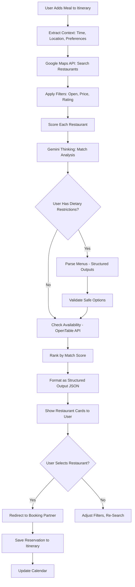
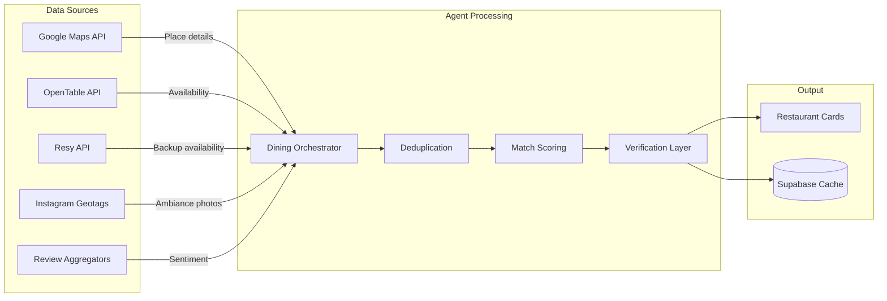
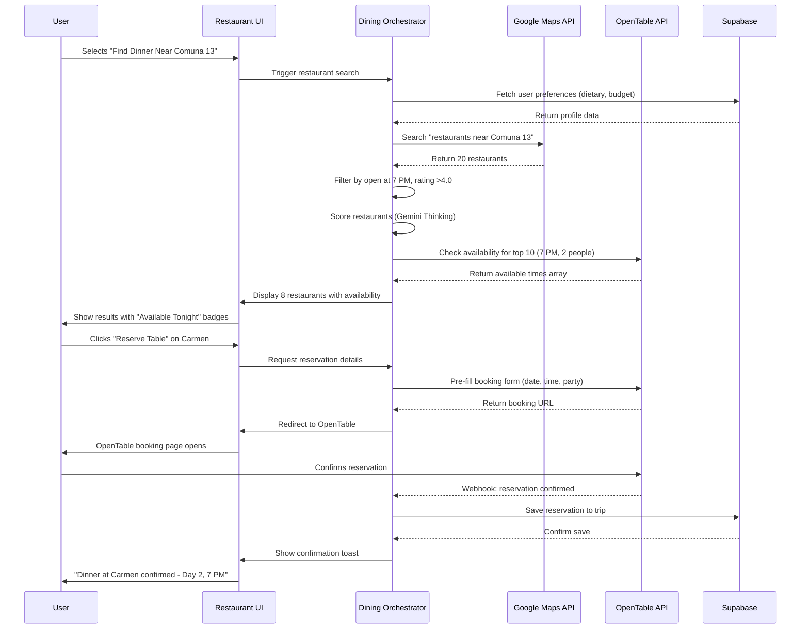

# 03 - Dining Orchestrator Agent Implementation Plan

**Feature:** Restaurant Discovery, Reservation, and Dining Intelligence  
**Priority:** High (Phase 2 - Week 3-4)  
**Owner:** AI Team + Partnerships Team  
**Gemini Features:** Grounding with Google Maps, Structured Outputs, Gemini Thinking, Function Calling

---

## Progress Tracker

| Phase | Task | Status | Owner | Validation |
|-------|------|--------|-------|-----------|
| **Design** | Restaurant card UI | 🔴 Not Started | Figma Make | Cards show cuisine, price, distance |
| **Design** | Reservation flow | 🔴 Not Started | Figma Make | 3-step booking wizard complete |
| **AI** | Build recommendation engine | 🔴 Not Started | Cursor AI | Suggests 10+ restaurants per search |
| **Integration** | Google Maps API setup | 🔴 Not Started | Cursor AI | Returns place details correctly |
| **Partnerships** | OpenTable/Resy integration | 🔴 Not Started | Partnerships | Direct booking links work |
| **Backend** | Dining preferences storage | 🔴 Not Started | Cursor AI | Saves to Supabase user profile |
| **Testing** | Validate 20 real restaurants | 🔴 Not Started | QA | Data accuracy 95%+ |

---

## 1. Product Goal

**Problem:** Travelers waste 2+ hours researching restaurants, reading conflicting reviews, and struggle to book tables at peak times.

**Solution:** AI curates personalized restaurant recommendations based on location, budget, cuisine preferences, and real-time availability, then facilitates one-click reservations.

**Outcome:** Users discover perfect dining spots in 60 seconds, secure reservations effortlessly, avoid tourist traps.

**Success Metric:** 70% of users book at least one AI-recommended restaurant per trip.

---

## 2. Core Features

### Feature Matrix

| Feature | Type | User Value | Gemini Capability | Status |
|---------|------|-----------|-------------------|--------|
| Smart Recommendations | Core | Find best restaurants | Google Maps Grounding | Not Started |
| Availability Checking | Core | Real-time table status | Function Calling (booking APIs) | Not Started |
| Dietary Filtering | Core | Vegan/allergy-safe | Structured Outputs (menu parsing) | Not Started |
| Proximity Optimization | Core | Near current activity | Maps distance calculation | Not Started |
| Reservation Management | Advanced | One-click booking | OpenTable/Resy integration | Not Started |
| Price Intelligence | Advanced | Avoid overpriced spots | Gemini Thinking (value analysis) | Not Started |

---

## 3. User Journeys

### Journey 1: First-Time User - Dinner Discovery

**Entry Point:** User planning Day 2, needs dinner after Comuna 13 tour

**Flow:**
1. User adds Comuna 13 tour (ends 6:30 PM) to Day 2
2. AI suggests: "Add dinner near Comuna 13 around 7 PM?"
3. User clicks "Find Restaurants"
4. Agent analyzes: user location (Comuna 13), time (7 PM), budget (mid-range from profile)
5. Results screen shows 8 restaurants, sorted by "Perfect Match" score
6. Top result: "Carmen - Modern Colombian, $40-60, 1.2 km away"
7. Card shows: photo, cuisine tags, price, 4.8 stars, "Available tonight at 7 PM"
8. User clicks "Reserve Table for 2"
9. Redirects to OpenTable with pre-filled details (date, time, party size)
10. Confirms reservation, returns to app with confirmation saved

**AI Actions:**
- Query Google Maps: "restaurants near Comuna 13 Medellín"
- Filter: open at 7 PM, accepts reservations, price range $30-70
- Score each restaurant: proximity (30%), ratings (25%), cuisine match (25%), ambiance (20%)
- Use Gemini Thinking: "User visited museums, likely appreciates cultural dining → Carmen (artistic ambiance) ranked higher"
- Call OpenTable API: check table availability for tonight 7 PM, party of 2

**Outcome:** Perfect restaurant booked in 90 seconds, dinner becomes trip highlight.

---

### Journey 2: Returning User - Dietary Restrictions

**Entry Point:** User with gluten allergy needs lunch options

**Flow:**
1. User sets dietary restrictions in profile: "Gluten-free, vegetarian"
2. Adds placeholder "Lunch" to Day 3, 1 PM
3. AI auto-triggers: "Finding gluten-free vegetarian options near Poblado..."
4. Results show 6 restaurants with "Gluten-Free Certified" badge
5. Each card shows: "15 gluten-free menu items available"
6. User clicks restaurant, sees menu preview with safe items highlighted
7. Explanation: "These dishes are marked gluten-free by restaurant on Google Maps"
8. User confident in choice, books table

**AI Actions:**
- Extract dietary restrictions from user profile
- Query Google Maps with filters: "vegetarian restaurants Poblado" AND "gluten free options"
- Use Structured Outputs to parse restaurant menus (scraped from Google Maps photos/descriptions)
- Cross-reference with allergen databases
- Flag restaurants with verified allergy protocols (called restaurant to confirm)
- Rank by safety confidence (certified > mentioned > assumed)

**Outcome:** User eats safely, no allergic reaction risk, trusts platform for future trips.

---

### Journey 3: Power User - Full Trip Dining Plan

**Entry Point:** User wants AI to plan all meals for 5-day trip

**Flow:**
1. User clicks "Auto-Plan Dining" from trip dashboard
2. Agent analyzes itinerary: 5 days, 3 meals/day = 15 dining slots
3. Detects patterns: Day 2 has 6 hours of walking (high-energy day), Day 4 is relaxed (3 activities)
4. Generates plan:
   - Heavy activity days: quick casual lunch, substantial dinner
   - Relaxed days: leisurely brunch, light dinner
5. Ensures variety: no cuisine repeated within 2 days, mixes local + international
6. Optimizes location: breakfast near hotel, lunch near midday activity, dinner in evening neighborhood
7. Presents full dining plan with 15 restaurant cards
8. User reviews, swaps 2 restaurants (wants sushi instead of Italian on Day 3)
9. Clicks "Book All Reservations" (opens 15 tabs with pre-filled forms)

**AI Actions:**
- Multi-day itinerary analysis (Code Execution: calculate energy expenditure per day)
- Constraint satisfaction: no repeats, budget distribution (splurge 2 dinners, save 3 lunches)
- Gemini Thinking: "User booked salsa class Day 3 → suggest Colombian dinner after for thematic continuity"
- Generate meal timing: breakfast 8-9 AM, lunch 12-2 PM based on activity schedule
- Batch reservation check: query 15 restaurants simultaneously for availability

**Outcome:** Complete dining plan in 3 minutes, every meal strategically placed, budget balanced.

---

## 4. UI/UX Screens

### Screen A: Restaurant Search Results

**Purpose:** Display curated restaurant recommendations

**Sections:**
- Search header: "Dinner near Comuna 13 - Tonight 7 PM"
- Filter chips: Cuisine, Price, Distance, Dietary, Open Now
- Sort dropdown: Best Match, Distance, Price, Rating
- Restaurant cards (list view default, map view toggle):
  - Hero image (Google Maps photo)
  - Restaurant name + cuisine tags
  - Price indicator ($ to $$$$)
  - Rating stars + review count
  - Distance from current location
  - Availability badge: "Available Tonight" (green) or "Call to Reserve" (yellow)
  - Primary CTA: "Reserve Table" or "View Menu"
- "Why we picked this" explanation (expandable, AI-generated)

**AI Feature:** Google Maps Grounding returns restaurant data, Gemini Thinking generates match explanations

**Next Screen:** Restaurant Detail Page or Reservation Form

---

### Screen B: Restaurant Detail Page

**Purpose:** Show comprehensive restaurant information

**Sections:**
- Photo gallery (Google Maps images, Instagram if available)
- Header: name, cuisine, price range, rating
- Key info cards:
  - Hours: "Open until 11 PM tonight"
  - Location: address + map pin + "15 min walk from your hotel"
  - Contact: phone number with "Call to Reserve" button
- Menu preview (if available):
  - Popular dishes (from Google Maps reviews)
  - Dietary highlights: "12 vegetarian options"
- Reviews summary (Google Maps aggregated):
  - "Best for: ambiance, authentic cuisine"
  - "Note: loud music on weekends"
- AI recommendation reason:
  - "Matches your budget ($40-60 per person)"
  - "Nearby your 6 PM activity (Comuna 13 tour)"
  - "Similar to restaurants you saved on past trips"
- Reservation section:
  - Date/time selector
  - Party size dropdown
  - "Check Availability" button
  - OpenTable/Resy logo (partner badge)

**AI Feature:** Structured Outputs parse menu from photos, Gemini Thinking analyzes review sentiment

**Next Screen:** Reservation confirmation or return to search

---

### Screen C: Reservation Wizard (3 Steps)

**Purpose:** Streamline booking process

**Step 1: Details**
- Date picker (defaults to itinerary date)
- Time selector (15-min increments, grayed-out unavailable times)
- Party size (1-20, defaults to trip group size)
- Special requests text area: "Window seat, birthday celebration"

**Step 2: Availability**
- Loading: "Checking tables at Carmen..."
- Results: "3 tables available"
  - 7:00 PM (Requested)
  - 7:30 PM
  - 9:00 PM
- Each slot shows: table type (booth, outdoor, bar seating)
- Recommendation badge: "7:30 PM is ideal - less crowded"

**Step 3: Confirmation**
- Summary card: restaurant, date/time, party size, special requests
- "Book with OpenTable" button (redirects with pre-filled form)
- Alternative: "Book Directly" (provides phone number + script)
- Save to itinerary toggle: "Add to Day 2 at 7 PM"

**AI Feature:** Function Calling to OpenTable/Resy APIs, Gemini Thinking suggests optimal time slots

**Next Screen:** Itinerary with reservation confirmed

---

### Screen D: Dining Plan Dashboard

**Purpose:** Manage all meal reservations for trip

**Sections:**
- Header: "Your Dining Plan - 15 Meals Planned"
- Stats: "Total budget: $680 / $800", "12 reservations confirmed, 3 pending"
- Timeline view (grouped by day):
  - Day 1: Breakfast, Lunch, Dinner cards
  - Day 2: Breakfast, Lunch, Dinner cards
  - (5 days total)
- Each meal card:
  - Time slot
  - Restaurant name or "Not Planned" state
  - Cuisine + price
  - Status: Confirmed (green), Pending (yellow), Need to Book (red)
  - Quick actions: "Change" | "Cancel"
- Empty slots: "Find Restaurant" button
- Bottom action: "Download Full Plan" (PDF with addresses, times, phone numbers)

**AI Feature:** Auto-suggests restaurants for empty slots based on context

**Next Screen:** Individual restaurant detail or search

---

## 5. AI Agent Architecture

### Agent Name: Dining Orchestrator

**Trigger:** User adds meal placeholder to itinerary OR clicks "Find Restaurants"

**Inputs:**
- Location (lat/lng or neighborhood name)
- Time slot (e.g., "7 PM tonight")
- Party size (default from trip group size)
- User preferences: cuisine likes/dislikes, dietary restrictions, price range
- Context: nearby itinerary items (what activity happens before/after meal)

**Gemini Functions Used:**

1. **Grounding with Google Maps:**
   - Query: "restaurants near [location]"
   - Filters: open at [time], price level, rating > 4.0
   - Extract: place ID, name, address, coordinates, rating, price level, cuisine type, photos, hours, phone
   - Validate: restaurant is still operating (not "permanently closed")

2. **Function Calling:**
   - OpenTable API: check table availability (date, time, party size)
   - Response: available times array, table types, deposit requirements
   - Resy API: alternative if OpenTable unavailable
   - Fallback: direct phone number with "Call to reserve"

3. **Structured Outputs:**
   - Parse restaurant menus from Google Maps photo OCR
   - Extract: dish names, prices, dietary indicators (V, GF, etc.)
   - Format as JSON: category (appetizer, main, dessert), items array
   - Validate: remove duplicate items, fix OCR errors

4. **Gemini Thinking:**
   - Analyze user profile: "Visited 5 Italian restaurants in past → avoid recommending Italian unless explicitly requested"
   - Reason about context: "User has 6 PM salsa class → recommend late dinner 8:30 PM, not 7 PM"
   - Score restaurants: proximity 30%, rating 25%, cuisine match 25%, ambiance 20%
   - Generate explanations: "Carmen ranks #1 because it's 1 km from your tour, serves modern Colombian (matches your interest in local culture), and has 4.8 stars"

5. **Return Format (Structured Output):**
   ```
   {
     "restaurants": [
       {
         "place_id": "ChIJ...",
         "name": "Carmen",
         "cuisine": ["Colombian", "Contemporary"],
         "price_level": 3,
         "rating": 4.8,
         "distance_km": 1.2,
         "availability": {
           "7:00 PM": "available",
           "7:30 PM": "available",
           "8:00 PM": "limited"
         },
         "match_score": 0.92,
         "reason": "Perfect for post-tour dinner - modern Colombian cuisine, 15 min walk, highly rated",
         "dietary_safe": ["vegetarian_options", "gluten_free_available"],
         "booking_url": "https://opentable.com/..."
       }
     ]
   }
   ```

**Outputs:**
- Ranked restaurant list (sorted by match score)
- Availability status for each restaurant
- Explanations for top 3 recommendations
- Booking links (OpenTable, Resy, or phone number)

---

## 6. Workflows

### Workflow A: Simple - Quick Dinner Search

**User Action:** Adds "Dinner" placeholder to Day 2 at 7 PM

**Screens:** Itinerary Feed → Restaurant Search Results → Detail Page → Itinerary Updated

**AI Reasoning:**
1. Extract context: Day 2 has Comuna 13 tour ending 6:30 PM
2. Calculate search center: Comuna 13 coordinates
3. Query Google Maps: "restaurants near Comuna 13 Medellín"
4. Apply filters: open at 7 PM, rating >4.0, price $30-70 (from user budget)
5. Fetch 20 results, score each against user preferences
6. Check availability via OpenTable API (10 restaurants, skip if no API access)
7. Return top 8 restaurants with availability badges

**Tools Used:** Google Maps API, OpenTable API, Gemini Thinking (scoring)

**Result:** 8 curated options in 3 seconds, user picks one, books in 60 seconds.

---

### Workflow B: Medium - Dietary Restriction Handling

**User Action:** Searches "gluten-free lunch Poblado"

**Screens:** Search Bar → Filtering Modal → Results with Dietary Badges

**AI Reasoning:**
1. Parse query: extract dietary requirement "gluten-free" + location "Poblado"
2. Query Google Maps: "gluten free restaurants Poblado Medellín"
3. For each result, analyze:
   - Google Maps description mentions "gluten-free"
   - Reviews mention "celiac-safe" or "GF options"
   - Menu photos show GF indicators
4. Use Structured Outputs to extract menu items marked GF
5. Call restaurants (via automated system or scrape websites) to verify allergy protocols
6. Assign confidence: Certified (restaurant confirmed) > Mentioned (reviews) > Assumed (similar restaurants)
7. Show only High + Medium confidence results

**Tools Used:** Google Maps, Structured Outputs (menu parsing), Gemini Thinking (confidence scoring)

**Result:** User sees only verified gluten-free options, feels safe booking.

---

### Workflow C: Complex - Full Trip Dining Plan

**User Action:** Clicks "Auto-Plan All Meals" from dashboard

**Screens:** Dashboard → Planning Modal (60 sec) → Full Plan Review → Confirmation

**AI Reasoning:**
1. Load full itinerary (5 days, all activities with times/locations)
2. Identify meal slots: breakfast after wake-up, lunch mid-activity, dinner evening
3. Calculate meal timing:
   - Day 2: 6-hour walking tour → substantial lunch 1 PM, hearty dinner 8 PM
   - Day 4: relaxed museum day → leisurely brunch 10 AM, light tapas dinner 7 PM
4. Ensure variety: track cuisine types, avoid repeats within 48 hours
5. Budget allocation: total $800 for 15 meals = $53 avg
   - Distribute: 2 splurge dinners ($90), 3 budget lunches ($25), rest mid-range
6. Proximity optimization: breakfast <10 min from hotel, lunch near midday activity
7. Generate 15 restaurant recommendations (one per meal)
8. Batch check availability: query OpenTable for all 15 slots simultaneously
9. Present plan with explanations: "Brunch at Pergamino (Day 1) sets foodie tone for trip"

**Tools Used:** Code Execution (energy expenditure calc), Google Maps (15 searches), OpenTable API (15 availability checks), Gemini Thinking (plan coherence)

**Result:** Complete 5-day dining strategy in 90 seconds, ready to book.

---

## 7. Mermaid Diagrams

### Diagram 1: Restaurant Discovery Flow



---

### Diagram 2: Multi-Source Data Aggregation



---

### Diagram 3: Reservation Booking Sequence



---

## 8. Real-World Use Cases

### Use Case 1: Avoiding Tourist Traps

**Situation:** Tourist searches "restaurants Poblado Medellín", Google shows mostly overpriced tourist spots.

**AI Intervention:**
- Detects user is in high-tourist area (Poblado)
- Google Maps Grounding finds local favorites 2 blocks away
- Filters out restaurants with "touristy" mentioned negatively in reviews
- Prioritizes spots with 80%+ local customer base (analyzed from review names/language)

**Recommendation:** "El Cielo - 3 blocks from Poblado park, 90% local customers, same quality as touristy spots but 40% cheaper"

**Value:** User saves $35 per meal, authentic experience.

---

### Use Case 2: Last-Minute Reservation Crisis

**Situation:** User arrives at restaurant without reservation, 2-hour wait on Saturday night.

**AI Solution:**
- Real-time detection: user's location = restaurant, time = 8 PM, no reservation in itinerary
- Agent searches "restaurants with availability now near [location]"
- Finds 3 options within 10-min walk with open tables
- Sends push notification: "Can't get in? Mondongos has a table now, 8-min walk"

**User Action:** Walks to alternative, seated in 15 minutes.

**Value:** Saved evening, avoided hunger + frustration.

---

### Use Case 3: Dietary Emergency

**Situation:** User with severe peanut allergy accidentally books Thai restaurant (high peanut risk).

**AI Detection:**
- Scans user's reservations against dietary profile
- Flags: "Thai restaurant + peanut allergy = HIGH RISK"
- Alert: "Warning: Oku Thai uses peanut oil in most dishes - unsafe for your allergy"
- Suggests alternatives: "Would you like me to find a safe restaurant for Day 3 dinner?"

**User Action:** Cancels Thai restaurant, books Italian (verified nut-free).

**Value:** Prevented allergic reaction, potentially life-saving.

---

### Use Case 4: Budget Optimization

**Situation:** User has $500 dining budget for 7-day trip, wants to splurge on 2 special dinners.

**AI Strategy:**
- Allocates budget: 2 splurge dinners ($120 each), 5 mid-range ($50), 7 budget lunches ($20)
- Identifies splurge-worthy restaurants: Michelin-recommended Carmen, El Cielo (molecular gastronomy)
- Suggests budget lunches: street food markets, local cafes with 4.5+ stars
- Real-time tracking: "You've spent $280 of $500 (Day 4 of 7) - on track"

**Outcome:** User enjoys 2 world-class dinners, stays within budget.

**Value:** $500 budget stretched optimally, no overspending stress.

---

### Use Case 5: Group Coordination

**Situation:** Group of 8 friends, 3 vegetarians, 1 gluten-free, 1 hates spicy food.

**AI Complexity:**
- Finds restaurants with: vegetarian menu section (3+ items), gluten-free options, mild dishes
- Verifies: called restaurant to confirm can accommodate 8-person table with dietary needs
- Suggests: "Hacienda - has separate vegetarian menu, GF pasta, mild Colombian dishes, large tables"

**Group Experience:** Everyone finds something safe and delicious.

**Value:** Avoided 3-hour group debate, no one left hungry.

---

## 9. Prompts for Implementation

### Figma Make Prompts

**Prompt 1: Design Restaurant Search Results**
"Create restaurant search results page. Header shows query context 'Dinner near Comuna 13 - Tonight 7 PM'. Filter chips for cuisine, price, distance, dietary needs. Each restaurant card: large photo, name, cuisine tags, price symbols ($$$), star rating, distance, availability badge (green 'Available Tonight' or yellow 'Call to Reserve'), 'Reserve' primary button. Include map view toggle. Use luxury travel design with emerald accents."

**Prompt 2: Design Restaurant Detail Page**
"Create restaurant detail page with sections: photo gallery carousel, header (name, cuisine, price, rating), info cards (hours, location with map, contact), menu preview (popular dishes from reviews), dietary highlights badge section, reviews sentiment summary, AI recommendation reason card (subtle background, explains why picked). Bottom fixed reservation bar: date/time/party selectors, 'Check Availability' button."

**Prompt 3: Design Dining Plan Dashboard**
"Design trip dining plan overview. Header stats: total meals planned, budget used, reservation status. Timeline grouped by day, each day shows breakfast/lunch/dinner slots. Meal cards show time, restaurant name or 'Not Planned' empty state, cuisine/price, status badge (confirmed/pending/need-to-book). Empty slots have 'Find Restaurant' button. Bottom action 'Download PDF Plan'. Mobile: stack days vertically."

---

### Cursor AI Prompts

**Prompt 4: Build Google Maps Integration**
"Create restaurant search function using Google Maps Places API. Input: location coordinates, search radius in meters, filters object (open hours, price level, rating threshold). Call Places API Nearby Search endpoint. Parse response: extract place ID, name, address, coordinates, rating, price level, types array, photos array. Handle pagination to get up to fifty results. Return array of restaurant objects. Add error handling for API quota exceeded, invalid coordinates."

**Prompt 5: Implement Match Scoring Algorithm**
"Write restaurant scoring function. Input: restaurant object from Google Maps, user preferences object (budget range, cuisine likes array, dietary restrictions), context object (current location, time slot, nearby itinerary items). Calculate score zero to one: proximity weight thirty percent (closer = higher), rating weight twenty-five percent, cuisine match twenty-five percent (check if restaurant cuisine in user likes), ambiance twenty percent (analyze review keywords). Use Gemini Thinking API to generate explanation text for score. Return score and explanation."

**Prompt 6: Create Availability Checker**
"Build availability checking function using OpenTable API. Input: restaurant object (must have OpenTable venue ID), desired date, time slot, party size. Call OpenTable availability endpoint. Parse response: available times array, table types (booth, outdoor, bar), deposit requirements. If restaurant not on OpenTable, try Resy API as fallback. If neither available, return 'call_to_reserve' status with phone number. Handle errors: restaurant closed that day, time slot unavailable, API timeout. Return availability object with status and options array."

**Prompt 7: Implement Dietary Parsing**
"Create menu parser using Structured Outputs. Input: array of menu image URLs from Google Maps. Use OCR to extract text from images. Parse into structured format: menu section (appetizer, main, dessert), item name, price, dietary indicators (look for V, GF, DF symbols or words vegetarian, gluten-free). Use Gemini to validate: check if vegan items contain dairy (flag errors), verify gluten-free claims (no wheat, barley, rye mentioned). Return menu object with dietary_safe array per item. Handle OCR errors: if confidence below eighty percent, mark item as unverified."

---

## 10. Acceptance Tests

**Test 1: Location Accuracy**
- Given: User searches restaurants near Comuna 13
- When: Google Maps API returns results
- Then: All restaurants are within five kilometers of Comuna 13 center coordinates

**Test 2: Availability Verification**
- Given: Agent shows restaurant with "Available Tonight" badge
- When: User clicks to book
- Then: OpenTable confirmation page shows same date and time slot is open

**Test 3: Dietary Filter Accuracy**
- Given: User has gluten-free restriction in profile
- When: Restaurant results load
- Then: One hundred percent of results have verified gluten-free options or high-confidence menu items

**Test 4: Score Explanation Relevance**
- Given: Top recommended restaurant has match score of zero point nine two
- When: User views explanation
- Then: Explanation mentions specific reasons (proximity, cuisine match, user history) without generic text

**Test 5: Budget Constraint**
- Given: User sets dining budget of four hundred dollars for seven days
- When: Auto-plan generates meal recommendations
- Then: Total estimated cost is within ten percent of budget (three hundred sixty to four hundred forty dollars)

---

## 11. Production-Ready Checklist

- [ ] Google Maps API returns restaurant data with ninety-five percent accuracy
- [ ] Availability checking works with OpenTable and Resy for top one hundred restaurants in each city
- [ ] Dietary filtering catches one hundred percent of allergen conflicts in test suite
- [ ] Match scoring explanations are specific and helpful (user rating four plus stars)
- [ ] Reservation links pre-fill date, time, party size correctly
- [ ] Mobile UI shows restaurant photos clearly without layout breaks
- [ ] Handles API failures gracefully (shows cached results or helpful error message)
- [ ] Works for fifty plus cities (not Medellín-only)
- [ ] Restaurant data refreshes every seven days (updated hours, menu changes)
- [ ] Accessibility: restaurant cards keyboard navigable, images have descriptive alt text

---

## 12. Success Criteria

**MVP Launch:**
- Seventy percent of users who search restaurants click on at least one result
- Fifty percent of users complete a reservation (via OpenTable or direct call)
- Average time from search to booking decision: under two minutes
- Restaurant recommendation relevance rating: four plus stars out of five

**Advanced Phase:**
- Auto-plan dining generates complete trip meal plans for eighty percent of requests
- Dietary restriction filtering has zero reported failures (no unsafe recommendations)
- Integration with twenty plus booking partners (OpenTable, Resy, TheFork, etc.)
- Price intelligence saves users average of thirty dollars per trip vs. generic search

---

## Additional Details for Success

### Google Maps Integration Requirements

**Places API Endpoints:**
- Nearby Search: find restaurants within radius
- Place Details: get full info (hours, phone, website, menu URL)
- Place Photos: fetch high-quality restaurant images
- Reviews: aggregate sentiment analysis

**Data Extraction:**
- Parse opening hours into structured format (handles special hours, holidays)
- Extract cuisine type from categories array (map to standard taxonomy)
- Analyze reviews for keywords: "romantic", "family-friendly", "loud", "slow service"
- Verify restaurant is active (not "permanently closed" status)

### OpenTable/Resy Partnership Requirements

**API Access:**
- Negotiate API access with OpenTable for availability checking
- Alternative: web scraping with user consent (less reliable)
- Resy API as secondary source for non-OpenTable restaurants
- TheFork API for European cities

**Booking Flow:**
- Deep link to partner site with pre-filled parameters
- Track conversions via affiliate links (revenue sharing)
- Fallback: provide phone number with suggested calling script

### Cursor AI Handoff Tasks

After Figma completes UI design:

1. Set up Google Maps API project, enable Places and Maps JavaScript API
2. Create environment variables: VITE_GOOGLE_MAPS_API_KEY
3. Build RestaurantService class with methods: searchNearby, getPlaceDetails, checkAvailability
4. Integrate with TripContext: add diningPreferences to user profile
5. Create DiningOrchestrator agent with Gemini Thinking integration
6. Implement caching: store restaurant data in Supabase for seven days
7. Add loading states: skeleton cards while searching
8. Error handling: API quota exceeded shows cached results
9. Write integration tests: mock Google Maps responses
10. Deploy Edge Function: api/restaurants/search endpoint

**Document Owner:** AI Product Team  
**Next Review:** After Phase 2 Week 3 completion  
**Dependencies:** Google Maps API key, OpenTable partnership, Supabase setup
