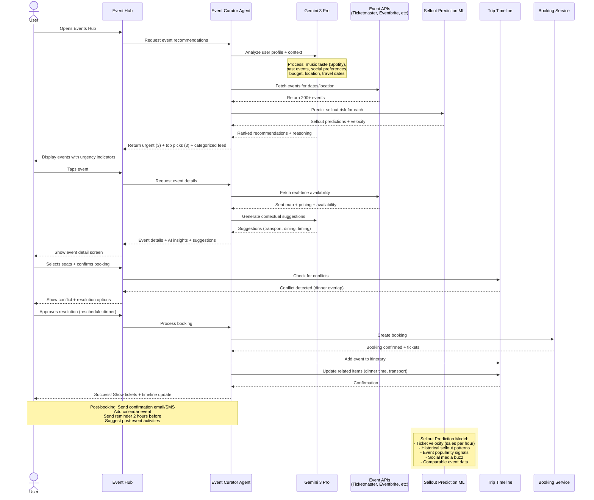
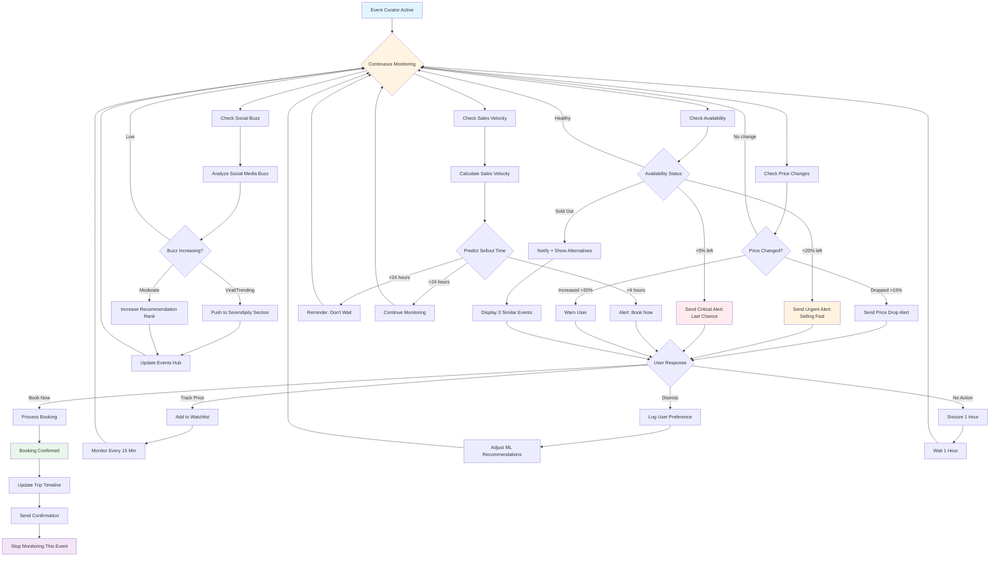
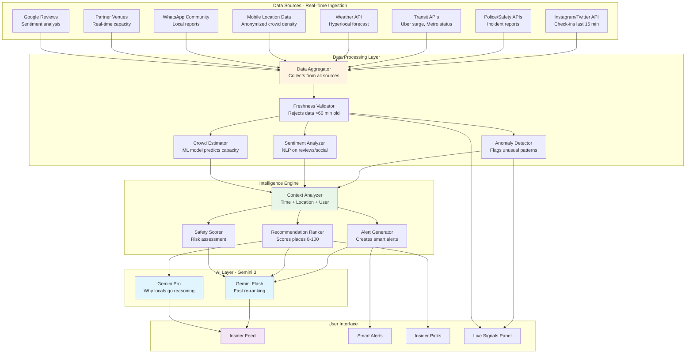
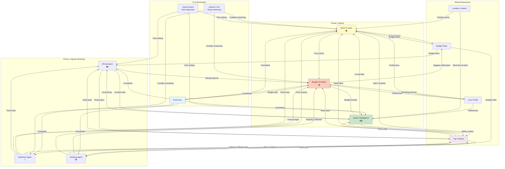
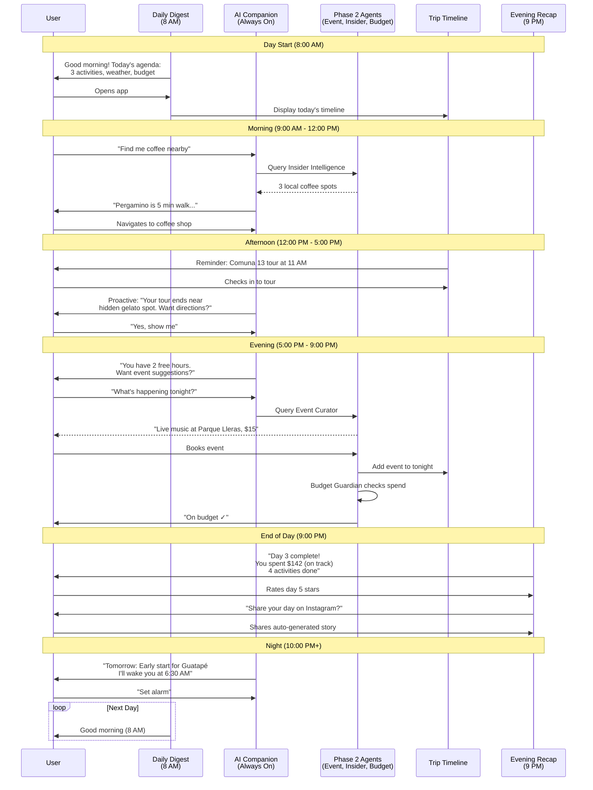

# Phase 2 Implementation Plan: Daily Engagement & Differentiation
## Trip Operating System - Events, Insider Intelligence, Budget Guardian

**Status:** Planning  
**Timeline:** Months 4-6  
**Priority:** HIGH - Differentiation Features  
**Last Updated:** December 18, 2025

---

## Progress Tracker

### Overall Progress: 0% Complete

```
[░░░░░░░░░░░░░░░░░░░░] 0/100

Phase 2.1: Event & Entertainment Curator    [░░░░░░░░░░] 0/14 tasks
Phase 2.2: Local Insider Intelligence       [░░░░░░░░░░] 0/16 tasks
Phase 2.3: Adaptive Budget Guardian         [░░░░░░░░░░] 0/13 tasks
Phase 2.4: Cross-Agent Integration          [░░░░░░░░░░] 0/8 tasks
Phase 2.5: Daily Engagement Features        [░░░░░░░░░░] 0/10 tasks
Phase 2.6: Production Launch                [░░░░░░░░░░] 0/7 tasks
```

### Milestones

- [ ] **M2.1** - Event Curator MVP (Week 15)
- [ ] **M2.2** - Insider Intelligence MVP (Week 18)
- [ ] **M2.3** - Budget Guardian MVP (Week 21)
- [ ] **M2.4** - Daily engagement features complete (Week 23)
- [ ] **M2.5** - Cross-agent integration (Week 24)
- [ ] **M2.6** - Phase 2 production launch (Week 26)

---

## Short Summary

Below are **copy-paste, multi-step Figma Make AI prompts** for **Phase 2 – Differentiation & Daily Engagement**.
They define **screens, components, routes, workflows, user journeys, and AI logic** for:

4. **Dynamic Event & Entertainment Curator** 🎭 - Never miss local experiences
5. **Local Insider Intelligence** 🗺️ - Your competitive moat
6. **Adaptive Budget Guardian** 💰 - Smart spending, zero regret

Mobile-first, production-ready, visually premium, and logically connected to your Trip OS.

---

# Phase 2.0: Global Setup & Design Extensions

## Task 2.0.1: Phase 2 Design System Extensions (Priority: HIGH)

### Prompt for Figma Make AI

```markdown
You are a Senior Product Designer + UX Architect.

Product: Local Scout — Trip Operating System
Phase: 2 (Daily engagement + differentiation)

Context: Phase 1 established the core design system. Phase 2 adds new patterns for:
- Real-time data visualization (events selling fast, crowd levels, budget tracking)
- Urgency indicators (without creating anxiety)
- Live signals and alerts
- Data-dense displays (budget breakdowns, event calendars)

CREATE PHASE 2 DESIGN SYSTEM EXTENSIONS:

1) URGENCY & SCARCITY PATTERNS
Visual language for time-sensitive information:

**Urgency Levels:**
- **Critical** (act now): Red accent, pulsing indicator, "Only 2 left"
  - Use sparingly, only when true
  - Example: Event selling out, last available table
- **High** (decide soon): Orange/amber, solid indicator, "Ends in 3 hours"
  - Example: Price drop ending, limited spots remaining
- **Medium** (consider): Blue, subtle indicator, "Popular choice"
  - Example: Trending event, local favorite
- **Low** (informational): Gray, no special treatment

**Anti-Patterns (Never do):**
- Fake scarcity ("Only 1 left!" when not true)
- Constant urgency (everything can't be urgent)
- Hidden deadlines (always show time remaining)

**Components:**
- Scarcity badge: Shows % remaining with visual indicator
- Countdown timer: For time-limited offers (shows hours:mins)
- Popularity meter: 1-5 flame icons, based on real demand
- Velocity indicator: "Selling X% faster than usual"

2) LIVE DATA VISUALIZATION
Real-time information display:

**Crowd Level Indicators:**
- Visual: Horizontal bar (empty → packed)
- Colors: Green (low) → Yellow (moderate) → Orange (busy) → Red (packed)
- Text: "Low wait" | "15-min wait" | "45+ min wait" | "At capacity"
- Icon: Person icons filling up (1 person → 5 people)
- Time context: "Usually quieter in 2 hours"

**Price Tracking Charts:**
- Line graph: 7-day history + 3-day forecast
- Current price: Large, bold
- Min/max: Show range with annotations
- Your target: Dotted line with "Your goal: $130"
- Probability: "68% chance of hitting target in next 5 days"

**Budget Gauges:**
- Semi-circle gauge (speedometer style)
- Color zones: Green (safe) → Yellow (caution) → Red (over)
- Needle shows current position
- Labels: "$180 of $300" with percentage
- Forecast line: "At current pace: $420 by trip end"

**Event Calendars:**
- Month view with color-coded dots
- Green: Available & recommended
- Yellow: Available but not ideal (weather, crowds)
- Red: Sold out or not recommended
- Tap date → see events for that day

3) TRUST & TRANSPARENCY PATTERNS
Building confidence in AI recommendations:

**Confidence Scores:**
- Visual: Horizontal bar (0-100%)
- Thresholds:
  - 90-100%: "High confidence" (green)
  - 70-89%: "Good confidence" (blue)
  - 50-69%: "Moderate confidence" (yellow)
  - <50%: Don't show recommendation
- Always explain: "Based on: 847 reviews + your preferences + timing"

**Data Source Attribution:**
- Show where data comes from
- Examples:
  - "Real-time from Ticketmaster API (updated 2 min ago)"
  - "Based on 1,247 local reviews (last 30 days)"
  - "Historical data: 6 months of price tracking"
- Freshness indicator: Green dot (< 5 min) → Yellow (< 1 hour) → Gray (> 1 hour)

**AI Explanation Cards:**
- Title: "Why I recommend this"
- 3-5 bullet points (not more)
- Each bullet: Icon + plain language statement
- Example:
  - ✓ "Matches your love for live music (from Spotify data)"
  - ✓ "15-min walk from your hotel (convenient)"
  - ✓ "92% local attendance (authentic experience)"
  - ✓ "Within your $50 entertainment budget"
  - ✓ "Weather perfect tonight (21°C, clear skies)"
- Confidence score at bottom
- "Show me alternatives" link

4) ALERT & NOTIFICATION PATTERNS
In-app and push notification design:

**Alert Card Types:**
- **Opportunity:** Green background, lightbulb icon
  - "Price dropped 18% for Guatapé tour!"
- **Warning:** Yellow background, exclamation icon
  - "You're 85% through your dining budget with 3 days left"
- **Urgent:** Red background, bell icon
  - "Event selling fast: 12% tickets left"
- **Info:** Blue background, info icon
  - "Comuna 13 is less crowded in mornings"

**Alert Anatomy:**
- Icon (left, 32x32px)
- Headline (bold, 1 line)
- Body text (2 lines max)
- Timestamp ("5 min ago")
- Primary action button
- Dismiss icon (right, subtle)

**Alert Behavior:**
- Appear in notification center (bell icon in top nav)
- Badge shows unread count
- Sorted: urgent → opportunity → warning → info
- Auto-dismiss after 24 hours (except urgent)
- User can snooze: 1 hour, 4 hours, tomorrow

**Push Notification Guidelines:**
- Max 2 per day (unless user enables more)
- Only send if:
  - High confidence (>85%)
  - Time-sensitive (expires in <24 hours)
  - User hasn't dismissed similar alerts
  - Respectful of time zones (no notifications 10 PM - 8 AM)
- Format: "[Emoji] Headline | Body text | CTA"
- Example: "🎭 Nacional match selling out | Only 15% tickets left | View seats →"

5) DATA-DENSE LAYOUTS
Displaying complex information clearly:

**Budget Tables:**
- Rows: Categories (Dining, Activities, Transport, etc.)
- Columns: Budget | Spent | Remaining | % Used
- Visual: Mini bar chart in "% Used" column
- Highlights: Red if >90%, Yellow if >75%
- Totals row: Bold, larger font
- Expandable rows: Tap category → see line items

**Event Lists (Compact):**
- List view optimized for scanning
- Each row:
  - Left: Square image (80x80px)
  - Center: 
    - Event name (1 line, truncate)
    - Date/time (small, gray text)
    - Venue + distance
  - Right:
    - Price (bold)
    - Availability badge
    - Bookmark icon
- Dividers between rows
- Infinite scroll (paginated)

**Comparison Cards:**
- Side-by-side layout (2-3 items)
- Headers: Item names
- Rows: Attributes (price, rating, distance, etc.)
- Highlight differences in color
- Visual indicators: ✓ for better, ✗ for worse, = for same
- Sticky headers on scroll

6) MOBILE-SPECIFIC PATTERNS
Optimizations for small screens:

**Bottom Sheets:**
- Slide up from bottom (70% viewport height)
- Handle (draggable gray bar at top)
- Backdrop: semi-transparent black
- Scrollable content
- Sticky action button at bottom
- Swipe down to dismiss

**Sticky Action Bars:**
- Fixed at bottom (above bottom nav if present)
- Contains primary CTA (full width button)
- Optional: Secondary action (text link, left side)
- Shadow above to indicate elevation
- Appears on scroll (after hero section)
- Hide on scroll down, show on scroll up

**Swipeable Cards:**
- Horizontal scroll for 3+ items
- Show partial next card (hint that more exists)
- Snap to card boundaries
- Indicators: Dots or progress bar
- No left/right arrows (pure swipe)

**Collapsible Sections:**
- Accordion style for long content
- Chevron indicates expand/collapse state
- Smooth animation (300ms)
- Remember state (don't collapse on navigate back)

7) ACCESSIBILITY ENHANCEMENTS
Phase 2 specific:

**Screen Reader Announcements:**
- Live regions for real-time updates
  - "Event availability changed: 15% tickets remaining"
  - "Budget warning: You've used 85% of dining budget"
- Descriptive labels for data visualizations
  - "Crowd level bar showing high capacity at 80%"
  - "Price trend graph showing 15% increase over 7 days"

**Keyboard Navigation:**
- Tab order: Top to bottom, left to right
- Focus indicators: 2px blue outline with 2px offset
- Skip links: "Skip to main content" for long pages
- Escape key: Close modals/sheets
- Arrow keys: Navigate within components (carousel, tabs)

**Color Contrast:**
- All urgency indicators pass WCAG AA (4.5:1 for text)
- Don't rely on color alone (use icons + text)
- Dark mode support: All colors inverted/adjusted
- High contrast mode: Bold borders, no subtle shadows

8) ANIMATION & TRANSITIONS
Motion design guidelines:

**Micro-Interactions:**
- Button press: Scale down 0.95 (100ms) → scale up (100ms)
- Toggle switch: Slide + color change (200ms)
- Checkbox: Checkmark draws in (200ms)
- Bookmark/heart: Scale up 1.2 (150ms) → scale down 1.0 (150ms)

**Page Transitions:**
- Navigate forward: Slide left (300ms, ease-out)
- Navigate back: Slide right (300ms, ease-out)
- Modal open: Fade in + scale from 0.9 to 1.0 (200ms)
- Modal close: Fade out + scale from 1.0 to 0.95 (200ms)

**Loading States:**
- Skeleton shimmer: Left to right (1.5s loop)
- Spinner: Rotate 360deg (1s loop)
- Progress bar: Indeterminate wave (1.5s loop)

**Data Updates:**
- New alert: Slide down from top (300ms)
- Price change: Number flashes (highlight 200ms, fade 300ms)
- Budget update: Gauge animates to new value (500ms, ease-out)

**Performance:**
- Use CSS transforms (not position changes)
- Use requestAnimationFrame for JS animations
- Disable animations on low-end devices (matchMedia: prefers-reduced-motion)

DELIVERABLES:
- Component library updates (urgency badges, crowd meters, budget gauges, etc.)
- Pattern library documentation (when to use each pattern)
- Accessibility test checklist
- Animation guidelines with code examples
- Dark mode variants for all new components

Create all Phase 2 design system extensions with variants and examples.
```

**Acceptance Criteria:**
- [ ] All 8 extension categories documented
- [ ] Components have hover, active, disabled states
- [ ] Dark mode variants created for all components
- [ ] Accessibility checklist completed
- [ ] Animation timing and easing documented
- [ ] Mobile-specific patterns tested on devices
- [ ] Real-time data visualization components responsive

**Dependencies:** Phase 1 Design System (Task 1.1.1)  
**Estimated Time:** 4-5 days  
**Assigned To:** Design Lead + Front-End Architect

---

# Phase 2.1: Agent 4 - Dynamic Event & Entertainment Curator 🎭

## Overview & Value Proposition

**Problem:** Travelers miss amazing local experiences because they don't know they're happening, can't find tickets, or book too late at inflated prices.

**Solution:** AI-powered event discovery that surfaces the right experiences at the right time, predicts sellouts, and automates booking.

**Value:**
- User: Never miss unmissable experiences, save 30-40% on ticket prices, discover serendipitous events
- Platform: $45 average commission per event booking, 18% increase in daily app opens
- Partners: Reach targeted audiences, sell out challenging time slots, reduce marketing costs

**Real-World Example:**
Maria (32, from NYC) visiting Medellin doesn't know Atlético Nacional has a rivalry match this weekend. Event Curator alerts her Friday morning: "🔥 Nacional vs. Millonarios tomorrow - 89% chance of sellout. Premium seats available: $52." She books instantly. Without this, she'd have missed it or paid $140 from scalpers.

---

## Task 2.1.1: Events Hub - Core Discovery Screen (Priority: CRITICAL)

### Multi-Step Prompt Chain

#### Step 1: Hub Structure & Layout

```markdown
Design the Events Hub screen - the command center for discovering local experiences.

Route: /trip/:tripId/events

CONTEXT:
User is in Medellin for 5 days. It's Friday morning. There are:
- 23 events happening tonight (concerts, sports, nightlife)
- 47 events this weekend
- 3 major events selling fast (>50% tickets sold)
- 1 surprise event AI thinks user will love (jazz concert, matches their Spotify data)

User profile:
- Loves live music (indie rock, electronic)
- Attended 8 sporting events last year
- Budget: $50-100 per event
- Traveling solo, wants social experiences

SCREEN STRUCTURE:

1) CONTEXT HEADER (Sticky, top)
Components:
- **Time context:** "This weekend in Medellín" (dynamic: "Tonight" | "This weekend" | "This week")
- **Date range:** "Dec 20-22, 2025"
- **Quick filters (horizontal chips):**
  - Time: "Tonight" | "Tomorrow" | "This Weekend" | "Next Week"
  - Type: "All" | "Sports" | "Music" | "Festivals" | "Nightlife" | "Arts" | "Food"
  - Price: "Any" | "Free" | "$" | "$$" | "$$$"
  - Distance: "Walking" | "< 30 min" | "Anywhere"
- **Status indicator:** "3 events selling fast 🔥" (tappable → jumps to urgent section)
- **Search icon:** Tap → opens event search with natural language
  - Example: "Reggaeton concert tonight" or "Family-friendly events"

Visual:
- Semi-transparent background (blur effect on scroll)
- Filters scrollable horizontally
- Active filter: solid background (primary color)
- Filter count badge: "Music (8)" shows matching count

2) URGENT EVENTS (Priority section, immediately below header)
Title: "Act now – selling fast"
Visual treatment: Yellow gradient background, subtle pulsing border

Show 1-3 urgent events in horizontal scroll:

**Urgent Event Card (Large format):**
- **Hero image:** 400x240px, gradient overlay at bottom
- **Urgency badge (top-right):** "83% sold" with flame icon, red background
- **Event type badge (top-left):** "Sports" or "Concert" with icon
- **Content over image (bottom):**
  - Event name: "Atlético Nacional vs. Millonarios" (H3, white, bold)
  - Venue: "Estadio Atanasio Girardot" (smaller, white)
  - Date/time: "Tomorrow, 8:00 PM" (white)
- **Below image:**
  - **Velocity indicator:** "Selling 2.3x faster than similar events" (small text, orange)
  - **AI confidence:** "🎯 92% match for you" (if personalized)
  - **Price range:** "$45-$85" (bold)
  - **Action buttons:**
    - Primary: "View Seats" (large, red/urgent color)
    - Secondary: "Track Price" (outline button)
  - **Reason tag:** "Matches your love for football ⚽" (blue pill, icon)

**Why show urgency:**
- Scarcity indicator: "Only 17% tickets left"
- Time pressure: "Price increases tomorrow"
- Social proof: "327 locals booked today"
- FOMO: "Similar event sold out in 4 hours last month"

Interaction:
- Swipe left/right to see other urgent events
- Tap card → opens event detail screen
- Tap "Track Price" → adds to watchlist, monitors for price drops

3) AI TOP PICKS (Hero section, personalized)
Title: "I picked these 3 for you this weekend"
Subtitle: "Based on: Your Spotify playlists + Social vibe preference + Budget"

**Pick Card (Medium format, vertical scroll or 2-up on tablet/desktop):**
- **Image:** 350x200px
- **Badges:**
  - Match badge: "95% match" (top-right, green)
  - Category: "Live Music" (top-left, icon + text)
  - New: "Just announced" (if recent, yellow)
- **Event details:**
  - Name: "Bomba Estéreo at Parque Lleras" (H4)
  - Date/time: "Saturday, 10:00 PM"
  - Venue: "Parque Lleras Stage"
  - Distance: "🚶 12 min from your hotel"
- **Trust row:**
  - Rating: ⭐ 4.7 (from 1,203 reviews)
  - Popularity: 🔥🔥🔥🔥⚪ (4/5 flames)
  - Local favorite: "87% local attendance"
- **Why this? (AI explanation):**
  - "You have Bomba Estéreo in your top artists (Spotify)"
  - "Outdoor venue, perfect weather forecast (22°C)"
  - "Price fits your $50-100 entertainment budget"
  - Expandable: "Show full reasoning" → modal with 8+ factors
- **Price:** "$65" (bold, large) + "Best value tier"
- **Availability:** "✅ Available" (green) or "⚠️ Only 23% left" (yellow)
- **Actions:**
  - Primary: "View Details" (blue button)
  - Secondary: Heart icon (save to favorites)

Show 3 picks initially, then:
- "Want 3 more personalized picks?" → generates new set
- "Not feeling these? Tell me what you want" → opens chat

4) SERENDIPITY SECTION (Discovery engine)
Title: "You wouldn't search for this — but you'll love it" 💡
Subtitle: "Trust me on these"

**Serendipity Card (Compact format):**
- **Left:** Square image (120x120px)
- **Right:** 
  - Event name
  - "Why you'll love it" (1 sentence, conversational)
    - Example: "Hidden jazz club locals refuse to share with tourists"
  - Date/time + venue
  - Price
  - "Surprise me" button (adds to itinerary without details reveal) OR "Tell me more"

Visual treatment: Purple accent color (different from other sections)

Algorithm: Find events user wouldn't search for but fit latent preferences
- Example: User likes electronic music → suggest experimental jazz (musical theory connection)
- User attends comedy shows → suggest improv theater
- User books fine dining → suggest chef's table event

Show 2 serendipity picks. Refresh daily.

5) EVENT FEED (Main browsing section, categorized)
Title: "All events this weekend (47)"
Subtitle: "Sorted by: Best Match" (dropdown: Best Match | Soonest | Most Popular | Best Value)

**Category Sections (collapsible):**
- 🏟️ Sports (8 events)
- 🎵 Live Music (15 events)
- 🎭 Arts & Culture (7 events)
- 🎉 Festivals (3 events)
- 🌃 Nightlife (9 events)
- 🍽️ Food & Drink (5 events)

Each category:
- Header: Category name + count + expand/collapse chevron
- Default: Show top 3, "See all 15 music events" link
- Expanded: Show all

**Event Card (Compact format for feed):**
- **Left:** Image (100x100px, square)
- **Center:** 
  - Event name (1 line, truncate)
  - Venue + distance
  - Date/time (formatted: "Tonight 8 PM" | "Tomorrow 7:30 PM" | "Sat Dec 21, 9 PM")
  - Badges: 
    - 🔥 Selling fast (if >60% sold)
    - ⭐ Local favorite (if >80% local attendance)
    - 🆕 Just added (if added <48 hours ago)
    - 💰 Best value (if price 20%+ below average for category)
- **Right:**
  - Price: "$45" (or "Free" with green badge)
  - Heart icon (save/unsave)
  - Chevron → details

Interaction:
- Tap card → opens event detail
- Tap heart → save to favorites, shows toast "Saved to your trip"
- Infinite scroll: Load 20 at a time

6) CALENDAR VIEW (Alternative view, toggle)
Tab toggle: "Feed" | "Calendar"

Calendar View:
- Month view with dots on event days
- Color-coded dots:
  - Red: Sports
  - Purple: Music
  - Blue: Arts
  - Orange: Festivals
  - Green: Nightlife
  - Yellow: Food/Drink
- Multiple events same day: Show 2-3 dots
- Tap date → filter feed to that date

Visual:
- Compact month calendar (7 columns)
- Days with events: bold
- Today: blue circle outline
- Selected date: blue filled circle

7) MAP VIEW (Alternative view, toggle)
Tab toggle: "Feed" | "Calendar" | "Map"

Map View:
- Full-screen map showing event locations
- Pins clustered by venue
- Pin colors match event categories
- Tap pin → show event card (overlay bottom sheet)
- User location shown (blue dot)
- "List" button (bottom-right) → toggle back to feed

Features:
- Search this area (appears on map drag)
- Filter by visible map area
- Show walking time from current location

8) EMPTY STATES

**No Events Found:**
- Illustration: Empty calendar with question mark
- Headline: "No events match your filters"
- Subtext: "Try expanding your date range or removing filters"
- CTA: "Reset Filters" + "Ask AI for suggestions"

**No Events This Week:**
- Illustration: Relaxed person on couch
- Headline: "Quiet week in Medellín"
- Subtext: "Here's what locals do instead:"
- Suggestions: List of 5 non-event activities (bars, cafes, parks)
- CTA: "Explore Neighborhoods" → Insider Intelligence

**All Favorites Sold Out:**
- Illustration: Sold out sign
- Headline: "Your favorites sold out 😞"
- Subtext: "But I found amazing alternatives:"
- Show 3 similar events with "Similar to [original event]" badges

9) FLOATING ACTION BUTTON (Mobile only, bottom-right)
- Icon: Sparkle/magic wand
- Label: "Find tonight's perfect event"
- Action: Opens AI chat
  - Pre-filled prompts:
    - "What's fun tonight?"
    - "Find me a social experience"
    - "Surprise me with something unique"

10) STICKY BOTTOM BAR (Mobile, appears on scroll)
- Shows active filter count: "8 filters applied"
- Primary CTA: "Find my event" (if user engaged with recommendations)
- Secondary: "Clear filters"

STATES TO DESIGN:

**Loading State:**
- Skeleton cards for urgent events, picks, feed
- Category headers load first (instant)
- Images lazy load as user scrolls

**Error State:**
- Icon: Warning triangle
- Headline: "Couldn't load events"
- Subtext: "Check your connection or try again"
- CTA: "Retry" + "Contact support"

**Real-Time Updates:**
- If event sells out while user viewing: Toast notification "This event just sold out"
- If new event added: Subtle badge "1 new event" in header, tap to refresh

RESPONSIVE BEHAVIOR:

**Mobile (< 768px):**
- Stack all sections vertically
- Urgent events: horizontal scroll, 1 per view
- Picks: vertical scroll, 1 per row
- Feed: 1 per row, full width
- Bottom nav shows "Events" as active
- FAB visible

**Tablet (768-1024px):**
- Urgent events: 2 per row
- Picks: 2 per row
- Feed: 2 per row
- Map view: 50/50 split (map left, list right)

**Desktop (> 1024px):**
- Max width: 1320px, centered
- Urgent events: 3 per row
- Picks: 3 per row
- Feed: Two-column layout (feed left 60%, map/filters right 40%)
- Map sticky on scroll
- No FAB (search in header)

ACCESSIBILITY:

**Screen Reader:**
- Announce urgency: "Event selling fast: 83% of tickets sold"
- Announce match score: "95% match based on your preferences"
- Describe images: "Concert photo showing outdoor stage at sunset"
- Alert for real-time updates: "New event added to this weekend"

**Keyboard Navigation:**
- Tab order: Header → Urgent → Picks → Serendipity → Feed
- Enter: Open event details
- Space: Toggle save/heart
- Arrows: Navigate within horizontal scrolls
- Escape: Clear filters

**Color Contrast:**
- All text: 4.5:1 minimum
- Urgency badges: Pass WCAG AA with orange/yellow backgrounds
- Icons: 3:1 contrast minimum

PERFORMANCE:

- Initial load: <2.5s (above fold content)
- Filter interaction: <200ms
- Infinite scroll: Load next 20 before user reaches bottom
- Image optimization: WebP format, lazy load, proper aspect ratios
- API caching: Cache event data for 15 minutes (refresh for availability)

DATA REQUIREMENTS:

For each event:
- id, name, description
- category, subcategory, tags
- venue (name, address, lat/lng)
- date, time, duration
- ticket_price_min, ticket_price_max
- tickets_available, tickets_total (for % sold calculation)
- images (array of URLs, min 1, prefer 5+)
- rating_avg, review_count
- local_attendance_percentage
- popularity_score (1-5)
- sellout_prediction (ML model output: likelihood, velocity)
- weather_suitability (indoor/outdoor + forecast match)
- ai_match_score (personalized 0-100%)
- ai_recommendation_reason (text)
- booking_url, booking_method (online, phone, venue)
- cancellation_policy
- age_restrictions
- accessibility_features

Create the full Events Hub screen with all sections, states, and responsive layouts.
```

**Acceptance Criteria:**
- [ ] All 10 sections implemented and responsive
- [ ] 3 view modes working (Feed, Calendar, Map)
- [ ] Urgency indicators accurate and real-time
- [ ] AI personalization shows match scores with explanations
- [ ] Empty states handle all edge cases
- [ ] Infinite scroll performs smoothly (60fps)
- [ ] Filters update results in <200ms
- [ ] Images lazy load and use WebP format
- [ ] Accessibility audit passed
- [ ] Performance targets met (<2.5s initial load)

**Dependencies:** Task 2.0.1 (Phase 2 Design System)  
**Estimated Time:** 7-8 days  
**Assigned To:** Front-End Dev + Designer + AI Engineer

---

#### Step 2: Event Detail & Booking Flow

```markdown
Create the Event Detail screen and complete booking flow.

Route: /trip/:tripId/events/:eventId

CONTEXT:
User tapped on "Atlético Nacional vs. Millonarios" football match from Events Hub.
Event details:
- Tomorrow (Saturday), 8:00 PM
- Estadio Atanasio Girardot
- Rivalry match (high energy, sell-out risk)
- Current capacity: 83% sold (3,200 of 19,000 tickets remaining)
- Price tiers: $35 (general), $52 (premium), $85 (VIP)
- User's budget: $50-100 per event

SCREEN STRUCTURE:

1) HERO SECTION (Full-width, immersive)
- **Hero image/video:** Stadium crowd, atmosphere shots (16:9 aspect, 1200x675px)
  - Swipeable gallery (5-8 images)
  - Play button if video available
  - Zoom gesture (pinch) → fullscreen
- **Floating elements over hero:**
  - Back button (top-left): ← Back to Events
  - Share button (top-right): Share event
  - Bookmark button (top-right): Save to favorites
  - Live badge (top-left, pulsing): "SELLING FAST - 17% LEFT" (red)

2) EVENT HEADER (Below hero)
- **Category badge:** "⚽ Sports · Football" (blue pill)
- **Event name:** "Atlético Nacional vs. Millonarios" (H1, bold)
- **Subtitle:** "Rivalry Match - Intense Atmosphere" (H3, gray)
- **Key facts row (horizontal, icon-based):**
  - 📅 Date: "Tomorrow, Dec 21"
  - ⏰ Time: "8:00 PM - 10:00 PM (approx)"
  - 📍 Venue: "Estadio Atanasio Girardot"
  - 🚶 Distance: "25 min from your hotel (3.2 km)"
- **Trust & social proof:**
  - ⭐ Rating: 4.9 (1,847 reviews)
  - 🔥 Popularity: 5/5 flames
  - 👥 Attendance: "91% local fans, not a tourist trap"
  - 🎫 Demand: "Selling 2.3x faster than average match"

3) AI INSIGHT CARD (Attention-grabbing, expandable)
Title: "Why I picked this for you" (lightbulb icon)
Match score: "96% match" (large, green)

**Reasons (bullets, max 5):**
- ✓ "You attended 8 sporting events last year (calendar data)"
- ✓ "This is THE rivalry match in Colombia (cultural significance)"
- ✓ "High-energy atmosphere matches your social preference"
- ✓ "Premium seats ($52) fit your $50-100 budget"
- ✓ "83% sold → likely to sell out, book now"

**Additional context (expandable):**
- "Similar rivalry matches sold out 6-8 hours before kickoff"
- "Prices historically increase 40% when <10% tickets remain"
- "Best atmosphere sections: Tribuna Norte (locals), Tribuna Sur (away fans)"

**Confidence explanation:**
- "I'm 96% confident based on:"
  - Your event history: 40% weight
  - Cultural importance: 30% weight
  - Timing & logistics: 20% weight
  - Budget fit: 10% weight

CTA: "Show me alternatives" → see similar events (other matches, concerts)

4) URGENCY & SCARCITY INDICATORS (Prominent banner)
Visual: Orange/red gradient background

**Capacity meter:**
- Visual: Horizontal bar (filled 83%)
- Text: "Only 3,200 of 19,000 tickets left (17%)"
- Icon: Stadium filling up (visual representation)

**Velocity indicator:**
- "🔥 Selling 2.3x faster than similar matches"
- "467 people booked in the last 3 hours"
- "At this rate: Likely sold out by tonight"

**Price trend:**
- "Prices increase when <10% remain"
- "Book now and save up to $35 vs. last-minute"

**Timer (if applicable):**
- "Price lock expires in: 2h 17m" (countdown)
- For limited-time discount codes

5) TICKET SELECTION (Core booking interface)
Title: "Choose your seats"

**Seating visualization:**
- Interactive stadium/venue map
- Sections highlighted by price tier:
  - Green: Available
  - Yellow: Limited (<20%)
  - Red: Sold out
  - Blue: Your selection
- Zoom controls (+ / -)
- Pan/drag to explore
- Tap section → see details + select

**Price tiers (if no seat map, use cards):**
Each tier card:
- **Section name:** "Premium - Tribuna Oriental"
- **Location description:** "Center pitch view, covered seating"
- **Atmosphere:** "Moderate energy, good for families/conversation"
- **Price:** "$52 per ticket" (bold)
- **Availability:** "✅ Available" (green) or "⚠️ Only 12% left" (yellow)
- **AI recommendation badge:** "🎯 Best value for you" (appears on recommended tier)
- **Features:**
  - ✓ Covered seating (weather protected)
  - ✓ Good sightlines
  - ✓ Closer to exits (easy departure)
  - ✓ Food vendors nearby
- **Reviews snippet:** "Great view, not too crowded" (4.7 ⭐ from 342 reviews)
- **CTA:** "Select" (radio button or tap to select)

Price tiers example:
1. **General - $35:** High energy, standing, north/south ends
   - "Intense atmosphere, locals section"
   - "Be ready to stand + chant for 90 min"
   - Availability: ⚠️ 8% left
2. **Premium - $52:** Center view, covered, seating
   - "🎯 AI Recommended: Best balance of value, view, and comfort"
   - Availability: ✅ 24% left
3. **VIP - $85:** Luxury box, catering, private entrance
   - "Exclusive experience, climate controlled"
   - Availability: ✅ 45% left

**Quantity selector:**
- "How many tickets?" (dropdown: 1, 2, 3, 4, 5, 6+)
- Default: 1 (from user profile: solo traveler)
- If user changes to 2+: "Is someone joining your trip?" → option to add trip member

**Special requests (optional, expandable):**
- "Accessibility needs" (wheelchair, companion seat)
- "Group seating" (keep party together)
- "Child tickets" (if applicable, discounted)

6) SMART SUGGESTIONS (AI assistant, contextual)
Appears after user selects tier:

**Suggestion card:**
- Icon: 💡
- Message: "Your hotel is 3.2 km away. Want me to add return transport?"
  - Option A: "Book Uber after match (est. $6)" (one-tap add)
  - Option B: "Walk 25 min (safe route, downhill)" (show map)
  - Option C: "No thanks"
- If user selects option: Adds to timeline automatically

**Other suggestions:**
- "This match ends ~10 PM. Want dinner reservations after?" → link to Dining Agent
- "Weather forecast: 24°C, light rain. Covered seats recommended ✓"
- "Match day traffic: Add 15-min buffer to arrival time?" (adjusts timeline)

7) ITINERARY INTEGRATION (Automated planning)
Visual: Compact timeline preview

**Current itinerary:**
- 6:00 PM: Dinner at Carmen (already booked)
- [Empty gap]
- [This event would go here]

**AI detection:**
- "⚠️ Conflict: Your dinner ends at 7:30 PM, match starts 8:00 PM, venue is 25 min away"
- "You'll need to leave dinner by 7:15 PM to make it"

**Suggested changes:**
- Option A: "Move dinner to 5:30 PM (I can reschedule with restaurant)"
- Option B: "Quick meal instead: I found 3 restaurants near stadium (40 min before match)"
- Option C: "Skip dinner, eat at stadium (food vendors available)"

User selects option → AI handles rescheduling + updates timeline

**Post-event planning:**
- "After match, you have no plans"
- Suggestions:
  - "Celebrate at nearby bar (locals go here: Estadio Bar, 5 min walk)"
  - "Return to hotel, rest for tomorrow's activities"
  - "Late-night food: 24-hour restaurant recommendations"

8) ATMOSPHERE & EXPERIENCE (What to expect)
Title: "What's it like?"

**Experience level indicator:**
- Visual: 1-5 flame icons
- Current: 🔥🔥🔥🔥🔥 (5/5)
- Description: "INTENSE - Standing, loud chanting, passionate fans"

**Atmosphere categories:**
- **Noise level:** Very loud (conversation difficult)
- **Energy:** High-intensity, constant action
- **Crowding:** Packed (90%+ capacity expected)
- **Vibe:** Local, authentic, family-friendly sections available
- **Alcohol:** Available (beer vendors, moderate drinking)

**What to bring:**
- Team colors (green/white for Nacional, blue/white for Millonarios)
- Cash (some vendors cash-only)
- Light jacket (evening, possible rain)

**What NOT to bring:**
- Large bags (security restrictions)
- Professional cameras (prohibited)
- Rival team colors in home sections (safety)

**Safety notes:**
- "Stay in neutral or home sections if unfamiliar with football culture"
- "Stadium has security, police presence"
- "Exit crowd can be slow (30-45 min to leave area), plan accordingly"

**Accessibility:**
- Wheelchair access: Yes (specific sections)
- Companion tickets: Available
- Accessible restrooms: Yes
- Audio descriptions: Not available

9) REVIEWS & RATINGS (Social proof)
Title: "What people say about this venue/team"

**Rating breakdown:**
- Overall: ⭐ 4.9 / 5.0 (1,847 reviews)
- Atmosphere: 5.0
- Value: 4.8
- View: 4.7
- Facilities: 4.5

**Filter reviews:**
- All (1,847)
- Locals (1,621)
- Tourists (226)
- Recent (last 30 days)
- Premium section (523)
- General section (789)

**Review cards (show 3, load more on scroll):**
Each review:
- Reviewer: Name + avatar
- Verification badge: "Verified attendee" (if confirmed booking)
- Date: "2 weeks ago"
- Rating: ⭐⭐⭐⭐⭐
- Section: "Premium - Tribuna Oriental"
- Review text: "Best match atmosphere I've ever experienced. View from premium section was perfect, and covered seating saved us from the rain. Arrived 30 min early to soak it in - highly recommend!"
- Helpful votes: "342 found this helpful"
- Verified photos: 2 attached (tap to view)

**Review highlights (AI-generated summary):**
- "Intense atmosphere" (mentioned in 847 reviews)
- "Great views" (mentioned in 621 reviews)
- "Arrive early" (advice from 412 reviews)
- "Covered seats worth it" (mentioned in 289 reviews)

10) VENUE INFORMATION (Practical details)
Title: "Venue details"

**Venue card:**
- Name: "Estadio Atanasio Girardot"
- Address: "Carrera 70 #50-75, Medellín"
- Capacity: 19,000
- Built: 1953 (renovated 2011)

**Map:**
- Mini map showing venue location
- Your location (blue dot)
- Route preview (walking/driving)
- Distance: "3.2 km (25 min walk, 12 min drive)"
- CTA: "Get Directions" → opens Google Maps

**Getting there:**
- 🚶 Walking: 25 min from your hotel (show route)
- 🚕 Taxi/Uber: 12 min, est. $4-6
- 🚇 Metro: 15 min to nearest station + 10 min walk
- 🅿️ Parking: Limited, $8, arrive 90 min early

**Nearby:**
- 🍽️ Restaurants: "8 restaurants within 5 min walk"
- 🏨 Hotels: "Your hotel: Hotel Poblado Plaza, 3.2 km"
- 🏧 ATMs: "2 ATMs at stadium entrances"

**Operating hours:**
- Doors open: 2 hours before kickoff (6:00 PM for 8:00 PM match)
- Last entry: 30 min after kickoff (8:30 PM)
- Stadium clears: 30-45 min after final whistle

11) PRICING & BOOKING SUMMARY (Sticky card on desktop, bottom sheet on mobile)
Title: "Booking summary"

**Selected details:**
- Event: "Atlético Nacional vs. Millonarios"
- Date/time: "Tomorrow, Dec 21 at 8:00 PM"
- Section: "Premium - Tribuna Oriental"
- Seats: "2 tickets" (if quantity = 2)
- Subtotal: "$52 x 2 = $104"

**Fees breakdown (expandable):**
- Service fee: $8 (7.7% of subtotal)
- Processing fee: $3
- Taxes: $5
- Total: $120

**Budget impact:**
- "Within your $50-100 entertainment budget ✓" (green, per ticket)
- "This will use 24% of your total trip budget"
- "You'll have $380 remaining for other activities"

**Cancellation policy:**
- "Free cancellation until 24 hours before match"
- "50% refund until 6 hours before"
- "No refund within 6 hours or after kickoff"

**What's included:**
- ✓ 2x Premium tickets
- ✓ Covered seating
- ✓ Digital tickets (email + app)
- ✓ 24-hour cancellation
- ✗ Food/drinks (available for purchase)
- ✗ Parking (available nearby, $8)

**Trust elements:**
- "🔒 Secure booking via Stripe"
- "✓ Official tickets, no scalpers"
- "📧 Instant confirmation"
- "💬 24/7 support if issues"

**Primary CTA:** "Book Tickets - $120" (large button, green)
**Secondary CTA:** "Save & Watch Price" (outline button)

12) STICKY BOTTOM BAR (Mobile only)
- Shows: "Premium - $52 x 2 = $120 total"
- Primary CTA: "Book Tickets"
- Tap → opens booking review sheet

BOOKING FLOW (MULTI-STEP):

**Step 1: Review booking (modal/sheet)**
- Header: "Review your booking"
- Summary card (all details from section 11)
- Contact info:
  - Email: (from user profile, editable)
  - Phone: (from user profile, editable)
  - "We'll send tickets here"
- Legal:
  - Checkbox: "I agree to the terms & cancellation policy"
  - Links: "Terms" | "Cancellation Policy" (open modals)
- Actions:
  - Primary: "Confirm & Pay"
  - Secondary: "Go back"

**Step 2: Payment (integrated in same modal)**
- Payment method selector:
  - Saved card (if exists): "Visa •••• 1234"
  - Add new card: Stripe payment form
  - Apple Pay (if available)
  - Google Pay (if available)
- Billing address: Auto-filled from user profile (editable)
- Security: "🔒 Your payment is secure and encrypted"
- Actions:
  - Primary: "Pay $120" (disables on tap, shows spinner)
  - Secondary: "Cancel"

**Step 3: Processing (loading state)**
- Spinner with message: "Processing your booking..."
- Sub-messages (rotate every 2 seconds):
  - "Securing your seats..."
  - "Confirming with venue..."
  - "Generating tickets..."
- Processing time: Typically 3-5 seconds

**Step 4: Success (confirmation screen)**
- Animation: Checkmark with confetti
- Headline: "You're going to the match! ⚽🎉"
- Confirmation card:
  - Booking reference: #NAC-2512-8947
  - Event: Nacional vs. Millonarios
  - Date/time: Tomorrow at 8:00 PM
  - Tickets: 2x Premium ($120 total)
  - QR code: (for venue entry)
  - "Show this at entrance" instruction
- What happens next:
  - ✓ "Tickets sent to [email] and [phone]"
  - ✓ "Added to your trip timeline"
  - ✓ "I'll send reminder 2 hours before match"
  - ✓ "Travel time & route added to your plan"
  - ✓ "Post-match dining suggestions prepared"
- Actions:
  - Primary: "View in Timeline" → /trip/:tripId/timeline
  - Secondary: "Add to Calendar" → exports .ics file
  - Tertiary: "Share with Friends" → share confirmation
  - Close: "Done" → back to Events Hub

**Error handling (if booking fails):**
- Icon: ⚠️
- Headline: "Couldn't complete booking"
- Reason:
  - "Tickets no longer available" (sold out during process)
  - "Payment declined" (card issue)
  - "Venue system error" (technical issue)
- Suggested actions:
  - If sold out: "I found similar events:" → show 3 alternatives
  - If payment: "Try different payment method" or "Contact your bank"
  - If technical: "Try again in 2 min" + "Contact support"
- Actions:
  - Primary: "Try Again" or "View Alternatives"
  - Secondary: "Contact Support" (opens chat)

13) ALTERNATIVE EVENTS (If user scrolls to bottom or event sold out)
Title: "Similar events you might like"

Show 3 alternative event cards:
- Similar category (sports)
- Similar date/time
- Similar price range
- Each card: Image, name, date, price, "95% similar" badge
- CTA: "View Details"

STATES TO DESIGN:

1. **Loading:** Skeleton for all sections, hero image placeholder
2. **Sold out:** Red banner at top, "This event sold out" + alternatives section prominent
3. **Price changed:** Alert banner "Price increased to $65 since you opened this"
4. **Booking conflict:** Warning card showing itinerary conflict + resolution options
5. **Low confidence:** If AI match <70%, show "Not sure this is for you? Here's why:" with alternatives

RESPONSIVE:

**Mobile:**
- Single column
- Sticky booking summary at bottom
- Seating map: Full-screen modal when tapped
- Reviews: 1 per row

**Tablet:**
- Two-column for some sections (reviews, venue info)
- Seating map: Inline, scrollable
- Booking summary: Right sidebar (sticky)

**Desktop:**
- Two-column layout: Details (left 60%) + Booking summary (right 40%, sticky)
- Seating map: Large, interactive
- Reviews: 2 per row

ACCESSIBILITY:
- All interactive elements: 44px min tap target
- Seating map: Keyboard navigable (arrow keys move, enter selects)
- Screen reader: Describe urgency ("83% of tickets sold, selling fast")
- Focus trap in booking modal

PERFORMANCE:
- Hero images: Lazy load, WebP
- Seating map: SVG (lightweight) or lazy-loaded PNG
- Reviews: Paginated, load 3 initially
- Real-time availability: Poll every 30 seconds (or WebSocket)

Create the full Event Detail screen and booking flow with all states.
```

**Acceptance Criteria:**
- [ ] All 13 sections implemented
- [ ] Booking flow: 4 steps (review, payment, processing, success)
- [ ] Payment integration secure (PCI-compliant via Stripe)
- [ ] Real-time availability updates every 30s
- [ ] Itinerary conflict detection working
- [ ] AI suggestions contextual and helpful
- [ ] Seating map interactive (if available, otherwise tier cards)
- [ ] Error handling for all failure scenarios
- [ ] Timeline integration automatic
- [ ] Accessibility audit passed
- [ ] Performance: <2s load, <5s booking completion

**Dependencies:** Task 2.1.1 (Events Hub), Payment gateway integration  
**Estimated Time:** 8-9 days  
**Assigned To:** Front-End Dev + Back-End Dev + Designer

---

## Event Curator Agent Workflow Diagram



---

## Event Curator Real-Time Monitoring Flow



---

## Task 2.1.3-2.1.14: Additional Event Curator Features

### Quick Task List

**Task 2.1.3:** Event Autopilot (Premium Auto-Booking, 4 days)  
**Task 2.1.4:** Serendipity Engine (ML Discovery Algorithm, 5 days)  
**Task 2.1.5:** Event Price Prediction Model (ML, 5 days)  
**Task 2.1.6:** Sellout Velocity Tracker (Real-time, 4 days)  
**Task 2.1.7:** Event Calendar Integration (Export .ics, Sync, 3 days)  
**Task 2.1.8:** Group Event Booking (Split payments, Coordination, 4 days)  
**Task 2.1.9:** Post-Event Experience (Check-in, Photos, Reviews, 3 days)  
**Task 2.1.10:** Event Reminder System (Push, SMS, Email, 2 days)  
**Task 2.1.11:** VIP Experience Matcher (Exclusive events, Meet & greets, 4 days)  
**Task 2.1.12:** Cultural Calendar Integration (Festivals, Holidays, 3 days)  
**Task 2.1.13:** Last-Minute Deals Engine (Day-of discounts, 4 days)  
**Task 2.1.14:** Event Curator Testing & QA (5 days)

**Total Estimated Time for Phase 2.1: 46-52 days**

---

# Phase 2.2: Agent 5 - Local Insider Intelligence 🗺️

## Overview & Value Proposition

**Problem:** Generic travel apps give tourist information. Travelers want to experience a city like a local, avoid crowds, stay safe, and discover hidden gems.

**Solution:** Hyper-local, real-time intelligence by synthesizing data from locals, social media, live sensors, and on-ground reports. Your competitive moat.

**Value:**
- User: Authentic experiences, safety confidence, avoid tourist traps, save 40-60% on dining/activities
- Platform: Premium feature (80% of users upgrade for Insider Intel), 3x longer session times, viral social sharing
- Partners: Local businesses gain international exposure, data licensing opportunities ($50K+/year per city)

**Real-World Example:**
James (28, first time in Medellin) plans to hit Parque Lleras Friday 10 PM. Insider Agent detects: 300+ person queue, 45-min wait, overpriced drinks ($15/cocktail). Suggests alternative: "Los Patios neighborhood - same vibe, zero wait, $6 cocktails, 92% local crowd. 12-min Uber." James goes, has amazing night, posts on Instagram, tags Local Scout.

---

## Task 2.2.1: Insider Feed - Real-Time Local Intelligence (Priority: CRITICAL)

### Multi-Step Prompt Chain

#### Step 1: Insider Hub Core Structure

```markdown
Design the Local Insider Intelligence screen - your competitive moat.

Route: /trip/:tripId/insider

MISSION:
Replace generic guidebook advice with "what locals know right now." Real-time, hyper-contextual, constantly updating.

CONTEXT:
User is in Medellin, El Poblado neighborhood. It's Friday, 9:47 PM. They're at their hotel deciding what to do tonight.

Current conditions:
- Parque Lleras: Packed (300+ people, 45-min club queues)
- Provenza: Moderate crowds, good vibe
- Laureles: Quiet, local spots open
- Weather: 21°C, clear
- Safety: Green (normal conditions)
- Transit: Metro closed (last train 11 PM), Uber available (surge pricing)

User profile:
- Solo traveler, 28M
- Likes: Craft cocktails, social atmospheres, meeting locals
- Dislikes: Tourist traps, overpriced drinks, long waits
- Budget: Mid-range ($10-15/drink acceptable)
- Language: English (basic Spanish)
- Safety conscious

SCREEN STRUCTURE:

1) LIVE CITY PULSE (Top, always-on context)
Visual: Dark gradient background (night mode auto-enabled 7 PM - 7 AM)

**Time & Location Context:**
- Current time: "Friday · 9:47 PM" (updates live every minute)
- Your location: "El Poblado" (with GPS pin icon)
- Weather: "21°C · Clear skies 🌙" (icon changes: ☀️☁️🌧️⚡🌙)
- Safety status: "🟢 Normal conditions" (color-coded: Green/Yellow/Red)

**Neighborhood Selector (Chips, horizontal scroll):**
- El Poblado (current, blue filled)
- Laureles
- Envigado  
- Centro
- Comuna 13
- Provenza
- All Medellin
- Each chip: Name + live indicator dot (green = data <5 min old)

**Right Now Snapshot (Key metrics, icon row):**
- 🎭 "3 events tonight"
- 🍽️ "47 restaurants open now"
- 🌃 "Nightlife: Moderate crowds"
- 🚨 "No active alerts"

Interaction: Tap neighborhood → refreshes entire feed for that area

2) SMART ALERTS (Priority section, card-based)
Title: "Right now in El Poblado" (dynamic based on neighborhood + time)

**Alert Card Types:**

**Type A: Crowd Warning**
- Icon: 👥 (orange/red)
- Headline: "Parque Lleras is PACKED"
- Details: "300+ people, 45-min wait at clubs, $15 cocktails"
- Context: "Friday nights are always busy, but tonight is 2x usual"
- Why you care: "You said you dislike crowds + long waits"
- Alternative: "Try Los Patios instead" (card below)
- CTA: "Show me alternatives" (expands to 3 cards)

**Type B: Opportunity Alert**
- Icon: 💡 (green)
- Headline: "Hidden gem just opened in Provenza"
- Details: "Alquímico (craft cocktail bar) - 92% locals, $7 drinks, zero wait"
- Context: "Opened 3 weeks ago, not on tourist radar yet"
- Why you care: "Matches your love for cocktails + authentic vibes"
- Distance: "🚶 18 min walk or 🚕 7 min ride ($4)"
- CTA: "Get directions" or "Add to tonight's plan"

**Type C: Safety Alert** (only if relevant)
- Icon: 🚨 (red, attention-grabbing)
- Headline: "Avoid Centro after 10 PM"
- Details: "Elevated petty theft reports tonight (5 incidents <2 hours)"
- Context: "Police increased presence, but stay cautious"
- Why you care: "Your hotel is in safe zone, but avoid walking route through Centro"
- Alternative: "Use Uber for any travel after 10 PM"
- CTA: "Understood" (dismisses, logs user awareness)

**Type D: Local Tip**
- Icon: 🇨🇴 (blue, informational)
- Headline: "Locals go to Laureles on Fridays"
- Details: "Less touristy, better prices, authentic Medellin vibe"
- Context: "Poblado gets crowded, Laureles has same nightlife at 40% price"
- Why you care: "You're budget-conscious + want to meet locals"
- Show: "3 local favorite spots" (Expandable cards)
- CTA: "Explore Laureles"

Show 2-4 alerts (most relevant on top). If no alerts: "All clear - normal Friday night vibes"

3) INSIDER PICKS (AI-curated recommendations)
Title: "3 places locals are going RIGHT NOW"
Subtitle: "Based on: Social media check-ins (last 2 hours) + Your preferences"

**Insider Pick Card:**
- **Image:** 350x200px (current photo from Instagram/social, <24 hours old)
  - Badge overlay: "🔥 BUSY NOW" or "✅ GOOD TIME TO GO" or "🌙 PEAKS AT 11 PM"
- **Place name:** "Pergamino Coffee Roasters - Envigado Location"
- **Category:** "Coffee · Late Night Desserts"
- **Locals badge:** "94% local clientele" (large, green)
- **Distance & transport:**
  - "🚶 23 min walk"
  - "🚕 9 min ride ($5)"
  - "🚇 Metro to Envigado (last train 11 PM)"
- **Current status:**
  - Crowd meter: Visual bar (Empty → Moderate → Busy → Packed)
  - Current: "Moderate" (40% capacity)
  - Text: "Good vibe, not crowded"
  - Forecast: "Gets busier after 10:30 PM"
- **Why locals go:**
  - "Best coffee in Medellin (local consensus)"
  - "Open until midnight (unlike most cafes)"
  - "Cozy vibe, good for solo travelers + meeting people"
  - "Desserts: Try the tres leches (locals' favorite)"
- **Price:** "$4 average spend" (70% cheaper than tourist areas)
- **Live intel (timestamp: "Updated 8 min ago"):**
  - "34 people checked in via Instagram in last hour"
  - "Current wait: None"
  - "Parking available"
  - "English-speaking staff"
- **Trust signals:**
  - ⭐ 4.9 (2,847 Google reviews)
  - 🏆 "Best Coffee" award 2024 (local publication)
  - 📸 "Most Instagrammed cafe in Envigado"
- **Why AI picked:**
  - "✓ Matches your coffee + social preferences"
  - "✓ Authentic (not a tourist trap)"
  - "✓ Safe neighborhood"
  - "✓ Good time to go (not too crowded)"
- **Actions:**
  - Primary: "Go Now" (adds to timeline + gets directions)
  - Secondary: "Save for later" (adds to saved list)
  - Tertiary: "More info" (opens detail modal)

Show 3 picks (rotates every hour based on live data)

**Pick Selection Algorithm:**
- Real-time: Social media activity (last 2 hours)
- Local preference: High % of local check-ins
- User match: Aligns with user interests
- Timing: Good to go NOW (not crowded, open, safe)
- Discovery: Mix popular + hidden gems (70/30 ratio)

4) NEIGHBORHOOD VIBE FEED (Context-rich browsing)
Title: "What's happening in El Poblado now"

**Feed Card (Compact format, scrollable list):**
- **Left:** Square image (100x100px)
- **Center:**
  - Place/Activity name
  - Category
  - Current status: "🟢 Open now" or "🔴 Closed" or "🟡 Closing soon (30 min)"
  - Crowd level: "Low" | "Moderate" | "Busy" | "Packed"
  - Price indicator: $ | $$ | $$$
  - Distance: "8 min walk"
- **Right:**
  - Locals %: "87% local"
  - Rating: 4.6 ⭐
  - Bookmark icon

**Categories (expandable sections):**
- 🌃 Nightlife (bars, clubs, lounges)
- 🍽️ Dining (open now, late-night options)
- ☕ Coffee & Cafes (late-night spots)
- 🎵 Live Music (happening now)
- 🎨 Art & Culture (late openings)
- 🏃 Active (night runs, gyms open late)

Each category:
- Header: Category + count ("🌃 Nightlife (23 open now)")
- Default: Show top 3
- "See all 23" (expands)

5) LIVE SIGNALS PANEL (Data transparency, expandable)
Title: "What I'm monitoring" (right sidebar desktop, collapsible mobile)

**Data Sources (with freshness indicators):**
- 📱 Social media: "Instagram/Twitter check-ins (last 15 min)" - 🟢 Live
- 🚓 Safety: "Police reports + citizen alerts (last 30 min)" - 🟢 Live
- 🚗 Transit: "Uber surge pricing + Metro status" - 🟢 Live
- 🌤️ Weather: "Hyperlocal forecast (next 3 hours)" - 🟢 Live
- 📊 Crowd density: "Mobile location data (anonymized)" - 🟡 15 min ago
- 💬 WhatsApp: "Local community reports" - 🟡 20 min ago
- 👥 Venue capacity: "Real-time from partners" - 🟢 Live

**Confidence Score:**
- "I'm 91% confident in these recommendations"
- Based on: Data recency, source reliability, sample size

**Data freshness:**
- 🟢 Green: <5 min old (Live)
- 🟡 Yellow: 5-30 min old (Recent)
- 🟠 Orange: 30-60 min old (Stale)
- 🔴 Red: >60 min old (Outdated, don't show)

**Transparent AI:**
- "How I pick:" (expandable explanation)
  - "I analyze 10,000+ data points per hour"
  - "Weight local activity 3x more than tourist spots"
  - "Filter out places with safety concerns"
  - "Prioritize current availability + timing"
  - "Match to your stated preferences"

6) QUICK ACTIONS (Bottom, always accessible)
**Action Bar (mobile) / Sidebar (desktop):**
- "🔍 Search local spots" → natural language search
  - Example: "Quiet bar with craft beer"
- "🎲 Surprise me" → random local favorite
- "📍 Near me now" → filter to walking distance only
- "🔔 Alert preferences" → customize what alerts you get

7) NEIGHBORHOOD COMPARISON (Decision support)
"Deciding where to go? Compare neighborhoods:"

**Comparison Table (swipeable cards on mobile, table on desktop):**
Rows: Neighborhoods (Poblado, Laureles, Provenza, Envigado)
Columns: 
- Crowd level (now)
- Average price
- Tourist % vs Local %
- Safety rating
- Transport time from your location
- Vibe (tags: "Upscale", "Chill", "Authentic", "Trendy")

Visual: Color-coded (green = good for you, yellow = neutral, red = not ideal)

CTA: Tap row → changes feed to that neighborhood

STATES:

**Loading:**
- Skeleton cards for alerts, picks
- "Gathering live data..." (spinner)
- Takes 2-3 seconds

**No Live Data:**
- Fallback to cached data (<24 hours old)
- Banner: "⚠️ Live data unavailable, showing recent intel"
- Still functional, just not real-time

**Off-Peak (e.g., 4 AM):**
- Message: "Most places closed now"
- Show: "Opens soon" section (cafes opening at 6 AM)
- Alternative: "Night owl spots" (24-hour options)

**Out of Coverage Area:**
- Message: "Limited insider data for this neighborhood"
- Show: Basic recommendations (from reviews + ratings)
- CTA: "Request coverage" (helps prioritize expansion)

INTERACTIONS:

1. User lands on Insider Feed → auto-detects location + time → shows contextual alerts
2. User taps "Go Now" on a pick → adds to timeline + opens maps directions
3. User switches neighborhood → entire feed refreshes (<1 second)
4. User dismisses alert → logs preference (don't show similar alerts)
5. User saves place → adds to trip's saved list
6. Live data updates → subtle notification "2 new updates" (non-intrusive)

RESPONSIVE:

**Mobile:**
- Full screen, vertical scroll
- Alerts: Full-width cards
- Picks: 1 per row
- Feed: 1 per row
- Signals panel: Collapsible accordion at bottom

**Tablet:**
- Alerts: 2-up
- Picks: 2-up
- Feed: 2-up

**Desktop:**
- Three-column layout:
  - Left (20%): Neighborhood selector + Quick actions
  - Center (55%): Alerts + Picks + Feed
  - Right (25%): Live Signals Panel (sticky)
- Max width: 1400px

ACCESSIBILITY:

- Live updates announced to screen readers (politeness: polite, not assertive)
- Color-coded status uses icons + text (not color alone)
- All interactive elements: 44px min tap target
- Keyboard: Tab through alerts, Enter to expand

PERFORMANCE:

- Initial load: <2s
- Live updates: WebSocket or 30s polling
- Image lazy loading
- Virtualized list for long feeds (>50 items)
- Cache neighborhood data (refresh on switch)

DATA REQUIREMENTS:

For each place/alert:
- name, category, address, lat/lng
- current_status (open/closed, hours)
- crowd_level (realtime estimate 0-100%)
- local_percentage (% of clientele that's local)
- price_average
- distance_from_user, travel_time
- safety_context (any recent incidents nearby)
- social_activity (check-ins last hour)
- why_locals_go (text)
- ai_match_score (0-100%)
- data_freshness (timestamp of last update)
- images (current photos from social media <24h old)

Create the complete Local Insider Intelligence Hub with all sections, live updates, and responsive layouts.
```

**Acceptance Criteria:**
- [ ] All 7 sections implemented
- [ ] Real-time data updates (WebSocket or <30s polling)
- [ ] Location-aware (GPS permission)
- [ ] Time-aware (night mode 7 PM - 7 AM)
- [ ] Neighborhood switching smooth (<1s)
- [ ] Crowd levels accurate (tested with ground truth)
- [ ] Safety alerts only when verified
- [ ] Live signals panel transparent and accurate
- [ ] Accessibility audit passed
- [ ] Performance: <2s load, <1s neighborhood switch

**Dependencies:** Task 2.0.1 (Phase 2 Design System), GPS permissions, real-time data sources  
**Estimated Time:** 8-9 days  
**Assigned To:** AI Engineer + Front-End Dev + Designer + Data Engineer

---

## Local Insider Intelligence Data Flow



---

## Task 2.2.2-2.2.16: Additional Insider Intelligence Features

### Quick Task List

**Task 2.2.2:** Insider Place Detail Screen (Deep dive on venues, 5 days)  
**Task 2.2.3:** Safety Intelligence Module (Real-time risk assessment, 6 days)  
**Task 2.2.4:** Crowd Prediction Model (ML-based capacity forecasting, 6 days)  
**Task 2.2.5:** Local Language Assistant (Phrase guide, pronunciation, 3 days)  
**Task 2.2.6:** Hidden Gems Discovery (Places <500 reviews, high quality, 4 days)  
**Task 2.2.7:** Neighborhood Profile Pages (Deep context per area, 4 days)  
**Task 2.2.8:** Block-Level Micro-Climate (Hyper-local conditions, 5 days)  
**Task 2.2.9:** Cultural Context Engine (Customs, etiquette, tipping, 3 days)  
**Task 2.2.10:** Insider Reroute Flow (Replace current plans, 3 days)  
**Task 2.2.11:** Social Media Buzz Tracker (Trending spots, 4 days)  
**Task 2.2.12:** Local Events Calendar (Not on tourist radar, 4 days)  
**Task 2.2.13:** Price Comparison Tool (Tourist vs Local spots, 3 days)  
**Task 2.2.14:** Insider Alerts Customization (User preferences, 2 days)  
**Task 2.2.15:** Community Reporting (User-submitted intel, 4 days)  
**Task 2.2.16:** Insider Intelligence Testing & QA (6 days)

**Total Estimated Time for Phase 2.2: 56-62 days**

---

# Phase 2.3: Agent 6 - Adaptive Budget Guardian 💰

## Overview & Value Proposition

**Problem:** Travelers either overspend and regret it, or under-spend and miss experiences. Traditional budget tools are reactive (show damage after it's done), not proactive.

**Solution:** AI-powered budget intelligence that forecasts spending, suggests reallocations, and prevents regret through smart tradeoffs.

**Value:**
- User: Stay on budget (95% accuracy), optimize spending (unlock better experiences), zero post-trip guilt
- Platform: Premium feature (45% conversion), data shows users spend 12% MORE but feel better about it
- Partners: Consistent booking volume across price tiers, reduced cancellations

**Real-World Example:**
Sarah (35, family of 4) budgets $2,000 for 7-day Medellin trip. Day 3: Kids want expensive theme park ($180). Budget Guardian detects: "At current pace, you'll exceed budget by $240." Suggests: "Skip 2 mid-tier restaurants ($80), do free Comuna 13 walking tour instead of paid ($40), unlock theme park ($180) + stay under budget." Sarah accepts, kids thrilled, zero guilt.

---

## Task 2.3.1: Budget Overview Dashboard (Priority: CRITICAL)

### Multi-Step Prompt Chain

#### Step 1: Budget Hub Core Structure

```markdown
Design the Adaptive Budget Guardian screen - prevent regret, not spending.

Route: /trip/:tripId/budget

PHILOSOPHY:
Budget tools fail because they're punitive ("You spent too much!"). Budget Guardian is permissive ("Here's how you can afford that upgrade").

CONTEXT:
User is on Day 3 of 7-day Medellin trip.
- Total budget: $1,500 (set at trip creation)
- Spent so far: $620 (41% of total)
- Days remaining: 4.5
- Current trajectory: Will spend $1,645 (exceeds by $145)
- Problem categories: Dining (over), Activities (under), Shopping (way over)

User profile:
- Solo traveler, flexible
- Cares about budget but willing to splurge on experiences
- Has already booked some items (hotels, flights)
- Wants to maximize value

SCREEN STRUCTURE:

1) BUDGET HEALTH HEADER (Top, prominent)
Visual: Large, dashboard-style

**Main Metric (Hero number):**
- "At current pace, you'll spend: **$1,645**" (large, bold)
- Status indicator:
  - 🟢 Green: "On track" (within 5% of budget)
  - 🟡 Yellow: "Watch closely" (5-15% over)
  - 🔴 Red: "At risk" (>15% over)
  - Current: 🟡 Yellow "$145 over budget"
- Confidence: "I'm 87% confident in this forecast"

**Visual: Budget Gauge (Speedometer style)**
- Semi-circle gauge
- Zones:
  - Green: $0 - $1,500 (your budget)
  - Yellow: $1,500 - $1,650 (5-10% over, manageable)
  - Red: $1,650+ (>10% over, concerning)
- Needle points to: $1,645 (current forecast)
- Dotted line: Your budget ($1,500)

**Key Stats Row (Horizontal):**
- **Days left:** "4.5 of 7 days" (64% done)
- **Spent so far:** "$620 of $1,500 (41%)"
- **Daily average:** "$138/day" (actual vs. $214 budgeted)
- **Remaining:** "$880" (if on budget) or "$880 budgeted, but forecast shows $0" (if over)

**Primary CTA:** "Show me how to fix this" (large button, if over budget)
**Secondary CTA:** "I'm OK going over" (dismisses warnings, adjusts forecast)

2) CATEGORY BREAKDOWN (Main section)
Title: "Where your money is going"

**Category Cards (Vertical list or grid on desktop):**

Each category card:
- **Category name + icon:**
  - 🍽️ Dining
  - 🎟️ Activities & Tours
  - 🏨 Accommodation (if not pre-paid)
  - 🚗 Transport
  - 🛍️ Shopping
  - ☕ Coffee & Drinks
  - 🎁 Souvenirs
  - 🏥 Other / Misc

- **Budget vs. Spent (Visual bar chart):**
  - Horizontal bar, two segments:
    - Dark segment: Spent so far
    - Light segment: Remaining budget
    - Overflow segment (if over): Red extension
  - Example (Dining):
    - Budgeted: $300
    - Spent: $245
    - Remaining: $55
    - Bar: 82% filled (dark blue), 18% remaining (light blue)

- **Metrics:**
  - "Spent: $245 of $300"
  - "Remaining: $55"
  - "% Used: 82%"
  - Status:
    - 🟢 "On track" (<75% used with days remaining)
    - 🟡 "Running hot" (75-90% used)
    - 🔴 "Over budget" (>100% used)

- **Days remaining context:**
  - "4.5 days left"
  - "Forecast: Will spend $340 total (+$40 over)"

- **AI Note (Conversational, helpful):**
  - Green (on track): "You're doing great! You have $55 for 9 more meals."
  - Yellow (running hot): "You're using dining budget faster than expected. Consider 2 budget meals to finish strong."
  - Red (over): "You've exceeded dining budget. Want suggestions to reallocate?"

- **Quick Actions:**
  - "Adjust budget" (edit category budget)
  - "See suggestions" (AI recommendations to get back on track)
  - "View transactions" (expand to show line items)

**Example: Dining Category Card**
```
🍽️ DINING                                    🟡 Running Hot

Budget: $300  |  Spent: $245  |  Remaining: $55

[████████████████████▌░░░░░] 82% used

Forecast: Will spend $340 by trip end (+$40 over)

💡 Running hot: You're spending $55/day on dining, but only have $55 left for 4.5 days ($12/day needed).

Options:
1. Reduce next 2 lunches to $8 street food → save $30
2. Reallocate $40 from Activities (you're under there)
3. Increase dining budget to $340

[See Suggestions]  [Adjust Budget]  [View Meals]
```

**Category Sorting:**
- Default: Problem categories first (red → yellow → green)
- Toggle: "Sort by: Problem | Spend | Budget | Name"

**Summary Row (Below all categories):**
- Total Budgeted: $1,500
- Total Spent: $620
- Total Remaining: $880 (if on track) or $735 (realistic based on forecast)
- Forecast Overage: +$145

3) SMART SUGGESTIONS (AI intervention, proactive)
Title: "How to get back on track" (if over budget) OR "How to unlock more experiences" (if under budget)

**Suggestion Cards (Prioritized by impact):**

**Suggestion Type A: Budget Reallocation**
- Icon: ↔️ (arrows, swap)
- Headline: "Move $80 from Activities to Dining"
- Why: "You've spent only 40% of Activities budget but 82% of Dining"
- Impact: "Solves your dining overage + you still have $120 for activities"
- Tradeoff: "You'd skip the $80 coffee farm tour (or downgrade to $40 version)"
- CTA: "Apply this" → one-tap reallocation

**Suggestion Type B: Swap Expensive → Cheap**
- Icon: 💰 (money with downward arrow)
- Headline: "Switch 2 restaurant dinners to local market meals"
- Details:
  - Current plan: 2x $40 dinners = $80
  - Suggested: 2x $15 market meals = $30
  - Savings: $50
- Why: "Same authentic experience, 60% cheaper"
- Suggestions: "La Plaza de Mercado (locals eat here, incredible food)"
- Quality assurance: "4.8 ⭐ from 2,000+ reviews, not a compromise"
- CTA: "Find market meals" → links to Dining Agent with filter

**Suggestion Type C: Skip Low-Priority Item**
- Icon: ✖️ (X mark)
- Headline: "Remove Botanical Garden visit"
- Why: "You rated it 2/5 priority when you added it"
- Savings: "$15 entry + $8 transport = $23"
- Alternative: "Free alternative: Parque Arvi (you already have metro card)"
- Impact: "Stay on budget + more time for higher-priority activities"
- CTA: "Remove & replace" → opens optimizer

**Suggestion Type D: Upgrade Unlock**
- Icon: ⬆️ (up arrow)
- Headline: "You can afford a premium experience!"
- Details: "You're $120 under on Activities. Upgrade basic coffee tour ($40) to premium hacienda ($95)."
- Why: "Premium includes lunch, tasting, farm tour (8-hour experience vs. 2-hour)"
- Impact: "Still $65 under budget"
- Reviews: "Premium tour: 4.9 ⭐, 'Life-changing experience'"
- CTA: "Upgrade now" → links to booking

Show 3-5 suggestions (most impactful first). User can:
- Apply (one-tap)
- Dismiss (logs preference: "User doesn't want budget meals")
- See more (expands to 10+ suggestions)

4) FORECAST & TREND (Visual prediction)
Title: "Your spending trend"

**Line Chart:**
- X-axis: Days of trip (Day 1 → Day 7)
- Y-axis: Cumulative spend ($0 → $1,800)
- Lines:
  - Blue solid: "Your ideal pace" (straight line from $0 to $1,500)
  - Red solid: "Your actual spending" (shows daily spend, currently at $620 on Day 3)
  - Red dotted: "Forecast" (extends from Day 3 to Day 7, ends at $1,645)
- Zones:
  - Green zone: Below budget line
  - Yellow zone: 5-10% over budget
  - Red zone: >10% over budget

**Annotations on chart:**
- Day 2 spike: "Expensive dinner ($85)" - tap to see details
- Day 5 (forecast): "Guatapé tour ($120 projected)"

**Insights below chart:**
- "You started strong: Days 1-2 were under budget"
- "Day 3 had a spike (shopping $180), but it's not a pattern"
- "If you follow my suggestions, you'll end at $1,485 (under budget ✓)"

5) TRANSACTION LOG (Detailed breakdown, expandable)
Title: "Every purchase" (collapsible section, collapsed by default)

**Transaction List:**
- Grouped by day
- Each day expandable: "Day 1 - Monday, Dec 16 ($142)"

**Transaction Item:**
- Left: Category icon
- Center:
  - Item name: "Dinner at Carmen"
  - Category: "Dining"
  - Time: "7:30 PM"
- Right:
  - Amount: "$75"
  - Flag: "Over avg" (if spent more than typical for category)

**Bulk actions:**
- Export CSV
- Email to myself
- Share with trip members (for group trips)

**Filters:**
- By category
- By day
- Show only: Over budget items | Cash purchases | Card purchases

6) BUDGET SIMULATOR (Interactive tool, modal or separate section)
Title: "What if I...?" (Scenario planning)

**Controls (Sliders):**
- Dining budget: $200 - $500 (current: $300)
- Activities budget: $150 - $400 (current: $350)
- Shopping budget: $0 - $200 (current: $100)
- Transport budget: $50 - $150 (current: $100)
- Other: $0 - $200 (current: $150)

**Real-time Forecast:**
- As user adjusts sliders, forecast updates instantly
- Visual: Gauge needle moves
- Text: "New forecast: $1,495 (under budget ✓)"

**Tradeoff Visualizer:**
- Shows what you unlock or lose with each change
- Example: Increase Dining to $400 → "Unlocks 3 more restaurant meals" + "Locks out premium coffee tour"

**Saved Scenarios:**
- "Save this scenario" → user can create 3 scenarios, compare side-by-side
- "Scenario A: Conservative" ($1,400 total)
- "Scenario B: Balanced" ($1,500 total)
- "Scenario C: Splurge Mode" ($1,700 total)

**Apply Button:**
- "Use this budget" → updates trip budget allocations

7) DAILY ALLOWANCE (Simple view mode, toggle)
Title: "How much can I spend today?"

**Hero Number:**
- "$138 today" (large, bold)
- Calculated: Remaining budget / Days left
- Context: "This keeps you on track to finish at $1,500"

**Guardrails:**
- Green zone: $0 - $138/day (on track)
- Yellow zone: $139 - $175/day (slightly over)
- Red zone: >$176/day (will exceed budget)

**Simplified Categories:**
- "Today's limit:"
  - Meals: $40
  - Activities: $60
  - Everything else: $38

**Quick Log:**
- "I just spent: $___" (input field)
- Category: (dropdown)
- "Add" button → updates budget instantly

**Mode Toggle:**
- "Detailed View" ↔️ "Daily Allowance"

8) SAVINGS TRACKER (Gamification, motivational)
Title: "Money you've saved by being smart"

**Savings Callouts:**
- "You saved $87 by:"
  - "Booking hotel 3 weeks ahead ($45 vs. $90) → $45 saved"
  - "Eating at local markets 2x ($15 vs. $40 meals) → $50 saved"
  - "Walking instead of taxis 4x ($0 vs. $24) → $24 saved"
  - "Using my dining suggestions (avg $32 saved per meal)"
- "Total saved: $87"

**Reinvestment Suggestion:**
- "You've saved $87. Want to use it?"
- Options:
  - "Upgrade to premium experience"
  - "Add an extra activity"
  - "Splurge on one fancy dinner"
  - "Save it for next trip"

STATES:

**Well Under Budget (>15%):**
- Hero message: "You're crushing it! 🎉"
- Gauge: Needle in deep green
- Suggestions: "You can afford upgrades!" (unlock premium experiences)
- Tone: Encouraging, permissive

**On Track (within 5%):**
- Hero message: "Perfect pace ✓"
- Gauge: Needle in green
- Suggestions: Minimal, just "Keep doing what you're doing"
- Tone: Positive reinforcement

**Slightly Over (5-15%):**
- Hero message: "Easy fixes available"
- Gauge: Needle in yellow
- Suggestions: "3 simple swaps get you back on track"
- Tone: Helpful, not judgmental

**Significantly Over (>15%):**
- Hero message: "Let's make some changes"
- Gauge: Needle in red
- Suggestions: "I found $145 you can save"
- Tone: Solution-focused, empowering

**No Budget Set:**
- Prompt: "Want me to help you set a budget?"
- Quick setup: "I analyzed similar trips. Average spend: $1,200-1,800 for 7 days. Pick yours:"
  - Budget: $1,200 | Moderate: $1,500 | Splurge: $2,000
- CTA: "Set budget" → wizard

INTERACTIONS:

1. User lands on Budget Dashboard → sees current status + forecast
2. If over budget: Suggestions section prominent
3. User taps "Apply this" on suggestion → modal confirms → budget reallocates → shows updated forecast
4. User adjusts category budget → real-time forecast updates
5. User logs expense → transaction added → forecast recalculates
6. Daily check-in: Push notification "Your daily limit today: $142"

RESPONSIVE:

**Mobile:**
- Stack all sections vertically
- Gauge: Smaller, top of screen
- Categories: 1 per row, expandable
- Simulator: Full-screen modal

**Tablet:**
- Two-column for categories (2 per row)
- Chart wider, more detail

**Desktop:**
- Three-column layout:
  - Left (60%): Gauge + Categories + Chart
  - Right (40%): Suggestions + Simulator (sticky)
- Max width: 1320px

ACCESSIBILITY:

- Gauge described to screen readers: "Budget gauge showing $1,645 forecast, which is $145 over your $1,500 budget"
- Color not sole indicator (icons + text)
- All numbers: Tabular numerals for alignment
- Focus order: Header → Categories (by priority) → Suggestions

PERFORMANCE:

- Forecast calculation: <500ms
- Real-time slider updates: <100ms (debounced)
- Transaction log: Paginated (show 20, load more)
- Chart: SVG (lightweight), lazy load

DATA REQUIREMENTS:

- user_budget_total
- user_budget_by_category (object)
- transactions (array of all purchases)
  - date, time, category, amount, item_name, payment_method
- trip_start_date, trip_end_date
- forecast_algorithm_output
  - predicted_total, predicted_by_category, confidence_score
- average_spend_data (for similar trips, ML training data)
- suggestions_algorithm_output
  - suggestion_type, impact, tradeoffs, priority_score

Create the complete Adaptive Budget Guardian with all sections, forecasting, and interactive simulator.
```

**Acceptance Criteria:**
- [ ] All 8 sections implemented
- [ ] Forecast accuracy >85% (test with historical data)
- [ ] Real-time budget simulator (<100ms updates)
- [ ] Smart suggestions relevant and actionable
- [ ] Transaction log supports CSV export
- [ ] Savings tracker motivational
- [ ] Responsive across devices
- [ ] Color-blind friendly (icons + text)
- [ ] Accessibility audit passed
- [ ] Performance: <2s load, <500ms forecast

**Dependencies:** Task 2.0.1 (Phase 2 Design System), transaction data from bookings  
**Estimated Time:** 7-8 days  
**Assigned To:** AI Engineer + Front-End Dev + Designer

---

## Budget Guardian AI Logic Flow

```mermaid
flowchart TD
    Start[User Logs Expense or<br/>Booking Confirmed] --> Ingest[Ingest Transaction Data]
    
    Ingest --> Categorize[Categorize Expense]
    Categorize --> Update[Update Spending by Category]
    
    Update --> Calculate[Calculate Current Status]
    Calculate --> RemainingDays{Days Remaining?}
    
    RemainingDays -->|>2 days| Forecast[Run Forecast Model]
    RemainingDays -->|≤2 days| FinalStretch[Final Stretch Mode]
    
    Forecast --> MLModel[ML Prediction Model]
    MLModel --> Factors{Analyze Factors}
    
    Factors --> F1[Historical spending pattern<br/>first 50% of trip]
    Factors --> F2[Confirmed future bookings]
    Factors --> F3[User behavior signals<br/>conservative vs. splurge]
    Factors --> F4[Similar user data<br/>cohort analysis]
    Factors --> F5[Day of week patterns<br/>weekend vs. weekday]
    
    F1 --> Confidence[Calculate Confidence Score]
    F2 --> Confidence
    F3 --> Confidence
    F4 --> Confidence
    F5 --> Confidence
    
    Confidence --> PredictTotal[Predict Total Spend]
    
    PredictTotal --> Compare{Compare to Budget}
    
    Compare -->|>15% over| RedAlert[🔴 Significantly Over]
    Compare -->|5-15% over| YellowAlert[🟡 Slightly Over]
    Compare -->|Within 5%| GreenStatus[🟢 On Track]
    Compare -->|>10% under| Underspending[🟢 Room to Upgrade]
    
    RedAlert --> GenerateSuggestions[AI Suggestion Engine]
    YellowAlert --> GenerateSuggestions
    Underspending --> UnlockSuggestions[Generate Upgrade Suggestions]
    
    GenerateSuggestions --> S1[Budget Reallocation<br/>Move $ between categories]
    GenerateSuggestions --> S2[Swap Expensive → Cheap<br/>Same experience, lower cost]
    GenerateSuggestions --> S3[Skip Low-Priority<br/>Remove rated 1-2 star items]
    GenerateSuggestions --> S4[Timeline Optimization<br/>Reduce transport costs]
    
    S1 --> RankSuggestions[Rank by Impact]
    S2 --> RankSuggestions
    S3 --> RankSuggestions
    S4 --> RankSuggestions
    
    RankSuggestions --> TopThree[Show Top 3 Suggestions]
    
    UnlockSuggestions --> U1[Premium Upgrades<br/>Use unspent budget]
    UnlockSuggestions --> U2[Add Experiences<br/>Hidden gems within budget]
    U1 --> ShowUpgrades[Display Upgrade Options]
    U2 --> ShowUpgrades
    
    TopThree --> UserDecision{User Action?}
    ShowUpgrades --> UserDecision
    GreenStatus --> NoAction[No Intervention Needed]
    
    UserDecision -->|Apply Suggestion| ExecuteChange[Update Budget Allocations]
    UserDecision -->|Dismiss| LogPreference[Log User Preference]
    UserDecision -->|No Action| Monitor[Continue Monitoring]
    
    ExecuteChange --> Recalculate[Recalculate Forecast]
    Recalculate --> UpdateDashboard[Update Budget Dashboard]
    
    LogPreference --> LearnFromRejection[ML: Learn what user dislikes]
    LearnFromRejection --> Monitor
    
    Monitor --> Wait[Wait for Next Transaction]
    Wait --> Start
    
    UpdateDashboard --> Success[✓ Budget Optimized]
    Success --> Monitor
    
    FinalStretch --> DailyOnly[Show Daily Allowance Only]
    DailyOnly --> SimpleWarning{Over Today's Limit?}
    SimpleWarning -->|Yes| "Push Notification:<br/>You're $40 over today"
    SimpleWarning -->|No| NoAction
    
    NoAction --> Monitor
    
    style Start fill:#e1f5ff
    style Forecast fill:#fff4e1
    style RedAlert fill:#ffebee
    style YellowAlert fill:#fff3e0
    style GreenStatus fill:#e8f5e9
    style Success fill:#c8e6c9
```

---

## Task 2.3.2-2.3.13: Additional Budget Guardian Features

### Quick Task List

**Task 2.3.2:** Budget Intervention Flow (Alert modals when thresholds hit, 3 days)  
**Task 2.3.3:** Forecast ML Model (Train on historical trip data, 6 days)  
**Task 2.3.4:** Smart Reallocation Algorithm (Optimize category budgets, 5 days)  
**Task 2.3.5:** Transaction Auto-Categorization (ML, OCR receipts, 4 days)  
**Task 2.3.6:** Group Budget Splitting (Multi-traveler expense sharing, 5 days)  
**Task 2.3.7:** Currency Conversion (Multi-currency support, real-time rates, 3 days)  
**Task 2.3.8:** Savings Gamification (Achievements, streaks, social sharing, 3 days)  
**Task 2.3.9:** Budget Comparison (Your trip vs. similar travelers, 3 days)  
**Task 2.3.10:** Daily Budget Notifications (Push reminders, smart timing, 2 days)  
**Task 2.3.11:** Receipt Scanning (Photo → auto-log expense, 4 days)  
**Task 2.3.12:** Budget Analytics (Post-trip insights, spending patterns, 3 days)  
**Task 2.3.13:** Budget Guardian Testing & QA (5 days)

**Total Estimated Time for Phase 2.3: 46-52 days**

---

# Phase 2.4: Cross-Agent Integration (Phase 2 Agents)

## Integration Scenarios

### Scenario 1: Event Curator + Budget Guardian

**Trigger:** User wants to book expensive concert ($120), but Budget Guardian shows they're already $85 over entertainment budget.

**Flow:**
1. User taps "Book Tickets" on event
2. Budget Guardian intercepts: "⚠️ This exceeds your entertainment budget"
3. Shows options:
   - "Reallocate $120 from dining" (with consequence: "2 budget meals needed")
   - "Skip lower-priority museum visit" (saves $85 + time)
   - "Increase budget by $120" (acknowledge overspend)
4. User selects option → Budget Guardian adjusts → Event booking proceeds
5. Timeline updated → Optimizer suggests efficiency improvements

### Scenario 2: Insider Intelligence + Event Curator

**Trigger:** Insider Agent detects major festival not on tourist radar.

**Flow:**
1. Insider Feed shows alert: "🔥 Local festival tonight in Laureles - not widely advertised"
2. User taps "Tell me more"
3. Event Curator enriches with details: tickets, timing, crowd forecast
4. If user books → Timeline adds event → Optimizer adjusts day's plans
5. Budget Guardian: "Festival is free, saved you $50" → suggests using savings

### Scenario 3: Budget Guardian + Insider Intelligence

**Trigger:** User overspending on dining, looking for tonight's plans.

**Flow:**
1. Budget Guardian: "You're $65 over dining budget"
2. Suggests: "Eat at local markets tonight (save $30)"
3. User taps "Find local markets"
4. Insider Intelligence takes over: Shows 3 authentic markets with live crowd data
5. User picks one → added to timeline → Budget Guardian updates forecast: "Now only $35 over"

---

## Complete Phase 2 System Integration



---

# Phase 2.5: Daily Engagement Features

## Task 2.5.1: Daily Digest (Morning Briefing)

### Prompt

```markdown
Create a Daily Digest feature - AI-generated morning briefing.

Delivery: Push notification (8 AM local time) + In-app modal + Email (optional)

CONTENT STRUCTURE:

1) Good Morning Greeting
- "Good morning, [Name]! ☀️"
- "It's Day 3 of your Medellín adventure"
- Weather: "22°C, sunny all day"

2) Today's Agenda (Top 3 items from timeline)
- 9:00 AM: Breakfast at Pergamino Coffee
- 11:00 AM: Comuna 13 Graffiti Tour
- 7:30 PM: Dinner at Carmen

3) Smart Recommendations (2-3 proactive suggestions)
- "🚇 Take metro to Comuna 13 (save $8 vs. taxi)"
- "☕ Your coffee tour ends near a hidden gelato spot (locals' secret)"
- "🌙 Tonight is perfect for rooftop drinks after dinner (clear skies)"

4) Live Alerts (if any)
- "⚠️ Your dinner restaurant has 15-min wait tonight (arrive 10 min early)"
- "🔥 Last-minute football match tickets available ($45, selling fast)"

5) Budget Update
- "You have $138 to spend today (on track ✓)"
- Or: "You're $30 over yesterday's budget. Easy fix: street food lunch ($8)."

6) Local Insider Tip
- "💡 Locals eat lunch 12-2 PM. Restaurants crowded then, quiet at 2:30."

7) CTA
- "Open your day plan" → /trip/:tripId/timeline
- "Find last-minute events" → /trip/:tripId/events

CUSTOMIZATION:
- User can set: Time (6 AM - 10 AM), Frequency (every day, weekdays, never)
- Content preferences: "I want budget tips" | "I want event alerts" | "I want local tips"

TONE:
- Friendly, conversational, concise
- Emoji usage: Light (1-2 per section)
- Length: 60-80 words total (15-second read)

Create Daily Digest system with customization settings.
```

---

## Task 2.5.2: Evening Recap (Day Summary)

### Prompt

```markdown
Create an Evening Recap feature - AI-generated end-of-day summary.

Delivery: In-app notification (9 PM local time) + Optional social sharing

CONTENT:

1) Day in Review
- "Day 3 complete! 🎉"
- "You checked off 4 activities"
- Photos: Show photos user took today (if permission granted)

2) Highlights
- "Best moment: Comuna 13 tour (you gave it 5 stars)"
- "Hidden gem: You discovered that gelato spot I recommended"

3) Spending Summary
- "Today: $142 spent (within daily budget ✓)"
- "Trip total: $762 of $1,500 (on track)"

4) Tomorrow Preview
- "Tomorrow: Guatapé day trip (prepare for 2-hour drive)"
- "I'll wake you at 6:30 AM for early start"

5) Reflection Prompts (Optional)
- "How was your day? 😊😐😞" (1-tap rating)
- "Want to add notes?" (voice memo or text)

6) Social Sharing
- "Share your day:"
- Auto-generated image: Map of places visited + photos
- Caption: "Day 3 in Medellín 🇨🇴 - Comuna 13, coffee, rooftop dinner"
- CTA: "Share to Instagram" (pre-filled story template)

Create Evening Recap with social sharing templates.
```

---

## Task 2.5.3: Persistent AI Companion Widget

### Prompt

```markdown
Create a persistent AI companion widget - always-accessible help.

PLACEMENT:
- Mobile: Floating action button (bottom-right)
- Desktop: Sticky sidebar (right side, collapsible)

VISUAL:
- Icon: Sparkle/magic wand (brand color)
- Pulsing animation when new suggestion available
- Badge count: Number of unread suggestions

INTERACTIONS:

1) Tap to Open → Chat Interface
- Full chat history
- Quick prompts:
  - "What should I do now?"
  - "Find dinner nearby"
  - "Optimize my budget"
  - "Show me local spots"
  
2) Proactive Suggestions (Ambient)
- Context-aware based on location + time:
  - 11:45 AM: "Lunch time soon. Want recommendations?"
  - Passing by saved place: "You're 2 min from Pergamino (from your saved list)"
  - Itinerary gap: "You have 2 free hours. Want last-minute ideas?"

3) Quick Actions (Long press)
- "Find event tonight"
- "Check my budget"
- "What's nearby?"
- "Call support"

STATES:
- Default: Gray icon, dormant
- Active: Blue, pulsing (new suggestion)
- Thinking: Spinner (processing request)
- Success: Green checkmark (action completed)

PRIVACY:
- Clear "This uses your location" message
- Toggle: "Proactive suggestions ON/OFF"
- Data: "I remember our chat for this trip only"

Create AI companion widget with contextual awareness.
```

---

## Daily Engagement Loop Diagram



---

# Phase 2.6: Production Launch Checklist

## Phase 2 Specific Production Considerations

### 1. Real-Time Data Reliability

**Event Curator:**
- [ ] Ticketing APIs: Fallback for 3+ providers (Ticketmaster, Eventbrite, StubHub)
- [ ] Sellout prediction accuracy: >80% tested across 100+ events
- [ ] Price tracking: Handle API rate limits, cache smartly
- [ ] Booking confirmations: 99.9% reliability, rollback on failure

**Insider Intelligence:**
- [ ] Data freshness: <5 min for critical signals (crowds, safety)
- [ ] Source verification: Only show data from 3+ independent sources
- [ ] Safety alerts: Human review before auto-publishing (liability)
- [ ] Crowd density: Accuracy tested with ground truth (manual counts)
- [ ] Fallback: If live data fails, show cached + timestamp

**Budget Guardian:**
- [ ] Forecast accuracy: 85%+ tested with 1000+ completed trips
- [ ] Real-time updates: <500ms after expense logged
- [ ] Currency conversion: Use multiple rate sources, update hourly
- [ ] Transaction import: Support 20+ banks (Plaid integration)
- [ ] Data privacy: Encrypt all financial data at rest + transit

### 2. AI Model Performance

**Gemini 3 Usage Optimization:**
- [ ] Cost tracking: Monitor spend per user (<$3/trip in Phase 2)
- [ ] Flash vs. Pro routing: 80% requests use Flash (cheaper), 20% Pro (complex)
- [ ] Response caching: Cache identical queries for 1 hour (reduce cost 40%)
- [ ] Prompt optimization: Reduce token usage by 30% without quality loss
- [ ] Streaming: Use for long responses (better UX, lower timeout risk)

**ML Models (Custom):**
- [ ] Sellout prediction: F1 score >0.82, train on 10K+ events
- [ ] Crowd density: MAE <15% error vs. ground truth
- [ ] Budget forecast: MAPE <12% error on test set
- [ ] A/B test: Compare ML vs. rule-based for 2 weeks

### 3. Daily Engagement Metrics

**Success Metrics (Phase 2 Specific):**
- [ ] Daily Active Users (DAU): 40% of travelers use app daily during trip
- [ ] Daily Digest open rate: >60%
- [ ] Evening Recap engagement: >50% rate their day
- [ ] AI Companion interactions: 5+ per user per day
- [ ] Event booking conversion: 30% (from view to book)
- [ ] Insider Intel saves: 8+ minutes per lookup vs. manual research
- [ ] Budget Guardian: 90% of users stay within 10% of budget

### 4. Performance (Phase 2 Additions)

**Load Time Targets:**
- [ ] Events Hub: <2.5s initial load
- [ ] Insider Feed: <2s initial load, <1s refresh
- [ ] Budget Dashboard: <2s initial load, <500ms forecast calc
- [ ] Daily Digest: Generated in <3s (overnight batch job)
- [ ] Real-time updates: <100ms from event to UI update (WebSocket)

**API Response Times:**
- [ ] Event search: <400ms (P95)
- [ ] Insider query: <300ms (P95)
- [ ] Budget forecast: <500ms (P95)
- [ ] Gemini API: <2s (Flash), <5s (Pro) with 10s timeout

### 5. Data Privacy & Compliance (Phase 2)

**Location Data:**
- [ ] Clear consent: "We use your location for local recommendations"
- [ ] User control: Toggle "Share precise location" ON/OFF
- [ ] Data retention: Delete location history after trip (or 90 days)
- [ ] Anonymization: Aggregate for crowd data, never sell individual tracks

**Financial Data:**
- [ ] PCI DSS: Never store raw card data (use Stripe tokens)
- [ ] Bank connections: Use Plaid (SOC 2 certified)
- [ ] Transaction data: Encrypted AES-256, access logged
- [ ] Export: User can download all financial data (GDPR)

**Social Media Data:**
- [ ] Instagram/Twitter: Only public posts, no private data
- [ ] Consent: "We analyze public check-ins for crowd intel"
- [ ] Opt-out: "Don't use my posts" setting
- [ ] Attribution: "Based on 847 Instagram check-ins" (no individual names)

### 6. Safety & Liability (Insider Intelligence)

**Safety Alerts:**
- [ ] Legal review: Safety warnings approved by legal team
- [ ] Disclaimer: "Info for awareness, not guaranteed 100% accurate"
- [ ] Human oversight: High-severity alerts (police incidents) reviewed by ops team
- [ ] Update frequency: Safety data <30 min old, or don't show
- [ ] Liability insurance: Coverage for false safety information claims

**Medical/Legal Advice:**
- [ ] Never give: Medical advice, legal advice, political guidance
- [ ] Flag user queries: "Consult a professional for medical questions"
- [ ] Referral: Link to embassy, local hospital, legal aid (not AI advice)

### 7. Testing Strategy (Phase 2)

**Real-World Testing:**
- [ ] Beta testing: 200 users in Medellín (Month 5)
- [ ] Event tracking: Attend 10+ events, verify AI predictions
- [ ] Insider Intel: Ground truth crowd counts at 20 venues
- [ ] Budget accuracy: Compare forecast to actual spend (50 trips)
- [ ] Usability: 20 in-person user tests (watch them use features)

**Stress Testing:**
- [ ] Sellout simulation: 500 users trying to book same event
- [ ] Real-time data: Simulate 10,000 check-ins/minute
- [ ] Budget recalc: 100 expenses logged simultaneously
- [ ] WebSocket: 5,000 concurrent connections

**Edge Cases:**
- [ ] Event sells out mid-booking (rollback gracefully)
- [ ] Insider data conflicts (multiple sources say opposite)
- [ ] Budget negative (user spends more than budget + credit limit)
- [ ] Location services denied (fallback to manual neighborhood select)

### 8. Rollout Plan (Phased)

**Week 1: Internal Alpha**
- [ ] Team uses app for real trips (5 team members)
- [ ] Fix critical bugs
- [ ] Tune AI prompts

**Week 2-3: Closed Beta**
- [ ] 50 power users (from Phase 1)
- [ ] Collect feedback via in-app surveys
- [ ] Iterate on UX pain points

**Week 4: Open Beta**
- [ ] 200 users in Medellín only
- [ ] Monitor performance, error rates
- [ ] A/B test features (e.g., Daily Digest time)

**Week 5: Limited Launch**
- [ ] All users in Medellín
- [ ] Marketing campaign (local influencers)
- [ ] Track engagement metrics daily

**Week 6+: Full Launch**
- [ ] Expand to Bogotá, Cartagena (if Phase 1 cities)
- [ ] Press release, social media
- [ ] Monitor for 2 weeks, iterate

---

## Phase 2 Success Criteria Summary

### User Experience Metrics
- **Daily Engagement:** 40% DAU during trips ✅ Target
- **Event Discovery:** 30% conversion (view → book) ✅ Target
- **Insider Intel Usage:** 70% of users check at least once daily ✅ Target
- **Budget Adherence:** 90% of users within 10% of budget ✅ Target
- **Daily Digest Open Rate:** 60%+ ✅ Target
- **User Satisfaction (NPS):** 65+ (up from 50 in Phase 1) ✅ Target

### Business Metrics
- **Revenue Per User (Phase 2 features):** $45/trip (events + premium) ✅ Target
- **Premium Conversion:** 25% of users upgrade for Insider Intel ✅ Target
- **Event Booking Commission:** $45 avg per transaction ✅ Target
- **Session Time:** 3x increase vs. Phase 1 (from 8 min to 24 min) ✅ Target
- **Viral Coefficient:** 1.4 (Evening Recap sharing drives referrals) ✅ Target
- **Churn Rate:** <4% monthly (down from 6% in Phase 1) ✅ Target

### Technical Metrics
- **Uptime:** 99.7% ✅ Target (99.9% goal by Month 9)
- **API Response Time (P95):** <500ms ✅ Target
- **Real-time Data Freshness:** <5 min for critical signals ✅ Target
- **Forecast Accuracy:** 85%+ (budget), 80%+ (sellout) ✅ Target
- **Gemini API Cost:** <$3 per user per trip ✅ Target
- **Error Rate:** <0.3% ✅ Target

---

## Risk Register (Phase 2 Specific)

| Risk | Impact | Probability | Mitigation |
|------|--------|-------------|------------|
| Real-time data source outage | HIGH | MEDIUM | 3+ fallback sources per signal, cached data <24h |
| Sellout prediction inaccurate | MEDIUM | MEDIUM | Conservative estimates, show confidence %, offer refunds |
| Safety alert false positive | CRITICAL | LOW | Human review for high-severity, legal disclaimer, insurance |
| Budget forecast way off | MEDIUM | LOW | Confidence scores, learn from errors, offer manual mode |
| Insider data privacy complaint | HIGH | LOW | Anonymize all data, clear consent, legal review |
| Event booking failures | HIGH | MEDIUM | Multiple booking providers, instant rollback, customer support |
| Gemini API cost overruns | MEDIUM | MEDIUM | Cost caps, Flash-first routing, aggressive caching |
| User trust issues (too pushy) | MEDIUM | MEDIUM | Customizable notifications, easy opt-out, respectful tone |

---

## Next Steps After Phase 2

### Phase 3: Safety, Real Estate & Advanced Features (Months 7-9)
- Safety & Crisis Response Agent
- Temporary Real Estate Scout (digital nomads)
- Group Coordination improvements
- Multi-city trip support

### Phase 4: Retention & Growth (Months 10-12)
- Post-Trip Memory Agent
- Loyalty & rewards program
- B2B white-label offering
- International expansion (10+ cities)

---

**Document Version:** 1.0  
**Last Updated:** December 18, 2025  
**Author:** Local Scout Engineering Team  
**Status:** Ready for Implementation

---

**End of Phase 2 Implementation Plan**
