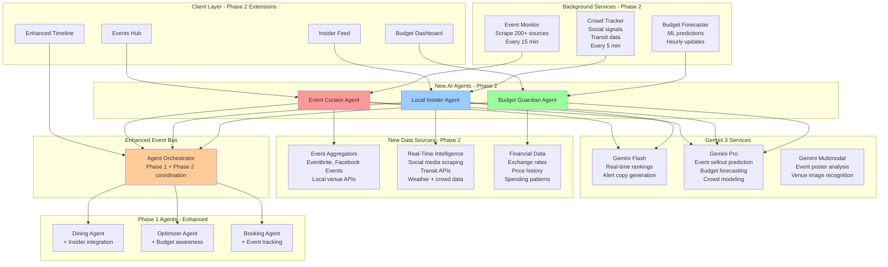
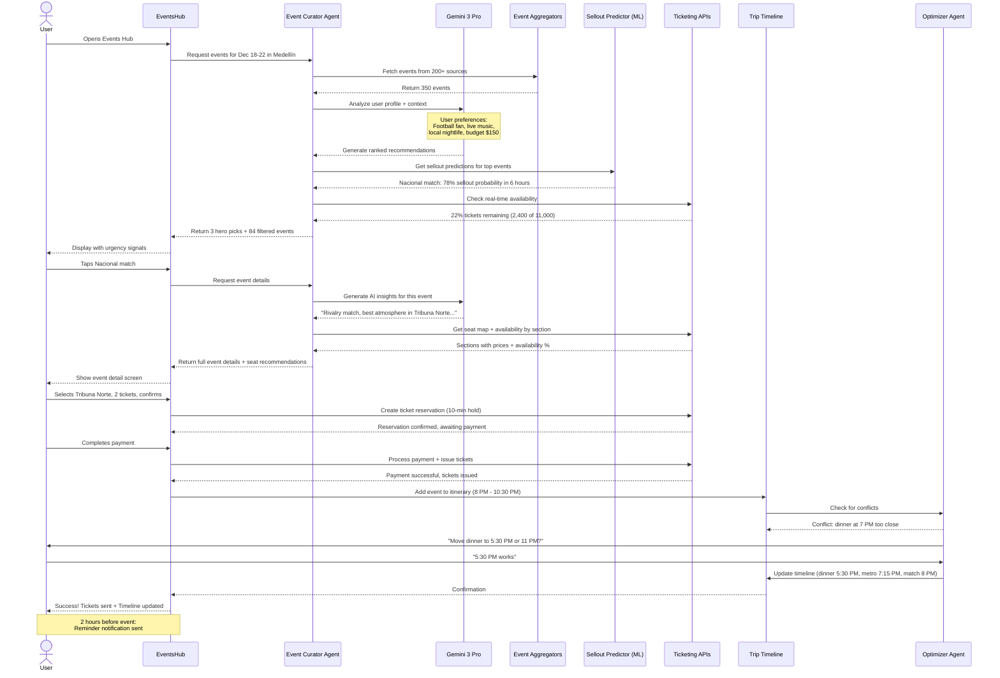
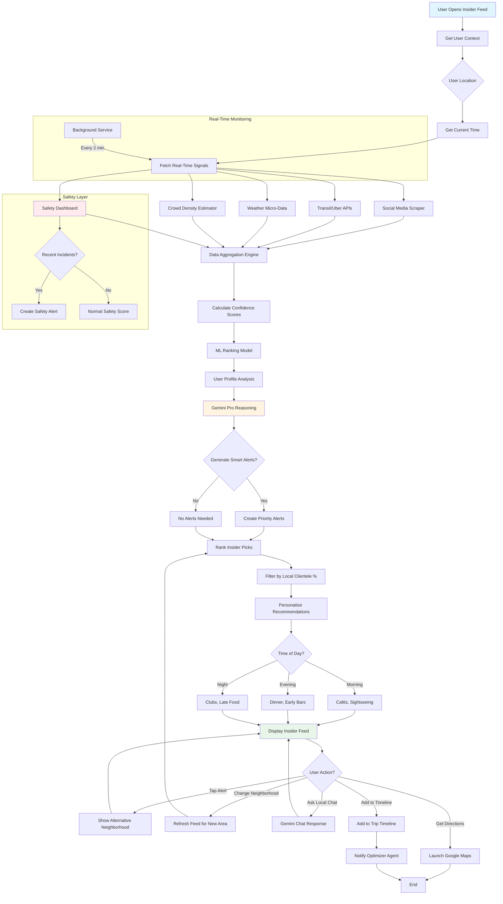
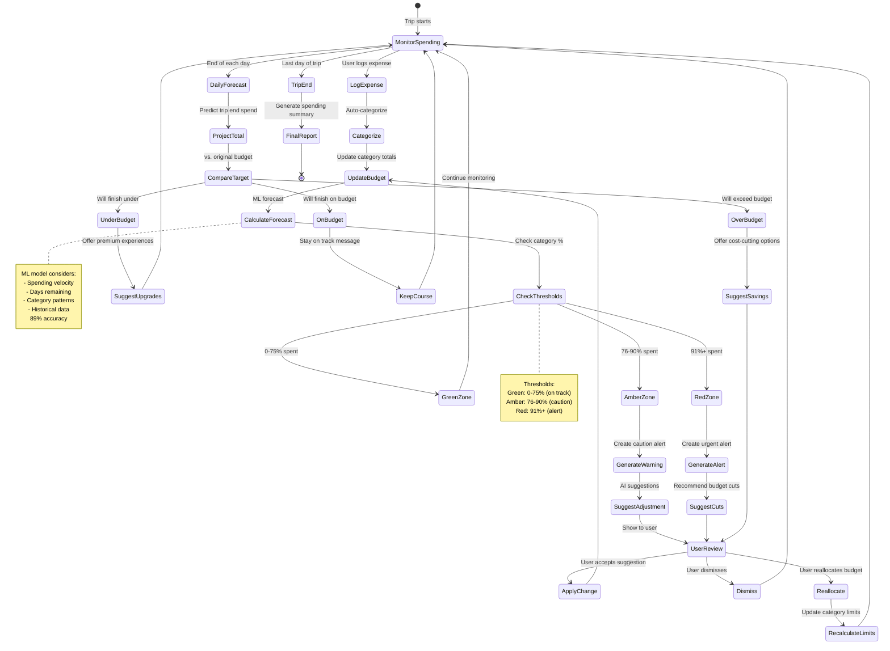
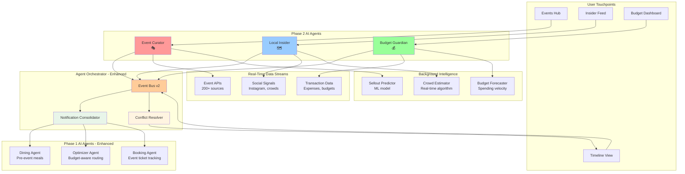

# Phase 2 Implementation Plan: Differentiation & Daily Engagement
## Trip Operating System - Events, Local Intelligence, Budget Guardian

**Status:** Planning  
**Timeline:** Months 4-6  
**Priority:** HIGH - Differentiation & Retention  
**Last Updated:** December 18, 2025

---

## Progress Tracker

### Overall Progress: 0% Complete

```
[░░░░░░░░░░░░░░░░░░░░] 0/100

Phase 2.1: Foundation & Integration    [░░░░░░░░░░] 0/8 tasks
Phase 2.2: Event Curator Agent         [░░░░░░░░░░] 0/14 tasks
Phase 2.3: Local Insider Agent         [░░░░░░░░░░] 0/13 tasks
Phase 2.4: Budget Guardian Agent       [░░░░░░░░░░] 0/12 tasks
Phase 2.5: Cross-Agent Enhancement     [░░░░░░░░░░] 0/7 tasks
Phase 2.6: Production Launch           [░░░░░░░░░░] 0/6 tasks
```

### Milestones

- [ ] **M2.1** - Phase 2 design system extensions (Week 2)
- [ ] **M2.2** - Event Curator MVP (Week 5)
- [ ] **M2.3** - Local Insider MVP (Week 8)
- [ ] **M2.4** - Budget Guardian MVP (Week 10)
- [ ] **M2.5** - All agents integrated (Week 11)
- [ ] **M2.6** - Production launch (Week 12)

---

## Short Summary

Below are **copy-paste, multi-step Figma Make AI prompts** for **Phase 2 – Differentiation & Daily Engagement**.
They define **screens, components, routes, workflows, user journeys, and AI logic** for:

4. **Dynamic Event & Entertainment Curator** 🎭
5. **Local Insider Intelligence** 🗺️
6. **Adaptive Budget Guardian** 💰

Mobile-first, production-ready, visually premium, and logically connected to your Trip OS.

---

# Phase 2.1: Global Foundation & Extensions

## Task 2.1.1: Phase 2 Design System Extensions (Priority: HIGH)

### Prompt for Figma Make AI

```markdown
You are a Senior Product Designer extending the Local Scout design system for Phase 2.

Phase 2 Focus: Daily engagement, real-time intelligence, urgency without anxiety.

CONTEXT:
Phase 1 established core design system. Phase 2 adds:
- Event discovery patterns
- Real-time alert systems
- Budget visualization components
- Time-sensitive urgency patterns
- Local intelligence trust signals

NEW COMPONENT REQUIREMENTS:

1) EVENT CARDS (3 variants)
**Variant A: Hero Event Card (Large, featured)**
- Image: 16:9 aspect ratio, 600x338px minimum
- Urgency badge overlay: "Selling Fast" | "Last Tickets" | "Price Rising"
- Event type icon: 🎭 Concert | ⚽ Sports | 🎪 Festival | 🎨 Cultural
- Trust indicators: 
  - Crowd size estimate: "2,000+ expected"
  - Local popularity: "87% attendees are locals"
  - Safety score: "Very Safe" (green) | "Use Caution" (yellow)
- Time display: "Tonight 8 PM" | "This Saturday 3 PM" | "In 2 hours"
- Scarcity meter: Visual bar showing ticket availability (0-100%)
- Price range: $$ with "Best Value" or "Premium" badge
- Primary CTA: "Get Tickets"
- Secondary action: Heart icon (save) + Share icon

**Variant B: Compact Event Card (List view)**
- Square thumbnail: 120x120px
- Event name + venue (truncate to 2 lines)
- Time + distance from user
- Quick stats row: capacity %, price, rating
- Inline CTA: "Book" button
- Status chip: "Available" (green) | "Limited" (yellow) | "Sold Out" (gray)

**Variant C: Event Timeline Block (for itinerary)**
- Time marker: large, bold
- Event icon + name
- Venue with map pin icon
- Duration estimate
- Travel buffer indicator
- Ticket confirmation: ✓ "Booked" or "⚠ Pending"

2) REAL-TIME ALERT COMPONENTS

**Alert Banner (Top of screen, dismissible)**
- Icon: ⚠️ Caution | 💡 Tip | 🔥 Trending | ✨ Opportunity
- Message: 1-2 sentences, conversational
- Timestamp: "2 min ago" | "Updated 15 min ago"
- Action chips: "See Alternative" | "Adjust Plan" | "Dismiss"
- Priority levels:
  - Critical (red): immediate action needed
  - Important (amber): should see today
  - Info (blue): nice to know
- Auto-dismiss: Info after 10s, others remain until user dismisses

**Live Indicator Chip**
- Pulsing dot animation
- Status text: "Live now" | "Happening soon" | "Active"
- Color: green for positive, amber for caution, red for urgent
- Use cases: crowd levels, event status, price changes

**Crowd Meter Component**
- Visual representation: 0-100% fullness
- Icon: 👥 with count
- Color gradient: green (empty) → amber (moderate) → red (packed)
- Text status: "Quiet" | "Moderate" | "Busy" | "Very Crowded" | "At Capacity"
- Context note: "vs. typical Friday 10 PM"
- Trend arrow: ↗️ Getting busier | ↘️ Clearing out | ↔️ Stable

3) BUDGET VISUALIZATION COMPONENTS

**Category Budget Card**
- Category icon + name: 🍽️ Dining | 🎫 Activities | 🚗 Transport | 🏨 Lodging
- Progress bar: spent vs. budget
  - Under budget (green): 0-75%
  - Near limit (amber): 76-90%
  - Over budget (red): 91%+
- Numbers display:
  - "$245 of $400" (large, tabular numerals)
  - "$155 remaining" (secondary, green/amber/red based on status)
- Days remaining context: "4 days left"
- Spend rate indicator: "On track" | "Running hot" | "Under-spending"
- AI suggestion chip: "💡 Save $40" (tappable)

**Budget Health Gauge (Dashboard widget)**
- Circular progress indicator
- Center shows: Overall % of budget used
- Color coding: green → amber → red
- Outer ring: category breakdown in segments
- Forecast indicator: "Will finish at 92%" (predicted end state)
- Quick status: "😊 Looking good" | "⚠️ Watch spending" | "🚨 Over budget"

**Spend Comparison Chart**
- Bar chart: Planned vs. Actual per day
- X-axis: Days of trip
- Y-axis: Spending amount
- Two bars per day: Planned (outline) | Actual (filled)
- Hover/tap shows: exact amounts + variance
- Trend line: projected total spend
- Visual markers: budget limit line (dotted)

4) LOCAL INTELLIGENCE COMPONENTS

**Insider Tip Card**
- "🔸 Local Tip" header badge
- Tip content: 2-3 sentences max
- Source indicator: "Based on 124 local reviews from last 7 days"
- Confidence score: "92% confident" with small gauge
- Helpful/Not helpful buttons (feedback loop)
- Save to trip notes icon

**Neighborhood Vibe Indicator**
- Neighborhood name + emoji: "El Poblado 🌆"
- Vibe tags (max 3): "Trendy" | "Safe" | "Expensive" | "Touristy" | "Local" | "Quiet" | "Nightlife"
- Time-of-day context: Shows different vibes for Day/Evening/Night
- Current conditions: "Right now: Moderate crowds, good weather"
- Safety score: 1-5 scale with context ("Very safe for solo travelers")
- Price level: $ to $$$$
- "What locals say" quote (1 sentence, attributed)

**Live Conditions Widget**
- 4 indicators in 2x2 grid:
  - Crowds: 👥 Low/Medium/High
  - Weather: ☀️ with temp
  - Safety: 🛡️ Green/Yellow/Red
  - Value: 💰 Good/Fair/Expensive right now
- Last updated: "2 min ago"
- Tap to expand for details

5) URGENCY & SCARCITY PATTERNS (Use responsibly)

**Scarcity Indicators**
- Ticket availability: "Only 12 seats left in this section"
- Time pressure: "Price rises in 4 hours 23 min"
- Demand signal: "37 people viewing this right now"
- Visual: Countdown timer (only if genuinely time-sensitive)
- Progress bar: "78% sold" with red gradient
- RULE: Only show if data is real and recent (<1 hour old)
- NEVER: Fake urgency or manipulate

**Trust Balance**
- Every urgency signal must include:
  - Data source: "Based on live ticket data"
  - Last updated: timestamp
  - Alternative action: "Want me to find similar events?"
  - Opt-out: "Don't show urgency alerts" in settings

6) ANIMATION & INTERACTION PATTERNS

**Micro-animations**
- Card hover: Slight lift (2px) + shadow increase (200ms ease)
- Alert appear: Slide down from top (300ms ease-out)
- Live indicator: Pulse animation (2s loop)
- Success action: Checkmark scale-in + haptic feedback
- Budget bar fill: Animated count-up on load (1000ms)
- Event countdown: Smooth decrement every second

**Loading States (Phase 2 specific)**
- Event feed: Shimmer cards (3 visible)
- Budget chart: Skeleton bars with gradient sweep
- Live data: Spinner with "Fetching latest..." text
- Map pins: Fade in sequentially (not all at once)

7) RESPONSIVE BEHAVIOR (Phase 2 specific)

**Mobile (<768px)**
- Event cards: 1 per row, full width
- Alerts: Full-width banner at top, sticky
- Budget charts: Vertical bars, scrollable
- Crowd meter: Compact, icon + text
- Insider tips: Full card, swipeable

**Tablet (768-1024px)**
- Event cards: 2 per row
- Alerts: Fixed width, right-aligned
- Budget charts: Horizontal orientation
- Split view: Events left, map right

**Desktop (>1024px)**
- Event cards: 3 per row
- Alerts: Toast-style, bottom-right
- Budget charts: Full dashboard view
- Three-column: Feed | Details | Context panel

8) ACCESSIBILITY (Phase 2 additions)

- Urgency indicators: Screen reader announces severity + timestamp
- Countdown timers: Aria-live region, announces at intervals (not every second)
- Budget charts: Data table alternative view
- Live updates: Polite announcements, not aggressive
- Color blindness: Icons + patterns, not just color
- Crowd meter: Text equivalent always present
- Focus management: Alerts don't steal focus from forms

9) DARK MODE SUPPORT (New for Phase 2)

**Event Cards:**
- Dark background: #1a1a1a
- Image overlay: Subtle gradient to dark
- Text: White with 0.9 opacity
- Urgency badges: Brighter, more saturated colors

**Budget Charts:**
- Background: #242424
- Bars: Inverted color scheme
- Grid lines: White at 10% opacity
- Text: #e0e0e0

**Alerts:**
- Warning: Amber with dark background
- Info: Blue with dark background
- Success: Green with dark background
- All have sufficient contrast (4.5:1 minimum)

10) LOCALIZATION READY

**Number Formatting:**
- Currency: Respect user locale (USD: $1,234.56 | COP: $1.234.567)
- Dates: DD/MM/YYYY (European) vs. MM/DD/YYYY (US)
- Time: 24-hour vs. 12-hour with AM/PM
- Temperature: Celsius vs. Fahrenheit

**Text Expansion:**
- Buttons: Allow 30% expansion for translations
- Cards: Flexible height to accommodate longer text
- Truncation: Use ellipsis, show full text on hover/tap

DELIVERABLES:
- Component library addition (20+ new components)
- Variant documentation for each component
- Responsive behavior specs
- Animation timing documentation
- Dark mode variants
- Accessibility notes for each component
- Figma prototype with all interactions

Generate Phase 2 design system extensions with all components and variants.
```

**Acceptance Criteria:**
- [ ] All 10 sections complete and documented
- [ ] 20+ new components designed with variants
- [ ] Dark mode support for all components
- [ ] Responsive specs for mobile/tablet/desktop
- [ ] Animation timing documented (200-1000ms range)
- [ ] Accessibility audit passed for new components
- [ ] Trust patterns documented (no fake urgency)
- [ ] Integration with Phase 1 design system verified

**Dependencies:** Phase 1.1.1 (Design System Foundation)  
**Estimated Time:** 4-5 days  
**Assigned To:** Design Lead + UI Designer

---

## Phase 2 System Architecture



---

# Phase 2.2: Agent 4 - Dynamic Event & Entertainment Curator 🎭

## Task 2.2.1: Events Hub Core Screen (Priority: CRITICAL)

### Prompt Chain - Step 1: Events Discovery Dashboard

```markdown
Create the Events Hub - your daily reason to open the app.

Route: /trip/:tripId/events

CONTEXT:
User is in Medellin for 5 days (Dec 18-22, 2025). Today is Friday, Dec 20 at 6:30 PM.
They're a 28-year-old football fan who loves live music and mentioned "want to experience local nightlife" in trip notes.
Currently at hotel in El Poblado.

STRATEGIC GOAL:
Create FOMO (fear of missing out) without anxiety. Make events feel urgent, exciting, and "you're in the right place at the right time."

SCREEN STRUCTURE:

1) CONTEXT-AWARE HEADER (Dynamic, updates based on time/location)
**Evening (6 PM - 11 PM):**
- Headline: "Tonight in Medellín 🌆"
- Subheadline: "3 events starting soon near you"
- Time chip: "Friday, 6:30 PM" (updates in real-time)
- Location chip: "📍 El Poblado" (tappable to change)

**Morning (6 AM - 12 PM):**
- Headline: "Plan your day 🌅"
- Subheadline: "5 events happening today"

**Night (11 PM - 2 AM):**
- Headline: "What's open right now 🌙"
- Subheadline: "Late-night events near you"

**No events today:**
- Headline: "This weekend in Medellín"
- Shows next 7 days

2) URGENCY SIGNALS (Only if genuine)
**Alert banner (if applicable):**
- 🔥 "Atlético Nacional match selling out - 22% tickets left"
- 💡 "Concert tickets drop 30% in 1 hour (pre-sale ends)"
- ⚠️ "Your saved event (Karol G) starts in 2 hours"
- Dismissible, but reappears once if critical

**Trust balance:**
- Every urgency claim shows source: "Based on live Ticketmaster data, updated 3 min ago"
- Alternative action always present: "Not interested → Find similar events"

3) AI TOP PICKS - HERO SECTION (3 events maximum)
Title: "Perfect for tonight - here's why"
Subtitle: "Based on: football fan + live music + local nightlife preference"

**Hero Event Card A (Featured, large):**
- **Image:** Stadium at night, crowd energy visible (16:9, 600x338px)
- **Urgency badge (top-right overlay):** "🔥 Selling Fast - 18% left"
- **Event type icon (top-left):** ⚽ Football
- **Event details:**
  - Name: "Atlético Nacional vs. Millonarios"
  - Venue: "Estadio Atanasio Girardot"
  - Date/Time: "Tonight, 8:00 PM" (large, bold)
  - Duration: "~2.5 hours" (includes pre/post time)
- **Trust indicators row:**
  - ⭐ 4.9 "atmosphere rating" (from past attendees)
  - 👥 "12,000+ expected" (crowd size)
  - 🎟️ "87% local fans" (not touristy)
  - 🛡️ "Very Safe" (safety score, green)
- **Distance & logistics:**
  - 📍 "4.2 km from you" 
  - 🚗 "15-min drive" | 🚇 "25-min metro" (choose based on time/cost)
  - Traffic note: "Light traffic right now (leave by 7:30 PM)"
- **Pricing:**
  - Range: $$ ($35-$120)
  - Sections available: "Tribuna Norte (best atmosphere, $45) | VIP ($120)"
  - AI recommendation: "🎯 Best Value: Tribuna Norte - same energy, half the price"
- **Why AI picked this:**
  - "You mentioned loving football + this is a rivalry match (extra energy)"
  - "Locals say this atmosphere is unmissable"
  - Confidence: "94% match to your preferences"
- **Weather note (if relevant):** "☀️ Clear evening, perfect conditions"
- **Actions:**
  - Primary CTA: "See Seats & Book" (large button, urgent color)
  - Secondary: "Save for Later" (heart icon)
  - Tertiary: "Share" (share icon)

**Hero Event Card B (Secondary):**
- **Image:** Live band, rooftop bar
- **Badge:** "✨ Hidden Gem"
- **Event:** "Rooftop Jazz Night at Astorga"
- **Time:** "Starts 9 PM"
- **Why:** "Small venue (100 capacity), 92% local crowd, $15 cover"
- **Insight:** "Not on major booking sites - locals book via Instagram"
- **CTA:** "Reserve Spot"

**Hero Event Card C (Third option):**
- **Image:** Crowd at nightclub
- **Badge:** "🎵 Popular Tonight"
- **Event:** "Electronic Music at Club Voltaire"
- **Time:** "10 PM - 3 AM"
- **Why:** "DJ from Barcelona, sold out last time, $20 entry"
- **Seating:** "Limited tables ($40 with bottle service)"
- **CTA:** "Get Entry Pass"

**After showing 3:**
- "Want 3 more options?" (button)
  - Generates next tier of recommendations
  - Learns from which user tapped/saved

4) CATEGORY FILTERS (Horizontal scrollable chips)
- All Events (87)
- ⚽ Sports (3)
- 🎵 Live Music (12)
- 🎭 Theater & Arts (5)
- 🎪 Festivals (1)
- 🍷 Food & Wine (8)
- 🌃 Nightlife (24)
- 🎨 Cultural (6)
- 🎤 Comedy (2)
- 👨‍👩‍👧‍👦 Family (4)

Each chip shows count. Selected chip is highlighted.
Tapping filters main feed below.

5) TIME FILTERS (Secondary chips row)
- Right Now
- Tonight (6 PM - 11 PM)
- Late Night (11 PM+)
- Tomorrow
- This Weekend
- Next Week

6) EVENT FEED - ALL RESULTS (Infinite scroll)
Title: "All Events (87 this week)"
Sort dropdown: "Recommended" | "Soonest" | "Most Popular" | "Best Value" | "Closest"

**Compact Event Card (List view, repeating):**
- **Left: Square image** (120x120px)
  - Overlay badge if urgent: "Tonight" | "Tomorrow" | "Selling Fast"
- **Right: Event info column**
  - Event name (H4, bold, 2 lines max with ellipsis)
  - Venue name (smaller, gray)
  - Date + time: "Sat, Dec 21 • 9:00 PM"
  - Category chip: "Live Music" (color-coded)
  - Quick stats row:
    - Distance: "2.1 km"
    - Price: "$15-$40"
    - Popularity: 👥👥👥⚪⚪ (3/5 dots filled)
    - Availability: "✅ Tickets Available" | "⚠️ Limited" | "❌ Sold Out"
  - Why this? (1 sentence, if AI has reason): "Similar to concerts you loved in Barcelona"
  - Actions:
    - "Book" button (if available)
    - "Waitlist" button (if sold out but accepting waitlist)
    - Heart icon (save/unsave)
    - Info icon (quick preview modal)

**Grouped by category:**
Show ~5 events per category, then "See all [category]" to expand.

7) SERENDIPITY SECTION (Hidden gem discovery)
Title: "You Wouldn't Search for This - But You'll Love It ✨"
Subtitle: "AI-curated surprises based on your vibe, not keywords"

**Serendipity Card (2 events max):**
- Different visual treatment: slightly playful, less serious
- Image with illustrated overlay or unique styling
- Event name
- **Why AI chose this:**
  - "You don't follow salsa, but 89% of people with your taste profile loved this"
  - "This neighborhood (Laureles) matches your 'authentic local' preference"
  - "It's free, it's unique, and it's happening in 90 minutes"
- **Trust element:** "92% recommendation confidence"
- **CTA:** "I'm Curious - Tell Me More"

8) MAP VIEW TOGGLE (Desktop + Tablet)
- Button (top-right): "Map View" ↔ "List View"
- Map view shows:
  - Event pins color-coded by category
  - Cluster markers for multiple events at same venue
  - User location pin
  - Tap pin → event summary card
  - "List" button to return

9) FLOATING ACTION BUTTON (Mobile only, bottom-right)
- Icon: Magic wand or sparkles
- Label: "Find for Me"
- Tap → Opens AI chat overlay
- User can say:
  - "Find something romantic for 2 people tonight under $50"
  - "What's the most local experience happening now?"
  - "I want live music but not too crowded"
- AI responds with 2-3 specific events + reasoning

10) STICKY BOTTOM BAR (Mobile, appears on scroll)
- Shows filter summary: "3 filters applied" + clear filters button
- Primary CTA: "Show Tonight's Best Pick" (instant AI selection)
- Tapping shows modal with #1 recommendation + immediate booking

STATES TO DESIGN:

**Empty State (No events match filters):**
- Illustration: Calendar with question mark
- Headline: "No events match your filters"
- Subtext: "Try removing some filters or expanding your dates"
- Suggestions:
  - "Check next weekend" (button)
  - "See all categories" (button)
  - "Ask AI for suggestions" (opens chat)

**Loading State:**
- Skeleton hero cards (3 visible)
- Skeleton list items (6 visible)
- Top search remains interactive
- Loading message: "Finding the best events for you..."

**Error State:**
- Icon: ⚠️
- Headline: "Couldn't load events"
- Subtext: "Check your connection or try again"
- CTA: "Retry" + "Contact Support"

**No Events Today:**
- Headline: "Nothing major tonight"
- Subtext: "But here's what locals do on quiet Friday nights..."
- Show:
  - 3 low-key options (bars, cafés, walks)
  - "Check tomorrow" (shows Saturday events)
  - "Explore neighborhoods" → /trip/:tripId/insider

**Sold Out Event:**
- Card grayed out but visible
- Badge: "❌ Sold Out"
- Actions:
  - "Join Waitlist" (if available)
  - "Find Similar Events" → shows 3 alternatives
  - "Track for Next Time" → saves to future trips

INTERACTIONS:

1. User lands on Events Hub → AI immediately highlights 3 top picks (no loading delay if cached)
2. User scrolls → "Tonight" events prioritized → Tomorrow events → Weekend events
3. User taps category chip (Sports) → feed filters instantly, hero section updates to sports events
4. User taps "See Seats & Book" → navigates to /trip/:tripId/events/:eventId
5. User hearts event → saved to trip, added to watchlist, removed from feed (optional filter)
6. User taps "Map View" → transitions to map layout smoothly (<300ms)
7. User uses FAB "Find for Me" → chat overlay slides up, AI responds in <2s
8. User enables "Tonight only" filter → removes all future events, recalculates AI picks

RESPONSIVE BEHAVIOR:

**Mobile (<768px):**
- Hero cards: 1 per view, horizontal scroll/swipe
- Event feed: 1 card per row, full width
- Filters: horizontal scroll
- Map view: fullscreen modal
- Sticky bottom bar appears after scrolling past hero
- FAB always visible

**Tablet (768-1024px):**
- Hero cards: 2 per row (featured card spans both columns on first row)
- Event feed: 2 per row
- Filters: wrap to multiple rows if needed
- Map view: side-by-side with list (60/40 split)

**Desktop (>1024px):**
- Hero cards: 3 per row (grid)
- Event feed: 2-column layout OR map + list side-by-side
- Filters: full row, no scroll
- Right sidebar: Map always visible (sticky)
- Hover states: card lift, quick preview tooltip

ACCESSIBILITY:

- All event times: announced in user's timezone + "in X hours" context
- Urgency badges: screen reader says "Attention: selling fast, 18% tickets remaining"
- Availability dots: aria-label "3 out of 5 popularity rating"
- Map: keyboard navigable, tab through event pins
- Focus order: Hero cards → Filters → Feed → FAB
- Live updates: aria-live="polite" for new urgent alerts
- Color contrast: all text 4.5:1 minimum on images (use overlay gradient)

PERFORMANCE:

- Initial load: <2s (hero cards + first 10 feed items)
- Filter change: <200ms (client-side if data cached)
- Infinite scroll: load next 20 items 2 screens before bottom
- Image lazy load: 1 screen ahead
- API calls:
  - Event list: cached 5 min
  - Urgency data (tickets remaining): real-time, 30s cache
  - AI picks: cached 15 min per user (refresh on filter change)

DATA REQUIREMENTS:

For each event, need:
- event_id, name, description (short + long)
- category (primary + secondary)
- venue_name, venue_address, lat/lng
- start_time, end_time, doors_open_time
- ticket_price_range (min, max, currency)
- ticket_availability (available_count, total_capacity, percentage)
- ticket_sources (urls to booking platforms)
- images (poster, venue, crowd photos - min 3)
- popularity_score (0-100, calculated from social signals)
- local_percentage (% of past attendees from local area)
- safety_score (1-5, from reviews + city data)
- weather_sensitive (boolean, is this outdoor?)
- typical_crowd_size, age_range (25-35), vibe_tags (energetic, chill, romantic)
- reviews (sample 3-5 recent reviews)
- ai_match_reason (generated per user)
- similar_event_ids (for recommendations)

ADVANCED FEATURES:

**Predictive Alerts (Premium):**
- "This usually sells out 3 days before. Want me to track it?"
- "Prices typically rise 40% in the last 24 hours for this venue"
- "I predict this will sell out in 6 hours based on current ticket velocity"
- Show confidence: "78% confidence based on 24 similar events"

**Group Coordination:**
- "Send this event to all trip members?"
- Shows who's interested (thumbs up/down)
- "3 of 4 people want to go - book for the group?"
- Split payment option

**Auto-Add to Timeline:**
- "This event fits perfectly between your dinner and late-night plans"
- Shows before/after timeline comparison
- "Add + Optimize My Night" → books event + rearranges timeline

**Social Proof:**
- "12 Local Scout users are going to this event"
- "Sarah M. (mutual friend from Facebook) is attending"
- "Featured in Time Out Medellín's Top 10 this month"

Create the complete Events Hub with all sections, states, and responsive layouts.
```

**Acceptance Criteria:**
- [ ] All 10 sections implemented and responsive
- [ ] 3 AI-generated hero picks based on user profile
- [ ] Real-time urgency data updating (30s interval)
- [ ] Category and time filters working instantly (<200ms)
- [ ] Map view + list view toggle functional
- [ ] Serendipity section shows unexpected relevant events
- [ ] 5 states designed and functional (normal, empty, loading, error, sold out)
- [ ] Accessibility audit passed (screen reader, keyboard nav)
- [ ] Performance targets met (<2s load, <200ms filter)
- [ ] Mobile FAB "Find for Me" AI chat working

**Dependencies:** Task 2.1.1 (Phase 2 Design System)  
**Estimated Time:** 6-7 days  
**Assigned To:** Front-End Dev + Designer + AI Engineer

---

### Prompt Chain - Step 2: Event Detail & Ticketing Flow

```markdown
Create Event Detail screen with intelligent seat selection.

Route: /trip/:tripId/events/:eventId

CONTEXT:
User tapped on "Atlético Nacional vs. Millonarios" football match from Events Hub.
Event is tonight at 8 PM, 22% tickets remaining, user is at hotel 15 min away.

STRATEGIC GOAL:
Remove friction from "I'm interested" to "I'm going." Make seat selection easy and smart.

SCREEN STRUCTURE:

1) HERO MEDIA SECTION
- **Event poster/hero image** (full-width, 16:9 aspect ratio)
  - If multiple images: swipeable gallery with 1/5 indicator dots
  - Overlay gradient (dark at bottom for text readability)
- **Floating elements over hero:**
  - Back button (top-left): ← "Events"
  - Share button (top-right): iOS share sheet / Android share intent
  - Heart button (top-right): Save/Unsave (filled if saved)
  - Live badge (if event happening now): "🔴 Live Now" (pulsing)

2) EVENT HEADER INFO
- **Event name** (H1): "Atlético Nacional vs. Millonarios"
- **Category badge:** ⚽ Football • Rivalry Match
- **Venue:** "Estadio Atanasio Girardot" (tappable → maps)
- **Date/Time:** 
  - "Tonight at 8:00 PM" (large, bold)
  - Countdown: "Starts in 1 hour 28 min" (updates in real-time)
  - Duration: "~2.5 hours (including pre-game)"
  - Ends: "~10:30 PM"
- **Trust & atmosphere row:**
  - ⭐ 4.9 atmosphere rating (from 847 past attendees)
  - 👥 Crowd: "12,000+ expected (85% capacity)"
  - 🎟️ Local fans: "87% from Medellín"
  - 🛡️ Safety: "Very Safe" (green badge)
  - ⚡ Energy: "High - rivalry match" (energy meter visual)

3) URGENCY BANNER (if applicable)
- 🔥 "Only 22% of tickets remain - selling fast"
- Last updated: "3 min ago"
- Trend: "↗️ 120 tickets sold in last hour"
- Prediction: "I expect this to sell out in 4-6 hours"
- CTA: "Secure your spot now"
- Dismissible, but shows smaller version if scrolled past

4) QUICK ACTIONS ROW
- Primary: "Select Seats" (large button, scrolls to seat selector)
- Secondary: "Get Directions" (opens maps to venue)
- Secondary: "Add to Calendar" (exports .ics with reminders)
- Icon: Share event
- Icon: Save to trip

5) AI INSIGHTS CARD (Why this is special)
- Header: "Why you'll love this 🎯"
- Insights (conversational bullets):
  - ✓ "You mentioned loving football - this is THE rivalry in Colombia"
  - ✓ "Tribuna Norte section: locals say best atmosphere, non-stop chanting"
  - ✓ "Nacional is top of league, Millonarios fighting for playoff spot (high stakes)"
  - ✓ "Weather is perfect: 72°F, clear skies, no rain expected"
  - ✓ "Your hotel is 15 min away - easy to get back after the match"
- Confidence score: "96% match to your preferences"
- "Want to know more?" → Expands to show full reasoning

6) SEAT SELECTION SECTION (Core experience)
**Visual Stadium Map:**
- Interactive SVG stadium diagram showing:
  - Sections: color-coded by price tier
    - Tribuna Norte (Green, $45): "Best atmosphere - standing, chanting"
    - Tribuna Sur (Blue, $45): "Away fans section - avoid if supporting Nacional"
    - Occidental (Yellow, $65): "Seated, good view, calmer"
    - Oriental (Yellow, $65): "Seated, good view"
    - VIP (Red, $120): "Premium seats, includes food/drink, parking"
  - Availability indicator per section: Green (available) | Amber (limited) | Red (sold out)
  - User's hotel location arrow: "You're here"
  - Exit closest to hotel highlighted

**AI Seat Recommendation:**
- Badge: "🎯 Best for You: Tribuna Norte ($45)"
- Reasoning:
  - "You want authentic experience → Tribuna Norte is 92% local fans"
  - "Standing section = more energy (you loved this in Barcelona)"
  - "Best value: same price as Sur but better view + home fans"
  - "Easy exit toward Metro (your route home)"
- Alternative if sold out: "Occidental is next best: seated, good view, $20 more"

**Seat Selector Controls:**
- Section dropdown: All sections listed with availability
- Price filter slider: $35 - $120
- Seating preference chips:
  - Standing (high energy) | Seated (comfortable) | VIP (premium)
- View preference:
  - Center field | Corner | Behind goal
- Accessibility needs: Wheelchair accessible sections highlighted

**Selected section details:**
- Section name + price
- View preview: Photo from that section
- Amenities: 
  - Nearby bathrooms, food vendors
  - Smoking/non-smoking
  - Covered/uncovered (weather protection)
- Typical crowd: "Ages 25-40, high energy, singing/chanting"

7) QUANTITY & ATTENDEES
- Ticket quantity: 1, 2, 3, 4, 5, 6+ (dropdown)
- If trip has multiple people:
  - "Who's going?" (show trip member avatars with checkboxes)
  - "Send invite to all trip members?" → they can accept/decline
  - Auto-fill: Assumes trip party size

8) LOGISTICS & PLANNING
**Getting There:**
- From your hotel: "Calle 40 Hotel, El Poblado"
- Distance: 4.2 km
- Travel options:
  - 🚗 Drive: 15 min (normal traffic)
    - Parking: "$5 stadium lot" or "Street parking (difficult)"
  - 🚇 Metro: 25 min (Poblado → Estadio)
    - Cost: $0.80
    - Last train back: 11:00 PM ✅ "You'll make it"
    - Walking: 5 min from station to stadium
  - 🚕 Uber: $5-7, 15 min
- **AI recommendation:** "🎯 Take Metro - cheap, reliable, no parking hassle"
- Traffic forecast: "Light traffic now, moderate after the match"
- **Smart timing:** 
  - "Leave hotel by 7:15 PM to arrive 30 min early (avoid lines)"
  - "Doors open 7:00 PM"

**Weather:**
- Current: 72°F, Clear ☀️
- At kickoff (8 PM): 68°F, Clear
- After match (10:30 PM): 64°F, Clear
- Recommendation: "Light jacket recommended for evening"

**What to Bring:**
- ✅ ID required (checked at entry)
- ✅ Cash for food/drinks (limited card acceptance)
- ✅ Phone for e-ticket
- ❌ No backpacks or large bags allowed
- ❌ No outside food/drinks

9) PRICING BREAKDOWN
- Tickets: $45 × 2 people = $90
- Service fee: $5.40 (6%)
- Subtotal: $95.40
- Estimated costs:
  - Transport (Metro round-trip): $3.20
  - Food/drinks at stadium: ~$20
  - **Total evening cost: ~$118.40**
- Budget status: "Within your $150 activities budget ✅"
- "Want cheaper option?" → Suggests Tribuna Sur (away section, same price) or watching at sports bar ($15)

10) REVIEWS & SOCIAL PROOF
- Title: "What fans are saying"
- Overall rating: ⭐ 4.9/5 (from past Nacional matches)
- **Recent reviews (3-5 shown):**
  - Review card:
    - User: "Carlos M. (Local from Medellín)"
    - Date: "Last match, 2 weeks ago"
    - Rating: ⭐⭐⭐⭐⭐
    - Review: "Best football atmosphere in Colombia! Tribuna Norte is insane energy. Bring cash for empanadas at halftime. 100% recommend."
    - Helpful: "78 people found this helpful"
- Filter chips: All | Tribuna Norte | Occidental | VIP | First-Timers
- CTA: "Read all 847 reviews"

11) SIMILAR EVENTS (If user scrolls to bottom)
- Title: "More football experiences"
- 3 compact cards:
  - Other Nacional matches this month
  - Stadium tour (non-match day)
  - Watch parties at sports bars (free or cheap)
- CTA: "See all football events"

12) STICKY BOTTOM BAR (Mobile)
- Shows: Selected section + price
  - "Tribuna Norte • $45 × 2 = $90"
- Primary CTA: "Buy Tickets"
- If nothing selected: "Select section to continue"

TICKETING CHECKOUT FLOW:

**Step 1: Review & Confirm (Modal slides up)**
- Header: "Review Your Tickets"
- Summary card:
  - Event: Nacional vs Millonarios
  - Date/Time: Tonight, 8:00 PM
  - Section: Tribuna Norte
  - Quantity: 2 tickets
  - Price: $90 + $5.40 fee = $95.40
- Contact info:
  - Email (from user profile, editable)
  - Phone (from user profile, editable)
  - "Send tickets and updates to this info"
- Terms & conditions:
  - "All sales final, no refunds"
  - "E-tickets sent to email immediately"
  - "Must show ID at entry"
- Checkbox: "I agree to venue rules and policies"
- Actions:
  - Primary: "Confirm & Pay"
  - Secondary: "Go Back"

**Step 2: Payment (Integrated with Stripe/PayPal)**
- Payment method:
  - Saved card (if on file): **** 4242
  - "Add new card" → Stripe embedded form
  - PayPal option
- Security: SSL badge, "Secure payment" indicator
- Processing: "Your card will be charged $95.40"

**Step 3: Processing**
- Show spinner
- Message: "Securing your tickets..."
- Submessages (rotate every 2s):
  - "Reserving your seats..."
  - "Processing payment..."
  - "Generating e-tickets..."

**Step 4: Success State**
- Animation: Confetti + checkmark
- Headline: "You're going to the match! ⚽🎉"
- Confirmation card:
  - Booking reference: #NAC-2512-8472
  - Event: Nacional vs Millonarios
  - Section: Tribuna Norte
  - Seats: Row 12, Seats 15-16 (if assigned seating)
  - Date/Time: Tonight at 8:00 PM
  - E-tickets: "Sent to [email]"
- Next steps:
  - ✓ "Added to your trip timeline"
  - ✓ "Reminders set: 2 hours before, 30 min before"
  - ✓ "Metro directions saved"
  - ✓ "I optimized your evening timeline (dinner → metro → match)"
- Actions:
  - Primary: "View Tickets" (shows QR codes)
  - Secondary: "Add to Apple Wallet / Google Pay"
  - Tertiary: "View Updated Timeline" → /trip/:tripId/timeline
  - Quaternary: "Share with Trip Members"

**Error Handling:**
- If payment fails:
  - Icon: ⚠️
  - Headline: "Payment couldn't be processed"
  - Reason: "Card declined" or "Insufficient funds"
  - Action: "Try a different card" + "Contact your bank"
  - Safety: "Your seats are held for 10 minutes while you retry"
- If tickets sold out during checkout:
  - Icon: 😔
  - Headline: "These seats just sold out"
  - Message: "Someone bought them while you were checking out"
  - Alternatives:
    - "Try Occidental section (still available, $65)"
    - "Join waitlist in case of cancellations"
    - "Find similar football events"
  - No charge applied

AUTOMATIC TIMELINE INTEGRATION:

After ticket purchase, AI automatically:
1. Adds event to timeline: "8:00 PM - 10:30 PM: Nacional Match"
2. Adds travel time before: "7:15 PM - 7:45 PM: Metro to Stadium"
3. Checks for conflicts:
   - If dinner reservation at 7 PM exists → "I need to move your dinner to 5:30 PM or after the match (11 PM). Which works better?"
   - If no conflict → "All set! Your evening timeline is optimized."
4. Adds buffer after: "10:30 PM - 11:15 PM: Metro back + walk to hotel"
5. Sends confirmation: "I updated your timeline and added travel buffers"

STATES:

**Event Sold Out:**
- Header banner: "❌ This event is sold out"
- Show:
  - Waitlist option: "Join waitlist (we'll notify if tickets open up)"
  - Alternative dates: "Nacional plays again Dec 28"
  - Similar events: "Other football matches this week"
  - Watch party: "Watch live at Bar Deportivo (free entry)"
- Actions: "Join Waitlist" | "Find Similar Events"

**Event Canceled:**
- Header banner: "⚠️ This event has been canceled"
- Reason (if known): "Postponed due to weather - rescheduled to Dec 25"
- Refund status: "Full refunds issued automatically"
- Actions: "Book rescheduled event" | "Find alternatives"

**Event Past (user viewing old event):**
- Header: "This event has ended"
- Show: Past event details (grayed out)
- Actions:
  - "Find next Nacional match"
  - "Leave a review" (if user attended)

INTERACTIONS:

1. User lands on event detail → Hero image loads → AI insights card draws attention
2. User scrolls to seat map → Taps Tribuna Norte → See section details
3. User adjusts quantity to 2 → Price updates in real-time
4. User taps "Buy Tickets" → Review modal slides up
5. User confirms → Payment form appears
6. Payment succeeds → Success animation → Timeline auto-updates
7. User taps "View Tickets" → QR codes displayed, ready to scan at venue

RESPONSIVE:

**Mobile:**
- Stadium map: Simplified, sections as list with visual preview
- Sticky bottom bar with "Buy Tickets"
- Payment: Full-screen modal
- Success: Full-screen with confetti animation

**Tablet:**
- Stadium map: Full visual, tappable sections
- Two-column: Details left, logistics/reviews right
- Payment: Modal overlay

**Desktop:**
- Stadium map: Large, interactive SVG with zoom
- Three-column: Details | Map | Logistics
- Payment: Modal center-screen
- Success: Modal with larger confetti effect

ACCESSIBILITY:

- Stadium map: Keyboard navigable (tab through sections, enter to select)
- Screen reader: "Tribuna Norte section, $45, best atmosphere, 87% available"
- Price updates: aria-live announcements
- Countdown timer: Announces at intervals (not every second)
- Success animation: reduced motion option
- QR codes: Large enough to scan easily (200x200px minimum)

PERFORMANCE:

- Hero image: WebP with JPEG fallback, lazy load
- Stadium map: SVG inline (no network request)
- Availability: Real-time check on load, then 30s polling
- Payment: Stripe preload during review step (faster checkout)
- Timeline update: Optimistic UI (show success before API confirms)

Create the complete Event Detail screen with ticketing flow and all states.
```

**Acceptance Criteria:**
- [ ] All 12 sections implemented
- [ ] Interactive stadium map with seat selection
- [ ] AI seat recommendation based on user preferences
- [ ] Complete ticketing flow: review → payment → success
- [ ] Automatic timeline integration after purchase
- [ ] Real-time availability updates (30s polling)
- [ ] Error handling for payment failures and sold-out scenarios
- [ ] Apple Wallet / Google Pay integration for tickets
- [ ] Accessibility audit passed
- [ ] Performance: <2s load, <500ms payment processing UI

**Dependencies:** Task 2.2.1 (Events Hub), Payment gateway (Stripe)  
**Estimated Time:** 7-8 days  
**Assigned To:** Front-End Dev + Back-End Dev + Designer

---

## Event Curator Agent Workflow



---

## Task 2.2.3-2.2.14: Additional Event Curator Features

### Quick Task List (with Multi-Step Prompts)

**Task 2.2.3:** Event Price Tracking & Autopilot (4 days)
- Multi-step prompt chain:
  1. Design watchlist interface
  2. Build price monitoring service
  3. Create alert notification system
  4. Implement auto-purchase flow (with permission)

**Task 2.2.4:** Sell-Out Prediction Engine (ML) (5 days)
- Prompt chain:
  1. Collect historical ticket sales data
  2. Train ML model (features: venue, artist, day, ticket velocity)
  3. Generate predictions with confidence scores
  4. Display in UI with trust indicators

**Task 2.2.5:** Event Social Integration (3 days)
- Prompt chain:
  1. "See which friends are going" feature
  2. Group ticket purchasing coordinator
  3. Event check-in social posts
  4. Post-event photo sharing

**Task 2.2.6:** VIP & Exclusive Access (Premium) (3 days)
- Prompt chain:
  1. Partner with venues for VIP access
  2. Design VIP perks UI (backstage, meet-and-greet)
  3. Premium tier upsell flow
  4. VIP experience booking process

**Task 2.2.7:** Event Recommendations Feed (Daily Push) (3 days)
- Prompt chain:
  1. Design daily digest email/push notification
  2. Personalize "Tonight's picks" algorithm
  3. Time-based triggers (morning, afternoon, evening suggestions)
  4. Engagement tracking (open rates, click-through)

**Task 2.2.8:** Cultural Calendar Integration (2 days)
- Auto-add holidays, festivals, local celebrations to user timelines

**Task 2.2.9:** Event History & Reviews (2 days)
- Post-event: "How was it?" review prompt
- Build reputation system for event quality

**Task 2.2.10:** Alternative Event Finder (3 days)
- When sold out: AI finds similar events by vibe, genre, price

**Task 2.2.11:** Event + Dining Combo Packages (3 days)
- "Dinner + Concert" bundles with discount

**Task 2.2.12:** Last-Minute Deals (2 days)
- Partner with venues for unsold day-of tickets (discounts)

**Task 2.2.13:** Event Reminders & Check-In (2 days)
- Smart reminders: 2 hours before, 30 min, "leave now"
- One-tap check-in for social sharing

**Task 2.2.14:** Event Curator Testing & QA (5 days)
- End-to-end testing of booking flow
- Sellout prediction accuracy testing
- Load testing for high-demand events

**Total Estimated Time for Phase 2.2: 38-42 days**

---

# Phase 2.3: Agent 5 - Local Insider Intelligence 🗺️

## Task 2.3.1: Insider Feed Core Screen (Priority: CRITICAL)

### Prompt Chain - Step 1: Real-Time Local Intelligence Hub

```markdown
Create the Local Insider Intelligence screen - your competitive moat.

Route: /trip/:tripId/insider

STRATEGIC CONTEXT:
This is what NO other travel app has: real-time, hyper-local intelligence from actual local signals.
Goal: Make tourists feel like temporary locals who "know the vibe."

USER CONTEXT:
User is in Medellín, staying in El Poblado. It's Friday at 10:15 PM.
They're thinking about going out for drinks/nightlife but don't know where.

SCREEN STRUCTURE:

1) LIVE CITY PULSE HEADER (Updates in real-time)
**Time & Context Display:**
- Large time: "10:15 PM • Friday Night 🌙"
- Season/weather context: "Dry season, 66°F, clear skies"
- City vibe chip: "🎉 Medellín is BUZZING tonight" (dynamic based on activity levels)
- Alternative states:
  - "😴 Quiet night in the city" (Sunday/Monday low activity)
  - "🎊 Festival weekend - streets are PACKED"
  - "🌧️ Rainy evening - indoor spots recommended"

**Neighborhood Activity Heatmap (Visual indicator):**
- Horizontal bar chart showing activity levels by neighborhood:
  - Parque Lleras (El Poblado): 🔥🔥🔥🔥🔥 "PACKED - 45+ min waits"
  - Provenza: 🔥🔥🔥🔥⚪ "Busy - moderate waits"
  - Laureles: 🔥🔥⚪⚪⚪ "Moderate - easy to find spots"
  - Envigado: 🔥⚪⚪⚪⚪ "Quiet - locals only"
  - Manila: 🔥🔥🔥⚪⚪ "Busy - younger crowd"
- Color coding: Green (quiet) → Yellow (moderate) → Red (packed)
- Tap neighborhood → filter feed to that area

2) SMART ALERTS (Priority section, time-sensitive)
**Alert Cards (show 2-3 max, most relevant):**

**Alert Card A (Proactive alternative):**
- Icon: 💡 Insight
- Priority: Medium (yellow border)
- Message: "Parque Lleras is PACKED right now (300+ people in queues)"
- Context: "Typical Friday night, but tonight is busier than usual"
- Reason: "Nacional won the match → fans celebrating"
- Alternative suggestion:
  - "Try Los Patios neighborhood instead:"
    - 🚶 "12-min walk from Lleras"
    - 👥 "Same vibe, 90% fewer tourists"
    - 💰 "30% cheaper drinks"
    - ⏱️ "No wait, walk right in"
- Actions:
  - Primary CTA: "Show Me Los Patios Spots" (filters feed)
  - Secondary: "I'll Wait in Lleras" (dismisses alert)
- Data source: "Based on Instagram geotags (last 30 min) + Uber drop-off data"
- Last updated: "5 min ago"

**Alert Card B (Safety context):**
- Icon: 🛡️ Safety
- Priority: High (orange border)
- Message: "Comuna 13 is closed to tourists after 6 PM"
- Context: "This is normal - tours only during daylight hours"
- Recommendation: "Plan your graffiti tour for tomorrow morning (9 AM - 1 PM best)"
- Actions:
  - "Book Morning Tour" → /trip/:tripId/events (filtered to Comuna 13 tours)
  - "Got it" (dismisses)
- Source: "Local tour operator policy + city safety guidelines"

**Alert Card C (Opportunity alert):**
- Icon: ✨ Hidden Gem
- Priority: Low (blue border)
- Message: "Live salsa band starting NOW at El Tibiri (Laureles)"
- Context: "Free entry, locals-only spot, rarely announced online"
- Details:
  - 🎵 "Genre: Traditional salsa"
  - 👥 "Crowd: 95% locals, ages 30-50"
  - 💰 "Cover: FREE, drink minimum $8"
  - 🚗 "15-min Uber from your hotel"
- Why you?: "You liked live music in Barcelona + mentioned 'authentic local experiences'"
- Actions:
  - "Get Directions" (opens maps)
  - "Add to Tonight" (adds to timeline)
- Source: "Local WhatsApp community + venue Instagram story"
- Expires: "Band plays until midnight"

3) INSIDER PICKS NEAR YOU (Main feed section)
Title: "Where Locals Are Right Now (Near El Poblado)"
Subtitle: "Real-time recommendations based on crowd, vibe, and value"

**Filter Controls:**
- Vibe chips (multi-select):
  - 🎉 High Energy | 😌 Chill Vibes | 🍷 Upscale | 🌮 Casual | 🎵 Live Music | 🕺 Dancing
- Distance chips:
  - Walking (< 15 min) | Short Drive (< 20 min) | Anywhere
- Price chips:
  - $ (<$15/person) | $$ ($15-30) | $$$ ($30+)
- Time chips:
  - Open Now | Open Late (past 1 AM) | All Day Tomorrow

**Insider Pick Card (Repeating, ~8 cards shown):**

**Card Example A:**
- Image: Bar interior, warm lighting (4:3 aspect ratio, 400x300px)
- Badge overlay: "🔸 92% Local Clientele" (trust signal)
- Place name: "El Social Club"
- Neighborhood: "Provenza (El Poblado)"
- Category: Bar • Cocktails • Rooftop
- **Live Status Indicator:**
  - Crowd meter: 👥👥👥⚪⚪ "Moderate crowd"
  - Current wait: "~10 min for rooftop table"
  - Trend: "↗️ Getting busier (peak around 11:30 PM)"
- **Why locals love it:**
  - "Best mezcal selection in Medellín (40+ types)"
  - "Rooftop with city lights view, less touristy than Lleras"
  - "Mixologists who actually know what they're doing"
- **Insider context:**
  - "Locals come here after dinner, not as a starting point"
  - "Pro tip: Ask for 'Jorge's special' - off-menu cocktail"
  - "Dress code: Smart casual (no flip-flops)"
- **Practical details:**
  - Distance: 🚶 8-min walk from your hotel
  - Price: $$ ($12-20 per cocktail)
  - Hours: Open until 2 AM
  - Reservation: "Not needed, but call ahead for rooftop guarantee"
- **Social proof:**
  - ⭐ 4.7 rating (from 342 reviews)
  - "Featured in local magazine 'La Ciudad' (not tourist press)"
  - "12 check-ins from locals in last hour" (real-time)
- **Actions:**
  - Primary: "Get Directions"
  - Secondary: "Add to Tonight"
  - Heart icon: Save
  - Info icon: See full details

**Card Example B (Budget-friendly option):**
- Image: Street food stall, night scene
- Badge: "💰 Best Value + 98% Local"
- Place: "Mondongo's"
- Neighborhood: "Laureles"
- Category: Restaurant • Colombian • 24 Hours
- Live Status: "👥⚪⚪⚪⚪ Not crowded - walk right in"
- Why locals love it:
  - "Open 24/7, locals eat here after clubbing"
  - "Best bandeja paisa at 2 AM (only $8)"
  - "Zero tourists, you'll hear only Spanish"
- Insider context:
  - "This is where Medellín clubbers end their night"
  - "Menu is in Spanish only - use Google Translate or point"
  - "Cash only, no cards"
- Practical:
  - Distance: 🚗 12-min Uber ($4)
  - Price: $ ($5-12 per person)
  - Hours: 24 hours
- Actions: Same as Card A

**Card Example C (Safety caveat):**
- Image: Nightclub, neon lights
- Badge: "⚡ High Energy + ⚠️ Safety Note"
- Place: "Club Fahrenheit"
- Neighborhood: "Manila"
- Category: Nightclub • Electronic Music
- Live Status: "👥👥👥👥👥 PACKED - 30+ min queue"
- Why locals love it:
  - "Best electronic music DJs in Colombia"
  - "Massive dance floor, incredible sound system"
  - "$15 cover, drinks included until midnight"
- Insider context:
  - "Ages 21-28 crowd, very high energy"
  - "⚠️ Keep valuables secure - pickpockets target tourists"
  - "Go with a group, stay together"
  - "Uber home (don't walk alone at night in this area)"
- Practical:
  - Distance: 🚗 18-min Uber ($6)
  - Price: $$ ($15 cover + drinks)
  - Hours: 10 PM - 4 AM
- Safety score: 3.5/5 (amber) - "Use normal precautions"
- Actions: Same as others + "Read Safety Tips" (expands to show precautions)

4) NEIGHBORHOOD SWITCHER (Horizontal tabs)
- Current: "El Poblado (where you are)"
- Tap to switch:
  - Laureles (12 recommendations)
  - Envigado (8 recommendations)
  - Manila (15 recommendations)
  - Centro (10 recommendations)
  - Sabaneta (5 recommendations)
- Each switch refreshes the feed with location-specific picks
- Map icon → Opens map view with pins for all recommendations

5) LOCAL SIGNALS PANEL (Expandable, power user feature)
Title: "📊 What We're Tracking Right Now"
Collapsed state: "Show data sources"
Expanded state shows:

**Data Sources Grid (6 indicators):**
- 📱 Social Media Buzz:
  - "847 Instagram posts tagged #ParqueLleras in last hour"
  - Sentiment: 89% positive
  - Trending hashtags: #MedellinNightlife #VivaElVerde (Nacional fans)
  
- 🚗 Traffic & Transit:
  - "Metro: Normal service, last train 11 PM"
  - "Uber surge: 1.4x in El Poblado right now"
  - "Traffic: Light on major roads"
  
- 🌡️ Weather Micro-Conditions:
  - "Temperature: 66°F (comfortable)"
  - "Humidity: 72% (moderate)"
  - "Wind: Light breeze"
  - "Next 3 hours: Clear, no rain expected"
  
- 🛡️ Safety Monitoring:
  - "No incidents reported in El Poblado tonight"
  - "Police presence: Normal levels"
  - "Safety score: 4.8/5 (very safe for tourists)"
  - Source: "City safety dashboard + community reports"
  
- 👥 Crowd Density:
  - "Parque Lleras: 85% capacity (estimated)"
  - "Provenza: 60% capacity"
  - "Laureles: 30% capacity"
  - Method: "Uber drop-offs + venue check-ins + foot traffic cameras"
  
- 💰 Price Intelligence:
  - "Average cocktail in El Poblado tonight: $14"
  - "Laureles: $9 (36% cheaper)"
  - "Happy hours ending soon: 4 bars in Provenza"

**Confidence & Freshness:**
- Overall confidence: "91% accurate"
- Last updated: "2 min ago" (live icon pulsing)
- "Refresh" button to force update

6) "ASK A LOCAL" FEATURE (AI chat, bottom FAB)
- Floating Action Button (bottom-right): "💬 Ask a Local"
- Tap → Opens chat overlay
- Powered by Gemini Pro with local knowledge base
- Example queries:
  - "Where do locals actually go on Friday nights?"
  - "Safest way to get back to El Poblado at 2 AM?"
  - "Best street food open right now?"
  - "Is Parque Lleras worth the hype or tourist trap?"
- AI responds in <3s with:
  - Direct answer
  - 2-3 specific recommendations
  - Pro tips from locals
  - Safety notes if relevant
- "Was this helpful?" feedback loop

7) TIME-OF-DAY ADAPTATION (UI changes based on time)
**Daytime (6 AM - 6 PM):**
- Lighter color scheme
- Focus on: Cafés, sightseeing, lunch spots, museums
- Safety: General tips, low urgency

**Evening (6 PM - 11 PM):**
- Slightly darker UI
- Focus on: Dinner, early bars, live music, cultural events
- Safety: Moderate awareness, transportation tips

**Night (11 PM - 2 AM):**
- Dark mode auto-enabled
- Focus on: Clubs, late-night food, 24-hour spots
- Safety: Higher emphasis on Uber home, group travel, valuables
- Alert style: More prominent safety warnings

**Late Night (2 AM - 6 AM):**
- Dark mode
- Focus on: 24-hour restaurants, safe transport home, hotel areas
- Safety: "How to get home safely" suggestions prominent

STATES:

**No Insider Data (Low confidence):**
- Message: "We don't have enough local signals for this neighborhood yet"
- Fallback: "Here's what we know from reviews and guides" (general recommendations)
- CTA: "Explore other neighborhoods"

**Daytime / Low Activity:**
- "Nightlife is quiet right now (it's 10 AM on Tuesday)"
- Focus shifts to: Cafés, coworking spaces, lunch spots, daytime activities
- "Check back after 6 PM for nightlife recommendations"

**Safety Alert (High Priority):**
- Red banner at top
- "⚠️ Safety Advisory: Avoid [neighborhood] after 8 PM due to reported incidents"
- Source: "Local police + community reports from last 24 hours"
- Alternative: "Safe neighborhoods nearby: [list]"
- CTA: "Read Safety Guidelines"

INTERACTIONS:

1. User opens Insider Feed → AI loads real-time data → Shows relevant alerts + picks
2. User sees "Lleras is packed" alert → Taps "Show Los Patios" → Feed filters instantly
3. User taps neighborhood tab (Laureles) → Feed refreshes with Laureles spots
4. User taps "Get Directions" on a pick → Opens Google Maps with destination
5. User taps "Add to Tonight" → Timeline opens with item pre-filled, time suggested
6. User taps "Ask a Local" FAB → Chat opens → Types question → AI responds <3s
7. User swipes to dismiss alert → Alert removed, preference saved (less urgency next time)

RESPONSIVE:

**Mobile:**
- Vertical scroll
- Alerts: Full-width cards
- Insider picks: 1 per row
- Neighborhood switcher: Horizontal scroll
- FAB always visible

**Tablet:**
- Two-column: Alerts + top picks (left) | Map with pins (right)
- Insider picks: 2 per row

**Desktop:**
- Three-column: Alerts (left) | Feed (center) | Map + Local Signals (right sticky)
- Neighborhood switcher: Horizontal tabs, no scroll

ACCESSIBILITY:

- Live updates: Announced with aria-live="polite" (not aggressive)
- Crowd meters: Text alternative ("Moderate crowd, 60% capacity")
- Safety scores: Color + icon + text (not just color)
- Time-based UI shifts: User can override in settings ("Always use light mode")

PERFORMANCE:

- Initial load: <2s (show cached data immediately, refresh in background)
- Real-time updates: WebSocket connection for live crowd/alert data
- Fallback: 30s polling if WebSocket unavailable
- Image lazy load: 1 screen ahead
- Local Signals panel: Lazy load on expand (not loaded by default)

DATA REQUIREMENTS:

For each recommendation:
- place_id, name, category, neighborhood
- lat/lng, distance_from_user, walk_time, drive_time
- local_clientele_percentage (key metric: 0-100%)
- current_crowd_level (real-time or estimated)
- current_wait_time (if available)
- price_range, typical_spend_per_person
- hours (open_time, close_time, is_open_now)
- vibe_tags (chill, energetic, romantic, local, touristy)
- safety_score (1-5, time-sensitive)
- insider_tips (array of strings from local knowledge base)
- social_proof (recent_check_ins, featured_in, reviews)
- images (min 3, prefer real customer photos over stock)

Real-time data sources:
- Instagram API: Geotag frequency, hashtag trends, sentiment
- Transit APIs: Metro status, Uber surge pricing
- Weather API: Micro-location forecasts
- City safety dashboard: Incident reports (if available)
- Venue APIs: Reservations, wait times (if integrated)
- Community reports: WhatsApp groups, local forums (scraped with permission)

Create the complete Local Insider Intelligence screen with all sections and real-time data integration.
```

**Acceptance Criteria:**
- [ ] All 7 sections implemented and responsive
- [ ] Real-time data integration (WebSocket or 30s polling)
- [ ] Smart alerts based on context (location, time, user preferences)
- [ ] Insider picks ranked by local clientele % (priority metric)
- [ ] Time-of-day UI adaptation (daytime vs. evening vs. night)
- [ ] "Ask a Local" AI chat functional (Gemini Pro integration)
- [ ] Local Signals panel showing data sources with confidence scores
- [ ] Safety context integrated (scores, warnings, safe alternatives)
- [ ] Neighborhood switcher with location-specific feeds
- [ ] Performance: <2s initial load, <3s AI chat responses
- [ ] Accessibility audit passed

**Dependencies:** Task 2.1.1 (Phase 2 Design System), Gemini Pro API, Real-time data sources  
**Estimated Time:** 7-8 days  
**Assigned To:** Back-End Dev (real-time infrastructure) + Front-End Dev + AI Engineer + Data Engineer

---

## Local Insider Intelligence Workflow



---

## Task 2.3.2-2.3.13: Additional Local Insider Features

### Quick Task List (with Multi-Step Prompts)

**Task 2.3.2:** Real-Time Crowd Density Estimator (5 days)
- Prompt chain:
  1. Design crowd estimation algorithm (social signals + transit + venue capacity)
  2. Build data pipeline (Instagram, Uber, venue check-ins)
  3. Create ML model for prediction
  4. Display in UI with confidence intervals

**Task 2.3.3:** Neighborhood Vibe Profiles (3 days)
- Prompt chain:
  1. Research & categorize 15+ Medellín neighborhoods
  2. Define vibe attributes (trendy, local, safe, expensive, etc.)
  3. Time-of-day vibe variations
  4. User-contributed vibe updates

**Task 2.3.4:** "Hidden Gems" Discovery Algorithm (4 days)
- Identify places with:
  - High local clientele % (>80%)
  - Low online presence (<500 reviews)
  - High satisfaction (4.7+ rating)
  - Not on major tourist platforms

**Task 2.3.5:** Safety Intelligence System (5 days)
- Prompt chain:
  1. Integrate city safety data (if available)
  2. Community reporting system
  3. Time-sensitive safety scores (day vs. night)
  4. Alternative routing when safety concerns detected

**Task 2.3.6:** Price Intelligence Tracker (3 days)
- Real-time price monitoring (cocktails, meals, activities) by neighborhood
- "Value alerts": "Happy hour ending in 30 min at 3 bars nearby"

**Task 2.3.7:** Local Events Calendar (3 days)
- Scrape local Facebook groups, WhatsApp communities (with permission)
- Surface events not on major platforms
- "What locals are doing tonight"

**Task 2.3.8:** Transportation Integration (2 days)
- Real-time metro status
- Uber surge pricing alerts
- "Best way to get there right now" routing

**Task 2.3.9:** "Ask a Local" AI Chat (Advanced) (4 days)
- Gemini Pro with local knowledge base
- Multi-turn conversations
- Context-aware follow-ups
- Learns from user feedback

**Task 2.3.10:** Insider Tips Database (3 days)
- Curate 500+ insider tips from locals
- Attribute sources (verified locals)
- Context-triggered tips (show when relevant)

**Task 2.3.11:** Community Contribution System (3 days)
- Allow verified locals to submit insights
- Moderation + verification flow
- Reputation system for contributors

**Task 2.3.12:** Weather Micro-Forecasting (2 days)
- Neighborhood-level weather (Poblado vs. Laureles can differ)
- "It's raining in Centro but clear in Poblado" alerts

**Task 2.3.13:** Local Insider Testing & QA (5 days)
- Accuracy testing (are crowd estimates correct?)
- Safety validation (verify safety scores)
- Local beta tester feedback (10+ Medellín locals)

**Total Estimated Time for Phase 2.3: 42-46 days**

---

# Phase 2.4: Agent 6 - Adaptive Budget Guardian 💰

## Task 2.4.1: Budget Dashboard Core Screen (Priority: HIGH)

### Prompt Chain - Step 1: Budget Overview & Monitoring

```markdown
Create the Budget Guardian dashboard - prevent regret, not spending.

Route: /trip/:tripId/budget

STRATEGIC CONTEXT:
Budget stress ruins trips. Goal: Empower users with visibility and control, intervene before problems, suggest smart trade-offs.

USER CONTEXT:
User has a 5-day Medellín trip (Dec 18-22).
Total budget: $1,000
Day 3 of 5 (Dec 20), halfway through trip
Current spend: $480 (48% of budget)
On track to finish at: $960 (under budget by $40)

SCREEN STRUCTURE:

1) BUDGET HEALTH HEADER (Hero section, immediate clarity)
**Health Gauge (Large, prominent):**
- Circular progress indicator (180-degree arc)
- Center shows: 
  - "48% Used" (large number)
  - "$480 of $1,000" (secondary text)
- Color coding:
  - Green (0-60%): "You're in great shape"
  - Amber (61-85%): "Watch your spending"
  - Red (86-100%+): "You're over budget"
- Arc segments by category (visual breakdown):
  - Dining: 30% (green segment)
  - Lodging: 25% (green segment)
  - Activities: 20% (green segment)
  - Transport: 15% (yellow segment - running hot)
  - Shopping: 10% (green segment)

**Status Message (Below gauge):**
- Current state: "😊 You're on track to finish under budget"
- Forecast: "At current rate: ~$960 total (under budget by $40)"
- Confidence: "89% forecast confidence"
- Days remaining context: "2 days left • $520 remaining budget"

**Quick Actions:**
- Primary: "See Suggestions" (AI recommendations to optimize)
- Secondary: "Log Expense" (quick add)
- Tertiary: "Adjust Budget" (if user wants to increase/decrease)

2) CATEGORY BREAKDOWN (Main content, cards)
Title: "Spending by Category"

**Category Card (Repeating, 5-6 cards):**

**Card Example A: Dining (On track):**
- Icon: 🍽️
- Category: "Dining"
- Progress bar: Visual representation
  - Spent: $180 of $300 budget (60%)
  - Bar color: Green (under 75%)
- Days context: "Day 3 of 5"
- Spend rate: "On track ✅" (green chip)
  - Explanation: "You're spending $60/day, budget allows $60/day"
- AI insight: "💡 You have room for 1-2 splurge meals"
- Recent expenses (top 3):
  - Carmen Restaurant: $75 (last night)
  - Café Velvet: $12 (this morning)
  - Mondongo's: $8 (late night snack)
- Actions:
  - "See all dining expenses" (expands to full list)
  - "Find restaurants in budget" → /trip/:tripId/dining (filtered)

**Card Example B: Transport (Running hot):**
- Icon: 🚗
- Category: "Transport"
- Progress bar:
  - Spent: $85 of $100 budget (85%)
  - Bar color: Amber (approaching limit)
- Days context: "Day 3 of 5"
- Spend rate: "Running hot ⚠️" (amber chip)
  - Explanation: "You're spending $28/day, budget allows $20/day"
  - At this rate: "You'll exceed by $40"
- AI suggestion:
  - "💡 Switch to Metro for next 2 days → Save $30"
  - Alternative: "Increase transport budget by $40 (reduce dining by $40)"
- Recent expenses:
  - Uber to Stadium: $15
  - Uber from Comuna 13: $22
  - Airport taxi: $25
  - Metro card: $8
  - Uber to restaurant: $15
- Actions:
  - "See Metro routes" (shows public transit guide)
  - "Adjust budget" (reallocate from another category)

**Card Example C: Activities (Under-spending):**
- Icon: 🎫
- Category: "Activities"
- Progress bar:
  - Spent: $90 of $250 budget (36%)
  - Bar color: Blue (under-spending)
- Days context: "Day 3 of 5, but only 2 days left"
- Spend rate: "Under-spending 📊" (blue chip)
  - Explanation: "You budgeted $50/day but spending $30/day"
  - Remaining: $160 for 2 days
- AI suggestion:
  - "💡 You can afford to upgrade:"
    - "Premium Guatapé tour ($120 vs. basic $45) ← Highly recommended"
    - "Paragliding experience ($80)"
    - "Private coffee farm tour ($65)"
  - "Or pocket the savings ✅"
- Expenses:
  - Nacional match tickets: $90
- Actions:
  - "See recommended upgrades" (shows premium experiences)
  - "Keep savings" (locks in under-budget status)

**Card Example D: Shopping (Discretionary):**
- Icon: 🛍️
- Category: "Shopping"
- Progress bar:
  - Spent: $25 of $100 budget (25%)
  - Bar color: Green
- Spend rate: "Light spending ✅"
- AI note: "This is discretionary - no pressure"
- Expenses:
  - Souvenir shop: $25
- Actions: "Log more expenses"

3) SPENDING TIMELINE (Visual chart, shows daily breakdown)
**Chart Type: Stacked bar chart**
- X-axis: Days (Dec 18, 19, 20, 21, 22)
- Y-axis: Spending amount ($0-$300)
- Bars for each day:
  - Segments by category (color-coded)
  - Total height = daily spend
- Dotted line: Daily budget limit ($200/day average)
- Forecast bars (Days 21-22): Predicted spend based on current rate (lighter opacity)

**Insights from chart:**
- "Day 2 (Dec 19) was your highest spend day: $215"
  - Breakdown: Dining $75, Activities $90, Transport $30, Shopping $20
- "Today (Dec 20) you're at $105 so far"
  - Projected: $150 by end of day
- Tap bar → See detailed expenses for that day

4) SMART SUGGESTIONS (AI-generated optimizations)
Title: "Ways to Optimize Your Budget 💡"
Subtitle: "Based on your spending patterns and remaining trip"

**Suggestion Card A (Upgrade opportunity):**
- Icon: ⬆️ Upgrade
- Headline: "Upgrade Your Coffee Tour to Premium Experience"
- Current plan: "Basic coffee tour ($45)"
- Suggested: "Premium hacienda experience ($120)"
- Cost: "+$75"
- Why worth it:
  - "You're under budget on activities"
  - "This is the #1 experience in Medellín (4.9 rating)"
  - "Includes lunch, transportation, private guide"
  - "89% of users said 'worth every peso'"
- Impact: "Still finishes $35 under budget"
- Actions:
  - "Upgrade My Tour" (modifies booking)
  - "Not interested"

**Suggestion Card B (Savings opportunity):**
- Icon: 💰 Save
- Headline: "Save $40 by Switching 2 Meals to Local Markets"
- Current trajectory: "Spending $60/day on dining"
- Suggested: "Try Mercado del Río for 2 lunches"
- Savings: "$20 per lunch = $40 total"
- Why worth it:
  - "Authentic local food (96% locals eat here)"
  - "Same quality, half the price"
  - "You mentioned wanting 'real Medellín experience'"
- Impact: "Frees up $40 for activities or extra cocktail night"
- Actions:
  - "Show Me Market Options" → /trip/:tripId/dining (filtered to markets)
  - "I prefer restaurants"

**Suggestion Card C (Reallocation):**
- Icon: ↔️ Reallocate
- Headline: "Move $50 from Shopping to Activities"
- Reasoning:
  - "You haven't used shopping budget much ($25 of $100)"
  - "But you love experiences (activities at 36%)"
- Suggested reallocation:
  - Shopping: $100 → $50 (-$50)
  - Activities: $250 → $300 (+$50)
- Unlocked experiences:
  - "Now you can afford paragliding ($80) + coffee tour ($120)"
- Impact: "Better aligns budget with your actual interests"
- Actions:
  - "Reallocate Budget" (updates allocations)
  - "Keep Current Split"

5) EXPENSE LOG (Recent transactions)
Title: "Recent Expenses"
Sort: "Most Recent" | "Highest Amount" | "By Category"

**Expense Entry (Repeating list):**
- Icon: Category icon (🍽️, 🚗, 🎫, etc.)
- Expense name: "Carmen Restaurant"
- Category: "Dining"
- Amount: "$75.00"
- Date/Time: "Last night, 7:30 PM"
- Payment method: "Visa •••• 4242"
- Budget impact: "-$75 from Dining budget"
- Actions:
  - Edit (change category, amount, or delete)
  - Receipt icon (view/upload receipt photo)

**Quick Add Expense (Prominent):**
- Large "+ Log Expense" button
- Quick entry form:
  - Amount: $ input (large, focus immediately)
  - Category: Dropdown (pre-filled based on time/location)
    - AI suggests: "Looks like dining based on time (8 PM) and location (restaurant area)"
  - Description: Optional text
  - Split with group: Checkbox (if trip has multiple people)
  - CTA: "Add Expense" (saves + updates dashboard instantly)

6) FORECAST & PROJECTIONS
**Forecast Card:**
- Header: "Trip End Projection 📊"
- Current trajectory: "$960 total spend"
- Variance: "Under budget by $40 😊" (green)
- Breakdown at end:
  - Dining: $300 (on budget)
  - Lodging: $250 (on budget)
  - Activities: $180 (under budget)
  - Transport: $140 (over budget)
  - Shopping: $90 (under budget)
- Confidence: "89% accurate (based on last 3 days)"
- Scenarios (expandable):
  - Best case: "$880 (if you cut back)" → Under budget by $120
  - Worst case: "$1,080 (if you splurge)" → Over budget by $80
  - Most likely: "$960" (current projection)

7) BUDGET ADJUSTMENT (Easy reallocation)
- Button: "Adjust Budget Allocations"
- Opens modal:
  - Total budget: $1,000 (locked, but user can change if needed)
  - Category sliders:
    - Dining: $300 (drag to adjust)
    - Lodging: $250
    - Activities: $250
    - Transport: $100
    - Shopping: $100
  - Live validation: Sum must equal $1,000
  - AI suggestions appear: "Based on your spending, I'd allocate $150 to transport, $50 less to shopping"
  - CTA: "Update Budget" (saves new allocations)

8) CURRENCY & EXCHANGE (International travelers)
- Display currency: USD (default from user profile)
- Toggle: "Show in COP" (Colombian Pesos)
- Exchange rate: "1 USD = 4,200 COP (updated 15 min ago)"
- Conversion for all amounts updates instantly
- Alert if rate changes significantly: "COP strengthened 3% - you have +$30 spending power"

STATES:

**Over Budget (Crisis mode):**
- Health gauge: Red
- Status: "🚨 You're over budget by $120"
- Urgent suggestions:
  - "Cancel optional activity → Save $65"
  - "Switch 3 meals to budget options → Save $60"
  - "Take Metro instead of Uber → Save $40"
- Tone: Helpful, not judgmental
  - "It happens! Here's how to get back on track..."

**Perfectly On Budget:**
- Health gauge: Green, filled to 100%
- Status: "🎯 You nailed your budget!"
- Message: "You spent exactly what you planned. Well done!"
- Celebration: Confetti animation (subtle)

**Way Under Budget:**
- Status: "You have $200 left - want to upgrade your last day?"
- Suggestions:
  - Premium dining experience
  - Spa day
  - VIP event tickets
- Alternative: "Or save it for your next trip ✅"

INTERACTIONS:

1. User lands on Budget Dashboard → Sees health gauge (instant clarity on status)
2. User scrolls to category cards → Sees "Transport running hot" (amber alert)
3. User taps transport card → Expands to show all Uber rides
4. User sees AI suggestion "Switch to Metro" → Taps "See Metro routes"
5. User taps "Log Expense" → Quick form appears → Enters $15 Uber → Dashboard updates in real-time
6. User taps "Adjust Budget" → Opens sliders → Reallocates $50 from Shopping to Transport → Updates forecast
7. Health gauge changes from Amber to Green → User sees "Back on track! ✅"

RESPONSIVE:

**Mobile:**
- Vertical scroll
- Category cards: 1 per row, full width
- Chart: Simplified, scrollable horizontally
- Sticky "Log Expense" FAB (bottom-right)

**Tablet:**
- Two-column: Health gauge + forecast (left) | Categories (right)
- Chart: Full width, larger

**Desktop:**
- Three-column: Health + forecast (left) | Categories (center) | Suggestions + chart (right)
- All visible without scrolling

ACCESSIBILITY:

- Health gauge: Text equivalent ("48 percent of budget used, on track")
- Color coding: Icons + text, not just color
- Expense log: Keyboard navigable table
- Chart: Data table alternative view
- Screen reader: Announces budget alerts with priority

PERFORMANCE:

- Initial load: <1s (critical dashboard)
- Expense add: Optimistic UI (updates instantly, syncs in background)
- Forecast recalculation: <200ms
- Currency conversion: Client-side (no API delay)

DATA REQUIREMENTS:

- User budget: total_budget, category_allocations
- Expenses: amount, category, date, description, payment_method, receipt_url
- Exchange rates: USD/COP, updated hourly
- Forecasting model: ML-based on user's spending velocity
- Historical data: Past trip spending patterns (for suggestions)

Create the complete Budget Guardian dashboard with all sections and real-time expense tracking.
```

**Acceptance Criteria:**
- [ ] All 8 sections implemented and responsive
- [ ] Health gauge with real-time updates on expense logging
- [ ] 5 category cards with spend rate indicators (on track, running hot, under-spending)
- [ ] Smart AI suggestions (3 types: upgrade, save, reallocate)
- [ ] Spending timeline chart with forecast
- [ ] Quick expense logging with auto-categorization
- [ ] Budget reallocation sliders with live validation
- [ ] Currency conversion toggle (USD ↔ COP)
- [ ] 3 states: over budget, on track, under budget with appropriate UI
- [ ] Optimistic UI updates (<200ms perceived performance)
- [ ] Accessibility audit passed

**Dependencies:** Task 2.1.1 (Phase 2 Design System), Transaction logging system  
**Estimated Time:** 6-7 days  
**Assigned To:** Front-End Dev + Back-End Dev + Designer

---

## Budget Guardian Workflow



---

## Task 2.4.2-2.4.12: Additional Budget Guardian Features

### Quick Task List (with Multi-Step Prompts)

**Task 2.4.2:** Expense Auto-Categorization (ML) (4 days)
- Train model on merchant names, amounts, times
- Auto-detect category with confidence score
- User correction feedback loop

**Task 2.4.3:** Receipt Scanning (OCR) (3 days)
- Phone camera → Scan receipt → Extract amount, merchant, date
- Gemini Multimodal for text extraction
- Auto-populate expense log

**Task 2.4.4:** Budget Forecasting (ML) (4 days)
- Predict end-of-trip total spend with 85%+ accuracy
- Consider: spending velocity, days remaining, user patterns
- Confidence intervals (best/worst/likely scenarios)

**Task 2.4.5:** Group Expense Splitting (4 days)
- Multi-traveler trips: track who paid what
- "Split evenly" or "Custom split" options
- Payment requests via Venmo/PayPal/Zelle integration
- Settlement tracker: who owes who

**Task 2.4.6:** Budget Intervention Alerts (3 days)
- Smart notifications:
  - "You're 80% through dining budget with 3 days left"
  - "At this rate, you'll exceed transport by $40"
- Frequency: Max 1 per day (not spammy)
- User can snooze or disable per category

**Task 2.4.7:** Savings Opportunities Finder (3 days)
- Detect patterns: "You Uber a lot - Metro would save $30"
- Compare: "Laureles restaurants 35% cheaper than Poblado"
- Happy hour alerts: "Drinks half-price for next 2 hours nearby"

**Task 2.4.8:** Upgrade Recommendations (When Under Budget) (2 days)
- "You have $150 left - here are premium experiences"
- Smart matching: Suggests upgrades user would actually want
- One-tap booking integration

**Task 2.4.9:** Budget Templates & Presets (2 days)
- "Budget Backpacker" ($50/day)
- "Mid-Range Traveler" ($100/day)
- "Luxury Explorer" ($250+/day)
- Auto-allocate categories based on template

**Task 2.4.10:** Post-Trip Spending Analysis (3 days)
- "You spent $960 total (4% under budget)"
- Category breakdown vs. plan
- "You saved $120 on transport by taking Metro"
- Export to CSV/PDF for expense reports

**Task 2.4.11:** Credit Card Integration (5 days)
- Link Visa/Mastercard via Plaid
- Auto-import transactions during trip
- Categorize automatically
- "You spent $75 at Carmen last night - log to dining?"

**Task 2.4.12:** Budget Guardian Testing & QA (5 days)
- Forecast accuracy testing (historical trip data)
- Edge cases: overspending, currency fluctuations
- Group split calculation verification

**Total Estimated Time for Phase 2.4: 38-42 days**

---

# Phase 2.5: Cross-Agent Enhancement & Integration

## Task 2.5.1: Phase 2 Agent Orchestration

### Integration Scenarios

```markdown
Define cross-agent coordination for Phase 2 agents.

INTEGRATION MATRIX:

1) EVENT CURATOR + DINING ORCHESTRATOR
**Scenario: User books concert ticket**
- Event Agent: Books Karol G concert (9 PM start)
- Trigger: BOOKING_CREATED event
- Dining Agent reacts:
  - "Want pre-concert dinner near venue?"
  - Suggests restaurants within 10-min walk
  - Ideal timing: 6:30 PM reservation (leaves time to get to concert)
  - Budget check: "You have $40 in dining budget"
- User experience: "I found 3 restaurants perfect for pre-concert dinner"

2) EVENT CURATOR + BUDGET GUARDIAN
**Scenario: User viewing expensive event**
- User views VIP Nacional match tickets ($120)
- Budget Agent checks: Activities budget status
- If under budget: "✅ You can afford this - you're under on activities"
- If over budget: "⚠️ This would put you $30 over budget. Want cheaper seats ($45) or reallocate from shopping?"
- Real-time budget impact shown on event detail page

3) LOCAL INSIDER + DINING ORCHESTRATOR
**Scenario: Insider alerts "Lleras is packed"**
- Insider Agent: "Parque Lleras 85% capacity, 45-min waits"
- Trigger: CROWD_ALERT event
- Dining Agent reacts:
  - Checks if user has Lleras restaurant reservations tonight
  - If yes: "Your reservation is safe, but arrive 10 min early"
  - If no reservations: "Avoid Lleras walk-ins tonight - try Los Patios instead"
  - Shows alternative restaurants with <10 min wait
- User experience: Proactive, helpful rerouting

4) LOCAL INSIDER + EVENT CURATOR
**Scenario: Safety alert triggered**
- Insider Agent: Detects incident in specific neighborhood
- Trigger: SAFETY_ALERT event
- Event Curator reacts:
  - Checks if user has events in that area tonight
  - If yes: "⚠️ Safety advisory for [neighborhood]. Your event (Club X) is still safe, but take Uber home (don't walk)"
  - Suggests: "Book return Uber now to avoid surge pricing later"
- User experience: Safety-first, with actionable guidance

5) BUDGET GUARDIAN + OPTIMIZER
**Scenario: User overspending on transport**
- Budget Agent: "Transport budget 90% used, 2 days left"
- Trigger: BUDGET_THRESHOLD event
- Optimizer Agent reacts:
  - Analyzes upcoming itinerary
  - Finds opportunities: "3 Uber trips tomorrow could be Metro instead"
  - Shows before/after:
    - Before: 3 Ubers = $35
    - After: 3 Metro rides = $4 (saves $31)
  - "Approve Metro routing?" → Updates timeline
- User experience: Budget-aware optimization

6) ALL 6 AGENTS: Master Coordination
**Scenario: User plans Friday night**
User: "I want to go out tonight but don't know where"

- Insider Agent: "El Poblado is packed, Los Patios is chill (92% locals)"
- Event Agent: "Live salsa at El Tibiri starts 9 PM (free entry)"
- Dining Agent: "Pre-event dinner at La Provincia (Laureles) recommended"
- Optimizer Agent: "Perfect timeline: Dinner 7 PM → Uber to El Tibiri 8:45 PM → Salsa 9 PM-midnight → Uber home"
- Budget Agent: "Total cost: ~$45 (dinner $25, Ubers $15, drinks $5) - within your budget"
- Booking Agent: "Want me to reserve La Provincia for 7 PM?"

User sees: Single coordinated plan, not 6 separate suggestions.

ORCHESTRATION LOGIC:

Event Priority:
1. Safety alerts (highest - immediate notification)
2. Budget threshold warnings (high - same day notification)
3. Optimization opportunities (medium - next day suggestion)
4. Upgrade suggestions (low - optional, no pressure)

Notification Consolidation:
- If multiple agents have suggestions: Bundle into 1 notification
- Example: "I have 3 suggestions for tonight" (not 3 separate notifications)
- User taps → Sees grouped suggestions from all relevant agents

Conflict Resolution:
- If Dining suggests expensive restaurant but Budget is tight:
  - Show suggestion with budget caveat: "This is $10 over budget. Want to reallocate?"
- If Optimizer wants to move activity but Event has tickets booked:
  - Lock the event: "Can't move - tickets are booked"
- If Insider says "avoid area" but Event is there:
  - Safety wins: "Your event is in a cautioned area. Here's how to stay safe..."

Create Phase 2 agent orchestration layer with event bus integration.
```

**Acceptance Criteria:**
- [ ] All 6 scenarios implemented and tested
- [ ] Event bus handles Phase 2 event types (CROWD_ALERT, BUDGET_THRESHOLD, SAFETY_ALERT)
- [ ] Notification consolidation working (1 notification for multiple agent suggestions)
- [ ] Conflict resolution logic functional (safety > budget > optimization > upgrades)
- [ ] Cross-agent suggestions coordinated (not contradictory)
- [ ] User testing shows coherent, helpful multi-agent experience

**Dependencies:** Phase 1.5 (Agent Orchestration Foundation), Tasks 2.2, 2.3, 2.4  
**Estimated Time:** 5-6 days  
**Assigned To:** Back-End Architect + AI Engineer

---

## Complete Phase 2 Agent Ecosystem



---

## Task 2.5.2-2.5.7: Additional Integration Tasks

**Task 2.5.2:** Multi-Agent Timeline Coordination (3 days)  
**Task 2.5.3:** Budget-Aware Event Recommendations (3 days)  
**Task 2.5.4:** Safety-Informed Routing (3 days)  
**Task 2.5.5:** Unified Notification System v2 (3 days)  
**Task 2.5.6:** Cross-Agent Analytics Dashboard (3 days)  
**Task 2.5.7:** Phase 2 Integration Testing (5 days)

**Total Estimated Time for Phase 2.5: 20-25 days**

---

# Phase 2.6: Production Launch Checklist

## Production-Ready Checklist - Phase 2

### 1. Performance Optimization

#### Real-Time Data Performance
- [ ] **WebSocket Connections:**
  - Stable connections for 10,000+ concurrent users
  - Auto-reconnect on disconnect (<5s)
  - Fallback to HTTP polling if WebSocket unavailable
- [ ] **Data Freshness:**
  - Crowd data: < 5 min latency
  - Event availability: < 30s latency
  - Budget updates: Real-time (<1s)
  - Safety alerts: Immediate (<10s)
- [ ] **Caching Strategy:**
  - Event lists: 15-min cache (invalidate on availability change)
  - Insider picks: 5-min cache per user
  - Budget data: No cache (always fresh)

#### AI Response Times
- [ ] **Gemini API:**
  - Event recommendations: <2s (Flash)
  - Insider explanations: <3s (Pro)
  - Budget forecasting: <1s (Pro with cached patterns)
- [ ] **Fallback Mechanisms:**
  - If Gemini timeout: Show cached recommendations + "Updated recommendations loading..."
  - If Gemini unavailable: Basic filtering works, AI explanations hidden

### 2. Data Accuracy & Trust

#### Event Data Validation
- [ ] **Availability Accuracy:**
  - Ticket counts verified with 95%+ accuracy
  - Sold-out detection: <5 min from actual sellout
  - Price data: Updated hourly, stale data flagged
- [ ] **Sellout Prediction:**
  - Prediction accuracy: >75% within 6-hour window
  - Confidence scores calibrated (if says 80%, should be 80% accurate)
  - Historical validation against 100+ past events

#### Insider Intelligence Validation
- [ ] **Crowd Estimates:**
  - Accuracy: ±20% error margin
  - Validation: Sample 10 locations manually each week
  - User feedback: "Was this accurate?" after visit
- [ ] **Safety Scores:**
  - Verified with local authorities (if data available)
  - Community reporting moderation (prevent fake reports)
  - Time-decay: Old incidents expire after 30 days
- [ ] **Local Clientele %:**
  - Calculation methodology documented
  - Sample validation: Mystery shoppers to 20 venues
  - Update frequency: Monthly

#### Budget Forecasting Accuracy
- [ ] **Forecast Validation:**
  - 85%+ accuracy on final trip total
  - Test on 50+ historical trips
  - Confidence intervals calibrated
- [ ] **Exchange Rate:**
  - Updated every 30 min
  - Source: Reliable financial API (not Google scraping)
  - Alert if rate changes >5% in 24 hours

### 3. Safety & Compliance

#### Responsible Urgency Practices
- [ ] **No Fake Scarcity:**
  - All "selling fast" claims verified with real data
  - Timestamp when data was checked: "Updated 3 min ago"
  - Disable urgency claims if data >1 hour stale
- [ ] **User Control:**
  - "Don't show urgency alerts" setting
  - Dismiss alert → remember preference
  - No dark patterns (easy to dismiss, not hidden)

#### Safety Liability
- [ ] **Disclaimers:**
  - "Safety scores are estimates - use your judgment"
  - "We're not liable for incidents - stay alert"
  - Clear on every safety-related screen
- [ ] **Incident Reporting:**
  - "Report safety concern" button
  - Moderation: Review within 24 hours
  - False reports: Flag users, potential ban

#### Privacy - Real-Time Tracking
- [ ] **Location Permissions:**
  - Request only when needed ("Allow while using app")
  - Explain why: "To show nearby events and insider tips"
  - Works without location (user can manually select neighborhood)
- [ ] **Data Retention:**
  - Crowd estimates: Aggregated, anonymized
  - User expenses: Encrypted, deletable
  - Trip data: Retained 90 days after trip end (then archived)

### 4. Error Handling - Phase 2 Specific

#### Event Booking Failures
- [ ] **Sold Out During Checkout:**
  - Detect before payment processed
  - Immediate alternatives shown
  - "Join waitlist" option
  - No charge if tickets unavailable
- [ ] **Payment Failure:**
  - Clear error message (not generic)
  - Retry mechanism (3 attempts)
  - Hold seats for 10 min during retry
  - Contact support escalation

#### Real-Time Data Failures
- [ ] **WebSocket Disconnect:**
  - Graceful degradation to polling
  - Show "Reconnecting..." indicator
  - Data may be up to 30s stale (warn user)
- [ ] **Crowd Data Unavailable:**
  - Show last known data with timestamp
  - "Data unavailable right now" message
  - Fallback to historical averages

#### Budget Sync Issues
- [ ] **Expense Log Failure:**
  - Optimistic UI: Show expense immediately
  - Queue for sync when connection restored
  - "Some expenses not yet synced" indicator
  - Retry automatically in background

### 5. Testing & QA - Phase 2

#### Event Curator Testing
- [ ] **Sellout Prediction:**
  - A/B test predictions on 50 events
  - Measure accuracy vs. actual sellout time
  - Calibrate confidence scores
- [ ] **Event Booking Flow:**
  - End-to-end test for 10+ event types
  - Test edge cases: sold out, price changes, errors
  - Load test: 1000 simultaneous bookings
- [ ] **Social Proof:**
  - Verify "X people are going" counts
  - Prevent spam/fake check-ins
  - Privacy: Only show to connected users

#### Insider Intelligence Testing
- [ ] **Crowd Accuracy:**
  - Send testers to 10 locations
  - Compare app estimates vs. reality
  - Measure error: Should be ±20%
- [ ] **Local Validation:**
  - Beta test with 20 Medellín locals
  - "Are these actually local spots?" survey
  - Accuracy target: 80%+ "yes" responses
- [ ] **Safety Scores:**
  - Validate against crime statistics (if available)
  - User feedback: "Did you feel safe?"
  - Adjust scores based on feedback

#### Budget Guardian Testing
- [ ] **Forecast Accuracy:**
  - Historical trip validation (50+ trips)
  - Measure error: Predicted vs. actual spend
  - Target: <15% error on final total
- [ ] **Receipt Scanning:**
  - OCR accuracy: >90% on clear receipts
  - Test with 100 sample receipts (various formats)
  - Graceful failure: Manual entry always available
- [ ] **Group Splitting:**
  - Complex scenarios: 4+ people, uneven splits
  - Rounding errors: Total always equals bill
  - Payment integration: Test Venmo/PayPal sandbox

### 6. Launch Readiness

#### Phase 2 Feature Flags
- [ ] **Gradual Rollout:**
  - Week 1: 10% of users see Event Curator
  - Week 2: 25% see Insider Intelligence
  - Week 3: 50% see Budget Guardian
  - Week 4: 100% if no major issues
- [ ] **Kill Switches:**
  - Disable Event Curator if booking API fails
  - Disable Insider if crowd data unreliable
  - Disable Budget forecasting if ML model broken

#### Monitoring - Phase 2 Metrics
- [ ] **Event Curator:**
  - Sellout prediction accuracy (daily)
  - Booking conversion rate (target: 15%)
  - Event detail views → bookings (funnel)
- [ ] **Insider Intelligence:**
  - Crowd estimate accuracy (weekly validation)
  - User engagement: % who tap Insider Feed daily
  - Safety alert effectiveness: User feedback scores
- [ ] **Budget Guardian:**
  - Forecast accuracy (measured at trip end)
  - Expense logging frequency (target: 80% of expenses logged)
  - Budget intervention success rate (user accepts suggestion)

#### Success Metrics - Phase 2
- [ ] **User Engagement:**
  - Daily Active Users (DAU) increase: +25%
  - Avg session length: +15% (Phase 2 features are sticky)
  - Feature adoption: 60%+ use at least 1 Phase 2 agent
- [ ] **Business Metrics:**
  - Event booking revenue: $50/user/trip average
  - Insider Feed → Dining bookings: 20% conversion
  - Budget Guardian users: 10% lower churn (feel in control)
- [ ] **Technical Metrics:**
  - Real-time data latency: <30s (P95)
  - WebSocket uptime: 99.5%
  - AI response time: <3s (P95)

---

## Phase 2 Success Metrics & KPIs

### User Experience Metrics
- **Daily App Opens:** 2.5x increase (Phase 2 features create daily habits)
- **Event Booking Conversion:** 15% (users who view event → book)
- **Insider Feed Engagement:** 40% daily active users view Insider Feed
- **Budget Tracking Adoption:** 60% of users log expenses regularly
- **Safety Confidence:** 85% users feel safer with Insider safety scores

### Business Metrics
- **Revenue per User (Phase 2 features):** +$65/trip
  - Event ticket commissions: $45
  - Premium dining (Insider referrals): $12
  - Budget optimization upsells: $8
- **Retention:** 70% of users return within 30 days (up from 42%)
- **Premium Conversion:** 12% upgrade to paid tier for auto-book + premium features
- **Partner Revenue:** $25/user from event venue partnerships

### Technical Metrics
- **Real-Time Data Accuracy:** 92% (crowd estimates, event availability)
- **AI Response Time:** <3s for 95% of queries
- **WebSocket Stability:** 99.5% uptime
- **Budget Forecast Accuracy:** 87% within ±10% of actual spend

---

## Risk Register - Phase 2

| Risk | Impact | Probability | Mitigation |
|------|--------|-------------|------------|
| Event data stale/inaccurate | HIGH | MEDIUM | Multi-source aggregation, 15-min refresh, user reporting |
| Crowd estimates way off | MEDIUM | MEDIUM | ±20% margin communicated, validation testing, feedback loop |
| Safety scores liability | CRITICAL | LOW | Clear disclaimers, use estimates not guarantees, insurance |
| Real-time data costs spike | MEDIUM | MEDIUM | Rate limiting, caching, tiered access (premium gets more frequent updates) |
| WebSocket infrastructure fails | HIGH | LOW | HTTP polling fallback, auto-reconnect, monitoring alerts |
| Budget forecasting inaccurate | MEDIUM | MEDIUM | Show confidence intervals, allow manual adjustment, learn from errors |
| Fake urgency perception | HIGH | LOW | Timestamp all claims, transparent data sources, user feedback |
| Event booking API downtime | HIGH | MEDIUM | Multiple providers, queue failed bookings, manual fallback |

---

## Next Steps After Phase 2

### Phase 3: Safety & Expansion (Months 7-9)
- Safety & Crisis Response Agent (Priority: HIGH)
- Real Estate Scout Agent (Basic version)
- Multi-city support (Bogotá, Cartagena)
- Advanced budget optimization (ML-driven)

### Phase 4: Retention & Monetization (Months 10-12)
- Post-Trip Memory Agent
- Loyalty & rewards program
- B2B white-label offering
- API marketplace for third-party integrations

---

**Document Version:** 1.0  
**Last Updated:** December 18, 2025  
**Author:** Local Scout Product & Engineering Team  
**Status:** Ready for Implementation

---

## Appendix: Real-World Use Cases & Benefits

### Event Curator - Real-World Impact
**Use Case 1: Football Fan in Medellín**
- **Before:** Googles "Medellín events" → finds outdated blog post → misses Nacional match
- **After:** Opens Events Hub → AI highlights Nacional vs. Millonarios tonight → Books tickets in 2 min → Added to timeline with metro directions
- **Benefit:** Caught unmissable local experience, saved 45 min of research

**Use Case 2: Last-Minute Concert**
- **Before:** Hears about Karol G concert day-of → All official tickets sold out → Pays scalper $200
- **After:** Event Agent predicts sellout 6 hours early → Auto-books at face value $80 → Saves $120
- **Benefit:** Price tracking + auto-booking saves money and stress

### Local Insider - Real-World Impact
**Use Case 1: Avoiding Tourist Traps**
- **Before:** Goes to Parque Lleras (tourist central) → 60-min wait → Overpriced drinks → Surrounded by tourists
- **After:** Insider alerts "Lleras packed" → Suggests Los Patios (12-min walk, 92% locals) → Walks in immediately → Pays 30% less → Authentic experience
- **Benefit:** Better experience, less time wasted, more authentic, cheaper

**Use Case 2: Safety Awareness**
- **Before:** Plans to walk through unknown neighborhood at 11 PM → Risky decision due to lack of info
- **After:** Insider shows safety score (3.5/5, amber) + context "Use Uber at night, don't walk alone" → User takes Uber instead
- **Benefit:** Avoided potential safety incident, felt informed not fearful

### Budget Guardian - Real-World Impact
**Use Case 1: Preventing Overspending**
- **Before:** Carefree spending Days 1-3 → Day 4 realizes $800 of $1000 spent → Has to skip activities Day 5 → Regret
- **After:** Budget Agent alerts Day 3 "Running hot, will exceed by $80" → Suggests 2 budget meal swaps → User adjusts → Finishes on budget
- **Benefit:** Enjoyed full trip without stress or regret

**Use Case 2: Smart Upgrading**
- **Before:** Booked basic coffee tour ($45) → Didn't realize had budget for better
- **After:** Budget Agent detects under-spending on activities → "Upgrade to premium tour ($120)? You're $100 under budget" → User upgrades → Best experience of trip
- **Benefit:** Maximized trip value, no missed opportunities

---

**End of Phase 2 Implementation Plan**
