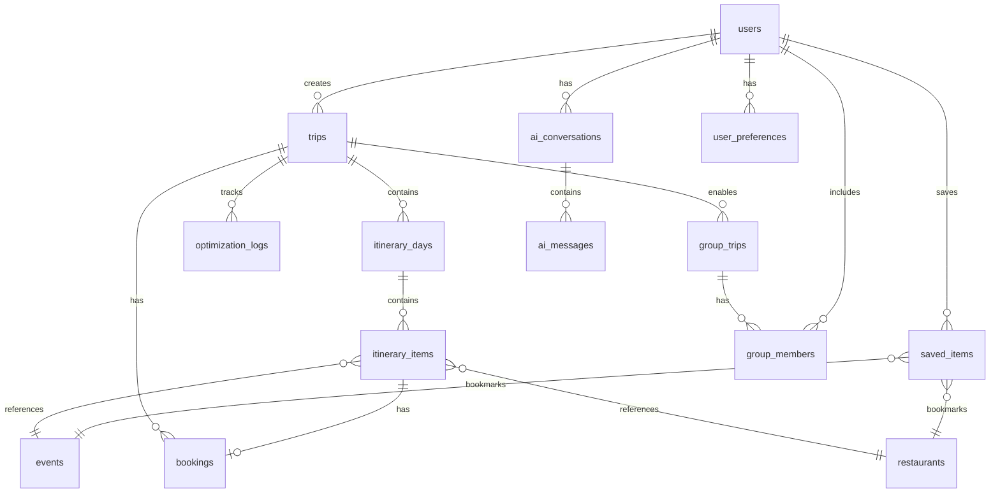
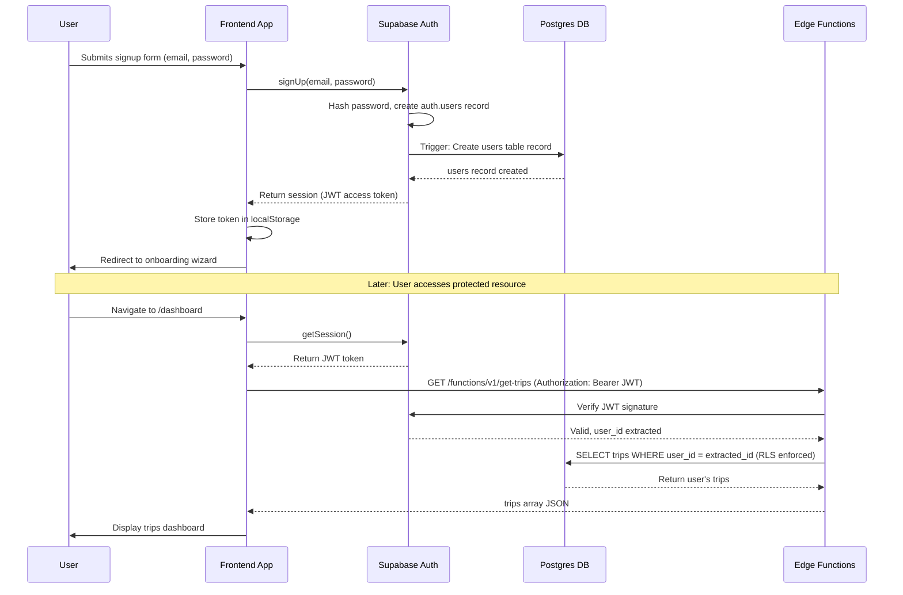

# 04 - Backend Integration with Supabase Implementation Plan

**Feature:** Database, Authentication, Real-Time Sync, Edge Functions  
**Priority:** Critical (Phase 2 - Week 1, Foundation)  
**Owner:** Backend Team + DevOps  
**Stack:** Supabase Postgres, Row Level Security, Edge Functions, Realtime

---

## Progress Tracker

| Phase | Task | Status | Owner | Validation |
|-------|------|--------|-------|-----------|
| **Setup** | Create Supabase project | 🔴 Not Started | DevOps | Project dashboard accessible |
| **Setup** | Configure environment variables | 🔴 Not Started | DevOps | VITE keys in env file |
| **Schema** | Design database schema | 🔴 Not Started | Backend | Fifteen tables created |
| **Security** | Implement RLS policies | 🔴 Not Started | Backend | Users see only their data |
| **Auth** | Add Supabase Auth | 🔴 Not Started | Backend | Login and signup work |
| **Migration** | Migrate from localStorage | 🔴 Not Started | Backend | All data persists correctly |
| **Functions** | Create Edge Functions | 🔴 Not Started | Backend | AI endpoints respond |
| **Testing** | Validate data integrity | 🔴 Not Started | QA | Zero data loss in tests |

---

## 1. Product Goal

**Problem:** Current app uses localStorage - data is lost on browser clear, no multi-device sync, no user accounts.

**Solution:** Implement Supabase backend with Postgres database, user authentication, real-time synchronization, and serverless Edge Functions for AI operations.

**Outcome:** Users can access trips from any device, data persists forever, secure user accounts, collaborative trip planning enabled.

**Success Metric:** Zero data loss incidents, ninety-nine point nine percent uptime, sub-two-hundred-millisecond query response time.

---

## 2. Core Features

### Feature Matrix

| Feature | Type | User Value | Supabase Capability | Status |
|---------|------|-----------|---------------------|--------|
| User Authentication | Core | Secure accounts | Supabase Auth | Not Started |
| Trip Persistence | Core | Never lose data | Postgres database | Not Started |
| Real-Time Sync | Core | Multi-device access | Realtime subscriptions | Not Started |
| Row Level Security | Core | Data privacy | RLS policies | Not Started |
| AI Edge Functions | Core | Secure API calls | Deno Edge Functions | Not Started |
| File Storage | Advanced | Photos and PDFs | Supabase Storage | Not Started |

---

## 3. Database Schema Design

### Core Tables (Fifteen Total)

**Table 1: users**
- Purpose: Store user profiles and preferences
- Columns:
  - id (uuid, primary key, references auth.users)
  - email (text, unique, not null)
  - full_name (text)
  - avatar_url (text, references storage)
  - created_at (timestamp)
  - updated_at (timestamp)
  - preferences (jsonb): dietary restrictions, budget range, interests array
  - onboarding_completed (boolean, default false)

**Table 2: trips**
- Purpose: Main trip entity
- Columns:
  - id (uuid, primary key)
  - user_id (uuid, foreign key to users)
  - title (text, not null)
  - destination_city (text, not null)
  - destination_country (text)
  - start_date (date, not null)
  - end_date (date, not null)
  - budget_total (numeric)
  - budget_spent (numeric, default zero)
  - status (enum: planning, confirmed, in_progress, completed)
  - cover_image_url (text)
  - created_at (timestamp)
  - updated_at (timestamp)

**Table 3: itinerary_days**
- Purpose: Organize trip into days
- Columns:
  - id (uuid, primary key)
  - trip_id (uuid, foreign key to trips)
  - day_number (integer, not null)
  - date (date, not null)
  - title (text): "Day in Comuna 13"
  - notes (text)
  - created_at (timestamp)
- Unique constraint: trip_id and day_number

**Table 4: itinerary_items**
- Purpose: Individual activities, meals, transport
- Columns:
  - id (uuid, primary key)
  - day_id (uuid, foreign key to itinerary_days)
  - type (enum: activity, dining, transport, accommodation, event)
  - title (text, not null)
  - description (text)
  - start_time (time)
  - end_time (time)
  - duration_minutes (integer)
  - location_name (text)
  - location_lat (numeric)
  - location_lng (numeric)
  - address (text)
  - cost (numeric)
  - booking_status (enum: not_booked, pending, confirmed, canceled)
  - booking_reference (text)
  - order_index (integer, for drag-drop sorting)
  - metadata (jsonb): flexible storage for type-specific data
  - created_at (timestamp)
  - updated_at (timestamp)

**Table 5: restaurants**
- Purpose: Cached restaurant data from Google Maps
- Columns:
  - id (uuid, primary key)
  - google_place_id (text, unique, not null)
  - name (text, not null)
  - cuisine_types (text array)
  - price_level (integer, one to four)
  - rating (numeric)
  - address (text)
  - location_lat (numeric)
  - location_lng (numeric)
  - phone (text)
  - website (text)
  - opening_hours (jsonb)
  - photos (text array): URLs to Google Maps photos
  - dietary_options (text array): vegetarian, vegan, gluten_free
  - last_updated (timestamp)
  - created_at (timestamp)

**Table 6: events**
- Purpose: Discovered local events
- Columns:
  - id (uuid, primary key)
  - title (text, not null)
  - description (text)
  - category (enum: music, culture, food, sports, festival)
  - start_datetime (timestamp with time zone, not null)
  - end_datetime (timestamp with time zone)
  - venue_name (text)
  - location_lat (numeric)
  - location_lng (numeric)
  - address (text)
  - price_min (numeric)
  - price_max (numeric)
  - ticket_url (text)
  - source_url (text): original event page
  - confidence_score (numeric): zero to one
  - discovered_at (timestamp)
  - created_at (timestamp)

**Table 7: saved_items**
- Purpose: User bookmarks for restaurants, events, places
- Columns:
  - id (uuid, primary key)
  - user_id (uuid, foreign key to users)
  - item_type (enum: restaurant, event, place)
  - item_id (uuid): references restaurants, events, or places table
  - notes (text)
  - tags (text array)
  - saved_at (timestamp)
- Unique constraint: user_id, item_type, item_id (prevent duplicates)

**Table 8: bookings**
- Purpose: Track reservations and confirmations
- Columns:
  - id (uuid, primary key)
  - trip_id (uuid, foreign key to trips)
  - itinerary_item_id (uuid, foreign key to itinerary_items)
  - booking_type (enum: restaurant, accommodation, activity, transport)
  - provider_name (text): OpenTable, Airbnb, Viator
  - confirmation_number (text)
  - booking_datetime (timestamp)
  - status (enum: pending, confirmed, canceled, completed)
  - cost (numeric)
  - deposit_paid (numeric)
  - cancellation_policy (text)
  - metadata (jsonb)
  - created_at (timestamp)
  - updated_at (timestamp)

**Table 9: ai_conversations**
- Purpose: Store chat history with AI concierge
- Columns:
  - id (uuid, primary key)
  - user_id (uuid, foreign key to users)
  - trip_id (uuid, foreign key to trips, nullable for general queries)
  - title (text): auto-generated from first message
  - created_at (timestamp)
  - updated_at (timestamp)

**Table 10: ai_messages**
- Purpose: Individual messages in conversations
- Columns:
  - id (uuid, primary key)
  - conversation_id (uuid, foreign key to ai_conversations)
  - role (enum: user, assistant, system)
  - content (text, not null)
  - intent (text): dining, itinerary, events, booking
  - metadata (jsonb): structured outputs, function calls
  - created_at (timestamp)

**Table 11: optimization_logs**
- Purpose: Track AI optimization suggestions and user acceptance
- Columns:
  - id (uuid, primary key)
  - trip_id (uuid, foreign key to trips)
  - optimization_type (enum: route, budget, conflict, schedule)
  - suggestions (jsonb): array of suggestion objects
  - suggestions_accepted (integer array): indices of accepted suggestions
  - time_saved_minutes (integer)
  - cost_saved_dollars (numeric)
  - created_at (timestamp)

**Table 12: user_preferences**
- Purpose: Detailed user preferences for AI personalization
- Columns:
  - id (uuid, primary key)
  - user_id (uuid, foreign key to users, unique)
  - dietary_restrictions (text array)
  - cuisine_preferences (text array)
  - activity_pace (enum: relaxed, moderate, fast)
  - budget_level (enum: budget, mid_range, luxury)
  - interests (text array)
  - travel_style (text array): solo, couple, family, group
  - accessibility_needs (text array)
  - created_at (timestamp)
  - updated_at (timestamp)

**Table 13: group_trips**
- Purpose: Enable collaborative trip planning
- Columns:
  - id (uuid, primary key)
  - trip_id (uuid, foreign key to trips)
  - creator_user_id (uuid, foreign key to users)
  - created_at (timestamp)

**Table 14: group_members**
- Purpose: Users participating in group trips
- Columns:
  - id (uuid, primary key)
  - group_trip_id (uuid, foreign key to group_trips)
  - user_id (uuid, foreign key to users)
  - role (enum: owner, editor, viewer)
  - joined_at (timestamp)
- Unique constraint: group_trip_id and user_id

**Table 15: activity_logs**
- Purpose: Audit trail for debugging and analytics
- Columns:
  - id (uuid, primary key)
  - user_id (uuid, foreign key to users)
  - action (text): login, create_trip, book_restaurant
  - resource_type (text): trip, itinerary_item, booking
  - resource_id (uuid)
  - metadata (jsonb)
  - created_at (timestamp)

---

## 4. Row Level Security Policies

### Security Principle: Users can only access their own data

**Policy 1: users table**
- SELECT: Users can read only their own profile
- UPDATE: Users can update only their own profile
- INSERT: New users created via Auth trigger (not directly)
- DELETE: Users can soft-delete (deactivate) their account

**Policy 2: trips table**
- SELECT: User can read trips they created OR trips they are group member of
- INSERT: Authenticated users can create trips
- UPDATE: User can update trips they own
- DELETE: User can delete trips they own

**Policy 3: itinerary_days and itinerary_items**
- SELECT: User can read if they have access to parent trip
- INSERT: User can add items to trips they have editor access to
- UPDATE: User can edit items in trips they have editor access to
- DELETE: User can delete items in trips they own

**Policy 4: saved_items**
- SELECT: User can read only their own saved items
- INSERT: Authenticated users can save items
- UPDATE: User can update their own saved items
- DELETE: User can delete their own saved items

**Policy 5: ai_conversations and ai_messages**
- SELECT: User can read only their own conversations
- INSERT: User can create conversations and messages
- UPDATE: Not allowed (conversations are append-only)
- DELETE: User can delete their own conversations

**Policy 6: Public read tables (no auth required)**
- restaurants: Anyone can read (cached public data)
- events: Anyone can read (public events)

---

## 5. Authentication Implementation

### Supabase Auth Features

**Sign-Up Methods:**
- Email and password (primary)
- Google OAuth (social login)
- Apple OAuth (iOS users)
- Magic link (passwordless email)

**Sign-Up Flow:**
1. User submits email and password via signup form
2. Supabase creates auth.users record
3. Database trigger creates corresponding users table record
4. Email verification sent (optional, can be disabled for MVP)
5. User redirected to onboarding wizard

**Login Flow:**
1. User submits credentials
2. Supabase validates and returns JWT access token
3. Frontend stores token in localStorage (Supabase client handles automatically)
4. Token included in all API requests via Authorization header
5. RLS policies validate token to determine user_id

**Session Management:**
- Access token valid for one hour
- Refresh token valid for thirty days
- Auto-refresh handled by Supabase client
- Logout clears tokens from localStorage

**Protected Routes:**
- Dashboard, Itinerary, Saved Items, Profile require authentication
- Home, How It Works, Explore (browse-only) are public
- Redirect to login page if accessing protected route while logged out

---

## 6. Migration from localStorage to Supabase

### Migration Strategy (Zero Data Loss)

**Phase 1: Read from Both Sources**
- Update TripContext to check Supabase first, fallback to localStorage
- If data exists in localStorage but not Supabase: trigger migration
- Display banner: "Syncing your data to cloud..."

**Phase 2: Write to Both Destinations**
- All create, update, delete operations write to Supabase AND localStorage
- If Supabase write fails: queue for retry (store in IndexedDB)
- Periodic sync job: retry failed writes every five minutes

**Phase 3: Supabase Primary**
- Once migration complete: Supabase becomes source of truth
- localStorage used only as cache for offline access
- Read: Supabase → cache in localStorage
- Write: Supabase → update localStorage cache

**Data Mapping:**

**localStorage trips array maps to trips table:**
- Each trip object becomes one trips row
- Days array becomes multiple itinerary_days rows
- Items array becomes multiple itinerary_items rows

**localStorage saved items array maps to saved_items table:**
- Each saved item gets user_id from current session
- Determine item_type based on object structure

**localStorage chat history maps to ai_conversations and ai_messages:**
- Group messages by session into conversations
- Each message becomes ai_messages row

**Migration Script (runs client-side):**
1. Check if user has localStorage data
2. Prompt: "Found local trips - sync to cloud?"
3. Parse localStorage JSON
4. Transform into database format
5. Batch insert to Supabase (use upsert to handle conflicts)
6. Verify all records created successfully
7. Clear localStorage (keep backup for seven days)
8. Show success message: "Three trips synced successfully"

---

## 7. Edge Functions Architecture

### Why Edge Functions?

**Security:** API keys (Gemini, Google Maps, OpenTable) stored server-side, never exposed to client

**Performance:** Run close to users (global edge network), faster than traditional servers

**Scalability:** Auto-scale based on traffic, no server management

### Edge Function Endpoints

**Function 1: ai-optimize-itinerary**
- Path: /functions/v1/ai-optimize-itinerary
- Method: POST
- Input: trip_id, optimization_type (route, budget, conflict)
- Process:
  - Fetch trip data from Supabase
  - Call Gemini Code Execution API for route optimization
  - Calculate time and cost savings
  - Return suggestions as Structured Output JSON
- Output: suggestions array, overall_improvement object
- Security: Verify user_id from JWT matches trip owner

**Function 2: ai-discover-events**
- Path: /functions/v1/ai-discover-events
- Method: POST
- Input: city, start_date, end_date, user_interests
- Process:
  - Call Gemini Google Search Grounding API
  - Scrape event URLs via URL Context Tool
  - Score events against user interests (Gemini Thinking)
  - Filter by confidence threshold (greater than zero point seven)
  - Store in events table with discovered_at timestamp
- Output: events array with confidence scores
- Caching: Cache results for seven days per city-date combination

**Function 3: ai-chat-handler**
- Path: /functions/v1/ai-chat-handler
- Method: POST
- Input: conversation_id, user_message
- Process:
  - Load conversation history from ai_messages table
  - Detect intent (dining, itinerary, events, booking)
  - Call Gemini API with conversation context
  - If intent requires function call: execute (search restaurants, check availability)
  - Store user message and assistant response in ai_messages
- Output: assistant_message, intent, suggested_actions array
- Rate Limiting: Max ten messages per minute per user

**Function 4: restaurant-search**
- Path: /functions/v1/restaurant-search
- Method: POST
- Input: location, radius, filters (cuisine, price, dietary)
- Process:
  - Call Google Maps Places API
  - Check restaurants table cache first (if last_updated less than seven days ago)
  - If not cached: fetch from API and store in cache
  - Score restaurants using Dining Orchestrator logic
  - Check OpenTable API for availability
- Output: restaurants array with availability and match scores
- Caching: Store results in restaurants table

**Function 5: booking-webhook**
- Path: /functions/v1/booking-webhook
- Method: POST (from OpenTable, Resy, etc.)
- Input: booking_id, status, confirmation_number
- Process:
  - Verify webhook signature (security)
  - Update bookings table with new status
  - Update itinerary_items booking_status
  - Send push notification to user: "Dinner at Carmen confirmed"
- Output: acknowledgment response
- Security: Validate webhook secret from partner

---

## 8. Real-Time Sync Implementation

### Realtime Subscriptions

**Use Case 1: Collaborative Trip Planning**
- Multiple users editing same trip simultaneously
- User A drags activity to new time → User B sees change instantly
- Implementation:
  - Subscribe to changes on itinerary_items where trip_id equals current trip
  - On INSERT/UPDATE/DELETE event: update local state
  - Show indicator: "John just added Comuna 13 tour"

**Use Case 2: Live Booking Confirmations**
- User books restaurant via OpenTable
- Webhook updates bookings table
- User sees confirmation badge appear in real-time without refresh

**Use Case 3: AI Processing Status**
- User triggers itinerary optimization (takes thirty seconds)
- Subscribe to optimization_logs table
- Show progress: "Analyzing routes..." → "Complete - saved forty minutes"

**Subscription Setup (Client-Side):**
1. Create Supabase client with Realtime enabled
2. Subscribe to table: itinerary_items
3. Filter by trip_id (only changes to current trip)
4. Listen for events: INSERT, UPDATE, DELETE
5. On event: update React state (TripContext)
6. Unsubscribe when component unmounts (prevent memory leaks)

**Conflict Resolution:**
- If User A and User B edit same item simultaneously:
  - Last write wins (Supabase default behavior)
  - Show warning: "Someone else edited this item - reloading"
- Future: Implement operational transformation for true collaborative editing

---

## 9. Mermaid Diagrams

### Diagram 1: Database Entity Relationship



---

### Diagram 2: Authentication Flow



---

### Diagram 3: Edge Function Architecture

```mermaid
flowchart TB
    subgraph Client
        React[React App]
    end
    
    subgraph Supabase
        Auth[Supabase Auth]
        DB[(Postgres DB)]
        Storage[Supabase Storage]
        Realtime[Realtime Server]
        
        subgraph Edge Functions
            OptimizeFunc[ai-optimize-itinerary]
            EventsFunc[ai-discover-events]
            ChatFunc[ai-chat-handler]
            RestaurantFunc[restaurant-search]
            WebhookFunc[booking-webhook]
        end
    end
    
    subgraph External APIs
        Gemini[Gemini 3 Pro API]
        Maps[Google Maps API]
        OpenTable[OpenTable API]
    end
    
    React -->|Auth requests| Auth
    React -->|Database queries| DB
    React -->|Subscribe| Realtime
    React -->|Call Edge Functions| Edge Functions
    
    OptimizeFunc -->|AI requests| Gemini
    EventsFunc -->|AI requests| Gemini
    ChatFunc -->|AI requests| Gemini
    RestaurantFunc -->|Place search| Maps
    RestaurantFunc -->|Availability| OpenTable
    
    Edge Functions -->|Read/Write| DB
    Edge Functions -->|Upload files| Storage
    
    OpenTable -->|Webhook| WebhookFunc
    
    DB -->|Changes| Realtime
    Realtime -->|Push updates| React
```

---

## 10. Implementation Prompts (Sequential)

### DevOps Setup Prompts

**Prompt 1: Create Supabase Project**
"Go to Supabase dashboard, create new project named Local Scout Trip OS. Select region closest to primary users (US East for North America, EU West for Europe). Set database password (store securely). Wait for project provisioning (three to five minutes). Copy project URL and anon key to environment variables file."

**Prompt 2: Configure Environment Variables**
"Create dot-env file in project root. Add VITE_SUPABASE_URL equals project URL from dashboard. Add VITE_SUPABASE_ANON_KEY equals anon public key. Add SUPABASE_SERVICE_ROLE_KEY equals service role key (for Edge Functions only, never expose to client). Add VITE_GEMINI_API_KEY for AI features. Verify all keys load correctly by logging in console (then remove logs)."

---

### Cursor AI Backend Prompts

**Prompt 3: Generate Database Schema SQL**
"Write SQL migration file to create all fifteen tables. Include column definitions with data types, primary keys, foreign keys with ON DELETE CASCADE, indexes on frequently queried columns (user_id, trip_id, created_at), unique constraints where needed. Add comments explaining each table purpose. Use uuid_generate_v4 for primary key defaults. Include created_at and updated_at with automatic triggers."

**Prompt 4: Implement Row Level Security**
"Write RLS policies for all tables. Enable RLS on each table using ALTER TABLE statement. Create policies using CREATE POLICY with names like users_select_own. For trips table: users can SELECT trips where user_id equals auth.uid OR exists in group_members. For itinerary_items: check parent trip access via JOIN. For public tables (restaurants, events): allow SELECT to all, restrict INSERT/UPDATE/DELETE to service role only."

**Prompt 5: Create Database Triggers**
"Write trigger function to create users table record when auth.users record created. Use CREATE OR REPLACE FUNCTION and CREATE TRIGGER. Function should insert into users table with id from NEW.id, email from NEW.email, created_at from NOW. Handle conflicts with ON CONFLICT DO NOTHING. Add trigger for updated_at automatic update on all tables with timestamps."

**Prompt 6: Build Supabase Client Wrapper**
"Create utility file /utils/supabase/client.ts. Import createClient from Supabase JS SDK. Export initialized client using environment variables VITE_SUPABASE_URL and VITE_SUPABASE_ANON_KEY. Add helper functions: getUser (returns current authenticated user), signIn, signUp, signOut. Include error handling for network failures, expired tokens."

**Prompt 7: Migrate TripContext to Supabase**
"Refactor TripContext to use Supabase instead of localStorage. Replace useState with Supabase queries: createTrip calls supabase.from trips insert, getTrips calls select, updateTrip calls update, deleteTrip calls delete. Add loading states for async operations. Implement optimistic updates: update local state immediately, rollback if database write fails. Add error handling with user-friendly messages."

**Prompt 8: Implement Realtime Subscriptions**
"Add Realtime subscription to TripContext. When user opens trip details page, subscribe to itinerary_items table changes filtered by current trip_id. Listen for INSERT, UPDATE, DELETE events. On event received: update local state array (add, modify, or remove item). Show toast notification: User X just added activity. Unsubscribe on component unmount to prevent memory leaks."

**Prompt 9: Create Edge Function Template**
"Set up Edge Functions directory structure: /supabase/functions/. Create ai-optimize-itinerary function. Import Supabase client with service role key. Extract user_id from Authorization header JWT. Fetch trip data from database. Call Gemini API with Code Execution for route optimization. Return JSON response with suggestions array. Add error handling: invalid JWT returns four zero one, missing trip_id returns four zero zero, Gemini API timeout returns five zero three."

**Prompt 10: Deploy Edge Functions**
"Install Supabase CLI if not already installed. Run supabase login to authenticate. Navigate to project directory. Run supabase functions deploy ai-optimize-itinerary. Verify deployment in Supabase dashboard under Edge Functions section. Test endpoint using curl or Postman with valid JWT token in Authorization header. Check function logs for errors. Repeat for all five Edge Functions."

---

## 11. Acceptance Tests

**Test 1: User Registration**
- Given: New user submits signup form
- When: Supabase Auth creates auth.users record
- Then: Corresponding users table record created within two seconds via trigger

**Test 2: Row Level Security**
- Given: User A logged in, User B has separate trip
- When: User A queries trips table
- Then: Only User A trips returned, User B trip not visible (RLS enforced)

**Test 3: Real-Time Sync**
- Given: Two browser tabs open for same trip (simulating two users)
- When: Tab one adds itinerary item
- Then: Tab two sees new item appear within one second without page refresh

**Test 4: Edge Function Security**
- Given: Unauthenticated request to Edge Function
- When: No Authorization header provided
- Then: Function returns four zero one Unauthorized error

**Test 5: localStorage Migration**
- Given: User has three trips stored in localStorage
- When: User logs in for first time
- Then: All three trips migrated to Supabase, accessible after login from different device

---

## 12. Production-Ready Checklist

- [ ] All fifteen database tables created with correct schema
- [ ] RLS policies tested: users cannot access others' data
- [ ] Database indexes added to optimize query performance (user_id, trip_id, created_at)
- [ ] Authentication works: signup, login, logout, session refresh
- [ ] Protected routes redirect to login if not authenticated
- [ ] Edge Functions deployed and responding correctly
- [ ] Gemini API key stored server-side only (never in client code)
- [ ] Real-time subscriptions work without memory leaks
- [ ] Error handling covers: network failures, expired tokens, database constraints
- [ ] Backup strategy: daily automated backups enabled in Supabase dashboard
- [ ] Monitoring: set up alerts for Edge Function errors and high database load

---

## 13. Success Criteria

**MVP Launch:**
- Zero data loss during localStorage to Supabase migration
- All database queries respond in under two hundred milliseconds (ninety-fifth percentile)
- Authentication success rate: ninety-nine percent plus (excluding user errors like wrong password)
- RLS policies prevent one hundred percent of unauthorized access attempts

**Production Scale:**
- Database handles ten thousand concurrent users without performance degradation
- Edge Functions auto-scale to handle traffic spikes (concert ticket releases, viral posts)
- Real-time sync latency under one second for ninety-nine percent of events
- Uptime: ninety-nine point nine percent (less than nine hours downtime per year)

---

## Additional Details for Success

### Supabase Project Configuration

**Database Settings:**
- Enable pgvector extension for future AI embeddings (semantic search)
- Set connection pooling: max connections two hundred (adjust based on load testing)
- Enable statement timeout: thirty seconds (prevent runaway queries)
- Configure read replicas for high-traffic production (upgrade from free tier)

**Storage Buckets:**
- Create bucket: trip-photos (for user-uploaded trip images)
- Create bucket: avatars (for user profile pictures)
- Set size limits: five MB per image, max twenty images per trip
- Enable automatic image optimization: resize to max width one thousand two hundred pixels

**Realtime Settings:**
- Enable Realtime for tables: itinerary_items, bookings, ai_messages
- Set max connections per user: five (prevent abuse)
- Configure message size limit: one MB (prevent large payloads)

**Security Best Practices:**
- Rotate service role key every ninety days
- Enable database audit logging for compliance
- Set up IP allowlist for Edge Function access (if needed)
- Use environment-specific projects: dev, staging, production

### Migration Safety Net

**Pre-Migration Checklist:**
- Export all localStorage data to JSON file (backup)
- Test migration script on sample data first
- Display progress bar during migration (prevent user anxiety)
- Allow cancel option if migration takes longer than expected

**Post-Migration Verification:**
- Compare localStorage trip count to Supabase trips table count
- Verify all itinerary items migrated (check counts match)
- Test read operations: load trip details, confirm all data visible
- Keep localStorage backup for seven days (allow rollback if issues found)

### Performance Optimization

**Database Query Optimization:**
- Add composite index on itinerary_items: (day_id, order_index) for fast sorting
- Use SELECT only needed columns (avoid SELECT asterisk)
- Implement pagination: limit twenty-five trips per page, cursor-based for infinite scroll
- Cache frequent queries: user preferences, restaurant data (seven-day TTL)

**Edge Function Optimization:**
- Set timeout: thirty seconds max per function call
- Implement request caching: same search parameters return cached results for five minutes
- Batch operations: if optimizing multiple days, run in parallel not sequential
- Monitor cold starts: pre-warm functions by pinging every five minutes during peak hours

**Realtime Optimization:**
- Debounce rapid updates: if user drags item multiple times, send update only after pause
- Filter events client-side: only process events for currently visible trip
- Throttle notifications: group multiple changes into single toast (avoid spam)

---

**Document Owner:** Backend Team  
**Next Review:** After Phase 2 Week 1 completion (Supabase setup)  
**Dependencies:** Supabase account created, environment variables configured, database schema approved
