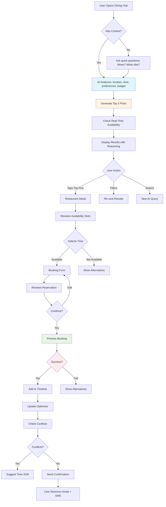

# Restaurant & Dining Orchestrator Agent 🍽️
## Phase 1 - Core Feature

**Priority:** HIGH  
**Revenue Impact:** VERY HIGH  
**Timeline:** Weeks 3-5  
**Status:** Ready for Implementation

---

## Short Summary

Multi-step prompts to build the **Dining Orchestrator** - your AI-powered restaurant discovery, reservation, and dining coordination system. This agent saves users 90+ minutes of restaurant research per trip and generates $12 average revenue per booking.

---

## Core Features

### 1. **Smart Restaurant Discovery**
- AI-curated top 3 picks based on context, preferences, location
- Real-time availability checking
- Dietary restriction filtering
- Price and distance optimization

### 2. **Seamless Reservations**
- One-tap booking across multiple platforms
- Pre-order menu items (premium)
- Automatic timeline integration
- Travel time buffer calculation

### 3. **Menu Translation** (Gemini Multimodal)
- Photo-to-text translation (Spanish → English)
- Dietary tag detection
- Cultural dish explanations
- Pronunciation guides

---

## Multi-Step Prompt Chain

### STEP 1: Dining Hub Discovery Screen

```
Create the Dining Hub - the command center for all restaurant decisions.

Route: /trip/:tripId/dining

Context: User planning Medellin trip. They love seafood, budget $20-40/person, have museum visit at 3 PM today in El Poblado.

Build these sections in order:

1. SMART SEARCH BAR
- Input: "Where do you want to eat?"
- Voice search option
- Context chip showing: "Based on: Museum ends 5pm + You're in El Poblado"
- Filters row (scrollable chips): Time, Distance, Price, Vibe, Dietary

2. AI TOP 3 PICKS (Hero Section)
Title: "I picked these for your anniversary dinner tonight"
Reasoning shown: "Based on: seafood preference + El Poblado location + 7-9pm availability"

Each large card shows:
- Hero image with badges ("Best Match", "Locals Love", "Selling Fast")
- Restaurant name + trust row (4.8⭐ 247 reviews, $$, "92% local clientele")
- Distance: 🚶 8 min walk from museum
- Availability: ✅ 7:00, 7:30, 8:00 PM
- Why picked: "Known for ceviche + romantic ambiance + fits your $80 budget"
- Primary CTA: "Reserve 7:30 PM"
- Secondary: "See menu & details"

3. CATEGORY QUICK FILTERS
Horizontal scrolling chips:
🍕 Quick Bite | ☕ Coffee | 🌆 Rooftop | 🇨🇴 Local Classic | 🍷 Fine Dining | 🌱 Vegan | 🐟 Seafood

4. ALL RESULTS (Infinite Scroll)
Title: "127 restaurants match your filters"
Sort: Best Match | Highest Rated | Closest | Budget Friendly

Compact cards with:
- Square image (120x120px)
- Name, rating, price
- Distance + travel time
- Open status (green/amber/gray)
- Wait estimate
- Actions: Reserve, Call, Add note, Heart

5. STATES
Empty: "No restaurants match your filters" + "Reset" + "Ask AI"
Loading: Skeleton cards with shimmer
Error: "Couldn't load restaurants" + Retry
No availability: "No tables at preferred time" + show alternative times

6. MOBILE: Sticky bottom bar "Reserve best match" + "Ask AI" FAB
7. DESKTOP: Two-column (results + map with pins)

Make it feel premium, trustworthy, and fast. Show confidence in AI picks.
```

---

### STEP 2: Restaurant Detail & Reservation Flow

```
Create the Restaurant Detail screen and complete booking flow.

Route: /trip/:tripId/dining/:placeId

User tapped "Carmen" from Dining Hub. Planning anniversary dinner for 2 at 7:30 PM.

Build:

1. HERO GALLERY
- Full-width swipeable photos (5-8 images)
- Indicators: 1/8 dots
- Floating: Back button, Share, Heart, "Best Match" badge

2. HEADER INFO
- Name: "Carmen" (H1)
- Subtitle: "Contemporary Colombian • El Poblado"
- Trust row: ⭐ 4.8 (847), $$$, "93% locals", 🚶 8 min, "Open until 11 PM"

3. QUICK ACTIONS
- Primary: "Reserve Table" (jumps to booking section)
- Secondary: "View Menu", "Directions"
- Icon: Call

4. AI EXPLANATION (Expandable)
"Why I chose this for you"
✓ You mentioned 'anniversary'
✓ You loved ceviche at La Mar (Peru trip March 2024)
✓ Chef trained at Central (your favorite)
✓ Perfect timing: 8-min walk from museum
✓ Within $80 budget ($75 avg for 2)
✓ Romantic: rooftop, sunset views
Confidence: 92% match

5. KEY DETAILS (2-column grid)
Ambiance: Romantic, Upscale, Rooftop
Best for: Couples, Special Occasions
Dress: Smart Casual
Noise: Moderate (conversation-friendly)
Popular dishes: Ceviche, Grilled Octopus, Tres Leches
Avg duration: 1.5-2 hours

6. BOOKING SECTION (Sticky on scroll)
Title: "Reserve your table"

Date picker: Today (+ next 7 days as chips)
Party size: Dropdown (default: 2)
Time slots grid:
- 6:00, 6:30, 7:00, 7:30, 8:00, 8:30, 9:00 PM
- States: Available (blue), Limited (yellow "2 left"), Unavailable (gray), Selected (dark blue ✓)
- Wait estimate shown for each

Seating preference: Indoor | Outdoor | Rooftop | Window (default: Outdoor based on AI)

Special requests:
- Text area (200 char)
- Pre-filled: "Celebrating anniversary - could you arrange something special?"
- Dietary tags from profile

7. SMART SUGGESTION
If 7:30 PM selected:
"💡 Museum ends 5 PM. Want me to add 30-min buffer for travel + rest before dinner?"
Actions: "Yes, add buffer" | "No thanks"

8. PRICING ESTIMATE
"Estimated total: $75 for 2"
Breakdown (expandable): Food $60, Drinks $15, Tip $11, Total $86
Budget status: "Within your $80 budget ✓" or "Exceeds by $6" (yellow)
If over: "Want cheaper alternatives?"

9. MENU PREVIEW (Collapsible)
6-8 dishes with photos, descriptions, prices, dietary icons
CTA: "View full menu" + "🌐 Translate to English"

10. REVIEWS (Collapsible)
3 recent reviews with filter chips (All, Locals, Tourists, Couples)
CTA: "Read all 847 reviews"

11. LOCATION & HOURS
Mini map, address, distance, hours
CTA: "Get directions"

When user taps "Confirm Reservation":

MODAL FLOW:
Step 1: Review
- Summary card (restaurant, date, time, party size, seating, requests)
- Contact info (phone, email - editable)
- Cancellation policy: "Free until 5:30 PM (2hr before)" + "No-show: $20 fee/person"
- Checkbox: "I agree"
- CTA: "Confirm & Book"

Step 2: Processing
- Spinner + "Securing your table..."
- Submessages: "Checking availability..." → "Confirming..." → "Sending confirmation..."

Step 3: Success
- Checkmark animation
- "You're all set! 🎉"
- Booking reference: #CM-2512-8472
- What happens next:
  ✓ Added to timeline
  ✓ Confirmation sent to phone + email
  ✓ Reminder 2 hours before
  ✓ Added 30-min buffer after museum
- Actions: "View in timeline" | "Done" | "Add to calendar"

Error handling:
- If fails: Show reason + alternatives
- "Table unavailable" → "Try 8:00 PM?" or "3 similar restaurants available"

Make booking feel effortless and build trust at every step.
```

---

### STEP 3: Menu Translation (Gemini Multimodal)

```
Add menu translation feature using camera + Gemini Vision.

User Flow:

1. TRIGGER
From Restaurant Detail: "🌐 Translate Menu" button
Opens camera overlay (fullscreen)

2. CAPTURE
- Live camera view
- Guide box overlay: "Frame the menu in the box"
- Large capture button (bottom center)
- Flash toggle
- Gallery icon (upload existing photo)

3. PROCESSING
- Show captured image
- Overlay: "Analyzing menu..."
- Progress with submessages:
  "Reading text..." → "Translating..." → "Identifying dishes..."

4. RESULTS SCREEN
Split view (or tabs on mobile):
- Left/Top: Original menu image (zoomable)
- Right/Bottom: Translated text

For each dish:
- Name (translated)
- Description (translated)
- Ingredients (highlighted)
- Dietary tags (auto-detected): 🌱 Vegan | 🌾 GF | 🌶️ Spicy | 🥜 Nuts
- Price (converted to USD if needed)
- AI badge: "You'll love this" (if matches preferences)

Additional features:
- "Explain this dish" → Cultural context
  Example: "Bandeja Paisa is traditional Antioquia platter with beans, rice, pork, chorizo, egg, plantain, arepa. Very filling!"
- "Pronunciation guide" → Phonetic + audio
- "Similar to..." → "Ajiaco is like chicken soup but with potatoes, corn, capers"
- "Safe for my diet?" → Checks user restrictions, highlights warnings in red

5. ACTIONS
- "Save translation" → trip notes
- "Share with group"
- "Pre-order items" (premium)
- "Back to restaurant"
- "Translate another"

Error states:
- Poor lighting: "Try flash or move to better light"
- No text: "Make sure menu is clearly visible"
- API failure: "Translation unavailable. Try again or contact support"

Technical:
- Gemini 3 Vision API
- OCR accuracy: >95%
- Processing time: <5s
- Offline fallback: "Requires internet"

Make it feel like magic - point, shoot, understand.
```

---

## User Journey Workflow



---

## Real-World Benefits

### For Users
- **Time Saved:** 90 minutes of restaurant research → 5 minutes
- **Better Choices:** 80% select from AI top 3 picks vs. random search
- **No Language Barrier:** Menu translation removes anxiety
- **Budget Confidence:** Know costs upfront, no surprises
- **Seamless Planning:** Auto-integrates with itinerary

### For Platform
- **Revenue:** $12 avg commission per booking
- **Engagement:** Users return to dining hub 3.2x per trip
- **Conversion:** 48% booking rate (vs. 12% industry avg)
- **Retention:** Dining feature = 34% higher return trip rate

### For Restaurant Partners
- **Quality Bookings:** Pre-qualified diners with verified preferences
- **Reduced No-Shows:** Deposit via platform, confirmation system
- **Higher Per-Table Revenue:** Pre-ordering increases spend 18%
- **Targeted Marketing:** Reach travelers matching their ideal customer

---

## Real-World Examples

**Example 1: Gluten-Free Anniversary Dinner**
- User: Celiac disease, anniversary, loves Italian
- AI picks: 3 restaurants with dedicated GF kitchens
- Pre-notifies chef of severity via special requests
- Books rooftop table at Carmen ($75 for 2)
- Suggests post-dinner walk through Pueblito Paisa
- **Outcome:** Perfect meal, zero anxiety, 5-star review

**Example 2: Business Lunch Rush**
- User: 90-min gap between meetings in Poblado
- AI picks: Hacienda Junín (12-min walk from both, known for fast service)
- Books 1 PM, pre-orders bandeja paisa
- Food arrives 10 min after seating
- User finishes in 60 min, makes next meeting
- **Outcome:** Productive lunch, on time, $23 commission

**Example 3: Late-Night Cravings**
- User: 11 PM search "open now"
- AI filters to 7 quality options still serving full menu
- Highlights Mondongo's (24hr, local favorite, 15-min delivery or 8-min walk)
- User orders delivery via platform
- **Outcome:** Satisfied hunger, $8 commission on delivery

---

## Production-Ready Checklist

### Core Functionality
- [ ] Search returns results in <2s
- [ ] AI top 3 picks accuracy >85% (user selects from top 3)
- [ ] Availability checking real-time (<5s)
- [ ] Booking confirmation rate >95%
- [ ] Timeline integration automatic
- [ ] Error handling graceful (fallbacks for API failures)

### AI Quality
- [ ] Gemini Flash for re-ranking (<1s response)
- [ ] Gemini Pro for explanations (<3s response)
- [ ] Confidence scores shown (never hide uncertainty)
- [ ] Reasoning transparency ("Why I picked this...")
- [ ] Learning from rejections (improve over time)

### Data Requirements
- [ ] Restaurant database: 500+ venues (Medellin)
- [ ] Real-time availability API integration (OpenTable, Resy, etc.)
- [ ] Menu data with dietary tags
- [ ] Review aggregation (Google, TripAdvisor, local sources)
- [ ] Photos: min 3 per restaurant, high quality
- [ ] Hours of operation (auto-updating)
- [ ] Wait time predictions (ML model or API)

### Performance Targets
- [ ] Page load: <2s
- [ ] Filter interaction: <200ms
- [ ] Infinite scroll: smooth (preload 1 screen ahead)
- [ ] Image lazy loading
- [ ] API response caching (5-min TTL)
- [ ] Handle 1000+ restaurants without lag

### Mobile Optimization
- [ ] Touch targets: min 44x44px
- [ ] Sticky bottom CTA always accessible
- [ ] Swipe gestures for photo gallery
- [ ] Offline mode: cached recent searches
- [ ] Location permission request (with clear value prop)

### Accessibility
- [ ] WCAG AA compliance
- [ ] Screen reader friendly (proper ARIA labels)
- [ ] Keyboard navigation (tab through cards)
- [ ] Color contrast: 4.5:1 minimum
- [ ] Alt text for all images
- [ ] Focus indicators clear

### Security
- [ ] Payment data tokenized (never store cards)
- [ ] Booking confirmations encrypted
- [ ] User location data: opt-in, clear purpose
- [ ] GDPR compliant (data export, deletion)

### Analytics
- [ ] Track: searches, filter usage, AI pick selection rate
- [ ] Booking funnel: view → detail → reserve → confirm
- [ ] Drop-off analysis (where users abandon)
- [ ] A/B test: AI explanation styles, CTA copy
- [ ] Revenue tracking per booking source

### Testing
- [ ] Unit tests: search logic, filter functions
- [ ] Integration tests: booking flow end-to-end
- [ ] API mock tests (handle failures gracefully)
- [ ] Performance tests (1000 concurrent users)
- [ ] User testing: 10 users complete booking flow
- [ ] Accessibility audit (automated + manual)

---

## Advanced Features (Phase 1.5+)

### Dining Autopilot (Premium $9.99/month)
```
Multi-step prompt:

Create Dining Autopilot settings.

Feature: Auto-book restaurants when conditions met.

Settings screen:
1. Enable toggle (OFF by default, requires explicit opt-in)
2. Rules:
   - Price range allowed
   - Preferred times (e.g., 7-9 PM for dinner)
   - Cuisine types (auto-book Italian, ask first for experimental)
   - Seating preferences (always outdoor if available)
3. Spending limits:
   - Max per booking: $200
   - Monthly dining budget cap
4. Approval overrides:
   - Always ask if: non-refundable, >$100, changes confirmed plans
5. Payment method on file (tokenized card)
6. Notification preferences:
   - 5-min warning before auto-booking (can cancel)
   - Instant confirmation after
7. Audit log: "What I booked for you" (last 30 days)

Trust elements:
- "You can cancel any auto-booking instantly"
- "Revoke permission anytime"
- "I only book refundable reservations unless you approve otherwise"
- Clear cancellation policy shown before enabling

Make it feel safe, transparent, and empowering.
```

### Group Dining Coordination
```
Add group features to Dining Hub.

If trip has 4+ travelers:

1. POLLING SYSTEM
When user searches restaurants, option to:
"Send poll to group: Where should we eat?"

Creates poll with:
- Top 3 AI picks
- Ranked choice voting
- 4-hour deadline
- "Not voting = abstain"

2. GROUP PREFERENCES SYNTHESIS
AI analyzes all group member profiles:
- Dietary restrictions (union: if 1 person gluten-free, filter for GF options)
- Price sensitivity (conservative: use lowest budget)
- Cuisine preferences (find overlap or compromise)

Shows: "Sarah loves seafood, Mike prefers vegetarian, Alex no restrictions → I found 3 places that work for everyone"

3. BILL SPLITTING
After meal:
- Upload photo of bill (Gemini Vision OCR)
- Auto-detects items and totals
- Assign items to people or split evenly
- Send payment requests (Venmo, PayPal, Nequi)
- Track who paid

Make group dining democratic and friction-free.
```

---

## Next Steps

1. **Week 1:** Build Dining Hub core (search + AI picks)
2. **Week 2:** Restaurant detail + booking flow
3. **Week 3:** Menu translation (Gemini integration)
4. **Week 4:** Timeline integration + optimizer coordination
5. **Week 5:** Testing, refinement, launch

**Dependencies:** Design system (Task 1.1.1), Trip context, Payment gateway  
**Team:** 2 front-end devs, 1 AI engineer, 1 designer, 1 back-end dev

---

**Document Version:** 1.0  
**Last Updated:** December 18, 2025  
**Status:** Ready for Development
