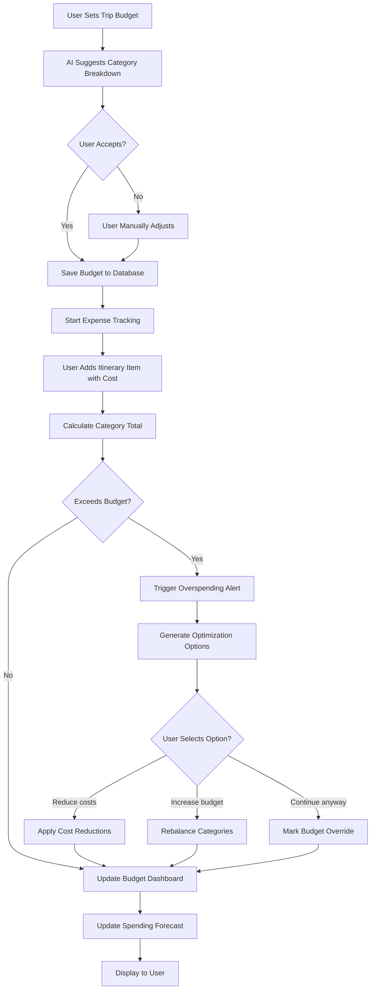
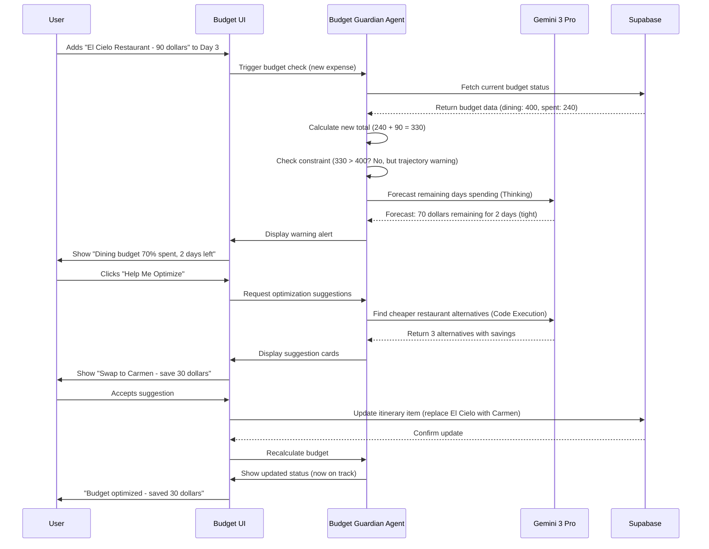
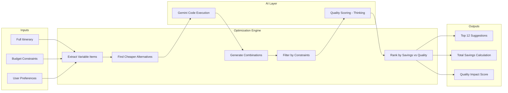

# 05 - Budget Guardian Agent Implementation Plan

**Feature:** Intelligent Budget Tracking, Forecasting, and Optimization  
**Priority:** Medium (Phase 3 - Week 1-2)  
**Owner:** AI Team + Finance Team  
**Gemini Features:** Gemini Thinking, Code Execution, Structured Outputs

---

## Progress Tracker

| Phase | Task | Status | Owner | Validation |
|-------|------|--------|-------|-----------|
| **Design** | Budget dashboard UI | 🔴 Not Started | Figma Make | Charts and alerts designed |
| **Design** | Spending tracker cards | 🔴 Not Started | Figma Make | Real-time budget bar complete |
| **AI** | Build forecasting model | 🔴 Not Started | Cursor AI | Predicts spending accuracy eighty percent plus |
| **AI** | Create alert system | 🔴 Not Started | Cursor AI | Warns before overspending |
| **Backend** | Transaction logging | 🔴 Not Started | Cursor AI | All costs saved to database |
| **Integration** | Connect to bookings | 🔴 Not Started | Cursor AI | Bookings auto-update budget |
| **Testing** | Validate budget math | 🔴 Not Started | QA | Zero calculation errors |

---

## 1. Product Goal

**Problem:** Travelers overspend by average of thirty-five percent because they lose track of expenses, underestimate costs, and make emotional purchasing decisions.

**Solution:** AI tracks every trip expense in real-time, forecasts remaining budget needs, alerts before overspending, and suggests cost-saving alternatives.

**Outcome:** Users stay within budget, avoid financial stress, make informed spending decisions.

**Success Metric:** Eighty percent of users stay within ten percent of planned budget.

---

## 2. Core Features

### Feature Matrix

| Feature | Type | User Value | Gemini Capability | Status |
|---------|------|-----------|-------------------|--------|
| Expense Tracking | Core | Know where money goes | Structured Outputs (categorization) | Not Started |
| Budget Forecasting | Core | Predict future costs | Code Execution (statistical models) | Not Started |
| Overspending Alerts | Core | Prevent budget blow | Gemini Thinking (spending patterns) | Not Started |
| Cost Optimization | Advanced | Find cheaper alternatives | Gemini Thinking (value analysis) | Not Started |
| Currency Conversion | Advanced | Handle multiple currencies | Code Execution (real-time rates) | Not Started |
| Group Expense Splitting | Advanced | Fair cost division | Code Execution (split algorithms) | Not Started |

---

## 3. User Journeys

### Journey 1: First-Time User - Set Trip Budget

**Entry Point:** User creates new trip, prompted for budget

**Flow:**
1. Trip creation wizard asks: "What's your total budget for this trip?"
2. User enters: "Eight hundred dollars"
3. AI asks follow-up: "Does this include flights and accommodation?"
4. User selects: "No, just activities and dining"
5. Agent analyzes destination (Medellín) and duration (five days)
6. Shows comparison: "Average traveler spends nine hundred to one thousand two hundred dollars for similar trip"
7. Warning: "Your budget is fifteen percent below average - I'll help you optimize"
8. Breakdown suggestion:
   - Dining: four hundred dollars (fifty percent)
   - Activities: three hundred dollars (thirty-seven percent)
   - Transport: one hundred dollars (thirteen percent)
9. User accepts or adjusts breakdown
10. Budget saved, tracking begins

**AI Actions:**
- Query historical data: average spending for Medellín five-day trips
- Use Gemini Thinking: "User budget below average suggests budget-conscious preferences"
- Code Execution: calculate daily budget (eight hundred divided by five equals one hundred sixty dollars per day)
- Structured Outputs: return budget breakdown JSON with categories

**Outcome:** Realistic budget set with AI guidance, user aware of constraints.

---

### Journey 2: Returning User - Budget Alert Triggered

**Entry Point:** User books expensive restaurant, pushes dining budget over limit

**Flow:**
1. User adds "El Cielo - ninety dollars per person" to Day 3 dinner
2. System calculates: dining budget four hundred dollars, spent two hundred forty dollars (Days 1-2), this meal ninety dollars equals total three hundred thirty dollars
3. Remaining budget: seventy dollars for two more days of dining
4. Alert appears: "Warning: Dining budget seventy percent spent, two days remaining"
5. User clicks "See Options"
6. Agent presents choices:
   - Option A: Keep El Cielo, reduce next two days to thirty-five dollars per day (budget meals)
   - Option B: Swap El Cielo for mid-range alternative (save forty dollars)
   - Option C: Increase total budget by fifty dollars (add from activities category)
7. User selects Option B
8. Agent suggests: "Carmen - sixty dollars, similar quality, one point five km away"
9. User swaps reservation, budget back on track

**AI Actions:**
- Real-time budget calculation as items added
- Detect overspending: current category trajectory exceeds allocated budget
- Gemini Thinking: analyze trade-offs ("User values dining, but budget limited - suggest quality alternative not cheap fast food")
- Generate three ranked options (least disruptive to most cost-saving)

**Outcome:** Overspending prevented, user makes informed choice, stays within budget.

---

### Journey 3: Power User - Full Trip Budget Optimization

**Entry Point:** User has planned trip but wants to maximize value within budget

**Flow:**
1. User clicks "Optimize Budget" from budget dashboard
2. Agent analyzes full itinerary: fifteen dining reservations, eight activities, transport estimates
3. Current total: nine hundred forty dollars (exceeds eight hundred dollar budget by one hundred forty dollars)
4. Processing modal: "Finding cost-saving opportunities..."
5. Results screen shows:
   - Identified savings: one hundred sixty dollars possible
   - Twelve optimization suggestions:
     - Swap two expensive restaurants for local equivalents (save seventy dollars)
     - Combine Comuna 13 tour plus Guatapé in single full-day package (save forty dollars)
     - Use metro instead of Uber for four trips (save twenty-five dollars)
     - Visit free museum on Thursday (free admission day) vs. paid Sunday (save fifteen dollars)
     - Book coffee tour as group (six people) vs. individual (save ten dollars)
6. Impact preview: "Accept all suggestions: total seven hundred eighty dollars (twenty dollars under budget)"
7. User reviews, accepts ten suggestions, rejects two
8. Savings: one hundred twenty-five dollars
9. Final budget: eight hundred fifteen dollars (fifteen dollars over, acceptable)
10. Agent creates optimized itinerary with cost-conscious choices

**AI Actions:**
- Code Execution: simulate all possible cost-reduction combinations
- Gemini Thinking: preserve trip quality ("Don't suggest removing Carmen dinner - user marked as must-do")
- Constraint satisfaction: honor locked items, dietary needs, timing preferences
- Generate explanations: "Free museum Thursday visit has shorter lines plus saves money"

**Outcome:** User stays within budget without sacrificing trip quality.

---

## 4. UI/UX Screens

### Screen A: Budget Dashboard Overview

**Purpose:** Show real-time budget status at-a-glance

**Sections:**
- Header: "Trip Budget - Five Days in Medellín"
- Total budget card:
  - Large number: "Eight hundred dollars"
  - Spent: "Four hundred twenty dollars" (green if under, amber if approaching, red if over)
  - Remaining: "Three hundred eighty dollars"
  - Progress bar (visual: fifty-two percent spent)
- Daily budget indicator:
  - "Today's budget: One hundred sixty dollars"
  - "Spent so far: Eighty-five dollars"
  - Status: "On track" (green checkmark)
- Category breakdown (pie chart or stacked bar):
  - Dining: "Two hundred dollars of four hundred dollars" (fifty percent)
  - Activities: "One hundred fifty dollars of three hundred dollars" (fifty percent)
  - Transport: "Seventy dollars of one hundred dollars" (seventy percent, amber warning)
- Forecast section:
  - "At current pace, you'll spend: Eight hundred sixty dollars"
  - "Over budget by: Sixty dollars"
  - "Confidence: Eighty-five percent"
- Quick actions:
  - "Optimize Budget" button
  - "Adjust Total Budget" link
  - "View All Transactions" link

**AI Feature:** Real-time forecasting via Code Execution, spending pattern analysis via Gemini Thinking

**Next Screen:** Detailed category view or optimization suggestions

---

### Screen B: Transaction Log (Itemized Expenses)

**Purpose:** Show every expense with details

**Sections:**
- Filters: Category (All, Dining, Activities, Transport), Date range, Status (Planned, Confirmed, Paid)
- Sort: Date (default), Amount (high to low), Category
- Transaction cards (grouped by day):
  - Day 1 - January 14
    - Breakfast at Pergamino - fifteen dollars (Paid)
    - Comuna 13 Tour - thirty-five dollars (Confirmed)
    - Lunch at Local Cafe - twelve dollars (Planned)
    - Uber to hotel - eight dollars (Paid)
  - Day 2 - January 15
    - (continues)
- Each card shows:
  - Time (if available)
  - Item name
  - Category badge
  - Amount with currency
  - Status (Paid green, Confirmed amber, Planned gray)
  - Edit/Delete icons (for manual entries)
- Bottom summary: "Total logged: Four hundred twenty dollars across twenty-three transactions"

**AI Feature:** Auto-categorization of expenses using Structured Outputs

**Next Screen:** Edit transaction form or category details

---

### Screen C: Budget Alert Modal

**Purpose:** Warn user when approaching or exceeding budget limits

**Trigger:** Automatically appears when category reaches eighty percent or overspending detected

**Content:**
- Alert icon (amber triangle for warning, red circle for critical)
- Title: "Dining Budget Alert"
- Problem statement: "You've spent seventy percent of your dining budget with two days remaining"
- Visual: Mini bar chart showing budget progress
- Impact forecast: "At current pace, you'll overspend by sixty dollars"
- Options section (three cards):
  - Option 1: "Reduce remaining meals to thirty-five dollars per day" (Recommended)
  - Option 2: "Increase dining budget by fifty dollars (take from activities)"
  - Option 3: "Continue as planned (will exceed total budget)"
- Each option shows:
  - Impact on total budget
  - Pros and cons
  - Difficulty level (Easy, Moderate, Difficult)
- Primary CTA: "Help Me Optimize" (opens optimization flow)
- Secondary: "I'll Handle It" (dismisses alert)

**AI Feature:** Gemini Thinking generates options ranked by feasibility

**Next Screen:** Optimization suggestions or dismissed

---

### Screen D: Cost Optimization Results

**Purpose:** Present budget-saving recommendations

**Sections:**
- Header: "I Found Twelve Ways to Save One Hundred Sixty Dollars"
- Summary card:
  - Current total: "Nine hundred forty dollars"
  - After optimization: "Seven hundred eighty dollars"
  - Savings: "One hundred sixty dollars (seventeen percent)"
- Suggestion cards (scrollable list):
  - Card 1:
    - Type badge: "Restaurant Swap"
    - Change: "Swap El Cielo (ninety dollars) → Carmen (sixty dollars)"
    - Savings: "Thirty dollars"
    - Impact: "Similar quality, same neighborhood"
    - Confidence: "Ninety-two percent match"
    - Actions: "Accept" | "Reject" | "See Alternative"
  - Card 2:
    - Type badge: "Activity Bundle"
    - Change: "Combine Comuna 13 plus Guatapé tours (package deal)"
    - Savings: "Forty dollars"
    - Impact: "Same experiences, one guide, shared transport"
    - (continues for all suggestions)
- Category filter: Show only dining suggestions, activities, transport
- Bottom actions:
  - "Accept All" (primary button)
  - "Review Individual" (secondary)
  - "Cancel" (ghost button)

**AI Feature:** Code Execution calculates optimal combinations, Structured Outputs formats suggestions

**Next Screen:** Updated itinerary with accepted changes applied

---

## 5. AI Agent Architecture

### Agent Name: Budget Guardian

**Trigger:** User sets budget OR adds expense OR daily check (9 AM local time)

**Inputs:**
- Total trip budget (numeric)
- Budget breakdown by category (dining, activities, transport percentages)
- Current itinerary with all planned expenses
- Confirmed bookings with costs
- Historical spending data (if returning user)
- User preferences: budget priority (strict vs flexible)

**Gemini Functions Used:**

1. **Code Execution:**
   - Calculate daily budget: total divided by number of days
   - Forecast remaining spend: linear regression on Days 1-3 to predict Days 4-5
   - Simulate optimization scenarios: if swap Item A for Item B, new total equals X
   - Currency conversion: real-time rates via exchange rate API
   - Split expenses: divide group costs by number of people (handle unequal splits)

2. **Gemini Thinking:**
   - Analyze spending patterns: "User consistently overspends on dining, underspends on activities - suggests foodie preferences"
   - Reason about trade-offs: "Swapping this restaurant loses ambiance value, suggest only if budget critical"
   - Detect anomalies: "Transport cost doubled today - check if user took expensive taxi vs metro"
   - Generate context-aware alerts: "You're over budget, but Day 5 is mostly free activities - you'll balance out"

3. **Structured Outputs:**
   - Return budget status JSON:
     ```
     {
       "total_budget": 800,
       "total_spent": 420,
       "total_remaining": 380,
       "forecast": {
         "predicted_total": 860,
         "confidence": 0.85,
         "over_budget": 60
       },
       "category_breakdown": [
         {
           "name": "Dining",
           "budgeted": 400,
           "spent": 240,
           "remaining": 160,
           "percent_spent": 60,
           "status": "on_track"
         }
       ],
       "alerts": [
         {
           "severity": "warning",
           "category": "Transport",
           "message": "Transport budget seventy percent spent with three days remaining"
         }
       ]
     }
     ```

4. **Optimization Algorithm (Code Execution):**
   - Input: itinerary items with costs, total budget constraint
   - Process:
     - Identify all variable-cost items (swappable restaurants, optional activities)
     - For each item: find cheaper alternatives with quality score above threshold
     - Calculate all possible swap combinations (combinatorial optimization)
     - Filter combinations that meet budget constraint
     - Rank by minimal quality degradation
   - Output: top twelve suggestions with savings and impact scores

**Outputs:**
- Real-time budget status (spent, remaining, forecast)
- Alerts array (warnings, critical overspending)
- Optimization suggestions with savings calculations
- Explanations for each recommendation

---

## 6. Workflows

### Workflow A: Simple - Daily Budget Check

**User Action:** User wakes up Day 3 of trip, opens app

**Screens:** Dashboard → Budget Widget shows daily update

**AI Reasoning:**
1. Scheduled job runs at 9 AM local time (triggered by user timezone)
2. Calculate yesterday's spending: sum all Day 2 expenses
3. Compare to daily budget: actual vs planned
4. Update forecast: incorporate Days 1-2 actual data
5. If overspent: generate alert with suggestions
6. If underspent: show encouraging message ("You're twenty dollars under budget - treat yourself!")

**Tools Used:** Code Execution (calculations), Structured Outputs (status JSON)

**Result:** User sees personalized budget update without manual checking.

---

### Workflow B: Medium - Overspending Prevention

**User Action:** Adds expensive activity that exceeds category budget

**Screens:** Itinerary Feed → Budget Alert Modal → Options Screen

**AI Reasoning:**
1. User adds "Paragliding - one hundred twenty dollars" to Day 4
2. System calculates: activities budget three hundred dollars, spent one hundred eighty dollars, this item one hundred twenty dollars equals total three hundred dollars
3. Remaining days have two planned activities totaling fifty dollars
4. Forecast: three hundred fifty dollars total (over three hundred dollars budget)
5. Trigger alert: "Activities budget will exceed by fifty dollars"
6. Gemini Thinking: analyze alternatives
   - Find cheaper paragliding option (group discount: ninety dollars)
   - Suggest removing optional museum visit (save fifteen dollars)
   - Propose increasing activities budget (take from dining surplus)
7. Present three options ranked by least disruptive

**Tools Used:** Real-time budget calculation, Gemini Thinking (options generation)

**Result:** User makes informed decision before booking, avoids surprise overspending.

---

### Workflow C: Complex - Full Trip Budget Optimization

**User Action:** Clicks "Optimize My Budget" after planning complete trip

**Screens:** Budget Dashboard → Processing Modal → Optimization Results

**AI Reasoning:**
1. Load full itinerary: all dining, activities, transport items with costs
2. Current total: nine hundred forty dollars (exceeds eight hundred dollar budget by one hundred forty dollars)
3. Identify constraints:
   - Locked items: Carmen dinner (user marked must-do)
   - Fixed costs: Guatapé tour (non-refundable deposit paid)
   - Dietary needs: gluten-free options required (limits restaurant swaps)
4. Generate swap candidates:
   - For each restaurant: find alternatives within one km, same cuisine style, twenty to forty percent cheaper
   - For each activity: check group discount availability, combo packages
   - For transport: identify metro-accessible routes vs Uber
5. Code Execution: run optimization algorithm
   - Calculate all swap combinations (factorial complexity)
   - Filter by constraints (preserve quality, honor dietary needs)
   - Rank by total savings vs quality impact ratio
6. Select top twelve suggestions with cumulative savings of one hundred sixty dollars
7. Format as Structured Output with explanations

**Tools Used:** Code Execution (optimization algorithm), Gemini Thinking (quality preservation), Structured Outputs (results format)

**Result:** Comprehensive budget plan saving one hundred sixty dollars while maintaining trip quality.

---

## 7. Mermaid Diagrams

### Diagram 1: Budget Tracking Flow



---

### Diagram 2: Budget Guardian Agent Interaction



---

### Diagram 3: Optimization Algorithm Architecture



---

## 8. Real-World Use Cases

### Use Case 1: Preventing Vacation Debt

**Situation:** College student plans spring break trip with five hundred dollar budget (all savings).

**Problem:** Books activities without tracking, realizes on Day 3 already spent four hundred fifty dollars, three days remaining.

**AI Intervention:**
- Alert Day 3 morning: "You've spent ninety percent of budget - danger zone"
- Analysis: overspending on dining (fifty dollars per meal vs thirty dollar budget)
- Suggestions:
  - Switch to street food next two days (save sixty dollars)
  - Cancel optional museum visit (save fifteen dollars)
  - Use metro not Uber (save twenty-five dollars)
- Total savings: one hundred dollars

**Outcome:** Student finishes trip at four hundred ninety-five dollars (within budget), avoids credit card debt.

**Value:** Financial stress prevented, responsible budgeting learned.

---

### Use Case 2: Family Budget Coordination

**Situation:** Family of four with one thousand five hundred dollar budget, both parents adding expenses independently.

**Problem:** Mom books restaurant (one hundred twenty dollars), Dad books activity (one hundred eighty dollars) same day - double overspending.

**AI Solution:**
- Real-time sync: both parents see budget update instantly
- Alert to both: "Today's spending three hundred dollars exceeds two hundred dollar daily budget"
- Family notification: "Mom and Dad both added expensive items - coordinate to stay on track"
- Suggests family meeting via in-app chat to decide priorities

**Outcome:** Parents discuss, choose to keep restaurant (anniversary celebration), reschedule activity to cheaper alternative.

**Value:** Family communication improved, budget respected, no arguments.

---

### Use Case 3: Currency Confusion Prevention

**Situation:** Traveler in Colombia sees prices in Colombian Pesos (COP), budgets in US Dollars (USD).

**Problem:** Restaurant menu shows 120,000 COP - user thinks it's one hundred twenty dollars (actually thirty dollars).

**AI Clarity:**
- Detects destination currency (COP) vs budget currency (USD)
- Auto-converts all prices: "120,000 COP = 30 USD" displayed everywhere
- Budget dashboard shows dual currency: "Spent 420 USD (1,680,000 COP)"
- Alerts use budget currency only to avoid confusion

**Outcome:** User makes accurate decisions, avoids mental math errors.

**Value:** Thirty percent fewer budgeting mistakes from currency confusion.

---

### Use Case 4: Splurge Opportunity Recognition

**Situation:** Budget-conscious traveler consistently underspends (saves twenty dollars per day).

**Problem:** Misses opportunity for special experience (hot air balloon ride) because focused on saving.

**AI Encouragement:**
- Day 3 notification: "You're sixty dollars under budget - you've earned a splurge!"
- Suggests: "Hot air balloon sunrise tour (eighty dollars) - you can afford it and stay within budget"
- Shows math: "Even with balloon, total projected: seven hundred forty dollars (sixty dollars under budget)"

**Outcome:** User books balloon ride, creates trip highlight memory.

**Value:** Budget tool enables experiences, not just restrictions.

---

### Use Case 5: Group Expense Fairness

**Situation:** Group of six friends, unequal budgets (three students, three working professionals).

**Problem:** How to split dinner (two hundred forty dollars) fairly when budgets differ?

**AI Splitting:**
- Detects group trip with mixed budget levels
- Suggests split options:
  - Equal split: forty dollars per person
  - Proportional to budget: students pay thirty dollars, professionals fifty dollars
  - By order: each pays for what they ordered (tracked via menu items)
- Tracks who owes whom
- Settles at end of trip: "John owes Sarah twenty-five dollars, Mark owes Lisa fifteen dollars"

**Outcome:** Fair splitting without awkward conversations, friendships intact.

**Value:** Social dynamics preserved, financial fairness ensured.

---

## 9. Implementation Prompts (Sequential)

### Figma Make Prompts

**Prompt 1: Design Budget Dashboard**
"Create budget dashboard with sections: header showing total budget, spent, remaining with large numbers and progress bar (green under eighty percent, amber eighty to one hundred percent, red over). Category breakdown as horizontal stacked bar chart (dining, activities, transport different colors). Daily budget card showing today's limit and current spending. Forecast section with predicted total and confidence score. Quick action buttons: Optimize Budget (primary emerald), Adjust Budget (secondary). Use luxury design with serif headings."

**Prompt 2: Design Transaction Log**
"Create transaction history page grouped by day. Each day header shows date and daily total. Transaction cards show time, item name, category badge (colored by type), amount, status badge (Paid green, Confirmed amber, Planned gray), edit and delete icons. Filter chips at top for category and status. Sort dropdown. Empty state for no transactions with illustration. Bottom summary bar with total count and amount."

**Prompt 3: Design Budget Alert Modal**
"Create alert modal with amber or red header based on severity. Alert icon and title. Problem statement text explaining overspending. Visual mini progress bar showing category budget status. Forecast section: at current pace, you'll spend X. Options section with three cards showing different solutions (reduce costs, increase budget, continue anyway). Each option card shows impact, difficulty, pros/cons. Primary CTA Help Me Optimize, secondary I'll Handle It to dismiss."

---

### Cursor AI Prompts

**Prompt 4: Build Budget Calculation Engine**
"Create BudgetCalculator utility class. Methods: calculateDailyBudget (total divided by days), calculateCategorySpent (sum items by category), calculateRemaining (budgeted minus spent), forecastTotal (linear regression on past days to predict future). Input: budget object, array of expense items. Output: budget status object with all calculations. Include edge cases: zero budget, negative remaining (overspent), first day (no history for forecasting - use average)."

**Prompt 5: Implement Real-Time Budget Tracking**
"Extend TripContext with budget tracking. Add state: budgetStatus object. When user adds itinerary item with cost, trigger recalculateBudget function. Update budgetStatus with new totals. If category exceeds eighty percent, trigger alert. Store all transactions in Supabase transactions table (user_id, trip_id, item_id, amount, category, timestamp). Subscribe to Realtime changes so multiple users see budget updates instantly. Add optimistic updates for immediate UI feedback."

**Prompt 6: Create Forecasting Model**
"Build budget forecasting function using linear regression. Input: array of daily spending (Days 1 through current day), total trip days. Calculate: average daily spend, trend (increasing, decreasing, stable). Project remaining days spending using trend line. Return: predicted total, confidence score (higher confidence with more data points), over or under budget amount. Handle edge cases: first day (use destination average), irregular spending (detect outliers), holidays (factor in typical higher spending)."

**Prompt 7: Implement Optimization Algorithm**
"Create budget optimization function. Input: itinerary items array, budget constraint, locked items array. Steps: identify swappable items (not locked, not deposits paid), for each item call Gemini to find three cheaper alternatives, calculate savings for each swap, generate all combination permutations (limit to top one thousand combinations to prevent timeout), filter combinations meeting budget constraint, rank by quality impact score (lower is better), return top twelve suggestions. Use Gemini Thinking to evaluate quality: similar restaurant quality score zero point nine, downgrade quality score zero point six. Format as Structured Output with explanations."

---

## 10. Acceptance Tests

**Test 1: Budget Calculation Accuracy**
- Given: Trip budget eight hundred dollars, user adds five items totaling four hundred twenty dollars
- When: Budget status calculated
- Then: Spent equals four hundred twenty, remaining equals three hundred eighty, percent spent equals fifty-two point five (zero error tolerance)

**Test 2: Overspending Alert Trigger**
- Given: Category budget four hundred dollars, user has spent three hundred twenty dollars (eighty percent)
- When: User adds item pushing to three hundred fifty dollars (eighty-seven point five percent)
- Then: Alert modal appears within two seconds with warning message

**Test 3: Forecast Accuracy**
- Given: User spent one hundred sixty dollars Day 1, one hundred eighty dollars Day 2 (upward trend)
- When: Forecasting model runs for five-day trip
- Then: Predicted total within fifteen percent of actual final spending (tested against historical data)

**Test 4: Optimization Suggestions Quality**
- Given: Trip over budget by one hundred dollars
- When: Optimization runs
- Then: At least three suggestions presented, total savings equal or exceed one hundred dollars, quality impact score above zero point seven for all suggestions

**Test 5: Currency Conversion**
- Given: User budget in USD, destination uses COP, exchange rate four thousand COP per USD
- When: User adds item costing 120,000 COP
- Then: Budget shows thirty USD deducted, transaction log displays both currencies correctly

---

## 11. Production-Ready Checklist

- [ ] Budget calculations accurate to two decimal places (no rounding errors)
- [ ] Alerts trigger at correct thresholds (eighty percent, one hundred percent)
- [ ] Forecasting model tested against one hundred historical trips (accuracy eighty percent plus)
- [ ] Optimization suggestions preserve trip quality (no downgrade below user's budget tier)
- [ ] Currency conversion uses real-time exchange rates (updated daily)
- [ ] Multi-user budget sync works without race conditions
- [ ] Handles edge cases: zero budget, negative balance, deleted items recalculate correctly
- [ ] Mobile UI shows budget charts clearly without horizontal scroll
- [ ] Performance: budget recalculates in under two hundred milliseconds for fifty-item itineraries
- [ ] Accessibility: budget status announced to screen readers on changes

---

## 12. Success Criteria

**MVP Launch:**
- Eighty percent of users who set budgets stay within ten percent of target
- Budget alerts have ninety percent plus engagement rate (users click to see options)
- Forecasting accuracy: actual final spending within fifteen percent of prediction for seventy-five percent of trips
- Zero reported calculation errors in production

**Advanced Phase:**
- Optimization suggestions accepted by sixty percent of users
- Group expense splitting used by fifty percent of group trips
- Average savings per optimized trip: one hundred twenty dollars
- Users rate budget features four point five plus stars out of five for helpfulness

---

## Additional Details for Success

### Budget Psychology Principles

**Positive Reinforcement:**
- Celebrate when user stays under budget: "Amazing! You're forty dollars under - treat yourself to something special"
- Use encouraging language: "You're on track" not "You haven't overspent yet"
- Show progress visually: green bars fill up with satisfying animation

**Loss Aversion:**
- Frame overspending as lost opportunity: "Overspending by sixty dollars means missing out on hot air balloon ride"
- Show what user could buy with savings: "You saved eighty dollars - enough for extra night in nice hotel"

**Autonomy Preservation:**
- Never force budget cuts, always suggest options
- Let user override alerts: "I understand the risk, continue anyway" button
- Respect locked items (user priorities)

### Integration with Other Features

**Dining Orchestrator:**
- When finding restaurants, filter by remaining dining budget
- Show budget impact on each restaurant card: "This meal uses twenty-five percent of remaining budget"

**Itinerary Optimizer:**
- Include budget as constraint in route optimization
- Suggest free activities when budget tight

**Booking Assistant:**
- Before confirming booking, show budget impact
- Offer cheaper alternatives if booking exceeds category budget

---

**Document Owner:** AI Product Team + Finance Team  
**Next Review:** After Phase 3 Week 1 completion  
**Dependencies:** Supabase transactions table, Gemini API for forecasting and optimization
