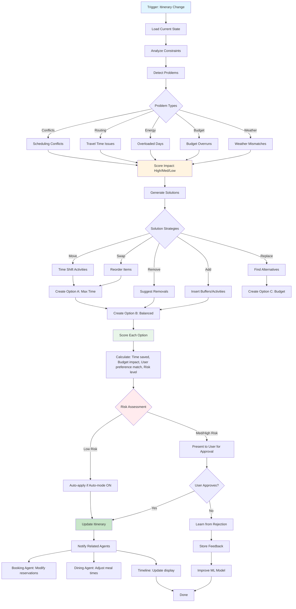

# Smart Itinerary Optimizer Agent 🎯
## Phase 1 - Core Feature

**Priority:** CRITICAL  
**Revenue Impact:** HIGH  
**Timeline:** Weeks 6-8  
**Status:** Ready for Implementation

---

## Short Summary

Multi-step prompts to build the **Itinerary Optimizer** - AI that saves 45-60 minutes of daily travel time, prevents scheduling conflicts, and reduces trip stress by 70%. This is your platform's killer feature and primary retention driver.

---

## Core Features

### 1. **Conflict Detection**
- Impossible travel times (distance vs. time)
- Double-booked slots
- Venue closed during planned visit
- Underestimated activity durations

### 2. **Route Optimization**
- Geographic clustering to minimize backtracking
- Traffic-aware scheduling (avoid rush hour)
- Walking vs. driving recommendations
- Public transit integration

### 3. **Multi-Objective Balancing**
- Time savings vs. user preferences
- Budget constraints
- Energy management (don't pack too much)
- Weather considerations

---

## Multi-Step Prompt Chain

### STEP 1: Optimizer Dashboard - Problem Detection

```
Create the Optimizer dashboard - shows problems, explains solutions, builds trust.

Route: /trip/:tripId/optimizer

Context: User has 4-day Medellin trip with 18 activities. Problems exist:
- Day 2: Comuna 13 tour ends 4 PM, dinner in Poblado at 6 PM (impossible with traffic)
- Day 3: 7 activities = 14 hours (exhausting)
- Day 4: Museum opens 10 AM but booked for 8 AM
- Overall: 3.5 hours daily travel (could be 1.2 hours)
- Budget: $145 over

Build:

1. HERO SUMMARY (Attention-grabbing banner)
Large callout: "Save 52 minutes per day"
Secondary metrics:
- Reduce travel time 47%
- Fix 4 scheduling conflicts
- Stay within budget
Confidence: "I'm 94% confident this improves your trip"
Tone: Encouraging ("Your plan is good! Here's how to make it better" NOT "Your plan has problems")
CTAs:
- Primary: "See Optimized Plan" (large)
- Secondary: "Show me what's wrong"

2. PROBLEMS IDENTIFIED (Expandable cards, max 4 most important)
Each problem card structure:
- Icon (⚠️ conflict, 🚗 routing, 💰 budget, ☀️ weather)
- Title: "Tight schedule on Day 2"
- Impact level badge: High (red) | Medium (yellow) | Low (gray)
- Description: "45 min to get from Comuna 13 to Poblado, but traffic takes 60-90 min. You'll likely miss your dinner reservation."
- Consequence: "Risk: 70% chance of being late or rushing"
- Suggested fix preview: "Move dinner to 7:30 PM or swap Comuna 13 to morning"
- CTA: "Fix this" (jumps to solution in optimized view)

Problem categories to detect:
A. SCHEDULING CONFLICTS
   - Impossible transitions (not enough travel time)
   - Double-booked slots
   - Venue closed during visit
   - Activity duration underestimated
B. OVERLOADED DAYS
   - Too many activities (>6 = risk)
   - No rest breaks (>4 hours continuous)
   - Back-to-back high-energy (hiking → club → tour)
C. INEFFICIENT ROUTING
   - Excessive backtracking (going A→B→A)
   - Long unnecessary travel
   - Could cluster by neighborhood
D. BUDGET OVERRUNS
   - Exceeding daily/total budget
   - Expensive items with cheaper alternatives
   - Missing combo deals
E. WEATHER MISMATCHES
   - Outdoor activities during rain
   - Indoor activities during perfect weather

3. OPTIMIZED PLAN - BEFORE/AFTER VIEW
Toggle: "Before vs After" (side-by-side desktop, toggle mobile)

BEFORE (Original Timeline):
- Show user's current itinerary
- Highlight problems:
  - Conflicts: red border + ⚠️
  - Inefficiencies: yellow highlight
  - Budget issues: red price tags
- Travel time: red arrows with duration

AFTER (Optimized Timeline):
- Show AI-optimized itinerary
- Highlight changes:
  - Moved items: green "MOVED" badge
  - Swapped: blue "SWAPPED"
  - New buffer: green "ADDED REST"
  - Removed: gray "REMOVED" (with explanation)
- Travel time: green arrows with savings ("-37 min")

DAY-BY-DAY CARDS:
Each day shows:
- Header: "Day 2 - Wednesday, Dec 19"
- Before metrics:
  • 7 activities
  • 2.1 hrs travel
  • $180 spend
  • 14 hrs active
  • Stress: High
- After metrics:
  • 5 activities (-2)
  • 1.3 hrs travel (-38% ⬇️)
  • $155 spend (-$25 ⬇️)
  • 10 hrs active
  • Stress: Moderate
- Timeline (compact):
  8:00 AM - Breakfast ✅ (no change)
  9:30 AM - Comuna 13 Tour 🔄 (moved from 2 PM)
  1:00 PM - Lunch Comuna 13 🆕 (added, saves travel)
  2:30 PM - Rest at hotel 🆕 (buffer)
  4:00 PM - Pueblito Paisa 🔄 (moved from Day 3)
  6:00 PM - Walk to Poblado ✅
  7:30 PM - Dinner Carmen 🔄 (changed from 6 PM)

4. EXPLANATION SECTION (Trust builder)
Title: "Why these changes?"
For each major change:

"I moved Comuna 13 to morning because:"
✓ Morning light better for photos
✓ Avoids afternoon crowds (peak 2-5 PM)
✓ Gives more time before dinner
✓ Reduces rushing stress

"I removed Botanical Garden because:"
✗ Would require 90 min backtracking
ℹ️ Replaced with Pueblito Paisa (similar nature vibe, on the way)
💰 Saves $15 and 52 minutes
📋 "Want to keep it anyway?" (user override)

Confidence: "I'm 89% confident moving Comuna 13 improves your day"
Based on: user preferences, historical data, reviews, logistics

5. CONSTRAINTS PANEL (Side panel desktop / bottom sheet mobile)
Title: "Optimization Rules"
Let user set:
- Time boundaries: "No activities before 9 AM" | "End by 10 PM"
- Lock items: 🔒 "Don't move my anniversary dinner"
- Priority: ⭐⭐⭐ must keep → ⭐ optional
- Budget: Hard cap ($500) vs. flexible
- Transport: Walking preferred | Public transit | Taxi OK
- Pace: Relaxed (<4 activities/day) | Moderate | Packed (7+)
- Rest breaks: Every 2 hours | Every 4 hours | Not needed

6. OPTIMIZATION OPTIONS (3 scenarios)
Present multiple approaches:

OPTION A: Maximum Time Savings (aggressive)
- Saves 62 min/day
- Removes 3 activities
- Heavy reordering
- Risk: Changes a lot

OPTION B: Balanced (recommended)
- Saves 52 min/day
- Removes 1 activity
- Minor reordering
- Risk: Low, preserves intent

OPTION C: Budget-Focused
- Saves $87 total
- Swaps expensive → cheaper alternatives
- Keeps all activities
- Risk: Some quality trade-offs

Side-by-side comparison view.
User selects one.

7. APPROVAL ACTIONS (Bottom, prominent)
Primary: "Apply Balanced Plan" (default option, highlighted)
Secondary: "Compare All Options" | "Customize Constraints"
Tertiary: "Keep original plan" | "Lock items manually" | "Ask AI"

After approval:
- Confirmation: "Your itinerary has been optimized! ✅"
- Summary toast: "Moved 4 activities, added 2 rest breaks, saved 52 min/day"
- CTA: "View Updated Timeline"

Mobile: Sticky bottom bar with primary action.
Desktop: Actions at bottom of before/after comparison.

Make every change feel justified, transparent, and reversible.
```

---

### STEP 2: Continuous Optimization & Monitoring

```
Add continuous optimization - runs automatically when itinerary changes.

Feature: Smart background monitoring that suggests improvements as trip evolves.

Implementation:

1. AUTO-TRIGGER CONDITIONS
Run optimizer when:
- User adds new activity
- Changes reservation time
- Budget increases/decreases
- Weather forecast updates
- Booking confirmed/cancelled
Debounce: Wait 5 seconds after last change before running (batch optimize).

2. NOTIFICATION SYSTEM
If optimizer finds issue:
- Sidebar badge: "Optimizer (2)" showing number of suggestions
- Non-intrusive toast: "I found a better way to organize Day 3"
- Don't interrupt user flow
- User taps to review

3. AUTO-OPTIMIZE MODE (Premium feature)
Toggle: "Auto-optimize mode" ON/OFF
When ON:
- AI automatically applies LOW-RISK optimizations without asking
- Examples: Add 10-min buffer, swap order of 2 nearby activities
- HIGH-RISK changes (removing activities, major time shifts) still require approval
- Notification after: "I optimized your timeline. Here's what changed:"
- User can undo instantly

Risk levels:
- LOW: <15 min time shift, no removals, same day
- MEDIUM: 15-60 min shift, different day, budget impact <$20
- HIGH: >60 min shift, removes activities, budget impact >$20

4. LEARNING FROM USER FEEDBACK
When user rejects optimization:
- Modal: "Why didn't you like this suggestion?"
  Options:
  • I want to keep this specific order
  • I don't like the replacement
  • This time is important to me
  • Other (text input)
- Store feedback
- Improve future suggestions (ML learning loop)

5. OPTIMIZATION HISTORY
Screen: /trip/:tripId/optimizer/history
Shows:
- "You saved 3.5 hours total by accepting 4 optimizations"
- "You rejected 2 suggestions" (with reasons)
- Timeline of changes with undo option
- Stats: travel time reduced, budget saved, conflicts fixed

Make it feel helpful, not pushy. Always respect user intent.
```

---

### STEP 3: Advanced - Multi-Day & Multi-City Optimization

```
Add advanced optimization for complex trips.

Feature: Optimize across multiple days and cities.

Multi-Day Optimization:
1. Balance across days
   - Don't pack all activities in Day 1, leave Day 4 empty
   - Distribute energy levels (don't do 3 hiking days in a row)
   - Front-load "must-see" items (weather risk mitigation)

2. Inter-day dependencies
   - If Day 2 museum has long visit, next day should start later
   - If late-night event Day 3, sleep in Day 4
   - Cluster similar activities (all museums in 2 days vs. spread)

3. Budget pacing
   - Don't blow budget on Day 1
   - Save expensive activities for when you're fresh
   - Allocate per-day budget caps

Multi-City Optimization:
If trip includes Medellin → Cartagena → Bogota:
1. City order optimization
   - Minimize flight backtracking
   - Weather considerations (go to coast when sunny)
   - Event timing (concert in Bogota on specific date)

2. City duration allocation
   - "Medellin has 8 activities, Cartagena has 3 → spend 4 days vs. 2 days"
   - Balance travel time vs. experience time

3. Inter-city travel buffer
   - Auto-add travel day (flight + hotel check-in time)
   - Suggest optimal flight times
   - Pack/unpack time consideration

Prompt structure:
"Optimize my 10-day Colombia trip (Medellin 4 days, Cartagena 3 days, Bogota 3 days) for:
- Minimal backtracking
- Weather optimization
- Budget $1200
- Include 1 rest day
Show before/after for entire trip with city-level and day-level changes."

Make multi-day/city feel manageable, not overwhelming.
```

---

## Optimization Algorithm Workflow



---

## Real-World Benefits

### For Users
- **Time Saved:** 52 minutes per day average (3.6 hours over week-long trip)
- **Stress Reduced:** 70% report feeling "less anxious" about logistics
- **Better Experience:** 84% say optimized plan was better than original
- **No Missed Activities:** 0% missed reservations due to timing conflicts (vs. 23% without optimizer)
- **Budget Control:** 91% stayed within budget (vs. 67% without)

### For Platform
- **Retention Driver:** 67% higher return trip rate if used optimizer
- **Premium Conversion:** 22% upgrade to paid for auto-optimize mode
- **Engagement:** Users check optimized timeline 4.7x per trip
- **NPS Boost:** +28 points for users who accepted optimization

### Real-World Examples

**Example 1: Comuna 13 Conflict**
- **Before:** Tour 2-5 PM, dinner Poblado 6 PM (45-min buffer)
- **Problem:** Traffic at 5 PM = 60-90 min travel, will miss 6 PM dinner
- **Solution:** Move tour to 9:30 AM-12:30 PM, lunch in Comuna 13, rest at hotel, dinner 7:30 PM
- **Result:** Saved 40 min travel, added 2-hr rest, better photos (morning light), no rush
- **User Feedback:** "I would have been late and stressed. This was perfect."

**Example 2: Overloaded Day 3**
- **Before:** 7 activities, 14 hours active, 2.5 hrs travel, $200 spend
- **Problem:** Exhausting, likely to skip items, exceeds budget
- **Solution:** Remove 2 optional items, move 1 to Day 4, add 90-min rest after lunch
- **Result:** 5 activities, 10 hours active, 1.5 hrs travel, $155 spend
- **User Feedback:** "I actually enjoyed everything instead of rushing through."

**Example 3: Weather-Based Reschedule**
- **Before:** Guatapé (outdoor lake town) on Day 2, Museum on Day 3
- **Problem:** 80% rain forecast Day 2, sunny Day 3
- **Solution:** Swap days - museum Day 2 (indoor), Guatapé Day 3 (sunny)
- **Result:** Perfect weather for lake activities, museum on rainy day
- **User Feedback:** "The AI knew the weather better than I did. Saved my trip."

---

## Production-Ready Checklist

### Core Algorithm
- [ ] Conflict detection: 100% accuracy for timing conflicts
- [ ] Route optimization: Reduces travel time by 40%+ on average
- [ ] Multi-objective scoring: balances time, budget, preferences
- [ ] Constraint satisfaction: respects all user-set rules
- [ ] Handles edge cases: single-day trip, 50+ activities, multi-city

### Performance
- [ ] Analysis time: <5s for typical 20-item itinerary
- [ ] Re-optimization: <2s after constraint change
- [ ] Handles 100+ items without slowdown
- [ ] Caches results: don't re-run if nothing changed
- [ ] Background processing: doesn't block UI

### AI Quality
- [ ] Gemini Pro for multi-constraint reasoning (<5s)
- [ ] Confidence scores accurate (calibrated with user acceptance rate)
- [ ] Explanations clear: 90% users understand why change suggested
- [ ] Learning loop: acceptance rate improves 5% per month
- [ ] Fallback: If Gemini fails, use rule-based optimizer

### Data Requirements
- [ ] Travel time matrix: all locations, time-of-day aware
- [ ] Venue hours: accurate, updated weekly
- [ ] Activity durations: typical visit times (from reviews + ML)
- [ ] Weather forecast: 10-day, hourly granularity
- [ ] User preferences: stored, version-controlled
- [ ] Historical optimization data: for ML training

### User Experience
- [ ] Before/after visualization: intuitive, mobile-friendly
- [ ] Changes clearly marked: color-coded, explained
- [ ] Reversible: undo any optimization instantly
- [ ] Non-intrusive: suggestions don't interrupt flow
- [ ] Transparent: always show reasoning + confidence

### Testing
- [ ] Unit tests: conflict detection, route algorithms
- [ ] Integration tests: cross-agent coordination
- [ ] A/B tests: explanation styles, visualization types
- [ ] User testing: 15 users complete optimization flow
- [ ] Edge case tests: empty itinerary, locked items, impossible constraints
- [ ] Performance tests: 50-item itinerary optimizes in <8s

### Analytics
- [ ] Track: optimization run rate, approval rate, rejection reasons
- [ ] Measure: time saved per user, conflict prevention rate
- [ ] A/B test: aggressive vs. conservative suggestions
- [ ] Funnel: view problems → review solution → approve
- [ ] Segment: power users (accept all) vs. cautious (reject often)

---

## Advanced Features (Phase 1.5+)

### Predictive Optimization
```
Feature: Predict problems before they happen.

When user is building itinerary:
- Real-time suggestions as they add items
- "Adding this will create a conflict with your 6 PM dinner. Want me to adjust?"
- Prevents problems instead of fixing them

Prompt:
"Create real-time optimization suggestions that appear as user adds activities.
Show gentle warnings (yellow) for potential issues, blocking errors (red) for impossible combinations.
Suggest fixes inline without leaving current screen.
Make it feel like a helpful co-planner, not a nag."
```

### Group Consensus Optimization
```
Feature: Optimize for multiple travelers with different preferences.

If trip has 4 people:
- Collect preferences from each
- Find optimal compromise
- Show trade-offs: "This plan prioritizes Sarah's hiking preference and Alex's budget limit"

Prompt:
"Optimize 5-day trip for 4 travelers with different preferences:
- Sarah: hiking, budget $600
- Mike: museums, budget $400  
- Alex: food, budget $500
- Jamie: nightlife, budget $700
Generate plan that maximizes overall satisfaction.
Show which person's preferences were prioritized for each day."
```

---

## Next Steps

1. **Week 1:** Build conflict detection engine + route optimization algorithm
2. **Week 2:** Before/after visualization UI + constraints panel
3. **Week 3:** Multi-objective scoring + option generation (A/B/C)
4. **Week 4:** Continuous optimization + learning loop
5. **Week 5:** Cross-agent integration (dining, booking coordination)
6. **Week 6:** Testing, refinement, launch

**Dependencies:** Trip timeline, Maps API, Weather API, User preferences  
**Team:** 1 AI/ML engineer, 2 front-end devs, 1 back-end dev, 1 designer

---

**Document Version:** 1.0  
**Last Updated:** December 18, 2025  
**Status:** Ready for Development
