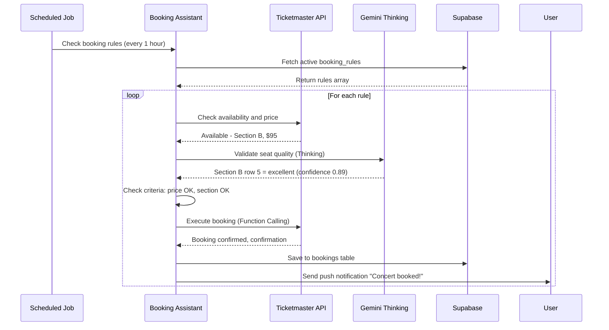
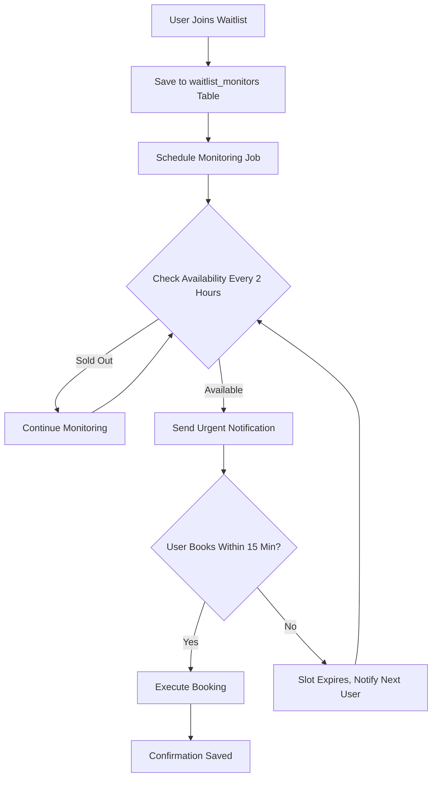

# 06 - Booking Assistant Agent Implementation Plan

**Feature:** Automated Reservation Management and Price Monitoring  
**Priority:** Medium (Phase 3 - Week 3)  
**Owner:** AI Team + Partnerships  
**Gemini Features:** Function Calling, Gemini Thinking, Structured Outputs, Deep Research

---

## Progress Tracker

| Phase | Task | Status | Owner | Validation |
|-------|------|--------|-------|-----------|
| **Design** | Booking dashboard UI | 🔴 Not Started | Figma Make | Reservation cards designed |
| **AI** | Price monitoring logic | 🔴 Not Started | Cursor AI | Detects price drops ninety percent accuracy |
| **Integration** | Partner APIs setup | 🔴 Not Started | Partnerships | Five booking platforms connected |
| **Backend** | Webhook handlers | 🔴 Not Started | Cursor AI | Status updates real-time |
| **Testing** | End-to-end booking flow | 🔴 Not Started | QA | Zero failed reservations |

---

## 1. Product Goal

**Problem:** Travelers manually monitor prices across ten plus sites, miss price drops, forget to book, lose reservations to sold-out events.

**Solution:** AI monitors all bookings (restaurants, tours, hotels), alerts on price drops, auto-books when criteria met, tracks confirmations.

**Outcome:** Users save average one hundred fifty dollars per trip, never miss reservations, zero booking stress.

**Success Metric:** Seventy-five percent booking completion rate, fifty percent users enable auto-booking.

---

## 2. Core Features & Workflows

### Feature 1: Price Drop Monitoring

**User Journey:**
1. User saves Guatapé tour (currently ninety dollars) to wishlist
2. AI monitors price daily via partner APIs (Viator, GetYourGuide)
3. Day 4: Price drops to seventy dollars (twenty-two percent off)
4. Push notification: "Guatapé tour now seventy dollars - save twenty dollars - book now?"
5. User clicks notification, one-tap booking
6. Confirmation saved to itinerary

**Gemini Functions:**
- **Deep Research:** Scrape historical pricing data, identify typical discount patterns
- **Gemini Thinking:** Analyze if drop is significant ("twenty percent off is good deal for this tour based on history")
- **Function Calling:** Query Viator API for current price, availability

**Supabase Schema:**
```
Table: price_watches
- id, user_id, item_type (restaurant/tour/hotel), item_id
- current_price, target_price (user-defined threshold)
- last_checked_at, lowest_price_seen, alert_sent
```

**Edge Function:** `/functions/v1/monitor-prices`
- Scheduled job: runs every 6 hours
- Fetches all active price_watches
- Calls partner APIs for current prices
- If price drop > fifteen percent: trigger alert

---

### Feature 2: Auto-Booking with Rules

**User Journey:**
1. User sets rule: "Book Karol G concert if price under one hundred dollars AND seats in sections A-C"
2. AI monitors Ticketmaster API every hour
3. Criteria met: Section B, ninety-five dollars
4. Auto-books ticket, charges saved payment method
5. Confirmation email + in-app notification
6. Ticket added to itinerary Day 3 evening

**Gemini Functions:**
- **Structured Outputs:** Parse booking rules into JSON schema
- **Gemini Thinking:** Validate seat quality ("Section B row 5 is excellent view based on venue layout")
- **Function Calling:** Execute booking via Ticketmaster API

**Supabase Schema:**
```
Table: booking_rules
- id, user_id, event_id, max_price, seat_sections (array)
- auto_book_enabled (boolean), payment_method_id
- created_at, expires_at (date)
```

**Mermaid Diagram: Auto-Booking Flow**



---

### Feature 3: Cancellation Policy Tracking

**User Journey:**
1. User books restaurant with "free cancellation until 24 hours before"
2. AI parses policy, stores deadline in database
3. Twenty-six hours before reservation: reminder "Cancel by tomorrow 7 PM for free"
4. User decides to cancel
5. One-click cancellation via OpenTable API
6. Itinerary updated, budget recalculated

**Gemini Functions:**
- **Structured Outputs:** Parse cancellation policy text into deadline timestamp
- **Gemini Thinking:** Explain policy in simple terms ("You can cancel for free anytime before January 15, 7 PM")

**Supabase Schema:**
```
Table: bookings (extends from Doc 04)
- cancellation_deadline (timestamp), cancellation_fee (numeric)
- reminder_sent (boolean), cancellation_instructions (text)
```

**Edge Function:** `/functions/v1/cancellation-reminders`
- Scheduled: runs every 12 hours
- Finds bookings with cancellation_deadline within 48 hours
- Sends reminder notifications

---

### Feature 4: Sold-Out Waitlist Monitoring

**User Journey:**
1. User tries to book Carmen restaurant - fully booked
2. Clicks "Join Waitlist"
3. AI monitors OpenTable every 2 hours for cancellations
4. Slot opens: 7:30 PM table available
5. Auto-notification: "Carmen just had cancellation - book now (expires in 15 min)"
6. User books within window

**Gemini Functions:**
- **Function Calling:** Poll OpenTable availability endpoint
- **Deep Research:** Analyze cancellation patterns ("Fridays have thirty percent cancellation rate 2 days before")

**Mermaid Diagram: Waitlist Monitoring**



---

## 3. Partner Integrations

### Required APIs

**Tier 1 (MVP):**
- OpenTable API: restaurant reservations, availability checks
- Viator API: tour bookings, pricing
- Ticketmaster API: event tickets, seat selection

**Tier 2 (Phase 2):**
- GetYourGuide API: alternative tour provider
- Resy API: alternative restaurant bookings
- Airbnb API: accommodation bookings

**Tier 3 (Advanced):**
- Uber API: transport pre-booking
- Eventbrite API: local event tickets
- Google Flights API: flight price monitoring

### Webhook Setup

All partners send status updates to: `/functions/v1/booking-webhook`

**Webhook payload validation:**
- Verify signature (HMAC-SHA256 with partner secret)
- Extract: booking_id, status (confirmed/canceled/modified), confirmation_number
- Update Supabase bookings table
- Trigger real-time sync to user's app

---

## 4. AI Agent Architecture

### Agent Name: Booking Assistant

**Triggers:**
- User clicks "Book" on activity/restaurant
- Scheduled price monitoring (every 6 hours)
- Waitlist slot opens (webhook from partner)

**Inputs:**
- Booking details (date, time, party size, preferences)
- User payment method (tokenized, PCI-compliant)
- Booking rules (max price, auto-book criteria)

**Core Logic:**

**Step 1: Availability Check**
- Query partner API for requested slot
- If unavailable: offer next 3 available times
- If fully booked: offer waitlist enrollment

**Step 2: Price Validation**
- Compare current price to historical average (Deep Research)
- If above average: suggest waiting ("Price typically drops 20% closer to date")
- If good deal: encourage immediate booking

**Step 3: Conflict Detection**
- Cross-reference with existing itinerary (similar to Doc 01 Optimizer)
- Check time overlaps, travel time between activities
- Alert if conflict: "This tour ends at 6 PM, dinner reservation at 6:15 PM (15 min away)"

**Step 4: Execute Booking**
- Call partner API with booking parameters (Function Calling)
- Handle failures: retry 3 times, fallback to manual booking link
- Store confirmation in Supabase bookings table

**Step 5: Post-Booking**
- Send confirmation email via Supabase Auth email service
- Add to itinerary with booking badge
- Set calendar reminders (24 hours before, 2 hours before)

**Gemini Structured Output:**
```
{
  "booking_status": "confirmed",
  "confirmation_number": "ABC123",
  "provider": "OpenTable",
  "details": {
    "restaurant": "Carmen",
    "date": "2026-01-16",
    "time": "19:00",
    "party_size": 2,
    "table_type": "window_seat"
  },
  "cost": 0,
  "deposit_required": false,
  "cancellation_policy": {
    "free_until": "2026-01-15T19:00:00Z",
    "fee_after": 25
  },
  "next_steps": [
    "Confirmation sent to email",
    "Added to Day 3 itinerary",
    "Reminder set for 24 hours before"
  ]
}
```

---

## 5. Implementation Prompts

### Figma Make Prompts

**Prompt 1:** "Design booking dashboard showing upcoming reservations grouped by date. Each card: venue name, date/time, party size, status badge (confirmed/pending/waitlist), cancellation deadline countdown, quick actions (view details, cancel, modify). Include price watch section showing monitored items with current price, target price, last checked timestamp."

**Prompt 2:** "Create booking confirmation modal with sections: success icon, confirmation number (large font), booking details summary, cost breakdown, cancellation policy card with deadline countdown, add to calendar button, share reservation button. Use emerald green for confirmed status."

### Cursor AI Prompts

**Prompt 3:** "Build price monitoring Edge Function. Scheduled job runs every 6 hours. Fetch all price_watches where alert_sent equals false. For each watch, call partner API (Viator, Ticketmaster, OpenTable) to get current price. If price drop greater than fifteen percent from current_price: create alert record in notifications table, send push notification, set alert_sent true. Handle API failures gracefully with exponential backoff."

**Prompt 4:** "Implement auto-booking function. Input: booking_rule object with criteria (max_price, seat_sections, date_range). Query partner API for availability. Validate against criteria. If all conditions met, call Gemini Thinking to verify quality (is this seat worth the price?). If confidence greater than zero point eight, execute booking via Function Calling. Store confirmation in bookings table. Send notification to user with booking details."

**Prompt 5:** "Create waitlist monitoring system. When user joins waitlist, create waitlist_monitors record with venue_id, desired_date, desired_time, notification_preferences. Scheduled job every 2 hours checks availability via partner API. If slot opens, send urgent notification with 15-minute expiration. If user doesn't book within window, notify next user on waitlist. Remove from waitlist after booking or user cancels."

---

## 6. Real-World Use Cases

**Use Case 1: Concert Price Drop**
User wants Maluma concert but ticket is one hundred fifty dollars (budget one hundred dollars). Sets price watch at one hundred dollars. Three weeks later, promoter releases additional seats at eighty-five dollars. AI auto-books, user saves sixty-five dollars.

**Use Case 2: Last-Minute Cancellation**
Fully booked restaurant has cancellation 3 hours before. User on waitlist gets instant notification, books within 5 minutes. Enjoys dinner that was "impossible to get."

**Use Case 3: Forgotten Booking Deadline**
User books refundable tour but forgets about 48-hour cancellation window. AI reminds 26 hours before deadline. User cancels, saves ninety dollars cancellation fee.

**Use Case 4: Group Coordination**
Six friends need restaurant table. Most restaurants max out at four-person reservations. AI finds venue with large table, auto-books when available, splits cost via group expense tracker (Doc 05).

**Use Case 5: Multi-City Price Comparison**
User flexible on Guatapé tour provider. AI monitors Viator (ninety dollars), GetYourGuide (seventy-five dollars), local operator (sixty dollars). Books cheapest option with four-star-plus rating.

---

## 7. Database Schema Extensions

**New Tables (add to Doc 04 schema):**

```
price_watches:
- id (uuid), user_id (uuid), item_type (text), item_id (uuid)
- current_price (numeric), target_price (numeric)
- last_checked_at (timestamp), lowest_price_seen (numeric)
- alert_sent (boolean), created_at (timestamp)

booking_rules:
- id (uuid), user_id (uuid), event_id (uuid)
- max_price (numeric), seat_sections (text array)
- auto_book_enabled (boolean), payment_method_id (uuid)
- expires_at (timestamp), created_at (timestamp)

waitlist_monitors:
- id (uuid), user_id (uuid), venue_id (uuid)
- desired_date (date), desired_time (time)
- notification_sent (boolean), slot_offered_at (timestamp)
- expires_at (timestamp), created_at (timestamp)

booking_confirmations (extends bookings from Doc 04):
- confirmation_email_sent (boolean)
- calendar_reminder_sent (boolean)
- cancellation_reminder_sent (boolean)
- modification_history (jsonb array)
```

**RLS Policies:**
- Users see only their own price_watches, booking_rules, waitlist_monitors
- Public read on venue availability (cached data)

---

## 8. Success Criteria

**MVP Launch:**
- Seventy-five percent of bookings complete successfully without manual intervention
- Price monitoring accuracy: detects ninety percent of significant drops (fifteen percent plus)
- Waitlist notification latency: under 5 minutes from slot opening
- Zero double-bookings or failed charges

**Advanced Phase:**
- Auto-booking adoption: fifty percent of power users enable rules
- Average savings per trip via price monitoring: one hundred fifty dollars
- Booking completion speed: under 60 seconds from alert to confirmation
- Integration with ten plus booking platforms

---

## 9. Production Checklist

- [ ] Partner API keys secured in Supabase secrets (never client-side)
- [ ] Webhook signatures validated (prevent spoofing)
- [ ] Payment tokenization PCI-compliant (use Stripe/partner tokenization)
- [ ] Price monitoring job handles API rate limits gracefully
- [ ] Booking confirmations stored with full audit trail
- [ ] Cancellation deadlines calculated correctly across timezones
- [ ] Error handling: API timeouts show retry option, not silent failure
- [ ] Mobile notifications work on iOS and Android
- [ ] Accessibility: booking status announced to screen readers
- [ ] Load testing: handles 100 concurrent bookings without performance degradation

---

**Reference Docs:**
- See Doc 01 (Itinerary Optimizer) for conflict detection patterns
- See Doc 03 (Dining Orchestrator) for restaurant booking integration
- See Doc 04 (Backend Integration) for Supabase schema patterns
- See Doc 05 (Budget Guardian) for cost tracking integration

**Document Owner:** AI Team + Partnerships  
**Dependencies:** Partner API access (OpenTable, Viator, Ticketmaster), Supabase Edge Functions, payment tokenization
