# Predictive Booking Assistant Agent 💳
## Phase 1 - Core Feature

**Priority:** HIGH  
**Revenue Impact:** VERY HIGH  
**Timeline:** Weeks 9-11  
**Status:** Ready for Implementation

---

## Short Summary

Multi-step prompts to build the **Booking Assistant** - AI that monitors prices, predicts sellouts, and auto-books when conditions are perfect. Saves users $47 average per booking and generates $23 platform revenue per transaction.

---

## Core Features

### 1. **Price Monitoring**
- Track prices across 50+ platforms in real-time
- ML predictions for price movements
- Alert when price drops below threshold
- Identify optimal booking time

### 2. **Availability Prediction**
- Predict when events/restaurants will sell out
- ML model based on ticket velocity, historical data
- Early booking recommendations
- Alternative suggestions when sold out

### 3. **Auto-Booking**
- Book automatically when user-set conditions met
- 5-minute warning before booking (can cancel)
- Confirmation + receipt immediately
- Full audit trail for transparency

---

## Multi-Step Prompt Chain

### STEP 1: Bookings Hub - Watchlist & Monitoring

```
Create the Bookings Hub - command center for price tracking and auto-booking.

Route: /trip/:tripId/bookings

Context: User planning Medellin trip. Saved 8 items but hasn't booked:
- 3 restaurants (2 not available yet for preferred times)
- 1 hotel (price $145/night, wants <$130)
- 2 tours (Guatapé, Comuna 13)
- 1 football match (not on sale yet, releases tomorrow)
- 1 concert (Karol G, secondary market, expensive)

Build:

1. HEADER SUMMARY
Metrics bar:
- "Watching 8 items for you"
- "3 price alerts active"
- "1 item ready to book now" (green badge)

Auto-book toggle (prominent):
- ON: "I'll book automatically when conditions are met"
- OFF: "I'll notify you, you book manually"
- Clear "What this means" explanation on hover

2. URGENT ACTIONS (Top priority section)
Title: "Act Now" (yellow/red border)

Each urgent item card:
- Image thumbnail
- Name: "Nacional vs Millonarios Match"
- Urgency badge: "Tickets on sale NOW" (red pulsing dot)
- Reason: "I predicted sellout in 6 hours. Already 37% sold in 45 min."
- Price: $45 (Premium seats, Tribuna Norte)
- Comparison: "Fair price (market avg: $52)"
- Actions:
  • Primary: "Book Now" (large, urgent red)
  • Secondary: "See Details"
  • Tertiary: "Stop Watching" (x)

Show max 3 urgent items.
If none: "No urgent actions needed ✅"

3. WATCHLIST (Main section)
Title: "Your Watchlist (8 items)"
Subtitle: "Monitoring prices, availability, and optimal booking times"

Tabs:
- All (8)
- Ready to Book (1) - green badge
- Price Tracking (3) - blue badge
- Waiting for Sale (2) - yellow badge  
- Alternatives (2) - red badge (original sold out)

Each watchlist card:
LEFT: Image (120x120px)
CENTER: Details
- Name: "Hotel Poblado Plaza"
- Category badge: "Accommodation" (color: blue hotels, green tours, orange dining, red events)
- Status chip:
  • "Tracking price" (blue)
  • "Waiting for availability" (yellow)
  • "Ready to book" (green)
  • "Sold out - showing alternatives" (red)
- Current info:
  • "Price: $145/night (down $8 from yesterday ⬇️)"
  • "Your target: $130/night or below"
  • "Probability of hitting target: 62% in next 7 days"
- ML insight: "Typically drops 15% on Wednesdays"
RIGHT: Actions
- "Book Now" (if ready)
- "Adjust Target" (change price threshold)
- "Stop Watching"
- Heart icon (save/unsave)

4. PRICE ALERTS TIMELINE
Title: "Recent Alerts"
Chronological feed of last 10 events:

Each alert:
- Timestamp: "2 hours ago"
- Icon: 📉 price drop | 🎫 availability | ⚠️ selling fast | ✅ booked
- Message: "Price dropped 15% for Guatapé Tour"
- Details: "Was $65 → Now $55. You saved $10!"
- Action taken:
  • If auto-booked: "✅ I booked this for you. Confirmation #GU-2512"
  • If alerted: "📱 Sent you notification. Waiting for approval."
  • If manual: "✅ You booked this manually."
- CTA: "View details" or "Approve booking"

"Load More" for older alerts.

5. CONFIRMED BOOKINGS (Collapsible)
Title: "Confirmed Bookings (4)"
Status: "All set! You're good to go."

Each booking card:
- Image + Name: "Carmen Restaurant"
- Type badge: "Dining"
- Details:
  • Date: "Tonight, Dec 18, 7:30 PM"
  • Party size: 2 people
  • Reference: #CM-2512-8472
  • Sent to: user@email.com, +1-555-0123
  • Cancel policy: "Free cancellation until 5:30 PM"
- Status: Confirmed ✅
- Actions:
  • "View Details" → full confirmation
  • "Add to Calendar" → .ics export
  • "Cancel" (if allowed)
  • "Modify" (if allowed)

6. BOOKING INTELLIGENCE (Right sidebar desktop / collapsible mobile)
Title: "Smart Insights"

Cards:

A. BEST TIME TO BOOK
"Book hotels 3 weeks before arrival for best prices"
"Tours: 5-7 days ahead (avoid last-minute premiums)"
"Restaurants: 2-3 days for popular spots"

B. PRICE TRENDS GRAPH
Graph: "Hotel prices for your dates"
- 30-day history + 7-day forecast
- Mark current price
- "Prices expected to rise 12% in next 3 days. Book soon!"

C. AVAILABILITY HEATMAP
Calendar view:
- Green (high availability) → Red (low/sold out)
- "Dec 20-22 is peak period. Limited availability."

D. SAVINGS TRACKER
"You've saved $87 by booking at the right time"
Breakdown:
- Hotel: $45 saved
- Tours: $32 saved
- Concert: $10 saved

7. STATES

EMPTY WATCHLIST:
- Illustration: empty list with search
- "Start adding items to your watchlist"
- "I'll monitor prices and book at the perfect time"
- CTAs: "Explore Dining" | "Explore Activities"

NO ALERTS:
- "No recent alerts. I'm quietly monitoring your watchlist."
- Checkmark: "All good"

AUTO-BOOK DISABLED:
- Yellow banner: "Auto-book is OFF. I'll send alerts but won't book automatically."
- CTA: "Enable Auto-Book" (opens settings)

PAYMENT METHOD MISSING:
- Orange alert: "Add payment method to enable auto-booking"
- CTA: "Add Credit Card" → /account/payment

ALL BOOKED:
- Celebration: "Everything is booked! 🎉"
- "You're all set for your trip. Check timeline for details."
- CTA: "View Timeline"

Mobile: Sticky bottom bar with urgent count + primary action.
Desktop: Three-column (urgent + watchlist + intelligence).

Make it feel proactive, transparent, and trustworthy.
```

---

### STEP 2: Auto-Book Settings & Permissions

```
Create Auto-Book settings - clear permissions with safety guardrails.

Route: /trip/:tripId/bookings (settings modal) + /account/preferences

User must explicitly opt-in. Never auto-book without permission.

Settings Screen:

1. MAIN TOGGLE
Header: "Auto-Book Preferences"
Subtitle: "I'll book automatically when your conditions are met. You stay in control."

Toggle: "Enable Auto-Book" (OFF by default)
Explanation below:
"When ON, I can book items from your watchlist when:
 • Price drops to your target
 • Availability is low and price is fair
 • Last-minute deal appears (>30% off)
You'll get a 5-minute warning and can cancel before I book."

2. SPENDING LIMITS (Sliders)
A. Max per booking: $0 - $500 (default: $200)
   Explanation: "I won't auto-book anything costing more than this"

B. Max deposit: $0 - $100 (default: $50)
   Explanation: "Some bookings require deposits upfront"

C. Daily spending cap: $0 - $1000 (default: $500)
   Explanation: "Total auto-bookings per day"

D. Trip total cap: $0 - $5000 (default: $2000)
   Explanation: "Maximum I can spend on your entire trip"

3. APPROVAL RULES (Checkboxes)
Title: "Always auto-book if:"
- ✓ Price drops below my target
- ✓ Availability <20% and price is stable
- ✓ Last-minute deal (>30% off)
- ✓ Refundable booking

Title: "Always ask me first if:"
- ✓ Price >$100
- ✓ Non-refundable booking
- ✓ Changes to confirmed plans
- ✓ Unusual timing (e.g., 3 AM event)

4. PREFERRED TIMES (Time pickers)
- Dining: 7:00 PM - 9:00 PM
- Tours: 9:00 AM - 2:00 PM  
- Events: Evening
- Flexibility: ±2 hours acceptable

5. CANCELLATION PREFERENCES
- Prefer free cancellation: YES (may cost more) / NO (save money)
- Acceptable cancellation window: 24 hours min / 48 hours min / 1 week min
- Explanation: "If I can't find free cancellation, I'll ask first"

6. PAYMENT METHOD
- Credit card on file: •••• 4242
- "Change payment method" link → /account/payment
- Security note: "Tokenized, PCI-compliant, never stored"

7. NOTIFICATION PREFERENCES (Toggles)
- Email: ON
- SMS: ON
- Push: ON
- Notify before auto-booking: 5-min warning (default) / Instant (no warning)

8. TRUST ELEMENTS (Always visible)
Box with:
- "You can cancel any auto-booking instantly (refund within 1 hour)"
- "Revoke auto-book permission anytime"
- "I only book refundable unless you approve otherwise"
- "Audit log shows every action I take"
- Link: "View Audit Log"

9. ACTIONS
Primary: "Save & Enable Auto-Book"
Secondary: "Save Settings" (if toggle was already on)
Tertiary: "Cancel"

After enabling:
- Success message: "Auto-book enabled! ✅"
- "I'm now monitoring your watchlist. You'll get alerts when I book."
- Show example: "Example: If Hotel Poblado Plaza drops to $129, I'll book it and notify you immediately."

Make settings feel safe, transparent, and empowering. User should feel in control.
```

---

### STEP 3: Auto-Booking Flow & Notifications

```
Create the auto-booking flow - from trigger to confirmation.

Flow:

1. TRIGGER DETECTED
System: Price drops below target
Event: Hotel Poblado Plaza now $128/night (target: $130)

2. PRE-BOOKING CHECKS
Verify:
- Within spending limits? ✓ ($128 < $200 max per booking)
- Refundable? ✓ (matches user preference)
- Approval rules? ✓ (price <$100, auto-book allowed)
- Payment method valid? ✓
All checks pass → Proceed

3. WARNING NOTIFICATION (If enabled)
Push notification + SMS + Email:
Title: "Ready to book Hotel Poblado Plaza"
Body: "Price hit your target: $128/night (was $145). I'll book in 5 minutes unless you cancel."
Actions:
- "Cancel" → stops booking
- "Book Now" → books immediately
- "View Details" → opens app to review

Countdown timer in notification: "Booking in 4:32..."

4. USER RESPONSE
Option A: User cancels → Stop, continue monitoring
Option B: User taps "Book Now" → Book immediately
Option C: 5 minutes pass, no response → Proceed with booking

5. BOOKING ATTEMPT
Processing screen (if user is in app):
- Spinner
- "Booking Hotel Poblado Plaza..."
- Submessages: "Checking availability..." → "Processing payment..." → "Confirming..."

6. SUCCESS
Confirmation screen:
- Checkmark animation
- "Booked! 🎉"
- Booking details:
  • Hotel Poblado Plaza
  • Dec 19-22, 2025 (3 nights)
  • $128/night ($384 total + $42 taxes = $426)
  • Confirmation: #HP-8573
  • Sent to: user@email.com, +1-555-0123
- What I did:
  ✓ Booked at your target price
  ✓ Added to your timeline
  ✓ Charged $426 to •••• 4242
  ✓ Saved you $51 vs. yesterday's price
- Actions:
  • "View in Timeline"
  • "View Receipt"
  • "Cancel Booking" (if within refund window)

Notifications sent:
- Email: Full confirmation with receipt
- SMS: "Booked Hotel Poblado Plaza. Confirmation #HP-8573. Total $426."
- Push: "I booked your hotel at $128/night. You saved $51!"

7. FAILURE
If booking fails:
Error screen:
- Warning icon
- "Couldn't book Hotel Poblado Plaza"
- Reason: "Sold out while processing" or "Payment declined"
- What I did:
  • Attempted booking at 2:14 PM
  • Payment authorized but venue unavailable
  • Refunded authorization immediately
- Alternatives:
  "I found 2 similar hotels at $132/night"
  Show cards with:
  - Hotel name + image
  - Similarity score: "94% match"
  - Why similar: "Same neighborhood, same amenities, same rating"
  - Price comparison: "$132 vs. $128 (only $4 more)"
  - CTA: "Book This Instead"
- Actions:
  • "Try Again" (if transient error)
  • "Add to Watchlist" (continue monitoring)
  • "Contact Support"

Notification:
- Push: "Booking failed - Hotel Poblado Plaza sold out. Found 2 alternatives."
- Opens app to alternatives screen

8. AUDIT LOG ENTRY
Record in /trip/:tripId/bookings audit log:
Timestamp: Dec 18, 2025 2:14 PM
Action: Auto-booked Hotel Poblado Plaza
Trigger: Price dropped to $128 (target: $130)
Warning sent: Yes (5-min countdown)
User response: No response (timed out)
Outcome: Success
Booking ID: #HP-8573
Amount charged: $426
Status: Confirmed ✅

Make every step transparent. User should never wonder "What just happened?"
```

---

## Booking Agent State Machine

```mermaid
stateDiagram-v2
    [*] --> Monitoring: User adds item to watchlist
    
    Monitoring --> PriceCheck: Every 30 seconds
    Monitoring --> AvailabilityCheck: Every 2 minutes
    Monitoring --> MLPredict: Hourly
    
    PriceCheck --> ThresholdMet: Price < Target
    AvailabilityCheck --> LowStock: <20% available
    MLPredict --> SelloutSoon: Predicted sellout <6hrs
    
    ThresholdMet --> EvaluateRules: Check conditions
    LowStock --> EvaluateRules
    SelloutSoon --> EvaluateRules
    
    EvaluateRules --> AutoBookON: Auto-book enabled
    EvaluateRules --> SendAlert: Auto-book disabled
    
    AutoBookON --> CheckLimits: Verify spending caps
    CheckLimits --> WithinLimits: Under limits
    CheckLimits --> SendAlert: Exceeds limits
    
    WithinLimits --> SendWarning: 5-min countdown
    SendWarning --> WaitResponse: User can cancel
    
    WaitResponse --> UserCancels: Cancel pressed
    WaitResponse --> UserApproves: Book now pressed
    WaitResponse --> Timeout: 5 min elapsed
    
    UserCancels --> Monitoring: Resume monitoring
    UserApproves --> AttemptBooking
    Timeout --> AttemptBooking
    
    AttemptBooking --> BookingAPI: Call external API
    BookingAPI --> Success: Confirmed
    BookingAPI --> Failure: Error/Sold out
    
    Success --> AddToItinerary: Update timeline
    Success --> ChargePayment: Process payment
    Success --> SendConfirmation: Email + SMS + Push
    
    Failure --> FindAlternatives: Search similar
    FindAlternatives --> SendAlert: Notify user
    
    SendAlert --> UserReviews: Opens app
    UserReviews --> ManualBook: User books
    UserReviews --> Dismiss: Ignores
    
    ManualBook --> Success
    Dismiss --> Monitoring
    
    SendConfirmation --> LogAudit: Record action
    LogAudit --> [*]: Done
    
    note right of Monitoring
        Continuous monitoring:
        • Price changes
        • Availability drops
        • Competitor pricing
        • Weather impacts
        • Special deals
    end note
    
    note right of EvaluateRules
        Rules checked:
        • Spending limits
        • Approval preferences
        • Cancellation policy
        • Time constraints
        • Refundability
    end note
    
    note right of AttemptBooking
        Race condition handling:
        • Lock watchlist item
        • Double-check availability
        • Timeout after 10s
        • Rollback on failure
    end note
```



---

## Real-World Benefits

### For Users
- **Money Saved:** $47 average per booking (vs. booking at initial price)
- **Time Saved:** 15 minutes of price comparison per item → automated
- **Zero FOMO:** 0% missed sold-out events (vs. 31% without agent)
- **Better Prices:** 78% book at or below target price
- **Peace of Mind:** Sleep while AI monitors 24/7

### For Platform
- **Revenue:** $23 average per transaction (commission + fees)
- **Transaction Volume:** 3.4x higher than manual booking
- **Retention:** 56% lower churn for users who enable auto-book
- **Premium Conversion:** 22% upgrade for auto-book feature ($14.99/month)

### Real-World Examples

**Example 1: Football Match Auto-Book**
- User: Wants Nacional match tickets, budget $60 max
- AI: Tickets release tomorrow 10 AM, expects sellout in 4 hours
- Action: Auto-books at 10:00:03 AM (3 seconds after release)
- Price: $45 (under budget)
- Outcome: User gets great seats. Secondary market prices surge to $120 by 2 PM.
- **Saved:** $75 vs. waiting, 0% chance of missing out

**Example 2: Hotel Price Drop**
- User: Watching Hotel Poblado Plaza, target $130/night (currently $145)
- AI: Monitors 24/7, detects price drop to $128 at 2 AM
- Action: Auto-books immediately with 5-min warning (user asleep)
- Outcome: User wakes up to confirmation. Price back to $145 by 9 AM.
- **Saved:** $51 over 3 nights, wouldn't have caught it manually

**Example 3: Concert Sold-Out Alternative**
- User: Wants Karol G concert, but sold out
- AI: Monitors secondary market, finds verified tickets at face value ($80 vs. $200 scalper)
- Action: Alerts user immediately (high-risk, requires approval)
- User: Approves in app
- Outcome: Books in 30 seconds before someone else grabs it
- **Saved:** $120 vs. scalpers, got tickets despite "sold out"

---

## Production-Ready Checklist

### Core Functionality
- [ ] Price monitoring: 30-second updates for watchlist items
- [ ] Availability checking: Real-time for high-demand items
- [ ] ML predictions: 85%+ accuracy for sellout timing
- [ ] Auto-booking: 95%+ success rate when triggered
- [ ] Payment processing: PCI-compliant, tokenized
- [ ] Refund handling: Instant for failed bookings

### AI Quality
- [ ] Price prediction model: Trained on 6+ months historical data
- [ ] Sellout prediction: 85% precision, 90% recall
- [ ] Alternative finder: 90%+ similarity match
- [ ] Optimal timing: Books at best price 78% of the time
- [ ] Learning loop: Improves 3% per month from user feedback

### Data Requirements
- [ ] Price history: 30+ days per item, hourly granularity
- [ ] Competitor pricing: 50+ booking platforms
- [ ] Availability: Real-time APIs + scraping fallback
- [ ] User preferences: Stored securely, version-controlled
- [ ] Payment tokens: Encrypted, PCI-compliant vault
- [ ] Audit logs: Immutable, 1-year retention

### Performance
- [ ] Monitoring: Handle 10,000+ watchlist items concurrently
- [ ] Response time: Alert → Booking complete in <30s
- [ ] Scalability: Support 100,000+ users monitoring simultaneously
- [ ] Uptime: 99.9% for booking service (critical)
- [ ] Race conditions: Prevent double-booking (<0.1% error rate)

### User Experience
- [ ] Watchlist: Infinite scroll, real-time updates
- [ ] Notifications: Delivered in <5s of trigger
- [ ] Auto-book warning: 5-min countdown clear and cancellable
- [ ] Confirmations: Email + SMS within 1 min of booking
- [ ] Audit log: Transparent, filterable, exportable

### Security
- [ ] Payment authorization: 3D Secure for >$200
- [ ] Fraud detection: Velocity checks, anomaly detection
- [ ] User consent: Explicit opt-in for auto-booking
- [ ] Data encryption: At rest and in transit
- [ ] Compliance: PCI-DSS Level 1, GDPR, CCPA

### Testing
- [ ] Unit tests: Price tracking, threshold logic
- [ ] Integration tests: End-to-end booking flow
- [ ] Load tests: 1000 concurrent bookings
- [ ] Chaos tests: API failures, payment declines
- [ ] User testing: 20 users enable auto-book + review flow
- [ ] Security audit: Penetration test, vulnerability scan

---

## Advanced Features (Phase 1.5+)

### Predictive Booking Windows
```
Feature: Tell user exactly when to book for best price.

ML model predicts:
- "Book hotel in 3-5 days for optimal price"
- "Event tickets: buy now, price will rise 40% in 48 hours"
- "Restaurant: reserve 2 days ahead (fills up 24 hours before)"

Display as calendar heatmap:
- Green: Good time to book
- Yellow: Acceptable
- Red: Prices highest / sold out risk

Prompt:
"Show user a 30-day calendar with color-coded booking windows.
For each item on watchlist, highlight optimal booking dates.
Explain reasoning: 'Hotels typically drop prices 10-14 days before arrival.'
Add countdown: 'Optimal window closes in 4 days.'"
```

### Group Booking Coordination
```
Feature: Auto-book for all trip members.

If 4-person trip:
- User enables auto-book
- Option: "Book for entire group?" 
- Charges split automatically (Venmo/PayPal)
- All members get confirmations
- One person can veto before booking completes

Prompt:
"When user enables auto-book for group trip:
1. Show group member list with checkboxes
2. 'Book for all 4 travelers?' option
3. Payment split preview: $100 total = $25 each
4. Veto window: 10-min warning, any member can cancel
5. If approved, book all 4 tickets, send individual confirmations
Make group coordination seamless."
```

---

## Next Steps

1. **Week 1:** Build price monitoring engine + ML prediction models
2. **Week 2:** Watchlist UI + alerts system
3. **Week 3:** Auto-book settings + payment integration
4. **Week 4:** Booking flow + confirmation system
5. **Week 5:** Audit log + alternative finder
6. **Week 6:** Testing, security audit, launch

**Dependencies:** Payment gateway (Stripe), Booking APIs, Trip context  
**Team:** 2 back-end devs, 1 AI/ML engineer, 1 front-end dev, 1 designer

---

**Document Version:** 1.0  
**Last Updated:** December 18, 2025  
**Status:** Ready for Development
