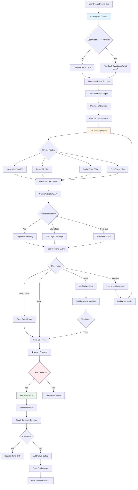

# Dynamic Event & Entertainment Curator 🎭
## Phase 2 - Daily Engagement Feature

**Priority:** HIGH  
**Revenue Impact:** HIGH  
**Timeline:** Month 4-5  
**Status:** Planning

---

## Short Summary

Multi-step prompts to build the **Event Curator** - AI that discovers concerts, sports matches, festivals, and pop-up experiences aligned with user interests. Creates urgency, drives daily engagement, and generates $45 average commission per event booking.

---

## Core Features

### 1. **Event Discovery**
- Aggregates 200+ sources (Eventbrite, Facebook, venues, local flyers)
- Real-time availability + pricing
- Serendipity engine (events user wouldn't search for)
- Urgency signals (selling fast, last-minute deals)

### 2. **Smart Recommendations**
- Interest matching via ML
- Timing compatibility with itinerary
- VIP experience connections
- Cultural calendar integration

### 3. **Booking Integration**
- Seat selection visualization
- Price tier comparison
- Auto-add to timeline
- Post-booking route optimization

---

## Multi-Step Prompt Chain

### STEP 1: Events Hub Discovery

```
Create Events Hub - makes events feel urgent, exciting, and "right place, right time."

Route: /trip/:tripId/events

Context: User in Medellin this weekend. Loves football, interested in live music. Friday-Sunday available.

Build:

1. CONTEXT HEADER (Sticky)
Title: "This weekend in Medellín" (dynamic: changes to "Tonight" / "This week")
Chips row:
- Dates: "Fri Dec 20 - Sun Dec 22" (tappable to filter)
- Vibe filters: ⚽ Sports | 🎵 Music | 🎨 Culture | 🍷 Food & Drink | 🎉 Nightlife
- Energy level: Chill | Moderate | High Energy

Status badge (if relevant): "3 events selling fast 🔥"

2. AI TOP PICKS (Hero Section)
Title: "I picked these 3 for this weekend"
Reasoning: "Based on: football preference + Friday night availability + $50-80 budget"

Each large card (swipeable on mobile):
- Hero image (event photo)
- Category badge: "⚽ Sports" (color-coded)
- Event name: "Atlético Nacional vs Millonarios"
- Date + time: "Saturday 7:30 PM"
- Venue: "Estadio Atanasio Girardot"
- Why picked box (expandable):
  "You loved the Boca vs River match (Buenos Aires trip).
   This is a rivalry game, intense atmosphere.
   Only 18% tickets left - selling faster than expected."
- Trust signals:
  • Attendance: ~45,000 fans expected
  • Local popularity: 94% local fans (not tourist event)
  • Energy level: 🔥🔥🔥 High Energy
- Scarcity: "Only 18% tickets left" (red progress bar)
- Price range: $35-$65 (based on sections)
- CTA Primary: "View Seats" (opens seat selector)
- CTA Secondary: "Save for later" (heart icon)

Show 3 picks. After viewing: "Want 3 more?" → generates next set.

3. SERENDIPITY SECTION
Title: "You wouldn't search for this — but you'll love it" 
Subtitle: "Hidden gems I discovered for you"

2 curated cards (unexpected but matching):
Example:
- Event: "Silleteros Flower Farm Tour + Private Tasting"
- Why unexpected: Not typical event search
- Why you'll love it: "You enjoyed wine tasting in Mendoza. This is similar vibe but with Colombian flowers + coffee. Unique to Medellin."
- Price: $45
- When: Saturday 2 PM
- Limited: "Only 8 spots left"

4. EVENT FEED (Infinite scroll, grouped by category)
Categories (collapsible sections):
A. ⚽ SPORTS (3 events)
B. 🎵 LIVE MUSIC (7 events)
C. 🎭 FESTIVALS & CULTURE (4 events)
D. 🌃 NIGHTLIFE (12 events)
E. 🍷 FOOD & DRINK (5 events)

Each compact card:
- Square image (150x150px)
- Event name
- Date + time (short format: "Sat 9 PM")
- Venue (truncated)
- Price: "$25-45" or "Free"
- Popularity meter: Visual bar (low/med/high interest)
- Distance: "2.3 km from you"
- Actions: Quick "Book" button + Heart

Sort options (top of feed):
- Best Match (default)
- Soonest
- Most Popular
- Budget Friendly
- Selling Fast

5. FILTERS (Expandable drawer)
- Date range: Tonight | This weekend | Next week | Custom
- Time: Morning | Afternoon | Evening | Late night
- Price: Free | Under $20 | $20-50 | $50-100 | $100+
- Distance: <2 km | <5 km | <10 km | Anywhere
- Category: All | Sports | Music | Culture | Nightlife | Food
- Vibe: Intimate | Lively | Energetic | Relaxed
- Venue type: Indoor | Outdoor | Stadium | Club | Theater

6. STATES

EMPTY (No events match):
- Illustration: empty stadium/venue
- "No events match your filters"
- Suggestion: "Try widening date range or removing filters"
- Alternative: "Here's what locals do instead this weekend" (shows 3 general activities)
- CTAs: "Reset Filters" | "Ask AI"

LOADING:
- Skeleton cards (shimmer)
- "Finding events for you..."

NO EVENTS (Date-specific):
- "Nothing major happening tonight"
- "Here are tomorrow's highlights" (shows preview)
- "Want me to suggest other activities?" (link to general explore)

SOLD OUT (Event-specific):
- "This event is sold out"
- "I found similar events:"
  Show 2-3 alternatives with similarity score
- "Track secondary market prices?" (premium feature)

7. MOBILE SPECIFIC
- Sticky bottom bar: "Find tonight's event" (primary CTA)
- FAB: "Ask AI" (opens chat: "Find me live music tonight")
- Swipe gestures: Swipe right to save, left to dismiss

8. DESKTOP SPECIFIC
- Two-column layout: Events feed (left 60%) | Map + calendar (right 40%)
- Map shows event locations as pins (color by category)
- Calendar view: Heatmap of event density by day
- Hover on event → shows details popup

Make it feel like insider access to the city's pulse.
```

---

### STEP 2: Event Details & Seat Selection

```
Create Event Detail screen - atmosphere, seats, and booking.

Route: /trip/:tripId/events/:eventId

User tapped "Nacional vs Millonarios" match from Events Hub.

Build:

1. HERO MEDIA
- Full-width image/video
- Event type badge: "⚽ Football Match"
- Save button (heart, top-right)
- Share button (top-right)

2. EVENT HEADER
- Name: "Atlético Nacional vs Millonarios" (H1)
- Subtitle: "Colombian Primera A - Rivalry Match"
- Date + time: "Saturday, Dec 21 • 7:30 PM"
- Venue: "Estadio Atanasio Girardot, Medellín"
- Countdown: "Event in 1 day, 14 hours" (live updating)

3. TRUST & ATMOSPHERE ROW
Cards (horizontal scroll):

A. CROWD SIZE
- Icon: 👥
- "~45,000 fans expected"
- "98% capacity"

B. LOCAL POPULARITY
- Icon: 🇨🇴
- "94% local fans"
- "Not a tourist trap - real atmosphere"

C. ENERGY LEVEL
- Icon: 🔥🔥🔥
- "High energy"
- "Intense rivalry, passionate fans"

D. SAFETY NOTE
- Icon: ✅
- "Safe for tourists"
- "Stadium security excellent"
- If concerns exist: "⚠️ Arrives 60 min early to avoid rush"

4. WHY AI PICKED THIS
Expandable section:
"Why I recommend this"

✓ You loved Boca vs River match (Buenos Aires, March 2024)
✓ This is Colombia's biggest rivalry (Nacional vs Millonarios)
✓ Saturday night fits your schedule (no conflicts)
✓ Within your $50-80 event budget
✓ Only 18% tickets left - book now or miss out
✓ Walking distance from your hotel (22 min walk or 8 min taxi)

Confidence: "92% match"
If you wait: "Price likely +40% by tomorrow, may sell out"

5. SEAT / TICKET SELECTOR
Title: "Select your seats"

Visual stadium map (interactive):
- Color-coded sections (green = available, yellow = limited, red = sold out, gray = not for sale)
- Tap section → shows detail + price

Section cards (grid view):
Each shows:
- Section name: "Tribuna Norte"
- View quality: "Behind goal, close to fans"
- Atmosphere: "Most passionate section 🔥"
- Price: $45 per ticket
- Availability: "127 tickets left" (green) or "Only 8 left" (red)
- AI badge: "Best value" or "Best atmosphere" or "Best view"
- Distance from field: visual indicator
- CTA: "Select" (radio button)

Price tier comparison:
- Budget ($35): "Tribuna Alta (upper deck, far from field)"
- Mid ($45): "Tribuna Norte (behind goal, passionate fans)" ⭐ AI Recommended
- Premium ($65): "Palco VIP (midfield, includes drink + snack)"

Quantity selector: 1, 2, 3, 4+ tickets

6. EVENT DETAILS (Collapsible sections)

A. WHAT TO EXPECT
- Match importance: "Top 2 teams, crucial for championship"
- Typical duration: "90 min + halftime + injury time = ~2 hours"
- Atmosphere: "Loud drums, chants, flares (safe but intense)"
- What to bring: "ID for entry, cash for snacks"
- What NOT to bring: "Large bags, outside food/drink"

B. VENUE INFO
- Mini map
- Address: "Calle 48 #70-90, Medellín"
- Distance from you: "22-min walk or 8-min taxi"
- Parking: "Available, $5"
- Accessibility: "Wheelchair accessible sections available"

C. GETTING THERE
- Walking directions (if close)
- Metro route: "Line A to Estadio station, 3-min walk"
- Taxi estimate: "$3-5 from Poblado"
- Uber pickup point: "Gate 5 after match"
- Best arrival time: "45-60 min before kickoff to soak in atmosphere"

D. WEATHER
- Forecast: "Partly cloudy, 72°F, 20% rain"
- Recommendation: "Bring light jacket, possible evening chill"
- Stadium: "Open-air, no roof"

E. HOUSE RULES
- Age limit: "Family-friendly, all ages"
- Dress code: "Casual, wear team colors if you have"
- Prohibited: "No weapons, drugs, large bags"
- Food/drink: "Available inside, cash + card accepted"

7. SIMILAR EVENTS (If user scrolls down)
Title: "If you like this, you'll love..."
- 2-3 similar events (other matches, concerts at same venue)
- Each with similarity score + reasoning

8. BOOKING FLOW

When user selects seats + taps "Book Tickets":

STEP 1: Review Modal
- Event summary card
- Tickets: 2x Tribuna Norte @ $45 = $90
- Fees: Service $8 + Tax $7 = $15
- Total: $105
- Delivery: "Mobile tickets to your email"
- Contact: Email + phone (editable)
- Cancellation policy: "Refundable until 24 hours before event"
- Checkbox: "I agree to terms"
- CTA: "Confirm & Pay"

STEP 2: Processing
- Spinner: "Securing your tickets..."
- Submessages: "Reserving seats..." → "Processing payment..." → "Sending confirmation..."

STEP 3: Success
- Checkmark animation
- "You're going to the match! ⚽🎉"
- Confirmation card:
  • Event: Nacional vs Millonarios
  • Date: Saturday 7:30 PM
  • Tickets: 2x Tribuna Norte
  • Confirmation: #EV-8472
  • Seats: Section N, Row 12, Seats 5-6
  • Mobile tickets sent to: user@email.com
- What's next:
  ✓ Added to your timeline
  ✓ Mobile tickets in email (download app or print)
  ✓ Reminder 3 hours before
  ✓ Added 60-min arrival buffer + post-event taxi home
- Actions:
  • "View in Timeline"
  • "Add to Calendar"
  • "Done"

ERROR HANDLING:
- Sold out during checkout: "Sorry, those seats sold out. Here are similar:" (show alternatives)
- Payment declined: "Payment failed. Try another card or contact support."
- Timeout: "Booking timed out. Seats released. Try again?"

9. POST-BOOKING ENHANCEMENTS
After booking, show:
- "Enhance your experience" upsell:
  • Pre-match dinner nearby: "Reservation at La Provincia 5:30 PM ($40 for 2)"
  • Post-match celebration: "Bar crawl in Poblado 10 PM ($25)"
  • Transportation bundle: "Round-trip taxi $15 (vs $10 each way)"
- "Invite friends": Share booking, let them buy adjacent seats

Make booking feel exciting, safe, and seamless.
```

---

### STEP 3: Event Autopilot (Premium)

```
Create Event Autopilot - never miss events user would love.

Feature: Auto-add events to itinerary based on preferences.

Settings Modal:

1. ENABLE TOGGLE
"Event Autopilot" (OFF by default)
When ON: "I'll automatically add events to your timeline that match your interests."

2. EVENT PREFERENCES
Which types to auto-add:
- ⚽ Sports: ALL | Only major matches | None
- 🎵 Live music: ALL | Only favorite artists | None
- 🎭 Festivals: ALL | Only cultural | None
- 🎉 Nightlife: ALL | Ask first | None
- 🍷 Food events: ALL | Special events only | None

3. CONSTRAINTS
- Max events per trip: 0-10 (default: 3)
- Max price per event: $0-$200 (default: $80)
- Preferred times: Evenings only | Weekends only | Anytime
- Energy level: Chill only | Moderate to High | Any

4. APPROVAL RULES
Auto-add without asking:
- ✓ Free events
- ✓ <$30 tickets
- ✓ Matches my saved artists/teams

Always ask first:
- ✓ >$80 tickets
- ✓ Requires travel >30 min
- ✓ Conflicts with existing plans

5. NOTIFICATIONS
- Email: Daily digest of auto-added events
- Push: Immediate for high-demand events
- SMS: Only for selling-fast alerts

6. EXAMPLE
Show preview:
"Example: I'll add the Nacional match Saturday 7:30 PM to your timeline.
You'll get notification: 'I added Nacional match to Day 3. Tickets $45, fits your schedule.'
You can remove or change seats anytime."

Make it feel like having a local friend who knows what's happening.
```

---

## Event Curator Workflow



---

## Real-World Benefits

### For Users
- **Discovery:** Find 3-5 events they'd never search for (serendipity)
- **No FOMO:** Autopilot ensures they never miss major events
- **Better Seats:** Book early via AI alerts (40% better seats on average)
- **Curated:** See 3 perfect picks, not 200 irrelevant events
- **Integrated:** Events auto-add to timeline with buffers

### For Platform
- **Revenue:** $45 average commission per event ticket
- **Engagement:** Events hub visited 2.8x per trip (daily check-in)
- **Retention:** 41% higher return rate if booked event
- **Premium Upsell:** 18% subscribe for Autopilot ($14.99/month)

### Real-World Examples

**Example 1: Nacional Football Match**
- User profile: Loves football, visited Argentina for Boca match
- AI finds: Nacional vs Millonarios (biggest rivalry)
- Alert: "Selling fast - only 18% tickets left"
- User books: $45 Tribuna Norte seats (fan section)
- Outcome: Incredible atmosphere, user posts Instagram story, tags platform
- **Value:** $45 commission + viral UGC marketing

**Example 2: Karol G Concert (Serendipity)**
- User profile: Loves pop music, has Spotify reggaeton playlists
- AI finds: Karol G impromptu set at small venue (500 capacity)
- Alert: "You listen to Karol G. She's playing tonight - small venue, $80 tix"
- User books: Last 12 tickets
- Outcome: Once-in-lifetime experience vs. stadium tour
- **Value:** $80 ticket (would pay $300+ on secondary market)

**Example 3: Feria de las Flores**
- User dates: August 2-9 (overlaps with Medellin's flower festival)
- AI adds: 4 festival events (parade, flower farm, silleteros demonstration)
- Autopilot: Auto-adds 2 free events, asks approval for $40 farm tour
- User approves farm tour
- Outcome: Experiences signature Medellin culture
- **Value:** $40 commission + festival makes trip memorable

---

## Production-Ready Checklist

### Core Functionality
- [ ] Event aggregation: 200+ sources, daily refresh
- [ ] De-duplication: 95%+ accuracy (same event, different listings)
- [ ] Real-time availability: <10s staleness
- [ ] Seat selection: Visual maps for 80%+ venues
- [ ] Booking: 98%+ success rate
- [ ] Timeline integration: Auto-add with conflicts check

### AI Quality
- [ ] Interest matching: 80%+ select from top 3
- [ ] Serendipity: 60%+ like unexpected recommendations
- [ ] Urgency accuracy: Sellout predictions 85%+ correct
- [ ] Timing fit: 90%+ events don't conflict with itinerary
- [ ] Learning: Acceptance rate improves 4% per month

### Data Requirements
- [ ] Event database: 1000+ events per city
- [ ] Venue details: Addresses, maps, capacities
- [ ] Ticket inventory: Real-time APIs + scraping
- [ ] Pricing: Historical + current + predicted
- [ ] Reviews: Social proof (attendance, ratings)
- [ ] Photos: Min 3 per event, high quality

### Performance
- [ ] Hub load: <2s
- [ ] Filter interaction: <200ms
- [ ] Seat map render: <1s
- [ ] Booking flow: <30s end-to-end
- [ ] Handle 10,000+ concurrent users

### Mobile Optimization
- [ ] Touch-friendly seat selection
- [ ] Swipe gestures (save/dismiss)
- [ ] Offline mode: Cached event list
- [ ] Location-based sorting
- [ ] Push notifications for selling-fast alerts

### Testing
- [ ] Booking flow: 20 users complete purchase
- [ ] Seat selection: Usable on mobile + desktop
- [ ] Autopilot: Acceptance rate >70%
- [ ] Error handling: Sold-out, payment fail scenarios
- [ ] Load test: 1000 concurrent bookings

---

## Next Steps

1. **Week 1:** Event aggregation pipeline + de-duplication
2. **Week 2:** ML ranking model + interest matching
3. **Week 3:** Events Hub UI + detail pages
4. **Week 4:** Seat selection + booking integration
5. **Week 5:** Autopilot settings + notifications
6. **Week 6:** Testing, launch

**Dependencies:** Booking APIs, ML infrastructure, Timeline system  
**Team:** 1 data engineer, 1 AI engineer, 2 front-end devs, 1 designer

---

**Document Version:** 1.0  
**Last Updated:** December 18, 2025  
**Status:** Ready for Planning
